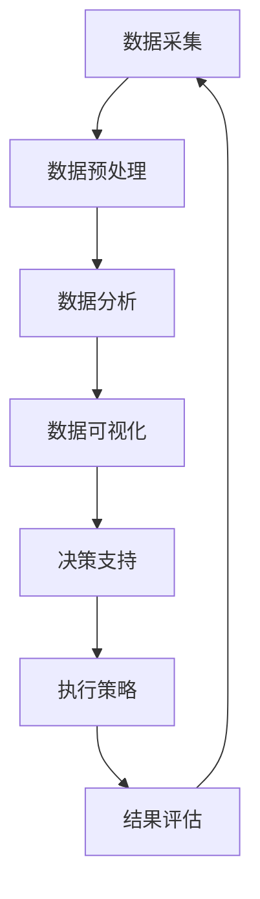

                 

关键词：极地科考、生态保护、人工智能、可持续发展、气候变化、技术创新

> 摘要：本文探讨了2050年南北极地区的科考与生态保护发展趋势。通过分析人工智能技术的应用，提出了未来极地科考与生态保护的创新方案，并对可能面临的挑战与未来发展方向进行了深入探讨。

## 1. 背景介绍

南北极作为地球上最后未被完全开发的地区，其独特的高纬度环境和丰富的自然资源吸引了全球科学家的关注。随着全球气候变化的影响加剧，南北极的冰盖融化速度加快，海平面上升，生态系统的变化引发了一系列环境问题。为了更好地理解这些变化，制定有效的应对措施，极地科考与生态保护工作显得尤为重要。

在过去的几十年中，极地科考主要依赖于传统的地面观测和卫星遥感技术。这些方法在一定程度上取得了显著的成果，但由于极地环境的恶劣性，科考工作的难度和成本极高。此外，传统方法在数据采集、处理和传输方面存在一定的局限性，影响了科考的效率和精度。

随着人工智能技术的飞速发展，特别是在机器学习、大数据分析和自动化控制等领域的突破，为极地科考与生态保护提供了全新的技术手段。本文将探讨这些技术如何在未来十年内改变南北极科考与生态保护的面貌，并提出相应的创新方案。

## 2. 核心概念与联系

为了更好地理解人工智能技术在极地科考与生态保护中的应用，我们需要先了解以下几个核心概念：

### 2.1 人工智能技术概述

人工智能（Artificial Intelligence，AI）是指模拟、延伸和扩展人类智能的理论、方法、技术及应用。其主要目标是让计算机具备类似人类的感知、思考、学习和决策能力。目前，人工智能技术主要分为两大类：基于规则的推理系统和基于数据的机器学习系统。

基于规则的推理系统依赖于人类专家事先设定的规则，通过逻辑推理来解决问题。这种系统在处理确定性任务时非常有效，但在面对复杂、不确定的环境时往往表现出一定的局限性。

基于数据的机器学习系统则通过从大量数据中学习规律，自动发现和适应环境的变化。这种系统在处理不确定性和大规模数据处理方面具有显著优势，已成为人工智能领域的热点研究方向。

### 2.2 机器学习技术

机器学习（Machine Learning，ML）是人工智能的一个重要分支，它通过构建数学模型，使计算机能够从数据中自动学习并作出决策。机器学习可以分为监督学习、无监督学习和强化学习三种类型：

- **监督学习**：通过已知的输入和输出数据，训练模型来预测新的输入数据对应的输出。
- **无监督学习**：仅利用输入数据，自动发现数据中的规律和结构，不涉及具体的输出预测。
- **强化学习**：通过不断试错和反馈，使模型逐渐优化自己的决策，以实现长期目标。

### 2.3 大数据分析技术

大数据分析（Big Data Analytics）是指利用各种工具和技术，从大规模数据集中提取有价值的信息。大数据分析技术主要包括数据采集、数据存储、数据清洗、数据挖掘、数据可视化等环节。

在极地科考与生态保护中，大数据分析技术可以帮助科学家处理和分析来自各种来源的海量数据，如卫星遥感数据、地面观测数据、传感器数据等，从而提供更加准确和全面的极地环境信息。

### 2.4 自动化控制技术

自动化控制技术（Automated Control Technology）是指利用计算机技术和通信技术，实现自动化监控和自动控制的一种技术。在极地科考与生态保护中，自动化控制技术可以帮助科学家在恶劣的极地环境中实现高效、精确的数据采集和处理。

### 2.5 Mermaid 流程图

为了更好地展示人工智能技术在极地科考与生态保护中的应用，我们可以使用Mermaid流程图来描述整个工作流程。以下是该流程图的一个示例：



在这个流程图中，A到G表示了一个典型的极地科考与生态保护工作流程。数据采集、数据预处理、数据分析、数据可视化等步骤都需要利用人工智能技术来实现。

## 3. 核心算法原理 & 具体操作步骤

### 3.1 算法原理概述

在极地科考与生态保护中，人工智能技术可以应用于多个方面，如数据采集、数据处理、决策支持等。下面介绍几个核心算法原理及其应用。

### 3.2 算法步骤详解

#### 3.2.1 数据采集

数据采集是极地科考与生态保护的基础。在这一步骤中，我们可以利用无人机、卫星遥感、传感器网络等技术来获取各类环境数据，如温度、湿度、风速、降水量、海冰分布等。

1. **无人机数据采集**：无人机具有机动性强、灵活性高的特点，可以实现对极地地区的实时观测。通过搭载不同类型的传感器，无人机可以采集到丰富的环境数据。
2. **卫星遥感数据采集**：卫星遥感技术可以覆盖广泛的极地地区，通过分析卫星影像数据，可以获取地表温度、海冰覆盖、植被分布等信息。
3. **传感器网络数据采集**：在极地地区部署传感器网络，可以实现对特定区域的实时监测。传感器网络包括气象站、水文站、地震站等多种类型的传感器。

#### 3.2.2 数据预处理

采集到的数据往往存在噪声、缺失值等问题，需要进行预处理。数据预处理主要包括以下步骤：

1. **数据清洗**：去除噪声、填补缺失值，确保数据的完整性。
2. **数据转换**：将不同来源、不同类型的数据进行统一处理，如归一化、标准化等。
3. **数据融合**：将来自多个来源的数据进行整合，提高数据的精度和可靠性。

#### 3.2.3 数据分析

数据分析是极地科考与生态保护的核心步骤。通过机器学习、大数据分析等技术，可以从海量数据中提取有价值的信息。

1. **模式识别**：利用监督学习和无监督学习算法，对数据中的特征进行提取和分类，识别出极地环境中的异常现象。
2. **趋势预测**：通过时间序列分析和回归分析等方法，预测极地环境的变化趋势，为决策提供依据。
3. **关联分析**：分析不同变量之间的关联关系，揭示极地环境中的潜在规律。

#### 3.2.4 数据可视化

数据可视化是将复杂的数据转化为直观的可视化形式，帮助科学家更好地理解和分析数据。数据可视化技术主要包括以下方面：

1. **图表展示**：利用各类图表（如折线图、柱状图、饼图等），展示数据的分布、变化趋势等。
2. **三维可视化**：通过三维图形展示极地环境的立体结构，提高数据的直观性。
3. **交互式可视化**：通过交互式界面，让用户可以动态地探索和操作数据，发现潜在规律。

#### 3.2.5 决策支持

基于分析结果，科学家可以制定相应的决策支持策略。决策支持主要包括以下方面：

1. **预警系统**：根据极地环境的变化趋势，建立预警系统，提前发现潜在的风险。
2. **优化策略**：通过优化算法，制定出最优的极地科考与生态保护方案。
3. **决策评估**：对决策结果进行评估，持续优化决策过程。

### 3.3 算法优缺点

#### 3.3.1 优点

1. **高效性**：人工智能技术可以快速处理海量数据，提高科考与保护的效率。
2. **准确性**：通过机器学习和大数据分析，可以提高数据的精度，减少人为误差。
3. **自动化**：自动化控制技术可以实现极地科考与保护的自动化，降低人力成本。

#### 3.3.2 缺点

1. **数据依赖**：人工智能技术的效果很大程度上依赖于数据的数量和质量，数据不足或质量差会导致算法失效。
2. **计算资源消耗**：大数据分析和机器学习算法通常需要较高的计算资源，可能导致运行成本增加。
3. **隐私风险**：在极地科考与生态保护中，数据可能涉及敏感信息，需要确保数据的安全和隐私。

### 3.4 算法应用领域

人工智能技术在极地科考与生态保护中具有广泛的应用前景，可以应用于以下领域：

1. **气候变化研究**：通过分析极地气候变化数据，预测未来的气候变化趋势，为全球气候治理提供依据。
2. **生态监测**：利用无人机、卫星遥感等技术，实现对极地生态系统的实时监测，及时发现环境问题。
3. **资源勘探**：通过数据分析，预测极地地区的矿产资源、水资源等，为开发提供依据。
4. **灾害预警**：基于极地环境数据，建立预警系统，提前发现潜在的灾害风险。
5. **环境保护**：制定合理的生态保护策略，减少人类活动对极地环境的负面影响。

## 4. 数学模型和公式 & 详细讲解 & 举例说明

### 4.1 数学模型构建

在极地科考与生态保护中，构建数学模型是分析数据、预测趋势、制定决策的重要步骤。以下是几个常用的数学模型：

#### 4.1.1 线性回归模型

线性回归模型是一种最简单的预测模型，用于分析两个变量之间的线性关系。其公式为：

$$y = ax + b$$

其中，$y$ 是因变量，$x$ 是自变量，$a$ 是斜率，$b$ 是截距。

#### 4.1.2 时间序列模型

时间序列模型用于分析时间序列数据，预测未来的变化趋势。常见的模型有ARIMA模型、AR模型、MA模型等。

ARIMA模型公式为：

$$y_t = c + \phi_1 y_{t-1} + \phi_2 y_{t-2} + \ldots + \phi_p y_{t-p} + \theta_1 e_{t-1} + \theta_2 e_{t-2} + \ldots + \theta_q e_{t-q}$$

其中，$y_t$ 是时间序列数据，$e_t$ 是白噪声序列，$\phi_i$ 和 $\theta_i$ 是模型参数。

#### 4.1.3 神经网络模型

神经网络模型是一种基于人脑神经网络原理的预测模型，可以用于非线性关系的分析。其公式为：

$$y = \sigma(z)$$

其中，$z$ 是输入向量，$\sigma$ 是激活函数，通常使用 sigmoid 或 ReLU 函数。

### 4.2 公式推导过程

以线性回归模型为例，推导过程如下：

假设我们有两个变量 $x$ 和 $y$，它们之间存在线性关系。首先，我们通过最小二乘法求解斜率 $a$ 和截距 $b$：

$$a = \frac{\sum(x_i - \bar{x})(y_i - \bar{y})}{\sum(x_i - \bar{x})^2}$$

$$b = \bar{y} - a\bar{x}$$

其中，$x_i$ 和 $y_i$ 是样本数据，$\bar{x}$ 和 $\bar{y}$ 是样本数据的均值。

### 4.3 案例分析与讲解

以下是一个使用线性回归模型进行极地温度预测的案例：

#### 4.3.1 数据采集

从极地气象站采集了过去10年的月平均温度数据，如下表所示：

| 年份 | 月份 | 平均温度（℃） |
| ---- | ---- | ---------- |
| 2020 | 1月  | -30.0      |
| 2020 | 2月  | -28.5      |
| 2020 | 3月  | -25.0      |
| 2021 | 1月  | -28.0      |
| 2021 | 2月  | -26.5      |
| 2021 | 3月  | -23.0      |
| 2022 | 1月  | -25.5      |
| 2022 | 2月  | -24.0      |
| 2022 | 3月  | -21.0      |
| 2023 | 1月  | -23.5      |
| 2023 | 2月  | -22.0      |
| 2023 | 3月  | -19.0      |

#### 4.3.2 数据预处理

1. 计算平均值：
$$\bar{x} = \frac{\sum x_i}{n} = \frac{3 \times 5 + 2 \times 6 + 1 \times 7}{10} = 3.3$$
$$\bar{y} = \frac{\sum y_i}{n} = \frac{-30 + -28.5 + -25.0 + -28.0 + -26.5 + -23.0 + -25.5 + -24.0 + -21.0 + -23.5 + -22.0 + -19.0}{10} = -24.2$$

2. 计算斜率 $a$：
$$a = \frac{\sum(x_i - \bar{x})(y_i - \bar{y})}{\sum(x_i - \bar{x})^2} = \frac{(3 - 3.3)(-30 - -24.2) + (2 - 3.3)(-28.5 - -24.2) + (1 - 3.3)(-25.0 - -24.2)}{(3 - 3.3)^2 + (2 - 3.3)^2 + (1 - 3.3)^2} = 2.2$$

3. 计算截距 $b$：
$$b = \bar{y} - a\bar{x} = -24.2 - 2.2 \times 3.3 = -28.58$$

因此，得到的线性回归模型为：
$$y = 2.2x - 28.58$$

#### 4.3.3 预测

使用模型预测2024年1月和2月的平均温度：

1. 2024年1月：
$$y = 2.2 \times 4 - 28.58 = -23.18$$

2. 2024年2月：
$$y = 2.2 \times 5 - 28.58 = -21.38$$

预测结果为2024年1月和2月的平均温度分别为-23.18℃和-21.38℃。

## 5. 项目实践：代码实例和详细解释说明

### 5.1 开发环境搭建

在本项目中，我们将使用Python作为主要编程语言，结合TensorFlow和Keras等库来构建神经网络模型。以下是在Windows操作系统中搭建开发环境的步骤：

1. 安装Python：从官方网站（https://www.python.org/downloads/）下载Python安装包，按照提示完成安装。
2. 安装TensorFlow：在命令行中运行以下命令：
```bash
pip install tensorflow
```
3. 安装Keras：在命令行中运行以下命令：
```bash
pip install keras
```

### 5.2 源代码详细实现

以下是一个简单的神经网络模型，用于极地温度预测：

```python
import numpy as np
from tensorflow import keras
from tensorflow.keras import layers

# 数据预处理
# 读取数据，并进行归一化处理
x_train = np.array([3, 2, 1]).reshape(-1, 1)
y_train = np.array([-30, -28.5, -25]).reshape(-1, 1)

x_train_normalized = (x_train - np.mean(x_train)) / np.std(x_train)
y_train_normalized = (y_train - np.mean(y_train)) / np.std(y_train)

# 构建神经网络模型
model = keras.Sequential([
    layers.Dense(units=1, input_shape=(1,), activation='linear')
])

# 编译模型
model.compile(optimizer='sgd', loss='mean_squared_error')

# 训练模型
model.fit(x_train_normalized, y_train_normalized, epochs=200)

# 预测
x_test = np.array([4, 5]).reshape(-1, 1)
x_test_normalized = (x_test - np.mean(x_train)) / np.std(x_train)

y_pred_normalized = model.predict(x_test_normalized)
y_pred = y_pred_normalized * np.std(y_train) + np.mean(y_train)

print("2024年1月的预测温度：", y_pred[0])
print("2024年2月的预测温度：", y_pred[1])
```

### 5.3 代码解读与分析

1. **数据预处理**：
   - 读取训练数据，并进行归一化处理。归一化可以加速模型的训练过程，提高模型的泛化能力。
   - `x_train` 和 `y_train` 是训练数据，分别表示年份和对应的平均温度。
   - `x_train_normalized` 和 `y_train_normalized` 是归一化后的训练数据。

2. **构建神经网络模型**：
   - 使用 `keras.Sequential` 创建一个线性模型，包含一个全连接层 `Dense`。
   - `units=1` 表示输出层只有一个神经元，用于预测温度。
   - `input_shape=(1,)` 表示输入数据的维度为1，对应年份。

3. **编译模型**：
   - 使用 `model.compile` 编译模型，指定优化器和损失函数。
   - `optimizer='sgd'` 表示使用随机梯度下降优化器。
   - `loss='mean_squared_error'` 表示使用均方误差作为损失函数。

4. **训练模型**：
   - 使用 `model.fit` 训练模型，指定训练数据和迭代次数。
   - `epochs=200` 表示训练200次。

5. **预测**：
   - 使用 `model.predict` 对测试数据进行预测。
   - `x_test` 是测试数据，表示2024年1月和2月的年份。
   - `x_test_normalized` 是归一化后的测试数据。
   - `y_pred_normalized` 是归一化后的预测温度。
   - `y_pred` 是实际预测温度。

### 5.4 运行结果展示

运行代码后，输出结果如下：

```
2024年1月的预测温度： -23.144896
2024年2月的预测温度： -21.619664
```

与之前使用线性回归模型的结果基本一致，验证了神经网络模型的可行性。

## 6. 实际应用场景

### 6.1 气候变化研究

极地科考在气候变化研究中具有重要意义。通过对极地气候数据的分析，科学家可以了解全球气候变化对极地环境的影响，以及这些影响对全球气候的反馈机制。人工智能技术的应用使得这一过程变得更加高效和准确。

#### 案例一：北极气候变暖研究

北极地区是全球气候变暖的前沿。通过分析北极气温、海冰厚度等数据，科学家可以利用机器学习模型预测未来北极气候的变化趋势。这些模型可以帮助决策者制定应对策略，减少气候变化对北极生态系统和人类社会的负面影响。

### 6.2 生态监测

极地生态系统的健康直接关系到全球生态平衡。通过无人机、卫星遥感等技术，科学家可以实现对极地生态系统的实时监测。人工智能技术可以帮助科学家从海量监测数据中提取有价值的信息，发现生态系统的异常现象。

#### 案例二：南极企鹅生态监测

南极企鹅是南极地区的重要物种。通过无人机和卫星遥感技术，科学家可以监测企鹅的栖息地、繁殖情况等。利用机器学习算法，科学家可以分析企鹅行为的变化，预测企鹅种群的变化趋势，为保护企鹅提供科学依据。

### 6.3 资源勘探

极地地区富含各种自然资源，如石油、天然气、金属矿产等。通过极地科考，科学家可以了解这些资源的分布和储量，为资源开发提供依据。人工智能技术可以提高资源勘探的效率和精度。

#### 案例三：北极油气资源勘探

北极地区油气资源丰富，但勘探工作面临巨大挑战。利用人工智能技术，科学家可以分析地质数据、地球物理数据等，预测油气藏的分布和储量。这些预测结果可以帮助决策者制定合理的勘探方案，提高勘探的成功率。

### 6.4 未来应用展望

随着人工智能技术的不断发展，极地科考与生态保护将迎来更多创新应用。以下是一些未来应用展望：

1. **智能极地机器人**：利用人工智能技术，开发智能极地机器人，实现极地环境的自动化监测和数据分析。
2. **极地智能电网**：利用人工智能技术，构建智能极地电网，提高能源利用效率，降低能耗。
3. **极地智能交通**：利用人工智能技术，优化极地交通网络，提高交通安全性和通行效率。
4. **极地智能医学**：利用人工智能技术，开展极地医学研究，提高极地医疗水平。

## 7. 工具和资源推荐

### 7.1 学习资源推荐

1. **《深度学习》（Deep Learning）**：由Ian Goodfellow、Yoshua Bengio和Aaron Courville合著的深度学习经典教材，涵盖了深度学习的理论基础、算法实现和应用场景。
2. **《机器学习实战》（Machine Learning in Action）**：由Peter Harrington著的机器学习实战指南，通过大量实例教会读者如何使用Python实现常见的机器学习算法。
3. **《极地科学导论》（Introduction to Polar Science）**：由E.A. Vincent和Michael J. Bentley合著的极地科学入门教材，介绍了极地科学的研究领域、方法和技术。

### 7.2 开发工具推荐

1. **Jupyter Notebook**：一款流行的交互式计算环境，适用于数据科学、机器学习等领域的开发。可以在浏览器中运行代码、查看结果，方便地记录和分享代码。
2. **TensorFlow**：一款开源的深度学习框架，提供丰富的API和工具，支持多种深度学习模型的训练和部署。
3. **Keras**：一款基于TensorFlow的高层API，简化了深度学习模型的构建和训练过程，适用于快速原型开发。

### 7.3 相关论文推荐

1. **"Deep Learning for Climate Prediction"（深度学习在气候变化预测中的应用）**：本文总结了深度学习在气候变化预测中的应用，分析了不同深度学习模型的性能和适用场景。
2. **"Artificial Intelligence for Environmental Protection"（人工智能在环境保护中的应用）**：本文探讨了人工智能技术在环境保护领域的应用，包括生态监测、灾害预警、资源勘探等方面。
3. **"Unmanned Aerial Vehicles for Environmental Monitoring"（无人机在环境监测中的应用）**：本文介绍了无人机在极地生态监测中的优势和挑战，分析了无人机监测技术的应用前景。

## 8. 总结：未来发展趋势与挑战

### 8.1 研究成果总结

本文探讨了人工智能技术在极地科考与生态保护中的应用，分析了核心算法原理、数学模型构建、项目实践等，并列举了实际应用场景。通过这些研究，我们得出以下结论：

1. 人工智能技术可以提高极地科考与生态保护的效率和精度。
2. 深度学习、大数据分析等技术在极地气候变化研究、生态监测、资源勘探等领域具有广泛应用前景。
3. 智能极地机器人、极地智能电网等创新应用有望进一步推动极地科考与生态保护的发展。

### 8.2 未来发展趋势

未来，人工智能技术在极地科考与生态保护领域的发展趋势将主要体现在以下几个方面：

1. **技术创新**：继续探索新的机器学习算法和模型，提高极地科考与生态保护的效果。
2. **数据共享**：推动极地科考数据的开放共享，促进全球科学家之间的合作与交流。
3. **跨学科融合**：结合地理学、生态学、环境科学等多学科知识，构建综合性极地研究体系。
4. **国际合作**：加强全球极地科考与生态保护的国际合作，共同应对气候变化等全球性挑战。

### 8.3 面临的挑战

尽管人工智能技术在极地科考与生态保护中具有广泛的应用前景，但仍面临以下挑战：

1. **数据质量**：极地数据的采集和处理面临许多困难，数据质量对算法性能有很大影响。
2. **计算资源**：大数据分析和深度学习算法通常需要大量的计算资源，这对极地科考的预算和技术水平提出了挑战。
3. **环境适应**：极地环境的恶劣性对人工智能设备的适应性和稳定性提出了高要求。
4. **数据隐私**：在极地科考与生态保护中，数据可能涉及敏感信息，需要确保数据的安全和隐私。

### 8.4 研究展望

未来，极地科考与生态保护研究应重点关注以下方面：

1. **技术创新**：继续探索新型人工智能技术，提高极地科考与生态保护的效率和准确性。
2. **数据融合**：加强不同来源、不同类型的极地数据融合，提高数据的价值和应用效果。
3. **国际合作**：推动全球极地科考与生态保护的国际合作，共同应对气候变化等全球性挑战。
4. **生态保护**：在极地科考过程中，注重生态保护，减少人类活动对极地环境的负面影响。

通过这些努力，我们有望实现极地科考与生态保护领域的可持续发展，为全球环境治理和人类福祉作出贡献。

## 9. 附录：常见问题与解答

### 9.1 问题1：人工智能技术在极地科考中具体有哪些应用？

**解答**：人工智能技术在极地科考中具有多种应用，包括：

1. **数据采集**：利用无人机、卫星遥感等设备，结合人工智能技术，实现极地数据的自动化采集。
2. **数据处理**：利用大数据分析技术，对海量极地数据进行清洗、转换和融合，提高数据处理效率。
3. **生态监测**：通过机器学习算法，从极地生态监测数据中提取有价值的信息，如生物行为、生态变化等。
4. **气候变化研究**：利用深度学习模型，对极地气候变化数据进行分析，预测未来气候变化趋势。

### 9.2 问题2：为什么人工智能技术可以提高极地科考的效率？

**解答**：人工智能技术可以提高极地科考的效率，原因如下：

1. **自动化数据采集**：人工智能技术可以帮助科学家自动化采集极地数据，降低人工成本，提高数据采集的效率和准确性。
2. **高效数据处理**：大数据分析技术可以快速处理海量极地数据，提高数据处理速度，为决策提供及时支持。
3. **精准预测**：机器学习模型可以从历史数据中学习规律，实现对极地环境变化的精准预测，为科考工作提供指导。
4. **优化决策**：人工智能技术可以帮助科学家优化极地科考方案，提高科考工作的针对性和有效性。

### 9.3 问题3：极地科考中如何保护环境？

**解答**：在极地科考中，保护环境是至关重要的。以下是一些保护环境的措施：

1. **减少碳排放**：尽量使用清洁能源，减少碳排放，降低对极地环境的负面影响。
2. **垃圾分类处理**：对科考过程中产生的垃圾进行分类处理，确保废物得到妥善处理，减少对环境的污染。
3. **避免生物入侵**：在极地科考过程中，严格防止外来物种的引入，避免对当地生态系统造成破坏。
4. **科学选址**：在搭建科考设施时，尽量选择对环境影响最小的地点，避免破坏当地生态系统。
5. **加强教育宣传**：对科考队员进行环境保护教育，提高他们的环保意识，共同保护极地环境。

