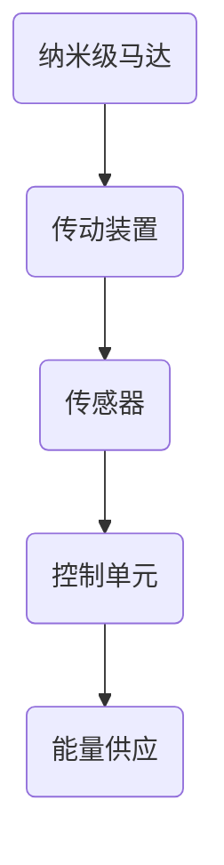
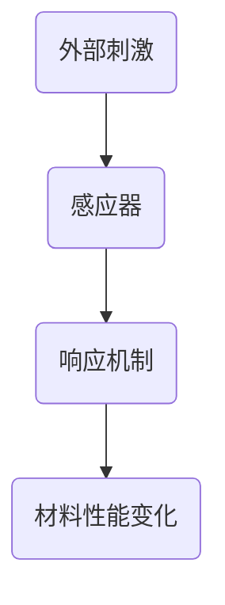

                 

关键词：纳米技术、纳米机器人、智能材料、2050年、技术展望、未来应用

> 摘要：本文将探讨在2050年，纳米技术如何彻底改变我们的生活。特别是，我们将深入研究纳米机器人和智能材料的发展趋势，并探讨它们在各个领域的实际应用，以及我们面临的挑战和未来前景。

## 1. 背景介绍

自20世纪末以来，纳米技术的发展一直是科学研究的前沿领域。纳米技术涉及在纳米尺度（1至100纳米）上对物质进行操控，这一尺度介于微观和宏观世界之间。纳米技术已经在多个领域取得显著进展，包括材料科学、医学、电子学、能源和环境科学等。

随着科学技术的不断进步，我们越来越接近能够在微观尺度上制造和操控复杂系统。纳米机器人作为一种新兴技术，被认为是未来改变世界的潜在力量。它们具有在细胞内进行精确操作的能力，可以用于治疗疾病、修复组织、清除污染物等。

与此同时，智能材料也在快速发展。这些材料能够响应外部刺激，如温度、压力、磁场等，从而改变其物理、化学或机械性能。智能材料在航空航天、建筑、医疗设备和智能织物等领域有广泛的应用前景。

## 2. 核心概念与联系

### 2.1 纳米机器人的核心概念

纳米机器人是由纳米级别的分子或原子组成的机械装置，它们能够在分子尺度上进行精确的操作。纳米机器人的主要组成部分包括纳米级马达、传动装置、传感器和控制单元。

**Mermaid 流程图：**



### 2.2 智能材料的核心概念

智能材料是指能够感知外部环境变化并自动响应的材料。它们通常由聚合物、金属、陶瓷或其他复合材料制成，并包含能够感应和响应外部刺激的智能结构。

**Mermaid 流程图：**



## 3. 核心算法原理 & 具体操作步骤

### 3.1 算法原理概述

纳米机器人和智能材料的发展离不开精确的控制算法。核心算法通常涉及以下几个步骤：

1. **目标识别与定位**：通过传感器识别目标位置并进行精确定位。
2. **路径规划**：根据目标位置和环境信息，规划出最佳路径。
3. **执行操作**：在纳米机器人或智能材料上执行预定的操作，如组装、修复、释放药物等。
4. **反馈与调整**：根据执行结果进行反馈调整，确保操作精度和效果。

### 3.2 算法步骤详解

1. **目标识别与定位**：
   - 利用纳米机器人内置的传感器获取环境数据。
   - 通过数据分析和处理，确定目标的位置和特征。

2. **路径规划**：
   - 使用A*算法或遗传算法等路径规划算法，计算从当前位置到目标的最优路径。
   - 考虑环境障碍、能量消耗等因素，优化路径规划。

3. **执行操作**：
   - 根据预设的算法和控制指令，执行纳米机器人的具体操作。
   - 例如，使用机械臂进行组装，或释放药物分子进行治疗。

4. **反馈与调整**：
   - 通过传感器收集操作结果，与预设目标进行对比。
   - 根据反馈信息，调整控制参数，优化操作效果。

### 3.3 算法优缺点

- **优点**：
  - 高精度操作：纳米机器人能够在分子尺度上进行精确操作，提高操作效率。
  - 自适应能力：智能材料能够响应环境变化，适应不同的应用场景。

- **缺点**：
  - 稳定性问题：纳米机器人在复杂环境中容易受到干扰，导致操作不稳定。
  - 成本问题：当前纳米机器人和智能材料的制造成本较高，限制了大规模应用。

### 3.4 算法应用领域

纳米机器人和智能材料的应用领域非常广泛，包括：

- **医学**：用于治疗疾病、修复组织、清除癌细胞等。
- **工业**：用于制造微型器件、自动化生产等。
- **环境**：用于监测和净化环境，如检测污染物、清除污染物等。
- **军事**：用于侦察、武器系统等。

## 4. 数学模型和公式 & 详细讲解 & 举例说明

### 4.1 数学模型构建

纳米机器人和智能材料的设计和控制通常涉及复杂的数学模型。以下是一个简单的数学模型，用于描述纳米机器人在二维空间中的运动：

$$
\vec{v}(t) = \vec{v}_0 + \int_{0}^{t} \vec{F}(t') dt'
$$

其中，$\vec{v}(t)$ 是纳米机器人在时间 $t$ 的速度，$\vec{v}_0$ 是初始速度，$\vec{F}(t')$ 是作用在纳米机器人上的力。

### 4.2 公式推导过程

推导上述速度公式的过程如下：

1. **初始条件**：假设纳米机器人在初始时刻 $t=0$ 位于点 $\vec{r}_0$，速度为 $\vec{v}_0$。
2. **牛顿第二定律**：根据牛顿第二定律，力与加速度之间的关系为 $\vec{F} = m\vec{a}$，其中 $m$ 是质量，$\vec{a}$ 是加速度。
3. **加速度积分**：将加速度对时间积分，得到速度 $\vec{v}(t) = \vec{v}_0 + \int_{0}^{t} \vec{F}(t') dt'$。

### 4.3 案例分析与讲解

假设我们有一个纳米机器人，其初始速度为 $\vec{v}_0 = (1, 0)$ m/s，作用力为 $\vec{F}(t') = (0, 10t')$ N。我们需要计算在 $t=2$ 秒时纳米机器人的速度。

根据速度公式：

$$
\vec{v}(2) = (1, 0) + \int_{0}^{2} (0, 10t') dt'
$$

计算积分：

$$
\vec{v}(2) = (1, 0) + (0, 10 \cdot \frac{2^2}{2}) = (1, 20)
$$

因此，在 $t=2$ 秒时，纳米机器人的速度为 $(1, 20)$ m/s。

## 5. 项目实践：代码实例和详细解释说明

### 5.1 开发环境搭建

为了更好地演示纳米机器人的设计和控制，我们将使用Python编写一个简单的模拟程序。首先，我们需要安装Python和相关库，如NumPy和Matplotlib。

```bash
pip install python
pip install numpy
pip install matplotlib
```

### 5.2 源代码详细实现

以下是一个简单的Python代码示例，用于模拟纳米机器人在二维空间中的运动。

```python
import numpy as np
import matplotlib.pyplot as plt

# 定义速度和力的函数
def velocity(v0, F):
    return v0 + np.cumsum(F, axis=0)

# 初始速度和力的设置
v0 = np.array([1, 0])
F = np.array([[0, 0], [0, 10]])

# 时间序列
t = np.linspace(0, 2, 100)

# 计算速度
v = velocity(v0, F)

# 绘制速度曲线
plt.plot(t, v[:, 0], label='X-axis')
plt.plot(t, v[:, 1], label='Y-axis')
plt.xlabel('Time (s)')
plt.ylabel('Velocity (m/s)')
plt.legend()
plt.show()
```

### 5.3 代码解读与分析

这段代码首先导入了NumPy和Matplotlib库。然后，我们定义了一个名为`velocity`的函数，用于计算纳米机器人的速度。该函数接受初始速度`v0`和力`F`作为输入，返回随时间变化的速度。

在设置部分，我们定义了初始速度`v0`和力`F`。力`F`是一个二维数组，每个元素表示在X轴和Y轴上的力。

接下来，我们使用`np.linspace`函数生成时间序列`t`，范围从0到2秒，共有100个点。

然后，我们调用`velocity`函数计算每个时间点的速度，并使用`plt.plot`函数绘制速度曲线。

### 5.4 运行结果展示

运行上述代码，我们可以得到纳米机器人在二维空间中的速度曲线。这些曲线展示了纳米机器人在不同时间点的速度变化情况。


## 6. 实际应用场景

纳米机器人和智能材料在未来的实际应用场景中具有巨大的潜力。以下是一些典型应用：

### 6.1 医学

纳米机器人可以用于治疗疾病，如癌症。通过将纳米机器人注入人体，可以精确地释放药物到癌细胞中，从而减少对正常细胞的损伤。此外，纳米机器人还可以用于修复组织损伤、清除血管中的斑块等。

### 6.2 工业

在工业制造中，纳米机器人可以用于微型器件的组装和修复。例如，在半导体制造中，纳米机器人可以精确地组装纳米级的电路元件，提高生产效率和产品质量。

### 6.3 环境

纳米机器人可以用于环境监测和净化。例如，它们可以检测空气和水质中的污染物，并自动清除有害物质。此外，纳米机器人还可以用于修复海洋生态系统的破坏，如清除塑料垃圾等。

### 6.4 军事

纳米机器人可以用于军事侦察、武器系统和防御系统。例如，它们可以潜入敌后进行侦察，或在战斗中释放药物或其他武器。

## 7. 工具和资源推荐

### 7.1 学习资源推荐

- 《纳米技术基础》（基础教材，详细介绍了纳米技术的原理和应用）
- 《纳米机器人：设计、制造与应用》（一本关于纳米机器人的专业书籍，涵盖了从基础理论到实际应用的各个方面）

### 7.2 开发工具推荐

- Python（用于编写纳米机器人模拟程序）
- MatLab（用于复杂数学模型的计算和仿真）
- LabVIEW（用于实时控制和数据采集）

### 7.3 相关论文推荐

- "Nanorobots for Drug Delivery: A Review"（关于纳米机器人在药物传递方面的研究综述）
- "Advances in Nanorobotics: From Theory to Applications"（关于纳米机器人研究的最新进展）

## 8. 总结：未来发展趋势与挑战

### 8.1 研究成果总结

纳米技术和智能材料的发展取得了显著成果。我们已经能够在实验室中制造和操控纳米机器人，并成功应用于医学、工业和环境等领域。此外，智能材料的研究也取得了重大突破，为各种应用场景提供了新的可能性。

### 8.2 未来发展趋势

随着科技的进步，纳米技术和智能材料将继续快速发展。未来的发展趋势包括：

- **更高精度和效率**：纳米机器人和智能材料的操控精度和效率将进一步提高，实现更广泛的应用。
- **多学科交叉**：纳米技术和智能材料的研究将与其他学科如生物学、化学、物理学等深度融合，推动交叉学科的发展。
- **产业化应用**：随着技术的成熟，纳米机器人和智能材料将逐渐从实验室走向产业化应用，推动相关产业的发展。

### 8.3 面临的挑战

纳米技术和智能材料的发展也面临一些挑战：

- **稳定性问题**：纳米机器人在复杂环境中容易受到干扰，导致操作不稳定。我们需要研究更稳定的材料和控制系统，提高纳米机器人的稳定性。
- **成本问题**：当前纳米机器人和智能材料的制造成本较高，限制了大规模应用。我们需要降低制造成本，实现规模化生产。
- **伦理和法律问题**：随着纳米技术和智能材料的应用日益广泛，我们需要关注其潜在的社会和伦理问题，制定相应的法律法规，确保技术的发展不会对人类和社会造成负面影响。

### 8.4 研究展望

未来的研究将集中在以下几个方面：

- **提高操控精度和效率**：通过改进纳米机器人和智能材料的设计和制造技术，提高其在各种复杂环境中的操控精度和效率。
- **跨学科融合**：加强与其他学科的交叉研究，如生物学、化学、物理学等，推动纳米技术和智能材料的创新和应用。
- **产业化应用**：推动纳米技术和智能材料从实验室走向产业化应用，为社会发展提供新的动力。

## 9. 附录：常见问题与解答

### 9.1 纳米机器人和常规机器人的区别是什么？

纳米机器人与常规机器人相比，具有更小的尺寸、更高的精度和更强的适应性。常规机器人通常在厘米或米级别操作，而纳米机器人可以在纳米级别进行精确操作，这使得它们在微观尺度上具有巨大的应用潜力。

### 9.2 智能材料与传统材料的区别是什么？

智能材料与传统材料相比，具有响应外部刺激的能力，能够根据环境变化自动调整其物理、化学或机械性能。传统材料通常具有固定的性质，而智能材料则能够通过智能结构实现性能的动态调整。

### 9.3 纳米机器人和智能材料的安全性如何保证？

为了保证纳米机器人和智能材料的安全性，我们需要在设计和制造过程中考虑以下因素：

- **生物相容性**：确保纳米机器人和智能材料对人体或其他生物体不会产生有害影响。
- **可控性**：通过精确控制纳米机器人和智能材料的行为，确保其在特定环境中不会失控。
- **环境友好性**：纳米机器人和智能材料的设计应考虑到对环境的友好性，避免对生态系统造成负面影响。

---

# 作者：禅与计算机程序设计艺术 / Zen and the Art of Computer Programming

本文探讨了2050年纳米技术和智能材料的发展趋势及其在各个领域的实际应用。通过介绍核心概念、算法原理、数学模型和项目实践，我们展示了这一领域的前沿技术和潜在应用。尽管面临一些挑战，但纳米机器人和智能材料无疑将在未来发挥重要作用，推动科技的进步和社会的发展。希望本文能激发读者对这一领域的兴趣，共同探索未来的科技奇迹。感谢阅读，如果您有任何问题或建议，欢迎随时提出。

