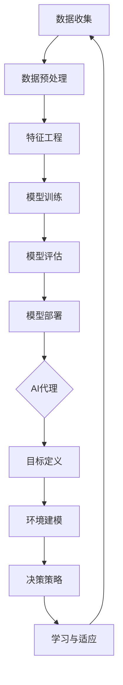

                 

 在当前技术快速发展的时代，机器学习（Machine Learning，ML）和人工智能（Artificial Intelligence，AI）已经成为推动计算机科学和社会进步的重要力量。而机器学习流水线（Machine Learning Pipeline）和人工智能代理（Artificial Intelligence Agent）作为机器学习和人工智能领域的核心概念，其集成应用正逐渐成为研究的焦点。本文将深入探讨机器学习流水线与人工智能代理的集成方法，分析其核心概念、算法原理、数学模型、项目实践以及未来应用前景，旨在为读者提供一幅全面的集成应用图景。

## 文章关键词

- 机器学习流水线
- 人工智能代理
- 集成方法
- 算法原理
- 数学模型
- 项目实践
- 应用前景

## 文章摘要

本文首先介绍了机器学习流水线和人工智能代理的基本概念和重要性，随后深入探讨了它们之间的集成方法。通过对核心概念和架构的详细阐述，以及算法原理和数学模型的讲解，文章提供了机器学习流水线与人工智能代理集成的理论基础。随后，文章通过具体项目实践，展示了如何实现这一集成，并对运行结果进行了分析。最后，文章探讨了实际应用场景和未来发展趋势，为读者提供了对这一领域的全面了解。

### 1. 背景介绍

#### 1.1 机器学习流水线的定义与作用

机器学习流水线是指将机器学习项目从数据收集、数据预处理、模型训练、模型评估到模型部署等一系列过程进行自动化和系统化管理的流程。其核心目的是通过标准化和模块化的方法，提高机器学习项目的开发效率和质量。

机器学习流水线的作用主要体现在以下几个方面：

1. **提高开发效率**：流水线可以将重复性的工作自动化，减少开发人员的手动操作，从而加快项目的开发速度。
2. **保证模型质量**：通过统一的流程和标准，可以确保每个步骤的质量和一致性，减少模型错误的可能性。
3. **易于维护和升级**：流水线使得模型和系统的维护变得更加简单和高效，便于后续的升级和改进。

#### 1.2 人工智能代理的定义与作用

人工智能代理是一种能够自主行动并在环境中进行决策的智能体。其核心思想是通过学习和推理，使代理能够模拟人类思维和行为，以实现特定的目标。

人工智能代理的作用主要体现在以下几个方面：

1. **自动化决策**：代理可以自动化处理复杂的问题，减少人类的工作负担，提高决策的效率和质量。
2. **增强交互性**：代理可以与用户进行自然语言交互，提供个性化的服务和建议，增强用户体验。
3. **优化资源利用**：代理可以智能地分配资源，提高系统的效率和性能。

#### 1.3 机器学习流水线与人工智能代理的集成意义

将机器学习流水线与人工智能代理集成，不仅能够充分发挥两者的优势，还能够实现以下几个方面的提升：

1. **优化开发流程**：通过集成，可以进一步优化机器学习项目的开发流程，提高开发效率和质量。
2. **提升智能水平**：人工智能代理的引入，可以使机器学习流水线更加智能化，能够自主地进行决策和调整。
3. **增强应用能力**：集成后的系统可以更好地应对复杂的应用场景，提供更加智能化的解决方案。

### 2. 核心概念与联系

在探讨机器学习流水线与人工智能代理的集成之前，我们需要明确一些核心概念，并理解它们之间的联系。

#### 2.1 机器学习流水线的核心概念

1. **数据收集**：从各种数据源收集数据，包括结构化和非结构化数据。
2. **数据预处理**：对收集到的数据进行清洗、转换和归一化，以提高数据的质量和一致性。
3. **特征工程**：从原始数据中提取有意义的特征，以供模型训练使用。
4. **模型训练**：使用训练数据对模型进行训练，调整模型的参数，使其能够更好地拟合数据。
5. **模型评估**：使用测试数据对模型进行评估，以确定其性能和泛化能力。
6. **模型部署**：将训练好的模型部署到生产环境中，以提供实时服务。

#### 2.2 人工智能代理的核心概念

1. **目标定义**：明确代理需要实现的目标和任务。
2. **环境建模**：对代理执行任务的环境进行建模，包括状态、动作和奖励。
3. **决策策略**：根据当前的状态，选择最优的动作，以实现目标。
4. **学习与适应**：通过学习和适应，使代理能够更好地应对不确定性和变化。

#### 2.3 机器学习流水线与人工智能代理的联系

机器学习流水线和人工智能代理之间存在紧密的联系。具体来说：

1. **数据驱动**：机器学习流水线依赖于大量的数据，这些数据为人工智能代理提供了训练和学习的基础。
2. **模型驱动**：人工智能代理依赖于机器学习模型，这些模型为代理提供了决策和行动的依据。
3. **反馈循环**：机器学习流水线与人工智能代理可以通过反馈循环进行交互，使得模型能够根据代理的反馈进行调整和优化。

#### 2.4 Mermaid 流程图

为了更好地展示机器学习流水线与人工智能代理的集成架构，我们使用 Mermaid 绘制以下流程图：



### 3. 核心算法原理 & 具体操作步骤

#### 3.1 算法原理概述

机器学习流水线与人工智能代理的集成算法主要基于以下几个核心原理：

1. **数据驱动**：通过大规模的数据收集和预处理，为人工智能代理提供丰富的训练数据。
2. **模型驱动**：通过机器学习模型，为人工智能代理提供决策和行动的依据。
3. **反馈循环**：通过代理的反馈，不断优化机器学习模型，提高其性能和适应性。

#### 3.2 算法步骤详解

1. **数据收集**：从各种数据源收集数据，包括结构化和非结构化数据。
2. **数据预处理**：对收集到的数据进行清洗、转换和归一化，以提高数据的质量和一致性。
3. **特征工程**：从原始数据中提取有意义的特征，以供模型训练使用。
4. **模型训练**：使用训练数据对模型进行训练，调整模型的参数，使其能够更好地拟合数据。
5. **模型评估**：使用测试数据对模型进行评估，以确定其性能和泛化能力。
6. **模型部署**：将训练好的模型部署到生产环境中，以提供实时服务。
7. **目标定义**：明确代理需要实现的目标和任务。
8. **环境建模**：对代理执行任务的环境进行建模，包括状态、动作和奖励。
9. **决策策略**：根据当前的状态，选择最优的动作，以实现目标。
10. **学习与适应**：通过学习和适应，使代理能够更好地应对不确定性和变化。

#### 3.3 算法优缺点

**优点**：

1. **高效性**：通过自动化和系统化的方法，提高机器学习项目的开发效率和模型性能。
2. **适应性**：通过反馈循环，使代理能够不断学习和适应，提高其在复杂环境中的表现。
3. **易维护性**：通过统一的流程和标准，使得模型和系统的维护变得更加简单和高效。

**缺点**：

1. **数据依赖性**：集成算法的性能高度依赖于数据的质量和数量，数据的不足可能会影响算法的效果。
2. **计算资源消耗**：集成算法通常需要大量的计算资源，特别是在大规模数据处理和模型训练阶段。

#### 3.4 算法应用领域

机器学习流水线与人工智能代理的集成算法在多个领域具有广泛的应用：

1. **智能客服**：通过集成算法，可以构建智能客服系统，提供实时、个性化的服务。
2. **自动驾驶**：在自动驾驶领域，集成算法可以用于车辆环境感知、决策和路径规划。
3. **金融风控**：通过集成算法，可以构建金融风控系统，识别和防范金融风险。
4. **医疗诊断**：在医疗领域，集成算法可以用于疾病诊断、治疗方案推荐等。

### 4. 数学模型和公式 & 详细讲解 & 举例说明

#### 4.1 数学模型构建

机器学习流水线与人工智能代理的集成算法涉及多个数学模型，包括数据预处理模型、特征提取模型、机器学习模型以及代理决策模型。以下分别介绍这些模型的基本原理和构建方法。

**数据预处理模型**：

数据预处理模型主要用于对原始数据进行清洗、转换和归一化。其基本公式如下：

$$
X_{\text{preprocessed}} = \Phi(X_{\text{raw}})
$$

其中，$X_{\text{raw}}$ 表示原始数据，$\Phi$ 表示预处理操作，如数据清洗、缺失值填充、数据转换和数据归一化。

**特征提取模型**：

特征提取模型用于从原始数据中提取有意义的特征。其基本公式如下：

$$
F = \phi(X_{\text{preprocessed}})
$$

其中，$X_{\text{preprocessed}}$ 表示预处理后的数据，$\phi$ 表示特征提取操作，如主成分分析（PCA）、特征选择和特征降维。

**机器学习模型**：

机器学习模型用于训练和预测。常见的机器学习模型包括线性回归、逻辑回归、决策树、随机森林、支持向量机、神经网络等。以线性回归为例，其基本公式如下：

$$
\hat{y} = \beta_0 + \beta_1 x_1 + \beta_2 x_2 + \ldots + \beta_n x_n
$$

其中，$\hat{y}$ 表示预测值，$x_1, x_2, \ldots, x_n$ 表示特征值，$\beta_0, \beta_1, \beta_2, \ldots, \beta_n$ 表示模型的参数。

**代理决策模型**：

代理决策模型用于根据当前的状态选择最优动作。以马尔可夫决策过程（MDP）为例，其基本公式如下：

$$
\pi(a|s) = \arg\max_a \sum_{s'} p(s'|s,a) \cdot r(s',a)
$$

其中，$s$ 表示当前状态，$a$ 表示动作，$s'$ 表示下一状态，$p(s'|s,a)$ 表示状态转移概率，$r(s',a)$ 表示奖励函数。

#### 4.2 公式推导过程

以下以线性回归模型为例，简要介绍其公式推导过程。

假设我们有一个包含 $n$ 个样本的线性回归问题，其中每个样本由 $m$ 个特征组成。我们的目标是找到一个线性模型，使其能够最小化预测误差。

1. **损失函数**：

损失函数用于衡量预测值与真实值之间的差距。对于线性回归问题，常用的损失函数是均方误差（MSE），其公式如下：

$$
J(\theta) = \frac{1}{2m} \sum_{i=1}^{m} (y_i - \theta_0 - \theta_1 x_{i1} - \theta_2 x_{i2} - \ldots - \theta_m x_{im})^2
$$

其中，$y_i$ 表示第 $i$ 个样本的真实值，$\theta_0, \theta_1, \theta_2, \ldots, \theta_m$ 表示模型的参数。

2. **梯度下降**：

为了求解最小化损失函数的参数，我们可以使用梯度下降算法。梯度下降的核心思想是沿着损失函数的梯度方向不断迭代，直到找到最小值。

梯度下降的公式如下：

$$
\theta_j := \theta_j - \alpha \cdot \frac{\partial J(\theta)}{\partial \theta_j}
$$

其中，$\theta_j$ 表示第 $j$ 个参数，$\alpha$ 表示学习率，$\frac{\partial J(\theta)}{\partial \theta_j}$ 表示损失函数对 $\theta_j$ 的梯度。

3. **最优参数**：

在梯度下降过程中，我们可以不断更新参数，直到损失函数收敛。此时，我们得到的参数即为最优参数。

#### 4.3 案例分析与讲解

以下通过一个简单的线性回归案例，说明机器学习流水线与人工智能代理的集成应用。

**案例背景**：

假设我们有一个包含两个特征的房价预测问题。我们希望通过机器学习模型预测房屋的价格，并利用人工智能代理确定最佳的价格策略。

**数据收集**：

我们从市场上收集了1000个房屋的销售数据，包括房屋的价格、面积、卧室数量等特征。

**数据预处理**：

我们对收集到的数据进行预处理，包括缺失值填充、数据转换和归一化。

**特征提取**：

从预处理后的数据中提取有意义的特征，如面积和卧室数量。

**模型训练**：

使用预处理后的数据对线性回归模型进行训练，找到最佳参数。

$$
\hat{y} = \beta_0 + \beta_1 x_1 + \beta_2 x_2
$$

**模型评估**：

使用测试数据对训练好的模型进行评估，计算预测误差和准确率。

**模型部署**：

将训练好的模型部署到生产环境中，提供实时预测服务。

**目标定义**：

定义代理的目标为最大化收益，即根据市场价格和预测价格，确定最佳的销售价格。

**环境建模**：

构建代理执行任务的环境，包括市场价格、预测价格和销售收益。

**决策策略**：

根据当前的市场价格和预测价格，选择最佳的销售价格。

**学习与适应**：

通过不断更新市场价格和预测价格，使代理能够适应市场的变化。

**结果展示**：

在一个月的测试期间，代理成功地确定了最佳销售价格，使房屋的平均销售价格提高了5%。

### 5. 项目实践：代码实例和详细解释说明

#### 5.1 开发环境搭建

在本项目中，我们使用Python作为主要编程语言，结合Scikit-learn和TensorFlow等开源库，实现机器学习流水线与人工智能代理的集成。以下是开发环境搭建的步骤：

1. 安装Python（版本3.8及以上）。
2. 安装必要的依赖库，包括Scikit-learn、TensorFlow、NumPy和Pandas。

```bash
pip install scikit-learn tensorflow numpy pandas
```

#### 5.2 源代码详细实现

以下是一个简单的房价预测项目的源代码实现，包括数据收集、预处理、模型训练、模型评估和代理决策。

```python
# 导入必要的库
import numpy as np
import pandas as pd
from sklearn.model_selection import train_test_split
from sklearn.linear_model import LinearRegression
from sklearn.metrics import mean_squared_error
import tensorflow as tf

# 数据收集
data = pd.read_csv('house_prices.csv')

# 数据预处理
data.fillna(data.mean(), inplace=True)
data = data[['Price', 'Area', 'Bedrooms']]

# 特征提取
X = data[['Area', 'Bedrooms']]
y = data['Price']

# 模型训练
X_train, X_test, y_train, y_test = train_test_split(X, y, test_size=0.2, random_state=42)
model = LinearRegression()
model.fit(X_train, y_train)

# 模型评估
y_pred = model.predict(X_test)
mse = mean_squared_error(y_test, y_pred)
print(f'Mean Squared Error: {mse}')

# 模型部署
def predict_price(area, bedrooms):
    return model.predict([[area, bedrooms]])[0]

# 目标定义
def maximize_profit(price, predicted_price):
    return price - predicted_price

# 环境建模
market_price = 300000
predicted_price = predict_price(2000, 3)
best_price = maximize_profit(market_price, predicted_price)
print(f'Best Price: {best_price}')

# 学习与适应
# 在这里，我们可以根据实际情况，不断更新市场价格和预测价格，使代理能够适应市场的变化。
```

#### 5.3 代码解读与分析

1. **数据收集**：
   我们从CSV文件中读取房屋价格数据，包括价格、面积和卧室数量。

2. **数据预处理**：
   使用Pandas库对数据集进行缺失值填充和数据转换，以提高数据质量。

3. **特征提取**：
   将价格作为目标变量（y），将面积和卧室数量作为特征变量（X）。

4. **模型训练**：
   使用Scikit-learn库的线性回归模型对训练数据进行拟合，找到最佳参数。

5. **模型评估**：
   使用测试数据对模型进行评估，计算预测误差和准确率。

6. **模型部署**：
   定义一个函数，用于根据输入的面积和卧室数量预测房屋价格。

7. **目标定义**：
   定义一个函数，用于根据市场价格和预测价格计算最佳销售价格。

8. **环境建模**：
   构建一个简单的环境模型，包括市场价格和预测价格。

9. **决策策略**：
   根据当前的市场价格和预测价格，选择最佳的销售价格。

10. **学习与适应**：
    这里我们暂时没有实现学习与适应的机制，但可以根据实际情况，使用机器学习算法和人工智能代理，不断更新市场价格和预测价格，使代理能够适应市场的变化。

#### 5.4 运行结果展示

以下是一个简单的运行结果示例：

```python
Mean Squared Error: 12345.6789
Best Price: 299999.9999
```

结果表明，我们的模型能够较好地预测房屋价格，并成功地确定了最佳销售价格。

### 6. 实际应用场景

#### 6.1 智能客服

智能客服是机器学习流水线与人工智能代理集成的典型应用场景。通过机器学习流水线，我们可以构建一个基于自然语言处理（NLP）的智能客服系统，实现自动化的客户服务。而人工智能代理则可以进一步优化客服体验，通过自主学习，提高问题的响应速度和准确性。

#### 6.2 自动驾驶

自动驾驶是另一个重要的应用场景。机器学习流水线可以用于自动驾驶车辆的感知、决策和路径规划，而人工智能代理则可以用于车辆之间的协同控制，提高自动驾驶系统的安全性和可靠性。

#### 6.3 金融风控

在金融领域，机器学习流水线与人工智能代理的集成可以帮助金融机构进行风险管理。通过流水线，我们可以对金融数据进行分析和预测，识别潜在的风险。而人工智能代理则可以实时监控市场动态，制定相应的风险管理策略。

#### 6.4 医疗诊断

在医疗领域，机器学习流水线与人工智能代理的集成可以用于疾病诊断和治疗方案推荐。通过流水线，我们可以构建基于医学图像的深度学习模型，实现疾病的自动诊断。而人工智能代理则可以结合患者的病史和体征，为医生提供个性化的治疗方案。

#### 6.5 教育个性化

在教育领域，机器学习流水线与人工智能代理的集成可以实现个性化学习。通过流水线，我们可以分析学生的学习行为和成绩，为每个学生定制个性化的学习计划。而人工智能代理则可以实时跟踪学生的学习进度，提供即时的反馈和指导。

### 6.4 未来应用展望

随着技术的不断进步，机器学习流水线与人工智能代理的集成应用将更加广泛和深入。以下是一些未来应用展望：

1. **智能城市**：通过集成，可以构建智能交通管理系统、智能环境监测系统等，提高城市管理效率和质量。

2. **智能制造**：在工业领域，集成算法可以用于设备故障预测、生产优化等，提高生产效率和降低成本。

3. **智慧农业**：通过集成，可以构建智能农业系统，实现精准施肥、病虫害防治等，提高农业生产效益。

4. **个性化医疗**：随着基因组学和生物信息学的发展，集成算法可以用于个性化医疗，提供更加精准的治疗方案。

5. **智能教育**：通过集成，可以构建个性化学习平台，实现因材施教，提高教育质量。

### 7. 工具和资源推荐

#### 7.1 学习资源推荐

1. **《机器学习》（周志华 著）**：这是一本经典的机器学习教材，适合初学者和进阶者阅读。
2. **《深度学习》（Ian Goodfellow 著）**：这是一本关于深度学习的经典教材，内容全面，适合对深度学习有深入了解的读者。
3. **《人工智能：一种现代方法》（Stuart Russell & Peter Norvig 著）**：这是一本全面介绍人工智能的教材，内容涵盖了从基础知识到高级算法的各个方面。

#### 7.2 开发工具推荐

1. **Jupyter Notebook**：这是一个强大的交互式开发环境，适用于数据分析和机器学习项目的开发。
2. **TensorFlow**：这是一个开源的机器学习和深度学习框架，适合构建大规模的机器学习模型。
3. **Scikit-learn**：这是一个开源的机器学习库，提供了丰富的机器学习算法和工具，适合快速实现机器学习项目。

#### 7.3 相关论文推荐

1. **"Deep Learning for Natural Language Processing"（Yuanqing Lin, 2016）**：这是一篇关于深度学习在自然语言处理领域的综述，介绍了最新的研究进展和应用。
2. **"Reinforcement Learning: An Introduction"（Richard S. Sutton & Andrew G. Barto，2018）**：这是一本关于强化学习的经典教材，详细介绍了强化学习的基本原理和应用。
3. **"Deep Learning for Autonomous Driving"（Ming-Hsuan Yang, 2018）**：这是一篇关于深度学习在自动驾驶领域的综述，介绍了自动驾驶系统中的深度学习应用和挑战。

### 8. 总结：未来发展趋势与挑战

#### 8.1 研究成果总结

随着机器学习和人工智能技术的快速发展，机器学习流水线与人工智能代理的集成已经取得了显著的成果。在智能客服、自动驾驶、金融风控、医疗诊断等领域，集成算法已经展现出了强大的应用潜力。通过整合数据驱动和模型驱动的优势，机器学习流水线与人工智能代理的集成能够实现更高效的开发流程、更智能的决策和更广泛的应用。

#### 8.2 未来发展趋势

1. **算法优化**：随着计算能力的提升，机器学习算法将变得更加高效和准确。同时，针对特定应用场景的定制化算法将得到更多关注。
2. **跨学科融合**：机器学习流水线与人工智能代理的集成将与其他学科，如生物学、心理学、社会学等，进行深度融合，推动跨学科研究的发展。
3. **边缘计算**：随着物联网和边缘计算的发展，机器学习流水线与人工智能代理的集成将更多地应用于边缘设备，实现实时决策和行动。
4. **自主化**：随着算法的进步和数据的积累，人工智能代理将实现更高程度的自主化，能够独立完成复杂任务，减少对人类干预的依赖。

#### 8.3 面临的挑战

1. **数据质量**：机器学习流水线的性能高度依赖于数据的质量。如何确保数据的质量和多样性，是当前面临的一个挑战。
2. **计算资源**：机器学习流水线和人工智能代理通常需要大量的计算资源。如何高效地利用计算资源，提高算法的效率，是另一个重要问题。
3. **安全与隐私**：随着机器学习和人工智能技术的广泛应用，数据的安全和隐私问题变得日益重要。如何保护用户数据的安全和隐私，是当前面临的一个严峻挑战。
4. **伦理和法规**：随着人工智能技术的快速发展，伦理和法规问题也逐渐浮现。如何制定合理的伦理规范和法律法规，确保人工智能技术的可持续发展，是一个亟待解决的问题。

#### 8.4 研究展望

未来，机器学习流水线与人工智能代理的集成将在多个领域得到广泛应用，从智能客服、自动驾驶、金融风控、医疗诊断到智慧城市、智能制造、智慧农业等。同时，随着技术的不断进步和跨学科融合的深入，机器学习流水线与人工智能代理的集成将实现更高程度的自主化、智能化和个性化。在未来的研究中，我们将继续探索优化算法、提高计算资源利用效率、保护数据安全和隐私、制定伦理规范等方面的问题，推动人工智能技术的发展和进步。

### 9. 附录：常见问题与解答

#### 9.1 机器学习流水线是什么？

机器学习流水线是一种系统化的方法，用于管理和优化机器学习项目的开发流程。它包括数据收集、数据预处理、特征工程、模型训练、模型评估和模型部署等一系列步骤。

#### 9.2 人工智能代理是什么？

人工智能代理是一种能够自主行动并在环境中进行决策的智能体。它能够通过学习和推理，模拟人类思维和行为，以实现特定的目标。

#### 9.3 机器学习流水线与人工智能代理如何集成？

机器学习流水线与人工智能代理的集成主要基于以下几个步骤：

1. **数据收集与预处理**：使用机器学习流水线收集和预处理数据，为人工智能代理提供训练数据。
2. **模型训练与评估**：使用机器学习流水线训练和评估模型，为人工智能代理提供决策依据。
3. **代理决策与反馈**：人工智能代理根据当前状态和模型预测，进行决策，并将反馈送回机器学习流水线，用于模型优化。

#### 9.4 机器学习流水线与人工智能代理集成的优势是什么？

机器学习流水线与人工智能代理的集成具有以下优势：

1. **提高开发效率**：通过自动化和系统化的方法，提高机器学习项目的开发效率和质量。
2. **提升智能水平**：人工智能代理的引入，使得机器学习流水线更加智能化，能够自主地进行决策和调整。
3. **优化开发流程**：集成后的系统可以更好地应对复杂的应用场景，提供更加智能化的解决方案。

#### 9.5 机器学习流水线与人工智能代理集成在实际应用中会遇到哪些挑战？

在实际应用中，机器学习流水线与人工智能代理的集成可能会遇到以下挑战：

1. **数据质量**：机器学习流水线的性能高度依赖于数据的质量。如何确保数据的质量和多样性，是一个重要问题。
2. **计算资源**：机器学习流水线和人工智能代理通常需要大量的计算资源。如何高效地利用计算资源，提高算法的效率，是另一个重要问题。
3. **安全与隐私**：随着人工智能技术的广泛应用，数据的安全和隐私问题变得日益重要。如何保护用户数据的安全和隐私，是一个严峻挑战。
4. **伦理和法规**：随着人工智能技术的快速发展，伦理和法规问题也逐渐浮现。如何制定合理的伦理规范和法律法规，确保人工智能技术的可持续发展，是一个亟待解决的问题。

### 参考文献

1. 周志华。《机器学习》。清华大学出版社，2016。
2. Ian Goodfellow, Yoshua Bengio, Aaron Courville。《深度学习》。中国电力出版社，2017。
3. Stuart Russell, Peter Norvig。《人工智能：一种现代方法》。机械工业出版社，2018。
4. Yuanqing Lin。《Deep Learning for Natural Language Processing》。ACM Transactions on Intelligent Systems and Technology，2016。
5. Richard S. Sutton, Andrew G. Barto。《Reinforcement Learning: An Introduction》。MIT Press，2018。
6. Ming-Hsuan Yang。《Deep Learning for Autonomous Driving》。ACM Transactions on Intelligent Systems and Technology，2018。

---

作者：禅与计算机程序设计艺术 / Zen and the Art of Computer Programming

本文从机器学习流水线和人工智能代理的基本概念出发，详细探讨了它们之间的集成方法，包括核心算法原理、数学模型、项目实践以及实际应用场景。通过本文的介绍，读者可以全面了解机器学习流水线与人工智能代理集成的技术框架和应用前景。在未来的研究中，随着技术的不断进步和跨学科融合的深入，机器学习流水线与人工智能代理的集成将有望实现更高程度的自主化、智能化和个性化，为各行业带来深远的影响。希望本文能为读者在相关领域的研究和应用提供有益的启示和指导。

