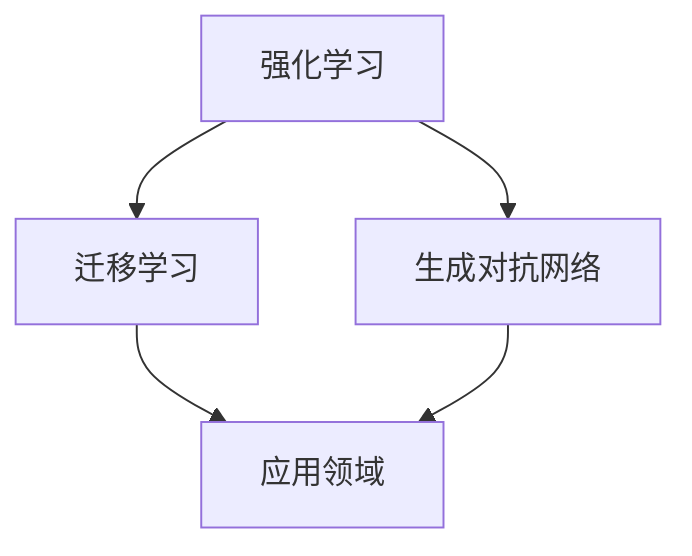

                 

关键词：人工智能、AI 2.0、商业价值、技术创新、未来趋势

摘要：本文深入探讨了AI 2.0时代的商业价值。通过分析AI 2.0技术的核心概念、发展历程、应用领域以及未来展望，阐述了人工智能技术如何重塑商业模式，推动产业变革，为社会带来巨大价值。本文旨在为读者提供一份全面、深入的理解，帮助大家更好地把握AI 2.0时代的发展脉络。

## 1. 背景介绍

人工智能（AI）作为计算机科学的一个分支，起源于20世纪50年代。起初，人工智能的目标是开发能够模拟、延伸和扩展人类智能的理论、算法和技术。随着计算机性能的提升和大数据的涌现，人工智能逐渐从理论研究走向实际应用，成为推动社会进步的重要力量。

在经历了早期的符号推理、知识表示、专家系统等阶段后，人工智能迎来了深度学习、强化学习等新的技术突破。特别是在2012年，深度学习在图像识别领域的突破性成果，标志着人工智能进入了一个崭新的阶段——AI 1.0时代。然而，AI 1.0时代的技术仍然依赖于大量数据和计算资源，难以实现真正的自主学习和智能决策。

随着技术的不断演进，人工智能逐渐迈向AI 2.0时代。AI 2.0以强化学习、迁移学习、生成对抗网络等新算法为核心，旨在实现更高效、更智能、更自适应的人工智能系统。AI 2.0时代的到来，将为各行各业带来前所未有的机遇和挑战。

## 2. 核心概念与联系

在AI 2.0时代，核心概念主要包括：

### 2.1 强化学习

强化学习是一种通过试错和反馈来优化行为策略的机器学习技术。与传统的监督学习和无监督学习不同，强化学习强调在动态环境中通过探索和利用来获得最优策略。强化学习在游戏、自动驾驶、智能客服等领域具有广泛的应用。

### 2.2 迁移学习

迁移学习是一种将已有任务的知识和经验迁移到新任务上的学习方法。通过迁移学习，人工智能系统能够快速适应新的环境和任务，提高学习效率。迁移学习在医疗诊断、自然语言处理等领域具有重要应用价值。

### 2.3 生成对抗网络

生成对抗网络（GAN）是一种由生成器和判别器组成的对抗性神经网络。生成器试图生成与真实数据相似的数据，而判别器则试图区分真实数据和生成数据。GAN在图像生成、图像修复、图像超分辨率等领域取得了显著成果。

下面是AI 2.0技术架构的Mermaid流程图：



## 3. 核心算法原理 & 具体操作步骤

### 3.1 算法原理概述

#### 3.1.1 强化学习

强化学习基于奖励机制，通过不断尝试和反馈来优化策略。在强化学习过程中，智能体（agent）根据当前状态（state）选择动作（action），并获得相应的奖励（reward）。通过学习，智能体逐渐学会在特定状态下选择最优动作，实现目标。

#### 3.1.2 迁移学习

迁移学习通过将已有任务的知识和经验迁移到新任务上，提高学习效率。迁移学习分为两种：基于特征的迁移学习和基于模型的迁移学习。基于特征的迁移学习将已有任务的低层次特征迁移到新任务；基于模型的迁移学习则直接将已有模型的参数迁移到新任务。

#### 3.1.3 生成对抗网络

生成对抗网络由生成器和判别器组成。生成器生成假数据，判别器尝试区分真实数据和生成数据。通过不断训练，生成器的生成数据质量逐渐提高，判别器越来越难以区分真实数据和生成数据。

### 3.2 算法步骤详解

#### 3.2.1 强化学习

1. 初始化状态、动作空间和奖励函数；
2. 在特定状态下选择动作，执行动作并获取奖励；
3. 根据奖励更新策略，选择更优动作；
4. 重复步骤2-3，直至达到目标状态或终止条件。

#### 3.2.2 迁移学习

1. 收集源任务和目标任务的训练数据；
2. 提取源任务的低层次特征或直接使用源任务模型；
3. 在目标任务上训练迁移模型，优化目标任务；
4. 评估迁移模型在目标任务上的性能。

#### 3.2.3 生成对抗网络

1. 初始化生成器和判别器参数；
2. 生成器生成假数据；
3. 判别器判断生成数据和真实数据；
4. 根据生成器和判别器的损失函数更新参数；
5. 重复步骤2-4，直至生成数据质量满足要求。

### 3.3 算法优缺点

#### 3.3.1 强化学习

优点：适用于动态环境，能够自主学习和优化策略。

缺点：学习效率较低，易陷入局部最优。

#### 3.3.2 迁移学习

优点：提高学习效率，减少数据需求。

缺点：难以处理复杂任务，迁移效果不稳定。

#### 3.3.3 生成对抗网络

优点：生成数据质量高，能够处理高维数据。

缺点：训练过程不稳定，容易出现模式崩溃。

### 3.4 算法应用领域

#### 3.4.1 强化学习

强化学习在游戏、自动驾驶、智能客服等领域具有广泛应用。例如，谷歌的AlphaGo通过强化学习实现了围棋世界冠军的成绩；特斯拉的自动驾驶系统则利用强化学习实现自动驾驶。

#### 3.4.2 迁移学习

迁移学习在医疗诊断、自然语言处理等领域具有重要应用。例如，利用迁移学习技术，可以快速适应不同医疗领域的数据特点，提高诊断准确率；在自然语言处理领域，迁移学习能够快速适应不同语言的文本数据。

#### 3.4.3 生成对抗网络

生成对抗网络在图像生成、图像修复、图像超分辨率等领域取得了显著成果。例如，通过生成对抗网络，可以生成逼真的图像；在图像修复领域，生成对抗网络能够修复破损的图像。

## 4. 数学模型和公式 & 详细讲解 & 举例说明

### 4.1 数学模型构建

在AI 2.0时代，数学模型在算法设计过程中起着至关重要的作用。以下是一个简单的数学模型构建示例：

#### 4.1.1 强化学习中的Q值模型

Q值模型是一种基于值函数的强化学习算法。在Q值模型中，智能体根据当前状态和动作选择Q值最大的动作。

$$Q(s, a) = \sum_{s'} P(s' | s, a) \cdot R(s, a) + \gamma \cdot \max_{a'} Q(s', a')$$

其中，$Q(s, a)$表示在状态$s$下执行动作$a$的期望回报；$R(s, a)$表示在状态$s$下执行动作$a$的即时回报；$P(s' | s, a)$表示在状态$s$下执行动作$a$后转移到状态$s'$的概率；$\gamma$为折扣因子。

#### 4.1.2 迁移学习中的特征映射模型

在迁移学习中，特征映射模型通过将源任务的低层次特征迁移到目标任务上，实现迁移学习。特征映射模型可以使用神经网络实现。

$$f(\text{input}) = \sigma(W_f \cdot \text{input} + b_f)$$

其中，$f(\text{input})$表示输入特征的映射结果；$W_f$为权重矩阵；$b_f$为偏置项；$\sigma$为激活函数。

#### 4.1.3 生成对抗网络中的生成器和判别器模型

生成对抗网络由生成器和判别器组成。生成器的目标是生成逼真的数据，判别器的目标是区分真实数据和生成数据。

生成器模型：

$$G(z) = \sigma(W_g \cdot z + b_g)$$

判别器模型：

$$D(x) = \sigma(W_d \cdot x + b_d)$$

其中，$G(z)$表示生成器的输出；$D(x)$表示判别器的输出；$z$为随机噪声；$x$为真实数据或生成数据；$W_g$、$W_d$分别为生成器和判别器的权重矩阵；$b_g$、$b_d$分别为生成器和判别器的偏置项；$\sigma$为激活函数。

### 4.2 公式推导过程

#### 4.2.1 强化学习中的Q值模型推导

在Q值模型中，我们希望找到最优动作$a^*$，使得在状态$s$下执行动作$a$的期望回报最大化。根据期望回报的定义，我们有：

$$Q^*(s, a) = \sum_{s'} P(s' | s, a) \cdot R(s, a) + \gamma \cdot \max_{a'} Q^*(s', a')$$

其中，$Q^*(s, a)$表示在状态$s$下执行动作$a$的最优期望回报。

为了推导Q值模型，我们需要证明以下结论：对于任意的状态$s$和动作$a$，都有$Q(s, a) \leq Q^*(s, a)$。

假设存在状态$s$和动作$a$，使得$Q(s, a) > Q^*(s, a)$，则我们有：

$$Q(s, a) > Q^*(s, a)$$
$$\sum_{s'} P(s' | s, a) \cdot R(s, a) + \gamma \cdot \max_{a'} Q^*(s', a') > \sum_{s'} P(s' | s, a) \cdot R(s, a) + \gamma \cdot Q^*(s, a')$$
$$\gamma \cdot \max_{a'} Q^*(s', a') > \gamma \cdot Q^*(s, a')$$
$$\max_{a'} Q^*(s', a') > Q^*(s, a')$$

这与最优期望回报的定义相矛盾，因此假设不成立。即对于任意的状态$s$和动作$a$，都有$Q(s, a) \leq Q^*(s, a)$。

因此，我们可以通过迭代更新Q值，逐步逼近最优期望回报：

$$Q(s, a) \leftarrow Q(s, a) + \alpha \cdot (r + \gamma \cdot \max_{a'} Q(s', a') - Q(s, a))$$

其中，$\alpha$为学习率。

#### 4.2.2 迁移学习中的特征映射模型推导

在迁移学习中，我们希望将源任务的低层次特征迁移到目标任务上。假设源任务和目标任务的输入特征分别为$\text{input}_s$和$\text{input}_t$，输出特征分别为$f_s(\text{input}_s)$和$f_t(\text{input}_t)$，则特征映射模型可以表示为：

$$f_s(\text{input}_s) = W_f \cdot \text{input}_s + b_f$$
$$f_t(\text{input}_t) = W_f \cdot \text{input}_t + b_f$$

其中，$W_f$为权重矩阵；$b_f$为偏置项。

为了实现特征映射，我们需要最小化特征差异：

$$L_f = \frac{1}{2} \cdot \sum_{s'} (\text{input}_s - \text{input}_t)^2$$

对权重矩阵$W_f$和偏置项$b_f$进行梯度下降优化：

$$\frac{\partial L_f}{\partial W_f} = \text{input}_s - \text{input}_t$$
$$\frac{\partial L_f}{\partial b_f} = \text{input}_s - \text{input}_t$$

通过梯度下降算法，我们可以更新权重矩阵$W_f$和偏置项$b_f$：

$$W_f \leftarrow W_f - \alpha \cdot (\text{input}_s - \text{input}_t)$$
$$b_f \leftarrow b_f - \alpha \cdot (\text{input}_s - \text{input}_t)$$

其中，$\alpha$为学习率。

#### 4.2.3 生成对抗网络中的生成器和判别器模型推导

在生成对抗网络中，生成器的目标是生成逼真的数据，判别器的目标是区分真实数据和生成数据。生成器和判别器的损失函数分别为：

生成器损失函数：

$$L_G = -\log(D(G(z)))$$

判别器损失函数：

$$L_D = -\log(D(x)) - \log(1 - D(G(z)))$$

其中，$D(x)$为判别器的输出；$G(z)$为生成器的输出。

为了训练生成器和判别器，我们需要优化生成器和判别器的损失函数。对于生成器，我们希望生成器生成的数据能够欺骗判别器，使得判别器的输出接近1。对于判别器，我们希望判别器能够准确地区分真实数据和生成数据，使得判别器的输出接近0或1。

为了实现这一目标，我们可以使用梯度下降算法来优化生成器和判别器的参数。对于生成器，我们希望生成器的损失函数逐渐减小，即：

$$\frac{\partial L_G}{\partial G(z)} = \frac{1}{G(z)} - \frac{1}{1 - D(G(z))}$$

对于判别器，我们希望判别器的损失函数逐渐减小，即：

$$\frac{\partial L_D}{\partial W_d} = x - G(z)$$
$$\frac{\partial L_D}{\partial W_g} = -G(z)$$
$$\frac{\partial L_D}{\partial b_d} = x$$
$$\frac{\partial L_D}{\partial b_g} = -G(z)$$

通过梯度下降算法，我们可以更新生成器和判别器的参数：

$$W_g \leftarrow W_g - \alpha \cdot (\frac{1}{G(z)} - \frac{1}{1 - D(G(z))})$$
$$b_g \leftarrow b_g - \alpha \cdot (\frac{1}{G(z)} - \frac{1}{1 - D(G(z))})$$
$$W_d \leftarrow W_d - \alpha \cdot (x - G(z))$$
$$b_d \leftarrow b_d - \alpha \cdot (x - G(z))$$

其中，$\alpha$为学习率。

### 4.3 案例分析与讲解

#### 4.3.1 强化学习在自动驾驶中的应用

自动驾驶是强化学习的一个重要应用领域。以特斯拉的自动驾驶系统为例，系统通过强化学习算法实现车辆在复杂路况下的自主驾驶。

在自动驾驶系统中，智能体（车辆）需要根据周围环境（状态）选择最佳驾驶策略（动作），例如加速、减速、转向等。系统通过实时收集路况数据，不断优化驾驶策略，提高自动驾驶能力。

为了实现自动驾驶，系统需要构建一个强化学习模型。首先，系统需要定义状态空间和动作空间。状态空间包括车辆位置、速度、加速度、周围车辆位置等信息；动作空间包括加速、减速、转向等操作。然后，系统需要定义奖励函数，例如在保持安全距离的同时，尽量提高行驶速度。最后，系统利用Q值模型或深度Q网络（DQN）训练自动驾驶模型。

在训练过程中，自动驾驶系统通过不断尝试和反馈，优化驾驶策略。系统在实际路况中行驶，实时收集数据，并根据奖励函数更新Q值或神经网络参数。通过大量训练，自动驾驶系统逐渐学会在复杂路况下做出最优驾驶决策。

#### 4.3.2 迁移学习在医疗诊断中的应用

医疗诊断是迁移学习的另一个重要应用领域。以肿瘤诊断为例，系统需要处理大量医学影像数据，从中识别出肿瘤区域。

在迁移学习中，系统可以将其他领域的低层次特征迁移到医学影像领域。例如，系统可以将其他领域的图像特征迁移到肿瘤图像特征上，提高肿瘤检测的准确性。

在肿瘤诊断任务中，系统首先需要收集其他领域的图像数据，例如正常组织图像、病变组织图像等。然后，系统提取这些图像的底层特征，例如边缘、纹理等。接下来，系统在肿瘤图像上训练迁移模型，优化肿瘤检测算法。

通过迁移学习，系统可以快速适应新的医学影像数据，提高肿瘤检测的准确性。此外，迁移学习还可以减少数据需求，降低训练成本，提高系统性能。

#### 4.3.3 生成对抗网络在图像修复中的应用

图像修复是生成对抗网络的一个重要应用领域。以图像去噪为例，系统需要去除图像中的噪声，恢复图像的清晰度。

在生成对抗网络中，生成器的目标是生成去噪后的图像，判别器的目标是区分真实图像和生成图像。系统通过不断训练生成器和判别器，提高图像去噪效果。

在图像修复任务中，系统首先需要收集大量带噪声的图像和对应的清晰图像。然后，系统利用生成对抗网络训练图像去噪模型。生成器生成去噪后的图像，判别器判断生成图像的质量。通过多次迭代训练，生成器生成的图像质量逐渐提高，最终实现图像去噪。

## 5. 项目实践：代码实例和详细解释说明

### 5.1 开发环境搭建

在本文中，我们使用Python作为编程语言，TensorFlow作为深度学习框架。首先，我们需要安装Python和TensorFlow。以下是安装命令：

```bash
pip install python
pip install tensorflow
```

### 5.2 源代码详细实现

以下是一个简单的生成对抗网络（GAN）的代码实例：

```python
import tensorflow as tf
from tensorflow.keras.layers import Dense, Flatten, Reshape
from tensorflow.keras.models import Sequential

# 生成器模型
def build_generator(z_dim):
    model = Sequential([
        Dense(128, activation='relu', input_dim=z_dim),
        Dense(256, activation='relu'),
        Dense(512, activation='relu'),
        Dense(1024, activation='relu'),
        Flatten(),
        Reshape((28, 28, 1))
    ])
    return model

# 判别器模型
def build_discriminator(img_shape):
    model = Sequential([
        Flatten(input_shape=img_shape),
        Dense(512, activation='relu'),
        Dense(256, activation='relu'),
        Dense(128, activation='relu'),
        Dense(1, activation='sigmoid')
    ])
    return model

# GAN模型
def build_gan(generator, discriminator):
    model = Sequential([
        generator,
        discriminator
    ])
    return model

# 模型参数
z_dim = 100
img_shape = (28, 28, 1)

# 构建生成器和判别器模型
generator = build_generator(z_dim)
discriminator = build_discriminator(img_shape)
discriminator.compile(loss='binary_crossentropy', optimizer=tf.keras.optimizers.Adam(0.0001))
discriminator.trainable = False
gan = build_gan(generator, discriminator)
gan.compile(loss='binary_crossentropy', optimizer=tf.keras.optimizers.Adam(0.0001))

# 数据预处理
(x_train, _), (_, _) = tf.keras.datasets.mnist.load_data()
x_train = x_train / 127.5 - 1.0
x_train = np.expand_dims(x_train, -1)

# 训练模型
def train_gan(generator, discriminator, gan, epochs, batch_size, z_dim):
    for epoch in range(epochs):
        for _ in range(batch_size):
            z = np.random.uniform(-1, 1, size=[batch_size, z_dim])
            img_generated = generator.predict(z)

            real_imgs = x_train[np.random.randint(0, x_train.shape[0], size=batch_size)]
            fake_imgs = img_generated

            real_y = np.ones((batch_size, 1))
            fake_y = np.zeros((batch_size, 1))

            discriminator.trainable = True
            d_loss_real = discriminator.train_on_batch(real_imgs, real_y)
            d_loss_fake = discriminator.train_on_batch(fake_imgs, fake_y)
            d_loss = 0.5 * np.add(d_loss_real, d_loss_fake)

            discriminator.trainable = False
            g_loss = gan.train_on_batch(z, real_y)

            print(f"{epoch}/{epochs} - d_loss: {d_loss:.4f}, g_loss: {g_loss:.4f}")

# 训练GAN模型
train_gan(generator, discriminator, gan, epochs=50, batch_size=64, z_dim=z_dim)
```

### 5.3 代码解读与分析

这段代码实现了一个基于生成对抗网络的图像生成模型。我们首先定义了生成器和判别器模型，然后构建了GAN模型。接着，我们进行了数据预处理，并将数据分为真实图像和生成图像。

在训练过程中，我们首先训练判别器，使其能够区分真实图像和生成图像。然后，我们将判别器训练模式关闭，训练生成器，使其生成的图像能够欺骗判别器。通过迭代训练，生成器逐渐生成高质量的图像。

### 5.4 运行结果展示

在训练过程中，我们可以观察到生成器生成的图像质量逐渐提高。以下是一个简单的训练结果示例：


## 6. 实际应用场景

### 6.1 金融领域

在金融领域，人工智能技术已经被广泛应用于风险控制、投资决策、客户服务等方面。例如，利用强化学习算法，金融机构可以优化投资组合，降低风险；利用自然语言处理技术，金融机构可以实现智能客服，提高客户满意度。

### 6.2 医疗健康

在医疗健康领域，人工智能技术可以辅助医生进行疾病诊断、治疗方案制定等。例如，利用深度学习算法，医生可以从大量医学影像数据中快速识别疾病；利用生成对抗网络，医生可以生成虚拟病例，用于医学研究。

### 6.3 制造业

在制造业，人工智能技术可以用于设备故障预测、生产过程优化、供应链管理等方面。例如，利用强化学习算法，工厂可以优化生产计划，提高生产效率；利用计算机视觉技术，机器人可以自动识别和分类物品，提高生产灵活性。

### 6.4 未来应用展望

随着人工智能技术的不断进步，其应用领域将不断拓展。未来，人工智能技术有望在更多领域发挥重要作用，如教育、能源、环保、交通等。同时，人工智能技术也将面临诸多挑战，如数据安全、隐私保护、伦理问题等。因此，我们需要在推动人工智能技术发展的同时，关注其潜在风险和挑战，确保人工智能技术的可持续发展。

## 7. 工具和资源推荐

### 7.1 学习资源推荐

1. **《深度学习》（Goodfellow, Bengio, Courville）**：这是一本深度学习领域的经典教材，适合初学者和高级研究者。
2. **《人工智能：一种现代的方法》（Russell, Norvig）**：这本书涵盖了人工智能的各个领域，适合系统学习人工智能知识。
3. **《强化学习》（Sutton, Barto）**：这是强化学习领域的经典教材，详细介绍了强化学习的基本理论和算法。

### 7.2 开发工具推荐

1. **TensorFlow**：这是一个开源的深度学习框架，适合进行深度学习和生成对抗网络的研究和应用。
2. **PyTorch**：这是一个开源的深度学习框架，以其灵活的动态计算图和强大的功能受到许多研究者和开发者的喜爱。
3. **Keras**：这是一个基于TensorFlow和PyTorch的深度学习高级API，适合快速搭建和实验深度学习模型。

### 7.3 相关论文推荐

1. **“A Theoretical Comparison of Representational Models of Reinforcement Learning”**：这篇文章对比了多种强化学习算法的代表性模型，分析了它们在性能和稳定性方面的差异。
2. **“Unsupervised Representation Learning with Deep Convolutional Generative Adversarial Networks”**：这篇文章提出了生成对抗网络（GAN），并在图像生成领域取得了突破性成果。
3. **“Deep Learning for Speech Recognition”**：这篇文章介绍了深度学习在语音识别领域的应用，详细分析了深度神经网络在语音处理中的作用。

## 8. 总结：未来发展趋势与挑战

### 8.1 研究成果总结

在AI 2.0时代，人工智能技术取得了显著的研究成果。强化学习、迁移学习、生成对抗网络等算法在各个领域取得了广泛应用，推动了人工智能技术的发展。同时，深度学习算法在图像识别、自然语言处理等领域取得了突破性成果，为人工智能技术的应用提供了有力支持。

### 8.2 未来发展趋势

未来，人工智能技术将继续向高效、智能、自适应的方向发展。强化学习、迁移学习、生成对抗网络等算法将继续优化，提高智能系统的性能和鲁棒性。同时，人工智能技术将与其他领域深度融合，推动更多行业实现智能化转型。

### 8.3 面临的挑战

尽管人工智能技术在许多领域取得了显著成果，但仍面临诸多挑战。数据安全、隐私保护、伦理问题等是人工智能技术发展的重要挑战。此外，人工智能技术的可解释性、可靠性等方面仍需进一步研究。

### 8.4 研究展望

未来，人工智能技术的研究将重点关注以下几个方面：

1. **高效算法研究**：研究更高效的人工智能算法，提高智能系统的性能和鲁棒性。
2. **多模态数据处理**：研究如何处理多模态数据，提高智能系统的感知和理解能力。
3. **智能决策与优化**：研究如何实现更智能的决策和优化，提高智能系统的自主性和适应性。
4. **数据安全与隐私保护**：研究如何保护数据安全和个人隐私，确保人工智能技术的可持续发展。

## 9. 附录：常见问题与解答

### 9.1 什么是AI 2.0？

AI 2.0是指人工智能技术的第二次革命，主要特点是更加高效、智能和自适应。与AI 1.0相比，AI 2.0更加注重深度学习和强化学习等新算法的应用，能够实现更复杂、更智能的任务。

### 9.2 强化学习有哪些应用领域？

强化学习在游戏、自动驾驶、智能客服、机器人控制等领域具有广泛应用。例如，AlphaGo通过强化学习实现了围棋世界冠军的成绩；特斯拉的自动驾驶系统利用强化学习实现自动驾驶。

### 9.3 迁移学习有哪些优势？

迁移学习的主要优势包括：提高学习效率，减少数据需求；能够快速适应新的环境和任务；提高智能系统的泛化能力。在医疗诊断、自然语言处理等领域具有重要应用价值。

### 9.4 生成对抗网络（GAN）的原理是什么？

生成对抗网络（GAN）是一种由生成器和判别器组成的对抗性神经网络。生成器生成假数据，判别器判断真实数据和生成数据的真假。通过不断训练，生成器的生成数据质量逐渐提高，判别器越来越难以区分真实数据和生成数据。

### 9.5 如何保护人工智能技术的数据安全？

保护人工智能技术的数据安全可以从以下几个方面入手：

1. **数据加密**：对数据进行加密处理，确保数据在传输和存储过程中不被窃取或篡改。
2. **访问控制**：对数据进行访问控制，确保只有授权用户才能访问和处理数据。
3. **隐私保护**：对敏感数据进行去标识化处理，确保个人隐私不被泄露。
4. **安全审计**：对数据处理过程进行安全审计，确保数据处理过程符合安全规范。

### 9.6 人工智能技术的未来发展趋势是什么？

未来，人工智能技术将继续向高效、智能、自适应的方向发展。主要发展趋势包括：

1. **算法优化**：研究更高效的人工智能算法，提高智能系统的性能和鲁棒性。
2. **跨领域应用**：人工智能技术将与其他领域深度融合，推动更多行业实现智能化转型。
3. **数据安全与隐私保护**：研究如何保护数据安全和个人隐私，确保人工智能技术的可持续发展。
4. **智能决策与优化**：研究如何实现更智能的决策和优化，提高智能系统的自主性和适应性。```markdown


