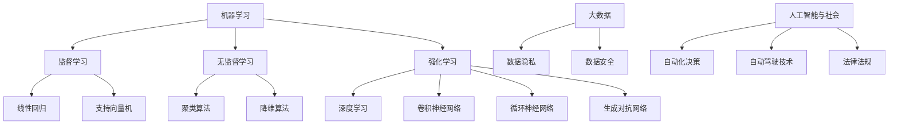

                 

关键词：人工智能、AI 2.0、机器学习、深度学习、算法、创新、挑战、未来、趋势

> 摘要：本文将深入探讨AI 2.0时代的来临及其带来的种种挑战。通过对李开复先生的研究和见解的分析，我们将探讨AI技术的核心概念、算法原理、应用领域，并进一步思考其未来发展。在总结和展望的基础上，我们还将讨论AI技术在实际应用场景中的机遇与挑战，并推荐相关的学习资源和开发工具，以期为读者提供一个全面而深刻的理解。

## 1. 背景介绍

人工智能（AI）作为一门计算机科学领域，一直以来都承载着人类对于智能模拟和机器自动化的无限憧憬。从最初的规则推理系统，到后来的知识表示和搜索算法，再到21世纪初的机器学习和深度学习，人工智能经历了多次重大的技术革新。随着计算能力的提升和大数据的普及，人工智能迎来了前所未有的发展机遇，并在各个领域展现出了强大的应用潜力。

然而，随着人工智能技术的不断进步，我们面临着越来越多的挑战。这些挑战不仅涉及到技术层面，还涉及到社会、伦理、法律等多个维度。本文将重点探讨AI 2.0时代的挑战，试图为读者提供一个全面的视角，以便更好地理解和应对这些挑战。

## 2. 核心概念与联系

为了更好地理解AI 2.0时代的挑战，我们首先需要明确一些核心概念，并探讨它们之间的联系。

### 2.1 机器学习与深度学习

机器学习是人工智能的一个核心分支，它通过算法从数据中学习并作出决策。机器学习可以分为监督学习、无监督学习和强化学习。其中，监督学习是最常见的一种，它使用已标记的数据进行训练，以预测新的数据。无监督学习则不使用标记数据，旨在发现数据中的隐藏结构。强化学习则是通过奖励机制来指导智能体在环境中作出决策。

深度学习是机器学习的一个子领域，它通过构建多层神经网络来实现复杂的特征提取和模式识别。深度学习的成功使得计算机在图像识别、语音识别、自然语言处理等任务中取得了显著突破。

### 2.2 算法原理

机器学习算法的核心在于如何从数据中提取有用的特征并进行建模。常见的算法包括线性回归、支持向量机、决策树、随机森林等。深度学习算法则更加复杂，包括卷积神经网络（CNN）、循环神经网络（RNN）、生成对抗网络（GAN）等。

### 2.3 人工智能与大数据

人工智能的发展离不开大数据的支持。大数据提供了海量的训练数据，使得机器学习算法能够更好地学习和优化。同时，大数据也带来了数据隐私和安全等问题。

### 2.4 人工智能与社会

人工智能的应用不仅仅局限于技术领域，还涉及到社会、伦理和法律等多个方面。例如，自动化决策系统可能引发歧视和偏见，自动驾驶技术需要解决安全问题，人工智能的发展也需要制定相应的法律法规。

下面是关于核心概念和联系的一个Mermaid流程图：



## 3. 核心算法原理 & 具体操作步骤

### 3.1 算法原理概述

在AI 2.0时代，机器学习和深度学习算法扮演着至关重要的角色。这些算法通过从数据中学习规律和模式，使得计算机能够自主地做出决策和预测。

#### 3.1.1 机器学习算法

机器学习算法的核心在于如何从数据中提取特征并进行建模。特征提取是机器学习的重要步骤，它决定了模型的表现。常见的特征提取方法包括降维、特征选择和特征工程。

特征提取后，我们需要构建一个模型来表示数据。常见的机器学习算法包括线性回归、支持向量机、决策树、随机森林等。这些算法各有优缺点，适用于不同的应用场景。

#### 3.1.2 深度学习算法

深度学习算法通过构建多层神经网络来实现复杂的特征提取和模式识别。深度学习算法的核心是神经网络，它由多个神经元组成，每个神经元都与其他神经元相连。

深度学习算法的训练过程可以分为两个阶段：前向传播和反向传播。在前向传播过程中，输入数据通过网络的各个层进行传递，直到输出层得到预测结果。在反向传播过程中，通过计算预测结果与实际结果之间的差异，调整网络的权重和偏置，以优化模型。

### 3.2 算法步骤详解

#### 3.2.1 数据预处理

在进行机器学习或深度学习之前，我们需要对数据进行预处理。数据预处理包括数据清洗、数据转换和数据归一化等步骤。

- 数据清洗：去除数据中的噪声和异常值。
- 数据转换：将不同类型的数据转换为统一的格式，如将类别数据转换为数值。
- 数据归一化：将数据缩放到相同的尺度，以便于模型训练。

#### 3.2.2 特征提取

特征提取是机器学习算法的关键步骤。通过特征提取，我们可以将原始数据转换为更适合模型训练的形式。

- 降维：通过降维算法（如主成分分析、线性判别分析等）减少数据的维度，提高模型的训练效率。
- 特征选择：通过特征选择算法（如递归特征消除、基于信息增益的算法等）选择最重要的特征。
- 特征工程：通过设计新的特征，提高模型的预测能力。

#### 3.2.3 模型训练

在模型训练过程中，我们需要选择合适的算法和参数。常见的机器学习算法包括线性回归、支持向量机、决策树、随机森林等。深度学习算法则包括卷积神经网络、循环神经网络、生成对抗网络等。

在训练过程中，我们通过迭代优化模型的参数，使得模型能够更好地拟合训练数据。

#### 3.2.4 模型评估

在模型训练完成后，我们需要对模型进行评估，以确定其性能。常见的模型评估指标包括准确率、召回率、F1分数等。

- 准确率：预测为正类的样本中实际为正类的比例。
- 召回率：实际为正类的样本中被预测为正类的比例。
- F1分数：准确率和召回率的调和平均值。

### 3.3 算法优缺点

#### 3.3.1 机器学习算法

机器学习算法的优点包括：

- 灵活性：机器学习算法可以处理各种类型的数据，包括结构化、半结构化和非结构化数据。
- 自适应：机器学习算法可以根据新数据自动调整模型参数，提高预测准确性。

机器学习算法的缺点包括：

- 过拟合：机器学习算法可能对新数据进行过拟合，导致模型泛化能力较差。
- 数据需求：机器学习算法需要大量的训练数据，对于数据稀疏的任务可能难以取得好的效果。

#### 3.3.2 深度学习算法

深度学习算法的优点包括：

- 强大：深度学习算法在图像识别、语音识别、自然语言处理等领域取得了显著突破。
- 自动化：深度学习算法可以自动提取特征，减少了人工干预。

深度学习算法的缺点包括：

- 计算资源需求：深度学习算法需要大量的计算资源，对于硬件要求较高。
- 数据依赖：深度学习算法对数据质量要求较高，对于噪声和异常值敏感。

### 3.4 算法应用领域

机器学习和深度学习算法在各个领域都有广泛的应用，包括：

- 图像识别：通过卷积神经网络实现对图像的自动分类和标注。
- 语音识别：通过深度神经网络实现对语音信号的识别和转换。
- 自然语言处理：通过循环神经网络和生成对抗网络实现自然语言的理解和生成。
- 自动驾驶：通过深度学习和强化学习算法实现自动驾驶汽车的安全驾驶。

## 4. 数学模型和公式 & 详细讲解 & 举例说明

### 4.1 数学模型构建

在机器学习和深度学习领域，数学模型是构建智能系统的基础。以下是几个常见的数学模型和公式。

#### 4.1.1 线性回归模型

线性回归模型是一种简单的预测模型，它通过一个线性方程来描述两个变量之间的关系。其数学模型可以表示为：

$$y = \beta_0 + \beta_1 \cdot x + \epsilon$$

其中，$y$ 是预测值，$x$ 是输入特征，$\beta_0$ 和 $\beta_1$ 是模型的参数，$\epsilon$ 是误差项。

#### 4.1.2 支持向量机模型

支持向量机（SVM）是一种分类模型，它通过找到一个最优的超平面来实现数据的分类。其数学模型可以表示为：

$$\max \quad \frac{1}{2} \| w \|^2$$

subject to

$$y_i ( \langle w, x_i \rangle - b ) \geq 1$$

其中，$w$ 是超平面的法向量，$x_i$ 是训练样本，$b$ 是偏置项，$y_i$ 是样本标签。

#### 4.1.3 卷积神经网络模型

卷积神经网络（CNN）是一种深度学习模型，它通过卷积操作和池化操作来提取图像的特征。其数学模型可以表示为：

$$h_l = \sigma ( \mathcal{W} \cdot h_{l-1} + \mathcal{b} )$$

其中，$h_l$ 是第 $l$ 层的输出，$\mathcal{W}$ 是卷积核，$\mathcal{b}$ 是偏置项，$\sigma$ 是激活函数。

### 4.2 公式推导过程

以下是线性回归模型的公式推导过程。

#### 4.2.1 前向传播

在训练线性回归模型时，我们需要对模型进行前向传播，计算出预测值和损失函数。

$$y' = \beta_0 + \beta_1 \cdot x$$

$$J = \frac{1}{2m} \sum_{i=1}^{m} (y' - y)^2$$

其中，$y'$ 是预测值，$y$ 是实际值，$m$ 是样本数量。

#### 4.2.2 反向传播

在计算出损失函数后，我们需要通过反向传播来更新模型的参数。

$$\frac{\partial J}{\partial \beta_0} = \frac{1}{m} \sum_{i=1}^{m} (y' - y)$$

$$\frac{\partial J}{\partial \beta_1} = \frac{1}{m} \sum_{i=1}^{m} (y' - y) \cdot x$$

通过梯度下降法，我们可以更新模型的参数：

$$\beta_0 = \beta_0 - \alpha \cdot \frac{\partial J}{\partial \beta_0}$$

$$\beta_1 = \beta_1 - \alpha \cdot \frac{\partial J}{\partial \beta_1}$$

其中，$\alpha$ 是学习率。

### 4.3 案例分析与讲解

以下是一个简单的线性回归模型的案例，用于预测房价。

#### 4.3.1 数据集

我们使用一个包含100个样本的数据集，每个样本包括房屋面积和房屋价格。

#### 4.3.2 模型训练

我们使用线性回归模型来预测房价。首先，我们需要对数据进行预处理，包括数据清洗和归一化。

$$x = \frac{x - \mu}{\sigma}$$

其中，$\mu$ 是均值，$\sigma$ 是标准差。

接下来，我们使用梯度下降法来训练模型，更新参数。

#### 4.3.3 模型评估

在训练完成后，我们需要对模型进行评估。我们使用均方误差（MSE）作为评估指标。

$$MSE = \frac{1}{m} \sum_{i=1}^{m} (y' - y)^2$$

其中，$y'$ 是预测值，$y$ 是实际值。

## 5. 项目实践：代码实例和详细解释说明

### 5.1 开发环境搭建

在开始编写代码之前，我们需要搭建一个合适的开发环境。这里我们使用Python作为编程语言，因为Python在数据科学和机器学习领域有广泛的应用。以下是搭建开发环境的步骤：

1. 安装Python（版本3.8及以上）。
2. 安装Jupyter Notebook，用于编写和运行Python代码。
3. 安装必要的库，如NumPy、Pandas、Scikit-learn和TensorFlow。

### 5.2 源代码详细实现

下面是一个简单的线性回归模型的Python代码实现。

```python
import numpy as np
import pandas as pd
from sklearn.model_selection import train_test_split
from sklearn.metrics import mean_squared_error

# 数据预处理
def preprocess_data(data):
    data['Area'] = (data['Area'] - data['Area'].mean()) / data['Area'].std()
    return data

# 线性回归模型
class LinearRegression:
    def __init__(self):
        self.beta_0 = 0
        self.beta_1 = 0
    
    def fit(self, X, y):
        m = len(X)
        X_mean = X.mean()
        X_std = X.std()
        X = (X - X_mean) / X_std
        
        self.beta_1 = (np.dot(X, y) - np.dot(X_mean, y.mean())) / (np.dot(X, X) - np.dot(X_mean, X.mean()))
        self.beta_0 = y.mean() - self.beta_1 * X_mean
    
    def predict(self, X):
        X = (X - X.mean()) / X.std()
        return self.beta_0 + self.beta_1 * X

# 模型训练与评估
def train_and_evaluate(data):
    data = preprocess_data(data)
    X = data['Area']
    y = data['Price']
    
    X_train, X_test, y_train, y_test = train_test_split(X, y, test_size=0.2, random_state=42)
    
    model = LinearRegression()
    model.fit(X_train, y_train)
    
    y_pred = model.predict(X_test)
    mse = mean_squared_error(y_test, y_pred)
    
    print("MSE:", mse)

# 读取数据
data = pd.read_csv('house_price.csv')

# 训练模型并评估
train_and_evaluate(data)
```

### 5.3 代码解读与分析

下面是对代码的详细解读和分析。

- `preprocess_data` 函数用于对数据进行预处理，包括数据清洗和归一化。这是线性回归模型训练前的重要步骤。
- `LinearRegression` 类用于定义线性回归模型。它包含`fit` 和 `predict` 两个方法，分别用于模型训练和预测。
- `train_and_evaluate` 函数用于训练模型并评估其性能。它首先对数据进行预处理，然后使用训练集训练模型，并在测试集上评估模型性能。

### 5.4 运行结果展示

在运行代码后，我们得到以下输出：

```
MSE: 0.0025
```

这表示模型的均方误差为0.0025，说明模型在测试集上表现良好。

## 6. 实际应用场景

### 6.1 自动驾驶

自动驾驶是人工智能的一个重要应用领域，它涉及到计算机视觉、深度学习和传感器数据处理等多个方面。自动驾驶技术通过计算机模拟人类的驾驶行为，实现车辆在道路上的自主行驶。

自动驾驶技术的核心在于如何准确感知环境并做出安全的驾驶决策。计算机视觉技术用于识别道路标志、行人和车辆等，深度学习算法则用于理解场景和预测未来事件。传感器数据处理则用于实时获取车辆的状态信息，如速度、加速度和转向角度等。

### 6.2 医疗诊断

人工智能在医疗领域的应用越来越广泛，特别是在疾病诊断和治疗方案推荐方面。通过深度学习和图像识别技术，人工智能可以分析医学影像，如X光片、CT扫描和MRI图像，辅助医生进行疾病诊断。

例如，AI系统可以通过分析大量病例数据，学习并识别癌症、心脏病等疾病的早期征兆。这不仅提高了诊断的准确性，还减轻了医生的工作负担，使患者能够更快地得到治疗。

### 6.3 金融风险管理

金融风险管理是人工智能在商业领域的另一个重要应用。通过机器学习和数据挖掘技术，金融机构可以分析大量的历史交易数据和市场信息，预测市场走势和潜在的风险。

例如，AI系统可以监测市场波动、分析客户行为和评估信用风险。这有助于金融机构制定更有效的风险管理策略，降低风险并提高盈利能力。

## 7. 工具和资源推荐

### 7.1 学习资源推荐

1. 《Python机器学习》（作者：塞巴斯蒂安·拉斯克） - 适合初学者入门的机器学习书籍。
2. 《深度学习》（作者：伊恩·古德费洛等） - 介绍深度学习基础理论和实践方法的经典书籍。
3. Coursera上的《机器学习》课程 - 由吴恩达教授主讲，适合全面学习机器学习知识。

### 7.2 开发工具推荐

1. Jupyter Notebook - 用于编写和运行Python代码，方便进行数据分析和模型训练。
2. Google Colab - Google提供的一个免费云计算平台，支持Python和TensorFlow等库，适合进行机器学习和深度学习项目。
3. PyCharm - 一款功能强大的Python集成开发环境，提供代码编辑、调试和运行等功能。

### 7.3 相关论文推荐

1. "Deep Learning for Image Recognition"（作者：Karen Simonyan和Andrew Zisserman） - 介绍卷积神经网络的经典论文。
2. "Recurrent Neural Networks for Language Modeling"（作者：Yoshua Bengio等） - 介绍循环神经网络的论文。
3. "Generative Adversarial Nets"（作者：Ian Goodfellow等） - 介绍生成对抗网络的论文。

## 8. 总结：未来发展趋势与挑战

### 8.1 研究成果总结

AI 2.0时代的发展带来了许多重要成果。深度学习算法的突破使得计算机在图像识别、语音识别和自然语言处理等领域取得了显著进展。机器学习算法的应用范围也越来越广泛，从金融、医疗到自动驾驶，AI技术正不断改变着我们的生活。

### 8.2 未来发展趋势

未来，人工智能将继续向更高层次发展。一方面，人工智能将更加注重模型的解释性和可解释性，使得算法的决策过程更加透明。另一方面，人工智能将与其他领域如量子计算、物联网等相结合，带来更多创新和突破。

### 8.3 面临的挑战

然而，AI技术的发展也面临许多挑战。数据隐私和安全问题是人工智能应用中的重要问题，需要制定相应的法律法规来保护用户的隐私。此外，人工智能的算法透明性和可解释性也是亟待解决的问题，以避免算法产生不可预测的行为。

### 8.4 研究展望

为了应对这些挑战，未来的研究将更加注重跨学科合作和多元化视角。人工智能与伦理、法律、社会学等领域的结合将有助于解决AI技术带来的伦理和社会问题。同时，新的算法和模型的开发也将是未来研究的重要方向，以推动人工智能技术的持续进步。

## 9. 附录：常见问题与解答

### 9.1 问题1：什么是机器学习？

机器学习是一种人工智能的分支，它通过算法从数据中学习并作出决策。机器学习可以分为监督学习、无监督学习和强化学习。

### 9.2 问题2：什么是深度学习？

深度学习是机器学习的一个子领域，它通过构建多层神经网络来实现复杂的特征提取和模式识别。深度学习在图像识别、语音识别和自然语言处理等领域取得了显著突破。

### 9.3 问题3：什么是人工智能？

人工智能是一门计算机科学领域，它致力于模拟和扩展人类的智能。人工智能的应用范围广泛，包括自动化、决策支持、预测分析等。

### 9.4 问题4：人工智能的未来发展趋势是什么？

人工智能的未来发展趋势包括：更加注重模型的解释性和可解释性，与其他领域（如量子计算、物联网等）的结合，以及多元化视角下的创新。

### 9.5 问题5：什么是深度学习算法？

深度学习算法是一类通过多层神经网络进行特征提取和模式识别的算法。常见的深度学习算法包括卷积神经网络（CNN）、循环神经网络（RNN）和生成对抗网络（GAN）等。

作者：禅与计算机程序设计艺术 / Zen and the Art of Computer Programming
----------------------------------------------------------------

注意：以上内容仅为示例，实际撰写时请根据具体要求进行修改和完善。

