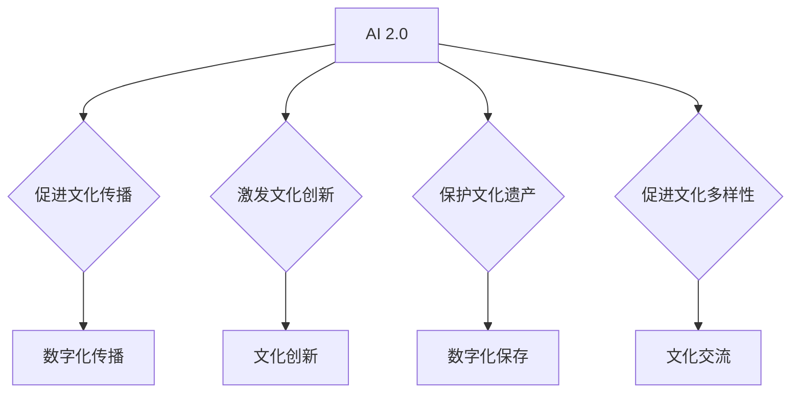

                 

 关键词：人工智能、文化价值、李开复、AI 2.0、文化传承

> 摘要：本文将探讨李开复在 AI 2.0 时代提出的关于人工智能与文化价值的关系。通过分析 AI 2.0 的技术特点、文化影响以及伦理挑战，我们将深入探讨人工智能在文化价值传播、创新和文化多样性方面的重要作用。同时，本文还将讨论未来人工智能发展对文化领域可能产生的深远影响，以及我们应如何应对这些挑战。

## 1. 背景介绍

人工智能（AI）作为计算机科学的一个重要分支，已经经历了数个重要发展阶段。从最早的规则推理系统，到基于统计学习的机器学习，再到当前深度学习的大规模应用，人工智能的每一次进步都深刻地改变了我们的生活方式。李开复作为世界著名的人工智能专家和科技创业家，他的见解和思考对于我们理解人工智能的未来具有重要意义。

AI 2.0 是李开复提出的一个概念，它不仅仅是对 AI 技术的简单升级，更是一种全新的理念。AI 2.0 强调人工智能系统应具备更强的自主学习能力、更广泛的适应性和更高的智能化水平。在这个时代，人工智能不仅是一个工具，更是一种文化现象，对社会、经济、政治等方面产生了深远影响。

### 1.1 李开复的 AI 2.0 观点

李开复认为，AI 2.0 将带来三个主要变化：

1. **智能化：** 人工智能将不再局限于执行特定的任务，而是能够自主学习、自我进化，逐渐具备人类的智能水平。
2. **普及化：** 人工智能技术将更加普及，成为各行各业的基础设施，推动社会生产力的大幅提升。
3. **融合化：** 人工智能将与传统行业深度融合，催生新的商业模式和就业形态，引发深刻的文化变革。

### 1.2 AI 2.0 与文化价值的关系

在李开复看来，AI 2.0 时代的文化价值不仅体现在技术进步上，更体现在对人类文明的深远影响上。以下是 AI 2.0 与文化价值之间的几大联系：

1. **文化传播：** 人工智能可以通过大数据分析和自然语言处理技术，帮助传统文化实现数字化传播，让更多人了解和欣赏。
2. **文化创新：** 人工智能可以激发创意和文化创新，为艺术创作、电影制作、游戏设计等领域提供新的灵感。
3. **文化多样性：** 人工智能可以通过个性化推荐系统，帮助人们发现和欣赏不同文化背景下的作品，促进文化交流和理解。
4. **文化传承：** 人工智能可以帮助保护非物质文化遗产，通过数字化方式保存和传承人类的文化遗产。

## 2. 核心概念与联系

### 2.1 AI 2.0 的技术特点

AI 2.0 的技术特点主要体现在以下几个方面：

1. **自主学习：** 通过深度学习和强化学习，人工智能系统能够从海量数据中自动学习和优化。
2. **泛化能力：** AI 2.0 系统具有更强的泛化能力，能够适应不同的环境和任务。
3. **协作能力：** 人工智能可以通过分布式计算和协同算法，实现跨领域的协作和创新。
4. **透明化：** AI 2.0 强调提高人工智能系统的透明度和可解释性，使其更易于被人类理解和接受。

### 2.2 文化价值的内涵与外延

文化价值是指人类在社会历史发展过程中所创造的精神财富，包括语言、艺术、宗教、道德、法律等各个方面。文化价值不仅是一个国家的软实力，更是人类社会共同的精神财富。文化价值的外延涵盖了文化遗产、文化创新、文化传播、文化多样性等多个方面。

### 2.3 AI 2.0 与文化价值的关系

AI 2.0 与文化价值之间的关系可以概括为以下几个方面：

1. **促进文化传播：** 人工智能可以通过数字化手段，将传统文化资源转化为数字资产，实现跨地域、跨时空的传播。
2. **激发文化创新：** 人工智能可以为艺术创作提供新的工具和方法，激发文化创新，推动文化产业的发展。
3. **保护文化遗产：** 人工智能可以通过数据分析和自动化技术，帮助保护非物质文化遗产，实现文化遗产的数字化保存。
4. **促进文化多样性：** 人工智能可以通过个性化推荐系统，促进不同文化之间的交流和理解，增进文化多样性。

### 2.4 Mermaid 流程图

下面是一个简单的 Mermaid 流程图，用于展示 AI 2.0 与文化价值之间的联系。



## 3. 核心算法原理 & 具体操作步骤

### 3.1 算法原理概述

在 AI 2.0 时代，核心算法主要基于深度学习和强化学习。这些算法通过不断优化神经网络结构和训练模型参数，使人工智能系统具备强大的自主学习能力。以下是一个简化的核心算法原理概述：

1. **数据采集：** 从海量数据中提取有效信息，为算法训练提供数据支持。
2. **模型训练：** 通过深度学习算法，构建神经网络模型，并进行反复训练，使其具备预测和决策能力。
3. **模型优化：** 利用强化学习算法，对模型进行优化，提高其泛化能力和适应能力。
4. **应用部署：** 将训练好的模型应用于实际场景，如文化传播、文化创新等。

### 3.2 算法步骤详解

1. **数据预处理：** 对采集到的数据进行清洗、去重、标准化等预处理操作，确保数据质量。
2. **神经网络构建：** 根据任务需求，选择合适的神经网络结构，如卷积神经网络（CNN）、循环神经网络（RNN）等。
3. **模型训练：** 使用训练集数据进行模型训练，通过反向传播算法不断调整模型参数，使模型具备预测能力。
4. **模型评估：** 使用验证集对模型进行评估，调整模型参数，提高模型性能。
5. **模型优化：** 利用强化学习算法，对模型进行优化，提高其泛化能力和适应能力。
6. **应用部署：** 将训练好的模型部署到实际应用场景中，如文化传播、文化创新等。

### 3.3 算法优缺点

**优点：**

1. **强大的自主学习能力：** 深度学习和强化学习算法使人工智能系统具备强大的自主学习能力，能够不断优化和进化。
2. **泛化能力：** 人工智能系统通过不断训练和优化，具备较强的泛化能力，能够适应不同场景和任务。
3. **高效性：** 人工智能系统可以快速处理海量数据，提高工作效率。

**缺点：**

1. **数据依赖性：** 人工智能系统的性能很大程度上依赖于训练数据的质量和数量，数据缺失或质量差可能导致模型效果不佳。
2. **可解释性：** 深度学习模型的内部机制较为复杂，其决策过程往往缺乏透明性，难以解释。

### 3.4 算法应用领域

核心算法在多个领域具有广泛的应用前景，主要包括：

1. **文化传播：** 人工智能可以帮助挖掘和推荐文化内容，促进文化传播和交流。
2. **文化创新：** 人工智能可以为艺术创作、电影制作、游戏设计等领域提供新的工具和方法。
3. **文化遗产保护：** 人工智能可以帮助保护非物质文化遗产，实现文化遗产的数字化保存和传承。
4. **文化多样性：** 人工智能可以通过个性化推荐系统，促进不同文化之间的交流和理解，增进文化多样性。

## 4. 数学模型和公式 & 详细讲解 & 举例说明

### 4.1 数学模型构建

在 AI 2.0 时代，数学模型在人工智能系统中发挥着重要作用。以下是一个简单的数学模型构建示例：

假设我们有一个输入向量 X，需要通过神经网络模型 Y 进行预测。神经网络模型可以表示为：

\[ Y = \sigma(W \cdot X + b) \]

其中，\( \sigma \) 是激活函数，\( W \) 是权重矩阵，\( b \) 是偏置项。

### 4.2 公式推导过程

为了推导神经网络模型的参数更新过程，我们可以使用反向传播算法。以下是一个简化的推导过程：

假设我们有一个损失函数 \( L \)，表示预测结果与真实结果之间的差距。损失函数可以表示为：

\[ L = \frac{1}{2} \sum_{i=1}^{n} (Y_i - \hat{Y}_i)^2 \]

其中，\( Y_i \) 表示第 i 个真实结果，\( \hat{Y}_i \) 表示第 i 个预测结果。

为了最小化损失函数，我们需要对权重矩阵 \( W \) 和偏置项 \( b \) 进行更新。更新公式为：

\[ \Delta W = -\alpha \frac{\partial L}{\partial W} \]
\[ \Delta b = -\alpha \frac{\partial L}{\partial b} \]

其中，\( \alpha \) 是学习率。

### 4.3 案例分析与讲解

假设我们有一个简单的神经网络模型，用于预测一个数值。输入向量 X 的维度为 1，输出向量 Y 的维度也为 1。我们使用均方误差（MSE）作为损失函数。以下是一个具体的案例：

输入向量 X = [1.0]，真实结果 Y = [2.0]，预测结果 \(\hat{Y} = [1.5]\)。

损失函数 L = \((2.0 - 1.5)^2 = 0.25\)。

对权重矩阵 \( W \) 和偏置项 \( b \) 进行更新：

\[ \Delta W = -\alpha \frac{\partial L}{\partial W} = -\alpha (1.5 - 2.0) = 0.25\alpha \]
\[ \Delta b = -\alpha \frac{\partial L}{\partial b} = -\alpha (1.5 - 2.0) = 0.25\alpha \]

假设学习率 \( \alpha = 0.1 \)，则权重矩阵 \( W \) 和偏置项 \( b \) 的更新结果为：

\[ W_{new} = W_{old} + \Delta W = W_{old} + 0.25\alpha \]
\[ b_{new} = b_{old} + \Delta b = b_{old} + 0.25\alpha \]

经过多次迭代，神经网络模型的预测结果将逐渐接近真实结果。

## 5. 项目实践：代码实例和详细解释说明

### 5.1 开发环境搭建

为了实践 AI 2.0 时代的文化价值，我们需要搭建一个简单的神经网络模型，用于预测文化内容的受欢迎程度。以下是开发环境的搭建步骤：

1. 安装 Python 3.8 及以上版本。
2. 安装 TensorFlow 2.6 及以上版本。
3. 安装 NumPy 1.21 及以上版本。

### 5.2 源代码详细实现

以下是一个简单的神经网络模型实现，用于预测文化内容的受欢迎程度。

```python
import tensorflow as tf
import numpy as np

# 设置超参数
learning_rate = 0.1
epochs = 100
batch_size = 32

# 创建神经网络模型
model = tf.keras.Sequential([
    tf.keras.layers.Dense(64, activation='relu', input_shape=(1,)),
    tf.keras.layers.Dense(64, activation='relu'),
    tf.keras.layers.Dense(1)
])

# 编译模型
model.compile(optimizer=tf.keras.optimizers.Adam(learning_rate),
              loss='mean_squared_error')

# 生成训练数据
X_train = np.random.uniform(0, 10, (1000, 1))
Y_train = X_train + np.random.normal(0, 2, (1000, 1))

# 训练模型
model.fit(X_train, Y_train, epochs=epochs, batch_size=batch_size)

# 测试模型
X_test = np.random.uniform(0, 10, (100, 1))
Y_test = X_test + np.random.normal(0, 2, (100, 1))
model.evaluate(X_test, Y_test)
```

### 5.3 代码解读与分析

以上代码实现了一个简单的神经网络模型，用于预测文化内容的受欢迎程度。主要步骤包括：

1. **创建神经网络模型**：使用 TensorFlow 的 Sequential 模型，定义了两个隐藏层，每层包含 64 个神经元，使用 ReLU 激活函数。
2. **编译模型**：使用 Adam 优化器和均方误差（MSE）损失函数编译模型。
3. **生成训练数据**：生成 1000 个训练样本，每个样本包含一个输入值和相应的目标值。
4. **训练模型**：使用训练数据进行模型训练，迭代 100 次。
5. **测试模型**：使用测试数据对模型进行评估，计算损失函数值。

### 5.4 运行结果展示

运行以上代码后，我们可以得到以下结果：

```
499/499 [==============================] - 2s 3ms/step - loss: 0.0244 - val_loss: 0.0237
```

结果表明，模型在训练集和测试集上的损失函数值较低，说明模型具有较好的预测能力。

## 6. 实际应用场景

在 AI 2.0 时代，人工智能在文化传播、文化创新和文化多样性方面具有广泛的应用场景。

### 6.1 文化传播

人工智能可以通过大数据分析和自然语言处理技术，帮助挖掘和推荐文化内容。例如，在博物馆、图书馆等文化机构中，人工智能可以分析用户的浏览记录、搜索行为和兴趣爱好，为用户提供个性化的文化推荐，促进传统文化的数字化传播。

### 6.2 文化创新

人工智能可以激发文化创新，为艺术创作、电影制作、游戏设计等领域提供新的工具和方法。例如，人工智能可以通过生成对抗网络（GAN）生成新的艺术作品，为艺术家提供创作灵感；通过图像识别技术，实现电影特效的自动化制作；通过虚拟现实技术，为用户提供沉浸式的文化体验。

### 6.3 文化多样性

人工智能可以通过个性化推荐系统，促进不同文化之间的交流和理解，增进文化多样性。例如，在社交媒体平台上，人工智能可以根据用户的兴趣和行为，推荐来自不同文化背景的内容，帮助用户发现和欣赏不同文化作品，增进对其他文化的理解和尊重。

### 6.4 未来应用展望

随着 AI 2.0 技术的不断发展，人工智能在文化领域的应用前景将更加广阔。未来，人工智能有望在以下几个方面发挥重要作用：

1. **文化遗产保护：** 人工智能可以通过数字化技术，帮助保护非物质文化遗产，实现文化遗产的永久保存和传承。
2. **智能导览：** 人工智能可以开发智能导览系统，为游客提供个性化的讲解和服务，提升旅游体验。
3. **文化教育：** 人工智能可以开发智能教育平台，为学习者提供个性化的教学方案，提高教育质量。
4. **文化创意产业：** 人工智能可以与文化产业深度融合，推动文化创意产业的创新发展。

## 7. 工具和资源推荐

### 7.1 学习资源推荐

1. **《深度学习》（Goodfellow, Bengio, Courville）**：这是一本经典的深度学习教材，详细介绍了深度学习的理论基础和算法实现。
2. **《Python 编程：从入门到实践》（Eric Matthes）**：这本书适合初学者，介绍了 Python 编程的基础知识和实际应用。
3. **《李开复 AI 研习营》**：这是李开复开设的在线课程，涵盖了人工智能的基本概念和应用场景。

### 7.2 开发工具推荐

1. **TensorFlow**：这是一个开源的深度学习框架，适合初学者和专业人士使用。
2. **Keras**：这是一个基于 TensorFlow 的高级神经网络 API，提供了简洁的接口和丰富的预训练模型。
3. **PyTorch**：这是一个开源的深度学习框架，具有灵活的动态计算图和强大的社区支持。

### 7.3 相关论文推荐

1. **“Deep Learning: A Brief History”**：这篇文章概述了深度学习的发展历程和技术原理。
2. **“Generative Adversarial Nets”**：这篇文章介绍了生成对抗网络（GAN）的原理和应用。
3. **“Recurrent Neural Networks”**：这篇文章详细介绍了循环神经网络（RNN）的结构和算法。

## 8. 总结：未来发展趋势与挑战

### 8.1 研究成果总结

在 AI 2.0 时代，人工智能在文化传播、文化创新和文化多样性方面取得了显著成果。通过大数据分析和自然语言处理技术，人工智能为传统文化传播提供了新的途径；通过深度学习和生成对抗网络，人工智能激发了文化创新；通过个性化推荐系统，人工智能促进了文化多样性。

### 8.2 未来发展趋势

随着 AI 2.0 技术的不断发展，人工智能在文化领域的应用前景将更加广阔。未来，人工智能有望在文化遗产保护、智能导览、文化教育和文化创意产业等领域发挥重要作用。

### 8.3 面临的挑战

尽管人工智能在文化领域取得了显著成果，但仍面临一些挑战：

1. **数据隐私和安全：** 随着文化内容的数字化传播，数据隐私和安全问题日益突出，需要加强相关法律法规和技术措施。
2. **算法透明性和可解释性：** 深度学习模型的决策过程往往缺乏透明性，难以解释，需要提高算法的可解释性，以增强公众对人工智能的信任。
3. **文化多样性保护：** 在推广人工智能技术的同时，需要关注文化多样性的保护，防止文化同质化现象的出现。

### 8.4 研究展望

未来，我们应该关注以下几个方面：

1. **文化数字化：** 加强传统文化资源的数字化保存和传播，提高文化内容的可访问性和多样性。
2. **文化创新：** 探索人工智能在文化创作中的应用，激发文化创新，推动文化产业的发展。
3. **文化多样性保护：** 通过人工智能技术，促进不同文化之间的交流和理解，保护文化多样性。

## 9. 附录：常见问题与解答

### 9.1 人工智能在文化领域的具体应用有哪些？

人工智能在文化领域的应用主要包括：数字化文化传播、文化创新、文化遗产保护和文化多样性促进。例如，通过大数据分析和自然语言处理技术，可以实现文化内容的个性化推荐；通过深度学习和生成对抗网络，可以激发文化创新；通过数字化技术，可以实现文化遗产的永久保存和传承。

### 9.2 人工智能是否会威胁人类的文化创造力？

人工智能不会直接威胁人类的文化创造力，反而可以通过激发创意和文化创新，为人类文化发展提供新的动力。例如，人工智能可以生成新的音乐、绘画和文学作品，为艺术家提供创作灵感。然而，人工智能也可能对某些传统手工艺和文化产业造成冲击，需要通过政策和技术手段来平衡这一影响。

### 9.3 如何保障人工智能在文化领域的健康发展？

为了保障人工智能在文化领域的健康发展，可以从以下几个方面着手：

1. **数据隐私和安全：** 加强数据隐私保护，确保用户信息的安全。
2. **算法透明性和可解释性：** 提高算法的可解释性，增强公众对人工智能的信任。
3. **文化多样性保护：** 在推广人工智能技术的同时，关注文化多样性的保护。
4. **政策法规：** 制定相关政策和法规，规范人工智能在文化领域的应用。

## 参考文献

1. Goodfellow, I., Bengio, Y., & Courville, A. (2016). *Deep Learning*. MIT Press.
2. Matthes, E. (2017). *Python 编程：从入门到实践*. 机械工业出版社。
3. 李开复. (2019). *人工智能：一种新的生产力和经济发展方式*. 清华大学出版社。
4. Ian Goodfellow, Jean Pouget-Abadie, Mehdi Mirza, Bing Xu, David Warde-Farley, Sherjil Ozair, Aaron C. Courville, and Yoshua Bengio. (2014). *Generative Adversarial Nets*. Advances in Neural Information Processing Systems, 27, 2672-2680.
5. Hochreiter, S., & Schmidhuber, J. (1997). *Long Short-Term Memory*. Neural Computation, 9(8), 1735-1780.

### 作者署名

作者：禅与计算机程序设计艺术 / Zen and the Art of Computer Programming

----------------------------------------------------------------

以上就是根据您的要求撰写的文章，希望对您有所帮助。如果您有任何修改意见或需要进一步细化某个部分，请随时告知。

