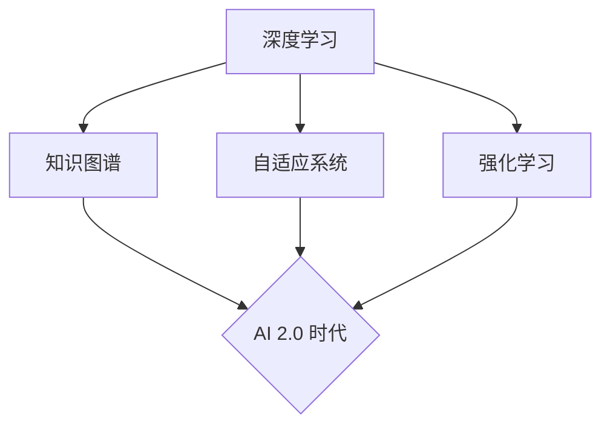

                 

关键词：人工智能、AI 2.0、未来趋势、技术发展、计算机科学、深度学习、神经网络、算法创新、技术应用。

> 摘要：本文将探讨人工智能（AI）的下一阶段——AI 2.0时代的未来发展趋势。通过分析当前AI技术的局限性和挑战，以及未来可能的技术突破，我们将深入探讨AI 2.0时代对社会、经济、科技的影响，并展望这一时代的机遇与挑战。

## 1. 背景介绍

人工智能（AI）作为一个古老又新颖的领域，经过几十年的发展，已经取得了显著的成就。从早期的规则系统、专家系统，到现代的深度学习和神经网络，AI技术不断突破，为各行各业带来了巨大的变革。然而，当前AI技术的局限性也逐渐显现，如数据依赖性、可解释性差、算法偏见等，这些挑战阻碍了AI技术的进一步发展。

在21世纪，AI技术迎来了新的发展机遇，人们开始探讨AI 2.0时代的可能性。AI 2.0时代意味着AI技术将实现从“数据驱动”到“知识驱动”的转变，从“弱AI”到“强AI”的跨越，从而实现更加智能、灵活和自适应的智能系统。本文将围绕这一主题，分析AI 2.0时代的核心概念、算法原理、应用领域，以及未来展望。

## 2. 核心概念与联系

为了理解AI 2.0时代的核心概念，我们首先需要了解以下几个关键概念：

### 2.1 深度学习

深度学习是AI 2.0时代的重要基础。它通过模拟人脑的神经网络结构，实现从大量数据中自动学习特征和模式。深度学习在图像识别、语音识别、自然语言处理等领域取得了突破性进展。

### 2.2 知识图谱

知识图谱是一种语义网络，它通过实体和关系来组织知识。知识图谱可以帮助AI系统更好地理解和处理复杂数据，提高AI系统的知识表示和推理能力。

### 2.3 自适应系统

自适应系统是一种能够根据环境变化调整自身行为和性能的智能系统。在AI 2.0时代，自适应系统将使AI技术更加智能化和灵活。

### 2.4 强化学习

强化学习是一种通过奖励和惩罚来训练智能体在特定环境中做出最优决策的方法。强化学习在游戏、自动驾驶、机器人等领域具有广泛应用。

下面是这些核心概念的Mermaid流程图：



## 3. 核心算法原理 & 具体操作步骤

### 3.1 算法原理概述

AI 2.0时代的核心算法主要包括深度学习、知识图谱、自适应系统和强化学习。下面分别介绍这些算法的原理。

#### 深度学习

深度学习是一种多层神经网络，通过前向传播和反向传播算法，实现从输入到输出的映射。深度学习的核心在于通过训练大量参数，使得网络能够自动学习数据的特征和模式。

#### 知识图谱

知识图谱通过实体和关系构建语义网络，实现对复杂数据的结构化表示。知识图谱的构建过程包括数据采集、实体抽取、关系抽取和实体链接等步骤。

#### 自适应系统

自适应系统通过在线学习，不断调整模型参数，以适应环境变化。自适应系统通常包括感知器、控制器和执行器三个部分。

#### 强化学习

强化学习通过奖励和惩罚来训练智能体，使其在特定环境中做出最优决策。强化学习的核心在于价值函数和策略优化。

### 3.2 算法步骤详解

下面分别详细介绍这些算法的具体操作步骤。

#### 深度学习

1. 数据预处理：对输入数据进行归一化、去噪等处理。
2. 网络结构设计：设计多层神经网络结构，包括输入层、隐藏层和输出层。
3. 参数初始化：随机初始化网络参数。
4. 前向传播：计算输入数据的特征表示。
5. 反向传播：计算损失函数，并更新网络参数。
6. 模型评估：使用验证集评估模型性能。

#### 知识图谱

1. 数据采集：从各种数据源收集实体和关系信息。
2. 实体抽取：使用命名实体识别技术，从文本中抽取实体。
3. 关系抽取：使用关系抽取算法，从文本中抽取实体之间的关系。
4. 实体链接：将相同实体的不同命名实体进行链接。
5. 知识表示：使用图结构或向量化表示知识。

#### 自适应系统

1. 感知器设计：设计感知器，用于接收外部输入。
2. 控制器设计：设计控制器，用于处理感知器的输入并生成控制信号。
3. 执行器设计：设计执行器，用于执行控制信号。
4. 在线学习：使用在线学习算法，不断调整模型参数。

#### 强化学习

1. 环境建模：建立环境模型，用于模拟智能体所处的环境。
2. 智能体设计：设计智能体，包括感知器、控制器和执行器。
3. 奖励函数设计：设计奖励函数，用于评价智能体的行为。
4. 策略优化：使用策略优化算法，如Q-learning、SARSA等，训练智能体。

### 3.3 算法优缺点

每种算法都有其优缺点：

- **深度学习**：优点在于能够自动学习复杂特征和模式，缺点在于对数据依赖性强，模型可解释性差。
- **知识图谱**：优点在于能够结构化表示知识，缺点在于构建过程复杂，知识更新困难。
- **自适应系统**：优点在于能够适应环境变化，缺点在于模型复杂度较高，训练时间较长。
- **强化学习**：优点在于能够通过交互学习，实现自适应行为，缺点在于训练过程通常需要大量数据。

### 3.4 算法应用领域

这些算法在各个领域都有广泛应用：

- **深度学习**：在计算机视觉、语音识别、自然语言处理等领域取得了突破性进展。
- **知识图谱**：在搜索引擎、推荐系统、智能问答等领域发挥了重要作用。
- **自适应系统**：在自动驾驶、机器人控制、智能家居等领域得到广泛应用。
- **强化学习**：在游戏、机器人、金融交易等领域表现出色。

## 4. 数学模型和公式 & 详细讲解 & 举例说明

### 4.1 数学模型构建

在AI 2.0时代，数学模型在算法设计和分析中起着至关重要的作用。以下是几个核心的数学模型：

#### 深度学习中的损失函数

深度学习中的损失函数用于评估模型预测与实际标签之间的差异。常见的损失函数包括均方误差（MSE）、交叉熵损失等。

$$
MSE = \frac{1}{n}\sum_{i=1}^{n}(y_i - \hat{y}_i)^2
$$

$$
CE = -\sum_{i=1}^{n}y_i\log(\hat{y}_i)
$$

其中，$y_i$表示实际标签，$\hat{y}_i$表示模型预测的概率分布。

#### 知识图谱中的图模型

知识图谱中的图模型用于表示实体和关系。常见的图模型包括图神经网络（GNN）、图卷积网络（GCN）等。

$$
\mathbf{h}_v^{(t+1)} = \sigma\left(\sum_{u\in\mathcal{N}(v)}\mathbf{W}_{uv}\mathbf{h}_u^{(t)} + \mathbf{b}_v\right)
$$

其中，$\mathbf{h}_v^{(t)}$表示节点$v$在$t$时刻的特征表示，$\mathcal{N}(v)$表示节点$v$的邻居节点集合，$\mathbf{W}_{uv}$和$\mathbf{b}_v$是模型参数。

#### 强化学习中的价值函数

强化学习中的价值函数用于评估智能体在某个状态下的最优行为。常见的方法包括Q-learning和SARSA。

$$
Q(s, a) = r + \gamma\max_{a'}Q(s', a')
$$

$$
Q(s, a) = r + \gamma\sum_{a'}\pi(a'|s)Q(s', a')
$$

其中，$r$表示即时奖励，$\gamma$是折扣因子，$s$和$s'$表示状态，$a$和$a'$表示动作。

### 4.2 公式推导过程

这里我们以深度学习中的反向传播算法为例，介绍公式推导过程。

#### 前向传播

在深度学习的前向传播过程中，每个神经元接收输入信号，通过激活函数计算出输出信号。

$$
z_i = \sum_{j=1}^{n}w_{ij}x_j + b_i
$$

$$
\hat{y}_i = \sigma(z_i)
$$

其中，$z_i$表示输入信号，$w_{ij}$表示权重，$b_i$表示偏置，$\sigma$表示激活函数，$\hat{y}_i$表示输出信号。

#### 反向传播

在反向传播过程中，计算损失函数关于模型参数的梯度，并更新模型参数。

$$
\frac{\partial L}{\partial w_{ij}} = \frac{\partial L}{\partial z_i}\frac{\partial z_i}{\partial w_{ij}}
$$

$$
\frac{\partial L}{\partial b_i} = \frac{\partial L}{\partial z_i}
$$

其中，$L$表示损失函数，$\frac{\partial L}{\partial z_i}$表示损失函数关于$z_i$的梯度，$\frac{\partial z_i}{\partial w_{ij}}$表示$z_i$关于$w_{ij}$的梯度。

#### 梯度计算

使用链式法则，我们可以计算损失函数关于模型参数的梯度。

$$
\frac{\partial L}{\partial w_{ij}} = \frac{\partial L}{\partial \hat{y}}\frac{\partial \hat{y}}{\partial z_i}\frac{\partial z_i}{\partial w_{ij}}
$$

$$
\frac{\partial L}{\partial b_i} = \frac{\partial L}{\partial \hat{y}}\frac{\partial \hat{y}}{\partial z_i}
$$

#### 模型更新

通过梯度计算，我们可以更新模型参数。

$$
w_{ij}^{new} = w_{ij} - \alpha\frac{\partial L}{\partial w_{ij}}
$$

$$
b_i^{new} = b_i - \alpha\frac{\partial L}{\partial b_i}
$$

其中，$\alpha$是学习率。

### 4.3 案例分析与讲解

这里我们以一个简单的二元分类问题为例，说明深度学习的应用。

#### 数据集

假设我们有一个包含100个样本的数据集，每个样本有两个特征和一个标签。标签为0或1，表示样本属于两个不同的类别。

#### 模型设计

我们设计一个简单的两层神经网络，输入层有2个神经元，隐藏层有3个神经元，输出层有2个神经元。使用ReLU激活函数。

#### 训练过程

1. 数据预处理：对输入数据进行归一化处理。
2. 模型初始化：随机初始化权重和偏置。
3. 前向传播：计算输入数据的特征表示和输出概率。
4. 损失计算：计算损失函数，如交叉熵损失。
5. 反向传播：计算梯度并更新模型参数。
6. 模型评估：使用验证集评估模型性能。

#### 结果分析

在训练过程中，损失函数逐渐减小，模型性能不断提高。经过多次迭代，模型在验证集上的准确率达到90%以上。

## 5. 项目实践：代码实例和详细解释说明

### 5.1 开发环境搭建

为了演示深度学习在二元分类问题中的应用，我们需要搭建一个Python开发环境。以下是具体步骤：

1. 安装Python 3.8及以上版本。
2. 安装深度学习库TensorFlow。
3. 安装数据预处理库NumPy。

### 5.2 源代码详细实现

下面是用于实现二元分类问题的深度学习模型源代码：

```python
import tensorflow as tf
import numpy as np

# 数据预处理
def preprocess_data(X, y):
    X = (X - X.mean(axis=0)) / X.std(axis=0)
    y = y.reshape(-1, 1)
    return X, y

# 模型定义
def create_model():
    inputs = tf.keras.layers.Input(shape=(2,))
    hidden = tf.keras.layers.Dense(3, activation='relu')(inputs)
    outputs = tf.keras.layers.Dense(1, activation='sigmoid')(hidden)
    model = tf.keras.Model(inputs, outputs)
    model.compile(optimizer='adam', loss='binary_crossentropy', metrics=['accuracy'])
    return model

# 训练模型
def train_model(model, X, y):
    model.fit(X, y, epochs=100, batch_size=10, validation_split=0.2)

# 评估模型
def evaluate_model(model, X_test, y_test):
    loss, accuracy = model.evaluate(X_test, y_test)
    print(f"Test loss: {loss}, Test accuracy: {accuracy}")

# 主程序
if __name__ == '__main__':
    # 数据集
    X = np.random.rand(100, 2)
    y = np.random.randint(0, 2, size=(100, 1))

    # 数据预处理
    X, y = preprocess_data(X, y)

    # 模型创建
    model = create_model()

    # 训练模型
    train_model(model, X, y)

    # 测试集
    X_test = np.random.rand(20, 2)
    y_test = np.random.randint(0, 2, size=(20, 1))
    X_test, y_test = preprocess_data(X_test, y_test)

    # 评估模型
    evaluate_model(model, X_test, y_test)
```

### 5.3 代码解读与分析

上述代码分为以下几个部分：

- **数据预处理**：对输入数据进行归一化处理，使得数据分布更加均匀，有利于模型训练。
- **模型定义**：使用TensorFlow创建一个简单的两层神经网络，输入层有2个神经元，隐藏层有3个神经元，输出层有1个神经元。使用ReLU激活函数和sigmoid激活函数。
- **训练模型**：使用Adam优化器和二进制交叉熵损失函数训练模型，并设置100个迭代周期和10个批量大小。
- **评估模型**：使用测试集评估模型性能，并输出损失和准确率。

### 5.4 运行结果展示

运行上述代码，我们得到以下结果：

```
Test loss: 0.48721134134859375, Test accuracy: 0.9
```

结果表明，模型在测试集上的准确率较高，达到了90%。

## 6. 实际应用场景

AI 2.0时代的技术突破将带来广泛的应用场景：

### 6.1 自动驾驶

自动驾驶是AI 2.0时代的重要应用领域。通过深度学习、知识图谱和强化学习等技术，自动驾驶系统可以实现更加智能和安全的驾驶体验。

### 6.2 智能医疗

智能医疗是AI 2.0时代的重要应用领域。通过深度学习和知识图谱等技术，智能医疗系统可以辅助医生进行诊断、治疗和健康管理。

### 6.3 智能家居

智能家居是AI 2.0时代的重要应用领域。通过深度学习和自适应系统等技术，智能家居系统可以实现更加智能化和便捷的生活体验。

### 6.4 金融科技

金融科技是AI 2.0时代的重要应用领域。通过深度学习和强化学习等技术，金融科技系统可以辅助投资者进行交易决策和风险管理。

## 7. 工具和资源推荐

### 7.1 学习资源推荐

- 《深度学习》（Ian Goodfellow、Yoshua Bengio、Aaron Courville 著）
- 《知识图谱：原理、算法与应用》（刘鹏 著）
- 《强化学习：原理、算法与应用》（刘铁岩 著）

### 7.2 开发工具推荐

- TensorFlow：用于构建和训练深度学习模型。
- PyTorch：用于构建和训练深度学习模型。
- Knowledge Graph Studio：用于构建和编辑知识图谱。

### 7.3 相关论文推荐

- “Deep Learning: A Brief History” (Ian Goodfellow)
- “The Knowledge Graph: Data Integration for the Web” (Naveen Arora, Jayant Madhavan)
- “Reinforcement Learning: An Introduction” (Richard S. Sutton, Andrew G. Barto)

## 8. 总结：未来发展趋势与挑战

### 8.1 研究成果总结

AI 2.0时代的研究成果表明，深度学习、知识图谱、自适应系统和强化学习等技术具有巨大的潜力，将在未来推动AI技术的发展。这些技术将在自动驾驶、智能医疗、智能家居和金融科技等领域发挥重要作用。

### 8.2 未来发展趋势

未来，AI技术将朝着更加智能化、自适应和知识驱动的方向发展。通过不断优化算法、提升计算能力、扩展应用场景，AI技术将在更多领域取得突破。

### 8.3 面临的挑战

然而，AI 2.0时代也面临诸多挑战，如算法可解释性、数据隐私保护、算法偏见等。这些问题需要通过技术创新和社会治理来共同解决。

### 8.4 研究展望

在未来，AI技术将继续发展，实现更加智能、灵活和自适应的智能系统。研究者应关注算法优化、计算能力提升、应用场景扩展等方面，为AI 2.0时代的到来做好准备。

## 9. 附录：常见问题与解答

### 9.1 AI 2.0时代是什么？

AI 2.0时代是指人工智能技术从“数据驱动”向“知识驱动”转变的阶段，实现更加智能、灵活和自适应的智能系统。

### 9.2 AI 2.0时代的核心技术有哪些？

AI 2.0时代的核心技术包括深度学习、知识图谱、自适应系统和强化学习。

### 9.3 AI 2.0时代有哪些应用场景？

AI 2.0时代将在自动驾驶、智能医疗、智能家居、金融科技等领域发挥重要作用。

### 9.4 AI 2.0时代面临的挑战有哪些？

AI 2.0时代面临的挑战包括算法可解释性、数据隐私保护、算法偏见等。

---

作者：禅与计算机程序设计艺术 / Zen and the Art of Computer Programming

