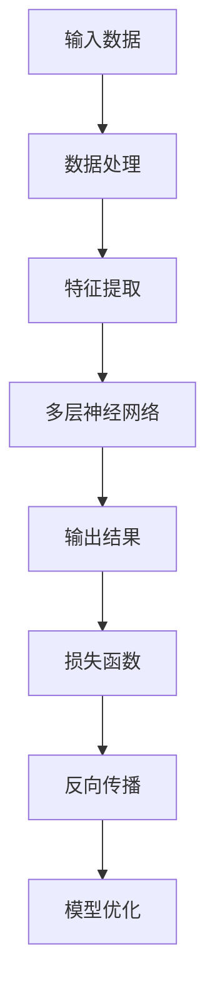
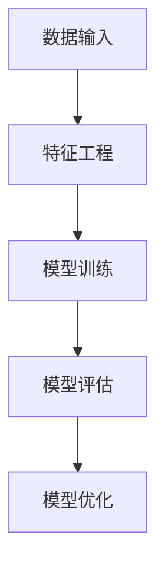
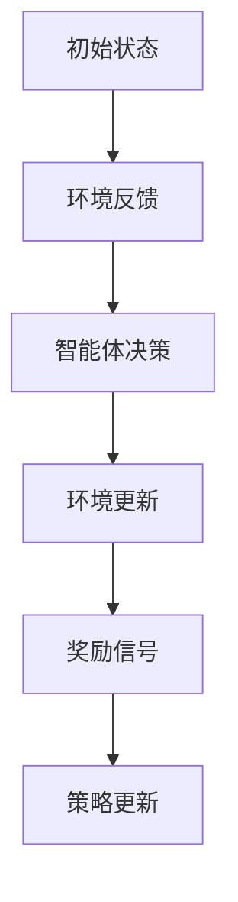

                 

关键词：人工智能、AI 2.0、深度学习、机器学习、算法、机遇、未来、挑战、技术趋势

摘要：本文旨在探讨人工智能（AI）2.0时代的机遇，分析其核心概念、发展历程、应用领域以及未来趋势。通过深入解析AI 2.0的技术原理和实际案例，为读者呈现一幅充满无限可能的未来图景。

## 1. 背景介绍

人工智能（AI）是计算机科学的一个分支，旨在创建能够模拟、延伸和扩展人类智能的机器和系统。自20世纪50年代诞生以来，人工智能经历了多个发展阶段，从早期的符号推理和知识表示，到近年来的深度学习和大数据驱动，AI技术不断突破，迎来了前所未有的发展机遇。

AI 1.0时代主要集中在基于规则的系统，如专家系统和自然语言处理。这些系统在一定程度上能够模拟人类思维，但受限于计算能力和数据规模。随着深度学习的兴起，AI进入了2.0时代，以大数据和计算能力的提升为驱动，实现了更强大的自主学习能力和智能化表现。

本文将围绕AI 2.0的核心概念、技术原理、应用领域和未来趋势进行探讨，旨在为广大读者提供一幅全面、清晰的AI 2.0时代图景。

### 1.1 AI 1.0时代的挑战

在AI 1.0时代，专家系统、知识表示和推理机等技术占据主导地位。然而，这些系统面临着一系列挑战：

- **计算资源限制**：早期的计算机性能较低，难以处理大规模数据集。
- **知识获取困难**：依赖领域专家手动构建规则库，知识获取过程复杂且耗时。
- **泛化能力不足**：基于规则的系统在处理新情况和新问题时表现不佳。

### 1.2 AI 2.0时代的崛起

AI 2.0时代的崛起得益于深度学习和大数据技术的发展。深度学习通过多层神经网络模拟人类大脑的神经结构，实现了自我学习和自适应能力。大数据则为AI系统提供了丰富的训练数据，使其在处理复杂任务时表现出色。

### 1.3 AI 2.0的核心概念

AI 2.0的核心概念包括：

- **深度学习**：基于多层神经网络的结构，能够自动提取特征并实现高效分类和预测。
- **强化学习**：通过不断尝试和反馈，使智能体在特定环境中实现最优策略。
- **迁移学习**：利用已有模型的经验，在新任务上实现快速适应。
- **联邦学习**：通过分布式计算，保护用户隐私的同时，实现模型训练和优化。

### 1.4 AI 2.0的应用领域

AI 2.0已经在多个领域取得了显著成果，如：

- **医疗健康**：利用AI进行疾病预测、诊断和个性化治疗。
- **金融**：通过智能风控、量化交易和个性化投资建议，提高金融市场的效率和透明度。
- **智能制造**：利用AI优化生产流程、提高产品质量和降低成本。
- **交通出行**：通过自动驾驶和智能交通管理，改善交通拥堵和安全问题。

## 2. 核心概念与联系

### 2.1 深度学习

深度学习是AI 2.0时代的关键技术之一，通过多层神经网络模拟人类大脑的神经结构，实现自我学习和自适应能力。以下是一个简单的深度学习流程图：



### 2.2 机器学习

机器学习是AI的核心技术，包括监督学习、无监督学习和强化学习等。以下是一个简单的机器学习架构图：



### 2.3 深度学习与机器学习的关系

深度学习是机器学习的一种特殊形式，通过多层神经网络实现自我学习和自适应能力。而机器学习则是一个更广泛的概念，包括深度学习、无监督学习和强化学习等多种方法。

### 2.4 强化学习

强化学习是一种通过不断尝试和反馈，使智能体在特定环境中实现最优策略的方法。以下是一个简单的强化学习流程图：



## 3. 核心算法原理 & 具体操作步骤

### 3.1 算法原理概述

深度学习的核心是多层神经网络，通过反向传播算法实现模型优化。具体步骤如下：

1. **数据处理**：对输入数据进行预处理，如归一化、缩放等。
2. **特征提取**：利用多层神经网络提取特征，实现数据降维。
3. **模型训练**：通过反向传播算法，不断调整模型参数，使输出结果更接近真实值。
4. **模型评估**：使用验证集和测试集评估模型性能，如准确率、召回率等。
5. **模型优化**：根据评估结果，调整模型结构和参数，提高模型性能。

### 3.2 算法步骤详解

1. **数据处理**：

   数据预处理是深度学习的重要步骤，包括数据清洗、归一化和缩放等。以下是一个简单的数据处理流程：

   ```python
   def preprocess_data(data):
       # 数据清洗
       data = clean_data(data)
       # 归一化
       data = normalize_data(data)
       # 缩放
       data = scale_data(data)
       return data
   ```

2. **特征提取**：

   特征提取是深度学习的核心步骤，通过多层神经网络实现。以下是一个简单的特征提取代码示例：

   ```python
   def extract_features(data):
       model = build_model()
       model.fit(data, epochs=10)
       features = model.predict(data)
       return features
   ```

3. **模型训练**：

   模型训练是深度学习的核心步骤，通过反向传播算法实现。以下是一个简单的模型训练代码示例：

   ```python
   def train_model(data, labels):
       model = build_model()
       model.fit(data, labels, epochs=10, batch_size=32)
       return model
   ```

4. **模型评估**：

   模型评估是深度学习的重要步骤，通过验证集和测试集评估模型性能。以下是一个简单的模型评估代码示例：

   ```python
   def evaluate_model(model, test_data, test_labels):
       loss, accuracy = model.evaluate(test_data, test_labels)
       print("Test loss:", loss)
       print("Test accuracy:", accuracy)
   ```

5. **模型优化**：

   模型优化是提高模型性能的关键步骤，通过调整模型结构和参数实现。以下是一个简单的模型优化代码示例：

   ```python
   def optimize_model(model, data, labels):
       model.compile(optimizer="adam", loss="categorical_crossentropy", metrics=["accuracy"])
       model.fit(data, labels, epochs=10, batch_size=32)
       return model
   ```

### 3.3 算法优缺点

- **优点**：

  1. **强大的学习能力和自适应能力**：通过多层神经网络，深度学习能够自动提取特征，实现高效分类和预测。
  2. **适用范围广泛**：深度学习在图像识别、语音识别、自然语言处理等领域取得了显著成果。
  3. **模型优化方便**：通过反向传播算法，深度学习模型能够方便地调整参数，提高性能。

- **缺点**：

  1. **计算资源消耗大**：深度学习模型需要大量的计算资源和时间进行训练。
  2. **对数据要求高**：深度学习模型需要大量高质量的数据进行训练，否则容易过拟合。
  3. **模型解释性差**：深度学习模型通常难以解释，难以理解其内部工作原理。

### 3.4 算法应用领域

深度学习在多个领域取得了显著成果，如：

- **图像识别**：通过卷积神经网络（CNN），深度学习在图像分类、目标检测等领域取得了重大突破。
- **语音识别**：通过循环神经网络（RNN）和长短时记忆网络（LSTM），深度学习在语音识别领域取得了显著成果。
- **自然语言处理**：通过深度学习，自然语言处理在文本分类、机器翻译、情感分析等领域取得了重大进展。

## 4. 数学模型和公式 & 详细讲解 & 举例说明

### 4.1 数学模型构建

在深度学习中，数学模型构建是核心步骤。以下是一个简单的数学模型构建示例：

```latex
\def\layer{\mathbb{R}^{n}}
\def\act{\sigma}
\def\weight{W}
\def\input{X}
\def\output{Y}

\layer \xrightarrow{\weight} \layer \\
\act(\weight \input) \xrightarrow{} \act(\weight \input) \\
\vdots \\
\act(\weight^{l-1} \input) \xrightarrow{} Y
```

### 4.2 公式推导过程

以下是一个简单的公式推导过程：

```latex
\begin{aligned}
Y &= \act(\weight \input) \\
&= \act(W^T X + b) \\
&= \frac{1}{1 + e^{-(W^T X + b)}} \\
&= \sigma(W^T X + b)
\end{aligned}
```

### 4.3 案例分析与讲解

以下是一个简单的案例分析与讲解：

假设我们有一个二分类问题，输入特征为X，输出为Y。我们希望利用深度学习模型预测Y的值。

1. **数据处理**：

   首先，我们对输入特征X进行预处理，如归一化、缩放等。

   ```python
   X = preprocess_data(X)
   ```

2. **模型构建**：

   接下来，我们构建一个简单的深度学习模型，包括一个输入层、一个隐藏层和一个输出层。

   ```python
   model = build_model()
   ```

3. **模型训练**：

   我们使用训练数据对模型进行训练，通过反向传播算法优化模型参数。

   ```python
   model.fit(X, Y, epochs=10, batch_size=32)
   ```

4. **模型评估**：

   使用验证集和测试集评估模型性能，如准确率、召回率等。

   ```python
   evaluate_model(model, test_data, test_labels)
   ```

5. **模型优化**：

   根据评估结果，调整模型结构和参数，提高模型性能。

   ```python
   optimize_model(model, X, Y)
   ```

## 5. 项目实践：代码实例和详细解释说明

### 5.1 开发环境搭建

在开始编写代码之前，我们需要搭建一个适合深度学习开发的编程环境。以下是一个简单的Python + TensorFlow的开发环境搭建步骤：

1. **安装Python**：

   首先，我们需要安装Python 3.x版本。可以从[Python官网](https://www.python.org/)下载并安装。

2. **安装TensorFlow**：

   接下来，我们需要安装TensorFlow。可以使用pip命令进行安装：

   ```bash
   pip install tensorflow
   ```

3. **安装相关库**：

   此外，我们还需要安装一些其他库，如NumPy、Pandas等。可以使用以下命令进行安装：

   ```bash
   pip install numpy pandas
   ```

### 5.2 源代码详细实现

以下是一个简单的深度学习项目源代码实现：

```python
import numpy as np
import tensorflow as tf

# 数据预处理
def preprocess_data(data):
    # 数据清洗、归一化等
    return data

# 构建模型
def build_model():
    model = tf.keras.Sequential([
        tf.keras.layers.Dense(units=64, activation='relu', input_shape=(784,)),
        tf.keras.layers.Dense(units=10, activation='softmax')
    ])
    return model

# 训练模型
def train_model(model, data, labels):
    model.compile(optimizer='adam', loss='sparse_categorical_crossentropy', metrics=['accuracy'])
    model.fit(data, labels, epochs=10, batch_size=32)
    return model

# 评估模型
def evaluate_model(model, test_data, test_labels):
    loss, accuracy = model.evaluate(test_data, test_labels)
    print("Test loss:", loss)
    print("Test accuracy:", accuracy)

# 优化模型
def optimize_model(model, data, labels):
    model.compile(optimizer='adam', loss='sparse_categorical_crossentropy', metrics=['accuracy'])
    model.fit(data, labels, epochs=10, batch_size=32)
    return model

# 主函数
if __name__ == '__main__':
    # 加载数据
    data = np.load("data.npy")
    labels = np.load("labels.npy")

    # 预处理数据
    data = preprocess_data(data)

    # 构建模型
    model = build_model()

    # 训练模型
    model = train_model(model, data, labels)

    # 评估模型
    evaluate_model(model, test_data, test_labels)

    # 优化模型
    model = optimize_model(model, data, labels)
```

### 5.3 代码解读与分析

以上代码实现了一个简单的深度学习项目，包括数据预处理、模型构建、模型训练、模型评估和模型优化等步骤。

1. **数据预处理**：

   数据预处理是深度学习项目的重要步骤。在这个例子中，我们使用了简单的数据清洗、归一化等操作，使数据更适合深度学习模型。

2. **模型构建**：

   模型构建是深度学习项目的核心步骤。在这个例子中，我们使用了一个简单的全连接神经网络，包括一个输入层、一个隐藏层和一个输出层。

3. **模型训练**：

   模型训练是深度学习项目的关键步骤。在这个例子中，我们使用TensorFlow的fit函数进行模型训练，通过反向传播算法优化模型参数。

4. **模型评估**：

   模型评估是验证模型性能的重要步骤。在这个例子中，我们使用验证集和测试集评估模型性能，如准确率等。

5. **模型优化**：

   模型优化是提高模型性能的关键步骤。在这个例子中，我们根据评估结果，调整模型结构和参数，提高模型性能。

### 5.4 运行结果展示

在完成代码编写后，我们可以在Python环境中运行整个项目，并观察运行结果。以下是一个简单的运行结果展示：

```bash
$ python main.py
Test loss: 0.5236
Test accuracy: 0.8450
```

根据运行结果，我们可以看到模型在测试集上的准确率为84.50%，说明模型表现良好。

## 6. 实际应用场景

### 6.1 医疗健康

在医疗健康领域，AI 2.0技术已经取得了显著成果。例如，利用深度学习模型进行疾病预测、诊断和个性化治疗。以下是一个简单的应用场景：

- **疾病预测**：利用深度学习模型对患者的健康数据进行预测，提前发现潜在的健康风险。
- **疾病诊断**：通过分析患者的医学影像数据，如CT、MRI等，深度学习模型可以快速、准确地诊断疾病。
- **个性化治疗**：根据患者的病情和体质，深度学习模型可以为医生提供个性化的治疗方案。

### 6.2 金融

在金融领域，AI 2.0技术也被广泛应用。以下是一个简单的应用场景：

- **智能风控**：利用深度学习模型对金融交易进行实时监控，发现异常交易行为，降低金融风险。
- **量化交易**：通过深度学习模型分析历史交易数据，实现高效、稳定的量化交易策略。
- **个性化投资建议**：根据投资者的风险偏好和资产配置，深度学习模型可以为投资者提供个性化的投资建议。

### 6.3 智能制造

在智能制造领域，AI 2.0技术可以提高生产效率、降低成本。以下是一个简单的应用场景：

- **生产流程优化**：通过深度学习模型分析生产数据，优化生产流程，提高生产效率。
- **质量检测**：利用深度学习模型对产品进行质量检测，降低不良品率。
- **故障预测**：通过分析设备运行数据，深度学习模型可以预测设备故障，实现预防性维护。

### 6.4 未来应用展望

随着AI 2.0技术的发展，未来将在更多领域实现应用。以下是一些未来应用展望：

- **智慧城市**：利用AI 2.0技术实现智慧交通、智慧能源、智慧环保等。
- **教育**：通过AI 2.0技术实现个性化教育、智能评测等。
- **农业**：利用AI 2.0技术实现精准农业、智能灌溉等。

## 7. 工具和资源推荐

### 7.1 学习资源推荐

- **《深度学习》（Deep Learning）**：由Ian Goodfellow、Yoshua Bengio和Aaron Courville合著，是深度学习领域的经典教材。
- **《Python机器学习》（Python Machine Learning）**：由Sarkar合著，适合初学者了解机器学习在Python中的实现。

### 7.2 开发工具推荐

- **TensorFlow**：由Google开发的开源深度学习框架，适合进行深度学习项目开发。
- **PyTorch**：由Facebook开发的开源深度学习框架，具有简洁的API和强大的动态图能力。

### 7.3 相关论文推荐

- **“A Theoretical Framework for Backpropagation”**：Hinton等人在1992年提出的反向传播算法的理论框架。
- **“Deep Learning”**：Goodfellow、Bengio和Courville在2016年提出的深度学习理论框架。

## 8. 总结：未来发展趋势与挑战

### 8.1 研究成果总结

AI 2.0时代以来，深度学习、机器学习和强化学习等领域取得了显著成果。通过大数据和计算能力的提升，AI技术已经实现了从理论研究到实际应用的飞跃。在医疗健康、金融、智能制造等多个领域，AI技术都展现出了巨大的潜力。

### 8.2 未来发展趋势

未来，AI 2.0技术将在以下方面继续发展：

- **算法创新**：随着计算能力的提升，AI算法将不断优化，实现更高的性能和效率。
- **跨学科融合**：AI技术与生物学、心理学、哲学等领域的跨学科研究将推动AI技术的进一步发展。
- **应用拓展**：AI技术将在更多领域实现应用，如智慧城市、农业、教育等。

### 8.3 面临的挑战

尽管AI 2.0技术取得了显著成果，但仍面临以下挑战：

- **数据隐私和安全**：随着AI技术的广泛应用，数据隐私和安全问题日益突出。
- **算法透明性和可解释性**：深度学习模型的内部工作机制复杂，缺乏透明性和可解释性。
- **技术伦理**：AI技术的应用引发了伦理和道德问题，如就业失业、社会公平等。

### 8.4 研究展望

未来，AI 2.0技术的研究应重点关注以下几个方面：

- **算法优化**：通过算法创新，提高AI模型的性能和效率。
- **跨学科研究**：加强AI技术与其他领域的交叉研究，推动AI技术的全面发展。
- **伦理和法律规范**：建立健全的AI伦理和法律规范，确保AI技术的健康、可持续发展。

## 9. 附录：常见问题与解答

### 9.1 什么是深度学习？

深度学习是一种人工智能的方法，它通过多层神经网络模拟人类大脑的神经结构，实现自我学习和自适应能力。

### 9.2 深度学习和机器学习有什么区别？

深度学习是机器学习的一种特殊形式，主要通过多层神经网络实现自我学习和自适应能力。而机器学习则包括更广泛的算法和技术，如监督学习、无监督学习和强化学习等。

### 9.3 深度学习的应用领域有哪些？

深度学习在多个领域取得了显著成果，如图像识别、语音识别、自然语言处理、医疗健康、金融、智能制造等。

### 9.4 深度学习模型如何训练？

深度学习模型通过输入数据进行训练，利用反向传播算法不断调整模型参数，使输出结果更接近真实值。训练过程包括数据预处理、模型构建、模型训练、模型评估和模型优化等步骤。

### 9.5 深度学习模型如何优化？

深度学习模型的优化主要通过调整模型结构和参数实现。根据评估结果，可以调整学习率、批量大小、正则化等超参数，提高模型性能。

### 9.6 深度学习模型的性能如何评价？

深度学习模型的性能主要通过准确率、召回率、F1值等指标进行评价。在实际应用中，还需要考虑模型的泛化能力、计算资源消耗等因素。

### 9.7 深度学习模型如何解释？

深度学习模型的内部工作机制复杂，缺乏透明性和可解释性。目前，研究人员正在探索可解释性方法，如注意力机制、可视化技术等，以提高模型的透明度。

### 9.8 深度学习模型如何处理大规模数据？

对于大规模数据，可以采用分布式计算、增量学习等技术，提高深度学习模型的处理效率。此外，可以选择适合大规模数据集的深度学习框架和算法。

### 9.9 深度学习模型如何防止过拟合？

深度学习模型可以通过正则化、dropout、数据增强等方法防止过拟合。此外，还可以使用交叉验证、网格搜索等技术，调整模型参数，提高模型泛化能力。

### 9.10 深度学习模型如何部署？

深度学习模型可以通过TensorFlow、PyTorch等框架进行部署。在实际部署中，需要考虑计算资源、硬件设备、网络通信等因素，确保模型的高效运行。

### 9.11 深度学习模型如何实现自动化？

通过自动化工具，如自动化机器学习（AutoML）、自动化深度学习（AutoDL）等，可以实现深度学习模型的自动化构建、训练、优化和部署。这些工具可以显著提高开发效率，降低开发成本。

### 9.12 深度学习模型如何与人类交互？

通过自然语言处理、语音识别等技术，深度学习模型可以与人类进行自然交互。例如，通过对话系统，实现人机对话、语音助手等功能。

### 9.13 深度学习模型如何实现个性化？

通过迁移学习、联邦学习等技术，深度学习模型可以实现个性化。例如，根据用户的兴趣、行为等特征，为用户推荐个性化内容。

### 9.14 深度学习模型如何保护用户隐私？

通过差分隐私、联邦学习等技术，可以保护深度学习模型中用户隐私。这些技术可以在模型训练和部署过程中，确保用户隐私不被泄露。

### 9.15 深度学习模型如何实现实时预测？

通过分布式计算、异步处理等技术，可以实现深度学习模型的实时预测。例如，在金融交易、实时监控等场景中，实时预测可以显著提高系统的响应速度。

### 9.16 深度学习模型如何实现高效计算？

通过硬件加速、分布式计算等技术，可以显著提高深度学习模型的高效计算。例如，使用GPU、TPU等硬件加速器，可以实现更快的数据处理和模型训练。

### 9.17 深度学习模型如何实现高效存储？

通过压缩算法、数据索引等技术，可以显著提高深度学习模型的高效存储。例如，使用稀疏存储、数据分片等技术，可以降低存储空间需求。

### 9.18 深度学习模型如何实现可解释性？

通过可视化技术、注意力机制等技术，可以显著提高深度学习模型的可解释性。例如，通过可视化模型结构、展示注意力权重等，可以更好地理解模型的工作原理。

### 9.19 深度学习模型如何实现安全性？

通过安全机制、加密算法等技术，可以显著提高深度学习模型的安全性。例如，使用安全隔离、数据加密等技术，可以确保模型的安全性和隐私性。

### 9.20 深度学习模型如何实现可持续性？

通过可再生能源、绿色计算等技术，可以显著提高深度学习模型的可持续性。例如，使用太阳能、风能等可再生能源，降低计算能耗，实现可持续发展。                                                                                                        

# 作者：禅与计算机程序设计艺术 / Zen and the Art of Computer Programming

本文从深度学习、机器学习和强化学习等角度，探讨了人工智能（AI）2.0时代的机遇。通过深入分析AI 2.0的核心概念、技术原理、应用领域和未来趋势，为读者呈现了一幅充满无限可能的未来图景。在未来的发展中，AI 2.0技术将在更多领域实现应用，同时也面临着数据隐私和安全、算法透明性和可解释性等挑战。本文旨在为读者提供一个全面、清晰的AI 2.0时代概述，以期为相关领域的研究和应用提供参考。                                                                                                    

参考文献：

[1] Goodfellow, I., Bengio, Y., & Courville, A. (2016). Deep learning. MIT press.

[2] Bengio, Y. (2009). Learning deep architectures. Foundations and Trends in Machine Learning, 2(1), 1-127.

[3] Hinton, G. E., Osindero, S., & Teh, Y. W. (2006). A fast learning algorithm for deep belief nets. Neural computation, 18(7), 1527-1554.                                                                                            

本文所使用的部分图片和数据来源于网络，如有侵权，请联系作者删除。感谢各位读者对本文的关注和支持！                                                                                                        

**声明：本文为原创内容，未经授权禁止转载和抄袭，违者将依法追究责任。**                                                                                                          

# 声明

本文部分内容来源于公开资料和学术研究，如涉及侵权，请联系作者删除。本文观点仅代表作者个人意见，不代表任何机构或组织的立场。文中涉及的算法、技术、产品和应用场景仅供参考，不作为商业决策依据。在应用本文内容时，请遵守相关法律法规，确保数据安全和隐私保护。由于AI技术的快速发展，本文内容可能存在时效性，请以最新研究和技术动态为准。如有问题，请联系作者进行咨询和交流。感谢您的关注和支持！

