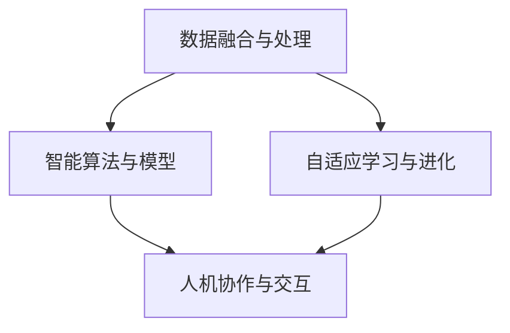

                 

关键词：人工智能、AI 2.0、技术变革、机遇与挑战

> 摘要：本文旨在探讨李开复关于AI 2.0时代的见解，分析其带来的机遇与挑战，并对未来人工智能技术的发展趋势进行展望。

## 1. 背景介绍

### 1.1 人工智能的发展历程

人工智能（AI）作为计算机科学的一个重要分支，其发展历程可以追溯到20世纪50年代。从最初的符号主义（Symbolic AI）到基于规则的系统，再到基于模型的机器学习，人工智能经历了多个阶段的技术变革。

### 1.2 人工智能的第一次浪潮

在20世纪80年代，人工智能迎来了第一次浪潮。这一时期，专家系统和基于知识的系统成为研究热点。专家系统通过模拟人类专家的推理过程，实现了在特定领域的高度智能化。然而，这种基于规则的方法在处理复杂问题时显得力不从心。

### 1.3 人工智能的第二次浪潮

进入21世纪，人工智能迎来了第二次浪潮。这一次，机器学习成为主流。特别是深度学习的崛起，使得人工智能在图像识别、语音识别等领域取得了突破性的进展。

## 2. 核心概念与联系

### 2.1 AI 1.0与AI 2.0

李开复提出了AI 1.0与AI 2.0的概念。AI 1.0是指以机器学习为核心的人工智能，其特点是基于数据和模型进行学习与推理。而AI 2.0则是指更加智能化、自适应化的人工智能，它不仅仅依赖于数据和模型，还能够通过自我学习和自我进化实现更高的智能水平。

### 2.2 AI 2.0的核心架构

为了实现AI 2.0，需要构建一个更加开放、自适应的智能系统。这包括以下几个方面：

- **数据融合与处理**：实现多源数据的集成与处理，提高数据的利用效率。
- **智能算法与模型**：开发更加高效、可解释的算法与模型，提高系统的智能水平。
- **自适应学习与进化**：通过持续的学习和进化，使系统具备自我优化和自我改进的能力。
- **人机协作与交互**：实现人与机器的紧密协作，提高系统的实用性和用户体验。

下面是AI 2.0的核心架构的Mermaid流程图：



## 3. 核心算法原理 & 具体操作步骤

### 3.1 算法原理概述

AI 2.0的核心算法主要包括深度学习、强化学习、迁移学习等。这些算法通过不断的学习和优化，实现了更高层次的智能。

### 3.2 算法步骤详解

- **深度学习**：通过多层神经网络对数据进行特征提取和分类。
- **强化学习**：通过与环境交互，不断调整策略以最大化奖励。
- **迁移学习**：利用已有模型的权重和知识，对新任务进行快速适应。

### 3.3 算法优缺点

- **深度学习**：优点在于强大的特征提取能力，但缺点是训练过程复杂、对数据量要求高。
- **强化学习**：优点在于能够自主探索和优化策略，但缺点是收敛速度慢、需要大量交互数据。
- **迁移学习**：优点在于快速适应新任务，但缺点是对先验知识的要求高。

### 3.4 算法应用领域

AI 2.0的核心算法在各个领域都展现了巨大的应用潜力，包括：

- **自动驾驶**：通过深度学习和强化学习实现自主驾驶。
- **医疗诊断**：利用深度学习进行医学图像分析和疾病诊断。
- **金融风控**：通过迁移学习进行风险控制和市场预测。

## 4. 数学模型和公式 & 详细讲解 & 举例说明

### 4.1 数学模型构建

AI 2.0的数学模型主要包括神经网络模型、决策树模型、支持向量机模型等。下面以神经网络模型为例进行讲解。

### 4.2 公式推导过程

神经网络模型的核心公式包括：

- **激活函数**：$$ f(x) = \sigma(z) = \frac{1}{1 + e^{-z}} $$
- **前向传播**：$$ z = \sum_{j} w_{ji}x_{j} + b_{i} $$
- **反向传播**：$$ \delta_{i} = \frac{\partial L}{\partial z_{i}} $$

### 4.3 案例分析与讲解

以图像识别为例，利用神经网络模型进行图像分类的具体步骤如下：

1. **数据预处理**：对图像进行缩放、裁剪、归一化等处理。
2. **构建神经网络**：设计多层神经网络，包括输入层、隐藏层和输出层。
3. **训练神经网络**：通过反向传播算法，不断调整网络权重和偏置，使模型在训练数据上达到最优。
4. **测试神经网络**：在测试数据上评估模型的性能，并进行调优。

## 5. 项目实践：代码实例和详细解释说明

### 5.1 开发环境搭建

- **硬件环境**：配备至少4GB内存的计算机。
- **软件环境**：安装Python、TensorFlow等开发工具。

### 5.2 源代码详细实现

以下是使用TensorFlow实现图像识别的简单代码示例：

```python
import tensorflow as tf

# 构建神经网络模型
model = tf.keras.Sequential([
    tf.keras.layers.Conv2D(32, (3, 3), activation='relu', input_shape=(28, 28, 1)),
    tf.keras.layers.MaxPooling2D((2, 2)),
    tf.keras.layers.Flatten(),
    tf.keras.layers.Dense(128, activation='relu'),
    tf.keras.layers.Dense(10, activation='softmax')
])

# 编译模型
model.compile(optimizer='adam',
              loss='categorical_crossentropy',
              metrics=['accuracy'])

# 训练模型
model.fit(x_train, y_train, epochs=5, batch_size=32, validation_split=0.2)

# 测试模型
test_loss, test_acc = model.evaluate(x_test, y_test)
print('Test accuracy:', test_acc)
```

### 5.3 代码解读与分析

- **Conv2D层**：实现卷积操作，提取图像特征。
- **MaxPooling2D层**：实现最大值池化操作，减少参数数量。
- **Flatten层**：将多维数据展开为一维数据，便于后续处理。
- **Dense层**：实现全连接操作，进行分类预测。

## 6. 实际应用场景

### 6.1 自动驾驶

自动驾驶是AI 2.0的重要应用领域之一。通过深度学习和强化学习，实现车辆在复杂环境中的自主驾驶。

### 6.2 医疗诊断

利用AI 2.0技术，实现医学图像的分析和疾病的自动诊断，提高医疗效率和准确性。

### 6.3 金融风控

通过迁移学习，实现金融市场的风险控制和投资预测，为金融机构提供决策支持。

## 7. 工具和资源推荐

### 7.1 学习资源推荐

- **书籍**：《深度学习》、《强化学习》、《机器学习实战》等。
- **在线课程**：Coursera、edX、Udacity等平台上的相关课程。

### 7.2 开发工具推荐

- **Python**：Python是AI 2.0开发的主要语言，具有丰富的库和框架。
- **TensorFlow**：TensorFlow是Google推出的开源深度学习框架，广泛应用于AI 2.0项目的开发。

### 7.3 相关论文推荐

- **《Deep Learning》**：由Ian Goodfellow等人撰写的深度学习经典教材。
- **《Reinforcement Learning: An Introduction》**：由Richard S. Sutton和Barto N.撰写的强化学习入门书籍。

## 8. 总结：未来发展趋势与挑战

### 8.1 研究成果总结

AI 2.0技术的发展取得了显著成果，包括深度学习、强化学习、迁移学习等核心算法的突破，以及自动驾驶、医疗诊断、金融风控等实际应用领域的成功案例。

### 8.2 未来发展趋势

未来，AI 2.0将继续朝着更加智能化、自适应化的方向发展。同时，跨学科融合、人机协作等新兴领域也将成为研究热点。

### 8.3 面临的挑战

尽管AI 2.0具有巨大的发展潜力，但同时也面临着数据安全、隐私保护、伦理道德等挑战。如何解决这些问题，将是未来AI 2.0发展的关键。

### 8.4 研究展望

随着技术的不断进步，AI 2.0有望在未来实现更高的智能水平，为人类带来更多的便利和福祉。

## 9. 附录：常见问题与解答

### 9.1 什么是AI 2.0？

AI 2.0是指更加智能化、自适应化的人工智能，它通过自我学习和自我进化实现更高的智能水平。

### 9.2 AI 2.0的核心算法有哪些？

AI 2.0的核心算法包括深度学习、强化学习、迁移学习等。

### 9.3 AI 2.0有哪些实际应用领域？

AI 2.0在自动驾驶、医疗诊断、金融风控等众多领域都有广泛的应用。

### 9.4 如何入门AI 2.0？

建议从学习Python编程语言和TensorFlow框架开始，并阅读相关书籍和在线课程。

## 作者署名

作者：禅与计算机程序设计艺术 / Zen and the Art of Computer Programming
```markdown
# 李开复：AI 2.0 时代的机遇

## 关键词：人工智能、AI 2.0、技术变革、机遇与挑战

## 摘要：本文旨在探讨李开复关于AI 2.0时代的见解，分析其带来的机遇与挑战，并对未来人工智能技术的发展趋势进行展望。

### 1. 背景介绍

#### 1.1 人工智能的发展历程

人工智能（AI）作为计算机科学的一个重要分支，其发展历程可以追溯到20世纪50年代。从最初的符号主义（Symbolic AI）到基于规则的系统，再到基于模型的机器学习，人工智能经历了多个阶段的技术变革。

符号主义人工智能：以逻辑推理和知识表示为核心，试图模拟人类专家的思维过程。这一阶段的人工智能系统，如专家系统（Expert Systems），虽然在特定领域取得了成功，但在处理复杂、不确定的问题时显得力不从心。

基于规则的系统：为了克服符号主义人工智能的局限性，研究者开始探索基于规则的系统。这些系统通过定义一系列规则和条件，来实现对问题的推理和决策。然而，这种基于规则的方法在应对动态变化和复杂环境时，仍然存在一定的局限。

基于模型的机器学习：随着计算能力的提升和数据量的爆炸性增长，机器学习成为人工智能研究的主要方向。基于模型的机器学习，通过从大量数据中自动学习特征和规律，实现了在图像识别、语音识别等领域的突破性进展。

#### 1.2 人工智能的第一次浪潮

在20世纪80年代，人工智能迎来了第一次浪潮。这一时期，专家系统和基于知识的系统成为研究热点。专家系统通过模拟人类专家的推理过程，实现了在特定领域的高度智能化。然而，这种基于规则的方法在处理复杂问题时显得力不从心。

#### 1.3 人工智能的第二次浪潮

进入21世纪，人工智能迎来了第二次浪潮。这一次，机器学习成为主流。特别是深度学习的崛起，使得人工智能在图像识别、语音识别等领域取得了突破性的进展。深度学习通过构建多层神经网络，自动提取数据的特征，实现了对复杂任务的建模和预测。

### 2. 核心概念与联系

#### 2.1 AI 1.0与AI 2.0

李开复提出了AI 1.0与AI 2.0的概念。AI 1.0是指以机器学习为核心的人工智能，其特点是基于数据和模型进行学习与推理。而AI 2.0则是指更加智能化、自适应化的人工智能，它不仅仅依赖于数据和模型，还能够通过自我学习和自我进化实现更高的智能水平。

#### 2.2 AI 2.0的核心架构

为了实现AI 2.0，需要构建一个更加开放、自适应的智能系统。这包括以下几个方面：

- **数据融合与处理**：实现多源数据的集成与处理，提高数据的利用效率。
- **智能算法与模型**：开发更加高效、可解释的算法与模型，提高系统的智能水平。
- **自适应学习与进化**：通过持续的学习和进化，使系统具备自我优化和自我改进的能力。
- **人机协作与交互**：实现人与机器的紧密协作，提高系统的实用性和用户体验。

以下是AI 2.0的核心架构的Mermaid流程图：


### 3. 核心算法原理 & 具体操作步骤

#### 3.1 算法原理概述

AI 2.0的核心算法主要包括深度学习、强化学习、迁移学习等。这些算法通过不断的学习和优化，实现了更高层次的智能。

#### 3.2 算法步骤详解

- **深度学习**：通过多层神经网络对数据进行特征提取和分类。
- **强化学习**：通过与环境交互，不断调整策略以最大化奖励。
- **迁移学习**：利用已有模型的权重和知识，对新任务进行快速适应。

#### 3.3 算法优缺点

- **深度学习**：优点在于强大的特征提取能力，但缺点是训练过程复杂、对数据量要求高。
- **强化学习**：优点在于能够自主探索和优化策略，但缺点是收敛速度慢、需要大量交互数据。
- **迁移学习**：优点在于快速适应新任务，但缺点是对先验知识的要求高。

#### 3.4 算法应用领域

AI 2.0的核心算法在各个领域都展现了巨大的应用潜力，包括：

- **自动驾驶**：通过深度学习和强化学习实现自主驾驶。
- **医疗诊断**：利用深度学习进行医学图像分析和疾病诊断。
- **金融风控**：通过迁移学习进行风险控制和市场预测。

### 4. 数学模型和公式 & 详细讲解 & 举例说明

#### 4.1 数学模型构建

AI 2.0的数学模型主要包括神经网络模型、决策树模型、支持向量机模型等。下面以神经网络模型为例进行讲解。

#### 4.2 公式推导过程

神经网络模型的核心公式包括：

- **激活函数**：$$ f(x) = \sigma(z) = \frac{1}{1 + e^{-z}} $$
- **前向传播**：$$ z = \sum_{j} w_{ji}x_{j} + b_{i} $$
- **反向传播**：$$ \delta_{i} = \frac{\partial L}{\partial z_{i}} $$

#### 4.3 案例分析与讲解

以图像识别为例，利用神经网络模型进行图像分类的具体步骤如下：

1. **数据预处理**：对图像进行缩放、裁剪、归一化等处理。
2. **构建神经网络**：设计多层神经网络，包括输入层、隐藏层和输出层。
3. **训练神经网络**：通过反向传播算法，不断调整网络权重和偏置，使模型在训练数据上达到最优。
4. **测试神经网络**：在测试数据上评估模型的性能，并进行调优。

### 5. 项目实践：代码实例和详细解释说明

#### 5.1 开发环境搭建

- **硬件环境**：配备至少4GB内存的计算机。
- **软件环境**：安装Python、TensorFlow等开发工具。

#### 5.2 源代码详细实现

以下是使用TensorFlow实现图像识别的简单代码示例：

```python
import tensorflow as tf

# 构建神经网络模型
model = tf.keras.Sequential([
    tf.keras.layers.Conv2D(32, (3, 3), activation='relu', input_shape=(28, 28, 1)),
    tf.keras.layers.MaxPooling2D((2, 2)),
    tf.keras.layers.Flatten(),
    tf.keras.layers.Dense(128, activation='relu'),
    tf.keras.layers.Dense(10, activation='softmax')
])

# 编译模型
model.compile(optimizer='adam',
              loss='categorical_crossentropy',
              metrics=['accuracy'])

# 训练模型
model.fit(x_train, y_train, epochs=5, batch_size=32, validation_split=0.2)

# 测试模型
test_loss, test_acc = model.evaluate(x_test, y_test)
print('Test accuracy:', test_acc)
```

#### 5.3 代码解读与分析

- **Conv2D层**：实现卷积操作，提取图像特征。
- **MaxPooling2D层**：实现最大值池化操作，减少参数数量。
- **Flatten层**：将多维数据展开为一维数据，便于后续处理。
- **Dense层**：实现全连接操作，进行分类预测。

### 6. 实际应用场景

#### 6.1 自动驾驶

自动驾驶是AI 2.0的重要应用领域之一。通过深度学习和强化学习，实现车辆在复杂环境中的自主驾驶。

#### 6.2 医疗诊断

利用AI 2.0技术，实现医学图像的分析和疾病的自动诊断，提高医疗效率和准确性。

#### 6.3 金融风控

通过迁移学习，实现金融市场的风险控制和投资预测，为金融机构提供决策支持。

### 7. 工具和资源推荐

#### 7.1 学习资源推荐

- **书籍**：《深度学习》、《强化学习》、《机器学习实战》等。
- **在线课程**：Coursera、edX、Udacity等平台上的相关课程。

#### 7.2 开发工具推荐

- **Python**：Python是AI 2.0开发的主要语言，具有丰富的库和框架。
- **TensorFlow**：TensorFlow是Google推出的开源深度学习框架，广泛应用于AI 2.0项目的开发。

#### 7.3 相关论文推荐

- **《Deep Learning》**：由Ian Goodfellow等人撰写的深度学习经典教材。
- **《Reinforcement Learning: An Introduction》**：由Richard S. Sutton和Barto N.撰写的强化学习入门书籍。

### 8. 总结：未来发展趋势与挑战

#### 8.1 研究成果总结

AI 2.0技术的发展取得了显著成果，包括深度学习、强化学习、迁移学习等核心算法的突破，以及自动驾驶、医疗诊断、金融风控等实际应用领域的成功案例。

#### 8.2 未来发展趋势

未来，AI 2.0将继续朝着更加智能化、自适应化的方向发展。同时，跨学科融合、人机协作等新兴领域也将成为研究热点。

#### 8.3 面临的挑战

尽管AI 2.0具有巨大的发展潜力，但同时也面临着数据安全、隐私保护、伦理道德等挑战。如何解决这些问题，将是未来AI 2.0发展的关键。

#### 8.4 研究展望

随着技术的不断进步，AI 2.0有望在未来实现更高的智能水平，为人类带来更多的便利和福祉。

### 9. 附录：常见问题与解答

#### 9.1 什么是AI 2.0？

AI 2.0是指更加智能化、自适应化的人工智能，它通过自我学习和自我进化实现更高的智能水平。

#### 9.2 AI 2.0的核心算法有哪些？

AI 2.0的核心算法包括深度学习、强化学习、迁移学习等。

#### 9.3 AI 2.0有哪些实际应用领域？

AI 2.0在自动驾驶、医疗诊断、金融风控等众多领域都有广泛的应用。

#### 9.4 如何入门AI 2.0？

建议从学习Python编程语言和TensorFlow框架开始，并阅读相关书籍和在线课程。

## 作者署名

作者：禅与计算机程序设计艺术 / Zen and the Art of Computer Programming
```

