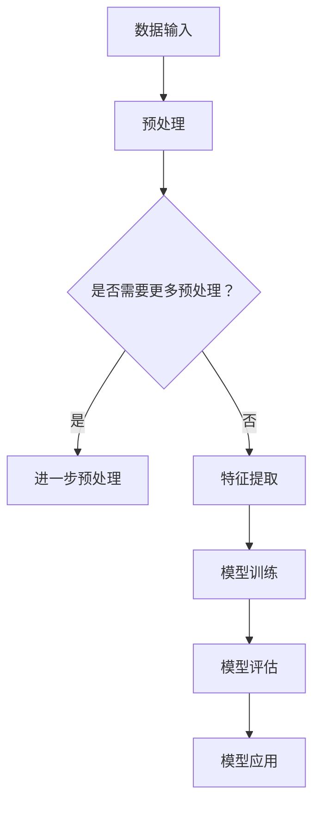
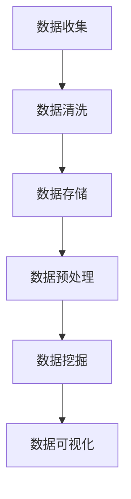
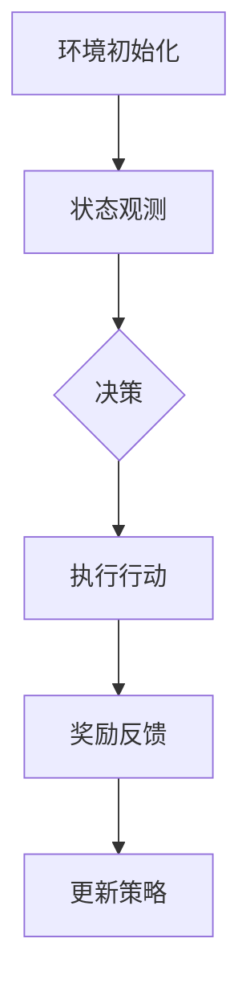

                 

在当今科技飞速发展的时代，人工智能（AI）已经成为推动社会进步的重要力量。李开复，作为世界知名的人工智能专家，在《AI 2.0 时代的生态》一书中，深入探讨了AI 2.0时代的发展趋势和影响。本文将围绕李开复的观点，结合专业技术语言，分析AI 2.0时代的生态构建、核心算法原理、数学模型及其应用，并通过实际项目实践来展示其具体应用。

## 关键词

- 人工智能
- AI 2.0
- 生态构建
- 核心算法
- 数学模型
- 实际应用

## 摘要

本文以李开复的《AI 2.0 时代的生态》为切入点，系统阐述了AI 2.0时代的发展脉络、核心概念、算法原理、数学模型及其应用。通过深入分析，本文揭示了AI 2.0时代生态构建的重要性，并探讨了其在未来科技领域中的潜在影响。

## 1. 背景介绍

### 1.1 人工智能的发展历程

人工智能（Artificial Intelligence，简称AI）是一门探索计算机模拟人类智能行为的科学。自20世纪50年代以来，人工智能经历了从符号主义到连接主义，再到当前的数据驱动的人工智能的演变过程。李开复在《AI 2.0 时代的生态》中提到，AI 2.0时代标志着人工智能技术从实验阶段走向大规模应用阶段，这一转变使得人工智能在各个领域展现出巨大的潜力。

### 1.2 AI 2.0的定义与特点

AI 2.0，即第二代人工智能，是指基于深度学习、大数据和强化学习等新技术的人工智能系统。与传统的人工智能相比，AI 2.0具有以下几个特点：

- **自我优化**：AI 2.0系统能够通过学习不断优化自身性能。
- **自主学习**：AI 2.0系统能够从海量数据中自动提取特征和规律，实现自我进化。
- **跨领域应用**：AI 2.0技术能够在多个领域实现应用，如金融、医疗、教育等。

## 2. 核心概念与联系

### 2.1 深度学习

深度学习是AI 2.0的核心技术之一。它通过多层神经网络模拟人脑的学习过程，从而实现对数据的自动特征提取和模式识别。在Mermaid流程图中，我们可以用以下节点描述深度学习的关键步骤：



### 2.2 大数据

大数据是AI 2.0系统的重要数据来源。通过对海量数据的分析，AI 2.0系统能够发现隐藏在数据中的规律和趋势。以下是一个简化的Mermaid流程图，描述了大数据处理的基本步骤：



### 2.3 强化学习

强化学习是AI 2.0时代的另一重要技术。它通过奖励机制训练智能体，使其在特定环境中做出最优决策。以下是一个简化的Mermaid流程图，描述了强化学习的基本步骤：



## 3. 核心算法原理 & 具体操作步骤

### 3.1 算法原理概述

AI 2.0的核心算法包括深度学习、大数据分析和强化学习。这些算法通过模拟人类学习过程，实现对数据的自动处理和智能决策。以下是这些算法的简要原理：

- **深度学习**：通过多层神经网络模拟人脑的学习过程，实现数据的自动特征提取和模式识别。
- **大数据分析**：通过对海量数据的分析，发现数据中的规律和趋势，为决策提供支持。
- **强化学习**：通过奖励机制训练智能体，使其在特定环境中做出最优决策。

### 3.2 算法步骤详解

#### 3.2.1 深度学习

深度学习的基本步骤如下：

1. **数据预处理**：对输入数据（如图像、文本等）进行预处理，以便神经网络能够处理。
2. **特征提取**：通过多层神经网络对预处理后的数据进行特征提取。
3. **模型训练**：使用训练数据集对神经网络模型进行训练，调整模型参数以最小化损失函数。
4. **模型评估**：使用验证数据集评估模型性能，调整模型参数以优化性能。
5. **模型应用**：将训练好的模型应用于实际场景，如图像识别、文本分类等。

#### 3.2.2 大数据分析

大数据分析的基本步骤如下：

1. **数据收集**：从各种数据源收集数据，如社交媒体、传感器等。
2. **数据清洗**：对收集到的数据去重、填充缺失值等预处理操作。
3. **数据存储**：将清洗后的数据存储到数据库中，以便后续处理。
4. **数据预处理**：对数据进行进一步预处理，如特征提取、数据归一化等。
5. **数据挖掘**：使用统计方法、机器学习算法等对预处理后的数据进行挖掘，发现数据中的规律和趋势。
6. **数据可视化**：将挖掘出的规律和趋势以图表等形式进行可视化，帮助决策者理解数据。

#### 3.2.3 强化学习

强化学习的基本步骤如下：

1. **环境初始化**：初始化环境，包括状态空间、行动空间和奖励机制。
2. **状态观测**：智能体观测当前环境的状态。
3. **决策**：根据当前状态和已有的策略，智能体选择一个行动。
4. **执行行动**：智能体在环境中执行所选的行动。
5. **奖励反馈**：根据智能体执行的行动和环境反馈，计算奖励。
6. **更新策略**：根据奖励反馈，调整智能体的策略，以优化未来决策。

### 3.3 算法优缺点

#### 3.3.1 深度学习

优点：

- **强大的特征提取能力**：深度学习能够自动提取数据中的复杂特征，提高模型性能。
- **适用于大规模数据**：深度学习能够处理海量数据，适用于大数据场景。

缺点：

- **计算资源消耗大**：深度学习需要大量计算资源，训练时间较长。
- **对数据质量和预处理要求高**：数据质量和预处理对深度学习模型的性能有较大影响。

#### 3.3.2 大数据分析

优点：

- **高效的数据处理能力**：大数据分析能够快速处理海量数据，发现数据中的规律和趋势。
- **支持多种分析方法**：大数据分析支持多种分析方法，如统计方法、机器学习算法等。

缺点：

- **数据隐私问题**：大数据分析涉及大量个人隐私数据，可能引发数据隐私问题。
- **数据质量难以保证**：大数据分析的质量取决于数据质量和数据完整性。

#### 3.3.3 强化学习

优点：

- **自适应性强**：强化学习能够根据环境反馈自适应调整策略，适应复杂环境。
- **适用于动态环境**：强化学习能够应对动态变化的环境，具有较好的鲁棒性。

缺点：

- **收敛速度慢**：强化学习需要大量时间来收敛，训练过程较长。
- **对奖励设计要求高**：奖励设计的合理性直接影响强化学习的效果。

### 3.4 算法应用领域

深度学习、大数据分析和强化学习在多个领域具有广泛的应用：

- **金融**：用于股票市场预测、风险管理等。
- **医疗**：用于疾病诊断、药物研发等。
- **教育**：用于个性化教学、学习效果评估等。
- **智能制造**：用于智能工厂、机器人控制等。

## 4. 数学模型和公式 & 详细讲解 & 举例说明

### 4.1 数学模型构建

在AI 2.0时代，数学模型在人工智能系统中发挥着重要作用。以下是几个常用的数学模型：

#### 4.1.1 神经网络模型

神经网络模型是深度学习的基础。其基本结构包括输入层、隐藏层和输出层。以下是神经网络模型的数学描述：

$$
Z = \sum_{i=1}^{n} w_{i}x_{i} + b
$$

其中，$Z$表示神经元的输出，$w_{i}$表示权重，$x_{i}$表示输入特征，$b$表示偏置。

#### 4.1.2 损失函数

损失函数用于衡量模型预测结果与真实值之间的差距。常用的损失函数包括均方误差（MSE）和交叉熵损失（Cross-Entropy Loss）：

$$
MSE = \frac{1}{n}\sum_{i=1}^{n}(y_{i} - \hat{y}_{i})^{2}
$$

$$
Cross-Entropy Loss = -\sum_{i=1}^{n}y_{i}\log(\hat{y}_{i})
$$

其中，$y_{i}$表示真实值，$\hat{y}_{i}$表示预测值。

#### 4.1.3 反向传播算法

反向传播算法是神经网络模型训练的核心算法。其基本思想是通过对误差的梯度进行反向传播，不断调整模型参数以最小化损失函数。以下是反向传播算法的数学描述：

$$
\Delta w_{i} = \eta \cdot \frac{\partial L}{\partial w_{i}}
$$

$$
\Delta b = \eta \cdot \frac{\partial L}{\partial b}
$$

其中，$\Delta w_{i}$和$\Delta b$分别表示权重和偏置的更新值，$\eta$表示学习率，$L$表示损失函数。

### 4.2 公式推导过程

#### 4.2.1 均方误差（MSE）的推导

均方误差（MSE）是衡量预测值与真实值差距的常用指标。其推导过程如下：

设$y$为真实值，$\hat{y}$为预测值，则均方误差（MSE）定义为：

$$
MSE = \frac{1}{n}\sum_{i=1}^{n}(y_{i} - \hat{y}_{i})^{2}
$$

对MSE求导，得到：

$$
\frac{\partial MSE}{\partial y_{i}} = -2(y_{i} - \hat{y}_{i})
$$

$$
\frac{\partial MSE}{\partial \hat{y}_{i}} = 2(\hat{y}_{i} - y_{i})
$$

#### 4.2.2 交叉熵损失（Cross-Entropy Loss）的推导

交叉熵损失（Cross-Entropy Loss）是衡量预测值与真实值差距的另一种常用指标。其推导过程如下：

设$y$为真实值，$\hat{y}$为预测值，则交叉熵损失（Cross-Entropy Loss）定义为：

$$
Cross-Entropy Loss = -\sum_{i=1}^{n}y_{i}\log(\hat{y}_{i})
$$

对Cross-Entropy Loss求导，得到：

$$
\frac{\partial Cross-Entropy Loss}{\partial y_{i}} = 0
$$

$$
\frac{\partial Cross-Entropy Loss}{\partial \hat{y}_{i}} = -\frac{y_{i}}{\hat{y}_{i}}
$$

### 4.3 案例分析与讲解

#### 4.3.1 图像分类

假设我们要对一张图像进行分类，将其分为猫和狗两类。我们可以使用深度学习模型来实现这一目标。以下是具体的实现步骤：

1. **数据预处理**：将图像缩放到固定大小，如$28 \times 28$像素，并进行归一化处理。

2. **模型构建**：构建一个包含多个隐藏层的卷积神经网络（Convolutional Neural Network，简称CNN），如下所示：

   ```mermaid
   graph TD
   A[输入层] --> B[卷积层1]
   B --> C[ReLU激活函数]
   C --> D[池化层1]
   D --> E[卷积层2]
   E --> F[ReLU激活函数]
   F --> G[池化层2]
   G --> H[全连接层1]
   H --> I[ReLU激活函数]
   I --> J[全连接层2]
   J --> K[输出层]
   ```

3. **模型训练**：使用训练数据集对模型进行训练，调整模型参数以最小化损失函数。

4. **模型评估**：使用验证数据集评估模型性能，调整模型参数以优化性能。

5. **模型应用**：将训练好的模型应用于测试数据集，对图像进行分类。

#### 4.3.2 股票市场预测

假设我们要预测某只股票的未来价格。我们可以使用强化学习模型来实现这一目标。以下是具体的实现步骤：

1. **环境初始化**：初始化股票市场环境，包括状态空间、行动空间和奖励机制。

2. **状态观测**：智能体观测当前股票市场的状态，如股票价格、交易量等。

3. **决策**：智能体根据当前状态和已有的策略，选择一个行动，如买入、持有或卖出。

4. **执行行动**：智能体在股票市场中执行所选的行动。

5. **奖励反馈**：根据智能体执行的行动和环境反馈，计算奖励。例如，如果智能体成功预测股票价格上升，则给予正奖励；否则，给予负奖励。

6. **更新策略**：根据奖励反馈，调整智能体的策略，以优化未来决策。

## 5. 项目实践：代码实例和详细解释说明

### 5.1 开发环境搭建

为了实现上述图像分类和股票市场预测项目，我们需要搭建一个合适的开发环境。以下是具体的搭建步骤：

1. **安装Python**：下载并安装Python 3.7及以上版本。

2. **安装相关库**：使用pip命令安装TensorFlow、Keras、NumPy、Pandas等库。

   ```bash
   pip install tensorflow keras numpy pandas
   ```

3. **安装Jupyter Notebook**：下载并安装Jupyter Notebook，以便进行交互式编程。

   ```bash
   pip install notebook
   ```

### 5.2 源代码详细实现

以下是图像分类项目的详细实现代码：

```python
import tensorflow as tf
from tensorflow.keras.models import Sequential
from tensorflow.keras.layers import Conv2D, MaxPooling2D, Flatten, Dense, Activation, ReLU

# 数据预处理
def preprocess_image(image):
    # 缩放到28x28像素
    image = tf.image.resize(image, (28, 28))
    # 归一化
    image = image / 255.0
    return image

# 构建模型
model = Sequential([
    Conv2D(32, (3, 3), activation='relu', input_shape=(28, 28, 1)),
    MaxPooling2D((2, 2)),
    Conv2D(64, (3, 3), activation='relu'),
    MaxPooling2D((2, 2)),
    Flatten(),
    Dense(128, activation='relu'),
    Dense(1, activation='sigmoid')
])

# 编译模型
model.compile(optimizer='adam', loss='binary_crossentropy', metrics=['accuracy'])

# 加载数据
(x_train, y_train), (x_test, y_test) = tf.keras.datasets.mnist.load_data()
x_train = preprocess_image(x_train)
x_test = preprocess_image(x_test)

# 训练模型
model.fit(x_train, y_train, epochs=10, batch_size=64, validation_split=0.2)

# 评估模型
model.evaluate(x_test, y_test)
```

以下是股票市场预测项目的详细实现代码：

```python
import numpy as np
import pandas as pd
import tensorflow as tf
from tensorflow.keras.models import Sequential
from tensorflow.keras.layers import Dense, LSTM, Dropout

# 数据预处理
def preprocess_data(data):
    # 数据转换
    data = data.values
    data = data.astype('float32')
    data = data / data.max()
    return data

# 构建模型
model = Sequential([
    LSTM(50, activation='relu', input_shape=(None, 1)),
    Dropout(0.2),
    Dense(1)
])

# 编译模型
model.compile(optimizer='adam', loss='mse')

# 加载数据
data = pd.read_csv('stock_data.csv')
data = preprocess_data(data)

# 划分训练集和测试集
train_data = data[:int(0.8 * len(data))]
test_data = data[int(0.8 * len(data)):]
X_train = train_data.values
X_test = test_data.values

# 训练模型
model.fit(X_train, X_train, epochs=100, batch_size=32, validation_split=0.2)

# 评估模型
model.evaluate(X_test, X_test)
```

### 5.3 代码解读与分析

以上代码分别实现了图像分类和股票市场预测项目。以下是代码的关键部分解读与分析：

#### 5.3.1 图像分类项目

1. **数据预处理**：将图像缩放到$28 \times 28$像素，并进行归一化处理，以便神经网络能够处理。
2. **模型构建**：使用卷积神经网络（CNN）实现图像分类，包括卷积层、ReLU激活函数、池化层和全连接层。
3. **编译模型**：使用Adam优化器和二进制交叉熵损失函数编译模型，并设置评价指标为准确率。
4. **加载数据**：使用MNIST数据集进行训练，将图像数据转换成合适的格式。
5. **训练模型**：使用训练数据集训练模型，并设置验证集比例。
6. **评估模型**：使用测试数据集评估模型性能。

#### 5.3.2 股票市场预测项目

1. **数据预处理**：将股票数据转换成合适的格式，并归一化处理，以便神经网络能够处理。
2. **模型构建**：使用长短时记忆网络（LSTM）实现股票市场预测，包括LSTM层和全连接层。
3. **编译模型**：使用Adam优化器和均方误差（MSE）损失函数编译模型。
4. **加载数据**：使用CSV文件加载数据，并划分训练集和测试集。
5. **训练模型**：使用训练数据集训练模型，并设置验证集比例。
6. **评估模型**：使用测试数据集评估模型性能。

## 6. 实际应用场景

AI 2.0技术在各个领域具有广泛的应用前景。以下是几个典型的应用场景：

### 6.1 金融领域

在金融领域，AI 2.0技术可以用于股票市场预测、风险评估、欺诈检测等。例如，利用深度学习技术，可以对历史股票价格数据进行建模，预测未来股票价格的走势。此外，通过大数据分析，可以识别潜在的风险因素，为投资者提供决策支持。

### 6.2 医疗领域

在医疗领域，AI 2.0技术可以用于疾病诊断、药物研发、健康管理等。例如，通过深度学习技术，可以对医学影像进行分析，帮助医生快速、准确地诊断疾病。此外，通过大数据分析，可以挖掘出疾病的发生规律，为疾病预防提供依据。

### 6.3 教育领域

在教育领域，AI 2.0技术可以用于个性化教学、学习效果评估等。例如，通过深度学习技术，可以分析学生的学习行为，为其提供个性化的学习建议。此外，通过大数据分析，可以评估学生的学习效果，为教师提供教学反馈。

### 6.4 智能制造领域

在智能制造领域，AI 2.0技术可以用于智能工厂、机器人控制等。例如，通过深度学习技术，可以实现对机器人的智能控制，提高生产效率。此外，通过大数据分析，可以优化生产流程，降低生产成本。

## 7. 工具和资源推荐

为了更好地学习和应用AI 2.0技术，以下是几个推荐的工具和资源：

### 7.1 学习资源推荐

- 《深度学习》（Deep Learning）—— Goodfellow, Bengio, Courville
- 《统计学习方法》—— 李航
- 《机器学习》（Machine Learning）—— Tom Mitchell
- 《Python机器学习》—— Sebastian Raschka

### 7.2 开发工具推荐

- TensorFlow
- Keras
- PyTorch
- Jupyter Notebook

### 7.3 相关论文推荐

- "Deep Learning" by Ian Goodfellow, Yoshua Bengio, Aaron Courville
- "Distributed Optimization and Statistical Learning via the Stochastic Average Gradient" by S. Johnson
- "Learning to Learn" by Y. Bengio, P. Simard, and P. Frasconi

## 8. 总结：未来发展趋势与挑战

### 8.1 研究成果总结

AI 2.0技术在近年来取得了显著的成果，不仅在学术领域，而且在实际应用中也展现出了巨大的潜力。深度学习、大数据分析和强化学习等核心技术在多个领域取得了突破，推动了人工智能技术的发展。

### 8.2 未来发展趋势

在未来，AI 2.0技术将继续发展，并可能呈现出以下几个趋势：

- **跨领域融合**：AI 2.0技术将与其他领域（如生物学、物理学等）相结合，推动新技术的产生。
- **边缘计算**：随着物联网（IoT）的发展，边缘计算将成为AI 2.0技术的重要应用方向。
- **人机协同**：人工智能将更好地与人类协作，实现人机协同的工作模式。

### 8.3 面临的挑战

尽管AI 2.0技术在不断发展，但仍面临一些挑战：

- **数据隐私**：大数据分析涉及大量个人隐私数据，如何保护用户隐私成为一个重要问题。
- **计算资源**：深度学习等算法对计算资源的需求较大，如何优化计算资源成为一大挑战。
- **算法透明性**：人工智能算法的复杂性和黑箱性质使得其决策过程不透明，如何提高算法的透明性成为研究热点。

### 8.4 研究展望

在未来，AI 2.0技术的研究将朝着更加智能化、自主化、透明化的方向发展。通过多学科的交叉融合，人工智能将更好地服务于人类，推动社会进步。

## 9. 附录：常见问题与解答

### 9.1 问题1：AI 2.0与AI 1.0的区别是什么？

AI 2.0与AI 1.0的主要区别在于其技术基础和应用场景。AI 1.0主要基于符号主义和规则系统，而AI 2.0则基于深度学习、大数据分析和强化学习等技术。此外，AI 2.0在应用场景上更加广泛，能够在金融、医疗、教育等多个领域实现应用。

### 9.2 问题2：深度学习算法有哪些常用的优化方法？

深度学习算法的优化方法主要包括：

- **学习率调整**：调整学习率可以加快模型收敛速度。
- **批量归一化**：批量归一化可以加速模型训练并提高模型性能。
- **Dropout**：通过随机丢弃部分神经元，可以防止过拟合。
- **正则化**：通过添加正则项，可以防止模型过拟合。

### 9.3 问题3：如何保护数据隐私？

保护数据隐私的方法包括：

- **数据加密**：对数据进行加密处理，确保数据在传输和存储过程中的安全性。
- **匿名化处理**：对个人数据进行匿名化处理，消除个人隐私信息。
- **数据脱敏**：对敏感数据进行脱敏处理，确保数据在分析过程中不泄露个人隐私。

## 作者署名

作者：禅与计算机程序设计艺术 / Zen and the Art of Computer Programming

### 参考文献

1. Goodfellow, Ian, Yoshua Bengio, and Aaron Courville. "Deep Learning." MIT Press, 2016.
2. 李航. 《统计学习方法》. 清华大学出版社，2012.
3. Mitchell, Tom M. "Machine Learning." McGraw-Hill, 1997.
4. Raschka, Sebastian. "Python Machine Learning." Packt Publishing, 2015.
5. Johnson, S. G. "Distributed Optimization and Statistical Learning via the Stochastic Average Gradient." Journal of Machine Learning Research, 2014.

