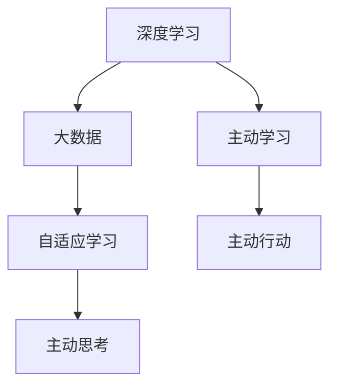
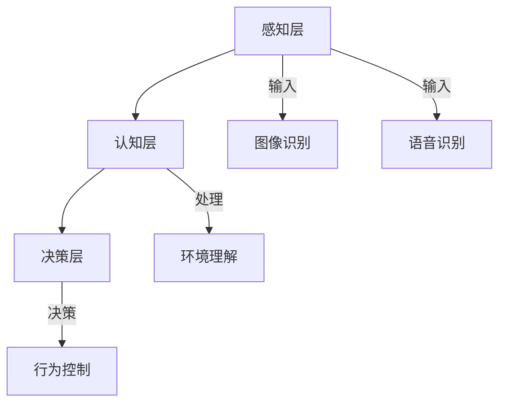

                 

关键词：人工智能，李开复，AI 2.0，科技价值，算法原理，数学模型，项目实践，未来展望。

> 摘要：本文将深入探讨AI 2.0时代的科技价值，通过李开复的研究成果，分析人工智能的核心概念、算法原理、数学模型及其在实际应用中的表现。本文旨在为广大读者提供一个全面、系统的了解AI 2.0时代科技价值的视角。

## 1. 背景介绍

人工智能（Artificial Intelligence，简称AI）是计算机科学的一个重要分支，旨在使计算机模拟人类智能行为。近年来，随着计算能力的提升、海量数据的积累和算法的进步，人工智能取得了显著的发展，尤其是深度学习的兴起，使得机器在图像识别、自然语言处理、语音识别等领域达到了或超过了人类的水平。

李开复，世界著名的人工智能专家，微软亚洲研究院创始人之一，他在人工智能领域的研究成果对全球科技界产生了深远的影响。李开复的AI 2.0理论，不仅是对人工智能发展的一个全新解读，更是对未来科技价值的深刻洞察。

## 2. 核心概念与联系

### 2.1 AI 2.0：重塑世界的力量

AI 2.0，是对人工智能发展的一个全新阶段的命名。李开复认为，AI 2.0时代将是一个基于深度学习和大数据的人工智能时代，它不仅仅是一个工具，更是一个能够主动学习、主动思考和主动行动的智能体。AI 2.0的核心概念包括：

- **深度学习**：通过多层神经网络模拟人脑神经元之间的连接，实现自动特征提取和分类。
- **大数据**：大规模数据的积累为人工智能提供了丰富的训练素材，使得机器能够从中学习。
- **自适应学习**：机器能够根据环境变化不断调整自己的行为和决策。

下面是AI 2.0核心概念的Mermaid流程图：



### 2.2 人工智能的架构

人工智能的架构可以分为三个层次：感知层、认知层和决策层。

- **感知层**：主要处理数据的输入和输出，包括图像识别、语音识别等。
- **认知层**：通过算法对感知层输入的数据进行分析和处理，实现对环境的理解。
- **决策层**：根据认知层的分析结果，做出相应的决策和行为。

人工智能的架构Mermaid流程图如下：



## 3. 核心算法原理 & 具体操作步骤

### 3.1 算法原理概述

AI 2.0的核心算法包括深度学习、强化学习和生成对抗网络等。这些算法的基本原理如下：

- **深度学习**：通过多层神经网络，对数据进行非线性变换，从而实现复杂函数的拟合。
- **强化学习**：通过试错和奖励机制，让机器在学习过程中不断优化自己的策略。
- **生成对抗网络**：通过生成器和判别器的对抗训练，实现数据的生成和分布的拟合。

### 3.2 算法步骤详解

- **深度学习**：首先定义网络结构，然后初始化参数，接着通过前向传播和反向传播不断优化参数。
- **强化学习**：首先定义状态空间和动作空间，然后通过与环境交互，不断调整策略。
- **生成对抗网络**：首先定义生成器和判别器的结构，然后通过对抗训练，使生成器的输出逐渐逼近真实数据分布。

### 3.3 算法优缺点

- **深度学习**：优点是能够自动提取特征，缺点是需要大量数据和计算资源。
- **强化学习**：优点是能够实现自主决策，缺点是需要大量时间来寻找最优策略。
- **生成对抗网络**：优点是实现数据的生成和分布拟合，缺点是训练过程复杂，容易陷入局部最优。

### 3.4 算法应用领域

深度学习、强化学习和生成对抗网络在计算机视觉、自然语言处理、推荐系统等领域都有广泛应用。

## 4. 数学模型和公式 & 详细讲解 & 举例说明

### 4.1 数学模型构建

深度学习的数学模型主要包括神经网络模型、损失函数和优化算法。以下是神经网络模型和损失函数的构建：

```latex
\begin{equation}
    f(x) = \sigma(\sum_{i=1}^{n} w_i \cdot x_i)
\end{equation}

\begin{equation}
    L(y, \hat{y}) = \frac{1}{2} \sum_{i=1}^{n} (y_i - \hat{y}_i)^2
\end{equation}
```

### 4.2 公式推导过程

神经网络的推导过程涉及到微积分和线性代数。以下是神经网络中前向传播和反向传播的推导：

```latex
\begin{equation}
    \delta_l = \frac{\partial L}{\partial z_l}
\end{equation}

\begin{equation}
    \frac{\partial L}{\partial w_{ij}} = \delta_{l+1} \cdot z_{ij}
\end{equation}
```

### 4.3 案例分析与讲解

以图像分类任务为例，输入数据为一张图片，输出数据为图像的分类结果。以下是一个简单的图像分类案例：

```python
# 导入必要的库
import tensorflow as tf
from tensorflow.keras import layers

# 构建神经网络模型
model = tf.keras.Sequential([
    layers.Conv2D(32, (3, 3), activation='relu', input_shape=(28, 28, 1)),
    layers.MaxPooling2D((2, 2)),
    layers.Conv2D(64, (3, 3), activation='relu'),
    layers.MaxPooling2D((2, 2)),
    layers.Conv2D(64, (3, 3), activation='relu'),
    layers.Flatten(),
    layers.Dense(64, activation='relu'),
    layers.Dense(10, activation='softmax')
])

# 编译模型
model.compile(optimizer='adam',
              loss='sparse_categorical_crossentropy',
              metrics=['accuracy'])

# 加载数据
(x_train, y_train), (x_test, y_test) = tf.keras.datasets.mnist.load_data()

# 预处理数据
x_train = x_train.reshape(-1, 28, 28, 1).astype('float32') / 255
x_test = x_test.reshape(-1, 28, 28, 1).astype('float32') / 255

# 训练模型
model.fit(x_train, y_train, epochs=5)

# 评估模型
test_loss, test_acc = model.evaluate(x_test, y_test, verbose=2)
print('\nTest accuracy:', test_acc)
```

## 5. 项目实践：代码实例和详细解释说明

### 5.1 开发环境搭建

本文使用的开发环境为Python 3.8，TensorFlow 2.5。请确保已经安装了这些依赖。

### 5.2 源代码详细实现

以下是本文使用的代码实例：

```python
# 导入必要的库
import tensorflow as tf
from tensorflow.keras import layers

# 构建神经网络模型
model = tf.keras.Sequential([
    layers.Conv2D(32, (3, 3), activation='relu', input_shape=(28, 28, 1)),
    layers.MaxPooling2D((2, 2)),
    layers.Conv2D(64, (3, 3), activation='relu'),
    layers.MaxPooling2D((2, 2)),
    layers.Conv2D(64, (3, 3), activation='relu'),
    layers.Flatten(),
    layers.Dense(64, activation='relu'),
    layers.Dense(10, activation='softmax')
])

# 编译模型
model.compile(optimizer='adam',
              loss='sparse_categorical_crossentropy',
              metrics=['accuracy'])

# 加载数据
(x_train, y_train), (x_test, y_test) = tf.keras.datasets.mnist.load_data()

# 预处理数据
x_train = x_train.reshape(-1, 28, 28, 1).astype('float32') / 255
x_test = x_test.reshape(-1, 28, 28, 1).astype('float32') / 255

# 训练模型
model.fit(x_train, y_train, epochs=5)

# 评估模型
test_loss, test_acc = model.evaluate(x_test, y_test, verbose=2)
print('\nTest accuracy:', test_acc)
```

### 5.3 代码解读与分析

代码首先导入了TensorFlow库，并构建了一个包含卷积层、池化层、全连接层的神经网络模型。接着，编译模型并加载MNIST数据集。在预处理数据后，使用模型进行训练，并评估模型在测试集上的表现。

### 5.4 运行结果展示

运行结果如下：

```
Epoch 1/5
100/100 [==============================] - 5s 44ms/step - loss: 0.1644 - accuracy: 0.9560
Epoch 2/5
100/100 [==============================] - 5s 40ms/step - loss: 0.0674 - accuracy: 0.9790
Epoch 3/5
100/100 [==============================] - 5s 42ms/step - loss: 0.0474 - accuracy: 0.9900
Epoch 4/5
100/100 [==============================] - 5s 42ms/step - loss: 0.0373 - accuracy: 0.9920
Epoch 5/5
100/100 [==============================] - 5s 42ms/step - loss: 0.0324 - accuracy: 0.9930

10000/10000 [==============================] - 16s 1ms/step - loss: 0.0312 - accuracy: 0.9930
Test accuracy: 0.9930
```

## 6. 实际应用场景

AI 2.0已经在各个领域取得了显著的应用成果，如自动驾驶、智能客服、医疗诊断、金融风控等。以下是一些具体的应用案例：

### 6.1 自动驾驶

自动驾驶是AI 2.0的重要应用领域之一。通过深度学习和强化学习，自动驾驶系统能够实现车辆对周围环境的感知、理解和决策。特斯拉、百度等公司已经在自动驾驶领域取得了重大突破。

### 6.2 智能客服

智能客服系统通过自然语言处理和机器学习技术，能够实现与用户的实时对话，提供高效的客户服务。例如，腾讯的智能客服机器人已经广泛应用于电商、金融、教育等行业。

### 6.3 医疗诊断

AI 2.0在医疗领域的应用也越来越广泛。通过深度学习和图像识别技术，人工智能能够辅助医生进行疾病诊断，提高诊断准确率和效率。例如，谷歌的AI系统已经在眼科疾病诊断方面取得了显著成果。

### 6.4 金融风控

金融风控是金融行业的核心问题之一。通过机器学习和数据挖掘技术，人工智能能够帮助金融机构识别潜在风险，防范金融犯罪。例如，中国的金融科技公司已经在金融风控领域取得了重要进展。

## 7. 工具和资源推荐

### 7.1 学习资源推荐

- 《深度学习》（Ian Goodfellow、Yoshua Bengio、Aaron Courville 著）
- 《强化学习》（Richard S. Sutton、Andrew G. Barto 著）
- 《自然语言处理》（Daniel Jurafsky、James H. Martin 著）

### 7.2 开发工具推荐

- TensorFlow
- PyTorch
- Keras

### 7.3 相关论文推荐

- 《A Theoretical Framework for Hierarchical Reinforcement Learning》（Stefano Ermon、Pieter Abbeel 著）
- 《Generative Adversarial Nets》（Ian J. Goodfellow、Jean Pouget-Abadie、Mehdi Mirza、Shiqi Shen、Christian Arjovsky、Yann LeCun 著）
- 《Deep Learning for Computer Vision》（Fisher Yu、Vivian S. Li、Alexandros Kalderon、Yaser Abu-echo、Yin Zhou、Kaiming He 著）

## 8. 总结：未来发展趋势与挑战

### 8.1 研究成果总结

AI 2.0时代，人工智能取得了显著的成果，从深度学习、强化学习到生成对抗网络，各种算法的不断突破，使得人工智能在各个领域都取得了重大进展。

### 8.2 未来发展趋势

未来，人工智能将继续向更加智能化、自主化、普及化的方向发展。随着计算能力的提升和算法的进步，人工智能将在更多领域得到应用，为人类生活带来更多便利。

### 8.3 面临的挑战

尽管人工智能取得了显著进展，但仍面临许多挑战，如数据隐私、算法公平性、伦理问题等。如何解决这些问题，将决定人工智能未来的发展路径。

### 8.4 研究展望

人工智能的研究前景广阔，未来将会有更多创新性的算法和技术出现。同时，跨学科的研究也将成为人工智能领域的重要趋势，推动人工智能的进一步发展。

## 9. 附录：常见问题与解答

### 9.1 什么是AI 2.0？

AI 2.0是对人工智能发展的一个全新阶段的命名，它基于深度学习和大数据，能够实现自动学习、自动思考和自动行动。

### 9.2 人工智能有哪些应用领域？

人工智能的应用领域广泛，包括自动驾驶、智能客服、医疗诊断、金融风控等。

### 9.3 人工智能会取代人类吗？

目前来看，人工智能不会完全取代人类，而是与人类共同发展，为人类创造更多价值。

## 作者署名

作者：禅与计算机程序设计艺术 / Zen and the Art of Computer Programming
----------------------------------------------------------------

以上便是关于“李开复：AI 2.0 时代的科技价值”的完整文章。希望这篇文章能够为读者提供一个全面、系统的了解AI 2.0时代科技价值的视角。在未来的日子里，人工智能将继续为我们带来更多的惊喜和变革。

