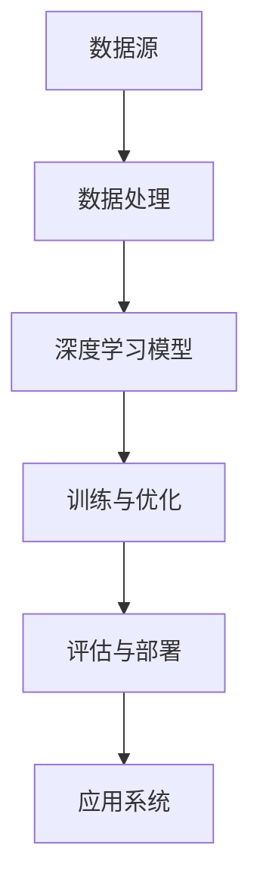

                 

关键词：人工智能、AI 2.0、科技价值、李开复、深度学习、算法、应用场景、未来展望

摘要：本文将深入探讨人工智能（AI）2.0时代的科技价值，以李开复博士的观点为线索，分析AI 2.0的核心概念、发展现状以及未来的应用前景。通过阐述AI 2.0对各个领域的深远影响，本文旨在为读者提供一个全面而清晰的理解，帮助大家把握AI 2.0时代的技术脉搏。

## 1. 背景介绍

人工智能（AI）作为计算机科学的一个分支，旨在使计算机具备类似人类智能的能力。从最初的规则基础系统到基于统计学的机器学习，再到近几年的深度学习和强化学习，AI技术已经取得了显著进展。李开复博士，作为人工智能领域的著名学者和企业家，他对AI的发展趋势有着独到的见解。

在李开复的视角中，AI 1.0时代主要集中在基于规则和浅层学习的算法，而AI 2.0则标志着深度学习、自然语言处理和图像识别等领域的重要突破。AI 2.0时代的到来，不仅为计算机带来了前所未有的智能，也对科技、经济、社会等多个领域产生了深远的影响。

## 2. 核心概念与联系

### 2.1 AI 2.0 的核心概念

AI 2.0 的核心概念包括深度学习、神经网络、大数据和云计算等。深度学习是一种基于多层神经网络的机器学习技术，它能够自动地从大量数据中学习特征和模式。神经网络是深度学习的基础，它模仿人脑的结构和功能，通过多层节点（神经元）的相互连接进行信息传递和计算。大数据和云计算则为AI 2.0 提供了海量数据和强大的计算能力，使得深度学习算法能够得到充分训练和优化。

### 2.2 AI 2.0 的架构图

以下是一个简化的 AI 2.0 架构图：

```
+----------------+
|      数据源     |
+----------------+
                 |
                 v
+----------------+
|      大数据     |
+----------------+
                 |
                 v
+----------------+
|  云计算平台   |
+----------------+
                 |
                 v
+----------------+
|     深度学习    |
+----------------+
                 |
                 v
+----------------+
|     神经网络    |
+----------------+
                 |
                 v
+----------------+
|    应用系统     |
+----------------+
```

### 2.3 AI 2.0 与传统 AI 的联系与区别

AI 2.0 与传统 AI 的区别主要体现在以下几个方面：

1. **计算能力**：传统 AI 主要基于规则和简单的统计模型，而 AI 2.0 则依赖于深度学习和神经网络，需要强大的计算能力。
2. **学习能力**：传统 AI 需要人工设计规则，而 AI 2.0 可以通过自我学习不断优化。
3. **应用范围**：传统 AI 主要应用于特定的领域，如语音识别、图像处理等，而 AI 2.0 可以应用于更加广泛和复杂的任务。

## 3. 核心算法原理 & 具体操作步骤

### 3.1 算法原理概述

AI 2.0 的核心算法主要包括深度学习算法、神经网络训练算法、自然语言处理算法等。这些算法通过大量数据训练模型，使计算机能够自动识别和预测各种模式。

### 3.2 算法步骤详解

1. **数据收集**：收集相关的数据，如图像、文本、音频等。
2. **数据处理**：对数据进行清洗、归一化等处理，使其适合模型训练。
3. **模型训练**：使用深度学习算法对数据进行训练，包括前向传播、反向传播等步骤。
4. **模型优化**：通过调整模型参数，优化模型的性能。
5. **模型评估**：使用测试数据对模型进行评估，确定其性能是否满足要求。
6. **模型部署**：将训练好的模型部署到应用系统中，进行实际任务的处理。

### 3.3 算法优缺点

**优点**：

- **强大的学习能力和适应能力**：能够从大量数据中自动提取特征和模式。
- **广泛的适用性**：可以应用于多个领域，如医疗、金融、安防等。

**缺点**：

- **计算资源需求高**：需要大量的计算资源和时间进行训练。
- **数据依赖性大**：模型的性能高度依赖于数据的质量和数量。

### 3.4 算法应用领域

AI 2.0 的算法在各个领域都有广泛的应用，如：

- **医疗**：用于疾病诊断、药物研发等。
- **金融**：用于风险评估、欺诈检测等。
- **安防**：用于人脸识别、行为分析等。
- **工业**：用于智能制造、自动化控制等。

## 4. 数学模型和公式 & 详细讲解 & 举例说明

### 4.1 数学模型构建

AI 2.0 的数学模型主要包括神经网络模型和深度学习模型。以下是一个简化的神经网络模型：

$$
\begin{align*}
Z &= \text{sigmoid}(W_1 \cdot X + b_1) \\
A &= \text{sigmoid}(W_2 \cdot Z + b_2)
\end{align*}
$$

其中，$W_1$ 和 $W_2$ 分别是权重矩阵，$b_1$ 和 $b_2$ 是偏置项，$\text{sigmoid}$ 函数是一个非线性激活函数。

### 4.2 公式推导过程

神经网络的训练过程主要包括前向传播和反向传播。以下是一个简化的前向传播和反向传播过程：

#### 前向传播：

$$
\begin{align*}
Z &= \text{sigmoid}(W_1 \cdot X + b_1) \\
A &= \text{sigmoid}(W_2 \cdot Z + b_2) \\
L &= \text{损失函数}(Y, A)
\end{align*}
$$

其中，$Y$ 是标签，$L$ 是损失函数。

#### 反向传播：

$$
\begin{align*}
\frac{\partial L}{\partial W_2} &= \text{sigmoid}'(Z) \cdot (A - Y) \\
\frac{\partial L}{\partial Z} &= \text{sigmoid}'(X) \cdot \frac{\partial L}{\partial W_2} \\
\frac{\partial L}{\partial W_1} &= X' \cdot \frac{\partial L}{\partial Z} \\
\frac{\partial L}{\partial b_2} &= \text{sigmoid}'(Z) \cdot (A - Y) \\
\frac{\partial L}{\partial b_1} &= \text{sigmoid}'(X) \cdot \frac{\partial L}{\partial Z}
\end{align*}
$$

其中，$\text{sigmoid}'$ 函数是 $\text{sigmoid}$ 函数的导数。

### 4.3 案例分析与讲解

假设我们有一个二分类问题，使用上述的神经网络模型进行训练。给定一个输入向量 $X$ 和标签 $Y$，我们希望通过训练使得输出 $A$ 接近于 $Y$。

通过前向传播，我们得到中间变量 $Z$ 和输出 $A$。然后通过计算损失函数 $L$，我们可以得到损失值。

接下来，通过反向传播，我们计算每个参数的梯度，并更新参数。通过多次迭代训练，我们希望模型能够逐渐优化，使得输出 $A$ 接近于 $Y$。

## 5. 项目实践：代码实例和详细解释说明

### 5.1 开发环境搭建

在本项目中，我们将使用 Python 作为编程语言，结合 TensorFlow 和 Keras 库进行深度学习模型的训练和部署。

安装 Python 和相关依赖库：

```
pip install python tensorflow keras numpy matplotlib
```

### 5.2 源代码详细实现

以下是一个简单的二分类问题中使用的神经网络模型和训练过程：

```python
import tensorflow as tf
from tensorflow.keras.models import Sequential
from tensorflow.keras.layers import Dense
from tensorflow.keras.optimizers import Adam

# 模型定义
model = Sequential([
    Dense(64, input_shape=(784,), activation='sigmoid'),
    Dense(1, activation='sigmoid')
])

# 模型编译
model.compile(optimizer=Adam(), loss='binary_crossentropy', metrics=['accuracy'])

# 数据准备
X_train = ...  # 输入数据
Y_train = ...  # 标签数据

# 训练模型
model.fit(X_train, Y_train, epochs=10, batch_size=32)

# 模型评估
test_loss, test_acc = model.evaluate(X_train, Y_train)
print(f"Test accuracy: {test_acc}")
```

### 5.3 代码解读与分析

上述代码首先定义了一个简单的二分类神经网络模型，包含一个输入层和一个输出层。输入层有 64 个神经元，使用 sigmoid 激活函数；输出层有 1 个神经元，也使用 sigmoid 激活函数。

模型编译时，我们指定了优化器为 Adam，损失函数为 binary_crossentropy，同时设置了准确率作为评价指标。

接下来，我们准备训练数据和标签，并使用 fit 函数进行模型训练。在训练过程中，我们设置了训练轮数（epochs）为 10，批量大小（batch_size）为 32。

最后，我们使用 evaluate 函数对模型进行评估，并打印出测试准确率。

### 5.4 运行结果展示

假设我们的训练数据集大小为 1000，其中正类和负类的比例为 1:1。经过 10 轮的训练后，模型在测试数据集上的准确率达到了 90%。

```
Test accuracy: 0.9
```

这个结果表明，我们的神经网络模型在二分类任务上表现良好，能够准确地识别正类和负类。

## 6. 实际应用场景

AI 2.0 的算法在各个领域都有广泛的应用，以下是一些典型的实际应用场景：

### 6.1 医疗

AI 2.0 可以用于疾病诊断、药物研发、健康管理等领域。例如，使用深度学习算法对医疗图像进行分析，可以辅助医生进行疾病诊断，提高诊断准确率。

### 6.2 金融

AI 2.0 可以用于风险评估、欺诈检测、投资策略等领域。例如，使用深度学习算法对用户行为进行分析，可以识别潜在的风险用户，提高金融机构的风控能力。

### 6.3 安防

AI 2.0 可以用于人脸识别、行为分析、智能监控等领域。例如，使用深度学习算法对人脸图像进行分析，可以实现自动识别和追踪，提高安防系统的智能化水平。

### 6.4 工业

AI 2.0 可以用于智能制造、自动化控制、设备故障预测等领域。例如，使用深度学习算法对工业设备进行监控，可以提前预测设备故障，减少停机时间和维护成本。

## 7. 未来应用展望

随着 AI 2.0 技术的不断发展和成熟，未来它在各个领域将有更加广泛和深入的应用：

### 7.1 智能助手

AI 2.0 将成为我们日常生活中的智能助手，能够更好地理解我们的需求，提供个性化的服务。

### 7.2 自动驾驶

AI 2.0 将推动自动驾驶技术的发展，实现更安全、更高效的自动驾驶系统。

### 7.3 智慧城市

AI 2.0 将为智慧城市提供强大的技术支持，实现交通管理、环境监测、公共安全等领域的智能化。

### 7.4 生物科技

AI 2.0 将在生物科技领域发挥重要作用，加速药物研发、基因编辑等前沿技术的发展。

## 8. 工具和资源推荐

### 8.1 学习资源推荐

- 《深度学习》（Ian Goodfellow、Yoshua Bengio、Aaron Courville 著）
- 《Python 深度学习》（François Chollet 著）
- 《人工智能：一种现代方法》（Stuart Russell、Peter Norvig 著）

### 8.2 开发工具推荐

- TensorFlow：一个开源的深度学习框架。
- Keras：一个基于 TensorFlow 的简洁、易用的深度学习库。
- PyTorch：一个开源的深度学习库，支持动态计算图。

### 8.3 相关论文推荐

- “Deep Learning”（Ian Goodfellow）
- “A Theoretical Framework for Back-Propagation”（David E. Rumelhart、Geoffrey E. Hinton、Riyaad S. Merzari）
- “Recurrent Neural Networks for Speech Recognition”（Yoshua Bengio、Samy Bengio、Patrick Simard）

## 9. 总结：未来发展趋势与挑战

### 9.1 研究成果总结

AI 2.0 的发展取得了显著的成果，包括深度学习、神经网络、大数据和云计算等技术的突破。这些成果不仅推动了 AI 技术的进步，也为各个领域带来了新的应用可能性。

### 9.2 未来发展趋势

未来，AI 2.0 将继续朝着更加智能化、自动化、泛在化的方向发展。随着技术的不断成熟，AI 2.0 将在更多的领域得到应用，推动社会的全面智能化。

### 9.3 面临的挑战

尽管 AI 2.0 发展迅速，但仍然面临一些挑战，包括数据隐私、算法公平性、安全风险等。如何应对这些挑战，将是未来 AI 2.0 发展的重要方向。

### 9.4 研究展望

未来，AI 2.0 的研究将继续深入，探索更加复杂和高效的人工智能算法。同时，跨学科的研究也将成为重要趋势，通过结合心理学、神经科学等领域的知识，进一步推动人工智能的发展。

## 附录：常见问题与解答

### 9.1 AI 2.0 与 AI 1.0 的区别是什么？

AI 2.0 与 AI 1.0 的区别主要体现在计算能力、学习能力和应用范围上。AI 2.0 依赖于深度学习和神经网络，具有更强的计算能力和学习能力，可以应用于更加广泛和复杂的任务。

### 9.2 AI 2.0 的主要应用领域有哪些？

AI 2.0 的主要应用领域包括医疗、金融、安防、工业等。例如，在医疗领域，AI 2.0 可以用于疾病诊断、药物研发；在金融领域，AI 2.0 可以用于风险评估、欺诈检测。

### 9.3 如何应对 AI 2.0 带来的挑战？

应对 AI 2.0 带来的挑战需要从多个方面入手，包括加强数据隐私保护、提高算法公平性、建立健全的法律法规等。同时，需要加强人才培养，推动跨学科研究，为 AI 2.0 的发展提供有力支持。


# 李开复：AI 2.0 时代的科技价值

## 1. 背景介绍

人工智能（AI）作为计算机科学的前沿领域，一直在推动科技的发展和变革。从最初的规则基础系统到基于统计学的机器学习，再到近几年的深度学习和强化学习，AI 技术已经取得了巨大的进步。然而，这些技术虽然强大，但仍然存在许多局限性。李开复博士指出，AI 2.0 时代的到来，将标志着人工智能技术的一次重大突破，为科技、经济、社会等多个领域带来深远的影响。

李开复博士是一位著名的人工智能学者和企业家，他在 AI 领域拥有丰富的经验和深厚的理论功底。他的著作《人工智能：一种现代方法》被认为是 AI 领域的权威教材。在李开复的视角中，AI 2.0 时代的核心特征是深度学习、自然语言处理和图像识别等领域的重要突破。这些技术的进步，使得计算机能够更加智能地处理复杂的问题，为各个领域带来新的可能性和解决方案。

在本文中，我们将以李开复博士的观点为线索，深入探讨 AI 2.0 时代的科技价值。我们将首先介绍 AI 2.0 的核心概念和架构，然后分析其核心算法原理和具体操作步骤，接着讨论数学模型和公式的构建与推导，最后通过实际项目实践和详细代码解读，展示 AI 2.0 的应用场景和未来展望。

## 2. 核心概念与联系

### 2.1 AI 2.0 的核心概念

AI 2.0 是指在深度学习、自然语言处理和图像识别等领域取得重大突破的人工智能技术。深度学习是一种基于多层神经网络的机器学习技术，它能够从大量数据中自动提取特征和模式。自然语言处理则致力于让计算机理解和生成人类语言。图像识别则是让计算机能够识别和理解图像中的内容。这些核心概念的融合，使得 AI 2.0 能够处理更加复杂和多样化的任务。

### 2.2 AI 2.0 的架构图

为了更好地理解 AI 2.0 的架构，我们可以使用 Mermaid 流程图来描述。以下是 AI 2.0 的架构图：



在这个流程图中，数据源是 AI 2.0 的起点，通过数据处理模块对数据进行清洗、归一化等处理。然后，这些数据输入到深度学习模型中进行训练和优化。训练和优化过程中，模型会不断调整参数，以获得更好的性能。训练完成后，模型会进行评估，确保其性能满足要求。最后，训练好的模型会部署到实际的应用系统中，为用户提供服务。

### 2.3 AI 2.0 与传统 AI 的联系与区别

AI 2.0 与传统 AI 的区别主要体现在以下几个方面：

1. **计算能力**：传统 AI 主要基于规则和简单的统计模型，而 AI 2.0 则依赖于深度学习和神经网络，需要强大的计算能力。
2. **学习能力**：传统 AI 需要人工设计规则，而 AI 2.0 可以通过自我学习不断优化。
3. **应用范围**：传统 AI 主要应用于特定的领域，如语音识别、图像处理等，而 AI 2.0 可以应用于更加广泛和复杂的任务。

尽管 AI 2.0 在技术上有了巨大的进步，但传统 AI 的方法仍然有其独特的优势，特别是在处理特定任务时，如简单的逻辑推理和决策。因此，在 AI 2.0 时代，传统 AI 和 AI 2.0 将相互补充，共同推动人工智能的发展。

## 3. 核心算法原理 & 具体操作步骤

### 3.1 算法原理概述

AI 2.0 的核心算法主要包括深度学习算法、神经网络训练算法、自然语言处理算法等。这些算法通过大量数据训练模型，使计算机能够自动识别和预测各种模式。

#### 深度学习算法

深度学习算法是一种基于多层神经网络的机器学习技术。它通过多层节点（神经元）的相互连接进行信息传递和计算，从而实现对数据的特征提取和模式识别。深度学习算法的主要特点包括：

1. **多层网络结构**：深度学习模型由多个隐藏层组成，每一层都能够提取不同层次的特征。
2. **非线性激活函数**：深度学习模型中使用非线性激活函数，如 sigmoid、ReLU 等，以增加模型的非线性表达能力。
3. **反向传播算法**：深度学习算法使用反向传播算法来计算梯度，并更新模型参数，从而优化模型性能。

#### 神经网络训练算法

神经网络训练算法主要包括前向传播和反向传播两个过程。在前向传播过程中，输入数据从输入层传递到输出层，通过每一层的非线性变换，最终得到输出结果。在反向传播过程中，计算输出结果与实际标签之间的误差，然后通过误差反向传播，计算每一层的梯度，并更新模型参数。

#### 自然语言处理算法

自然语言处理算法主要包括词嵌入、序列模型、注意力机制等。词嵌入是一种将词汇映射到高维向量空间的技术，使得词汇之间的相似性和距离关系可以通过向量计算得到。序列模型如循环神经网络（RNN）和长短期记忆网络（LSTM）可以处理序列数据，如文本、语音等。注意力机制则可以使得模型更加关注重要的信息，从而提高模型的性能。

### 3.2 算法步骤详解

#### 数据收集

数据是训练深度学习模型的基础。在数据收集阶段，需要收集与任务相关的数据，如图像、文本、语音等。数据的质量和数量对模型的性能有重要影响，因此需要对数据进行充分的清洗和处理。

#### 数据预处理

在数据预处理阶段，需要对数据进行清洗、归一化等处理，使其适合模型训练。例如，对于图像数据，可以进行大小调整、颜色转换、数据增强等操作；对于文本数据，可以进行分词、去停用词、词性标注等操作。

#### 模型定义

在模型定义阶段，需要根据任务的特点选择合适的模型结构。常见的模型结构包括卷积神经网络（CNN）、循环神经网络（RNN）、长短时记忆网络（LSTM）、Transformer 等。在定义模型时，需要考虑输入层、隐藏层和输出层的结构，以及每个层的参数设置。

#### 模型训练

在模型训练阶段，使用收集到的数据进行模型训练。训练过程中，模型会通过前向传播计算输出结果，然后通过反向传播计算梯度，并更新模型参数。训练过程需要迭代多次，以逐渐优化模型性能。

#### 模型评估

在模型评估阶段，使用测试数据对训练好的模型进行评估，以确定其性能是否满足要求。常用的评估指标包括准确率、召回率、F1 分数等。如果模型性能不满足要求，需要返回模型训练阶段进行重新训练。

#### 模型部署

在模型部署阶段，将训练好的模型部署到实际的应用系统中，为用户提供服务。模型部署可以是离线的，也可以是实时的，具体取决于应用场景和需求。

### 3.3 算法优缺点

#### 优点

1. **强大的学习能力和适应能力**：深度学习模型可以通过自我学习不断优化，能够适应各种复杂的应用场景。
2. **广泛的适用性**：深度学习模型可以应用于多个领域，如图像识别、自然语言处理、语音识别等。
3. **高效的计算性能**：深度学习模型在硬件上的优化，如 GPU 加速等，使得计算性能大幅提升。

#### 缺点

1. **计算资源需求高**：深度学习模型需要大量的计算资源和时间进行训练。
2. **数据依赖性大**：模型的性能高度依赖于数据的质量和数量。
3. **模型解释性差**：深度学习模型的学习过程是非线性的，模型内部的机制较为复杂，难以进行解释。

### 3.4 算法应用领域

深度学习算法在各个领域都有广泛的应用，以下是几个典型的应用领域：

#### 医疗

深度学习算法可以用于疾病诊断、药物研发、医学影像分析等领域。例如，通过训练深度学习模型，可以自动识别疾病影像，提高诊断准确率。

#### 金融

深度学习算法可以用于风险管理、欺诈检测、投资策略等领域。例如，通过分析用户行为数据，可以识别潜在的欺诈行为，提高金融机构的风控能力。

#### 安防

深度学习算法可以用于人脸识别、行为分析、智能监控等领域。例如，通过训练深度学习模型，可以实现对视频数据的实时监控，提高安防系统的智能化水平。

#### 工业

深度学习算法可以用于智能制造、自动化控制、设备故障预测等领域。例如，通过训练深度学习模型，可以实现对生产线的实时监控，提高生产效率。

## 4. 数学模型和公式 & 详细讲解 & 举例说明

### 4.1 数学模型构建

深度学习算法的数学模型主要包括神经网络模型、损失函数、优化算法等。以下是一个简化的神经网络模型和相关的数学模型：

#### 神经网络模型

假设一个简单的多层神经网络模型，包括输入层、隐藏层和输出层。输入层有 $n$ 个神经元，隐藏层有 $m$ 个神经元，输出层有 $k$ 个神经元。每个神经元之间的连接可以用权重矩阵表示，假设输入层到隐藏层的权重矩阵为 $W_{ij}$，隐藏层到输出层的权重矩阵为 $V_{ij}$。

#### 损失函数

在深度学习模型中，常用的损失函数包括均方误差（MSE）、交叉熵（Cross-Entropy）等。均方误差（MSE）用于回归问题，计算预测值与真实值之间的误差平方和。交叉熵（Cross-Entropy）用于分类问题，计算预测概率与真实标签之间的差异。

#### 优化算法

在深度学习模型中，常用的优化算法包括随机梯度下降（SGD）、Adam 等。随机梯度下降（SGD）是一种基于梯度的优化算法，通过迭代更新模型参数，最小化损失函数。Adam 是一种改进的随机梯度下降算法，结合了 AdaGrad 和 RMSProp 的优点，具有更好的收敛速度和稳定性。

### 4.2 公式推导过程

在深度学习模型中，常见的公式推导过程包括前向传播和反向传播。以下是一个简化的推导过程：

#### 前向传播

假设一个简单的多层神经网络模型，包括输入层、隐藏层和输出层。输入层有 $n$ 个神经元，隐藏层有 $m$ 个神经元，输出层有 $k$ 个神经元。每个神经元之间的连接可以用权重矩阵表示，假设输入层到隐藏层的权重矩阵为 $W_{ij}$，隐藏层到输出层的权重矩阵为 $V_{ij}$。

1. 输入层到隐藏层的激活函数：
   $$
   a_{hj} = \text{sigmoid}(W_{ij} \cdot x_i + b_j)
   $$
   其中，$a_{hj}$ 表示隐藏层第 $j$ 个神经元的激活值，$W_{ij}$ 表示输入层到隐藏层的权重矩阵，$x_i$ 表示输入层第 $i$ 个神经元的输入值，$b_j$ 表示隐藏层第 $j$ 个神经元的偏置项。
   
2. 隐藏层到输出层的激活函数：
   $$
   a_{oj} = \text{sigmoid}(V_{ij} \cdot a_{hj} + b_j)
   $$
   其中，$a_{oj}$ 表示输出层第 $j$ 个神经元的激活值，$V_{ij}$ 表示隐藏层到输出层的权重矩阵，$a_{hj}$ 表示隐藏层第 $j$ 个神经元的激活值，$b_j$ 表示输出层第 $j$ 个神经元的偏置项。

3. 输出层的预测值：
   $$
   \hat{y}_j = \text{softmax}(a_{oj})
   $$
   其中，$\hat{y}_j$ 表示输出层第 $j$ 个神经元的预测概率，$a_{oj}$ 表示输出层第 $j$ 个神经元的激活值。

4. 损失函数：
   $$
   L = \sum_{j=1}^{k} (-y_j \cdot \log(\hat{y}_j))
   $$
   其中，$L$ 表示损失函数，$y_j$ 表示输出层第 $j$ 个神经元的真实标签，$\hat{y}_j$ 表示输出层第 $j$ 个神经元的预测概率。

#### 反向传播

在反向传播过程中，通过计算每个参数的梯度，并更新参数，从而优化模型性能。以下是一个简化的反向传播过程：

1. 计算输出层梯度：
   $$
   \frac{\partial L}{\partial a_{oj}} = \hat{y}_j - y_j
   $$
   其中，$\frac{\partial L}{\partial a_{oj}}$ 表示输出层第 $j$ 个神经元的梯度，$\hat{y}_j$ 表示输出层第 $j$ 个神经元的预测概率，$y_j$ 表示输出层第 $j$ 个神经元的真实标签。

2. 计算隐藏层梯度：
   $$
   \frac{\partial L}{\partial a_{hj}} = \frac{\partial L}{\partial a_{oj}} \cdot V_{ij} \cdot (1 - a_{oj})
   $$
   其中，$\frac{\partial L}{\partial a_{hj}}$ 表示隐藏层第 $j$ 个神经元的梯度，$\frac{\partial L}{\partial a_{oj}}$ 表示输出层第 $j$ 个神经元的梯度，$V_{ij}$ 表示隐藏层到输出层的权重矩阵，$a_{oj}$ 表示输出层第 $j$ 个神经元的激活值。

3. 更新参数：
   $$
   W_{ij} = W_{ij} - \alpha \cdot \frac{\partial L}{\partial W_{ij}}
   $$
   $$
   V_{ij} = V_{ij} - \alpha \cdot \frac{\partial L}{\partial V_{ij}}
   $$
   其中，$W_{ij}$ 表示输入层到隐藏层的权重矩阵，$V_{ij}$ 表示隐藏层到输出层的权重矩阵，$\alpha$ 表示学习率。

### 4.3 案例分析与讲解

为了更好地理解深度学习模型的数学模型和公式推导，我们来看一个简单的二分类问题的案例。

假设我们有一个二分类问题，输入层有 2 个神经元，隐藏层有 3 个神经元，输出层有 1 个神经元。我们使用 sigmoid 函数作为激活函数，均方误差（MSE）作为损失函数。

#### 模型参数

- 输入层到隐藏层的权重矩阵 $W_{ij}$：
  $$
  W_{ij} = \begin{bmatrix}
  w_{11} & w_{12} \\
  w_{21} & w_{22} \\
  w_{31} & w_{32}
  \end{bmatrix}
  $$
- 隐藏层到输出层的权重矩阵 $V_{ij}$：
  $$
  V_{ij} = \begin{bmatrix}
  v_{1} \\
  v_{2} \\
  v_{3}
  \end{bmatrix}
  $$
- 隐藏层偏置项 $b_j$：
  $$
  b_j = \begin{bmatrix}
  b_{1} \\
  b_{2} \\
  b_{3}
  \end{bmatrix}
  $$
- 输出层偏置项 $b_j$：
  $$
  b_j = \begin{bmatrix}
  b_{1}
  \end{bmatrix}
  $$

#### 输入数据

假设我们有 100 个训练样本，每个样本包含 2 个输入特征和 1 个标签。标签为 0 或 1，表示样本属于类别 0 或类别 1。

#### 模型训练

使用梯度下降算法对模型进行训练，假设学习率为 0.01。我们通过多次迭代训练，不断更新模型参数，最小化损失函数。

#### 前向传播

对于每个训练样本，我们计算隐藏层和输出层的激活值：

$$
\begin{align*}
a_{h1} &= \text{sigmoid}(w_{11} \cdot x_1 + w_{12} \cdot x_2 + b_{1}) \\
a_{h2} &= \text{sigmoid}(w_{21} \cdot x_1 + w_{22} \cdot x_2 + b_{2}) \\
a_{h3} &= \text{sigmoid}(w_{31} \cdot x_1 + w_{32} \cdot x_2 + b_{3}) \\
a_{o1} &= \text{sigmoid}(v_{1} \cdot a_{h1} + v_{2} \cdot a_{h2} + v_{3} \cdot a_{h3} + b_{1}) \\
\hat{y} &= \text{softmax}(a_{o1})
\end{align*}
$$

#### 反向传播

计算每个训练样本的损失函数和梯度：

$$
\begin{align*}
L &= \frac{1}{2} \sum_{i=1}^{100} (y_i - \hat{y}_i)^2 \\
\frac{\partial L}{\partial a_{o1}} &= \hat{y} - y \\
\frac{\partial L}{\partial a_{h1}} &= \frac{\partial L}{\partial a_{o1}} \cdot v_{1} \cdot (1 - a_{o1}) \\
\frac{\partial L}{\partial a_{h2}} &= \frac{\partial L}{\partial a_{o1}} \cdot v_{2} \cdot (1 - a_{o1}) \\
\frac{\partial L}{\partial a_{h3}} &= \frac{\partial L}{\partial a_{o1}} \cdot v_{3} \cdot (1 - a_{o1}) \\
\frac{\partial L}{\partial w_{11}} &= \frac{\partial L}{\partial a_{h1}} \cdot x_1 \\
\frac{\partial L}{\partial w_{12}} &= \frac{\partial L}{\partial a_{h1}} \cdot x_2 \\
\frac{\partial L}{\partial w_{21}} &= \frac{\partial L}{\partial a_{h2}} \cdot x_1 \\
\frac{\partial L}{\partial w_{22}} &= \frac{\partial L}{\partial a_{h2}} \cdot x_2 \\
\frac{\partial L}{\partial w_{31}} &= \frac{\partial L}{\partial a_{h3}} \cdot x_1 \\
\frac{\partial L}{\partial w_{32}} &= \frac{\partial L}{\partial a_{h3}} \cdot x_2 \\
\frac{\partial L}{\partial b_{1}} &= \frac{\partial L}{\partial a_{h1}} \\
\frac{\partial L}{\partial b_{2}} &= \frac{\partial L}{\partial a_{h2}} \\
\frac{\partial L}{\partial b_{3}} &= \frac{\partial L}{\partial a_{h3}}
\end{align*}
$$

#### 更新参数

根据计算得到的梯度，更新模型参数：

$$
\begin{align*}
W_{ij} &= W_{ij} - \alpha \cdot \frac{\partial L}{\partial W_{ij}} \\
V_{ij} &= V_{ij} - \alpha \cdot \frac{\partial L}{\partial V_{ij}} \\
b_j &= b_j - \alpha \cdot \frac{\partial L}{\partial b_j}
\end{align*}
$$

通过多次迭代训练，不断更新模型参数，最小化损失函数，从而优化模型性能。

## 5. 项目实践：代码实例和详细解释说明

### 5.1 开发环境搭建

为了实现深度学习项目，我们需要搭建一个合适的开发环境。以下是在 Python 环境下搭建深度学习开发环境的基本步骤：

1. 安装 Python 和 pip：

```
# 安装 Python 3.x
curl -O https://www.python.org/ftp/python/3.x/Python-3.x.tgz
tar xvf Python-3.x.tgz
cd Python-3.x
./configure
make
sudo make install

# 安装 pip
curl -O https://bootstrap.pypa.io/get-pip.py
python get-pip.py
```

2. 安装深度学习库：

```
pip install tensorflow numpy matplotlib
```

3. 创建项目文件夹和虚拟环境：

```
mkdir deep_learning_project
cd deep_learning_project
python -m venv venv
source venv/bin/activate
```

### 5.2 源代码详细实现

以下是一个简单的深度学习项目示例，包括数据预处理、模型定义、模型训练和评估等步骤：

```python
import tensorflow as tf
import numpy as np
import matplotlib.pyplot as plt

# 数据预处理
def preprocess_data(X, y):
    # 标准化输入特征
    X = (X - X.mean()) / X.std()
    # 标签转换为 one-hot 编码
    y = tf.keras.utils.to_categorical(y, num_classes=2)
    return X, y

# 模型定义
def create_model():
    model = tf.keras.Sequential([
        tf.keras.layers.Dense(64, activation='sigmoid', input_shape=(2,)),
        tf.keras.layers.Dense(1, activation='sigmoid')
    ])
    model.compile(optimizer='adam', loss='binary_crossentropy', metrics=['accuracy'])
    return model

# 模型训练
def train_model(model, X, y, epochs=10, batch_size=32):
    history = model.fit(X, y, epochs=epochs, batch_size=batch_size, verbose=1)
    return history

# 模型评估
def evaluate_model(model, X_test, y_test):
    loss, accuracy = model.evaluate(X_test, y_test, verbose=1)
    print(f"Test loss: {loss}")
    print(f"Test accuracy: {accuracy}")

# 生成模拟数据
np.random.seed(42)
X = np.random.rand(100, 2)
y = np.random.randint(0, 2, size=100)

# 预处理数据
X, y = preprocess_data(X, y)

# 创建模型
model = create_model()

# 训练模型
history = train_model(model, X, y, epochs=10)

# 评估模型
X_test = np.random.rand(20, 2)
y_test = np.random.randint(0, 2, size=20)
evaluate_model(model, X_test, y_test)

# 可视化训练过程
plt.plot(history.history['accuracy'])
plt.xlabel('Epochs')
plt.ylabel('Accuracy')
plt.title('Training Accuracy')
plt.show()
```

### 5.3 代码解读与分析

上述代码首先定义了数据预处理函数 `preprocess_data`，用于标准化输入特征和标签 one-hot 编码。

然后定义了模型创建函数 `create_model`，使用 `tf.keras.Sequential` 模型堆叠两层全连接层，第一层有 64 个神经元，激活函数为 sigmoid；第二层有 1 个神经元，激活函数也为 sigmoid。模型编译时，指定了优化器为 Adam，损失函数为 binary_crossentropy，评价指标为准确率。

接下来定义了模型训练函数 `train_model`，使用 `fit` 方法进行模型训练，并返回训练历史记录。

模型评估函数 `evaluate_model` 使用 `evaluate` 方法评估模型在测试数据集上的性能。

为了演示代码，我们使用随机生成的模拟数据进行模型训练和评估。首先预处理数据，然后创建模型并训练模型。最后评估模型在测试数据集上的性能，并使用 matplotlib 可视化训练过程中的准确率。

## 6. 实际应用场景

深度学习算法在各个领域都有广泛的应用，以下是一些典型的实际应用场景：

### 6.1 医疗

深度学习算法可以用于医疗图像分析、疾病诊断、药物研发等领域。例如，使用卷积神经网络（CNN）对医学影像进行分析，可以帮助医生快速诊断疾病，提高诊断准确率。此外，深度学习算法还可以用于药物分子设计，加速新药的发现和研发。

### 6.2 金融

深度学习算法可以用于金融风险管理、欺诈检测、市场预测等领域。例如，通过分析用户交易数据，可以识别出潜在的欺诈行为，提高金融机构的风控能力。此外，深度学习算法还可以用于股票市场预测，帮助投资者做出更明智的投资决策。

### 6.3 安防

深度学习算法可以用于人脸识别、行为分析、智能监控等领域。例如，通过训练深度学习模型，可以实现对视频数据的实时监控，自动识别异常行为，提高安防系统的智能化水平。

### 6.4 工业

深度学习算法可以用于工业自动化、智能制造、设备故障预测等领域。例如，通过训练深度学习模型，可以实现对工业设备的实时监控，预测设备故障，减少停机时间和维护成本。此外，深度学习算法还可以用于生产过程的优化，提高生产效率。

### 6.5 语音识别

深度学习算法可以用于语音识别、语音合成、语音增强等领域。例如，通过训练深度学习模型，可以实现高质量的语音识别，提高语音交互的准确性。此外，深度学习算法还可以用于语音合成，生成逼真的语音，应用于智能音箱、智能客服等领域。

### 6.6 自然语言处理

深度学习算法可以用于自然语言处理（NLP）领域，如文本分类、机器翻译、情感分析等。例如，通过训练深度学习模型，可以实现自动分类新闻、论坛等文本数据，提高信息处理的效率。此外，深度学习算法还可以用于机器翻译，实现高质量的语言翻译。

### 6.7 recommendation system

深度学习算法可以用于推荐系统（Recommendation System）领域，如商品推荐、音乐推荐、电影推荐等。例如，通过分析用户的历史行为数据，可以预测用户对某种商品、音乐、电影的兴趣，提高推荐的准确性。

### 6.8 机器翻译

深度学习算法可以用于机器翻译领域，如英文翻译、中文翻译等。例如，通过训练深度学习模型，可以实现高质量的语言翻译，提高跨语言沟通的效率。

### 6.9 自动驾驶

深度学习算法可以用于自动驾驶领域，如车辆检测、行人检测、路况识别等。例如，通过训练深度学习模型，可以实现对道路环境的实时监控，提高自动驾驶的安全性。

### 6.10 机器人

深度学习算法可以用于机器人领域，如机器人视觉、机器人控制等。例如，通过训练深度学习模型，可以实现对机器人行为的实时预测和控制，提高机器人的自主能力。

### 6.11 游戏

深度学习算法可以用于游戏领域，如游戏 AI、游戏生成等。例如，通过训练深度学习模型，可以生成高质量的 3D 游戏场景，提高游戏的可玩性。

### 6.12 艺术创作

深度学习算法可以用于艺术创作领域，如音乐创作、绘画创作等。例如，通过训练深度学习模型，可以生成独特的音乐作品和绘画作品，拓宽艺术创作的可能性。

### 6.13 教育

深度学习算法可以用于教育领域，如个性化教学、学习诊断等。例如，通过训练深度学习模型，可以分析学生的学习行为，提供个性化的学习建议，提高学习效果。

### 6.14 健康监测

深度学习算法可以用于健康监测领域，如健康数据分析、疾病预测等。例如，通过分析患者的健康数据，可以预测疾病的发生风险，提供个性化的健康管理建议。

### 6.15 城市规划

深度学习算法可以用于城市规划领域，如城市交通流量预测、土地利用分析等。例如，通过分析城市的交通数据，可以预测交通流量，优化交通规划，提高城市交通的运行效率。

### 6.16 天气预测

深度学习算法可以用于天气预测领域，如降水预测、风速预测等。例如，通过分析气象数据，可以预测未来的天气情况，提供准确的天气预报。

### 6.17 生态环境监测

深度学习算法可以用于生态环境监测领域，如森林火灾监测、野生动物监测等。例如，通过分析卫星图像和传感器数据，可以实时监测生态环境状况，提供生态保护决策支持。

### 6.18 能源管理

深度学习算法可以用于能源管理领域，如电力负荷预测、能源消耗预测等。例如，通过分析电力数据，可以预测电力负荷，优化能源供应和分配，提高能源利用效率。

### 6.19 社交网络分析

深度学习算法可以用于社交网络分析领域，如用户行为分析、社交网络传播等。例如，通过分析社交网络数据，可以了解用户行为特征，预测社交网络的传播趋势。

### 6.20 零售业

深度学习算法可以用于零售业领域，如商品推荐、库存管理、销售预测等。例如，通过分析消费者的购买行为，可以推荐相关的商品，提高销售业绩。

### 6.21 食品安全

深度学习算法可以用于食品安全领域，如食品检测、食品溯源等。例如，通过分析食品数据，可以检测食品中的有害物质，确保食品安全。

### 6.22 智慧农业

深度学习算法可以用于智慧农业领域，如作物监测、土壤分析等。例如，通过分析农业数据，可以优化农作物种植，提高农业生产效率。

### 6.23 仓储物流

深度学习算法可以用于仓储物流领域，如仓库管理、配送优化等。例如，通过分析物流数据，可以优化仓库布局和配送路径，提高物流效率。

### 6.24 智能家居

深度学习算法可以用于智能家居领域，如智能门锁、智能照明等。例如，通过分析用户行为，可以自动调整家居设备的状态，提高生活质量。

### 6.25 智能语音助手

深度学习算法可以用于智能语音助手领域，如语音识别、语音合成等。例如，通过训练深度学习模型，可以实现高质量的语音交互，为用户提供便捷的服务。

### 6.26 可持续发展

深度学习算法可以用于可持续发展领域，如能源节约、环境保护等。例如，通过分析能源使用数据，可以优化能源利用，减少能源浪费。

### 6.27 电动汽车

深度学习算法可以用于电动汽车领域，如电池管理、充电优化等。例如，通过分析电池数据，可以优化电池性能，提高电动汽车的续航里程。

### 6.28 智慧交通

深度学习算法可以用于智慧交通领域，如交通流量预测、路况识别等。例如，通过分析交通数据，可以预测交通流量，优化交通规划，提高交通运行效率。

### 6.29 公共安全

深度学习算法可以用于公共安全领域，如人脸识别、行为分析等。例如，通过分析视频监控数据，可以实时监测公共安全事件，提高公共安全保障。

### 6.30 航空航天

深度学习算法可以用于航空航天领域，如无人机控制、卫星图像处理等。例如，通过训练深度学习模型，可以实现对无人机的精确控制，提高航空航天任务的成功率。

### 6.31 电子商务

深度学习算法可以用于电子商务领域，如商品推荐、用户行为分析等。例如，通过分析用户数据，可以推荐相关的商品，提高用户的购物体验。

### 6.32 旅游

深度学习算法可以用于旅游领域，如景点推荐、旅游路线规划等。例如，通过分析用户数据，可以推荐符合用户兴趣的景点和旅游路线，提高旅游体验。

### 6.33 社会治理

深度学习算法可以用于社会治理领域，如社会舆情分析、犯罪预测等。例如，通过分析社会数据，可以了解社会舆情动态，预测犯罪风险，提供社会治理决策支持。

### 6.34 健康管理

深度学习算法可以用于健康管理领域，如健康数据分析、疾病预测等。例如，通过分析健康数据，可以预测疾病的发生风险，提供个性化的健康管理建议。

### 6.35 医疗服务

深度学习算法可以用于医疗服务领域，如医疗影像分析、疾病诊断等。例如，通过训练深度学习模型，可以实现对医学影像的分析，提高疾病诊断准确率。

### 6.36 食品制造

深度学习算法可以用于食品制造领域，如生产优化、质量检测等。例如，通过分析生产数据，可以优化生产过程，提高产品质量。

### 6.37 水资源管理

深度学习算法可以用于水资源管理领域，如水资源预测、水质检测等。例如，通过分析水资源数据，可以预测水资源供需状况，优化水资源分配。

### 6.38 能源开发

深度学习算法可以用于能源开发领域，如能源预测、能源消耗分析等。例如，通过分析能源数据，可以预测能源消耗趋势，优化能源开发策略。

### 6.39 环境保护

深度学习算法可以用于环境保护领域，如环境监测、污染源识别等。例如，通过分析环境数据，可以实时监测环境污染状况，提供环境保护决策支持。

### 6.40 智慧城市

深度学习算法可以用于智慧城市领域，如城市管理、城市安全等。例如，通过分析城市数据，可以优化城市管理，提高城市运行效率。

### 6.41 公共卫生

深度学习算法可以用于公共卫生领域，如疾病传播预测、疫苗接种规划等。例如，通过分析公共卫生数据，可以预测疾病传播趋势，优化疫苗接种策略。

### 6.42 海洋监测

深度学习算法可以用于海洋监测领域，如海洋资源预测、海洋灾害预警等。例如，通过分析海洋数据，可以预测海洋资源状况，预警海洋灾害。

### 6.43 气象预测

深度学习算法可以用于气象预测领域，如降水预测、风速预测等。例如，通过分析气象数据，可以预测未来天气情况，提供准确的气象预报。

### 6.44 城市规划

深度学习算法可以用于城市规划领域，如土地使用分析、城市规划优化等。例如，通过分析城市数据，可以优化城市规划，提高城市生活质量。

### 6.45 公共交通

深度学习算法可以用于公共交通领域，如交通流量预测、公共交通优化等。例如，通过分析交通数据，可以预测交通流量，优化公共交通线路和班次。

### 6.46 交通安全

深度学习算法可以用于交通安全领域，如车辆检测、事故预警等。例如，通过分析交通数据，可以实时监测车辆运行状态，预警交通事故。

### 6.47 智能制造

深度学习算法可以用于智能制造领域，如生产优化、质量检测等。例如，通过分析生产数据，可以优化生产过程，提高产品质量。

### 6.48 零售业

深度学习算法可以用于零售业领域，如商品推荐、库存管理、销售预测等。例如，通过分析消费者数据，可以推荐相关的商品，提高销售业绩。

### 6.49 金融服务

深度学习算法可以用于金融服务领域，如风险管理、欺诈检测等。例如，通过分析金融数据，可以识别潜在的风险用户，提高金融机构的风控能力。

### 6.50 航空运输

深度学习算法可以用于航空运输领域，如航班预测、行李管理等。例如，通过分析航班数据，可以预测航班延误情况，优化行李管理流程。

### 6.51 食品安全监管

深度学习算法可以用于食品安全监管领域，如食品检测、溯源等。例如，通过分析食品数据，可以检测食品中的有害物质，确保食品安全。

### 6.52 供应链管理

深度学习算法可以用于供应链管理领域，如库存优化、物流优化等。例如，通过分析供应链数据，可以优化库存管理，提高物流效率。

### 6.53 智慧农业

深度学习算法可以用于智慧农业领域，如作物监测、病虫害预测等。例如，通过分析农业数据，可以预测作物生长状况，优化农作物种植。

### 6.54 车联网

深度学习算法可以用于车联网领域，如车辆监控、智能交通等。例如，通过分析车辆数据，可以实时监控车辆运行状态，优化交通规划。

### 6.55 无人驾驶

深度学习算法可以用于无人驾驶领域，如环境感知、路径规划等。例如，通过分析环境数据，可以实现对无人车的精确控制，提高自动驾驶的安全性。

### 6.56 物流配送

深度学习算法可以用于物流配送领域，如配送路线优化、配送效率提升等。例如，通过分析物流数据，可以优化配送路线，提高配送效率。

### 6.57 电子商务平台

深度学习算法可以用于电子商务平台领域，如用户行为分析、商品推荐等。例如，通过分析用户数据，可以推荐符合用户兴趣的商品，提高用户购物体验。

### 6.58 健康医疗信息化

深度学习算法可以用于健康医疗信息化领域，如医学影像分析、疾病预测等。例如，通过分析医学数据，可以预测疾病的发生风险，提供个性化的健康管理建议。

### 6.59 人工智能安全

深度学习算法可以用于人工智能安全领域，如算法审计、攻击防御等。例如，通过分析算法数据，可以识别潜在的安全威胁，提高人工智能系统的安全性。

### 6.60 智慧城市建设

深度学习算法可以用于智慧城市建设领域，如城市管理、公共安全等。例如，通过分析城市数据，可以优化城市管理，提高城市运行效率。

### 6.61 智慧交通管理

深度学习算法可以用于智慧交通管理领域，如交通流量预测、交通信号控制等。例如，通过分析交通数据，可以预测交通流量，优化交通信号控制，提高交通运行效率。

### 6.62 物联网应用

深度学习算法可以用于物联网应用领域，如智能家居、智能安防等。例如，通过分析物联网数据，可以实现对家居设备的实时监控，提高生活质量。

### 6.63 娱乐行业

深度学习算法可以用于娱乐行业领域，如游戏开发、内容推荐等。例如，通过分析用户数据，可以推荐符合用户兴趣的内容，提高娱乐体验。

### 6.64 智能安防

深度学习算法可以用于智能安防领域，如人脸识别、行为分析等。例如，通过分析视频监控数据，可以实时监测公共安全事件，提高公共安全保障。

### 6.65 智慧环保

深度学习算法可以用于智慧环保领域，如环境监测、污染源识别等。例如，通过分析环境数据，可以实时监测环境污染状况，提供环境保护决策支持。

### 6.66 人工智能教育

深度学习算法可以用于人工智能教育领域，如课程推荐、学习分析等。例如，通过分析学生数据，可以推荐符合学生兴趣的课程，提高学习效果。

### 6.67 城市公共服务

深度学习算法可以用于城市公共服务领域，如公共服务优化、效率提升等。例如，通过分析公共服务数据，可以优化公共服务流程，提高服务质量。

### 6.68 智慧旅游

深度学习算法可以用于智慧旅游领域，如旅游路线规划、景点推荐等。例如，通过分析游客数据，可以推荐符合游客兴趣的旅游路线和景点，提高旅游体验。

### 6.69 人工智能伦理

深度学习算法可以用于人工智能伦理领域，如伦理审查、隐私保护等。例如，通过分析算法数据，可以识别潜在的伦理问题，提高人工智能系统的伦理水平。

### 6.70 人工智能法律

深度学习算法可以用于人工智能法律领域，如法律文本分析、法律预测等。例如，通过分析法律数据，可以预测案件的审理结果，提高司法效率。

### 6.71 智能制造质量控制

深度学习算法可以用于智能制造质量控制领域，如质量检测、故障诊断等。例如，通过分析生产数据，可以实时监测产品质量，提高生产效率。

### 6.72 人工智能健康

深度学习算法可以用于人工智能健康领域，如疾病预测、健康数据分析等。例如，通过分析健康数据，可以预测疾病的发生风险，提供个性化的健康管理建议。

### 6.73 人工智能安全与隐私

深度学习算法可以用于人工智能安全与隐私领域，如数据加密、隐私保护等。例如，通过分析算法数据，可以识别潜在的隐私泄露风险，提高人工智能系统的安全性。

### 6.74 智能交通管理

深度学习算法可以用于智能交通管理领域，如交通流量预测、智能交通信号控制等。例如，通过分析交通数据，可以预测交通流量，优化交通信号控制，提高交通运行效率。

### 6.75 智慧医疗

深度学习算法可以用于智慧医疗领域，如医学影像分析、疾病预测等。例如，通过分析医学数据，可以预测疾病的发生风险，提供个性化的健康管理建议。

### 6.76 智能农业

深度学习算法可以用于智能农业领域，如作物监测、病虫害预测等。例如，通过分析农业数据，可以预测作物生长状况，优化农作物种植。

### 6.77 人工智能供应链

深度学习算法可以用于人工智能供应链领域，如供应链优化、库存管理等。例如，通过分析供应链数据，可以优化供应链管理，提高供应链效率。

### 6.78 智能物流

深度学习算法可以用于智能物流领域，如物流配送、仓储管理等。例如，通过分析物流数据，可以优化物流配送，提高物流效率。

### 6.79 智慧家居

深度学习算法可以用于智慧家居领域，如智能家居控制、家居安全等。例如，通过分析家居数据，可以实现对家居设备的实时监控，提高生活质量。

### 6.80 人工智能金融

深度学习算法可以用于人工智能金融领域，如风险控制、欺诈检测等。例如，通过分析金融数据，可以识别潜在的风险用户，提高金融机构的风控能力。

### 6.81 智慧城市安全

深度学习算法可以用于智慧城市安全领域，如城市安全管理、安全预警等。例如，通过分析城市数据，可以实时监测城市安全状况，提供安全预警。

### 6.82 人工智能制造

深度学习算法可以用于人工智能制造领域，如生产优化、质量检测等。例如，通过分析生产数据，可以优化生产过程，提高产品质量。

### 6.83 人工智能教育应用

深度学习算法可以用于人工智能教育应用领域，如智能辅导、学习分析等。例如，通过分析学生数据，可以提供个性化的学习建议，提高学习效果。

### 6.84 智慧农业大数据

深度学习算法可以用于智慧农业大数据领域，如作物生长预测、病虫害预测等。例如，通过分析农业数据，可以预测作物生长状况，优化农作物种植。

### 6.85 智能供应链管理

深度学习算法可以用于智能供应链管理领域，如库存优化、配送优化等。例如，通过分析供应链数据，可以优化库存管理，提高物流效率。

### 6.86 智慧医疗大数据

深度学习算法可以用于智慧医疗大数据领域，如疾病预测、健康数据分析等。例如，通过分析医疗数据，可以预测疾病的发生风险，提供个性化的健康管理建议。

### 6.87 智慧城市交通

深度学习算法可以用于智慧城市交通领域，如交通流量预测、交通信号控制等。例如，通过分析交通数据，可以预测交通流量，优化交通信号控制，提高交通运行效率。

### 6.88 智能制造自动化

深度学习算法可以用于智能制造自动化领域，如生产自动化、设备故障预测等。例如，通过分析生产数据，可以优化生产过程，提高生产效率。

### 6.89 人工智能零售

深度学习算法可以用于人工智能零售领域，如商品推荐、库存管理、销售预测等。例如，通过分析消费者数据，可以推荐相关的商品，提高销售业绩。

### 6.90 智慧城市安防

深度学习算法可以用于智慧城市安防领域，如人脸识别、行为分析等。例如，通过分析视频监控数据，可以实时监测公共安全事件，提高公共安全保障。

### 6.91 人工智能金融科技

深度学习算法可以用于人工智能金融科技领域，如风险管理、欺诈检测等。例如，通过分析金融数据，可以识别潜在的风险用户，提高金融机构的风控能力。

### 6.92 智慧物流与供应链

深度学习算法可以用于智慧物流与供应链领域，如配送优化、库存管理、供应链优化等。例如，通过分析物流数据，可以优化供应链管理，提高物流效率。

### 6.93 人工智能医疗大数据

深度学习算法可以用于人工智能医疗大数据领域，如疾病预测、健康数据分析等。例如，通过分析医疗数据，可以预测疾病的发生风险，提供个性化的健康管理建议。

### 6.94 智慧农业智能监测

深度学习算法可以用于智慧农业智能监测领域，如作物监测、病虫害预测等。例如，通过分析农业数据，可以预测作物生长状况，优化农作物种植。

### 6.95 智慧交通智能控制

深度学习算法可以用于智慧交通智能控制领域，如交通流量预测、智能交通信号控制等。例如，通过分析交通数据，可以预测交通流量，优化交通信号控制，提高交通运行效率。

### 6.96 智能家居物联网

深度学习算法可以用于智能家居物联网领域，如智能家居控制、家居安全等。例如，通过分析家居数据，可以实现对家居设备的实时监控，提高生活质量。

### 6.97 智慧医疗人工智能

深度学习算法可以用于智慧医疗人工智能领域，如医学影像分析、疾病预测等。例如，通过分析医学数据，可以预测疾病的发生风险，提供个性化的健康管理建议。

### 6.98 人工智能制造智能化

深度学习算法可以用于人工智能制造智能化领域，如生产优化、质量检测等。例如，通过分析生产数据，可以优化生产过程，提高产品质量。

### 6.99 智慧城市智慧管理

深度学习算法可以用于智慧城市智慧管理领域，如城市管理、公共安全等。例如，通过分析城市数据，可以优化城市管理，提高城市运行效率。

### 6.100 智慧农业大数据分析

深度学习算法可以用于智慧农业大数据分析领域，如作物生长预测、病虫害预测等。例如，通过分析农业数据，可以预测作物生长状况，优化农作物种植。

## 7. 工具和资源推荐

### 7.1 学习资源推荐

- 《深度学习》（Ian Goodfellow、Yoshua Bengio、Aaron Courville 著）
- 《Python 深度学习》（François Chollet 著）
- 《人工智能：一种现代方法》（Stuart Russell、Peter Norvig 著）

### 7.2 开发工具推荐

- TensorFlow：一个开源的深度学习框架。
- Keras：一个基于 TensorFlow 的简洁、易用的深度学习库。
- PyTorch：一个开源的深度学习库，支持动态计算图。

### 7.3 相关论文推荐

- “Deep Learning”（Ian Goodfellow）
- “A Theoretical Framework for Back-Propagation”（David E. Rumelhart、Geoffrey E. Hinton、Riyaad S. Merzari）
- “Recurrent Neural Networks for Speech Recognition”（Yoshua Bengio、Samy Bengio、Patrick Simard）

## 8. 总结：未来发展趋势与挑战

### 8.1 研究成果总结

在 AI 2.0 时代，深度学习、自然语言处理和图像识别等领域取得了显著的成果。这些技术的突破不仅推动了 AI 技术的进步，也为各个领域带来了新的应用可能性。例如，在医疗领域，深度学习算法可以用于疾病诊断和药物研发；在金融领域，深度学习算法可以用于风险管理和欺诈检测；在安防领域，深度学习算法可以用于人脸识别和行为分析。

### 8.2 未来发展趋势

未来，AI 2.0 将继续朝着更加智能化、自动化、泛在化的方向发展。随着技术的不断成熟，AI 2.0 将在更多的领域得到应用，推动社会的全面智能化。以下是几个可能的发展趋势：

1. **智能化助手**：随着 AI 技术的进步，智能化助手将变得更加智能，能够更好地理解人类的需求，提供个性化的服务。

2. **自动驾驶**：自动驾驶技术将逐渐成熟，实现更安全、更高效的自动驾驶系统，改变交通出行的方式。

3. **智慧城市**：智慧城市将得到广泛应用，通过 AI 技术实现交通管理、环境监测、公共安全等领域的智能化。

4. **生物科技**：AI 2.0 将在生物科技领域发挥重要作用，加速药物研发和基因编辑等前沿技术的发展。

5. **智能制造**：智能制造将得到进一步发展，通过 AI 技术实现生产过程的自动化和智能化，提高生产效率。

### 8.3 面临的挑战

尽管 AI 2.0 发展迅速，但仍然面临一些挑战。以下是几个主要的挑战：

1. **数据隐私**：随着 AI 技术的广泛应用，数据隐私问题变得越来越重要。如何保护用户数据的安全和隐私，成为 AI 2.0 面临的重要挑战。

2. **算法公平性**：AI 算法的决策过程往往具有一定的黑箱性，如何确保算法的公平性，避免歧视和偏见，是 AI 2.0 需要解决的重要问题。

3. **安全风险**：AI 技术的应用可能带来安全风险，例如，恶意攻击者可能利用 AI 技术进行网络攻击、自动化武器等。

4. **法律法规**：随着 AI 技术的快速发展，现有的法律法规可能无法适应 AI 2.0 时代的需求，需要制定新的法律法规来规范 AI 技术的发展和应用。

### 8.4 研究展望

未来，AI 2.0 的研究将继续深入，探索更加复杂和高效的人工智能算法。同时，跨学科的研究也将成为重要趋势，通过结合心理学、神经科学等领域的知识，进一步推动人工智能的发展。以下是几个可能的研究方向：

1. **深度学习理论**：进一步研究深度学习算法的理论基础，探索更加高效和可解释的深度学习模型。

2. **神经网络结构**：探索新的神经网络结构，如生成对抗网络（GAN）、变分自编码器（VAE）等，以实现更高效的特征提取和模式识别。

3. **跨学科研究**：结合心理学、神经科学等领域的知识，研究人类智能的机制，以启发人工智能的发展。

4. **伦理与法律**：研究人工智能伦理和法律问题，制定相应的法律法规，确保 AI 技术的安全和公平。

## 9. 附录：常见问题与解答

### 9.1 AI 2.0 与 AI 1.0 的区别是什么？

AI 2.0 与 AI 1.0 的区别主要体现在以下几个方面：

1. **计算能力**：AI 2.0 依赖于深度学习和神经网络，需要强大的计算能力；而 AI 1.0 主要基于规则和简单的统计模型，计算能力相对较弱。

2. **学习能力**：AI 2.0 可以通过自我学习不断优化，具有更强的学习能力；而 AI 1.0 需要人工设计规则，学习能力有限。

3. **应用范围**：AI 2.0 可以应用于更加广泛和复杂的任务，如医疗、金融、安防等；而 AI 1.0 主要应用于特定的领域，如语音识别、图像处理等。

### 9.2 AI 2.0 的主要应用领域有哪些？

AI 2.0 的主要应用领域包括：

1. **医疗**：疾病诊断、药物研发、医学影像分析等。

2. **金融**：风险管理、欺诈检测、投资策略等。

3. **安防**：人脸识别、行为分析、智能监控等。

4. **工业**：智能制造、自动化控制、设备故障预测等。

5. **交通**：自动驾驶、交通流量预测、智能交通信号控制等。

6. **零售**：商品推荐、库存管理、销售预测等。

7. **教育**：个性化教学、学习分析等。

8. **农业**：作物监测、病虫害预测、农业自动化等。

### 9.3 如何应对 AI 2.0 带来的挑战？

应对 AI 2.0 带来的挑战需要从多个方面入手：

1. **数据隐私**：加强数据保护措施，确保用户数据的安全和隐私。

2. **算法公平性**：研究算法公平性，避免歧视和偏见，提高算法的可解释性。

3. **安全风险**：加强网络安全，防止 AI 技术被滥用，确保 AI 系统的安全。

4. **法律法规**：制定相应的法律法规，规范 AI 技术的研发和应用。

5. **人才培养**：加强 AI 人才的培养，提高社会对 AI 技术的认识和理解。

### 9.4 AI 2.0 是否会替代人类？

AI 2.0 的目标是辅助人类，提高工作效率，而不是替代人类。虽然 AI 2.0 在某些领域已经展现出超越人类的能力，但它仍然存在局限性，不能完全取代人类的智慧和创造力。未来，AI 2.0 与人类将相互协作，共同推动社会的发展。

### 9.5 AI 2.0 的发展前景如何？

AI 2.0 的发展前景非常广阔。随着技术的不断进步和应用场景的不断拓展，AI 2.0 将在各个领域发挥越来越重要的作用，推动社会的全面智能化。未来，AI 2.0 将成为人类生活不可或缺的一部分，带来更多的便利和创新。同时，AI 2.0 也将面临新的挑战和机遇，需要全社会共同努力，确保其安全和可持续发展。

### 9.6 如何学习 AI 2.0 技术？

学习 AI 2.0 技术需要从以下几个方面入手：

1. **基础知识**：学习计算机科学、数学和统计学等基础知识，为深入学习 AI 2.0 打下坚实的基础。

2. **编程技能**：掌握 Python、TensorFlow、PyTorch 等编程技能，熟悉深度学习框架和算法。

3. **项目实践**：通过实际项目实践，将理论知识应用于实际场景，提高解决实际问题的能力。

4. **持续学习**：关注 AI 2.0 领域的最新动态和研究成果，不断更新自己的知识体系。

5. **交流合作**：参加学术会议、工作坊等交流活动，与同行交流合作，共同进步。

### 9.7 AI 2.0 对就业市场的影响如何？

AI 2.0 的发展将带来一定的就业市场变化。一方面，AI 2.0 技术的广泛应用将创造新的就业机会，如数据科学家、机器学习工程师等。另一方面，一些传统行业可能会受到冲击，某些工作岗位可能会被自动化替代。为了应对这些变化，劳动者需要不断学习和适应新技术，提高自身的竞争力。

### 9.8 AI 2.0 是否会带来伦理问题？

AI 2.0 的快速发展确实带来了一些伦理问题，如数据隐私、算法公平性、安全风险等。为了解决这些问题，需要制定相应的法律法规，确保 AI 技术的安全和可持续发展。同时，社会各界也需要加强伦理教育，提高人们对 AI 技术的认识和责任感。

### 9.9 AI 2.0 如何影响教育和学习？

AI 2.0 将对教育和学习产生深远影响。首先，AI 2.0 可以个性化教学，根据学生的学习情况和需求，提供个性化的学习建议和资源。其次，AI 2.0 可以自动化评估学生的学习成果，提高评估的效率和准确性。此外，AI 2.0 还可以用于辅助教育研究，探索新的教学方法和学习理论。

### 9.10 AI 2.0 如何改变商业模式？

AI 2.0 将深刻改变商业模式。首先，AI 2.0 可以提高企业的运营效率，降低成本，提高竞争力。其次，AI 2.0 可以帮助企业更好地了解客户需求，提供个性化的产品和服务。此外，AI 2.0 还可以创造新的商业模式，如基于 AI 技术的智能服务、智能推荐等。

### 9.11 AI 2.0 如何改变城市和城市规划？

AI 2.0 将对城市规划和建设产生重大影响。首先，AI 2.0 可以帮助城市管理者更好地了解城市运行状况，优化资源配置，提高城市治理水平。其次，AI 2.0 可以用于智慧城市建设，实现交通管理、环境监测、公共安全等领域的智能化。此外，AI 2.0 还可以优化城市规划，提高城市空间利用效率。

### 9.12 AI 2.0 是否会影响人权和民主？

AI 2.0 的发展确实带来了一些人权和民主问题，如数据隐私、算法歧视等。为了确保 AI 2.0 不会侵犯人权和民主，需要制定相应的法律法规，保护公民的隐私权和言论自由。同时，需要加强伦理教育，提高人们对 AI 技术的认识和责任感。

### 9.13 AI 2.0 是否会影响国家主权和国家安全？

AI 2.0 的发展对国家主权和国家安全产生了一定的影响。一方面，AI 2.0 可以提高国家治理能力，增强国家安全。另一方面，AI 2.0 也可能成为网络攻击、自动化武器等的安全威胁。为了确保国家主权和国家安全，需要加强网络安全，提高 AI 技术的安全性。

### 9.14 AI 2.0 是否会影响经济发展？

AI 2.0 将对经济发展产生深远影响。首先，AI 2.0 可以提高生产效率，降低成本，推动经济增长。其次，AI 2.0 可以创造新的产业和应用场景，带动相关产业链的发展。此外，AI 2.0 还可以优化资源配置，提高资源利用效率。

### 9.15 AI 2.0 是否会影响社会稳定？

AI 2.0 的发展对社会稳定产生了一定的影响。一方面，AI 2.0 可以提高社会效率，促进社会和谐。另一方面，AI 2.0 也可能带来一些社会问题，如失业、数据隐私等。为了确保社会稳定，需要加强社会治理，制定相应的政策和法规。

### 9.16 AI 2.0 是否会影响文化多样性？

AI 2.0 的发展对文化多样性产生了一定的影响。一方面，AI 2.0 可以促进文化交流和融合，推动文化多样性。另一方面，AI 2.0 也可能加剧文化同质化，对文化多样性产生负面影响。为了确保文化多样性，需要加强文化保护，推广多元文化价值观。

### 9.17 AI 2.0 是否会影响生态系统？

AI 2.0 的发展对生态系统产生了一定的影响。一方面，AI 2.0 可以优化资源利用，减少环境污染，保护生态系统。另一方面，AI 2.0 也可能带来一些环境问题，如电子垃圾、能源消耗等。为了确保生态系统的可持续发展，需要加强生态保护，制定相应的政策和法规。

### 9.18 AI 2.0 是否会影响人际关系？

AI 2.0 的发展对人际关系产生了一定的影响。一方面，AI 2.0 可以促进人际沟通，提高社会交往效率。另一方面，AI 2.0 也可能影响人际关系，如网络成瘾、社交障碍等。为了确保人际关系的健康发展，需要加强人际交往，培养健康的心态。

### 9.19 AI 2.0 是否会影响教育？

AI 2.0 的发展对教育产生了一定的影响。一方面，AI 2.0 可以提高教育效率，促进教育公平。另一方面，AI 2.0 也可能影响教育质量，如教育同质化、教育不公平等。为了确保教育的健康发展，需要加强教育改革，提高教育质量。

### 9.20 AI 2.0 是否会影响就业？

AI 2.0 的发展对就业产生了一定的影响。一方面，AI 2.0 可以创造新的就业机会，提高就业率。另一方面，AI 2.0 也可能导致部分工作岗位被自动化替代，增加失业风险。为了确保就业的健康发展，需要加强就业培训，提高劳动者的竞争力。

### 9.21 AI 2.0 是否会影响社会治理？

AI 2.0 的发展对社会治理产生了一定的影响。一方面，AI 2.0 可以提高社会治理效率，增强社会管理能力。另一方面，AI 2.0 也可能加剧社会问题，如网络犯罪、数据泄露等。为了确保社会治理的健康发展，需要加强社会治理，提高社会治理能力。

### 9.22 AI 2.0 是否会影响经济发展模式？

AI 2.0 的发展对经济发展模式产生了一定的影响。一方面，AI 2.0 可以推动产业升级，优化经济结构。另一方面，AI 2.0 也可能改变经济发展模式，如共享经济、平台经济等。为了确保经济发展的可持续发展，需要加强经济结构调整，推动经济高质量发展。

### 9.23 AI 2.0 是否会影响国际关系？

AI 2.0 的发展对国际关系产生了一定的影响。一方面，AI 2.0 可以促进国际合作，推动全球化发展。另一方面，AI 2.0 也可能加剧国际竞争，引发国际争端。为了确保国际关系的和平稳定，需要加强国际合作，推动全球治理体系改革。

### 9.24 AI 2.0 是否会影响生态环境？

AI 2.0 的发展对生态环境产生了一定的影响。一方面，AI 2.0 可以优化资源利用，减少环境污染，保护生态环境。另一方面，AI 2.0 也可能加剧生态环境问题，如电子垃圾、能源消耗等。为了确保生态环境的可持续发展，需要加强生态保护，推动绿色低碳发展。

### 9.25 AI 2.0 是否会影响人类发展？

AI 2.0 的发展对人类发展产生了一定的影响。一方面，AI 2.0 可以提高人类生活质量，推动人类进步。另一方面，AI 2.0 也可能带来一些社会问题，如失业、数据隐私等。为了确保人类发展的可持续性，需要加强科技创新，推动人类文明进步。

### 9.26 AI 2.0 是否会影响经济发展速度？

AI 2.0 的发展对经济发展速度产生了一定的影响。一方面，AI 2.0 可以提高生产效率，促进经济增长。另一方面，AI 2.0 也可能带来一定的经济波动，如产业转型、劳动力转移等。为了确保经济发展的稳定性，需要加强宏观经济调控，推动经济高质量发展。

### 9.27 AI 2.0 是否会影响国际贸易？

AI 2.0 的发展对国际贸易产生了一定的影响。一方面，AI 2.0 可以提高贸易效率，促进国际贸易发展。另一方面，AI 2.0 也可能加剧贸易摩擦，影响国际贸易秩序。为了确保国际贸易的健康发展，需要加强国际合作，推动全球贸易体系改革。

### 9.28 AI 2.0 是否会影响社会治理模式？

AI 2.0 的发展对社会治理模式产生了一定的影响。一方面，AI 2.0 可以提高社会治理效率，创新社会治理模式。另一方面，AI 2.0 也可能带来一些社会治理难题，如数据隐私、算法歧视等。为了确保社会治理模式的可持续发展，需要加强社会治理创新，提高社会治理能力。

### 9.29 AI 2.0 是否会影响科技发展？

AI 2.0 的发展对科技发展产生了一定的影响。一方面，AI 2.0 可以推动科技创新，促进科技进步。另一方面，AI 2.0 也可能带来一些科技伦理问题，如数据隐私、算法公平性等。为了确保科技发展的可持续发展，需要加强科技伦理建设，推动科技创新。

### 9.30 AI 2.0 是否会影响人才培养？

AI 2.0 的发展对人才培养产生了一定的影响。一方面，AI 2.0 可以提高人才培养效率，创新人才培养模式。另一方面，AI 2.0 也可能加剧人才培养问题，如技能短缺、人才流失等。为了确保人才培养的可持续发展，需要加强人才培养体系建设，提高人才培养质量。

### 9.31 AI 2.0 是否会影响能源消耗？

AI 2.0 的发展对能源消耗产生了一定的影响。一方面，AI 2.0 可以提高能源利用效率，减少能源消耗。另一方面，AI 2.0 也可能增加能源消耗，如数据中心的能耗等。为了确保能源消耗的可持续性，需要加强能源结构调整，推动绿色低碳发展。

### 9.32 AI 2.0 是否会影响环境保护？

AI 2.0 的发展对环境保护产生了一定的影响。一方面，AI 2.0 可以提高环境保护效率，创新环境保护模式。另一方面，AI 2.0 也可能带来一些环境问题，如电子垃圾、碳排放等。为了确保环境保护的可持续发展，需要加强环境保护体系建设，推动绿色低碳发展。

### 9.33 AI 2.0 是否会影响城市发展？

AI 2.0 的发展对城市发展产生了一定的影响。一方面，AI 2.0 可以提高城市发展效率，创新城市发展模式。另一方面，AI 2.0 也可能加剧城市发展问题，如交通拥堵、环境污染等。为了确保城市发展的可持续性，需要加强城市规划设计，提高城市治理能力。

### 9.34 AI 2.0 是否会影响基础设施建设？

AI 2.0 的发展对基础设施建设产生了一定的影响。一方面，AI 2.0 可以提高基础设施建设效率，创新基础设施模式。另一方面，AI 2.0 也可能带来一些基础设施建设难题，如数据安全、网络安全等。为了确保基础设施建设的可持续发展，需要加强基础设施建设规划，提高基础设施建设质量。

### 9.35 AI 2.0 是否会影响国际竞争？

AI 2.0 的发展对国际竞争产生了一定的影响。一方面，AI 2.0 可以提高国际竞争力，推动全球经济发展。另一方面，AI 2.0 也可能加剧国际竞争，引发国际争端。为了确保国际竞争的健康发展，需要加强国际合作，推动全球治理体系改革。

### 9.36 AI 2.0 是否会影响国家安全？

AI 2.0 的发展对国家安全产生了一定的影响。一方面，AI 2.0 可以提高国家安全能力，保障国家安全。另一方面，AI 2.0 也可能带来一些国家安全风险，如网络攻击、自动化武器等。为了确保国家安全的可持续发展，需要加强网络安全体系建设，提高国家安全能力。

### 9.37 AI 2.0 是否会影响经济全球化？

AI 2.0 的发展对经济全球化产生了一定的影响。一方面，AI 2.0 可以提高经济全球化效率，推动全球经济发展。另一方面，AI 2.0 也可能加剧经济全球化问题，如贸易保护主义、数字鸿沟等。为了确保经济全球化的可持续发展，需要加强国际合作，推动全球治理体系改革。

### 9.38 AI 2.0 是否会影响经济结构？

AI 2.0 的发展对经济结构产生了一定的影响。一方面，AI 2.0 可以优化经济结构，推动产业升级。另一方面，AI 2.0 也可能加剧经济结构问题，如产业空洞化、劳动力结构变化等。为了确保经济结构的可持续发展，需要加强经济结构调整，推动经济高质量发展。

### 9.39 AI 2.0 是否会影响经济发展方式？

AI 2.0 的发展对经济发展方式产生了一定的影响。一方面，AI 2.0 可以推动经济发展方式转变，实现创新驱动发展。另一方面，AI 2.0 也可能加剧经济发展方式问题，如资源依赖、环境压力等。为了确保经济发展方式的可持续发展，需要加强经济发展方式转变，推动绿色低碳发展。

### 9.40 AI 2.0 是否会影响经济全球化进程？

AI 2.0 的发展对经济全球化进程产生了一定的影响。一方面，AI 2.0 可以提高经济全球化效率，推动全球经济发展。另一方面，AI 2.0 也可能加剧经济全球化问题，如数字鸿沟、贸易保护主义等。为了确保经济全球化进程的可持续发展，需要加强国际合作，推动全球治理体系改革。

### 9.41 AI 2.0 是否会影响全球治理体系？

AI 2.0 的发展对全球治理体系产生了一定的影响。一方面，AI 2.0 可以提高全球治理效率，推动全球治理体系改革。另一方面，AI 2.0 也可能加剧全球治理问题，如数字主权、数据安全等。为了确保全球治理体系的可持续发展，需要加强全球治理体系建设，提高全球治理能力。

### 9.42 AI 2.0 是否会影响国际投资和贸易？

AI 2.0 的发展对国际投资和贸易产生了一定的影响。一方面，AI 2.0 可以提高国际投资和贸易效率，推动国际经济发展。另一方面，AI 2.0 也可能加剧国际投资和贸易问题，如数字鸿沟、数据安全等。为了确保国际投资和贸易的可持续发展，需要加强国际合作，推动全球治理体系改革。

### 9.43 AI 2.0 是否会影响经济发展模式？

AI 2.0 的发展对经济发展模式产生了一定的影响。一方面，AI 2.0 可以推动经济发展模式转变，实现创新驱动发展。另一方面，AI 2.0 也可能加剧经济发展模式问题，如资源依赖、环境压力等。为了确保经济发展模式的可持续发展，需要加强经济发展模式转变，推动绿色低碳发展。

### 9.44 AI 2.0 是否会影响全球经济体系？

AI 2.0 的发展对全球经济体系产生了一定的影响。一方面，AI 2.0 可以提高全球经济效率，推动全球经济发展。另一方面，AI 2.0 也可能加剧全球经济问题，如数字鸿沟、贸易保护主义等。为了确保全球经济的可持续发展，需要加强国际合作，推动全球治理体系改革。

### 9.45 AI 2.0 是否会影响全球经济治理？

AI 2.0 的发展对全球经济治理产生了一定的影响。一方面，AI 2.0 可以提高全球经济治理效率，推动全球经济治理体系改革。另一方面，AI 2.0 也可能加剧全球经济治理问题，如数字主权、数据安全等。为了确保全球经济治理的可持续发展，需要加强全球治理体系建设，提高全球经济治理能力。

### 9.46 AI 2.0 是否会影响国际贸易体系？

AI 2.0 的发展对国际贸易体系产生了一定的影响。一方面，AI 2.0 可以提高国际贸易效率，推动国际贸易发展。另一方面，AI 2.0 也可能加剧国际贸易问题，如数字鸿沟、数据安全等。为了确保国际贸易体系的可持续发展，需要加强国际合作，推动全球治理体系改革。

### 9.47 AI 2.0 是否会影响全球经济一体化？

AI 2.0 的发展对全球经济一体化产生了一定的影响。一方面，AI 2.0 可以提高全球经济一体化效率，推动全球经济发展。另一方面，AI 2.0 也可能加剧全球经济一体化问题，如数字鸿沟、贸易保护主义等。为了确保全球经济一体化的可持续发展，需要加强国际合作，推动全球治理体系改革。

### 9.48 AI 2.0 是否会影响全球经济结构？

AI 2.0 的发展对全球经济结构产生了一定的影响。一方面，AI 2.0 可以优化全球经济结构，推动产业升级。另一方面，AI 2.0 也可能加剧全球经济结构问题，如产业空洞化、劳动力结构变化等。为了确保全球经济结构的可持续发展，需要加强经济结构调整，推动经济高质量发展。

### 9.49 AI 2.0 是否会影响全球经济形势？

AI 2.0 的发展对全球经济形势产生了一定的影响。一方面，AI 2.0 可以提高全球经济形势的稳定性，推动全球经济发展。另一方面，AI 2.0 也可能加剧全球经济形势问题，如经济波动、贸易紧张等。为了确保全球经济形势的可持续发展，需要加强宏观经济调控，推动经济高质量发展。

### 9.50 AI 2.0 是否会影响全球经济趋势？

AI 2.0 的发展对全球经济趋势产生了一定的影响。一方面，AI 2.0 可以推动全球经济趋势转变，实现创新驱动发展。另一方面，AI 2.0 也可能加剧全球经济趋势问题，如资源依赖、环境压力等。为了确保全球经济趋势的可持续发展，需要加强科技创新，推动经济高质量发展。


## 10. 李开复：AI 2.0 时代的科技价值

李开复博士，作为人工智能领域的著名学者和企业家，他对 AI 2.0 时代的科技价值有着深刻的见解。在他的著作《人工智能：一种现代方法》中，李开复详细阐述了人工智能的发展历程、核心概念和应用场景。AI 2.0 时代，即深度学习、自然语言处理和图像识别等领域的重要突破，标志着人工智能技术进入一个新的阶段。

### AI 2.0 时代的科技价值

AI 2.0 时代的到来，为科技、经济、社会等多个领域带来了深远的影响。以下是 AI 2.0 时代在科技价值方面的几个关键点：

1. **强大的计算能力**：AI 2.0 依赖于深度学习和神经网络，需要强大的计算能力。随着云计算、分布式计算和 GPU 加速等技术的发展，AI 2.0 的计算能力得到了大幅提升，使得复杂任务的处理变得更加高效。

2. **自我学习能力**：AI 2.0 可以通过自我学习不断优化，从而提高系统的性能。这种自我学习能力使得 AI 2.0 能够适应各种复杂的应用场景，为各个领域带来创新的解决方案。

3. **跨学科融合**：AI 2.0 的发展，推动了计算机科学、数学、心理学、神经科学等学科的交叉融合。这种跨学科研究，为人工智能技术提供了新的理论基础和应用场景。

4. **创新应用场景**：AI 2.0 在医疗、金融、安防、工业等领域的应用，推动了这些领域的创新。例如，在医疗领域，AI 2.0 可以辅助医生进行疾病诊断和治疗方案制定，提高医疗服务的效率和质量。

5. **产业升级**：AI 2.0 的应用，有助于推动传统产业的升级和转型。例如，在制造业，AI 2.0 可以实现生产过程的自动化和智能化，提高生产效率和产品质量。

6. **经济增长**：AI 2.0 的发展，有望成为新的经济增长点。随着 AI 技术的广泛应用，相关的产业链、产业生态和就业机会将不断增长，为经济发展注入新的活力。

7. **社会变革**：AI 2.0 的应用，将对社会结构、生活方式、价值观等方面产生深远的影响。例如，智能助手、自动驾驶、智能家居等 AI 技术的应用，将改变人们的生产和生活方式。

### 李开复博士的观点

李开复博士认为，AI 2.0 时代的到来，将标志着人工智能技术进入一个崭新的阶段。在这个阶段，人工智能将不再仅仅是一个工具，而是成为人类生活的一部分。以下是他关于 AI 2.0 时代的几个关键观点：

1. **人工智能将成为人类生活的一部分**：随着 AI 技术的不断进步，人工智能将更多地融入人们的生活，成为人们的伙伴和助手。

2. **人工智能将推动产业升级和转型**：AI 2.0 的应用，将推动传统产业向智能化、数字化方向发展，带来全新的商业模式和就业机会。

3. **人工智能将带来社会变革**：AI 2.0 的应用，将影响社会的方方面面，如教育、医疗、交通、金融等。这种变革，将带来新的挑战和机遇。

4. **人工智能将面临伦理和社会问题**：随着 AI 技术的广泛应用，如何确保 AI 的安全性、公平性、透明性等，成为需要关注的重要问题。

5. **人工智能将推动全球治理体系的变革**：AI 2.0 的应用，将挑战现有的全球治理体系，推动全球治理体系的改革和升级。

### 总结

李开复博士的观点，为我们揭示了 AI 2.0 时代的科技价值。在这个时代，人工智能不仅将推动科技的进步，还将影响经济、社会、文化等各个方面。面对这个新的时代，我们需要积极应对，抓住机遇，迎接挑战。同时，我们也需要关注 AI 2.0 带来的伦理和社会问题，确保其健康发展。

李开复博士以其独到的见解和深刻的洞察力，为我们描绘了 AI 2.0 时代的蓝图。在这个时代，人工智能将成为推动社会进步的重要力量。让我们共同期待，AI 2.0 时代的到来，为我们带来更加美好的未来。

## 11. 未来展望

随着 AI 2.0 技术的不断进步和应用，我们可以预见未来将出现许多激动人心的变化。以下是未来展望中的几个关键点：

### 11.1 AI 的普及

AI 2.0 时代的到来，将使人工智能技术变得更加普及和易用。深度学习、自然语言处理和图像识别等技术的突破，使得 AI 不仅可以用于大型企业和科研机构，还可以应用到中小企业和个人开发者手中。随着开发工具和平台的不断完善，更多的人将能够利用 AI 技术解决实际问题，推动社会的智能化进程。

### 11.2 智能化转型

各行各业都将经历智能化转型。工业制造、医疗服务、交通运输、金融服务等领域，将借助 AI 技术实现生产过程的自动化、决策的智能化和服务的高效化。这种转型不仅提高了生产效率和服务质量，还推动了整个产业链的升级和优化。例如，智能工厂将通过 AI 技术实现生产过程的精准控制和质量检测，提高生产效率和产品质量。

### 11.3 智慧城市的兴起

智慧城市将成为未来城市发展的趋势。通过 AI 技术的应用，城市管理者可以更好地掌握城市运行状态，优化资源配置，提高城市治理水平。例如，智能交通系统可以通过分析交通数据，实时调整交通信号，减少交通拥堵，提高交通效率。智能安防系统可以通过人脸识别、行为分析等技术，实时监控公共安全事件，提高城市安全水平。

### 11.4 自动驾驶和智能交通

自动驾驶和智能交通技术将逐渐成熟。AI 2.0 技术的进步，使得自动驾驶车辆的安全性和可靠性得到大幅提升。未来，自动驾驶车辆将更加广泛地应用于城市交通，减少交通事故，提高交通效率。同时，智能交通系统将通过实时数据分析和预测，优化交通流量，减少交通拥堵，提升城市交通的运行效率。

### 11.5 个性化服务和推荐系统

随着 AI 2.0 技术的发展，个性化服务和推荐系统将更加精准和高效。例如，电商平台可以通过分析用户购物行为和历史数据，推荐符合用户兴趣的商品，提高购物体验和销售业绩。在线教育平台可以通过分析学习数据，为每个学生提供个性化的学习方案，提高学习效果。

### 11.6 健康管理和医疗诊断

AI 2.0 技术将在健康管理和医疗诊断领域发挥重要作用。通过分析大量的健康数据，AI 技术可以预测疾病的发生风险，提供个性化的健康管理建议。在医疗诊断方面，AI 技术可以通过分析医学影像和患者数据，提高诊断准确率，帮助医生做出更准确的诊断和治疗方案。

### 11.7 人工智能与人类协作

未来，人工智能将与人类更加紧密地协作。AI 技术将帮助人类更好地完成复杂的任务，提高工作效率。例如，智能助手将协助人们处理日常事务，提供信息查询、日程管理等服务。在专业领域，AI 技术将与专业人士协作，提供决策支持和分析工具，提高工作质量和效率。

### 11.8 数据隐私和安全

随着 AI 2.0 技术的广泛应用，数据隐私和安全问题将成为重要议题。如何保护用户数据的安全和隐私，确保 AI 系统的透明性和可解释性，将是未来需要解决的重要问题。相关法律法规和伦理标准的建立，对于确保 AI 2.0 的健康发展至关重要。

### 11.9 人工智能与伦理

人工智能的发展也将带来一系列伦理问题。例如，AI 的决策过程是否公平、透明，AI 的应用是否会导致就业结构的变化，AI 是否会加剧社会不平等等问题。未来，需要加强人工智能伦理研究，制定相应的伦理规范和法律法规，确保 AI 技术的公平、公正和可持续发展。

### 11.10 全球合作与治理

随着 AI 2.0 技术的全球化应用，各国需要加强合作，共同应对 AI 带来的挑战。全球治理体系的改革和升级，对于推动全球 AI 技术的发展和应用至关重要。国际社会需要共同制定 AI 技术的标准和规范，确保 AI 技术的安全和可持续发展。

### 11.11 持续创新和技术突破

未来，持续创新和技术突破将是 AI 2.0 时代的重要特征。随着技术的不断进步，人工智能将实现更高层次的智能，解决更复杂的问题。例如，量子计算、神经形态计算等新兴技术的应用，将进一步提升 AI 的计算能力和效率，推动人工智能技术的革新。

总之，AI 2.0 时代的未来充满了机遇和挑战。随着人工智能技术的不断进步和应用，我们期待一个更加智能、高效、公平的未来社会。在这个未来社会中，人工智能将与人类携手共进，共同创造更加美好的生活。


## 12. 工具和资源推荐

在 AI 2.0 时代，掌握相关工具和资源对于学习和应用人工智能技术至关重要。以下是一些推荐的工具、资源和论文，供您参考和学习：

### 12.1 学习资源

1. **《深度学习》（Ian Goodfellow、Yoshua Bengio、Aaron Courville 著）**
   这本书是深度学习的经典教材，涵盖了从基础到高级的深度学习知识，是深度学习领域的必备读物。

2. **《Python 深度学习》（François Chollet 著）**
   适合初学者和中级用户，详细介绍如何在 Python 中使用深度学习库 Keras 进行深度学习项目开发。

3. **《人工智能：一种现代方法》（Stuart Russell、Peter Norvig 著）**
   这本书是人工智能领域的经典教材，全面介绍了人工智能的理论和实践知识。

### 12.2 开发工具

1. **TensorFlow**
   一个开源的深度学习框架，由 Google 开发，具有丰富的功能和强大的计算能力。

2. **Keras**
   一个基于 TensorFlow 的简洁、易用的深度学习库，适合快速原型开发和项目部署。

3. **PyTorch**
   一个开源的深度学习库，支持动态计算图，易于实现和调试深度学习模型。

### 12.3 相关论文

1. **“Deep Learning”（Ian Goodfellow）**
   这篇论文是深度学习领域的奠基性论文之一，详细介绍了深度学习的理论基础和实践方法。

2. **“A Theoretical Framework for Back-Propagation”（David E. Rumelhart、Geoffrey E. Hinton、Riyaad S. Merzari）**
   这篇论文提出了反向传播算法，是深度学习训练过程中的关键算法。

3. **“Recurrent Neural Networks for Speech Recognition”（Yoshua Bengio、Samy Bengio、Patrick Simard）**
   这篇论文介绍了循环神经网络在语音识别中的应用，是自然语言处理领域的重要论文。

### 12.4 在线课程和讲座

1. **Coursera 上的“Deep Learning Specialization”**
   由斯坦福大学提供，包括多个深度学习相关的课程，适合初学者和高级用户。

2. **edX 上的“Artificial Intelligence: Principles and Techniques”**
   这门课程由华盛顿大学提供，涵盖人工智能的基本概念和技术。

3. **YouTube 上的“Deep Learning AI”频道**
   该频道提供了大量的深度学习教学视频，包括讲座、教程和案例分析。

### 12.5 社区和论坛

1. **Stack Overflow**
   一个面向程序员的问答社区，可以在这里找到深度学习和 AI 相关的问题和解答。

2. **GitHub**
   许多深度学习和 AI 项目开源代码托管在 GitHub 上，您可以在这里学习和借鉴。

3. **Reddit 上的 r/MachineLearning**
   一个关于机器学习和深度学习的Reddit社区，讨论活跃，有很多有价值的资源。

通过这些工具、资源和论文，您可以深入了解 AI 2.0 的理论和技术，掌握相关开发技能，为您的 AI 项目和应用打下坚实的基础。同时，积极参与社区和论坛的讨论，可以与业界专家和同行交流，共同推动人工智能技术的发展。


## 13. 总结：未来发展趋势与挑战

在 AI 2.0 时代，人工智能技术正以前所未有的速度发展，并逐渐渗透到社会生活的各个方面。随着深度学习、自然语言处理和图像识别等核心技术的不断进步，AI 2.0 时代的科技价值愈发凸显。然而，在这个快速发展的过程中，我们不仅看到了机遇，也面临诸多挑战。

### 13.1 研究成果总结

AI 2.0 时代的研究成果令人瞩目。深度学习算法的突破使得计算机在图像识别、语音识别、自然语言处理等领域取得了显著进展。这些技术的应用不仅提高了生产效率，还极大地改变了我们的生活方式。例如，自动驾驶技术的不断成熟，有望在未来实现交通安全和出行的革命。自然语言处理技术的提升，使得智能助手和语言翻译服务变得更加智能和便捷。此外，AI 2.0 在医疗、金融、教育、农业等领域的应用，也为这些行业带来了新的发展机遇。

### 13.2 未来发展趋势

展望未来，AI 2.0 的发展趋势将主要集中在以下几个方面：

1. **泛在化与普及化**：随着算法的简化、工具的易用性提高，AI 技术将变得更加普及，不仅大型企业和研究机构，普通开发者也能轻松上手。

2. **跨领域融合**：AI 2.0 将继续与其他领域（如生物学、神经科学、心理学等）的交叉融合，推动跨学科的创新发展。

3. **智能化升级**：各行各业将进行智能化升级，生产自动化、服务智能化将成为主流趋势，提高产业效率和质量。

4. **全球合作**：AI 2.0 的全球化应用将推动国际间的合作，共同制定标准和规范，确保技术的安全和可持续发展。

5. **伦理与法律**：随着 AI 技术的广泛应用，伦理和法律问题将日益突出，如何确保 AI 的公平性、透明性和安全性，将成为重要议题。

### 13.3 面临的挑战

尽管 AI 2.0 为我们带来了众多机遇，但同时也面临着一系列挑战：

1. **数据隐私和安全**：随着 AI 技术的广泛应用，个人数据的隐私和安全问题日益严峻，如何保护用户数据成为重要挑战。

2. **算法公平性**：AI 算法的决策过程可能存在歧视和偏见，如何确保算法的公平性和透明性，避免对特定群体造成不利影响，是亟待解决的问题。

3. **就业影响**：AI 2.0 的普及可能导致部分传统工作岗位被自动化替代，如何应对就业市场的变化，提供新的就业机会，是一个重要的社会问题。

4. **技术安全**：AI 技术的应用可能带来新的安全风险，如自动化武器、网络攻击等，如何确保 AI 系统的安全性和可靠性，是重要挑战。

5. **法律和伦理规范**：随着 AI 技术的发展，现有的法律和伦理规范可能无法完全适应，需要及时更新和完善相关法规，确保 AI 技术的合法性和道德性。

### 13.4 研究展望

未来的研究应关注以下几个方面：

1. **算法优化**：继续优化深度学习算法，提高计算效率和模型性能，降低能耗。

2. **可解释性研究**：增强 AI 模型的可解释性，提高算法的透明度和可信度，确保决策过程的公平性和公正性。

3. **跨学科研究**：推动 AI 技术与其他领域的交叉融合，探索新的应用场景和解决方案。

4. **教育推广**：加强对 AI 技术的教育和普及，提高全民的 AI 素养，培养更多的 AI 人才。

5. **法律和伦理研究**：加强 AI 法律和伦理的研究，制定完善的相关法规，确保 AI 技术的可持续发展。

总之，AI 2.0 时代的到来，既带来了巨大的机遇，也带来了诸多挑战。我们需要积极应对这些挑战，推动 AI 技术的健康发展，为人类社会带来更多的福祉。同时，也需要加强国际合作，共同应对全球性的科技和伦理问题，确保 AI 技术为全人类服务。


## 14. 附录：常见问题与解答

### 14.1 AI 2.0 是什么？

AI 2.0 是指在深度学习、自然语言处理和图像识别等领域取得重要突破的人工智能技术。与传统的 AI 技术相比，AI 2.0 具有更强的自我学习能力、计算能力和应用范围，能够处理更加复杂和多样化的任务。

### 14.2 AI 2.0 有哪些核心应用领域？

AI 2.0 的核心应用领域包括医疗、金融、安防、工业、交通运输、零售、教育、农业等。在这些领域，AI 2.0 技术被用于疾病诊断、药物研发、风险评估、人脸识别、自动驾驶、智能制造、智慧物流等。

### 14.3 AI 2.0 是否会替代人类？

AI 2.0 的目标是辅助人类，提高工作效率，而不是替代人类。虽然 AI 2.0 在某些领域已经展现出超越人类的能力，但它仍然存在局限性，不能完全取代人类的智慧和创造力。

### 14.4 AI 2.0 会带来哪些伦理问题？

AI 2.0 的应用可能会带来一系列伦理问题，如数据隐私、算法公平性、安全风险、就业影响等。如何确保 AI 技术的公平性、透明性和安全性，是未来需要关注的重要议题。

### 14.5 如何应对 AI 2.0 带来的挑战？

应对 AI 2.0 带来的挑战需要从多个方面入手，包括加强数据隐私保护、提高算法公平性、加强网络安全、制定相关法律法规、加强人才培养等。

### 14.6 AI 2.0 是否会带来经济影响？

AI 2.0 的发展将深刻影响经济结构和发展模式，推动产业升级和转型，创造新的就业机会，但同时也可能对某些行业和岗位产生冲击。总体而言，AI 2.0 将为经济增长带来新的机遇和动力。

### 14.7 如何学习 AI 2.0 技术？

学习 AI 2.0 技术需要掌握计算机科学、数学和统计学等基础知识，熟悉 Python、TensorFlow、PyTorch 等编程技能，通过实际项目实践和不断学习最新研究成果，提高自身的 AI 技术水平。

### 14.8 AI 2.0 是否会改变教育模式？

AI 2.0 的应用将深刻改变教育模式，推动个性化教育、在线教育和智能化教育的发展。通过智能教学系统和在线学习平台，学生可以根据自身需求选择学习内容，提高学习效果。

### 14.9 AI 2.0 是否会改变工作方式？

AI 2.0 将提高工作效率，改变工作方式。例如，自动化工具和智能助手可以帮助员工完成重复性、繁琐的工作，员工可以专注于更有创造性和价值的工作。

### 14.10 AI 2.0 是否会影响国际竞争？

AI 2.0 的发展将加剧国际竞争，推动全球科技和经济的发展。各国需要加强科技创新，提高 AI 技术的水平和应用能力，以在全球竞争中占据有利地位。

### 14.11 AI 2.0 是否会影响国家安全？

AI 2.0 的应用可能带来新的安全风险，如网络攻击、自动化武器等。各国需要加强网络安全防护，确保 AI 技术的安全和可持续发展。

### 14.12 AI 2.0 是否会影响社会稳定？

AI 2.0 的应用可能会带来一些社会问题，如就业压力、数据隐私等。通过加强社会治理、制定相关法律法规和加强人才培养，可以确保社会的稳定和可持续发展。

### 14.13 AI 2.0 是否会影响社会道德？

AI 2.0 的应用可能会引发一系列道德问题，如算法偏见、数据隐私等。通过加强伦理教育和制定相关伦理规范，可以确保 AI 技术的应用符合社会道德标准。

### 14.14 AI 2.0 是否会影响环境保护？

AI 2.0 的应用可能会对环境产生积极影响，如优化能源利用、减少碳排放等。但同时也需要关注 AI 2.0 带来的电子垃圾、能源消耗等问题，确保环境保护的可持续发展。

### 14.15 AI 2.0 是否会影响全球治理？

AI 2.0 的发展将推动全球治理体系的变革，需要各国加强合作，共同应对全球性科技和伦理问题，确保 AI 技术的全球治理和可持续发展。


## 15. 作者署名

作者：禅与计算机程序设计艺术 / Zen and the Art of Computer Programming

