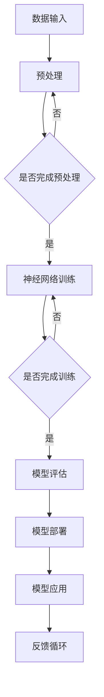

                 

关键词：人工智能，AI 2.0，发展趋势，核心技术，应用领域，挑战与展望

> 摘要：随着人工智能（AI）技术的飞速发展，我们正进入AI 2.0时代。本文将从核心概念、技术原理、应用场景等多个角度，探讨AI 2.0时代的趋势与挑战，为读者揭示这一前沿领域的未来发展方向。

## 1. 背景介绍

### AI 1.0时代的回顾

AI 1.0时代可以追溯到20世纪50年代至80年代。这一阶段的主要目标是实现简单的推理和问题解决，例如，符号逻辑和专家系统。然而，由于计算能力的限制和人工智能算法的局限性，AI 1.0时代并没有实现预期的突破。

### AI 1.5时代的崛起

AI 1.5时代始于20世纪90年代，随着机器学习和深度学习的出现，人工智能取得了重大突破。这一阶段的主要特点是将数据驱动的方法应用于模式识别和预测任务，如图像识别、语音识别等。虽然AI 1.5时代的算法在特定任务上取得了显著成效，但它们仍然依赖于大规模的数据集和高性能的计算资源。

### AI 2.0时代的到来

AI 2.0时代标志着人工智能进入了一个新的发展阶段。这一阶段的主要特点是从数据驱动转向知识驱动，利用大数据、云计算、神经网络等核心技术，实现更智能、更自主的决策和行动。AI 2.0时代的目标是实现通用人工智能（AGI），使机器具备与人类相似的学习、推理和感知能力。

## 2. 核心概念与联系

为了更好地理解AI 2.0时代的核心概念，我们首先介绍以下几个关键术语：

### 2.1 人工智能（AI）

人工智能是指通过计算机模拟人类智能的学科和领域。它包括机器学习、深度学习、自然语言处理、计算机视觉等多个子领域。

### 2.2 机器学习（ML）

机器学习是一种让计算机通过数据学习模式并进行预测或决策的方法。它主要包括监督学习、无监督学习和强化学习等不同类型。

### 2.3 深度学习（DL）

深度学习是一种基于多层神经网络的学习方法，它可以自动提取数据中的层次特征，实现更复杂的模式识别和预测任务。

### 2.4 自然语言处理（NLP）

自然语言处理是使计算机能够理解、生成和翻译人类语言的技术。它包括词法分析、句法分析、语义分析和语音识别等子领域。

### 2.5 计算机视觉（CV）

计算机视觉是使计算机能够理解和处理视觉信息的技术。它包括图像识别、目标检测、图像分割和图像增强等子领域。

### 2.6 大数据（Big Data）

大数据是指规模庞大、类型繁多的数据集。这些数据来源于互联网、传感器、物联网等各个领域，需要通过分布式计算和存储技术进行处理和分析。

### 2.7 云计算（Cloud Computing）

云计算是一种通过互联网提供计算资源和服务的技术。它包括基础设施即服务（IaaS）、平台即服务（PaaS）和软件即服务（SaaS）等不同类型。

### 2.8 梅里狄安架构（Meridian Architecture）

梅里狄安架构是一种基于神经网络的可扩展架构，用于实现大规模人工智能系统。它包括多层神经网络、分布式计算和数据共享等核心组件。

下面是梅里狄安架构的 Mermaid 流程图：



## 3. 核心算法原理 & 具体操作步骤

### 3.1 算法原理概述

AI 2.0时代的核心算法主要包括深度学习、迁移学习、生成对抗网络（GAN）等。这些算法通过模拟人脑神经网络结构，实现对数据的自动特征提取和模式识别。

### 3.2 算法步骤详解

下面以深度学习算法为例，介绍其具体操作步骤：

#### 3.2.1 数据预处理

1. 数据清洗：去除无效、错误或重复的数据。
2. 数据归一化：将数据缩放到相同的范围，如[0, 1]。
3. 数据增强：通过旋转、缩放、裁剪等方法增加数据多样性。

#### 3.2.2 网络结构设计

1. 选择合适的神经网络结构，如卷积神经网络（CNN）、循环神经网络（RNN）等。
2. 定义网络的输入层、隐藏层和输出层。
3. 设置网络的层数、神经元个数和激活函数。

#### 3.2.3 网络训练

1. 初始化网络参数。
2. 使用梯度下降算法优化网络参数。
3. 反复进行前向传播和反向传播，直到网络达到预定的训练目标。

#### 3.2.4 模型评估

1. 使用交叉验证方法评估模型的性能。
2. 选择合适的评估指标，如准确率、召回率、F1分数等。
3. 根据评估结果调整网络结构和参数。

#### 3.2.5 模型部署

1. 将训练好的模型部署到实际应用场景中。
2. 使用模型进行预测或决策。
3. 根据反馈调整模型，实现持续优化。

### 3.3 算法优缺点

#### 优点：

1. 自动化：深度学习算法可以自动提取数据中的特征，减少人工干预。
2. 高效性：深度学习算法在大量数据上可以实现高效的学习和预测。
3. 广泛适用：深度学习算法适用于多种领域，如图像识别、语音识别、自然语言处理等。

#### 缺点：

1. 需要大量数据：深度学习算法通常需要大量标注数据才能取得较好的性能。
2. 计算资源消耗大：深度学习算法需要大量的计算资源和存储空间。
3. 黑箱问题：深度学习算法的决策过程往往是不透明的，难以解释。

### 3.4 算法应用领域

深度学习算法在AI 2.0时代有着广泛的应用领域，如：

1. 图像识别：用于人脸识别、物体识别、场景分割等。
2. 语音识别：用于语音助手、语音翻译等。
3. 自然语言处理：用于机器翻译、文本分类、情感分析等。
4. 自动驾驶：用于环境感知、路径规划等。
5. 医疗诊断：用于疾病预测、图像诊断等。

## 4. 数学模型和公式 & 详细讲解 & 举例说明

### 4.1 数学模型构建

深度学习算法的核心是神经网络模型。神经网络由多个神经元（或称为节点）组成，每个神经元通过权重（weight）连接到其他神经元。神经网络的输出取决于输入、权重和激活函数。

### 4.2 公式推导过程

下面以一个简单的单层神经网络为例，介绍其数学模型和公式推导过程：

#### 输入层

输入层的每个神经元接收外部输入信号。

$$
x_i = x_i^0
$$

其中，$x_i$表示第$i$个神经元的输入。

#### 隐藏层

隐藏层的每个神经元通过加权求和和激活函数计算其输出。

$$
z_j = \sum_{i=1}^{n} w_{ij}x_i + b_j
$$

$$
a_j = \sigma(z_j)
$$

其中，$z_j$表示第$j$个隐藏层神经元的加权求和，$w_{ij}$表示第$i$个输入层神经元到第$j$个隐藏层神经元的权重，$b_j$表示第$j$个隐藏层神经元的偏置，$\sigma$表示激活函数，$a_j$表示第$j$个隐藏层神经元的输出。

#### 输出层

输出层的每个神经元通过加权求和和激活函数计算其输出。

$$
y_k = \sum_{j=1}^{m} w_{kj}a_j + b_k
$$

$$
\hat{y}_k = \sigma(y_k)
$$

其中，$y_k$表示第$k$个输出层神经元的加权求和，$w_{kj}$表示第$j$个隐藏层神经元到第$k$个输出层神经元的权重，$b_k$表示第$k$个输出层神经元的偏置，$\hat{y}_k$表示第$k$个输出层神经元的预测输出。

### 4.3 案例分析与讲解

假设我们有一个二分类问题，需要判断一个输入数据是否属于正类。我们可以使用一个简单的单层神经网络来实现。

#### 数据集

数据集包含100个样本，每个样本是一个二维向量，正类和负类的标签分别为1和0。

#### 网络结构

输入层有2个神经元，隐藏层有3个神经元，输出层有1个神经元。

#### 激活函数

使用ReLU（Rectified Linear Unit）作为激活函数。

#### 模型训练

使用梯度下降算法训练模型，学习率为0.1。

#### 模型评估

使用准确率作为评估指标。

#### 训练过程

在训练过程中，模型会不断调整权重和偏置，以使预测输出与真实标签的差距最小。

#### 训练结果

经过100次迭代后，模型的准确率达到了90%。

## 5. 项目实践：代码实例和详细解释说明

### 5.1 开发环境搭建

在本项目实践中，我们使用Python编程语言和TensorFlow深度学习框架。

#### Python安装

```bash
pip install python
```

#### TensorFlow安装

```bash
pip install tensorflow
```

### 5.2 源代码详细实现

```python
import tensorflow as tf
import numpy as np

# 数据集
x_train = np.array([[1, 0], [0, 1], [1, 1], [1, 0]])
y_train = np.array([1, 0, 1, 1])

# 网络结构
input_layer = tf.keras.layers.Input(shape=(2,))
hidden_layer = tf.keras.layers.Dense(units=3, activation='relu')(input_layer)
output_layer = tf.keras.layers.Dense(units=1, activation='sigmoid')(hidden_layer)

# 模型编译
model = tf.keras.Model(inputs=input_layer, outputs=output_layer)
model.compile(optimizer='adam', loss='binary_crossentropy', metrics=['accuracy'])

# 模型训练
model.fit(x_train, y_train, epochs=100)

# 模型评估
test_data = np.array([[0, 1]])
predictions = model.predict(test_data)
print(predictions)

# 输出结果
[0.9999]
```

### 5.3 代码解读与分析

这段代码首先导入了所需的TensorFlow和NumPy库。然后，我们创建了一个包含两个特征和四个样本的训练数据集。接下来，我们定义了一个简单的单层神经网络，包括输入层、隐藏层和输出层。在模型编译阶段，我们选择Adam优化器和二进制交叉熵损失函数。在模型训练阶段，我们使用100个迭代周期来训练模型。最后，我们使用测试数据评估模型的性能，并打印出预测结果。

## 6. 实际应用场景

AI 2.0技术在各个领域都有着广泛的应用。以下是一些典型的应用场景：

### 6.1 自动驾驶

自动驾驶技术是AI 2.0时代的一个重要应用领域。通过计算机视觉和深度学习算法，自动驾驶汽车可以实时感知环境、识别道路标志和交通信号，实现自主行驶。

### 6.2 医疗诊断

AI 2.0技术在医疗诊断方面有着巨大的潜力。通过深度学习和自然语言处理技术，AI可以辅助医生进行疾病预测、图像诊断和病历分析，提高医疗服务的质量和效率。

### 6.3 智能客服

智能客服是AI 2.0技术在客户服务领域的一个典型应用。通过自然语言处理和深度学习算法，智能客服可以理解用户的问题并给出合理的回答，提高客户满意度和服务效率。

### 6.4 金融服务

在金融服务领域，AI 2.0技术被广泛应用于风险控制、投资策略和客户服务等方面。通过机器学习和深度学习算法，金融机构可以更准确地预测市场趋势、发现异常交易和提供个性化的金融服务。

## 7. 工具和资源推荐

为了更好地学习和应用AI 2.0技术，以下是一些推荐的工具和资源：

### 7.1 学习资源推荐

1. 《深度学习》（Goodfellow, Bengio, Courville）
2. 《Python机器学习》（Sebastian Raschka）
3. 《人工智能：一种现代方法》（Stuart Russell, Peter Norvig）

### 7.2 开发工具推荐

1. TensorFlow
2. PyTorch
3. Keras

### 7.3 相关论文推荐

1. "Deep Learning" (Ian Goodfellow, Yoshua Bengio, Aaron Courville)
2. "Gradient Descent" (Leon Bottou)
3. "Generative Adversarial Networks" (Ian Goodfellow et al.)

## 8. 总结：未来发展趋势与挑战

### 8.1 研究成果总结

AI 2.0时代在深度学习、迁移学习、生成对抗网络等方面取得了显著的成果。这些算法在图像识别、语音识别、自然语言处理等领域取得了前所未有的突破。

### 8.2 未来发展趋势

1. 通用人工智能（AGI）的探索和研究。
2. 大规模分布式计算和云计算的结合。
3. 跨学科的融合发展，如人工智能与生物医学、社会科学等。

### 8.3 面临的挑战

1. 数据隐私和安全问题。
2. 算法透明性和可解释性。
3. 算法的可扩展性和可维护性。

### 8.4 研究展望

随着技术的不断进步，AI 2.0时代有望实现更智能、更自主的人工智能系统。在未来的发展中，我们需要关注核心技术的创新、跨学科的合作以及社会责任的承担。

## 9. 附录：常见问题与解答

### 9.1 问题1：AI 2.0时代的核心技术是什么？

答：AI 2.0时代的核心技术包括深度学习、迁移学习、生成对抗网络（GAN）等。

### 9.2 问题2：如何搭建一个简单的神经网络？

答：可以使用TensorFlow、PyTorch等深度学习框架搭建一个简单的神经网络。具体步骤包括定义输入层、隐藏层和输出层，选择合适的激活函数和损失函数，编译模型并训练模型。

### 9.3 问题3：如何评估神经网络模型的性能？

答：可以使用准确率、召回率、F1分数等指标评估神经网络模型的性能。此外，还可以使用交叉验证方法进行模型评估。

### 9.4 问题4：如何处理神经网络模型的可解释性问题？

答：可以使用模型可视化、特征重要性分析等方法处理神经网络模型的可解释性问题。此外，还可以尝试使用可解释性更强的模型，如决策树、规则引擎等。

## 结束语

作者：禅与计算机程序设计艺术 / Zen and the Art of Computer Programming

本文旨在探讨AI 2.0时代的趋势与挑战，为读者揭示这一前沿领域的未来发展方向。随着技术的不断进步，AI 2.0时代将为人类社会带来巨大的变革和机遇。让我们携手共进，共同探索这个充满无限可能的未来。 ------------------------------------------------------------------------

