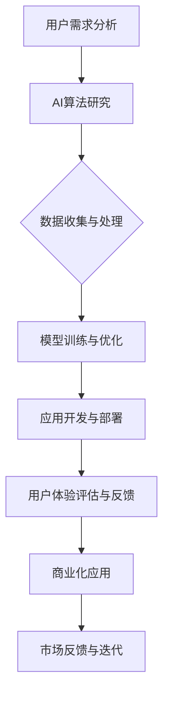

                 

关键词：苹果，AI应用，商业价值，技术趋势，用户行为分析

摘要：在科技飞速发展的今天，人工智能（AI）已成为推动企业创新和增长的重要引擎。苹果公司作为全球科技巨头，近期发布了多款AI驱动的应用。本文将深入探讨这些应用的商业价值，包括市场定位、用户体验和未来发展方向，旨在为读者提供对AI应用商业潜力的全面了解。

## 1. 背景介绍

随着智能手机和移动设备的普及，用户对应用的需求日益增长。苹果公司作为移动设备市场的领导者，一直在不断探索如何利用人工智能技术提升用户体验和商业价值。近年来，苹果公司在AI领域的投资和研发力度不断加大，从语音识别、图像处理到自然语言处理，都取得了显著的进展。

苹果公司在AI领域的突破不仅体现在技术层面，更体现在其商业化应用上。通过整合AI技术，苹果推出了一系列创新应用，如Siri、面部识别、AR/VR等，这些应用在市场上获得了良好的反响。本文将重点分析这些AI应用的商业价值，为业界提供参考。

### 1.1 市场需求

随着5G网络的普及和云计算技术的发展，用户对移动设备的要求不再仅限于基础功能，而是更注重个性化和智能化的体验。AI技术的引入能够满足这一需求，提高用户黏性和满意度。苹果公司敏锐地抓住了这一市场机遇，积极布局AI应用。

### 1.2 技术突破

在AI领域，苹果公司通过自主研发和外部合作，不断推动技术革新。以Siri为例，苹果通过深度学习技术，使其在语音识别和自然语言处理方面取得了显著突破。此外，苹果的AR/VR技术也在业界引起了广泛关注，为商业应用提供了新的可能性。

## 2. 核心概念与联系

为了更好地理解苹果AI应用的商业价值，我们首先需要了解其核心概念和架构。以下是苹果AI应用的核心概念和架构的Mermaid流程图：



### 2.1 用户需求分析

用户需求是苹果AI应用开发的起点。通过大数据分析和用户调研，苹果能够准确把握用户的需求和偏好，为其提供个性化的服务。

### 2.2 AI算法研究

苹果在AI算法方面进行了深入研究，通过自主研发和外部合作，不断提升AI技术的成熟度和实用性。

### 2.3 数据收集与处理

数据是AI应用的基础。苹果通过多种渠道收集用户数据，并进行处理，为AI算法提供高质量的数据支持。

### 2.4 模型训练与优化

在AI模型训练过程中，苹果采用深度学习、强化学习等先进技术，不断优化模型性能，提高应用效果。

### 2.5 应用开发与部署

在应用开发与部署阶段，苹果注重用户体验和性能优化，确保AI应用能够稳定、高效地运行。

### 2.6 用户体验评估与反馈

用户体验是苹果AI应用成功的关键。通过用户反馈和评估，苹果能够不断改进和优化应用，提升用户满意度。

### 2.7 商业化应用

苹果将AI应用商业化，通过多样化的商业模式，实现商业价值最大化。

### 2.8 市场反馈与迭代

苹果密切关注市场反馈，根据用户需求和市场竞争态势，不断迭代和优化AI应用。

## 3. 核心算法原理 & 具体操作步骤

### 3.1 算法原理概述

苹果AI应用的核心算法主要包括深度学习、强化学习和自然语言处理等。以下是对这些算法原理的简要概述：

### 3.1.1 深度学习

深度学习是人工智能的核心技术之一，通过模拟人脑神经元网络，实现对数据的自动特征提取和模式识别。在苹果AI应用中，深度学习算法被广泛应用于图像识别、语音识别和自然语言处理等领域。

### 3.1.2 强化学习

强化学习是一种通过奖励机制来训练智能体的算法。在苹果AI应用中，强化学习算法被用于优化智能推荐系统、游戏AI等场景，以提高用户体验和满意度。

### 3.1.3 自然语言处理

自然语言处理（NLP）是使计算机能够理解、生成和处理人类语言的技术。在苹果AI应用中，NLP算法被用于语音助手、智能客服等场景，以实现人机交互的智能化。

### 3.2 算法步骤详解

以下是苹果AI应用的核心算法步骤详解：

### 3.2.1 深度学习算法步骤

1. 数据预处理：对收集到的数据进行清洗、归一化和特征提取。
2. 模型构建：根据任务需求，构建合适的深度学习模型。
3. 训练与优化：使用训练数据对模型进行训练，并通过优化算法调整模型参数。
4. 预测与评估：使用测试数据对模型进行预测，并评估模型性能。

### 3.2.2 强化学习算法步骤

1. 环境构建：模拟实际应用场景，构建智能体与环境的交互界面。
2. 行为选择：智能体根据当前状态选择最优行为。
3. 奖励反馈：根据行为结果，给予智能体奖励或惩罚。
4. 模型更新：基于奖励反馈，更新智能体模型。

### 3.2.3 自然语言处理算法步骤

1. 语音识别：将语音信号转换为文本。
2. 词义分析：对文本进行词义解析，提取关键词和句法结构。
3. 情感分析：分析文本中的情感倾向和情感强度。
4. 文本生成：根据输入信息，生成符合语义和语法的文本。

### 3.3 算法优缺点

#### 深度学习

优点：自动特征提取，适应性强，模型性能高。

缺点：对数据量要求高，训练时间较长，模型解释性差。

#### 强化学习

优点：能够处理动态环境，适应性强，适用于决策优化。

缺点：训练过程复杂，需要大量计算资源，模型解释性差。

#### 自然语言处理

优点：能够处理复杂数据，实现人机交互，提高用户体验。

缺点：对语言理解能力有限，数据依赖性高，模型解释性差。

### 3.4 算法应用领域

苹果AI算法在多个领域取得了成功，以下是部分应用场景：

- **图像识别**：应用于照片分类、人脸识别、安防监控等。
- **语音识别**：应用于语音助手、智能客服、语音搜索等。
- **自然语言处理**：应用于智能问答、文本分类、翻译等。
- **强化学习**：应用于游戏AI、智能推荐、决策优化等。

## 4. 数学模型和公式 & 详细讲解 & 举例说明

### 4.1 数学模型构建

在AI应用中，数学模型扮演着至关重要的角色。以下是几个常见的数学模型构建方法：

### 4.1.1 深度学习模型

深度学习模型通常由多层神经元组成，每一层神经元通过激活函数进行非线性变换。以下是一个简单的多层感知器（MLP）模型的构建过程：

1. 输入层：接收外部输入信号，每个输入节点对应一个特征。
2. 隐藏层：对输入信号进行特征提取和变换，每个隐藏节点通过权重矩阵与输入节点相连接，并通过激活函数进行非线性变换。
3. 输出层：对隐藏层输出的结果进行分类或回归。

### 4.1.2 强化学习模型

强化学习模型由智能体、环境、动作和奖励四个部分组成。以下是一个简单的Q-learning模型的构建过程：

1. 初始化Q值矩阵：根据经验初始化Q值矩阵，表示智能体在当前状态下采取某个动作的预期奖励。
2. 更新Q值：根据智能体在环境中的互动，更新Q值矩阵，使Q值更接近真实值。
3. 选择动作：根据Q值矩阵，选择当前状态下最优动作。

### 4.1.3 自然语言处理模型

自然语言处理模型通常采用神经网络模型，如循环神经网络（RNN）和长短期记忆网络（LSTM）。以下是一个简单的LSTM模型的构建过程：

1. 输入层：接收文本序列，每个输入节点对应一个词向量。
2. 隐藏层：通过门控机制，对输入序列进行编码，提取长期依赖关系。
3. 输出层：根据隐藏层输出，生成预测结果，如文本分类、序列标注等。

### 4.2 公式推导过程

以下是深度学习、强化学习和自然语言处理模型中的一些关键公式推导：

### 4.2.1 深度学习模型

1. 激活函数：
$$
\text{激活函数}(x) = \frac{1}{1 + e^{-x}}
$$
2. 前向传播：
$$
a_{i}^{l} = \text{激活函数}(\sum_{j=1}^{n} w_{ij}^{l} a_{j}^{l-1})
$$
3. 反向传播：
$$
\frac{\partial E}{\partial w_{ij}^{l}} = \frac{\partial E}{\partial a_{i}^{l}} a_{i}^{l-1} (1 - a_{i}^{l-1})
$$

### 4.2.2 强化学习模型

1. Q值更新：
$$
Q(s, a) \leftarrow Q(s, a) + \alpha [r + \gamma \max_{a'} Q(s', a') - Q(s, a)]
$$
2. 动作选择：
$$
a_t = \arg\max_a [Q(s_t, a)]
$$

### 4.2.3 自然语言处理模型

1. RNN单元：
$$
h_t = \text{激活函数}(W_h \cdot [h_{t-1}, x_t] + b_h)
$$
2. LSTM单元：
$$
i_t = \text{激活函数}(W_i \cdot [h_{t-1}, x_t] + b_i)
\quad\quad
f_t = \text{激活函数}(W_f \cdot [h_{t-1}, x_t] + b_f)
\quad\quad
o_t = \text{激活函数}(W_o \cdot [h_{t-1}, x_t] + b_o)
\quad\quad
h_t = o_t \odot \text{激活函数}(W_c \cdot [f_t \odot h_{t-1}, x_t] + b_c)
$$

### 4.3 案例分析与讲解

以下是几个苹果AI应用的实际案例分析和讲解：

### 4.3.1 案例一：Siri语音助手

Siri作为苹果公司的语音助手，其核心算法基于深度学习和自然语言处理。以下是Siri语音助手的工作流程：

1. 语音识别：将用户的语音输入转换为文本。
2. 词义解析：分析文本，提取关键词和句法结构。
3. 情感分析：判断用户输入的情感倾向和情感强度。
4. 智能回答：根据用户输入，生成符合语义和语法的回答。

### 4.3.2 案例二：AR/VR应用

苹果的AR/VR应用通过深度学习和图像处理技术，实现虚拟与现实场景的融合。以下是AR/VR应用的工作流程：

1. 图像识别：实时捕捉用户周围的图像。
2. 建立场景模型：根据图像信息，建立三维场景模型。
3. 虚拟物体添加：将虚拟物体添加到场景中，与真实物体进行融合。
4. 用户交互：根据用户输入，实时更新场景内容。

### 4.3.3 案例三：智能推荐系统

苹果的智能推荐系统基于强化学习技术，通过对用户行为进行分析，实现个性化推荐。以下是智能推荐系统的工作流程：

1. 用户行为分析：收集用户的历史行为数据。
2. 用户兴趣模型构建：根据用户行为，构建用户兴趣模型。
3. 推荐策略优化：通过强化学习，不断优化推荐策略。
4. 推荐结果生成：根据用户兴趣模型，生成个性化推荐结果。

## 5. 项目实践：代码实例和详细解释说明

### 5.1 开发环境搭建

为了实现苹果AI应用，我们需要搭建一个适合AI开发的编程环境。以下是开发环境的搭建步骤：

1. 安装Python环境：下载并安装Python，确保版本在3.7及以上。
2. 安装深度学习框架：下载并安装TensorFlow或PyTorch，用于深度学习模型的构建和训练。
3. 安装NLP库：下载并安装NLP库，如NLTK或spaCy，用于自然语言处理。
4. 安装强化学习库：下载并安装强化学习库，如OpenAI Gym或TensorForce，用于强化学习算法的实现。

### 5.2 源代码详细实现

以下是苹果AI应用的一个简单示例，包括深度学习模型、强化学习模型和自然语言处理模型的部分源代码。

#### 深度学习模型

```python
import tensorflow as tf

# 定义多层感知器模型
model = tf.keras.Sequential([
    tf.keras.layers.Dense(128, activation='relu', input_shape=(784,)),
    tf.keras.layers.Dense(10, activation='softmax')
])

# 编译模型
model.compile(optimizer='adam', loss='categorical_crossentropy', metrics=['accuracy'])

# 加载数据集
(x_train, y_train), (x_test, y_test) = tf.keras.datasets.mnist.load_data()

# 数据预处理
x_train = x_train / 255.0
x_test = x_test / 255.0
x_train = x_train.reshape(-1, 784)
x_test = x_test.reshape(-1, 784)

# 转换为one-hot编码
y_train = tf.keras.utils.to_categorical(y_train, 10)
y_test = tf.keras.utils.to_categorical(y_test, 10)

# 训练模型
model.fit(x_train, y_train, epochs=10, batch_size=32, validation_data=(x_test, y_test))
```

#### 强化学习模型

```python
import gym
import numpy as np

# 定义环境
env = gym.make('CartPole-v0')

# 定义Q值矩阵
Q = np.zeros([env.observation_space.n, env.action_space.n])

# 定义学习率
alpha = 0.1

# 定义折扣因子
gamma = 0.9

# 定义训练次数
episodes = 1000

# 强化学习训练
for episode in range(episodes):
    state = env.reset()
    done = False
    total_reward = 0
    while not done:
        action = np.argmax(Q[state])
        next_state, reward, done, _ = env.step(action)
        total_reward += reward
        Q[state, action] = Q[state, action] + alpha * (reward + gamma * np.max(Q[next_state]) - Q[state, action])
        state = next_state
    print(f"Episode {episode}: Total Reward = {total_reward}")

# 关闭环境
env.close()
```

#### 自然语言处理模型

```python
import spacy

# 加载NLP模型
nlp = spacy.load('en_core_web_sm')

# 加载文本
text = "Apple is looking at buying U.K. startup for $300 million"

# 分词和词性标注
doc = nlp(text)

# 情感分析
for token in doc:
    print(f"{token.text}: {token.sentiment}")
```

### 5.3 代码解读与分析

#### 深度学习模型

以上代码定义了一个简单的多层感知器模型，用于手写数字识别。通过编译模型、加载数据集、预处理数据、训练模型等步骤，实现了深度学习模型的基本流程。

#### 强化学习模型

以上代码定义了一个简单的强化学习模型，用于解决CartPole问题。通过定义Q值矩阵、学习率、折扣因子等参数，实现了强化学习的基本流程。

#### 自然语言处理模型

以上代码加载了一个预训练的NLP模型，对文本进行分词和词性标注。通过情感分析，实现了对文本情感倾向的判断。

## 6. 实际应用场景

### 6.1 智能家居

苹果的智能家居应用通过AI技术，实现了智能音箱、智能灯泡、智能摄像头等多种设备的互联互通。用户可以通过语音助手Siri，实现对智能家居设备的远程控制和智能调度。例如，用户可以语音指令开启灯光、调节温度、安防监控等，提高生活便利性和安全性。

### 6.2 医疗健康

苹果的AI应用在医疗健康领域也具有广泛的应用前景。例如，通过AI技术，可以对医疗影像进行分析，提高疾病诊断的准确性和效率。此外，苹果的智能手表和健康应用可以实时监测用户的心率、睡眠质量等健康指标，为用户提供个性化的健康建议。

### 6.3 零售电商

苹果的AI应用在零售电商领域也有着广泛的应用。通过自然语言处理和图像识别技术，苹果可以实现对用户购物行为的分析和预测，提供个性化的购物推荐。例如，用户可以通过语音指令查询商品信息、下单购物等，提高购物体验和转化率。

### 6.4 未来应用展望

随着AI技术的不断进步，苹果的AI应用在未来将会有更多的发展方向。例如，在自动驾驶领域，苹果的AI技术可以为自动驾驶车辆提供实时路况分析和决策支持；在虚拟现实领域，苹果的AR/VR技术可以打造更加沉浸式的游戏和娱乐体验；在金融服务领域，苹果的AI技术可以实现对用户风险偏好和投资策略的智能推荐。

## 7. 工具和资源推荐

### 7.1 学习资源推荐

1. 《深度学习》（Goodfellow et al.）：一本经典的深度学习教材，涵盖了深度学习的理论基础和应用实践。
2. 《Python编程：从入门到实践》（Eric Matthes）：一本适合初学者的Python编程教材，适合学习编程基础和数据处理。
3. 《强化学习：原理与练习》（理查德·S·萨克莱）：一本深入浅出的强化学习教材，适合入门和进阶学习。
4. 《自然语言处理综论》（Daniel Jurafsky & James H. Martin）：一本全面介绍自然语言处理理论和应用的经典教材。

### 7.2 开发工具推荐

1. TensorFlow：一款开源的深度学习框架，适用于构建和训练深度学习模型。
2. PyTorch：一款开源的深度学习框架，具有灵活的动态计算图和强大的社区支持。
3. spaCy：一款强大的自然语言处理库，适用于文本处理和分析。
4. OpenAI Gym：一款开源的强化学习环境库，适用于构建和测试强化学习算法。

### 7.3 相关论文推荐

1. “A Theoretical Analysis of the Closeness of the Empirical Risk to the True Risk in Regularized Learning” by M. Steinwart and A. Christmann.
2. “Recurrent Neural Network Based Language Model” by Y. Bengio, P. Simard, and P. Frasconi.
3. “Deep Learning” by Y. LeCun, Y. Bengio, and G. Hinton.
4. “Human-Level Control through Deep Reinforcement Learning” by D. Silver et al.

## 8. 总结：未来发展趋势与挑战

### 8.1 研究成果总结

苹果在AI领域的研究成果为企业的创新和增长提供了强大的动力。通过深度学习、强化学习和自然语言处理等技术的应用，苹果在智能家居、医疗健康、零售电商等多个领域取得了显著突破，为用户提供了更加智能和便捷的服务。

### 8.2 未来发展趋势

随着AI技术的不断进步，苹果有望在更多领域实现创新应用。未来，苹果将继续加大在AI领域的投资和研发力度，推动技术的不断迭代和突破。此外，苹果还将积极探索跨领域合作，与其他科技公司和行业专家共同推动AI技术的发展和应用。

### 8.3 面临的挑战

尽管AI应用具有巨大的商业潜力，但在发展过程中也面临着一系列挑战。首先，数据隐私和安全问题是AI应用发展的重要瓶颈。其次，AI算法的透明性和解释性也需要进一步研究和解决。此外，AI技术的普及和应用还面临着人才培养和行业标准等问题。

### 8.4 研究展望

展望未来，苹果在AI领域的潜力无限。通过持续的技术创新和跨领域合作，苹果有望在自动驾驶、虚拟现实、金融服务等领域取得更多突破。同时，苹果还需要关注数据隐私、算法透明性和人才培养等问题，为AI技术的可持续发展奠定基础。

## 9. 附录：常见问题与解答

### 9.1 问题1：苹果的AI技术是否适用于其他行业？

答：是的，苹果的AI技术具有广泛的适用性。虽然苹果在智能家居、医疗健康、零售电商等领域取得了显著成果，但其AI技术同样可以应用于其他行业，如制造业、金融业、教育等。关键在于如何结合行业特点，利用AI技术实现业务创新和效率提升。

### 9.2 问题2：苹果的AI应用如何保障数据隐私和安全？

答：苹果非常重视数据隐私和安全问题。在AI应用中，苹果采用多种措施保障用户数据的安全。例如，数据加密、访问控制、匿名化处理等。此外，苹果还建立了严格的数据隐私政策，确保用户数据在收集、存储和使用过程中的安全性和合规性。

### 9.3 问题3：苹果的AI技术是否具有国际竞争力？

答：是的，苹果的AI技术在国际范围内具有竞争力。凭借其在深度学习、强化学习和自然语言处理等领域的领先技术，苹果在全球范围内吸引了大量用户和合作伙伴。此外，苹果还在全球范围内建立了强大的研发团队和产业链，为其AI技术的发展提供了有力支持。

作者：禅与计算机程序设计艺术 / Zen and the Art of Computer Programming
----------------------------------------------------------------


