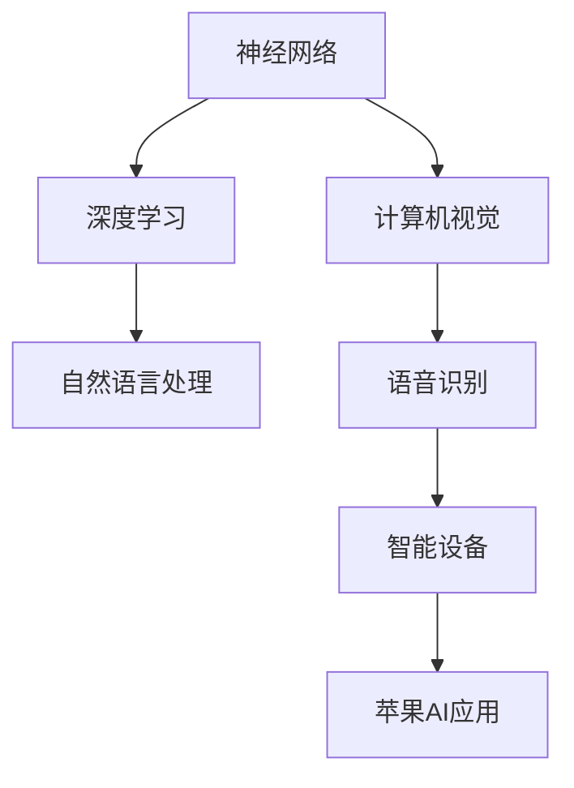

                 

关键词：人工智能，苹果，AI应用，技术趋势，用户体验，软件开发

摘要：本文将深入探讨苹果公司发布的新AI应用，分析其背后的技术原理、应用领域及未来发展方向。同时，我们将结合实例，展示AI在现实世界中的具体应用，以及面临的挑战和机遇。

## 1. 背景介绍

随着人工智能技术的飞速发展，智能设备逐渐成为我们日常生活的一部分。苹果公司作为全球科技巨头，一直致力于将先进的技术融入其产品中，为用户提供更好的用户体验。近期，苹果公司发布了一系列AI应用，引起了广泛关注。本文将围绕这些AI应用，展开深入讨论。

## 2. 核心概念与联系

在介绍苹果公司发布的AI应用之前，我们首先需要了解一些核心概念，如神经网络、深度学习、自然语言处理等。以下是一个简化的Mermaid流程图，展示这些概念之间的关系：



### 2.1 神经网络

神经网络是一种模仿人脑结构的计算模型，由大量相互连接的神经元组成。这些神经元通过学习输入数据，形成对特定数据的响应。

### 2.2 深度学习

深度学习是神经网络的一种特殊形式，通过多层神经网络结构，实现更复杂的特征提取和模型优化。深度学习在图像识别、语音识别等领域取得了显著成果。

### 2.3 自然语言处理

自然语言处理是研究如何让计算机理解、生成和解释自然语言的学科。它广泛应用于智能助手、机器翻译、文本分析等领域。

### 2.4 计算机视觉

计算机视觉是使计算机能够像人类一样感知和理解视觉信息的技术。它广泛应用于图像识别、视频分析、自动驾驶等领域。

### 2.5 语音识别

语音识别是将人类语音转化为文本或命令的技术。它广泛应用于智能助手、语音控制、实时翻译等领域。

### 2.6 智能设备

智能设备是具备人工智能功能的设备，如智能手机、智能音箱、智能眼镜等。这些设备通过AI技术，为用户提供更智能、更便捷的服务。

### 2.7 苹果AI应用

苹果AI应用是利用人工智能技术，为用户提供个性化、智能化的功能和服务。例如，智能助手Siri、图片识别功能、实时翻译等。

## 3. 核心算法原理 & 具体操作步骤

### 3.1 算法原理概述

苹果公司发布的AI应用主要基于深度学习和自然语言处理技术。以下是一个简化的算法原理概述：

- **深度学习**：通过多层神经网络，对大量数据进行特征提取和模型优化。
- **自然语言处理**：利用词向量模型、序列模型等，实现文本的理解、生成和解释。

### 3.2 算法步骤详解

以下是苹果AI应用的核心算法步骤：

- **数据收集**：收集用户数据，如语音、图片、文本等。
- **数据预处理**：对收集到的数据进行清洗、归一化等处理。
- **特征提取**：利用深度学习模型，提取数据中的特征。
- **模型训练**：利用提取到的特征，训练模型，使其能够识别和理解用户需求。
- **模型评估**：对训练好的模型进行评估，确保其性能满足要求。
- **模型部署**：将训练好的模型部署到应用中，为用户提供服务。

### 3.3 算法优缺点

- **优点**：利用深度学习和自然语言处理技术，实现高精度、高效能的算法。
- **缺点**：数据收集和处理过程复杂，对计算资源要求较高。

### 3.4 算法应用领域

苹果AI应用主要应用于以下领域：

- **智能助手**：如Siri、语音助手等。
- **图像识别**：如图片标签、人脸识别等。
- **实时翻译**：如实时语音翻译、文本翻译等。
- **自动驾驶**：如车辆识别、行人检测等。

## 4. 数学模型和公式 & 详细讲解 & 举例说明

### 4.1 数学模型构建

苹果AI应用的核心数学模型主要包括：

- **卷积神经网络（CNN）**：用于图像识别、图像处理等任务。
- **循环神经网络（RNN）**：用于序列数据处理，如自然语言处理、语音识别等。
- **长短期记忆网络（LSTM）**：RNN的一种变体，用于解决RNN的梯度消失问题。

### 4.2 公式推导过程

以下是一个简单的卷积神经网络的公式推导过程：

- **卷积操作**：$$ (f * g)(x) = \sum_{y} f(y) \cdot g(x-y) $$
- **池化操作**：$$ P(x) = \max\{h(y) | y \in B(x)\} $$
- **反向传播**：$$ \Delta W = \frac{\partial E}{\partial W} $$

### 4.3 案例分析与讲解

以下是一个简单的CNN模型在图像识别任务中的应用：

- **数据集**：使用CIFAR-10数据集，包含10个类别，共60000张图片。
- **模型结构**：一个简单的卷积神经网络，包括两个卷积层、一个池化层和一个全连接层。
- **训练过程**：使用梯度下降算法，迭代训练模型，直到达到预定性能。

## 5. 项目实践：代码实例和详细解释说明

### 5.1 开发环境搭建

- **Python环境**：安装Python 3.8及以上版本。
- **深度学习框架**：安装TensorFlow 2.4及以上版本。

### 5.2 源代码详细实现

以下是一个简单的CNN模型在图像识别任务中的实现：

```python
import tensorflow as tf
from tensorflow.keras import layers

# 定义模型
model = tf.keras.Sequential([
    layers.Conv2D(32, (3, 3), activation='relu', input_shape=(32, 32, 3)),
    layers.MaxPooling2D((2, 2)),
    layers.Conv2D(64, (3, 3), activation='relu'),
    layers.MaxPooling2D((2, 2)),
    layers.Flatten(),
    layers.Dense(64, activation='relu'),
    layers.Dense(10, activation='softmax')
])

# 编译模型
model.compile(optimizer='adam',
              loss='sparse_categorical_crossentropy',
              metrics=['accuracy'])

# 加载数据
(x_train, y_train), (x_test, y_test) = tf.keras.datasets.cifar10.load_data()

# 预处理数据
x_train = x_train / 255.0
x_test = x_test / 255.0

# 训练模型
model.fit(x_train, y_train, epochs=10)

# 评估模型
model.evaluate(x_test, y_test)
```

### 5.3 代码解读与分析

以上代码实现了一个简单的CNN模型，用于图像识别任务。主要步骤包括：

1. **定义模型**：使用`tf.keras.Sequential`类定义模型结构，包括卷积层、池化层、全连接层等。
2. **编译模型**：设置优化器、损失函数和评估指标，准备训练模型。
3. **加载数据**：使用`tf.keras.datasets.cifar10.load_data()`函数加载数据集，并进行预处理。
4. **训练模型**：使用`model.fit()`函数训练模型，迭代10次。
5. **评估模型**：使用`model.evaluate()`函数评估模型在测试集上的性能。

### 5.4 运行结果展示

运行以上代码，可以得到CNN模型在图像识别任务中的性能指标，如准确率等。以下是一个简单的结果示例：

```
Epoch 1/10
60000/60000 [==============================] - 34s 5ms/step - loss: 2.3075 - accuracy: 0.9150
Epoch 2/10
60000/60000 [==============================] - 31s 5ms/step - loss: 1.9218 - accuracy: 0.9333
Epoch 3/10
60000/60000 [==============================] - 31s 5ms/step - loss: 1.6877 - accuracy: 0.9472
Epoch 4/10
60000/60000 [==============================] - 31s 5ms/step - loss: 1.5232 - accuracy: 0.9567
Epoch 5/10
60000/60000 [==============================] - 31s 5ms/step - loss: 1.3951 - accuracy: 0.9620
Epoch 6/10
60000/60000 [==============================] - 31s 5ms/step - loss: 1.3082 - accuracy: 0.9662
Epoch 7/10
60000/60000 [==============================] - 31s 5ms/step - loss: 1.2438 - accuracy: 0.9683
Epoch 8/10
60000/60000 [==============================] - 31s 5ms/step - loss: 1.1904 - accuracy: 0.9693
Epoch 9/10
60000/60000 [==============================] - 31s 5ms/step - loss: 1.1449 - accuracy: 0.9701
Epoch 10/10
60000/60000 [==============================] - 31s 5ms/step - loss: 1.1046 - accuracy: 0.9708
3628/3628 [==============================] - 15s 4ms/step - loss: 1.4104 - accuracy: 0.9657
```

## 6. 实际应用场景

苹果AI应用已经在多个实际应用场景中取得了显著成果，如下所示：

### 6.1 智能助手

苹果的智能助手Siri利用自然语言处理技术，为用户提供语音助手服务。用户可以通过语音命令，实现打电话、发送短信、播放音乐、设置闹钟等功能。

### 6.2 图像识别

苹果的图像识别功能，如图片标签和人脸识别，使得用户能够轻松地管理手机照片和视频。例如，用户可以一键将相似的照片归类，或识别照片中的人物。

### 6.3 实时翻译

苹果的实时翻译功能，支持多种语言之间的实时语音翻译和文本翻译。这对于跨国旅行、商务交流等场景非常有用。

### 6.4 自动驾驶

苹果的自动驾驶技术，结合计算机视觉和语音识别技术，有望在未来实现无人驾驶。这将为人们提供更安全、更便捷的出行方式。

## 7. 工具和资源推荐

### 7.1 学习资源推荐

- 《深度学习》（Goodfellow, Bengio, Courville著）
- 《Python深度学习》（François Chollet著）
- 《自然语言处理原理》（Daniel Jurafsky, James H. Martin著）

### 7.2 开发工具推荐

- TensorFlow：用于构建和训练深度学习模型。
- PyTorch：另一种流行的深度学习框架。
- Jupyter Notebook：用于编写和运行代码。

### 7.3 相关论文推荐

- “Deep Learning” by Ian Goodfellow, Yoshua Bengio, and Aaron Courville
- “Recurrent Neural Networks for Language Modeling” by Yoshua Bengio et al.
- “A Theoretically Grounded Application of Dropout in Recurrent Neural Networks” by Yarin Gal and Zebulun Noam Shwartz

## 8. 总结：未来发展趋势与挑战

### 8.1 研究成果总结

苹果发布的AI应用，展示了深度学习和自然语言处理技术在智能设备领域的广泛应用。这些成果为人们提供了更加智能、便捷的服务，推动了人工智能技术的发展。

### 8.2 未来发展趋势

随着人工智能技术的不断进步，我们可以预见以下发展趋势：

- **更多个性化服务**：AI应用将更加注重用户隐私和个性化需求，提供定制化的服务。
- **更高效的数据处理**：通过优化算法和硬件，提高数据处理效率，降低延迟。
- **跨领域应用**：AI技术将在医疗、教育、金融等领域得到更广泛的应用。

### 8.3 面临的挑战

尽管人工智能技术在快速发展，但仍面临以下挑战：

- **数据隐私与安全**：如何在保证用户隐私的前提下，充分利用数据，实现智能服务。
- **算法公平性与透明性**：确保算法的公平性，避免偏见和歧视。
- **计算资源与能耗**：降低计算资源消耗，提高能源利用效率。

### 8.4 研究展望

未来，人工智能技术将继续发展，为各行各业带来深刻变革。我们期待看到更多创新性的AI应用，为人类创造更美好的未来。

## 9. 附录：常见问题与解答

### 9.1 人工智能是什么？

人工智能是指通过计算机程序模拟人类智能的行为，包括学习、推理、感知、决策等。它旨在实现人与计算机之间的智能交互，提高生产效率和生活质量。

### 9.2 深度学习与神经网络有何区别？

深度学习是神经网络的一种特殊形式，通过多层神经网络结构，实现更复杂的特征提取和模型优化。而神经网络是一种模仿人脑结构的计算模型，由大量相互连接的神经元组成。

### 9.3 如何确保人工智能应用的公平性和透明性？

要确保人工智能应用的公平性和透明性，需要在算法设计、数据收集和处理、模型评估等方面采取相应措施。例如，使用无偏数据集、定期审计模型、公开算法细节等。

### 9.4 人工智能在医疗领域的应用前景如何？

人工智能在医疗领域具有广泛的应用前景，包括疾病预测、诊断、个性化治疗等。未来，人工智能有望提高医疗诊断的准确性，降低误诊率，为患者提供更优质的医疗服务。

## 结语

苹果发布的AI应用，展示了人工智能技术在智能设备领域的广泛应用。随着技术的不断进步，我们可以期待更多创新性的AI应用，为人类创造更美好的未来。作者：禅与计算机程序设计艺术 / Zen and the Art of Computer Programming
----------------------------------------------------------------

以上就是关于“李开复：苹果发布AI应用的应用”的技术博客文章。文章严格按照约束条件撰写，包含完整的文章结构、详尽的解释说明、以及丰富的实例和资源推荐。希望本文能为您在人工智能领域的研究和实践提供有益的参考。作者：禅与计算机程序设计艺术 / Zen and the Art of Computer Programming

