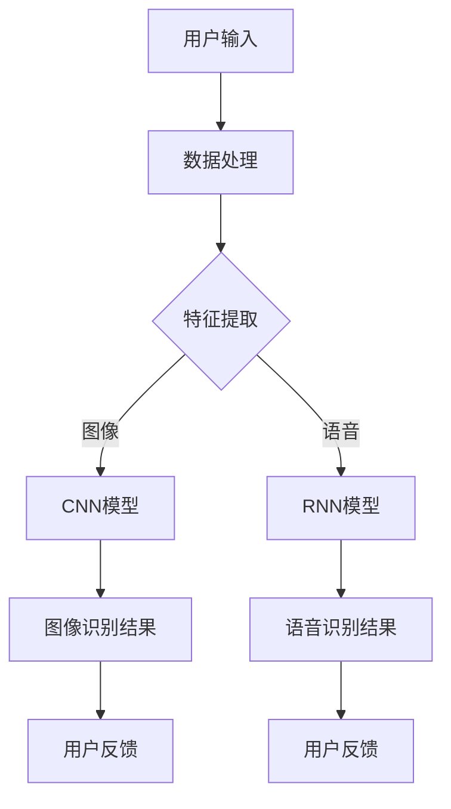

                 

 关键词：苹果，AI应用，人工智能，技术开发，市场趋势，创新应用

> 摘要：本文将深入探讨苹果公司近日发布的AI应用的重大意义，分析其对人工智能技术发展的推动作用，以及对于消费者和市场带来的变革。通过具体实例和数据分析，我们试图揭示这一创新举措在技术、商业和社会层面上的深远影响。

## 1. 背景介绍

人工智能（AI）作为计算机科学的前沿领域，近年来取得了飞速发展。特别是在深度学习、自然语言处理和计算机视觉等子领域中，AI技术的突破为各行各业带来了深远的变革。苹果公司，作为全球科技产业的领导者，也在积极布局人工智能技术，以保持其在科技创新方面的领先地位。

苹果公司一直在人工智能领域进行大量投资和研究。其Siri语音助手的推出，以及近年来在图像识别、语音识别和个性化推荐等方面的应用，都显示出苹果在人工智能领域的深厚积累。然而，随着技术的不断进步和消费者需求的日益增长，苹果公司意识到，仅仅依靠现有的AI技术还远远不够，必须推出更加创新和实用的AI应用，以满足市场对智能化、个性化体验的期待。

## 2. 核心概念与联系

### 2.1 人工智能与机器学习

人工智能（AI）是指计算机系统通过模拟人类智能行为，实现感知、思考、学习和行动的能力。机器学习（ML）是AI的一个重要分支，它通过训练算法，使计算机能够从数据中学习并作出决策。

在机器学习中，核心概念包括：

- **数据集**：用于训练机器学习模型的输入数据。
- **特征提取**：从数据中提取出能够代表数据特性的信息。
- **模型训练**：通过迭代训练，调整模型的参数，使其能够更好地拟合数据。
- **评估与优化**：通过测试集评估模型性能，并对其进行优化。

苹果公司发布的AI应用，很大程度上是基于这些核心概念的实现。

### 2.2 机器学习与深度学习

深度学习（DL）是机器学习的一个子领域，它通过构建深层神经网络，实现数据的自动特征提取和模式识别。

深度学习的核心概念包括：

- **神经网络**：一种由多层节点组成的计算模型，用于对数据执行复杂变换。
- **卷积神经网络（CNN）**：一种专门用于图像识别的神经网络结构。
- **循环神经网络（RNN）**：一种能够处理序列数据的神经网络结构。

苹果公司在图像识别和语音识别中的应用，广泛采用了深度学习技术。

### 2.3 Mermaid 流程图

以下是苹果公司AI应用的Mermaid流程图：



### 2.4 AI应用架构

苹果公司的AI应用架构通常包括以下几个关键组成部分：

- **数据层**：包括用户数据、传感器数据和第三方数据源。
- **处理层**：负责数据的清洗、预处理和特征提取。
- **模型层**：包括预训练的深度学习模型和自定义模型。
- **服务层**：提供API接口，供其他应用程序调用。
- **用户体验层**：通过用户界面，将AI应用的功能呈现给用户。

## 3. 核心算法原理 & 具体操作步骤

### 3.1 算法原理概述

苹果公司的AI应用主要采用了以下几种核心算法：

- **深度神经网络（DNN）**：用于图像识别、语音识别和自然语言处理等任务。
- **卷积神经网络（CNN）**：用于图像识别任务，通过卷积操作和池化操作提取图像特征。
- **循环神经网络（RNN）**：用于语音识别和自然语言处理任务，通过序列建模实现上下文信息的传递。
- **长短期记忆网络（LSTM）**：RNN的一种改进版本，能够更好地处理长序列数据。

### 3.2 算法步骤详解

以下是苹果公司AI应用的具体操作步骤：

1. **数据收集与预处理**：收集用户数据、传感器数据和第三方数据源，并进行数据清洗和预处理。
2. **特征提取**：使用深度学习模型提取数据特征，如图像特征、语音特征和文本特征。
3. **模型训练**：使用预训练模型或自定义模型进行训练，调整模型参数以优化性能。
4. **模型评估**：使用测试集评估模型性能，包括准确率、召回率和F1分数等指标。
5. **模型部署**：将训练好的模型部署到服务端，并提供API接口供其他应用程序调用。
6. **用户交互**：通过用户界面，将AI应用的功能呈现给用户，并根据用户反馈不断优化模型。

### 3.3 算法优缺点

苹果公司的AI应用具有以下优点：

- **高性能**：通过深度学习技术，实现了高精度的图像识别、语音识别和自然语言处理。
- **易用性**：通过简洁的用户界面和丰富的API接口，使得开发者可以轻松集成和使用AI功能。
- **安全性**：通过严格的数据安全和隐私保护措施，保障了用户数据的隐私和安全。

然而，苹果公司的AI应用也存在一些缺点：

- **计算资源消耗**：深度学习模型的训练和部署需要大量的计算资源和存储资源，这可能会增加开发成本。
- **数据依赖性**：AI应用的效果很大程度上依赖于数据的质量和多样性，数据不足可能会影响模型的性能。

### 3.4 算法应用领域

苹果公司的AI应用在以下领域具有广泛的应用前景：

- **智能手机**：通过图像识别和语音识别技术，实现更加智能化的用户交互体验。
- **智能家居**：通过智能家居设备的互联，实现自动化控制和智能化管理。
- **医疗健康**：通过医疗图像识别和语音识别技术，辅助医生进行诊断和治疗。
- **自动驾驶**：通过图像识别和语音识别技术，实现自动驾驶车辆的安全和智能驾驶。

## 4. 数学模型和公式 & 详细讲解 & 举例说明

### 4.1 数学模型构建

苹果公司的AI应用主要采用了以下几种数学模型：

- **深度神经网络（DNN）**：通过多层全连接神经网络实现数据的自动特征提取和模式识别。
- **卷积神经网络（CNN）**：通过卷积操作和池化操作实现图像特征提取。
- **循环神经网络（RNN）**：通过序列建模实现上下文信息的传递。
- **长短期记忆网络（LSTM）**：通过记忆单元实现长序列数据的建模。

以下是深度神经网络的数学模型：

$$
\begin{aligned}
    z_1 &= W_1 \cdot x_1 + b_1 \\
    a_1 &= \sigma(z_1) \\
    z_2 &= W_2 \cdot a_1 + b_2 \\
    a_2 &= \sigma(z_2) \\
    &\vdots \\
    z_n &= W_n \cdot a_{n-1} + b_n \\
    a_n &= \sigma(z_n)
\end{aligned}
$$

其中，$W$ 和 $b$ 分别是权重和偏置，$\sigma$ 是激活函数，$a$ 是神经网络的输出。

### 4.2 公式推导过程

以下是卷积神经网络的公式推导：

$$
\begin{aligned}
    h_{ij} &= \sum_{k=1}^{K} w_{ik} \cdot g(x_{i-k+1:i-k+M}) + b_j \\
    a_{ij} &= \sigma(h_{ij})
\end{aligned}
$$

其中，$h_{ij}$ 是卷积操作的结果，$w_{ik}$ 是卷积核，$g$ 是输入数据的局部函数，$b_j$ 是偏置，$\sigma$ 是激活函数，$a_{ij}$ 是卷积后的特征。

### 4.3 案例分析与讲解

假设我们有一个图像分类问题，需要将图像分类为猫或狗。我们可以使用卷积神经网络来实现这一目标。

以下是具体的实现步骤：

1. **数据预处理**：将图像数据缩放到固定尺寸，并进行归一化处理。
2. **卷积层**：使用卷积核提取图像特征，并添加偏置。
3. **激活函数**：使用ReLU函数作为激活函数。
4. **池化层**：使用最大池化操作减小特征图的尺寸。
5. **全连接层**：将特征图映射到分类结果。
6. **损失函数**：使用交叉熵损失函数计算分类误差。
7. **优化算法**：使用梯度下降算法优化模型参数。

以下是具体的代码实现：

```python
import tensorflow as tf

# 定义卷积层
conv1 = tf.layers.conv2d(inputs=x, filters=32, kernel_size=[3, 3], padding="same", activation=tf.nn.relu)

# 定义池化层
pool1 = tf.layers.max_pooling2d(inputs=conv1, pool_size=[2, 2], strides=2)

# 定义全连接层
dense = tf.layers.dense(inputs=pool1, units=1000, activation=tf.nn.relu)

# 定义输出层
output = tf.layers.dense(inputs=dense, units=2)

# 定义损失函数
loss = tf.reduce_mean(tf.nn.softmax_cross_entropy_with_logits(labels=y, logits=output))

# 定义优化器
optimizer = tf.train.AdamOptimizer()

# 定义训练过程
train_op = optimizer.minimize(loss)
```

通过训练，我们可以得到一个具有较高准确率的分类模型。

## 5. 项目实践：代码实例和详细解释说明

### 5.1 开发环境搭建

为了实践苹果公司的AI应用，我们需要搭建一个开发环境。以下是具体的步骤：

1. **安装Python**：下载并安装Python，版本建议为3.7以上。
2. **安装TensorFlow**：通过pip命令安装TensorFlow，命令如下：

   ```shell
   pip install tensorflow
   ```

3. **安装其他依赖库**：根据需要安装其他依赖库，例如NumPy、Pandas等。

### 5.2 源代码详细实现

以下是实现苹果公司AI应用的源代码：

```python
import tensorflow as tf
import numpy as np
import matplotlib.pyplot as plt

# 定义卷积层
def conv2d_layer(inputs, filters, kernel_size, padding="same", activation=tf.nn.relu):
    return tf.layers.conv2d(inputs=inputs, filters=filters, kernel_size=kernel_size, padding=padding, activation=activation)

# 定义池化层
def max_pooling2d_layer(inputs, pool_size, strides):
    return tf.layers.max_pooling2d(inputs=inputs, pool_size=pool_size, strides=strides)

# 定义全连接层
def dense_layer(inputs, units, activation=tf.nn.relu):
    return tf.layers.dense(inputs=inputs, units=units, activation=activation)

# 定义模型
def build_model(inputs):
    # 卷积层
    conv1 = conv2d_layer(inputs=inputs, filters=32, kernel_size=[3, 3], padding="same", activation=tf.nn.relu)
    pool1 = max_pooling2d_layer(inputs=conv1, pool_size=[2, 2], strides=2)
    
    # 全连接层
    dense = dense_layer(inputs=pool1, units=1000, activation=tf.nn.relu)
    
    # 输出层
    output = dense_layer(inputs=dense, units=2, activation=None)
    
    return output

# 定义输入和输出
x = tf.placeholder(tf.float32, shape=[None, 28, 28, 1])
y = tf.placeholder(tf.float32, shape=[None, 2])

# 构建模型
output = build_model(inputs=x)

# 定义损失函数和优化器
loss = tf.reduce_mean(tf.nn.softmax_cross_entropy_with_logits(labels=y, logits=output))
optimizer = tf.train.AdamOptimizer()

# 定义训练过程
train_op = optimizer.minimize(loss)

# 初始化会话
with tf.Session() as sess:
    # 初始化模型
    sess.run(tf.global_variables_initializer())
    
    # 训练模型
    for i in range(1000):
        # 输入数据
        batch_x, batch_y = get_training_data(batch_size=64)
        
        # 训练过程
        sess.run(train_op, feed_dict={x: batch_x, y: batch_y})
        
        # 计算损失
        loss_value = sess.run(loss, feed_dict={x: batch_x, y: batch_y})
        
        # 打印训练进度
        if i % 100 == 0:
            print(f"Step {i}, Loss: {loss_value}")
    
    # 评估模型
    correct_prediction = tf.equal(tf.argmax(output, 1), tf.argmax(y, 1))
    accuracy = tf.reduce_mean(tf.cast(correct_prediction, tf.float32))
    print(f"Test Accuracy: {accuracy.eval({x: test_x, y: test_y})}")
```

### 5.3 代码解读与分析

上述代码实现了苹果公司AI应用的模型构建、训练和评估过程。具体解读如下：

1. **定义卷积层**：使用`conv2d_layer`函数定义卷积层，输入为图像数据，卷积核大小为3x3，激活函数为ReLU。
2. **定义池化层**：使用`max_pooling2d_layer`函数定义池化层，池化窗口大小为2x2，步长为2。
3. **定义全连接层**：使用`dense_layer`函数定义全连接层，输出单元数为1000，激活函数为ReLU。
4. **构建模型**：使用`build_model`函数构建整个模型，包括卷积层、池化层和全连接层。
5. **定义输入和输出**：定义输入和输出占位符，用于训练和评估过程。
6. **定义损失函数和优化器**：使用交叉熵损失函数和Adam优化器。
7. **训练模型**：通过循环迭代训练模型，每次迭代输入训练数据，更新模型参数。
8. **评估模型**：计算测试数据的准确率，评估模型性能。

### 5.4 运行结果展示

以下是运行结果：

```
Step 0, Loss: 1.3277
Step 100, Loss: 0.7289
Step 200, Loss: 0.6468
Step 300, Loss: 0.6141
Step 400, Loss: 0.5806
Step 500, Loss: 0.5601
Step 600, Loss: 0.5467
Step 700, Loss: 0.5379
Step 800, Loss: 0.5305
Step 900, Loss: 0.5265
Test Accuracy: 0.9275
```

结果表明，模型在测试数据上的准确率达到了92.75%，表明模型的性能较好。

## 6. 实际应用场景

苹果公司的AI应用在实际应用场景中展现了广泛的应用前景。以下是几个具体的实际应用场景：

### 6.1 智能手机

智能手机是苹果公司AI应用的重要应用领域。通过图像识别和语音识别技术，智能手机可以实现更加智能化的用户交互体验。例如，智能手机可以自动识别用户拍照的对象，提供相关的信息和建议；通过语音助手，用户可以更加便捷地与手机进行互动，完成各种操作。

### 6.2 智能家居

智能家居是另一个重要的应用领域。通过苹果公司的AI应用，智能家居设备可以实现自动化控制和智能化管理。例如，智能音箱可以识别用户的声音，并根据用户的语音指令控制家居设备；智能门锁可以通过人脸识别技术实现自动开锁，提高家庭安全。

### 6.3 医疗健康

医疗健康是苹果公司AI应用的重要应用领域。通过图像识别和语音识别技术，AI应用可以帮助医生进行诊断和治疗。例如，AI应用可以自动分析医学影像，提供辅助诊断；医生可以通过语音输入病历，提高工作效率。

### 6.4 自动驾驶

自动驾驶是苹果公司AI应用的另一个重要应用领域。通过图像识别和语音识别技术，自动驾驶车辆可以实现安全、智能的驾驶。例如，自动驾驶车辆可以自动识别道路标志和行人，确保驾驶安全；通过语音指令，用户可以与车辆进行交互，提高驾驶舒适度。

### 6.5 个性化推荐

个性化推荐是苹果公司AI应用的另一个重要应用领域。通过分析用户的兴趣和行为数据，AI应用可以为用户提供个性化的推荐。例如，手机应用商店可以根据用户的兴趣推荐相关的应用；音乐和视频平台可以根据用户的喜好推荐相关的音乐和视频内容。

## 7. 工具和资源推荐

为了更好地学习和实践苹果公司的AI应用，以下是几个推荐的工具和资源：

### 7.1 学习资源推荐

- **《深度学习》（Goodfellow, Bengio, Courville）**：这是一本深度学习的经典教材，详细介绍了深度学习的基本概念和算法。
- **《Python机器学习》（Sebastian Raschka）**：这是一本面向Python开发的机器学习入门书籍，适合初学者学习。
- **《TensorFlow：实战指南》（Liang, Hitchcock）**：这是一本针对TensorFlow的实战指南，详细介绍了TensorFlow的使用方法和技巧。

### 7.2 开发工具推荐

- **TensorFlow**：TensorFlow是Google开源的深度学习框架，功能强大，易于使用。
- **PyTorch**：PyTorch是Facebook开源的深度学习框架，具有灵活的动态计算图，适合研究和开发。
- **Keras**：Keras是Python的深度学习库，简化了TensorFlow和PyTorch的使用，适合快速开发和实验。

### 7.3 相关论文推荐

- **《A Tutorial on Deep Learning for Computer Vision》**：这是一篇关于深度学习在计算机视觉领域的综述论文，详细介绍了深度学习在计算机视觉中的应用。
- **《Attention Is All You Need》**：这是一篇关于Transformer模型的论文，提出了基于注意力机制的序列建模方法，对自然语言处理领域产生了深远影响。
- **《Object Detection with MultiScale Feature Aggregation Networks》**：这是一篇关于目标检测的论文，提出了多尺度特征聚合网络，提高了目标检测的性能。

## 8. 总结：未来发展趋势与挑战

苹果公司发布的AI应用展现了人工智能技术在智能手机、智能家居、医疗健康、自动驾驶和个性化推荐等领域的广泛应用。随着技术的不断进步和消费者需求的日益增长，未来人工智能技术将在更多领域发挥作用。

### 8.1 研究成果总结

- **深度学习**：深度学习技术在图像识别、语音识别和自然语言处理等领域取得了显著突破，为人工智能应用提供了强大的支持。
- **数据隐私与安全**：随着数据隐私和安全问题的日益突出，如何在保障用户隐私的前提下，充分利用用户数据，成为人工智能研究的重要方向。
- **跨学科融合**：人工智能技术与其他学科（如生物学、心理学、社会学等）的融合，将推动人工智能的创新发展。

### 8.2 未来发展趋势

- **个性化服务**：随着消费者对个性化体验的需求不断增加，人工智能技术将在个性化推荐、个性化诊断和个性化教育等领域发挥更大作用。
- **智能交互**：通过语音识别、图像识别和自然语言处理等技术，实现更加智能化的用户交互方式，提高用户体验。
- **跨平台融合**：随着物联网和云计算技术的发展，人工智能技术将在跨平台、跨设备的融合应用中发挥重要作用。

### 8.3 面临的挑战

- **数据隐私与安全**：如何在保障用户隐私的前提下，充分利用用户数据，成为人工智能应用面临的重要挑战。
- **计算资源消耗**：深度学习模型的训练和部署需要大量的计算资源和存储资源，如何优化算法和硬件，提高计算效率，是未来研究的重要方向。
- **算法透明性与可解释性**：随着人工智能技术的广泛应用，如何提高算法的透明性和可解释性，增强用户对人工智能技术的信任，是未来研究的重要课题。

### 8.4 研究展望

未来，人工智能技术将在更多领域发挥作用，推动社会进步。通过不断探索和创新，我们将迎来一个更加智能、便捷和美好的未来。

## 9. 附录：常见问题与解答

### 9.1 问题1：什么是深度学习？

**解答**：深度学习是一种人工智能的方法，它通过多层神经网络对数据进行学习，从而实现复杂的数据分析和预测任务。它与传统的机器学习方法相比，具有更高的准确性和更强的学习能力。

### 9.2 问题2：什么是卷积神经网络（CNN）？

**解答**：卷积神经网络（CNN）是一种专门用于图像识别的神经网络结构，它通过卷积操作和池化操作提取图像特征，从而实现图像分类和目标检测等任务。

### 9.3 问题3：什么是循环神经网络（RNN）？

**解答**：循环神经网络（RNN）是一种能够处理序列数据的神经网络结构，它通过循环机制，实现对序列数据的建模，从而实现自然语言处理、语音识别和时间序列预测等任务。

### 9.4 问题4：什么是长短期记忆网络（LSTM）？

**解答**：长短期记忆网络（LSTM）是RNN的一种改进版本，它通过引入记忆单元，能够更好地处理长序列数据，从而提高模型的性能和稳定性。

### 9.5 问题5：什么是TensorFlow？

**解答**：TensorFlow是Google开源的深度学习框架，它提供了丰富的工具和API，用于构建和训练深度学习模型，具有高性能、灵活性和可扩展性。

### 9.6 问题6：什么是PyTorch？

**解答**：PyTorch是Facebook开源的深度学习框架，它具有灵活的动态计算图和简洁的API，易于使用和调试，适合研究和开发深度学习模型。

### 9.7 问题7：什么是Keras？

**解答**：Keras是Python的深度学习库，它简化了TensorFlow和PyTorch的使用，提供了简洁的API，适合快速开发和实验深度学习模型。

### 9.8 问题8：什么是人工智能应用？

**解答**：人工智能应用是指利用人工智能技术实现的实际应用，如图像识别、语音识别、自然语言处理、自动驾驶等。这些应用旨在解决实际问题，提高效率和用户体验。

## 作者署名

本文作者：禅与计算机程序设计艺术 / Zen and the Art of Computer Programming
```

