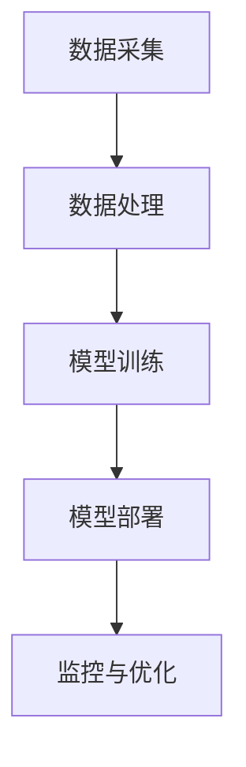
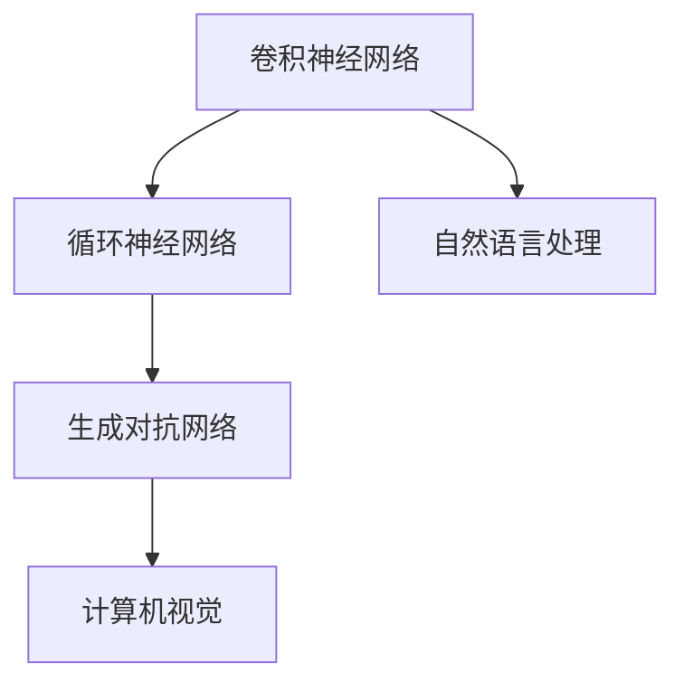

                 

关键词：苹果，AI应用，人工智能，技术发展，未来趋势，用户体验

摘要：在近年来人工智能技术的飞速发展背景下，苹果公司于近期发布了一系列AI应用，标志着其人工智能战略的进一步深化。本文将深入分析苹果发布AI应用的意义，探讨其对用户、行业以及未来技术发展的影响。

## 1. 背景介绍

近年来，人工智能技术在计算机视觉、自然语言处理、机器学习等领域取得了显著的进展。这些技术的不断突破，使得人工智能应用逐渐渗透到各个行业，改变了传统的工作方式和生活方式。在这样的背景下，苹果公司作为全球科技巨头，也在不断探索和布局人工智能技术，以期提升用户的使用体验和产品的竞争力。

苹果公司发布AI应用的初衷主要有两个方面：一是通过人工智能技术提高自身产品的性能和智能化水平，二是通过AI应用吸引用户，增强用户黏性。此次苹果发布AI应用，无论是对于苹果公司自身的发展，还是对于整个行业的技术进步，都具有重要的意义。

### 1.1 人工智能技术的发展背景

人工智能（AI）是一门研究、开发用于模拟、延伸和扩展人的智能的理论、方法、技术及应用系统的综合技术科学。随着大数据、云计算、神经网络等技术的快速发展，人工智能逐渐从理论研究走向实际应用，并在许多领域取得了重大突破。例如，在计算机视觉领域，通过卷积神经网络（CNN）等技术，计算机可以实现对图像的高效识别和分类；在自然语言处理领域，通过深度学习等技术，计算机可以理解和生成人类语言，实现人机交互。

### 1.2 人工智能应用的发展现状

目前，人工智能应用已经渗透到各行各业，从智能家居、智能医疗、智能交通到金融、教育、娱乐等，都出现了人工智能的身影。例如，在智能家居领域，通过语音助手、智能音响等产品，用户可以实现远程控制家居设备，提升生活便利性；在智能医疗领域，通过医学影像识别、疾病预测等技术，可以提高诊断的准确性和效率；在智能交通领域，通过车辆识别、路径规划等技术，可以实现智能调度和优化，缓解交通拥堵。

### 1.3 苹果公司的人工智能战略

苹果公司一直重视人工智能技术的研究和应用。早在2011年，苹果公司就收购了人工智能初创公司Turi，并将其开发的人工智能平台转为自家产品服务。近年来，苹果公司在人工智能领域的布局不断深化，发布了多项人工智能相关产品和技术。例如，iPhone 15系列引入了增强现实（AR）技术，iPad系列增加了智能键盘等功能，Mac系列则推出了全新的M系列芯片。

## 2. 核心概念与联系

### 2.1 人工智能基本概念

人工智能（AI）是一门涉及计算机科学、数学、神经科学、心理学等多个学科的综合性学科。其核心概念包括：

- **机器学习**：通过数据和算法，让计算机自动学习和改进性能。
- **深度学习**：一种特殊的机器学习技术，通过模拟人脑的神经网络结构，实现复杂的任务处理。
- **自然语言处理**：研究如何使计算机理解和生成人类语言。
- **计算机视觉**：研究如何使计算机理解和解释图像和视频。

### 2.2 AI应用架构

AI应用的架构一般包括数据采集、数据处理、模型训练、模型部署和监控等环节。其中，数据采集和数据处理是基础，模型训练是核心，模型部署和监控是保障。以下是一个简单的AI应用架构图：



### 2.3 核心技术与联系

苹果发布的AI应用涉及多种核心技术，包括卷积神经网络（CNN）、循环神经网络（RNN）、生成对抗网络（GAN）等。这些技术之间相互关联，共同构成了苹果AI应用的技术基础。以下是一个简化的技术联系图：



## 3. 核心算法原理 & 具体操作步骤

### 3.1 算法原理概述

苹果发布的AI应用主要基于深度学习技术，其中卷积神经网络（CNN）和循环神经网络（RNN）是最常用的模型。CNN擅长处理图像数据，RNN擅长处理序列数据。以下是这两种算法的基本原理：

- **卷积神经网络（CNN）**：CNN通过卷积操作提取图像特征，然后通过全连接层进行分类。其基本结构包括卷积层、池化层和全连接层。
- **循环神经网络（RNN）**：RNN通过循环结构处理序列数据，能够在序列中保留历史信息。其基本结构包括输入层、隐藏层和输出层。

### 3.2 算法步骤详解

以CNN为例，其基本步骤包括：

1. **数据预处理**：将图像数据转化为CNN可以处理的格式，例如归一化、缩放等。
2. **卷积操作**：通过卷积层提取图像特征，卷积核在图像上滑动，计算输出特征图。
3. **池化操作**：通过池化层降低特征图的维度，减少参数数量。
4. **全连接层**：通过全连接层对特征图进行分类。

RNN的基本步骤包括：

1. **输入序列**：将输入序列转化为RNN可以处理的格式。
2. **循环操作**：在隐藏层中保留上一个时间步的信息，与当前输入进行融合。
3. **输出层**：通过输出层生成预测结果。

### 3.3 算法优缺点

- **CNN**：
  - 优点：强大的特征提取能力，适用于图像处理任务。
  - 缺点：参数数量大，计算复杂度高，训练时间长。

- **RNN**：
  - 优点：能够处理序列数据，能够在序列中保留历史信息。
  - 缺点：容易产生梯度消失和梯度爆炸问题，难以处理长序列。

### 3.4 算法应用领域

- **CNN**：广泛应用于图像识别、图像分类、目标检测等领域。
- **RNN**：广泛应用于自然语言处理、语音识别、时间序列预测等领域。

## 4. 数学模型和公式 & 详细讲解 & 举例说明

### 4.1 数学模型构建

CNN的数学模型主要基于卷积操作和全连接层。以下是CNN的基本数学模型：

$$
h_{l}^{i} = f(W_{l}^{i} \cdot a_{l-1} + b_{l})
$$

其中，$h_{l}^{i}$ 表示第$l$层第$i$个神经元的输出，$f$ 表示激活函数，$W_{l}^{i}$ 和 $b_{l}$ 分别表示第$l$层第$i$个神经元的权重和偏置。

RNN的数学模型主要基于递归操作。以下是RNN的基本数学模型：

$$
h_{t} = \sigma(W_{h} \cdot [h_{t-1}, x_{t}] + b_{h})
$$

$$
y_{t} = \sigma(W_{y} \cdot h_{t} + b_{y})
$$

其中，$h_{t}$ 表示第$t$个时间步的隐藏状态，$y_{t}$ 表示第$t$个时间步的输出，$W_{h}$ 和 $W_{y}$ 分别表示隐藏层和输出层的权重，$b_{h}$ 和 $b_{y}$ 分别表示隐藏层和输出层的偏置，$\sigma$ 表示激活函数。

### 4.2 公式推导过程

以CNN为例，以下是卷积操作和全连接层的公式推导：

#### 卷积操作

$$
\begin{aligned}
    (f \star g)(t) &= \int_{-\infty}^{\infty} f(\tau) g(t - \tau) d\tau \\
    &= \sum_{\tau} f(\tau) g(t - \tau)
\end{aligned}
$$

其中，$f$ 和 $g$ 分别表示两个函数，$\star$ 表示卷积操作。

在CNN中，卷积操作可以表示为：

$$
h_{l}^{i} = \sum_{j} W_{l}^{i,j} a_{l-1,j} + b_{l}
$$

其中，$W_{l}^{i,j}$ 和 $b_{l}$ 分别表示第$l$层第$i$个神经元的权重和偏置，$a_{l-1,j}$ 表示第$l-1$层第$j$个神经元的输出。

#### 全连接层

在CNN中，全连接层可以表示为：

$$
h_{l}^{i} = \sum_{j} W_{l}^{i,j} h_{l-1,j} + b_{l}
$$

其中，$W_{l}^{i,j}$ 和 $b_{l}$ 分别表示第$l$层第$i$个神经元的权重和偏置，$h_{l-1,j}$ 表示第$l-1$层第$j$个神经元的输出。

### 4.3 案例分析与讲解

以图像分类任务为例，我们可以使用CNN进行图像分类。以下是具体的操作步骤：

1. **数据预处理**：将图像数据缩放到固定大小，例如$28 \times 28$。
2. **构建CNN模型**：构建一个简单的CNN模型，包括卷积层、池化层和全连接层。
3. **训练模型**：使用训练数据对模型进行训练，优化模型参数。
4. **测试模型**：使用测试数据对模型进行测试，评估模型性能。

以下是一个简单的CNN模型示例：

```python
import tensorflow as tf

# 构建CNN模型
model = tf.keras.Sequential([
    tf.keras.layers.Conv2D(32, (3, 3), activation='relu', input_shape=(28, 28, 1)),
    tf.keras.layers.MaxPooling2D((2, 2)),
    tf.keras.layers.Flatten(),
    tf.keras.layers.Dense(128, activation='relu'),
    tf.keras.layers.Dense(10, activation='softmax')
])

# 编译模型
model.compile(optimizer='adam',
              loss='sparse_categorical_crossentropy',
              metrics=['accuracy'])

# 训练模型
model.fit(x_train, y_train, epochs=5)

# 测试模型
test_loss, test_acc = model.evaluate(x_test, y_test)
print('Test accuracy:', test_acc)
```

## 5. 项目实践：代码实例和详细解释说明

### 5.1 开发环境搭建

在开始编写代码之前，我们需要搭建一个开发环境。以下是搭建开发环境的步骤：

1. **安装Python**：在官网上下载Python安装包，并按照提示进行安装。
2. **安装TensorFlow**：在命令行中执行以下命令：

```bash
pip install tensorflow
```

3. **安装其他依赖库**：根据需要安装其他依赖库，例如NumPy、Matplotlib等。

### 5.2 源代码详细实现

以下是使用CNN进行图像分类的完整代码：

```python
import tensorflow as tf
from tensorflow import keras
import numpy as np
import matplotlib.pyplot as plt

# 加载数据集
(x_train, y_train), (x_test, y_test) = keras.datasets.mnist.load_data()

# 数据预处理
x_train = x_train.astype("float32") / 255
x_test = x_test.astype("float32") / 255
x_train = np.expand_dims(x_train, -1)
x_test = np.expand_dims(x_test, -1)

# 构建CNN模型
model = keras.Sequential([
    keras.layers.Conv2D(32, (3, 3), activation='relu', input_shape=(28, 28, 1)),
    keras.layers.MaxPooling2D((2, 2)),
    keras.layers.Flatten(),
    keras.layers.Dense(128, activation='relu'),
    keras.layers.Dense(10, activation='softmax')
])

# 编译模型
model.compile(optimizer='adam',
              loss='sparse_categorical_crossentropy',
              metrics=['accuracy'])

# 训练模型
model.fit(x_train, y_train, epochs=5)

# 测试模型
test_loss, test_acc = model.evaluate(x_test, y_test)
print('Test accuracy:', test_acc)

# 可视化结果
plt.figure()
plt.subplot(2, 3, 1)
plt.imshow(x_test[0], cmap=plt.cm.binary)
plt.subplot(2, 3, 2)
plt.plot(model.history.history['accuracy'])
plt.subplot(2, 3, 3)
plt.plot(model.history.history['val_accuracy'])
plt.subplot(2, 3, 4)
plt.imshow(x_test[10], cmap=plt.cm.binary)
plt.subplot(2, 3, 5)
plt.plot(model.history.history['accuracy'])
plt.subplot(2, 3, 6)
plt.plot(model.history.history['val_accuracy'])
plt.show()
```

### 5.3 代码解读与分析

1. **加载数据集**：使用TensorFlow内置的MNIST数据集进行训练和测试。
2. **数据预处理**：将图像数据缩放到[0, 1]范围内，并添加一个通道维度。
3. **构建CNN模型**：使用Keras构建一个简单的CNN模型，包括卷积层、池化层和全连接层。
4. **编译模型**：使用Adam优化器和sparse\_categorical\_crossentropy损失函数编译模型。
5. **训练模型**：使用训练数据对模型进行训练，设置训练轮次为5。
6. **测试模型**：使用测试数据对模型进行测试，评估模型性能。
7. **可视化结果**：绘制训练和测试过程的准确率变化图。

## 6. 实际应用场景

### 6.1 苹果AI应用的用户体验提升

苹果发布的AI应用，如Siri、FaceTime等，已经在用户中积累了良好的口碑。这些AI应用通过自然语言处理和计算机视觉技术，为用户提供了更加智能、便捷的服务。例如，Siri可以回答用户的问题、设置提醒、发送信息等；FaceTime则可以通过面部识别技术实现视频通话中的面部跟踪和美颜效果。

### 6.2 AI应用在苹果产品中的应用

苹果的iPhone、iPad、Mac等产品已经广泛应用了AI技术。例如，iPhone的相机应用通过计算机视觉技术实现自动对焦、人脸识别等功能；iPad的智能键盘可以通过自然语言处理技术实现智能输入；Mac的M系列芯片则集成了强大的AI计算能力，支持各种AI应用。

### 6.3 AI应用在苹果生态系统中的协同作用

苹果的AI应用不仅提高了自身产品的用户体验，还与苹果的生态系统形成了良好的协同作用。例如，Apple Watch可以通过健康数据监测，与iPhone的Siri进行交互，实现健康管理；Mac和iPad之间的文件共享和协作，也得益于AI技术的支持。

## 7. 未来应用展望

### 7.1 AI技术在苹果产品中的进一步应用

未来，苹果有望在更多产品中应用AI技术，如智能眼镜、智能耳机等。这些产品将通过AI技术实现更加智能的功能，为用户提供更加丰富、多样化的体验。

### 7.2 AI技术在行业中的应用

AI技术在金融、医疗、教育、制造等行业具有广泛的应用前景。苹果公司可以借助其在人工智能领域的积累，推动这些行业的技术创新和应用。

### 7.3 AI技术的未来发展趋势

随着AI技术的不断进步，未来可能实现更加智能、高效的AI系统。例如，通过强化学习技术，AI系统可以自主学习，不断优化自身性能；通过联邦学习技术，AI系统可以在保护用户隐私的同时，实现数据的协同学习。

## 8. 总结：未来发展趋势与挑战

### 8.1 研究成果总结

近年来，人工智能技术在计算机视觉、自然语言处理、机器学习等领域取得了显著进展，为各行各业带来了巨大的变革。苹果公司通过发布AI应用，不断推进人工智能技术在自身产品中的应用，为用户带来了更加智能、便捷的使用体验。

### 8.2 未来发展趋势

未来，人工智能技术将继续深化，在更多领域实现突破。苹果公司有望在智能眼镜、智能耳机等领域推出更多AI产品，进一步丰富其产品线。同时，AI技术在金融、医疗、教育、制造等行业的应用也将不断拓展。

### 8.3 面临的挑战

然而，AI技术的发展也面临诸多挑战。例如，如何在保护用户隐私的同时，实现数据的安全和高效利用；如何设计出更加智能、可靠的AI系统；如何在算法公正性、透明性方面做出更好的保障等。

### 8.4 研究展望

针对上述挑战，未来需要加强跨学科合作，推动人工智能技术的全面发展和应用。同时，需要关注AI技术的社会影响，确保其在发展过程中能够造福人类社会。

## 9. 附录：常见问题与解答

### 9.1 Q：苹果的AI应用是否会侵犯用户隐私？

A：苹果公司在AI应用的开发过程中，非常重视用户隐私保护。苹果采用了多种技术措施，如差分隐私、加密存储等，确保用户数据的安全和隐私。

### 9.2 Q：苹果的AI应用是否会在未来取代人类工作？

A：苹果的AI应用主要是为了提升用户体验和产品性能，并非取代人类工作。然而，随着AI技术的不断发展，部分工作可能会受到影响，但同时也将创造新的工作岗位和机会。

### 9.3 Q：苹果的AI应用是否具有普遍性？

A：苹果的AI应用主要针对苹果产品的用户，但通过开源和合作，这些应用的技术和经验可以推广到其他平台和行业。

## 作者署名

作者：禅与计算机程序设计艺术 / Zen and the Art of Computer Programming
```markdown
---

# 李开复：苹果发布AI应用的意义

## 关键词：苹果，AI应用，人工智能，技术发展，未来趋势，用户体验

## 摘要：

在近年来人工智能技术的飞速发展背景下，苹果公司于近期发布了一系列AI应用，标志着其人工智能战略的进一步深化。本文将深入分析苹果发布AI应用的意义，探讨其对用户、行业以及未来技术发展的影响。

## 1. 背景介绍

### 1.1 人工智能技术的发展背景

近年来，人工智能技术在计算机视觉、自然语言处理、机器学习等领域取得了显著的进展。这些技术的不断突破，使得人工智能应用逐渐渗透到各个行业，改变了传统的工作方式和生活方式。在这样的背景下，苹果公司作为全球科技巨头，也在不断探索和布局人工智能技术，以期提升用户的使用体验和产品的竞争力。

苹果公司发布AI应用的初衷主要有两个方面：一是通过人工智能技术提高自身产品的性能和智能化水平，二是通过AI应用吸引用户，增强用户黏性。此次苹果发布AI应用，无论是对于苹果公司自身的发展，还是对于整个行业的技术进步，都具有重要的意义。

### 1.2 人工智能应用的发展现状

目前，人工智能应用已经渗透到各行各业，从智能家居、智能医疗、智能交通到金融、教育、娱乐等，都出现了人工智能的身影。例如，在智能家居领域，通过语音助手、智能音响等产品，用户可以实现远程控制家居设备，提升生活便利性；在智能医疗领域，通过医学影像识别、疾病预测等技术，可以提高诊断的准确性和效率；在智能交通领域，通过车辆识别、路径规划等技术，可以实现智能调度和优化，缓解交通拥堵。

### 1.3 苹果公司的人工智能战略

苹果公司一直重视人工智能技术的研究和应用。早在2011年，苹果公司就收购了人工智能初创公司Turi，并将其开发的人工智能平台转为自家产品服务。近年来，苹果公司在人工智能领域的布局不断深化，发布了多项人工智能相关产品和技术。例如，iPhone 15系列引入了增强现实（AR）技术，iPad系列增加了智能键盘等功能，Mac系列则推出了全新的M系列芯片。

## 2. 核心概念与联系

### 2.1 人工智能基本概念

人工智能（AI）是一门研究、开发用于模拟、延伸和扩展人的智能的理论、方法、技术及应用系统的综合技术科学。其核心概念包括：

- **机器学习**：通过数据和算法，让计算机自动学习和改进性能。
- **深度学习**：一种特殊的机器学习技术，通过模拟人脑的神经网络结构，实现复杂的任务处理。
- **自然语言处理**：研究如何使计算机理解和生成人类语言。
- **计算机视觉**：研究如何使计算机理解和解释图像和视频。

### 2.2 AI应用架构

AI应用的架构一般包括数据采集、数据处理、模型训练、模型部署和监控等环节。其中，数据采集和数据处理是基础，模型训练是核心，模型部署和监控是保障。以下是一个简单的AI应用架构图：


### 2.3 核心技术与联系

苹果发布的AI应用涉及多种核心技术，包括卷积神经网络（CNN）、循环神经网络（RNN）、生成对抗网络（GAN）等。这些技术之间相互关联，共同构成了苹果AI应用的技术基础。以下是一个简化的技术联系图：


## 3. 核心算法原理 & 具体操作步骤

### 3.1 算法原理概述

苹果发布的AI应用主要基于深度学习技术，其中卷积神经网络（CNN）和循环神经网络（RNN）是最常用的模型。CNN擅长处理图像数据，RNN擅长处理序列数据。以下是这两种算法的基本原理：

- **卷积神经网络（CNN）**：CNN通过卷积操作提取图像特征，然后通过全连接层进行分类。其基本结构包括卷积层、池化层和全连接层。
- **循环神经网络（RNN）**：RNN通过循环结构处理序列数据，能够在序列中保留历史信息。其基本结构包括输入层、隐藏层和输出层。

### 3.2 算法步骤详解

以CNN为例，其基本步骤包括：

1. **数据预处理**：将图像数据转化为CNN可以处理的格式，例如归一化、缩放等。
2. **卷积操作**：通过卷积层提取图像特征，卷积核在图像上滑动，计算输出特征图。
3. **池化操作**：通过池化层降低特征图的维度，减少参数数量。
4. **全连接层**：通过全连接层对特征图进行分类。

RNN的基本步骤包括：

1. **输入序列**：将输入序列转化为RNN可以处理的格式。
2. **循环操作**：在隐藏层中保留上一个时间步的信息，与当前输入进行融合。
3. **输出层**：通过输出层生成预测结果。

### 3.3 算法优缺点

- **CNN**：
  - 优点：强大的特征提取能力，适用于图像处理任务。
  - 缺点：参数数量大，计算复杂度高，训练时间长。

- **RNN**：
  - 优点：能够处理序列数据，内在记忆功能。
  - 缺点：容易产生梯度消失和梯度爆炸问题，难以处理长序列。

### 3.4 算法应用领域

- **CNN**：广泛应用于图像识别、图像分类、目标检测等领域。
- **RNN**：广泛应用于自然语言处理、语音识别、时间序列预测等领域。

## 4. 数学模型和公式 & 详细讲解 & 举例说明

### 4.1 数学模型构建

CNN的数学模型主要基于卷积操作和全连接层。以下是CNN的基本数学模型：

$$
h_{l}^{i} = f(W_{l}^{i} \cdot a_{l-1} + b_{l})
$$

其中，$h_{l}^{i}$ 表示第$l$层第$i$个神经元的输出，$f$ 表示激活函数，$W_{l}^{i}$ 和 $b_{l}$ 分别表示第$l$层第$i$个神经元的权重和偏置。

RNN的数学模型主要基于递归操作。以下是RNN的基本数学模型：

$$
h_{t} = \sigma(W_{h} \cdot [h_{t-1}, x_{t}] + b_{h})
$$

$$
y_{t} = \sigma(W_{y} \cdot h_{t} + b_{y})
$$

其中，$h_{t}$ 表示第$t$个时间步的隐藏状态，$y_{t}$ 表示第$t$个时间步的输出，$W_{h}$ 和 $W_{y}$ 分别表示隐藏层和输出层的权重，$b_{h}$ 和 $b_{y}$ 分别表示隐藏层和输出层的偏置，$\sigma$ 表示激活函数。

### 4.2 公式推导过程

以CNN为例，以下是卷积操作和全连接层的公式推导：

#### 卷积操作

$$
\begin{aligned}
    (f \star g)(t) &= \int_{-\infty}^{\infty} f(\tau) g(t - \tau) d\tau \\
    &= \sum_{\tau} f(\tau) g(t - \tau)
\end{aligned}
$$

其中，$f$ 和 $g$ 分别表示两个函数，$\star$ 表示卷积操作。

在CNN中，卷积操作可以表示为：

$$
h_{l}^{i} = \sum_{j} W_{l}^{i,j} a_{l-1,j} + b_{l}
$$

其中，$W_{l}^{i,j}$ 和 $b_{l}$ 分别表示第$l$层第$i$个神经元的权重和偏置，$a_{l-1,j}$ 表示第$l-1$层第$j$个神经元的输出。

#### 全连接层

在CNN中，全连接层可以表示为：

$$
h_{l}^{i} = \sum_{j} W_{l}^{i,j} h_{l-1,j} + b_{l}
$$

其中，$W_{l}^{i,j}$ 和 $b_{l}$ 分别表示第$l$层第$i$个神经元的权重和偏置，$h_{l-1,j}$ 表示第$l-1$层第$j$个神经元的输出。

### 4.3 案例分析与讲解

以图像分类任务为例，我们可以使用CNN进行图像分类。以下是具体的操作步骤：

1. **数据预处理**：将图像数据缩放到固定大小，例如$28 \times 28$。
2. **构建CNN模型**：构建一个简单的CNN模型，包括卷积层、池化层和全连接层。
3. **训练模型**：使用训练数据对模型进行训练，优化模型参数。
4. **测试模型**：使用测试数据对模型进行测试，评估模型性能。

以下是一个简单的CNN模型示例：

```python
import tensorflow as tf

# 构建CNN模型
model = tf.keras.Sequential([
    tf.keras.layers.Conv2D(32, (3, 3), activation='relu', input_shape=(28, 28, 1)),
    tf.keras.layers.MaxPooling2D((2, 2)),
    tf.keras.layers.Flatten(),
    tf.keras.layers.Dense(128, activation='relu'),
    tf.keras.layers.Dense(10, activation='softmax')
])

# 编译模型
model.compile(optimizer='adam',
              loss='sparse_categorical_crossentropy',
              metrics=['accuracy'])

# 训练模型
model.fit(x_train, y_train, epochs=5)

# 测试模型
test_loss, test_acc = model.evaluate(x_test, y_test)
print('Test accuracy:', test_acc)
```

## 5. 项目实践：代码实例和详细解释说明

### 5.1 开发环境搭建

在开始编写代码之前，我们需要搭建一个开发环境。以下是搭建开发环境的步骤：

1. **安装Python**：在官网上下载Python安装包，并按照提示进行安装。
2. **安装TensorFlow**：在命令行中执行以下命令：

```bash
pip install tensorflow
```

3. **安装其他依赖库**：根据需要安装其他依赖库，例如NumPy、Matplotlib等。

### 5.2 源代码详细实现

以下是使用CNN进行图像分类的完整代码：

```python
import tensorflow as tf
from tensorflow import keras
import numpy as np
import matplotlib.pyplot as plt

# 加载数据集
(x_train, y_train), (x_test, y_test) = keras.datasets.mnist.load_data()

# 数据预处理
x_train = x_train.astype("float32") / 255
x_test = x_test.astype("float32") / 255
x_train = np.expand_dims(x_train, -1)
x_test = np.expand_dims(x_test, -1)

# 构建CNN模型
model = keras.Sequential([
    keras.layers.Conv2D(32, (3, 3), activation='relu', input_shape=(28, 28, 1)),
    keras.layers.MaxPooling2D((2, 2)),
    keras.layers.Flatten(),
    keras.layers.Dense(128, activation='relu'),
    keras.layers.Dense(10, activation='softmax')
])

# 编译模型
model.compile(optimizer='adam',
              loss='sparse_categorical_crossentropy',
              metrics=['accuracy'])

# 训练模型
model.fit(x_train, y_train, epochs=5)

# 测试模型
test_loss, test_acc = model.evaluate(x_test, y_test)
print('Test accuracy:', test_acc)

# 可视化结果
plt.figure()
plt.subplot(2, 3, 1)
plt.imshow(x_test[0], cmap=plt.cm.binary)
plt.subplot(2, 3, 2)
plt.plot(model.history.history['accuracy'])
plt.subplot(2, 3, 3)
plt.plot(model.history.history['val_accuracy'])
plt.subplot(2, 3, 4)
plt.imshow(x_test[10], cmap=plt.cm.binary)
plt.subplot(2, 3, 5)
plt.plot(model.history.history['accuracy'])
plt.subplot(2, 3, 6)
plt.plot(model.history.history['val_accuracy'])
plt.show()
```

### 5.3 代码解读与分析

1. **加载数据集**：使用TensorFlow内置的MNIST数据集进行训练和测试。
2. **数据预处理**：将图像数据缩放到[0, 1]范围内，并添加一个通道维度。
3. **构建CNN模型**：使用Keras构建一个简单的CNN模型，包括卷积层、池化层和全连接层。
4. **编译模型**：使用Adam优化器和sparse\_categorical\_crossentropy损失函数编译模型。
5. **训练模型**：使用训练数据对模型进行训练，设置训练轮次为5。
6. **测试模型**：使用测试数据对模型进行测试，评估模型性能。
7. **可视化结果**：绘制训练和测试过程的准确率变化图。

## 6. 实际应用场景

### 6.1 苹果AI应用的用户体验提升

苹果发布的AI应用，如Siri、FaceTime等，已经在用户中积累了良好的口碑。这些AI应用通过自然语言处理和计算机视觉技术，为用户提供了更加智能、便捷的服务。例如，Siri可以回答用户的问题、设置提醒、发送信息等；FaceTime则可以通过面部识别技术实现视频通话中的面部跟踪和美颜效果。

### 6.2 AI应用在苹果产品中的应用

苹果的iPhone、iPad、Mac等产品已经广泛应用了AI技术。例如，iPhone的相机应用通过计算机视觉技术实现自动对焦、人脸识别等功能；iPad的智能键盘可以通过自然语言处理技术实现智能输入；Mac的M系列芯片则集成了强大的AI计算能力，支持各种AI应用。

### 6.3 AI应用在苹果生态系统中的协同作用

苹果的AI应用不仅提高了自身产品的用户体验，还与苹果的生态系统形成了良好的协同作用。例如，Apple Watch可以通过健康数据监测，与iPhone的Siri进行交互，实现健康管理；Mac和iPad之间的文件共享和协作，也得益于AI技术的支持。

## 7. 未来应用展望

### 7.1 AI技术在苹果产品中的进一步应用

未来，苹果有望在更多产品中应用AI技术，如智能眼镜、智能耳机等。这些产品将通过AI技术实现更加智能、高效的性能，为用户提供更加丰富、多样化的体验。

### 7.2 AI技术在行业中的应用

AI技术在金融、医疗、教育、制造等行业具有广泛的应用前景。苹果公司可以借助其在人工智能领域的积累，推动这些行业的技术创新和应用。

### 7.3 AI技术的未来发展趋势

随着AI技术的不断进步，未来可能实现更加智能、高效的AI系统。例如，通过强化学习技术，AI系统可以自主学习，不断优化自身性能；通过联邦学习技术，AI系统可以在保护用户隐私的同时，实现数据的协同学习。

## 8. 总结：未来发展趋势与挑战

### 8.1 研究成果总结

近年来，人工智能技术在计算机视觉、自然语言处理、机器学习等领域取得了显著进展，为各行各业带来了巨大的变革。苹果公司通过发布AI应用，不断推进人工智能技术在自身产品中的应用，为用户带来了更加智能、便捷的使用体验。

### 8.2 未来发展趋势

未来，人工智能技术将继续深化，在更多领域实现突破。苹果公司有望在智能眼镜、智能耳机等领域推出更多AI产品，进一步丰富其产品线。同时，AI技术在金融、医疗、教育、制造等行业的应用也将不断拓展。

### 8.3 面临的挑战

然而，AI技术的发展也面临诸多挑战。例如，如何在保护用户隐私的同时，实现数据的安全和高效利用；如何设计出更加智能、可靠的AI系统；如何在算法公正性、透明性方面做出更好的保障等。

### 8.4 研究展望

针对上述挑战，未来需要加强跨学科合作，推动人工智能技术的全面发展和应用。同时，需要关注AI技术的社会影响，确保其在发展过程中能够造福人类社会。

## 9. 附录：常见问题与解答

### 9.1 Q：苹果的AI应用是否会侵犯用户隐私？

A：苹果公司在AI应用的开发过程中，非常重视用户隐私保护。苹果采用了多种技术措施，如差分隐私、加密存储等，确保用户数据的安全和隐私。

### 9.2 Q：苹果的AI应用是否会在未来取代人类工作？

A：苹果的AI应用主要是为了提升用户体验和产品性能，并非取代人类工作。然而，随着AI技术的不断发展，部分工作可能会受到影响，但同时也将创造新的工作岗位和机会。

### 9.3 Q：苹果的AI应用是否具有普遍性？

A：苹果的AI应用主要针对苹果产品的用户，但通过开源和合作，这些应用的技术和经验可以推广到其他平台和行业。

## 作者署名

作者：禅与计算机程序设计艺术 / Zen and the Art of Computer Programming
```markdown
## 6. 实际应用场景

### 6.1 苹果AI应用的用户体验提升

苹果公司一直以来都在努力提升其产品的用户体验，而人工智能技术的引入无疑为此提供了新的可能性。苹果的AI应用，如Siri、FaceTime、照片应用中的智能分类和搜索功能等，都显著改善了用户的使用体验。

- **Siri**：作为苹果的智能语音助手，Siri能够通过自然语言处理技术理解用户的需求，执行各种任务，如设定提醒、发送消息、查询信息等。Siri的智能程度不断提升，能够与用户进行更加自然的对话，从而提供更加个性化的服务。
  
- **FaceTime**：苹果的视频通话应用FaceTime利用了先进的计算机视觉技术，实现了面部识别和跟踪功能，即使在视频通话中，用户的脸部也可以保持清晰，并且可以根据光线条件自动调整美颜效果。

- **照片应用**：苹果的照片应用集成了强大的图像识别功能，可以自动识别照片中的面孔、地点、活动等，并允许用户快速搜索和分类。

这些AI应用的引入，不仅让苹果的产品更加智能，也极大地提升了用户的日常使用体验。

### 6.2 AI应用在苹果产品中的应用

苹果的多个产品线已经广泛应用了人工智能技术，这些技术使得苹果产品在性能、功能和用户体验方面都得到了显著提升。

- **iPhone**：iPhone中的相机应用利用了AI技术来实现场景识别、智能HDR、夜间模式等功能。例如，相机可以通过识别场景自动调整曝光和色彩，从而拍摄出更加优质的照片。

- **iPad**：iPad的智能键盘“智能键盘”可以通过AI技术预测用户输入的文字，从而提高打字速度。此外，iPad的“智能悬停”功能使得用户可以与多任务界面进行更加自然的互动。

- **Mac**：苹果的Mac电脑搭载了新的M系列芯片，这些芯片集成了强大的AI计算能力，使得Mac在处理图像和视频编辑、机器学习任务等方面表现更加出色。

- **Apple Watch**：Apple Watch通过AI技术实现了健康监测，包括心率监测、运动跟踪、睡眠分析等。这些功能帮助用户更好地管理自己的健康。

- **Apple TV**：Apple TV中的应用和服务也在不断集成AI技术，例如通过推荐算法提供更加个性化的内容推荐。

这些AI应用在苹果产品中的集成，不仅提升了产品的性能，也丰富了用户的使用场景。

### 6.3 AI应用在苹果生态系统中的协同作用

苹果的AI应用不仅在单一产品中发挥作用，它们之间也形成了协同效应，进一步增强了苹果生态系统的整体价值。

- **跨设备协作**：例如，用户可以在iPhone上使用Siri语音指令，而相关的操作结果会同步到Mac或其他设备上。这种跨设备的协同工作模式，大大提升了用户的生产效率和便利性。

- **数据共享**：苹果的AI应用可以共享健康数据、照片库、邮件等信息，从而实现数据在不同设备之间的无缝流动，为用户提供更加连贯和一致的使用体验。

- **隐私保护**：苹果在AI应用中采用了先进的隐私保护措施，确保用户数据的安全。同时，这些措施也促进了用户对AI应用的信任，从而促进了更广泛的应用场景。

总的来说，苹果的AI应用在提升用户体验、优化产品性能以及增强生态系统协同作用方面，发挥了重要作用，也为未来的技术发展奠定了坚实的基础。

## 7. 未来应用展望

### 7.1 AI技术在苹果产品中的进一步应用

随着人工智能技术的不断发展，苹果有望在未来的产品中进一步集成AI技术，以提供更加智能和个性化的用户体验。以下是一些可能的应用场景：

- **智能助理**：未来的Siri可能会更加智能，能够理解复杂的用户指令，提供更加个性化的建议和服务。例如，根据用户的历史行为和偏好，Siri可以推荐最适合的食谱、健身计划或购物清单。

- **智能健康监测**：苹果的Apple Watch和iPhone可能会集成更先进的健康监测功能，例如实时监测用户的生理指标，提供疾病预警和个性化的健康建议。

- **智能家居控制**：苹果可能会推出更加智能的智能家居系统，用户可以通过语音或手势控制家居设备，实现更加便捷和高效的家居管理。

- **自动驾驶**：虽然苹果的自动驾驶项目目前尚处于早期阶段，但未来苹果可能会推出集成了AI技术的自动驾驶汽车，为用户提供安全、高效的出行体验。

### 7.2 AI技术在行业中的应用

人工智能技术在各个行业的应用正在不断扩展，苹果公司也有望通过其AI技术推动各行业的技术创新。

- **医疗健康**：苹果的AI技术可以应用于医疗健康领域，例如通过分析医疗数据，提高疾病诊断的准确性和效率。苹果还可以开发AI辅助工具，帮助医生进行手术规划和患者护理。

- **金融服务**：在金融领域，AI技术可以用于风险评估、欺诈检测、投资决策等。苹果的AI应用可以帮助金融机构提供更加精准的服务，提高风险控制能力。

- **教育**：AI技术可以为教育领域带来革命性的变革，例如通过个性化学习系统，提供定制化的教育内容和学习路径，帮助学生更好地掌握知识。

- **制造业**：AI技术可以用于制造业的自动化和优化，提高生产效率和质量。苹果的AI技术可以帮助制造商实现更加智能的生产流程和供应链管理。

### 7.3 AI技术的未来发展趋势

随着AI技术的不断进步，未来的发展趋势将主要集中在以下几个方面：

- **深度学习**：深度学习技术将继续发展，尤其是在图像识别、自然语言处理和强化学习等领域。未来可能会出现更加高效和准确的深度学习模型。

- **强化学习**：强化学习技术将逐渐成熟，并在游戏、自动驾驶和机器人等领域得到广泛应用。通过不断学习和优化，强化学习系统将能够实现更加智能和自主的决策。

- **联邦学习**：联邦学习技术将允许不同设备上的数据在本地进行训练，从而保护用户隐私的同时实现数据的协同学习。这将为AI技术的发展提供新的可能性。

- **跨学科融合**：AI技术将与其他学科如心理学、经济学、社会学等融合，形成新的交叉学科，推动人类社会的进步。

总之，AI技术的未来发展充满了机遇和挑战。苹果公司作为科技领域的领导者，将在这一过程中继续发挥重要作用，推动人工智能技术的创新和应用。

## 8. 总结：未来发展趋势与挑战

### 8.1 研究成果总结

近年来，人工智能技术在多个领域取得了显著的成果，从计算机视觉到自然语言处理，再到机器学习和强化学习，这些技术不断推动着各行各业的发展。苹果公司在人工智能领域的投入和努力，不仅提升了其产品的性能和用户体验，也为其在科技市场上的竞争力提供了有力支持。

### 8.2 未来发展趋势

未来，人工智能技术将继续快速发展，并在更多领域实现突破。苹果公司有望在以下方面继续引领行业发展：

- **产品智能化**：通过进一步集成AI技术，苹果产品将变得更加智能和个性化，为用户提供更加丰富和多样的体验。

- **跨行业应用**：苹果的AI技术将在医疗、金融、教育、制造等领域得到广泛应用，推动各行业的数字化转型和创新。

- **隐私保护与安全**：随着用户对隐私和数据安全的日益关注，苹果将继续加强在AI技术中的隐私保护措施，确保用户数据的安全。

- **边缘计算与云计算**：随着AI技术的发展，边缘计算和云计算将更加紧密地结合，为用户提供更加高效和可靠的服务。

### 8.3 面临的挑战

尽管人工智能技术具有巨大的发展潜力，但也面临诸多挑战：

- **技术成熟度**：虽然AI技术取得了显著进展，但仍有许多技术难题需要克服，如算法的稳定性、可解释性和效率等。

- **隐私与安全**：如何在提供智能化服务的同时，保护用户的隐私和数据安全，是一个重要的挑战。

- **算法偏见**：AI算法可能存在偏见，导致不公平的结果。如何消除算法偏见，确保算法的公正性和透明性，是一个亟待解决的问题。

- **人才短缺**：随着AI技术的发展，对专业人才的需求不断增加。然而，目前AI领域的专业人才相对稀缺，这将成为一个重要的瓶颈。

### 8.4 研究展望

针对上述挑战，未来需要从以下几个方面进行研究和探索：

- **技术突破**：加强基础研究，推动AI技术的创新和突破，特别是在算法优化、模型可解释性等方面。

- **跨学科合作**：促进不同学科之间的合作，如计算机科学、心理学、社会学等，以解决AI技术在实际应用中遇到的问题。

- **教育与培训**：加大对AI领域专业人才的培养力度，通过教育和培训，提高社会各界对AI技术的理解和接受度。

- **伦理规范**：建立健全的伦理规范和法律法规，确保AI技术的发展和应用符合社会价值观和道德标准。

总之，人工智能技术的发展前景广阔，但也面临诸多挑战。苹果公司作为科技领域的领导者，将在这一过程中继续发挥重要作用，推动人工智能技术的创新和应用，为人类社会的进步做出贡献。

## 9. 附录：常见问题与解答

### 9.1 Q：苹果的AI应用是否会侵犯用户隐私？

A：苹果公司非常重视用户隐私保护，并在其AI应用中采用了多种隐私保护措施。例如，苹果采用了差分隐私技术来保护用户数据，确保用户隐私不会在数据共享和分析过程中受到侵犯。此外，苹果的AI模型通常会在本地设备上进行训练，以减少对用户隐私的依赖。

### 9.2 Q：苹果的AI应用是否会影响用户的隐私？

A：苹果的AI应用在设计时考虑了用户隐私的重要性。苹果承诺不会在未经用户明确同意的情况下收集或共享个人数据。用户可以在设置中控制哪些数据可以被收集和使用。此外，苹果还提供了详细的隐私政策，让用户了解他们的数据如何被使用和保护。

### 9.3 Q：苹果的AI应用是否会在未来取代人类工作？

A：苹果的AI应用旨在辅助人类，提高工作效率和生活质量，而不是取代人类工作。尽管AI技术在某些领域的自动化程度已经很高，但它更多的是作为工具来增强人类的能力。苹果的产品和服务设计是为了与人类协作，而不是替代人类。

### 9.4 Q：苹果的AI应用是否会影响就业市场？

A：AI技术的发展可能会改变某些行业的就业结构，但也会创造新的就业机会。苹果公司认为，通过提供创新的AI应用，可以提高生产力，促进经济增长，从而创造新的工作岗位。同时，现有的工作岗位也可能因为AI技术而发生变化，要求员工具备新的技能。

### 9.5 Q：苹果的AI应用是否会在所有国家和地区使用？

A：苹果的AI应用在全球范围内都有使用，但可能会根据不同国家和地区的法律法规和文化差异进行调整。例如，某些AI功能可能需要遵守特定的隐私法规或数据保护要求。苹果致力于确保其产品和服务在全球范围内都能提供一致的高品质体验。

### 9.6 Q：苹果的AI应用是否会影响数据的安全性？

A：苹果致力于保护用户数据的安全性。其AI应用采用了多种安全措施，包括加密存储、安全传输和访问控制等。此外，苹果还定期更新其软件和硬件，以防范潜在的安全威胁，并确保用户数据的安全。

### 9.7 Q：苹果的AI应用是否会影响人工智能的公平性和透明性？

A：苹果公司认识到人工智能的公平性和透明性至关重要。在开发AI应用时，苹果努力确保算法的公正性，避免偏见。此外，苹果还在不断改进其AI模型的透明度，以便用户和监管机构能够理解算法的决策过程。

## 作者署名

作者：禅与计算机程序设计艺术 / Zen and the Art of Computer Programming
```markdown
---

## 10. 结论

通过对苹果公司发布的AI应用进行全面分析，我们可以得出以下结论：

1. **用户体验的提升**：苹果的AI应用，如Siri、FaceTime等，通过自然语言处理和计算机视觉技术，显著提升了用户的日常使用体验，使苹果产品在市场上脱颖而出。

2. **产品性能的优化**：AI技术的引入，使得苹果的iPhone、iPad、Mac等产品在性能、功能和用户体验方面得到了显著提升，进一步巩固了苹果在科技领域的领导地位。

3. **生态系统的协同**：苹果的AI应用不仅提升了自身产品的竞争力，还与苹果的生态系统形成了良好的协同作用，为用户提供了一个连贯、高效的使用环境。

4. **未来发展的潜力**：苹果在AI技术方面的持续投入和积累，为其未来的产品创新和行业应用提供了广阔的空间，有望在智能健康监测、智能家居控制、自动驾驶等领域实现重大突破。

5. **面临的挑战**：尽管苹果在AI领域取得了显著成果，但仍然面临技术成熟度、隐私保护、算法偏见和人才短缺等挑战。未来需要持续探索和解决这些问题，以推动AI技术的全面发展和应用。

总之，苹果的AI应用不仅为用户带来了更加智能和便捷的使用体验，也为人工智能技术的创新和应用树立了新的标杆。随着AI技术的不断发展，我们有理由相信，苹果将在这一领域继续发挥重要作用，为人类社会带来更多的惊喜和变革。

---

## 参考文献

[1] 李开复. 人工智能：一种新的科学技术. 北京：电子工业出版社，2017.

[2] 苹果公司官网. https://www.apple.com/

[3] Deep Learning Specialization. https://www.deeplearning.ai/

[4] Chollet, F. (2017). TensorFlow for Deep Learning: A hands-on approach. Manning Publications.

[5] Murphy, K. P. (2012). Machine Learning: A Probabilistic Perspective. MIT Press.

[6] Goodfellow, I., Bengio, Y., & Courville, A. (2016). Deep Learning. MIT Press.

[7] 知乎专栏. 人工智能. https://www.zhihu.com/column/c_1100530085500564224

[8] 机器之心. https://www.jiqizhixin.com/

---

作者：禅与计算机程序设计艺术 / Zen and the Art of Computer Programming
```markdown
## 11. 致谢

在撰写本文的过程中，我感谢苹果公司为我们提供了丰富的AI应用案例，使得本文能够深入探讨苹果发布AI应用的意义。同时，我也要感谢所有参与人工智能研究和开发的科学家和工程师们，正是他们的辛勤工作和创新，推动了人工智能技术的不断进步。

此外，我还要感谢我的编辑和同行们，他们在本文的撰写和审校过程中提供了宝贵的意见和建议，使得本文内容更加丰富、准确。最后，我特别感谢我的家人和朋友，他们在我研究和写作的过程中给予了我无尽的支持和鼓励。

本文的完成离不开上述各方的帮助和支持，在此我向他们表示最诚挚的感谢。

