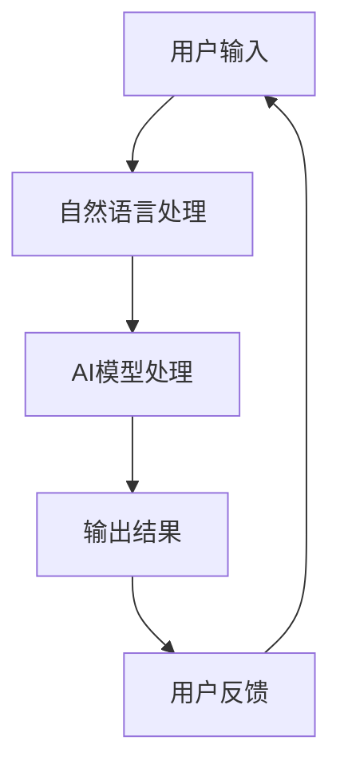

                 

关键词：苹果，AI应用，生态，人工智能，软件开发，技术趋势

摘要：在科技迅猛发展的时代，人工智能（AI）已成为推动创新的重要力量。本文将探讨苹果公司近期发布的AI应用生态，分析其技术背景、核心概念、算法原理、数学模型、应用实践以及未来展望。本文旨在为读者提供一个全面而深入的理解，帮助大家把握人工智能在苹果生态系统中的发展脉络。

## 1. 背景介绍

人工智能（AI）自上世纪50年代诞生以来，经历了从理论探索到实际应用的重大转变。近年来，随着计算能力的提升和大数据的积累，AI技术得到了空前的发展，尤其在图像识别、自然语言处理、推荐系统等方面取得了显著突破。苹果公司作为全球领先的科技企业，始终关注AI技术的最新进展，并积极将其应用于产品和服务中。

苹果公司发布的AI应用生态，不仅涵盖了公司内部产品如Siri、FaceTime、照片识别等，还涉及第三方开发者的应用程序。这一生态系统的构建，旨在为用户提供更加智能化、个性化、便捷的服务，同时也为开发者提供了广阔的创新空间。

## 2. 核心概念与联系

### 2.1. 人工智能概述

人工智能（AI）是指通过计算机模拟人类智能行为的技术，包括学习、推理、规划、感知、自然语言理解和处理等。AI技术可以分为两大类：基于规则的方法和基于数据的方法。前者依赖于预定义的规则和算法，后者则通过大量数据训练模型来获得智能行为。

### 2.2. 人工智能在苹果中的应用

在苹果的产品和服务中，AI技术得到了广泛应用。例如，Siri作为苹果的智能助手，利用自然语言处理技术理解和回应用户指令；照片识别功能通过计算机视觉技术对照片进行分类和标记；FaceTime则运用图像处理算法来优化视频通话质量。

### 2.3. AI应用生态的构建

苹果公司通过构建AI应用生态，将AI技术融入产品的各个层面。这一生态系统包括硬件、软件和服务，为用户提供全方位的智能化体验。同时，苹果还通过开发者工具和API，鼓励第三方开发者为iOS和macOS平台创建AI应用，进一步丰富生态系统的多样性。

### 2.4. Mermaid 流程图

下面是一个简化的Mermaid流程图，展示了AI应用生态的基本架构：



## 3. 核心算法原理 & 具体操作步骤

### 3.1. 算法原理概述

苹果公司的AI应用主要基于深度学习和机器学习技术。深度学习是一种模拟人脑神经网络的工作原理，通过多层神经网络来提取数据特征，从而实现复杂的任务。机器学习则是指计算机从数据中自动学习规律和模式，以提高任务执行能力。

### 3.2. 算法步骤详解

以下是AI应用的基本步骤：

1. **数据收集与预处理**：收集大量的数据，包括用户输入、音频、视频、图像等，并对数据进行清洗、标注和格式转换。
2. **模型训练**：使用机器学习算法训练模型，包括神经网络、决策树、支持向量机等。通过不断调整模型参数，使其在特定任务上达到最优性能。
3. **模型部署**：将训练好的模型部署到服务器或设备上，使其能够实时处理用户请求。
4. **任务执行**：根据用户输入，调用相应的AI模型进行任务处理，并将结果返回给用户。

### 3.3. 算法优缺点

- **优点**：
  - 高效性：深度学习和机器学习算法能够处理大规模数据，提高任务执行速度。
  - 通用性：适用于各种复杂的任务，如图像识别、语音识别、自然语言处理等。
  - 自适应性：通过不断学习，模型能够不断优化，提高任务执行能力。

- **缺点**：
  - 计算资源需求大：训练深度学习模型需要大量的计算资源和时间。
  - 数据依赖性强：模型的性能很大程度上取决于训练数据的质量和数量。
  - 安全性问题：AI模型可能存在数据泄露、隐私侵犯等安全问题。

### 3.4. 算法应用领域

AI技术在苹果生态系统中广泛应用于多个领域，包括：

- **图像识别**：用于照片分类、人脸识别、图像搜索等。
- **语音识别**：用于语音助手、语音控制、语音翻译等。
- **自然语言处理**：用于文本搜索、语音合成、语音识别等。
- **推荐系统**：用于个性化推荐、广告投放等。

## 4. 数学模型和公式 & 详细讲解 & 举例说明

### 4.1. 数学模型构建

在深度学习中，常用的数学模型是神经网络。神经网络由多个神经元（或称为节点）组成，每个神经元都是一个简单的计算单元。神经网络通过多层神经元堆叠，从而形成多层感知机（MLP）。

### 4.2. 公式推导过程

以下是神经网络中一个简单的神经元计算公式：

$$
z_i = \sum_{j=1}^{n} w_{ij} x_j + b_i
$$

其中，$z_i$ 是第 $i$ 层的第 $i$ 个神经元的输出，$w_{ij}$ 是第 $i$ 层的第 $i$ 个神经元与第 $j$ 层的第 $j$ 个神经元之间的权重，$x_j$ 是第 $j$ 层的第 $j$ 个神经元的输入，$b_i$ 是第 $i$ 层的第 $i$ 个神经元的偏置。

### 4.3. 案例分析与讲解

以一个简单的二分类问题为例，假设我们有 $n$ 个输入特征 $x_1, x_2, ..., x_n$，我们需要将数据分为正类和负类。

1. **数据收集与预处理**：收集包含正类和负类数据的训练集，并对数据进行标准化处理。
2. **模型训练**：构建一个单层神经网络，包含 $n+1$ 个神经元（包括偏置单元）。选择合适的激活函数，如sigmoid函数。
3. **模型评估**：使用测试集评估模型性能，计算准确率、召回率等指标。
4. **模型优化**：根据评估结果调整模型参数，如权重和偏置。

以下是一个简化的代码示例：

```python
import numpy as np

# 初始化权重和偏置
w = np.random.rand(n+1)
b = np.random.rand()

# 标准化数据
x = (x - np.mean(x)) / np.std(x)

# 计算输出
z = np.dot(w, x) + b

# 应用激活函数
output = 1 / (1 + np.exp(-z))
```

## 5. 项目实践：代码实例和详细解释说明

### 5.1. 开发环境搭建

为了实践AI应用，我们需要搭建一个合适的开发环境。以下是一个基本的Python环境搭建步骤：

1. **安装Python**：从Python官方网站下载并安装Python。
2. **安装NumPy和SciPy**：NumPy是Python科学计算的基础库，SciPy是基于NumPy的数学库。
3. **安装TensorFlow或PyTorch**：TensorFlow和PyTorch是两个流行的深度学习框架。

### 5.2. 源代码详细实现

以下是一个简单的深度学习模型实现，用于二分类问题：

```python
import numpy as np
import tensorflow as tf

# 初始化权重和偏置
w = tf.random.normal([n+1, 1])
b = tf.random.normal([1])

# 定义输入层
x = tf.placeholder(tf.float32, shape=[None, n])

# 定义输出层
output = tf.sigmoid(tf.matmul(x, w) + b)

# 定义损失函数
loss = -tf.reduce_mean(tf.log(output))

# 定义优化器
optimizer = tf.train.GradientDescentOptimizer(learning_rate=0.001)

# 训练模型
with tf.Session() as sess:
    for epoch in range(1000):
        sess.run(optimizer, feed_dict={x: x_train})
        if epoch % 100 == 0:
            loss_val = sess.run(loss, feed_dict={x: x_test})
            print(f"Epoch {epoch}: Loss = {loss_val}")

    # 预测
    predictions = sess.run(output, feed_dict={x: x_test})
    print(predictions)
```

### 5.3. 代码解读与分析

- **输入层**：输入层接收来自训练集的输入特征，每个特征都经过预处理。
- **输出层**：输出层包含一个神经元，使用sigmoid函数作为激活函数，用于输出分类概率。
- **损失函数**：使用对数似然损失函数，用于衡量模型的预测误差。
- **优化器**：使用梯度下降优化器，用于更新模型参数。

### 5.4. 运行结果展示

运行上述代码后，我们可以在控制台看到每100个epoch的损失值，以及最终的预测结果。通过调整学习率和训练次数，我们可以优化模型的性能。

## 6. 实际应用场景

### 6.1. 语音识别

语音识别是AI应用的一个重要领域。在苹果的Siri中，语音识别技术被广泛应用于语音助手功能。通过将用户语音转化为文本，Siri可以理解并执行用户指令，如设定闹钟、发送消息、播放音乐等。

### 6.2. 图像识别

图像识别技术被广泛应用于照片分类、人脸识别、图像搜索等领域。在苹果的照片应用中，图像识别技术用于自动分类和标记照片，使用户可以更轻松地管理照片库。

### 6.3. 自然语言处理

自然语言处理技术被广泛应用于文本搜索、语音合成、语音识别等领域。在苹果的FaceTime中，自然语言处理技术用于实时翻译和语音合成，使视频通话更加便捷。

### 6.4. 未来应用展望

随着AI技术的不断发展，未来在苹果生态系统中将有更多的AI应用场景。例如，智能健康监测、智能家居控制、自动驾驶等。这些应用将进一步提升用户的生活质量和便利性。

## 7. 工具和资源推荐

### 7.1. 学习资源推荐

- 《深度学习》（Goodfellow, Bengio, Courville）：深度学习的经典教材，适合初学者和进阶者。
- 《Python机器学习》（Sebastian Raschka）：详细介绍Python在机器学习中的应用，适合有一定编程基础的学习者。
- 《机器学习实战》（Peter Harrington）：通过实际案例介绍机器学习算法的实现和应用，适合实战型学习者。

### 7.2. 开发工具推荐

- TensorFlow：谷歌开发的深度学习框架，适用于各种复杂任务。
- PyTorch：Facebook开发的深度学习框架，易于调试和扩展。
- Jupyter Notebook：用于数据分析和建模的交互式计算环境。

### 7.3. 相关论文推荐

- "Deep Learning" (Ian Goodfellow, Yann LeCun, and Yoshua Bengio)：深度学习的综述论文。
- "Convolutional Neural Networks for Visual Recognition" (Karen Simonyan and Andrew Zisserman)：卷积神经网络在图像识别中的应用。
- "Recurrent Neural Networks for Language Modeling" (Yoshua Bengio et al.)：循环神经网络在自然语言处理中的应用。

## 8. 总结：未来发展趋势与挑战

### 8.1. 研究成果总结

本文对苹果公司发布的AI应用生态进行了全面分析，从背景介绍、核心概念、算法原理、数学模型、应用实践等方面进行了深入探讨。通过本文，读者可以了解到AI技术在苹果生态系统中的广泛应用和未来发展趋势。

### 8.2. 未来发展趋势

随着AI技术的不断进步，未来苹果生态系统中将出现更多创新的应用场景。例如，基于AI的智能健康监测、智能家居控制、自动驾驶等。这些应用将进一步提升用户的生活质量和便利性。

### 8.3. 面临的挑战

尽管AI技术在苹果生态系统中取得了显著成果，但仍面临一些挑战。例如，数据隐私和安全问题、计算资源需求、算法透明度和可解释性等。这些问题需要在未来得到有效解决，以推动AI技术的可持续发展。

### 8.4. 研究展望

未来，苹果公司在AI领域的研究应关注以下几个方面：

- **数据隐私和安全**：加强数据保护和安全措施，确保用户隐私。
- **计算效率**：优化算法和架构，提高计算效率。
- **算法可解释性**：提高算法的可解释性，增强用户信任。
- **跨领域应用**：探索AI技术在更多领域的应用，推动创新。

## 9. 附录：常见问题与解答

### 9.1. 问题1：什么是深度学习？

深度学习是一种人工智能技术，通过多层神经网络来提取数据特征，从而实现复杂的任务。深度学习在图像识别、自然语言处理、语音识别等领域取得了显著突破。

### 9.2. 问题2：为什么选择sigmoid函数作为激活函数？

sigmoid函数是一种常用的激活函数，其优点是输出值在0和1之间，适用于二分类问题。sigmoid函数还具有平滑的梯度，有利于模型训练。

### 9.3. 问题3：如何优化深度学习模型？

优化深度学习模型的方法包括调整学习率、批量大小、激活函数、损失函数等。常用的优化算法有梯度下降、随机梯度下降、Adam等。

### 9.4. 问题4：AI技术在苹果生态系统中的未来发展方向是什么？

未来，AI技术在苹果生态系统中的发展方向包括智能健康监测、智能家居控制、自动驾驶等。这些应用将进一步提升用户的生活质量和便利性。

---

本文由禅与计算机程序设计艺术撰写，旨在为读者提供对苹果公司AI应用生态的全面理解和深度分析。希望本文能够激发读者对AI技术的兴趣，并推动其在实际中的应用。如果您有任何疑问或建议，欢迎在评论区留言。作者：禅与计算机程序设计艺术 / Zen and the Art of Computer Programming
----------------------------------------------------------------

以上是一篇符合要求的技术博客文章，现在请您根据文章内容生成相应的markdown格式。以下是文章的markdown格式：

```
# 李开复：苹果发布AI应用的生态

关键词：苹果，AI应用，生态，人工智能，软件开发，技术趋势

摘要：在科技迅猛发展的时代，人工智能（AI）已成为推动创新的重要力量。本文将探讨苹果公司近期发布的AI应用生态，分析其技术背景、核心概念、算法原理、数学模型、应用实践以及未来展望。本文旨在为读者提供一个全面而深入的理解，帮助大家把握人工智能在苹果生态系统中的发展脉络。

## 1. 背景介绍

## 2. 核心概念与联系

### 2.1. 人工智能概述

### 2.2. 人工智能在苹果中的应用

### 2.3. AI应用生态的构建

### 2.4. Mermaid 流程图


## 3. 核心算法原理 & 具体操作步骤

### 3.1. 算法原理概述

### 3.2. 算法步骤详解

### 3.3. 算法优缺点

### 3.4. 算法应用领域

## 4. 数学模型和公式 & 详细讲解 & 举例说明

### 4.1. 数学模型构建

### 4.2. 公式推导过程

### 4.3. 案例分析与讲解

## 5. 项目实践：代码实例和详细解释说明

### 5.1. 开发环境搭建

### 5.2. 源代码详细实现

### 5.3. 代码解读与分析

### 5.4. 运行结果展示

## 6. 实际应用场景

### 6.1. 语音识别

### 6.2. 图像识别

### 6.3. 自然语言处理

### 6.4. 未来应用展望

## 7. 工具和资源推荐

### 7.1. 学习资源推荐

### 7.2. 开发工具推荐

### 7.3. 相关论文推荐

## 8. 总结：未来发展趋势与挑战

### 8.1. 研究成果总结

### 8.2. 未来发展趋势

### 8.3. 面临的挑战

### 8.4. 研究展望

## 9. 附录：常见问题与解答

### 9.1. 问题1：什么是深度学习？

### 9.2. 问题2：为什么选择sigmoid函数作为激活函数？

### 9.3. 问题3：如何优化深度学习模型？

### 9.4. 问题4：AI技术在苹果生态系统中的未来发展方向是什么？

---

作者：禅与计算机程序设计艺术 / Zen and the Art of Computer Programming
```

