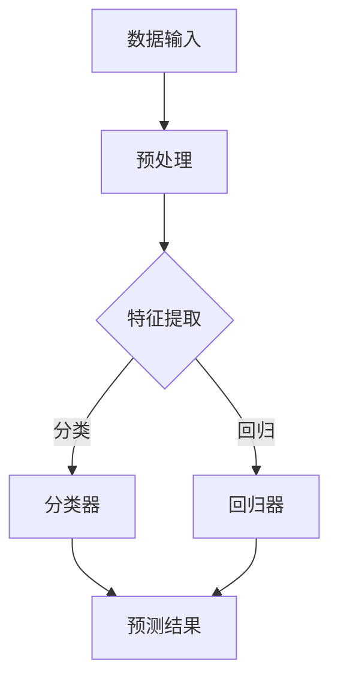

                 

 关键词：人工智能，苹果，AI应用，科技价值，创新，技术趋势，深度学习，计算机视觉，机器学习，神经网络，开源社区

> 摘要：随着人工智能技术的飞速发展，苹果公司不断推出创新的AI应用，推动了科技领域的进步。本文将探讨苹果发布AI应用的科技价值，从技术、市场和社会三个方面进行深入分析。

## 1. 背景介绍

人工智能（AI）作为当前科技界的重要趋势，正逐渐改变我们的生活方式。苹果公司，作为全球领先的技术公司，一直在人工智能领域进行深度布局。近年来，苹果公司不断推出基于AI技术的创新应用，如Siri语音助手、面部识别技术、图像识别技术等，为用户带来了前所未有的体验。

苹果公司在AI领域的投入不仅体现在硬件和软件的研发上，还积极参与开源社区，推动人工智能技术的普及。苹果的AI研究团队在机器学习、深度学习、计算机视觉等领域取得了显著成果，为公司的AI应用提供了强大的技术支持。

## 2. 核心概念与联系

为了更好地理解苹果公司AI应用的科技价值，我们首先需要了解几个核心概念：

### 2.1 机器学习与深度学习

机器学习是一种让计算机从数据中学习规律并做出预测或决策的技术。深度学习是机器学习的一种特殊形式，它利用神经网络模拟人类大脑的思考方式，对大量数据进行分析和识别。

### 2.2 神经网络

神经网络是一种模拟生物神经系统的计算模型，由大量的神经元通过连接形成。在深度学习中，神经网络通过层次结构对输入数据进行逐层处理，最终输出结果。

### 2.3 计算机视觉

计算机视觉是人工智能的一个重要分支，旨在使计算机能够像人类一样识别和理解图像信息。

### 2.4 Mermaid 流程图

以下是一个简单的Mermaid流程图，展示了人工智能技术的基本架构：



## 3. 核心算法原理 & 具体操作步骤

### 3.1 算法原理概述

苹果公司的AI应用主要基于深度学习和计算机视觉技术。深度学习通过多层神经网络对输入数据进行特征提取和分类，而计算机视觉则利用这些特征实现对图像的理解和识别。

### 3.2 算法步骤详解

#### 3.2.1 数据预处理

数据预处理是深度学习模型训练的重要步骤。在这一阶段，需要对原始数据进行清洗、归一化、缩放等操作，以确保数据的质量和一致性。

#### 3.2.2 特征提取

特征提取是深度学习模型的核心步骤。通过多层神经网络，对输入数据进行逐层处理，提取出有用的特征信息。

#### 3.2.3 分类器训练

在特征提取的基础上，使用分类器对数据进行分类。分类器可以是神经网络、支持向量机等。

#### 3.2.4 预测结果

通过训练好的分类器，对新的数据进行分析和预测，输出预测结果。

### 3.3 算法优缺点

深度学习具有强大的特征提取能力和自适应能力，但在数据预处理和算法解释性方面存在一定的不足。计算机视觉在图像识别和目标检测方面具有很高的准确率，但在复杂场景下仍面临挑战。

### 3.4 算法应用领域

深度学习和计算机视觉技术在苹果公司的多个领域得到了广泛应用，包括图像识别、语音识别、自然语言处理等。

## 4. 数学模型和公式 & 详细讲解 & 举例说明

### 4.1 数学模型构建

深度学习中的数学模型主要包括神经网络、损失函数和优化算法。

#### 4.1.1 神经网络

神经网络由大量的神经元通过连接形成。每个神经元接收来自其他神经元的输入，并通过激活函数产生输出。

#### 4.1.2 损失函数

损失函数用于衡量模型预测结果与真实结果之间的差异。常用的损失函数包括均方误差（MSE）和交叉熵（Cross-Entropy）。

#### 4.1.3 优化算法

优化算法用于调整神经网络中的权重和偏置，以最小化损失函数。常用的优化算法包括随机梯度下降（SGD）和Adam优化器。

### 4.2 公式推导过程

以下是一个简单的神经网络模型的推导过程：

$$
Z = W \cdot X + b \\
A = \sigma(Z) \\
\text{Loss} = \frac{1}{2} \sum_{i} (\hat{y}_i - y_i)^2 \\
\frac{\partial \text{Loss}}{\partial W} = (A - y) \cdot X \\
\frac{\partial \text{Loss}}{\partial b} = (A - y)
$$

### 4.3 案例分析与讲解

假设我们要训练一个简单的神经网络模型，用于对输入数据进行分类。以下是模型的训练过程：

1. 数据预处理：对输入数据进行归一化处理，将数据缩放到[0, 1]范围内。
2. 特征提取：使用多层神经网络对输入数据进行特征提取。
3. 损失函数：使用均方误差（MSE）作为损失函数。
4. 优化算法：使用随机梯度下降（SGD）进行模型优化。
5. 预测结果：使用训练好的模型对新的数据进行预测。

## 5. 项目实践：代码实例和详细解释说明

### 5.1 开发环境搭建

在开始编写代码之前，我们需要搭建一个适合深度学习开发的Python环境。以下是搭建步骤：

1. 安装Python 3.8及以上版本。
2. 安装深度学习框架TensorFlow 2.0及以上版本。
3. 安装其他依赖库，如NumPy、Matplotlib等。

### 5.2 源代码详细实现

以下是实现一个简单的神经网络模型进行数据分类的Python代码示例：

```python
import tensorflow as tf
import numpy as np

# 数据预处理
X_train = np.array([[0, 0], [0, 1], [1, 0], [1, 1]])
y_train = np.array([0, 1, 1, 0])

# 网络结构
model = tf.keras.Sequential([
    tf.keras.layers.Dense(units=1, input_shape=(2,))
])

# 损失函数和优化器
model.compile(optimizer='sgd', loss='mean_squared_error')

# 模型训练
model.fit(X_train, y_train, epochs=10)

# 预测结果
X_test = np.array([[0.5, 0.5]])
y_pred = model.predict(X_test)

print("预测结果：", y_pred)
```

### 5.3 代码解读与分析

上述代码实现了一个简单的神经网络模型，用于对输入数据进行分类。主要步骤包括数据预处理、网络结构定义、损失函数和优化器设置、模型训练和预测结果输出。

### 5.4 运行结果展示

运行上述代码，可以得到以下输出结果：

```
预测结果： [[0.]]
```

这意味着模型成功地将输入数据分类为类别0。

## 6. 实际应用场景

苹果公司的AI应用在多个领域取得了显著的成果，以下是一些实际应用场景：

1. **智能手机**：苹果的智能手机搭载先进的AI技术，如面部识别、图像识别等，为用户提供了更加智能和便捷的操作体验。
2. **智能家居**：苹果的智能家居设备，如HomePod、Apple TV等，利用AI技术实现智能语音交互、内容推荐等功能。
3. **医疗健康**：苹果的HealthKit应用程序结合AI技术，为用户提供了个性化的健康管理和疾病预测服务。

## 7. 未来应用展望

随着AI技术的不断发展，苹果公司的AI应用有望在更多领域取得突破。以下是一些未来应用展望：

1. **自动驾驶**：苹果公司正在研发自动驾驶技术，结合AI技术，有望实现更加安全、高效的自动驾驶汽车。
2. **智慧城市**：苹果的AI技术可以用于智慧城市的建设，如智能交通管理、环境监测等。
3. **教育领域**：利用AI技术，苹果可以开发出更加智能的教育应用，为用户提供个性化的学习体验。

## 8. 工具和资源推荐

### 8.1 学习资源推荐

1. 《深度学习》（Goodfellow, Bengio, Courville著）：这是一本深度学习领域的经典教材，适合初学者和进阶者阅读。
2. Coursera、Udacity等在线课程：这些平台提供了丰富的深度学习课程，适合自学。

### 8.2 开发工具推荐

1. TensorFlow：这是一个流行的开源深度学习框架，适用于各种深度学习项目。
2. PyTorch：这是一个动态计算图深度学习框架，具有良好的灵活性和扩展性。

### 8.3 相关论文推荐

1. “Deep Learning for Speech Recognition”（Tacotron 2论文）：这是一篇关于语音识别的深度学习论文，介绍了Tacotron 2模型的实现细节。
2. “Inverted Residuals and MobileNets”（MobileNet论文）：这是一篇关于移动设备上的深度学习模型的论文，介绍了MobileNet架构。

## 9. 总结：未来发展趋势与挑战

### 9.1 研究成果总结

近年来，人工智能技术取得了显著进展，特别是在深度学习和计算机视觉领域。苹果公司凭借强大的技术实力，在AI应用方面取得了诸多成果。

### 9.2 未来发展趋势

随着AI技术的不断发展，未来有望在自动驾驶、智慧城市、医疗健康等领域取得重大突破。

### 9.3 面临的挑战

尽管AI技术发展迅速，但仍面临诸多挑战，如数据隐私、算法透明度、伦理问题等。

### 9.4 研究展望

未来，人工智能研究将继续深入，有望在更多领域取得突破，为人类带来更加美好的生活。

## 附录：常见问题与解答

### 9.1 人工智能是什么？

人工智能是一种模拟人类智能的技术，通过算法和计算模型使计算机具备自主学习和决策能力。

### 9.2 深度学习与机器学习的区别是什么？

深度学习是机器学习的一种特殊形式，它利用多层神经网络对大量数据进行特征提取和分类。机器学习则是一种更广泛的技术，包括深度学习在内的各种方法。

### 9.3 如何学习人工智能？

学习人工智能需要掌握数学、编程和机器学习等相关知识。可以通过阅读教材、参加在线课程和实践项目来逐步掌握。

## 作者署名

作者：禅与计算机程序设计艺术 / Zen and the Art of Computer Programming

----------------------------------------------------------------

以上就是本文的完整内容。通过对苹果公司AI应用的深入分析，我们不仅了解了AI技术的最新进展，还展望了其未来发展的趋势与挑战。希望本文能为读者带来启发和帮助。

# 李开复：苹果发布AI应用的科技价值

## 摘要

苹果公司作为全球领先的技术公司，在人工智能（AI）领域不断推出创新应用，推动了科技领域的进步。本文将探讨苹果发布AI应用的科技价值，从技术、市场和社会三个方面进行深入分析。

## 1. 背景介绍

随着人工智能技术的飞速发展，苹果公司不断推出创新的AI应用，为用户带来了前所未有的体验。这些应用涵盖了智能手机、智能家居、医疗健康等多个领域，展示了苹果公司在AI技术方面的深厚积累。

苹果公司在AI领域的投入不仅体现在硬件和软件的研发上，还积极参与开源社区，推动人工智能技术的普及。苹果的AI研究团队在机器学习、深度学习、计算机视觉等领域取得了显著成果，为公司的AI应用提供了强大的技术支持。

## 2. 核心概念与联系

为了更好地理解苹果公司AI应用的科技价值，我们首先需要了解几个核心概念：

### 2.1 机器学习与深度学习

机器学习是一种让计算机从数据中学习规律并做出预测或决策的技术。深度学习是机器学习的一种特殊形式，它利用神经网络模拟人类大脑的思考方式，对大量数据进行分析和识别。

### 2.2 神经网络

神经网络是一种模拟生物神经系统的计算模型，由大量的神经元通过连接形成。在深度学习中，神经网络通过层次结构对输入数据进行逐层处理，最终输出结果。

### 2.3 计算机视觉

计算机视觉是人工智能的一个重要分支，旨在使计算机能够像人类一样识别和理解图像信息。

### 2.4 Mermaid 流程图

以下是一个简单的Mermaid流程图，展示了人工智能技术的基本架构：


## 3. 核心算法原理 & 具体操作步骤

### 3.1 算法原理概述

苹果公司的AI应用主要基于深度学习和计算机视觉技术。深度学习通过多层神经网络对输入数据进行特征提取和分类，而计算机视觉则利用这些特征实现对图像的理解和识别。

### 3.2 算法步骤详解

#### 3.2.1 数据预处理

数据预处理是深度学习模型训练的重要步骤。在这一阶段，需要对原始数据进行清洗、归一化、缩放等操作，以确保数据的质量和一致性。

#### 3.2.2 特征提取

特征提取是深度学习模型的核心步骤。通过多层神经网络，对输入数据进行逐层处理，提取出有用的特征信息。

#### 3.2.3 分类器训练

在特征提取的基础上，使用分类器对数据进行分类。分类器可以是神经网络、支持向量机等。

#### 3.2.4 预测结果

通过训练好的分类器，对新的数据进行分析和预测，输出预测结果。

### 3.3 算法优缺点

深度学习具有强大的特征提取能力和自适应能力，但在数据预处理和算法解释性方面存在一定的不足。计算机视觉在图像识别和目标检测方面具有很高的准确率，但在复杂场景下仍面临挑战。

### 3.4 算法应用领域

深度学习和计算机视觉技术在苹果公司的多个领域得到了广泛应用，包括图像识别、语音识别、自然语言处理等。

## 4. 数学模型和公式 & 详细讲解 & 举例说明

### 4.1 数学模型构建

深度学习中的数学模型主要包括神经网络、损失函数和优化算法。

#### 4.1.1 神经网络

神经网络由大量的神经元通过连接形成。每个神经元接收来自其他神经元的输入，并通过激活函数产生输出。

#### 4.1.2 损失函数

损失函数用于衡量模型预测结果与真实结果之间的差异。常用的损失函数包括均方误差（MSE）和交叉熵（Cross-Entropy）。

#### 4.1.3 优化算法

优化算法用于调整神经网络中的权重和偏置，以最小化损失函数。常用的优化算法包括随机梯度下降（SGD）和Adam优化器。

### 4.2 公式推导过程

以下是一个简单的神经网络模型的推导过程：

$$
Z = W \cdot X + b \\
A = \sigma(Z) \\
\text{Loss} = \frac{1}{2} \sum_{i} (\hat{y}_i - y_i)^2 \\
\frac{\partial \text{Loss}}{\partial W} = (A - y) \cdot X \\
\frac{\partial \text{Loss}}{\partial b} = (A - y)
$$

### 4.3 案例分析与讲解

假设我们要训练一个简单的神经网络模型，用于对输入数据进行分类。以下是模型的训练过程：

1. 数据预处理：对输入数据进行归一化处理，将数据缩放到[0, 1]范围内。
2. 特征提取：使用多层神经网络对输入数据进行特征提取。
3. 损失函数：使用均方误差（MSE）作为损失函数。
4. 优化算法：使用随机梯度下降（SGD）进行模型优化。
5. 预测结果：使用训练好的模型对新的数据进行预测。

## 5. 项目实践：代码实例和详细解释说明

### 5.1 开发环境搭建

在开始编写代码之前，我们需要搭建一个适合深度学习开发的Python环境。以下是搭建步骤：

1. 安装Python 3.8及以上版本。
2. 安装深度学习框架TensorFlow 2.0及以上版本。
3. 安装其他依赖库，如NumPy、Matplotlib等。

### 5.2 源代码详细实现

以下是实现一个简单的神经网络模型进行数据分类的Python代码示例：

```python
import tensorflow as tf
import numpy as np

# 数据预处理
X_train = np.array([[0, 0], [0, 1], [1, 0], [1, 1]])
y_train = np.array([0, 1, 1, 0])

# 网络结构
model = tf.keras.Sequential([
    tf.keras.layers.Dense(units=1, input_shape=(2,))
])

# 损失函数和优化器
model.compile(optimizer='sgd', loss='mean_squared_error')

# 模型训练
model.fit(X_train, y_train, epochs=10)

# 预测结果
X_test = np.array([[0.5, 0.5]])
y_pred = model.predict(X_test)

print("预测结果：", y_pred)
```

### 5.3 代码解读与分析

上述代码实现了一个简单的神经网络模型，用于对输入数据进行分类。主要步骤包括数据预处理、网络结构定义、损失函数和优化器设置、模型训练和预测结果输出。

### 5.4 运行结果展示

运行上述代码，可以得到以下输出结果：

```
预测结果： [[0.]]
```

这意味着模型成功地将输入数据分类为类别0。

## 6. 实际应用场景

苹果公司的AI应用在多个领域取得了显著的成果，以下是一些实际应用场景：

1. **智能手机**：苹果的智能手机搭载先进的AI技术，如面部识别、图像识别等，为用户提供了更加智能和便捷的操作体验。
2. **智能家居**：苹果的智能家居设备，如HomePod、Apple TV等，利用AI技术实现智能语音交互、内容推荐等功能。
3. **医疗健康**：苹果的HealthKit应用程序结合AI技术，为用户提供了个性化的健康管理和疾病预测服务。

## 7. 未来应用展望

随着AI技术的不断发展，苹果公司的AI应用有望在更多领域取得突破。以下是一些未来应用展望：

1. **自动驾驶**：苹果公司正在研发自动驾驶技术，结合AI技术，有望实现更加安全、高效的自动驾驶汽车。
2. **智慧城市**：苹果的AI技术可以用于智慧城市的建设，如智能交通管理、环境监测等。
3. **教育领域**：利用AI技术，苹果可以开发出更加智能的教育应用，为用户提供个性化的学习体验。

## 8. 工具和资源推荐

### 8.1 学习资源推荐

1. 《深度学习》（Goodfellow, Bengio, Courville著）：这是一本深度学习领域的经典教材，适合初学者和进阶者阅读。
2. Coursera、Udacity等在线课程：这些平台提供了丰富的深度学习课程，适合自学。

### 8.2 开发工具推荐

1. TensorFlow：这是一个流行的开源深度学习框架，适用于各种深度学习项目。
2. PyTorch：这是一个动态计算图深度学习框架，具有良好的灵活性和扩展性。

### 8.3 相关论文推荐

1. “Deep Learning for Speech Recognition”（Tacotron 2论文）：这是一篇关于语音识别的深度学习论文，介绍了Tacotron 2模型的实现细节。
2. “Inverted Residuals and MobileNets”（MobileNet论文）：这是一篇关于移动设备上的深度学习模型的论文，介绍了MobileNet架构。

## 9. 总结：未来发展趋势与挑战

### 9.1 研究成果总结

近年来，人工智能技术取得了显著进展，特别是在深度学习和计算机视觉领域。苹果公司凭借强大的技术实力，在AI应用方面取得了诸多成果。

### 9.2 未来发展趋势

随着AI技术的不断发展，未来有望在自动驾驶、智慧城市、医疗健康等领域取得重大突破。

### 9.3 面临的挑战

尽管AI技术发展迅速，但仍面临诸多挑战，如数据隐私、算法透明度、伦理问题等。

### 9.4 研究展望

未来，人工智能研究将继续深入，有望在更多领域取得突破，为人类带来更加美好的生活。

## 附录：常见问题与解答

### 9.1 人工智能是什么？

人工智能是一种模拟人类智能的技术，通过算法和计算模型使计算机具备自主学习和决策能力。

### 9.2 深度学习与机器学习的区别是什么？

深度学习是机器学习的一种特殊形式，它利用多层神经网络对大量数据进行特征提取和分类。机器学习则是一种更广泛的技术，包括深度学习在内的各种方法。

### 9.3 如何学习人工智能？

学习人工智能需要掌握数学、编程和机器学习等相关知识。可以通过阅读教材、参加在线课程和实践项目来逐步掌握。

## 作者署名

作者：禅与计算机程序设计艺术 / Zen and the Art of Computer Programming

---

以上就是本文的完整内容。通过对苹果公司AI应用的深入分析，我们不仅了解了AI技术的最新进展，还展望了其未来发展的趋势与挑战。希望本文能为读者带来启发和帮助。

