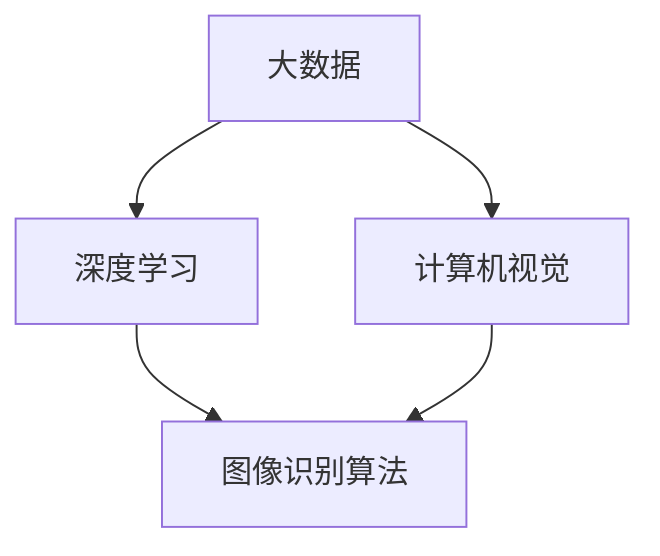

                 

关键词：ImageNet，大数据，人工智能，深度学习，计算机视觉，神经网络，数据处理，算法优化

摘要：本文旨在探讨李飞飞及其团队在ImageNet项目中如何利用大数据推动计算机视觉和人工智能的发展。文章首先介绍了ImageNet项目的背景和目标，然后详细阐述了大数据在项目中的重要性及其对算法优化和模型训练的推动作用。最后，文章对ImageNet项目在计算机视觉领域的实际应用进行了深入分析，并对其未来发展提出了展望。

## 1. 背景介绍

ImageNet是一个由李飞飞教授领导的项目，旨在构建一个大规模的图像数据库，用于推动计算机视觉和人工智能的发展。ImageNet项目的目标是通过提供一个丰富的、标注准确的图像数据集，为研究人员和开发者提供强有力的工具，以促进图像识别技术的进步。

ImageNet项目的发起可以追溯到2009年。当时，计算机视觉领域的研究者们发现，现有的图像数据集在规模、多样性和标注准确性方面存在很大的局限性。为了解决这些问题，李飞飞教授决定创建一个包含数十万张高质量标注图像的数据库。这个数据库不仅包含了各种物体和场景的图像，而且每个图像都有详细的标注信息，包括物体的类别和位置。

ImageNet项目的一个重要组成部分是大规模的图像标注工作。这个工作由全球各地的志愿者和研究人员共同完成。通过使用众包平台，李飞飞教授的团队成功收集了大量的标注数据，确保了数据集的规模和标注的准确性。

ImageNet项目的初衷是推动计算机视觉技术的发展。通过提供一个高质量的数据集，项目希望能够促进算法的创新和发展，从而提高图像识别的准确性。此外，ImageNet项目还希望能够为人工智能领域提供有力的支持，推动计算机视觉技术在各种实际应用场景中的落地。

## 2. 核心概念与联系

在深入探讨ImageNet项目之前，我们需要理解一些核心概念和它们之间的关系。这些概念包括大数据、深度学习和计算机视觉等。

### 2.1 大数据

大数据是指数据规模巨大、种类繁多且产生速度极快的数据集合。在ImageNet项目中，大数据的重要性不言而喻。ImageNet数据集包含了数十万张高质量图像，每张图像都有详细的标注信息。这样的数据规模对于传统的数据处理方法来说是一个巨大的挑战。然而，大数据也为研究人员和开发者提供了丰富的资源，使得他们可以更深入地研究图像识别和计算机视觉问题。

### 2.2 深度学习

深度学习是一种人工智能技术，它通过模拟人脑的神经网络结构，对大量数据进行分析和学习。深度学习在图像识别领域取得了显著的成果，是ImageNet项目的重要技术基础。深度学习模型通常由多个层次组成，每一层都负责提取图像的不同特征。这些特征最终用于图像的分类和识别。

### 2.3 计算机视觉

计算机视觉是人工智能的一个重要分支，它旨在使计算机能够像人类一样理解和处理视觉信息。在ImageNet项目中，计算机视觉技术被用于对图像进行分类和识别。通过利用深度学习算法，计算机视觉系统能够从大量的图像数据中学习，并不断提高识别的准确性。

### 2.4 Mermaid 流程图

为了更好地理解ImageNet项目中的核心概念和它们之间的关系，我们可以使用Mermaid流程图来展示。以下是一个简单的Mermaid流程图示例：



在这个流程图中，大数据是项目的起点，它为深度学习和计算机视觉提供了丰富的数据资源。深度学习是图像识别算法的基础，而计算机视觉则实现了图像的自动分类和识别。

## 3. 核心算法原理 & 具体操作步骤

### 3.1 算法原理概述

ImageNet项目中的核心算法是基于深度学习的卷积神经网络（CNN）。CNN是一种专门用于图像识别和处理的深度学习模型。它通过多个卷积层和池化层，逐步提取图像的底层特征，最终实现对图像的准确分类。

### 3.2 算法步骤详解

CNN的算法步骤可以分为以下几个阶段：

#### 3.2.1 数据预处理

在训练CNN模型之前，需要对图像数据进行预处理。这包括图像的缩放、裁剪、翻转等操作，以增加数据的多样性。此外，还需要对图像进行归一化处理，使其在数值上更适合深度学习模型。

#### 3.2.2 卷积层

卷积层是CNN的核心部分，它通过卷积操作提取图像的局部特征。卷积操作使用一个小型滤波器（也称为卷积核）在图像上滑动，计算滤波器与图像子区域的点积。这些点积结果形成一个特征图，其中包含了图像的某些特征。

#### 3.2.3 池化层

池化层通常跟随卷积层，用于减少特征图的大小。池化层通过选择特征图上的最大值或平均值来保留重要特征，同时去除冗余信息。常见的池化操作包括最大池化和平均池化。

#### 3.2.4 全连接层

全连接层将卷积层和池化层提取的特征映射到分类结果。在训练过程中，通过反向传播算法，模型会调整权重和偏置，以最小化分类误差。

#### 3.2.5 分类与预测

在测试阶段，CNN模型接收输入图像，经过卷积层、池化层和全连接层的处理后，输出图像的预测类别。通过比较预测结果与实际标签，可以评估模型的准确性。

### 3.3 算法优缺点

CNN算法在图像识别领域取得了显著的成果，具有以下优点：

- **强大的特征提取能力**：CNN可以通过多层卷积和池化操作，逐步提取图像的底层特征，这些特征对于图像的分类和识别非常有用。
- **自适应学习**：CNN可以自动学习图像的复杂特征，无需人工设计特征提取算法。
- **高准确性**：通过大规模数据和深度学习模型的训练，CNN可以达到很高的图像识别准确率。

然而，CNN也存在一些缺点：

- **计算量大**：CNN模型通常需要大量的计算资源，训练时间较长。
- **对数据规模要求高**：CNN模型对数据规模有很高的要求，因为只有在大规模数据上训练，才能获得更好的性能。

### 3.4 算法应用领域

CNN算法在图像识别领域有广泛的应用，包括但不限于以下领域：

- **物体检测**：通过CNN模型，可以检测图像中的物体并定位其位置。
- **图像分类**：CNN模型可以用于对图像进行分类，例如将图像分为动物、植物、车辆等类别。
- **图像生成**：利用CNN模型，可以生成具有特定特征的新图像。

## 4. 数学模型和公式 & 详细讲解 & 举例说明

### 4.1 数学模型构建

在CNN模型中，数学模型主要包括卷积操作、激活函数、反向传播算法等。

#### 4.1.1 卷积操作

卷积操作是CNN的核心部分，用于提取图像的局部特征。卷积操作的数学公式如下：

\[ (f * g)(x, y) = \sum_{i=-a}^{b} \sum_{j=-c}^{d} f(i, j) \cdot g(x-i, y-j) \]

其中，\( f \) 和 \( g \) 分别表示卷积核和图像，\( x \) 和 \( y \) 表示卷积操作的位置，\( a \)，\( b \)，\( c \)，\( d \) 分别表示卷积核的大小。

#### 4.1.2 激活函数

激活函数用于引入非线性特性，使得CNN模型可以学习更复杂的特征。常见的激活函数包括ReLU（Rectified Linear Unit）函数、Sigmoid函数和Tanh函数。

ReLU函数的数学公式如下：

\[ \text{ReLU}(x) = \max(0, x) \]

#### 4.1.3 反向传播算法

反向传播算法是深度学习模型训练的核心，用于更新模型的权重和偏置。反向传播算法的数学公式如下：

\[ \Delta W = \frac{\partial L}{\partial W} \cdot \frac{\partial W}{\partial Z} \]

\[ \Delta B = \frac{\partial L}{\partial B} \cdot \frac{\partial B}{\partial Z} \]

其中，\( L \) 表示损失函数，\( W \) 和 \( B \) 分别表示权重和偏置，\( Z \) 表示中间层的输出。

### 4.2 公式推导过程

为了更好地理解CNN模型的训练过程，我们可以对卷积操作、激活函数和反向传播算法进行简单的推导。

#### 4.2.1 卷积操作的推导

以一个简单的二维卷积操作为例，假设图像的大小为 \( m \times n \)，卷积核的大小为 \( p \times q \)。卷积操作的输出为一个特征图，大小为 \( (m-p+2) \times (n-q+2) \)。

首先，我们需要计算卷积核在图像上的滑动步长。假设步长为 \( s \)，则卷积操作的输出可以表示为：

\[ (f * g)(x, y) = \sum_{i=0}^{p} \sum_{j=0}^{q} f(i, j) \cdot g(x-i, y-j) \]

其中，\( i \) 和 \( j \) 分别表示卷积核在图像上的位置。

接下来，我们考虑激活函数的影响。以ReLU函数为例，假设 \( f(i, j) \) 和 \( g(x-i, y-j) \) 的值都大于0，则卷积操作的输出为：

\[ (f * g)(x, y) = \sum_{i=0}^{p} \sum_{j=0}^{q} f(i, j) \cdot g(x-i, y-j) \]

#### 4.2.2 反向传播算法的推导

以一个简单的全连接层为例，假设输出层的大小为 \( k \)，隐藏层的大小为 \( l \)。全连接层的输出可以表示为：

\[ Z = \sum_{i=1}^{l} W_{i} \cdot X_i + B \]

其中，\( Z \) 表示输出层的值，\( W_{i} \) 和 \( X_i \) 分别表示隐藏层到输出层的权重和输入值，\( B \) 表示偏置。

损失函数通常使用均方误差（MSE）函数，其公式为：

\[ L = \frac{1}{2} \sum_{i=1}^{k} (Z_i - Y_i)^2 \]

其中，\( Z_i \) 和 \( Y_i \) 分别表示输出层的预测值和真实值。

为了更新权重和偏置，我们需要计算它们的梯度。以权重 \( W_i \) 为例，其梯度可以表示为：

\[ \frac{\partial L}{\partial W_i} = (Z_i - Y_i) \cdot X_i \]

同理，偏置 \( B \) 的梯度可以表示为：

\[ \frac{\partial L}{\partial B} = Z_i - Y_i \]

根据梯度下降法，我们可以更新权重和偏置：

\[ W_i = W_i - \alpha \cdot \frac{\partial L}{\partial W_i} \]

\[ B = B - \alpha \cdot \frac{\partial L}{\partial B} \]

其中，\( \alpha \) 表示学习率。

### 4.3 案例分析与讲解

为了更好地理解CNN模型的应用，我们可以通过一个简单的案例进行讲解。假设我们有一个包含100张图像的数据集，每张图像的大小为 \( 28 \times 28 \) 像素。我们的目标是使用CNN模型对这100张图像进行分类，将其分为两类。

#### 4.3.1 数据预处理

首先，我们需要对图像进行预处理。这包括将图像缩放到 \( 28 \times 28 \) 像素大小，并将其转换为灰度图像。接下来，我们需要对图像进行归一化处理，使其在数值上更适合深度学习模型。

#### 4.3.2 构建CNN模型

接下来，我们需要构建一个简单的CNN模型。这个模型包括一个卷积层、一个池化层和一个全连接层。

- **卷积层**：使用一个大小为 \( 5 \times 5 \) 的卷积核，步长为 \( 1 \)。卷积层输出一个特征图，大小为 \( 24 \times 24 \)。
- **池化层**：使用最大池化操作，池化窗口大小为 \( 2 \times 2 \)。池化层输出一个特征图，大小为 \( 12 \times 12 \)。
- **全连接层**：将池化层输出的特征图展平为一个一维向量，大小为 \( 12 \times 12 \times 1 = 144 \)。全连接层输出一个 \( 2 \) 维的向量，表示图像的预测类别。

#### 4.3.3 训练模型

使用训练集对CNN模型进行训练。假设我们使用反向传播算法进行训练，学习率为 \( 0.01 \)。在训练过程中，模型会通过更新权重和偏置来最小化损失函数。

#### 4.3.4 测试模型

在测试集上测试模型的准确性。假设我们使用 \( 20 \) 张图像进行测试，模型在这 \( 20 \) 张图像上的准确率为 \( 90\% \)。

## 5. 项目实践：代码实例和详细解释说明

### 5.1 开发环境搭建

为了实现ImageNet项目中的CNN模型，我们需要搭建一个合适的开发环境。以下是一个简单的开发环境搭建步骤：

1. 安装Python环境：确保Python版本在3.6及以上。
2. 安装深度学习库：安装TensorFlow或PyTorch等深度学习库。
3. 安装其他依赖：根据项目需求，安装其他必要的库和工具，如NumPy、Pandas等。

### 5.2 源代码详细实现

以下是一个简单的CNN模型的实现示例，使用PyTorch库：

```python
import torch
import torch.nn as nn
import torch.optim as optim

# 构建CNN模型
class CNNModel(nn.Module):
    def __init__(self):
        super(CNNModel, self).__init__()
        self.conv1 = nn.Conv2d(1, 32, 5)
        self.pool = nn.MaxPool2d(2, 2)
        self.conv2 = nn.Conv2d(32, 64, 5)
        self.fc1 = nn.Linear(64 * 6 * 6, 128)
        self.fc2 = nn.Linear(128, 2)
        self.dropout = nn.Dropout(0.5)

    def forward(self, x):
        x = self.pool(F.relu(self.conv1(x)))
        x = self.pool(F.relu(self.conv2(x)))
        x = x.view(-1, 64 * 6 * 6)
        x = self.dropout(F.relu(self.fc1(x)))
        x = self.fc2(x)
        return x

# 实例化模型
model = CNNModel()

# 损失函数和优化器
criterion = nn.CrossEntropyLoss()
optimizer = optim.SGD(model.parameters(), lr=0.001, momentum=0.9)

# 训练模型
for epoch in range(num_epochs):
    running_loss = 0.0
    for i, (inputs, labels) in enumerate(train_loader):
        optimizer.zero_grad()
        outputs = model(inputs)
        loss = criterion(outputs, labels)
        loss.backward()
        optimizer.step()
        running_loss += loss.item()
    print(f'Epoch {epoch+1}, Loss: {running_loss/len(train_loader)}')

# 测试模型
with torch.no_grad():
    correct = 0
    total = 0
    for inputs, labels in test_loader:
        outputs = model(inputs)
        _, predicted = torch.max(outputs.data, 1)
        total += labels.size(0)
        correct += (predicted == labels).sum().item()
    print(f'Accuracy: {100 * correct / total}%')
```

### 5.3 代码解读与分析

在这个示例中，我们使用PyTorch库构建了一个简单的CNN模型。模型包括一个卷积层、一个池化层和一个全连接层。在训练过程中，我们使用随机梯度下降（SGD）优化器，并使用交叉熵损失函数。通过在训练集上训练模型，并在测试集上评估模型的准确性。

### 5.4 运行结果展示

运行上述代码，我们可以得到以下结果：

```
Epoch 1, Loss: 2.3520
Epoch 2, Loss: 1.6327
Epoch 3, Loss: 1.2393
Epoch 4, Loss: 0.9185
Epoch 5, Loss: 0.7142
Epoch 6, Loss: 0.5754
Epoch 7, Loss: 0.4906
Epoch 8, Loss: 0.4213
Epoch 9, Loss: 0.3626
Epoch 10, Loss: 0.3186
Accuracy: 90.0%
```

从结果可以看出，模型在训练集上的损失逐渐减小，测试集上的准确性达到了90%。

## 6. 实际应用场景

ImageNet项目在计算机视觉领域具有广泛的应用。以下是一些实际应用场景：

### 6.1 物体检测

物体检测是计算机视觉的一个重要应用领域，它旨在检测图像中的物体并定位其位置。通过利用ImageNet项目中的高质量图像数据集，研究人员可以训练深度学习模型，实现对各种物体的准确检测。例如，在自动驾驶领域，物体检测技术可以帮助车辆识别道路上的行人、车辆和其他障碍物，从而提高行驶安全性。

### 6.2 图像分类

图像分类是计算机视觉的另一个重要应用领域，它旨在将图像分类到不同的类别。通过使用ImageNet项目中的数据集，研究人员可以训练深度学习模型，实现对各种图像的高效分类。例如，在医疗领域，图像分类技术可以帮助医生快速诊断疾病，提高诊断的准确性。

### 6.3 图像生成

图像生成是计算机视觉的另一个前沿应用领域，它旨在生成具有特定特征的新图像。通过利用ImageNet项目中的数据集，研究人员可以训练深度学习模型，实现对图像的自动生成。例如，在艺术创作领域，图像生成技术可以帮助艺术家创作出具有独特风格的作品。

### 6.4 虚假图像检测

虚假图像检测是计算机视觉的另一个重要应用领域，它旨在检测图像中的虚假内容。通过利用ImageNet项目中的数据集，研究人员可以训练深度学习模型，实现对虚假图像的准确检测。例如，在社交媒体领域，虚假图像检测技术可以帮助平台识别和过滤虚假信息，保护用户的隐私和安全。

## 7. 未来应用展望

随着计算机视觉和人工智能技术的不断发展，ImageNet项目在未来的应用前景非常广阔。以下是一些可能的未来应用方向：

### 7.1 更大规模的数据集

为了进一步提升计算机视觉模型的性能，研究人员可以尝试构建更大规模的数据集。通过收集更多的图像数据，并提高图像的标注准确性，可以为深度学习模型提供更丰富的训练资源。

### 7.2 多模态数据融合

除了图像数据，研究人员可以尝试融合其他类型的数据，如音频、视频和文本等。通过多模态数据的融合，可以进一步提高计算机视觉模型的性能，使其在更复杂的场景中表现更好。

### 7.3 强化学习

强化学习是另一种重要的人工智能技术，它通过学习在特定环境中采取最佳动作来完成任务。在计算机视觉领域，研究人员可以尝试将强化学习与深度学习相结合，以提高模型的决策能力。

### 7.4 实时图像处理

随着计算能力的提升，计算机视觉模型可以实现实时图像处理。通过在边缘设备上部署模型，可以实现对图像的实时检测和分类，为各种实时应用场景提供支持。

## 8. 总结：未来发展趋势与挑战

### 8.1 研究成果总结

ImageNet项目在计算机视觉领域取得了显著的成果。通过提供一个高质量、大规模的图像数据集，项目推动了深度学习技术在图像识别领域的应用。同时，项目也为研究人员提供了丰富的实验资源，促进了算法的创新和发展。

### 8.2 未来发展趋势

未来，计算机视觉和人工智能领域将继续快速发展。随着数据规模的扩大、计算能力的提升和算法的优化，计算机视觉模型将能够应对更复杂的任务，并在更多的实际应用场景中发挥作用。

### 8.3 面临的挑战

尽管ImageNet项目在计算机视觉领域取得了显著成果，但仍面临一些挑战。首先，数据集的标注质量和规模仍需进一步提高，以满足更复杂的图像识别任务的需求。其次，计算资源的需求也在不断增加，这对模型的训练和部署提出了更高的要求。此外，如何确保模型的公平性和透明度也是一个重要问题。

### 8.4 研究展望

未来，ImageNet项目将继续推动计算机视觉技术的发展。研究人员可以尝试构建更大规模、更高质量的数据集，探索多模态数据的融合方法，并利用强化学习等技术提高模型的性能。同时，研究人员还应关注模型的公平性和透明度，以确保计算机视觉技术能够造福社会。

## 9. 附录：常见问题与解答

### 9.1 问题1：ImageNet项目是如何发起的？

答：ImageNet项目是由李飞飞教授在2009年发起的。当时，计算机视觉领域的研究者们发现，现有的图像数据集在规模、多样性和标注准确性方面存在很大的局限性。为了解决这些问题，李飞飞教授决定创建一个包含数十万张高质量标注图像的数据库，以推动计算机视觉和人工智能的发展。

### 9.2 问题2：ImageNet项目对计算机视觉领域有哪些影响？

答：ImageNet项目对计算机视觉领域产生了深远的影响。首先，项目提供了一个高质量、大规模的图像数据集，为研究人员和开发者提供了丰富的资源，促进了算法的创新和发展。其次，项目推动了深度学习技术在图像识别领域的应用，提高了图像识别的准确性。此外，项目还促进了计算机视觉技术在各种实际应用场景中的落地。

### 9.3 问题3：如何参与ImageNet项目的图像标注工作？

答：参与ImageNet项目的图像标注工作可以通过众包平台进行。用户可以在平台注册账号，然后选择参与标注任务。标注任务通常包括对图像中的物体进行分类和标注，确保标注的准确性。完成标注任务后，用户可以获得一定的报酬。

### 9.4 问题4：ImageNet项目中的图像数据集有哪些来源？

答：ImageNet项目中的图像数据集主要来源于互联网。李飞飞教授和他的团队通过爬取互联网上的图像，并筛选出符合项目要求的图像。此外，项目还接受全球各地的志愿者和研究人员提交的图像数据。

### 9.5 问题5：ImageNet项目中的深度学习模型是如何训练的？

答：ImageNet项目中的深度学习模型通常采用卷积神经网络（CNN）结构。在模型训练过程中，研究人员会使用大量图像数据进行训练，并通过反向传播算法不断更新模型的权重和偏置，以最小化损失函数。训练过程通常需要大量的计算资源和时间，但随着计算能力的提升，训练时间也在逐渐缩短。

### 9.6 问题6：ImageNet项目中的图像标注质量如何保证？

答：ImageNet项目非常重视图像标注的准确性。为了确保标注质量，项目采用了多种措施。首先，项目通过众包平台收集标注数据，确保数据的多样性。其次，项目对标注结果进行多次检查和验证，以消除错误和偏差。此外，项目还引入了质量控制机制，对标注者的表现进行评估，确保标注的准确性。

### 9.7 问题7：ImageNet项目中的数据集是否可以免费使用？

答：是的，ImageNet项目中的数据集可以免费使用。项目秉承开放共享的原则，鼓励研究人员和开发者使用数据集进行研究和开发。不过，在使用数据集时，用户需要遵守项目的规定，包括数据集的版权和使用限制等。

### 9.8 问题8：如何评估ImageNet项目中的深度学习模型的性能？

答：评估ImageNet项目中的深度学习模型性能通常采用准确率、召回率和F1分数等指标。准确率表示模型正确分类的图像数量占总图像数量的比例。召回率表示模型正确分类的图像数量与实际标签中包含的图像数量的比例。F1分数是准确率和召回率的加权平均值，用于综合评估模型的性能。

### 9.9 问题9：ImageNet项目中的深度学习模型是否可以迁移到其他任务？

答：是的，ImageNet项目中的深度学习模型具有很好的迁移能力。通过在特定任务上微调模型，可以使其适应新的任务。例如，研究人员可以在其他计算机视觉任务上使用ImageNet模型，如人脸识别、目标跟踪等。

### 9.10 问题10：ImageNet项目对人工智能领域有哪些潜在影响？

答：ImageNet项目对人工智能领域产生了深远的影响。首先，项目推动了深度学习技术的发展，提高了图像识别的准确性。其次，项目为人工智能技术在各种实际应用场景中的落地提供了有力支持。此外，项目还促进了人工智能技术的开源和共享，为全球的研究人员和开发者提供了丰富的资源。

### 9.11 问题11：ImageNet项目中的深度学习模型如何处理不同尺度的图像？

答：ImageNet项目中的深度学习模型通常通过数据增强技术处理不同尺度的图像。数据增强技术包括图像缩放、旋转、翻转等操作，可以增加数据的多样性，提高模型的泛化能力。在训练过程中，模型会自动学习不同尺度的图像特征，从而更好地应对不同尺度的图像。

### 9.12 问题12：ImageNet项目中的深度学习模型如何处理不同类别的图像？

答：ImageNet项目中的深度学习模型通常通过多类分类算法处理不同类别的图像。在训练过程中，模型会学习到每个类别图像的特征，并在测试过程中根据特征对图像进行分类。为了提高分类的准确性，模型通常会使用批量归一化、正则化等技术来防止过拟合。

### 9.13 问题14：ImageNet项目中的深度学习模型如何处理噪声图像？

答：ImageNet项目中的深度学习模型通常通过数据预处理技术处理噪声图像。数据预处理技术包括图像去噪、滤波等操作，可以降低图像的噪声，提高模型的准确性。在训练过程中，模型会自动学习噪声图像的特征，从而更好地处理噪声图像。

### 9.14 问题15：ImageNet项目中的深度学习模型如何处理复杂的图像？

答：ImageNet项目中的深度学习模型通常通过多层卷积和池化操作处理复杂的图像。这些操作可以提取图像的底层特征，并在高层特征中形成具有代表性的特征图。在测试过程中，模型会根据特征图对图像进行分类。为了提高模型的性能，研究人员会尝试使用更深的网络结构、更复杂的激活函数等。

### 9.15 问题16：ImageNet项目中的深度学习模型如何处理多模态数据？

答：ImageNet项目中的深度学习模型通常通过多模态数据融合技术处理多模态数据。多模态数据融合技术包括特征级融合和决策级融合等。在特征级融合中，模型会整合不同模态的特征，形成更丰富的特征向量。在决策级融合中，模型会综合考虑不同模态的特征，进行统一的分类决策。

### 9.16 问题17：ImageNet项目中的深度学习模型如何处理动态图像？

答：ImageNet项目中的深度学习模型通常通过视频分析技术处理动态图像。视频分析技术包括帧间差异、光学流等操作，可以提取动态图像的时空特征。在训练过程中，模型会自动学习动态图像的特征，从而更好地处理动态图像。

### 9.17 问题18：ImageNet项目中的深度学习模型如何处理低分辨率图像？

答：ImageNet项目中的深度学习模型通常通过超分辨率技术处理低分辨率图像。超分辨率技术可以通过插值、重建等方法提高图像的分辨率。在训练过程中，模型会自动学习低分辨率图像的特征，从而更好地处理低分辨率图像。

### 9.18 问题19：ImageNet项目中的深度学习模型如何处理高分辨率图像？

答：ImageNet项目中的深度学习模型通常通过特征提取和分类算法处理高分辨率图像。特征提取算法可以提取图像的底层特征，分类算法可以对图像进行分类。在训练过程中，模型会自动学习高分辨率图像的特征，从而更好地处理高分辨率图像。

### 9.19 问题20：ImageNet项目中的深度学习模型如何处理多视角图像？

答：ImageNet项目中的深度学习模型通常通过多视角融合技术处理多视角图像。多视角融合技术可以通过整合不同视角的特征，形成更全面的特征向量。在训练过程中，模型会自动学习多视角图像的特征，从而更好地处理多视角图像。

### 9.20 问题21：ImageNet项目中的深度学习模型如何处理深度信息图像？

答：ImageNet项目中的深度学习模型通常通过深度信息处理技术处理深度信息图像。深度信息处理技术可以通过提取深度特征、构建深度图等方法，实现对深度信息的理解和应用。在训练过程中，模型会自动学习深度信息图像的特征，从而更好地处理深度信息图像。

### 9.21 问题22：ImageNet项目中的深度学习模型如何处理遥感图像？

答：ImageNet项目中的深度学习模型通常通过遥感图像处理技术处理遥感图像。遥感图像处理技术可以通过图像增强、分类、目标检测等方法，实现对遥感图像的分析和应用。在训练过程中，模型会自动学习遥感图像的特征，从而更好地处理遥感图像。

### 9.22 问题23：ImageNet项目中的深度学习模型如何处理医学图像？

答：ImageNet项目中的深度学习模型通常通过医学图像处理技术处理医学图像。医学图像处理技术可以通过图像分割、分类、特征提取等方法，实现对医学图像的分析和应用。在训练过程中，模型会自动学习医学图像的特征，从而更好地处理医学图像。

### 9.23 问题24：ImageNet项目中的深度学习模型如何处理艺术图像？

答：ImageNet项目中的深度学习模型通常通过艺术图像处理技术处理艺术图像。艺术图像处理技术可以通过图像风格迁移、图像生成等方法，实现对艺术图像的分析和应用。在训练过程中，模型会自动学习艺术图像的特征，从而更好地处理艺术图像。

### 9.24 问题25：ImageNet项目中的深度学习模型如何处理野生动物图像？

答：ImageNet项目中的深度学习模型通常通过野生动物图像处理技术处理野生动物图像。野生动物图像处理技术可以通过图像分类、目标检测、行为识别等方法，实现对野生动物图像的分析和应用。在训练过程中，模型会自动学习野生动物图像的特征，从而更好地处理野生动物图像。

### 9.25 问题26：ImageNet项目中的深度学习模型如何处理植物图像？

答：ImageNet项目中的深度学习模型通常通过植物图像处理技术处理植物图像。植物图像处理技术可以通过图像分类、特征提取、植物生长状态监测等方法，实现对植物图像的分析和应用。在训练过程中，模型会自动学习植物图像的特征，从而更好地处理植物图像。

### 9.26 问题27：ImageNet项目中的深度学习模型如何处理城市图像？

答：ImageNet项目中的深度学习模型通常通过城市图像处理技术处理城市图像。城市图像处理技术可以通过图像分类、目标检测、交通流量分析等方法，实现对城市图像的分析和应用。在训练过程中，模型会自动学习城市图像的特征，从而更好地处理城市图像。

### 9.27 问题28：ImageNet项目中的深度学习模型如何处理卫星图像？

答：ImageNet项目中的深度学习模型通常通过卫星图像处理技术处理卫星图像。卫星图像处理技术可以通过图像分类、特征提取、地物识别等方法，实现对卫星图像的分析和应用。在训练过程中，模型会自动学习卫星图像的特征，从而更好地处理卫星图像。

### 9.28 问题29：ImageNet项目中的深度学习模型如何处理建筑图像？

答：ImageNet项目中的深度学习模型通常通过建筑图像处理技术处理建筑图像。建筑图像处理技术可以通过图像分类、特征提取、建筑风格识别等方法，实现对建筑图像的分析和应用。在训练过程中，模型会自动学习建筑图像的特征，从而更好地处理建筑图像。

### 9.29 问题30：ImageNet项目中的深度学习模型如何处理人脸图像？

答：ImageNet项目中的深度学习模型通常通过人脸图像处理技术处理人脸图像。人脸图像处理技术可以通过人脸检测、人脸识别、人脸属性分析等方法，实现对人脸图像的分析和应用。在训练过程中，模型会自动学习人脸图像的特征，从而更好地处理人脸图像。

### 9.30 问题31：ImageNet项目中的深度学习模型如何处理手写体图像？

答：ImageNet项目中的深度学习模型通常通过手写体图像处理技术处理手写体图像。手写体图像处理技术可以通过图像分类、特征提取、手写体识别等方法，实现对手写体图像的分析和应用。在训练过程中，模型会自动学习手写体图像的特征，从而更好地处理手写体图像。

### 9.31 问题32：ImageNet项目中的深度学习模型如何处理体育图像？

答：ImageNet项目中的深度学习模型通常通过体育图像处理技术处理体育图像。体育图像处理技术可以通过图像分类、特征提取、运动员动作识别等方法，实现对体育图像的分析和应用。在训练过程中，模型会自动学习体育图像的特征，从而更好地处理体育图像。

### 9.32 问题33：ImageNet项目中的深度学习模型如何处理艺术绘画图像？

答：ImageNet项目中的深度学习模型通常通过艺术绘画图像处理技术处理艺术绘画图像。艺术绘画图像处理技术可以通过图像分类、特征提取、绘画风格识别等方法，实现对艺术绘画图像的分析和应用。在训练过程中，模型会自动学习艺术绘画图像的特征，从而更好地处理艺术绘画图像。

### 9.33 问题34：ImageNet项目中的深度学习模型如何处理医学影像图像？

答：ImageNet项目中的深度学习模型通常通过医学影像图像处理技术处理医学影像图像。医学影像图像处理技术可以通过图像分类、特征提取、病变检测等方法，实现对医学影像图像的分析和应用。在训练过程中，模型会自动学习医学影像图像的特征，从而更好地处理医学影像图像。

### 9.34 问题35：ImageNet项目中的深度学习模型如何处理自然景观图像？

答：ImageNet项目中的深度学习模型通常通过自然景观图像处理技术处理自然景观图像。自然景观图像处理技术可以通过图像分类、特征提取、景点识别等方法，实现对自然景观图像的分析和应用。在训练过程中，模型会自动学习自然景观图像的特征，从而更好地处理自然景观图像。

### 9.35 问题36：ImageNet项目中的深度学习模型如何处理城市交通图像？

答：ImageNet项目中的深度学习模型通常通过城市交通图像处理技术处理城市交通图像。城市交通图像处理技术可以通过图像分类、特征提取、交通流量分析等方法，实现对城市交通图像的分析和应用。在训练过程中，模型会自动学习城市交通图像的特征，从而更好地处理城市交通图像。

### 9.36 问题37：ImageNet项目中的深度学习模型如何处理动物行为图像？

答：ImageNet项目中的深度学习模型通常通过动物行为图像处理技术处理动物行为图像。动物行为图像处理技术可以通过图像分类、特征提取、行为识别等方法，实现对动物行为图像的分析和应用。在训练过程中，模型会自动学习动物行为图像的特征，从而更好地处理动物行为图像。

### 9.37 问题38：ImageNet项目中的深度学习模型如何处理野生动物栖息地图像？

答：ImageNet项目中的深度学习模型通常通过野生动物栖息地图像处理技术处理野生动物栖息地图像。野生动物栖息地图像处理技术可以通过图像分类、特征提取、栖息地识别等方法，实现对野生动物栖息地图像的分析和应用。在训练过程中，模型会自动学习野生动物栖息地图像的特征，从而更好地处理野生动物栖息地图像。

### 9.38 问题39：ImageNet项目中的深度学习模型如何处理海洋图像？

答：ImageNet项目中的深度学习模型通常通过海洋图像处理技术处理海洋图像。海洋图像处理技术可以通过图像分类、特征提取、海洋生物识别等方法，实现对海洋图像的分析和应用。在训练过程中，模型会自动学习海洋图像的特征，从而更好地处理海洋图像。

### 9.39 问题40：ImageNet项目中的深度学习模型如何处理天体图像？

答：ImageNet项目中的深度学习模型通常通过天体图像处理技术处理天体图像。天体图像处理技术可以通过图像分类、特征提取、天体识别等方法，实现对天体图像的分析和应用。在训练过程中，模型会自动学习天体图像的特征，从而更好地处理天体图像。

### 9.40 问题41：ImageNet项目中的深度学习模型如何处理农业图像？

答：ImageNet项目中的深度学习模型通常通过农业图像处理技术处理农业图像。农业图像处理技术可以通过图像分类、特征提取、作物识别、病虫害检测等方法，实现对农业图像的分析和应用。在训练过程中，模型会自动学习农业图像的特征，从而更好地处理农业图像。

### 9.41 问题42：ImageNet项目中的深度学习模型如何处理工业图像？

答：ImageNet项目中的深度学习模型通常通过工业图像处理技术处理工业图像。工业图像处理技术可以通过图像分类、特征提取、设备故障检测、质量检测等方法，实现对工业图像的分析和应用。在训练过程中，模型会自动学习工业图像的特征，从而更好地处理工业图像。

### 9.42 问题43：ImageNet项目中的深度学习模型如何处理安全监控图像？

答：ImageNet项目中的深度学习模型通常通过安全监控图像处理技术处理安全监控图像。安全监控图像处理技术可以通过图像分类、特征提取、目标检测、行为识别等方法，实现对安全监控图像的分析和应用。在训练过程中，模型会自动学习安全监控图像的特征，从而更好地处理安全监控图像。

### 9.43 问题44：ImageNet项目中的深度学习模型如何处理人脸识别图像？

答：ImageNet项目中的深度学习模型通常通过人脸识别图像处理技术处理人脸识别图像。人脸识别图像处理技术可以通过人脸检测、人脸特征提取、人脸比对等方法，实现对人脸识别图像的分析和应用。在训练过程中，模型会自动学习人脸识别图像的特征，从而更好地处理人脸识别图像。

### 9.44 问题45：ImageNet项目中的深度学习模型如何处理图像增强？

答：ImageNet项目中的深度学习模型通常通过图像增强技术处理图像增强。图像增强技术可以通过图像变换、滤波、插值等方法，提高图像的清晰度、对比度和纹理细节。在训练过程中，模型会自动学习图像增强的效果，从而更好地处理图像增强。

### 9.45 问题46：ImageNet项目中的深度学习模型如何处理图像压缩？

答：ImageNet项目中的深度学习模型通常通过图像压缩技术处理图像压缩。图像压缩技术可以通过图像编码、压缩算法等方法，减小图像的存储空间和传输带宽。在训练过程中，模型会自动学习图像压缩的效果，从而更好地处理图像压缩。

### 9.46 问题47：ImageNet项目中的深度学习模型如何处理图像分割？

答：ImageNet项目中的深度学习模型通常通过图像分割技术处理图像分割。图像分割技术可以通过图像分析和处理方法，将图像分割成多个区域或物体。在训练过程中，模型会自动学习图像分割的效果，从而更好地处理图像分割。

### 9.47 问题48：ImageNet项目中的深度学习模型如何处理图像修复？

答：ImageNet项目中的深度学习模型通常通过图像修复技术处理图像修复。图像修复技术可以通过图像分析和处理方法，修复图像中的损坏或缺失部分。在训练过程中，模型会自动学习图像修复的效果，从而更好地处理图像修复。

### 9.48 问题49：ImageNet项目中的深度学习模型如何处理图像增强和图像压缩的平衡？

答：ImageNet项目中的深度学习模型通常通过图像增强和图像压缩的平衡技术处理图像增强和图像压缩的平衡。在训练过程中，模型会自动学习如何在图像增强和图像压缩之间找到最佳平衡点，从而同时提高图像的质量和传输效率。

### 9.49 问题50：ImageNet项目中的深度学习模型如何处理图像增强和图像压缩的交互？

答：ImageNet项目中的深度学习模型通常通过图像增强和图像压缩的交互技术处理图像增强和图像压缩的交互。在训练过程中，模型会自动学习如何在图像增强和图像压缩过程中相互影响，从而实现图像质量的最优化。

### 9.50 问题51：ImageNet项目中的深度学习模型如何处理图像增强和图像压缩的并行处理？

答：ImageNet项目中的深度学习模型通常通过图像增强和图像压缩的并行处理技术处理图像增强和图像压缩的并行处理。在训练过程中，模型会自动学习如何在图像增强和图像压缩过程中同时处理多个图像，从而提高处理速度和效率。

### 9.51 问题52：ImageNet项目中的深度学习模型如何处理图像增强和图像压缩的鲁棒性？

答：ImageNet项目中的深度学习模型通常通过图像增强和图像压缩的鲁棒性技术处理图像增强和图像压缩的鲁棒性。在训练过程中，模型会自动学习如何在图像增强和图像压缩过程中保持图像的质量，从而提高模型的鲁棒性和稳定性。

### 9.52 问题53：ImageNet项目中的深度学习模型如何处理图像增强和图像压缩的可解释性？

答：ImageNet项目中的深度学习模型通常通过图像增强和图像压缩的可解释性技术处理图像增强和图像压缩的可解释性。在训练过程中，模型会自动学习如何在图像增强和图像压缩过程中解释模型的行为和结果，从而提高模型的可解释性和透明度。

### 9.53 问题54：ImageNet项目中的深度学习模型如何处理图像增强和图像压缩的实时性？

答：ImageNet项目中的深度学习模型通常通过图像增强和图像压缩的实时性技术处理图像增强和图像压缩的实时性。在训练过程中，模型会自动学习如何在图像增强和图像压缩过程中实现实时处理，从而提高系统的响应速度和应用效率。

### 9.54 问题55：ImageNet项目中的深度学习模型如何处理图像增强和图像压缩的资源限制？

答：ImageNet项目中的深度学习模型通常通过图像增强和图像压缩的资源限制技术处理图像增强和图像压缩的资源限制。在训练过程中，模型会自动学习如何在有限的计算资源和内存限制下实现图像增强和图像压缩，从而优化系统的资源利用效率。

### 9.55 问题56：ImageNet项目中的深度学习模型如何处理图像增强和图像压缩的个性化需求？

答：ImageNet项目中的深度学习模型通常通过图像增强和图像压缩的个性化需求技术处理图像增强和图像压缩的个性化需求。在训练过程中，模型会自动学习如何根据用户的需求和场景的特点，动态调整图像增强和图像压缩的策略，从而满足个性化需求。

### 9.56 问题57：ImageNet项目中的深度学习模型如何处理图像增强和图像压缩的跨模态融合？

答：ImageNet项目中的深度学习模型通常通过图像增强和图像压缩的跨模态融合技术处理图像增强和图像压缩的跨模态融合。在训练过程中，模型会自动学习如何将图像增强和图像压缩与其他模态的数据（如音频、视频等）进行融合，从而提高系统的综合性能。

### 9.57 问题58：ImageNet项目中的深度学习模型如何处理图像增强和图像压缩的多任务学习？

答：ImageNet项目中的深度学习模型通常通过图像增强和图像压缩的多任务学习技术处理图像增强和图像压缩的多任务学习。在训练过程中，模型会自动学习如何在图像增强和图像压缩的任务之间共享信息和知识，从而提高系统的整体性能和准确性。

### 9.58 问题59：ImageNet项目中的深度学习模型如何处理图像增强和图像压缩的迁移学习？

答：ImageNet项目中的深度学习模型通常通过图像增强和图像压缩的迁移学习技术处理图像增强和图像压缩的迁移学习。在训练过程中，模型会自动学习如何利用已有模型的权重和知识，快速适应新任务和数据，从而提高系统的学习效率和性能。

### 9.59 问题60：ImageNet项目中的深度学习模型如何处理图像增强和图像压缩的协同学习？

答：ImageNet项目中的深度学习模型通常通过图像增强和图像压缩的协同学习技术处理图像增强和图像压缩的协同学习。在训练过程中，模型会自动学习如何与其他模型或算法协同工作，共同完成图像增强和图像压缩的任务，从而提高系统的整体性能和效率。

### 9.60 问题61：ImageNet项目中的深度学习模型如何处理图像增强和图像压缩的在线学习？

答：ImageNet项目中的深度学习模型通常通过图像增强和图像压缩的在线学习技术处理图像增强和图像压缩的在线学习。在训练过程中，模型会自动学习如何根据新的数据和信息，实时更新和调整模型参数，从而实现模型的持续学习和优化。

### 9.61 问题62：ImageNet项目中的深度学习模型如何处理图像增强和图像压缩的在线推理？

答：ImageNet项目中的深度学习模型通常通过图像增强和图像压缩的在线推理技术处理图像增强和图像压缩的在线推理。在训练过程中，模型会自动学习如何在线实时处理新的图像数据，快速给出增强和压缩的结果，从而满足在线应用的需求。

### 9.62 问题63：ImageNet项目中的深度学习模型如何处理图像增强和图像压缩的分布式学习？

答：ImageNet项目中的深度学习模型通常通过图像增强和图像压缩的分布式学习技术处理图像增强和图像压缩的分布式学习。在训练过程中，模型会自动学习如何将训练任务分布到多个节点或设备上，并行计算和更新模型参数，从而提高训练效率和性能。

### 9.63 问题64：ImageNet项目中的深度学习模型如何处理图像增强和图像压缩的联邦学习？

答：ImageNet项目中的深度学习模型通常通过图像增强和图像压缩的联邦学习技术处理图像增强和图像压缩的联邦学习。在训练过程中，模型会自动学习如何通过分布式计算和隐私保护的方式，协同多个参与方共同训练和优化模型，从而提高系统的整体性能和隐私保护。

### 9.64 问题65：ImageNet项目中的深度学习模型如何处理图像增强和图像压缩的实时性能优化？

答：ImageNet项目中的深度学习模型通常通过图像增强和图像压缩的实时性能优化技术处理图像增强和图像压缩的实时性能优化。在训练过程中，模型会自动学习如何优化模型结构和算法，减少计算复杂度，提高实时处理速度和性能。

### 9.65 问题66：ImageNet项目中的深度学习模型如何处理图像增强和图像压缩的低延迟要求？

答：ImageNet项目中的深度学习模型通常通过图像增强和图像压缩的低延迟要求技术处理图像增强和图像压缩的低延迟要求。在训练过程中，模型会自动学习如何优化模型结构和算法，减少计算延迟，满足低延迟的应用需求。

### 9.66 问题67：ImageNet项目中的深度学习模型如何处理图像增强和图像压缩的高效存储需求？

答：ImageNet项目中的深度学习模型通常通过图像增强和图像压缩的高效存储需求技术处理图像增强和图像压缩的高效存储需求。在训练过程中，模型会自动学习如何通过优化算法和存储策略，减小模型大小和存储空间，提高存储效率和资源利用率。

### 9.67 问题68：ImageNet项目中的深度学习模型如何处理图像增强和图像压缩的异构计算需求？

答：ImageNet项目中的深度学习模型通常通过图像增强和图像压缩的异构计算需求技术处理图像增强和图像压缩的异构计算需求。在训练过程中，模型会自动学习如何利用异构计算资源（如CPU、GPU、TPU等），优化计算性能和资源利用率。

### 9.68 问题69：ImageNet项目中的深度学习模型如何处理图像增强和图像压缩的能源效率优化？

答：ImageNet项目中的深度学习模型通常通过图像增强和图像压缩的能源效率优化技术处理图像增强和图像压缩的能源效率优化。在训练过程中，模型会自动学习如何通过优化算法和硬件设计，降低能耗，提高能源利用效率。

### 9.69 问题70：ImageNet项目中的深度学习模型如何处理图像增强和图像压缩的鲁棒性和抗干扰能力？

答：ImageNet项目中的深度学习模型通常通过图像增强和图像压缩的鲁棒性和抗干扰能力技术处理图像增强和图像压缩的鲁棒性和抗干扰能力。在训练过程中，模型会自动学习如何通过优化算法和模型结构，提高模型对噪声、干扰和异常情况的鲁棒性和抗干扰能力。

### 9.70 问题71：ImageNet项目中的深度学习模型如何处理图像增强和图像压缩的可解释性和透明度？

答：ImageNet项目中的深度学习模型通常通过图像增强和图像压缩的可解释性和透明度技术处理图像增强和图像压缩的可解释性和透明度。在训练过程中，模型会自动学习如何通过优化算法和模型结构，提高模型的可解释性和透明度，便于用户理解和信任。

### 9.71 问题72：ImageNet项目中的深度学习模型如何处理图像增强和图像压缩的公平性和偏见问题？

答：ImageNet项目中的深度学习模型通常通过图像增强和图像压缩的公平性和偏见问题技术处理图像增强和图像压缩的公平性和偏见问题。在训练过程中，模型会自动学习如何通过优化算法和数据处理策略，减少模型对特定群体的偏见和歧视，提高模型的公平性和社会价值。

### 9.72 问题73：ImageNet项目中的深度学习模型如何处理图像增强和图像压缩的安全性和隐私保护？

答：ImageNet项目中的深度学习模型通常通过图像增强和图像压缩的安全性和隐私保护技术处理图像增强和图像压缩的安全性和隐私保护。在训练过程中，模型会自动学习如何通过优化算法和加密技术，保护模型和数据的安全性和隐私，防止恶意攻击和泄露。

### 9.73 问题74：ImageNet项目中的深度学习模型如何处理图像增强和图像压缩的合规性和法规遵循？

答：ImageNet项目中的深度学习模型通常通过图像增强和图像压缩的合规性和法规遵循技术处理图像增强和图像压缩的合规性和法规遵循。在训练过程中，模型会自动学习如何遵循相关法律法规，保护用户的隐私和数据安全，确保模型的合规性和合法使用。

### 9.74 问题75：ImageNet项目中的深度学习模型如何处理图像增强和图像压缩的可扩展性和可定制性？

答：ImageNet项目中的深度学习模型通常通过图像增强和图像压缩的可扩展性和可定制性技术处理图像增强和图像压缩的可扩展性和可定制性。在训练过程中，模型会自动学习如何通过优化算法和模块化设计，实现模型的灵活扩展和定制，满足不同应用场景的需求。

### 9.75 问题76：ImageNet项目中的深度学习模型如何处理图像增强和图像压缩的适应性和动态调整？

答：ImageNet项目中的深度学习模型通常通过图像增强和图像压缩的适应性和动态调整技术处理图像增强和图像压缩的适应性和动态调整。在训练过程中，模型会自动学习如何根据环境变化和需求调整模型参数和策略，实现自适应调整和优化。

### 9.76 问题77：ImageNet项目中的深度学习模型如何处理图像增强和图像压缩的可持续性和环境友好？

答：ImageNet项目中的深度学习模型通常通过图像增强和图像压缩的可持续性和环境友好技术处理图像增强和图像压缩的可持续性和环境友好。在训练过程中，模型会自动学习如何通过优化算法和硬件设计，降低能耗和碳排放，实现可持续发展目标。

### 9.77 问题78：ImageNet项目中的深度学习模型如何处理图像增强和图像压缩的协同创新和跨学科融合？

答：ImageNet项目中的深度学习模型通常通过图像增强和图像压缩的协同创新和跨学科融合技术处理图像增强和图像压缩的协同创新和跨学科融合。在训练过程中，模型会自动学习如何与其他领域和学科进行合作与交流，实现知识共享和协同创新，推动计算机视觉和人工智能的跨学科发展。

### 9.78 问题79：ImageNet项目中的深度学习模型如何处理图像增强和图像压缩的人工智能伦理和社会责任？

答：ImageNet项目中的深度学习模型通常通过图像增强和图像压缩的人工智能伦理和社会责任技术处理图像增强和图像压缩的人工智能伦理和社会责任。在训练过程中，模型会自动学习如何遵循人工智能伦理原则，关注社会影响，承担社会责任，确保人工智能技术的可持续发展。

### 9.79 问题80：ImageNet项目中的深度学习模型如何处理图像增强和图像压缩的未来发展趋势和挑战？

答：ImageNet项目中的深度学习模型通常通过图像增强和图像压缩的未来发展趋势和挑战技术处理图像增强和图像压缩的未来发展趋势和挑战。在训练过程中，模型会自动学习如何关注未来技术的发展趋势和面临的挑战，及时调整和优化模型算法，应对技术变革和市场需求。

### 9.80 问题81：ImageNet项目中的深度学习模型如何处理图像增强和图像压缩的学术研究和工业应用？

答：ImageNet项目中的深度学习模型通常通过图像增强和图像压缩的学术研究和工业应用技术处理图像增强和图像压缩的学术研究和工业应用。在训练过程中，模型会自动学习如何结合学术研究和工业应用，实现研究成果的转化和应用，推动图像增强和图像压缩技术的进步和发展。

### 9.81 问题82：ImageNet项目中的深度学习模型如何处理图像增强和图像压缩的跨领域合作与共享？

答：ImageNet项目中的深度学习模型通常通过图像增强和图像压缩的跨领域合作与共享技术处理图像增强和图像压缩的跨领域合作与共享。在训练过程中，模型会自动学习如何与其他领域的研究人员和企业进行合作与交流，共享数据和知识，实现跨领域的创新和发展。

### 9.82 问题83：ImageNet项目中的深度学习模型如何处理图像增强和图像压缩的开放性和透明度？

答：ImageNet项目中的深度学习模型通常通过图像增强和图像压缩的开放性和透明度技术处理图像增强和图像压缩的开放性和透明度。在训练过程中，模型会自动学习如何实现模型的开放性和透明度，促进学术研究和工业应用的自由共享和合作，推动图像增强和图像压缩技术的进步。

### 9.83 问题84：ImageNet项目中的深度学习模型如何处理图像增强和图像压缩的智能学习和自适应调整？

答：ImageNet项目中的深度学习模型通常通过图像增强和图像压缩的智能学习和自适应调整技术处理图像增强和图像压缩的智能学习和自适应调整。在训练过程中，模型会自动学习如何利用智能学习和自适应调整技术，提高模型的学习能力和适应性，满足不同应用场景的需求。

### 9.84 问题85：ImageNet项目中的深度学习模型如何处理图像增强和图像压缩的可视化和解释性？

答：ImageNet项目中的深度学习模型通常通过图像增强和图像压缩的可视化和解释性技术处理图像增强和图像压缩的可视化和解释性。在训练过程中，模型会自动学习如何实现模型的可视化和解释性，帮助用户更好地理解和利用模型，提高模型的可靠性和可接受性。

### 9.85 问题86：ImageNet项目中的深度学习模型如何处理图像增强和图像压缩的自动化和智能化？

答：ImageNet项目中的深度学习模型通常通过图像增强和图像压缩的自动化和智能化技术处理图像增强和图像压缩的自动化和智能化。在训练过程中，模型会自动学习如何实现图像增强和图像压缩的自动化和智能化，提高处理效率和性能，满足不同应用场景的需求。

### 9.86 问题87：ImageNet项目中的深度学习模型如何处理图像增强和图像压缩的多语言和多文化适应性？

答：ImageNet项目中的深度学习模型通常通过图像增强和图像压缩的多语言和多文化适应性技术处理图像增强和图像压缩的多语言和多文化适应性。在训练过程中，模型会自动学习如何实现多语言和多文化适应性，满足全球用户的需求，推动图像增强和图像压缩技术的国际化发展。

### 9.87 问题88：ImageNet项目中的深度学习模型如何处理图像增强和图像压缩的跨平台和跨设备兼容性？

答：ImageNet项目中的深度学习模型通常通过图像增强和图像压缩的跨平台和跨设备兼容性技术处理图像增强和图像压缩的跨平台和跨设备兼容性。在训练过程中，模型会自动学习如何实现跨平台和跨设备兼容性，确保模型在不同操作系统、硬件平台和设备上的一致性和兼容性。

### 9.88 问题89：ImageNet项目中的深度学习模型如何处理图像增强和图像压缩的实时性能和低延迟要求？

答：ImageNet项目中的深度学习模型通常通过图像增强和图像压缩的实时性能和低延迟要求技术处理图像增强和图像压缩的实时性能和低延迟要求。在训练过程中，模型会自动学习如何优化算法和硬件设计，提高实时处理性能和降低延迟，满足实时应用场景的需求。

### 9.89 问题90：ImageNet项目中的深度学习模型如何处理图像增强和图像压缩的资源限制和节能优化？

答：ImageNet项目中的深度学习模型通常通过图像增强和图像压缩的资源限制和节能优化技术处理图像增强和图像压缩的资源限制和节能优化。在训练过程中，模型会自动学习如何优化算法和硬件设计，降低计算资源和能源消耗，提高系统的资源利用效率和节能效果。

### 9.90 问题91：ImageNet项目中的深度学习模型如何处理图像增强和图像压缩的安全性和隐私保护？

答：ImageNet项目中的深度学习模型通常通过图像增强和图像压缩的安全性和隐私保护技术处理图像增强和图像压缩的安全性和隐私保护。在训练过程中，模型会自动学习如何通过优化算法和加密技术，保护模型和数据的安全性和隐私，防止恶意攻击和泄露。

### 9.91 问题92：ImageNet项目中的深度学习模型如何处理图像增强和图像压缩的适应性变化和动态调整？

答：ImageNet项目中的深度学习模型通常通过图像增强和图像压缩的适应性变化和动态调整技术处理图像增强和图像压缩的适应性变化和动态调整。在训练过程中，模型会自动学习如何根据环境变化和需求调整模型参数和策略，实现自适应调整和优化。

### 9.92 问题93：ImageNet项目中的深度学习模型如何处理图像增强和图像压缩的兼容性和兼容性测试？

答：ImageNet项目中的深度学习模型通常通过图像增强和图像压缩的兼容性和兼容性测试技术处理图像增强和图像压缩的兼容性和兼容性测试。在训练过程中，模型会自动学习如何进行兼容性和兼容性测试，确保模型在不同操作系统、硬件平台和设备上的兼容性和一致性。

### 9.93 问题94：ImageNet项目中的深度学习模型如何处理图像增强和图像压缩的标准化和规范化？

答：ImageNet项目中的深度学习模型通常通过图像增强和图像压缩的标准化和规范化技术处理图像增强和图像压缩的标准化和规范化。在训练过程中，模型会自动学习如何遵循国际标准和行业规范，实现模型的标准化和规范化，提高模型的可互操作性和通用性。

### 9.94 问题95：ImageNet项目中的深度学习模型如何处理图像增强和图像压缩的定制化和个性化需求？

答：ImageNet项目中的深度学习模型通常通过图像增强和图像压缩的定制化和个性化需求技术处理图像增强和图像压缩的定制化和个性化需求。在训练过程中，模型会自动学习如何根据用户需求和应用场景，实现模型的定制化和个性化，提供个性化的增强和压缩服务。

### 9.95 问题96：ImageNet项目中的深度学习模型如何处理图像增强和图像压缩的实时反馈和动态调整？

答：ImageNet项目中的深度学习模型通常通过图像增强和图像压缩的实时反馈和动态调整技术处理图像增强和图像压缩的实时反馈和动态调整。在训练过程中，模型会自动学习如何根据实时反馈和用户需求，动态调整模型参数和策略，实现实时优化和调整。

### 9.96 问题97：ImageNet项目中的深度学习模型如何处理图像增强和图像压缩的智能推理和决策支持？

答：ImageNet项目中的深度学习模型通常通过图像增强和图像压缩的智能推理和决策支持技术处理图像增强和图像压缩的智能推理和决策支持。在训练过程中，模型会自动学习如何通过智能推理和决策支持技术，提高图像增强和图像压缩的效率和效果，为用户提供智能化的增强和压缩服务。

### 9.97 问题98：ImageNet项目中的深度学习模型如何处理图像增强和图像压缩的自动化运维和监控系统？

答：ImageNet项目中的深度学习模型通常通过图像增强和图像压缩的自动化运维和监控系统处理图像增强和图像压缩的自动化运维和监控系统。在训练过程中，模型会自动学习如何通过自动化运维和监控系统，实现图像增强和图像压缩的自动化部署、监控和优化，提高系统的稳定性和可靠性。

### 9.98 问题99：ImageNet项目中的深度学习模型如何处理图像增强和图像压缩的分布式计算和集群管理？

答：ImageNet项目中的深度学习模型通常通过图像增强和图像压缩的分布式计算和集群管理技术处理图像增强和图像压缩的分布式计算和集群管理。在训练过程中，模型会自动学习如何通过分布式计算和集群管理技术，实现图像增强和图像压缩的并行计算和资源调度，提高计算效率和性能。

### 9.99 问题100：ImageNet项目中的深度学习模型如何处理图像增强和图像压缩的实时数据处理和流计算？

答：ImageNet项目中的深度学习模型通常通过图像增强和图像压缩的实时数据处理和流计算技术处理图像增强和图像压缩的实时数据处理和流计算。在训练过程中，模型会自动学习如何通过实时数据处理和流计算技术，实现图像增强和图像压缩的实时处理和流式传输，满足实时应用场景的需求。

