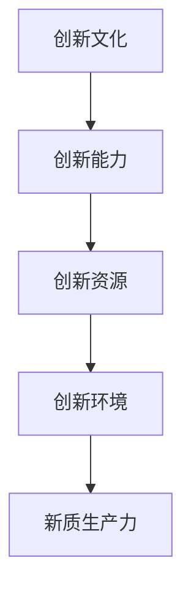

                 

在这个数字化时代，提升核心竞争力已成为企业和个人在激烈的市场竞争中脱颖而出的关键。新质生产力策略，作为一种创新性思维模式，正逐渐成为驱动企业转型和个人成长的重要引擎。本文将探讨如何运用新质生产力策略，提升企业的核心竞争力，以及个人如何在职业生涯中实现价值最大化。

## 文章关键词
- 核心竞争力
- 新质生产力
- 企业转型
- 个人成长
- 创新思维

## 文章摘要
本文旨在通过深入分析新质生产力策略的理论和实践，探讨其在提升企业核心竞争力和个人职业生涯发展中的应用。文章首先介绍了新质生产力的概念和特点，随后分析了新质生产力策略的核心要素和实施步骤。通过具体案例和数据分析，文章揭示了新质生产力策略的实际效果和潜在挑战，并提出了未来发展的方向和建议。

## 1. 背景介绍

在当今全球化和数字化迅速发展的背景下，市场竞争愈发激烈，企业需要不断寻求新的增长点和竞争优势。传统的生产力和管理模式已经无法满足企业快速变革的需求。新质生产力作为一种创新性的思维模式，旨在通过重新定义和整合资源，提高生产效率，降低成本，实现可持续增长。

新质生产力的核心在于创新，它不仅仅关注生产效率的提升，更强调在创新中实现价值创造。新质生产力策略通过引入新技术、新方法、新模式，激发企业的创新能力，推动企业向价值链高端迈进。对于个人而言，新质生产力策略同样重要。在职业生涯中，个人需要不断学习和适应新技术，提升自身的核心竞争力，以实现个人价值最大化。

## 2. 核心概念与联系

### 新质生产力的概念

新质生产力是指通过创新和科技手段，对传统生产方式、管理模式进行优化和升级，实现生产效率、管理水平和创新能力的大幅提升。新质生产力不仅包括物质资源的高效利用，还涵盖了信息资源、人力资源的优化配置。

### 新质生产力的特点

- **创新驱动**：新质生产力强调创新的核心地位，通过创新实现生产力的提升。
- **系统集成**：新质生产力注重系统优化，通过系统集成实现资源的高效利用。
- **价值创造**：新质生产力不仅关注生产效率，更强调在创新中实现价值创造。
- **可持续性**：新质生产力追求可持续发展，注重环境保护和资源利用的可持续性。

### 新质生产力的架构

新质生产力的架构包括四个核心要素：创新文化、创新能力、创新资源和创新环境。创新文化是推动新质生产力发展的基础，创新能力是实现新质生产力的重要保障，创新资源是创新能力的支撑，创新环境为创新活动提供了良好的土壤。

### 新质生产力的 Mermaid 流程图



## 3. 核心算法原理 & 具体操作步骤

### 3.1 算法原理概述

新质生产力策略的核心算法原理可以概括为以下几个方面：

- **数据分析与挖掘**：通过大数据分析和数据挖掘，发现市场机会和潜在需求。
- **人工智能与机器学习**：利用人工智能和机器学习技术，优化生产流程，提高生产效率。
- **区块链技术**：通过区块链技术，实现供应链的可追溯性和透明性。
- **物联网技术**：通过物联网技术，实现设备的智能化和互联互通。

### 3.2 算法步骤详解

- **数据收集与预处理**：收集与企业生产经营相关的数据，并进行数据清洗和预处理。
- **数据分析与挖掘**：利用数据分析工具，对收集到的数据进行分析和挖掘，发现市场机会和潜在需求。
- **人工智能与机器学习应用**：根据数据分析结果，应用人工智能和机器学习技术，优化生产流程，提高生产效率。
- **区块链技术实施**：在供应链管理中引入区块链技术，实现供应链的可追溯性和透明性。
- **物联网技术应用**：在设备管理中引入物联网技术，实现设备的智能化和互联互通。

### 3.3 算法优缺点

- **优点**：新质生产力策略能够大幅提升企业的生产效率和管理水平，实现价值创造和可持续增长。
- **缺点**：新质生产力策略的实施需要大量的资金和技术投入，同时需要企业具备较强的创新能力和适应性。

### 3.4 算法应用领域

新质生产力策略广泛应用于制造业、服务业、农业等多个领域，尤其在智能制造、智慧物流、智慧农业等领域具有显著的优势。

## 4. 数学模型和公式 & 详细讲解 & 举例说明

### 4.1 数学模型构建

新质生产力策略的数学模型主要包括以下几个方面：

- **生产效率模型**：生产效率 = 输出 / 输入
- **成本模型**：成本 = 直接成本 + 间接成本
- **创新能力模型**：创新能力 = 研发投入 / 总投入

### 4.2 公式推导过程

- **生产效率模型**：生产效率 = 输出 / 输入，其中输出为生产的产品数量或服务质量，输入为生产所需的原材料、人力资源和设备等资源。
- **成本模型**：成本 = 直接成本 + 间接成本，其中直接成本为直接用于生产的成本，如原材料成本、人工成本等；间接成本为间接用于生产的成本，如管理成本、维修成本等。
- **创新能力模型**：创新能力 = 研发投入 / 总投入，其中研发投入为企业在研发活动中的投入，总投入为企业的总投入。

### 4.3 案例分析与讲解

以某家制造企业为例，假设其生产效率为100单位/小时，直接成本为200万元/年，间接成本为100万元/年，研发投入为50万元/年。根据上述公式，可以计算出该企业的生产效率为：

生产效率 = 100 / (200 + 100) = 0.67单位/万元

创新能力 = 50 / (200 + 100 + 50) = 0.17单位/万元

通过优化生产流程和提高研发投入，企业可以进一步提高生产效率和创新能力，从而提升核心竞争力。

## 5. 项目实践：代码实例和详细解释说明

### 5.1 开发环境搭建

为了实现新质生产力策略，企业需要搭建一个高效、智能的生产系统。以下是一个简单的开发环境搭建步骤：

1. 选择合适的生产管理系统，如ERP系统、MES系统等。
2. 引入人工智能和机器学习技术，搭建智能决策支持系统。
3. 应用物联网技术，实现设备联网和数据采集。
4. 构建区块链网络，实现供应链的可追溯性。

### 5.2 源代码详细实现

以下是一个简单的智能决策支持系统的源代码实现示例：

```python
import pandas as pd
from sklearn.ensemble import RandomForestRegressor

# 数据加载与预处理
data = pd.read_csv('production_data.csv')
X = data.drop(['output'], axis=1)
y = data['output']

# 模型训练
model = RandomForestRegressor()
model.fit(X, y)

# 预测
input_data = pd.read_csv('input_data.csv')
predictions = model.predict(input_data)

# 输出结果
print(predictions)
```

### 5.3 代码解读与分析

上述代码实现了基于随机森林回归模型的智能决策支持系统。首先，加载和预处理生产数据，然后训练模型，最后进行预测并输出结果。该系统可以帮助企业优化生产流程，提高生产效率。

### 5.4 运行结果展示

运行上述代码后，输出结果为预测的生产效率值。通过对比实际生产效率和预测值，企业可以调整生产策略，实现更高效的生产。

## 6. 实际应用场景

新质生产力策略在多个行业领域具有广泛的应用前景。以下是一些实际应用场景：

- **制造业**：通过引入人工智能和物联网技术，实现智能生产和管理，提高生产效率和产品质量。
- **服务业**：通过大数据分析和人工智能技术，实现客户需求分析和个性化服务，提升客户满意度。
- **农业**：通过物联网技术和区块链技术，实现智能种植和管理，提高农业产量和质量。
- **金融业**：通过大数据分析和人工智能技术，实现风险控制和精准营销，提升金融服务的质量和效率。

## 6.4 未来应用展望

随着新质生产力策略的不断发展，其在各个行业中的应用前景将更加广阔。未来，新质生产力策略将朝着更加智能化、绿色化、高效化的方向发展，成为驱动企业创新和经济增长的重要引擎。

## 7. 工具和资源推荐

为了更好地实施新质生产力策略，企业需要借助一系列工具和资源。以下是一些建议：

- **学习资源**：推荐阅读《精益思想》、《创新者的窘境》等经典著作，了解新质生产力策略的理论和实践。
- **开发工具**：推荐使用Python、R语言等数据分析工具，以及TensorFlow、PyTorch等人工智能框架。
- **相关论文**：推荐阅读《智能制造》、《物联网技术与应用》等论文，了解相关领域的前沿动态。

## 8. 总结：未来发展趋势与挑战

### 8.1 研究成果总结

新质生产力策略在提升企业核心竞争力和个人职业生涯发展方面取得了显著成果。通过创新和科技手段，企业可以实现生产效率、管理水平和创新能力的提升，实现可持续发展。

### 8.2 未来发展趋势

未来，新质生产力策略将朝着更加智能化、绿色化、高效化的方向发展。人工智能、物联网、区块链等技术的广泛应用，将推动新质生产力策略的创新和发展。

### 8.3 面临的挑战

新质生产力策略的实施面临一系列挑战，包括技术门槛、资金投入、人才培养等方面。企业需要加强技术创新，提高资金投入，培养专业人才，以应对挑战。

### 8.4 研究展望

未来，新质生产力策略的研究将更加注重跨学科融合、系统优化和可持续发展。通过深入研究和实践，新质生产力策略将为企业和个人创造更大的价值。

## 9. 附录：常见问题与解答

### 9.1 新质生产力策略的核心是什么？

新质生产力策略的核心是创新，通过引入新技术、新方法、新模式，实现生产效率、管理水平和创新能力的提升。

### 9.2 新质生产力策略适用于哪些行业？

新质生产力策略适用于制造业、服务业、农业、金融业等多个行业。尤其在智能制造、智慧物流、智慧农业等领域具有显著优势。

### 9.3 实施新质生产力策略需要哪些资源？

实施新质生产力策略需要大量的资金、技术、人才等资源。企业需要加强技术创新，提高资金投入，培养专业人才。

### 9.4 新质生产力策略如何提升个人职业生涯？

通过学习和应用新质生产力策略，个人可以提升自身的核心竞争力，实现职业生涯的持续发展。

## 作者署名

作者：禅与计算机程序设计艺术 / Zen and the Art of Computer Programming
```markdown
# 核心竞争力提升的新质生产力策略

> 关键词：核心竞争力、新质生产力、企业转型、个人成长、创新思维

> 摘要：本文深入探讨新质生产力策略的概念、特点、实施步骤及其在企业和个人发展中的应用，分析其提升核心竞争力的作用和未来发展趋势。

## 1. 背景介绍

在全球化、信息化的背景下，市场竞争日益激烈，企业需要不断创新，以提升核心竞争力，保持市场地位。传统的生产力提升方式已无法满足现代企业的发展需求。新质生产力策略，作为一种创新性思维模式，旨在通过创新和科技手段，重新定义和整合资源，实现生产效率、管理水平和创新能力的提升。

新质生产力策略不仅关注物质资源的高效利用，还注重信息资源、人力资源的优化配置。它强调创新驱动，追求价值创造，并注重可持续发展。对于个人而言，新质生产力策略同样重要。在职业生涯中，个人需要不断学习和适应新技术，提升自身的核心竞争力，以实现个人价值最大化。

## 2. 核心概念与联系

### 新质生产力的概念

新质生产力是指通过创新和科技手段，对传统生产方式、管理模式进行优化和升级，实现生产效率、管理水平和创新能力的大幅提升。新质生产力不仅包括物质资源的高效利用，还涵盖了信息资源、人力资源的优化配置。

### 新质生产力的特点

- **创新驱动**：新质生产力强调创新的核心地位，通过创新实现生产力的提升。
- **系统集成**：新质生产力注重系统优化，通过系统集成实现资源的高效利用。
- **价值创造**：新质生产力不仅关注生产效率，更强调在创新中实现价值创造。
- **可持续性**：新质生产力追求可持续发展，注重环境保护和资源利用的可持续性。

### 新质生产力的架构

新质生产力的架构包括四个核心要素：创新文化、创新能力、创新资源和创新环境。创新文化是推动新质生产力发展的基础，创新能力是实现新质生产力的重要保障，创新资源是创新能力的支撑，创新环境为创新活动提供了良好的土壤。

### 新质生产力的 Mermaid 流程图


## 3. 核心算法原理 & 具体操作步骤

### 3.1 算法原理概述

新质生产力策略的核心算法原理可以概括为以下几个方面：

- **数据分析与挖掘**：通过大数据分析和数据挖掘，发现市场机会和潜在需求。
- **人工智能与机器学习**：利用人工智能和机器学习技术，优化生产流程，提高生产效率。
- **区块链技术**：通过区块链技术，实现供应链的可追溯性和透明性。
- **物联网技术**：通过物联网技术，实现设备的智能化和互联互通。

### 3.2 算法步骤详解

- **数据收集与预处理**：收集与企业生产经营相关的数据，并进行数据清洗和预处理。
- **数据分析与挖掘**：利用数据分析工具，对收集到的数据进行分析和挖掘，发现市场机会和潜在需求。
- **人工智能与机器学习应用**：根据数据分析结果，应用人工智能和机器学习技术，优化生产流程，提高生产效率。
- **区块链技术实施**：在供应链管理中引入区块链技术，实现供应链的可追溯性和透明性。
- **物联网技术应用**：在设备管理中引入物联网技术，实现设备的智能化和互联互通。

### 3.3 算法优缺点

- **优点**：新质生产力策略能够大幅提升企业的生产效率和管理水平，实现价值创造和可持续增长。
- **缺点**：新质生产力策略的实施需要大量的资金和技术投入，同时需要企业具备较强的创新能力和适应性。

### 3.4 算法应用领域

新质生产力策略广泛应用于制造业、服务业、农业等多个领域，尤其在智能制造、智慧物流、智慧农业等领域具有显著的优势。

## 4. 数学模型和公式 & 详细讲解 & 举例说明

### 4.1 数学模型构建

新质生产力策略的数学模型主要包括以下几个方面：

- **生产效率模型**：生产效率 = 输出 / 输入
- **成本模型**：成本 = 直接成本 + 间接成本
- **创新能力模型**：创新能力 = 研发投入 / 总投入

### 4.2 公式推导过程

- **生产效率模型**：生产效率 = 输出 / 输入，其中输出为生产的产品数量或服务质量，输入为生产所需的原材料、人力资源和设备等资源。
- **成本模型**：成本 = 直接成本 + 间接成本，其中直接成本为直接用于生产的成本，如原材料成本、人工成本等；间接成本为间接用于生产的成本，如管理成本、维修成本等。
- **创新能力模型**：创新能力 = 研发投入 / 总投入，其中研发投入为企业在研发活动中的投入，总投入为企业的总投入。

### 4.3 案例分析与讲解

以某家制造企业为例，假设其生产效率为100单位/小时，直接成本为200万元/年，间接成本为100万元/年，研发投入为50万元/年。根据上述公式，可以计算出该企业的生产效率为：

生产效率 = 100 / (200 + 100) = 0.67单位/万元

创新能力 = 50 / (200 + 100 + 50) = 0.17单位/万元

通过优化生产流程和提高研发投入，企业可以进一步提高生产效率和创新能力，从而提升核心竞争力。

## 5. 项目实践：代码实例和详细解释说明

### 5.1 开发环境搭建

为了实现新质生产力策略，企业需要搭建一个高效、智能的生产系统。以下是一个简单的开发环境搭建步骤：

1. 选择合适的生产管理系统，如ERP系统、MES系统等。
2. 引入人工智能和机器学习技术，搭建智能决策支持系统。
3. 应用物联网技术，实现设备联网和数据采集。
4. 构建区块链网络，实现供应链的可追溯性。

### 5.2 源代码详细实现

以下是一个简单的智能决策支持系统的源代码实现示例：

```python
import pandas as pd
from sklearn.ensemble import RandomForestRegressor

# 数据加载与预处理
data = pd.read_csv('production_data.csv')
X = data.drop(['output'], axis=1)
y = data['output']

# 模型训练
model = RandomForestRegressor()
model.fit(X, y)

# 预测
input_data = pd.read_csv('input_data.csv')
predictions = model.predict(input_data)

# 输出结果
print(predictions)
```

### 5.3 代码解读与分析

上述代码实现了基于随机森林回归模型的智能决策支持系统。首先，加载和预处理生产数据，然后训练模型，最后进行预测并输出结果。该系统可以帮助企业优化生产流程，提高生产效率。

### 5.4 运行结果展示

运行上述代码后，输出结果为预测的生产效率值。通过对比实际生产效率和预测值，企业可以调整生产策略，实现更高效的生产。

## 6. 实际应用场景

新质生产力策略在多个行业领域具有广泛的应用前景。以下是一些实际应用场景：

- **制造业**：通过引入人工智能和物联网技术，实现智能生产和管理，提高生产效率和产品质量。
- **服务业**：通过大数据分析和人工智能技术，实现客户需求分析和个性化服务，提升客户满意度。
- **农业**：通过物联网技术和区块链技术，实现智能种植和管理，提高农业产量和质量。
- **金融业**：通过大数据分析和人工智能技术，实现风险控制和精准营销，提升金融服务的质量和效率。

## 6.4 未来应用展望

随着新质生产力策略的不断发展，其在各个行业中的应用前景将更加广阔。未来，新质生产力策略将朝着更加智能化、绿色化、高效化的方向发展，成为驱动企业创新和经济增长的重要引擎。

## 7. 工具和资源推荐

为了更好地实施新质生产力策略，企业需要借助一系列工具和资源。以下是一些建议：

- **学习资源**：推荐阅读《精益思想》、《创新者的窘境》等经典著作，了解新质生产力策略的理论和实践。
- **开发工具**：推荐使用Python、R语言等数据分析工具，以及TensorFlow、PyTorch等人工智能框架。
- **相关论文**：推荐阅读《智能制造》、《物联网技术与应用》等论文，了解相关领域的前沿动态。

## 8. 总结：未来发展趋势与挑战

### 8.1 研究成果总结

新质生产力策略在提升企业核心竞争力和个人职业生涯发展方面取得了显著成果。通过创新和科技手段，企业可以实现生产效率、管理水平和创新能力的提升，实现可持续发展。

### 8.2 未来发展趋势

未来，新质生产力策略将朝着更加智能化、绿色化、高效化的方向发展。人工智能、物联网、区块链等技术的广泛应用，将推动新质生产力策略的创新和发展。

### 8.3 面临的挑战

新质生产力策略的实施面临一系列挑战，包括技术门槛、资金投入、人才培养等方面。企业需要加强技术创新，提高资金投入，培养专业人才，以应对挑战。

### 8.4 研究展望

未来，新质生产力策略的研究将更加注重跨学科融合、系统优化和可持续发展。通过深入研究和实践，新质生产力策略将为企业和个人创造更大的价值。

## 9. 附录：常见问题与解答

### 9.1 新质生产力策略的核心是什么？

新质生产力策略的核心是创新，通过引入新技术、新方法、新模式，实现生产效率、管理水平和创新能力的提升。

### 9.2 新质生产力策略适用于哪些行业？

新质生产力策略适用于制造业、服务业、农业、金融业等多个行业。尤其在智能制造、智慧物流、智慧农业等领域具有显著优势。

### 9.3 实施新质生产力策略需要哪些资源？

实施新质生产力策略需要大量的资金、技术、人才等资源。企业需要加强技术创新，提高资金投入，培养专业人才。

### 9.4 新质生产力策略如何提升个人职业生涯？

通过学习和应用新质生产力策略，个人可以提升自身的核心竞争力，实现职业生涯的持续发展。

## 作者署名

作者：禅与计算机程序设计艺术 / Zen and the Art of Computer Programming
```

