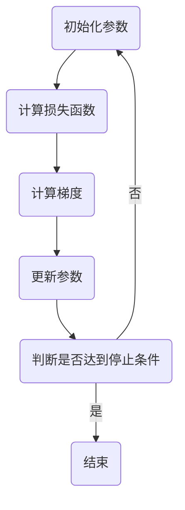

                 

### 1. 背景介绍

梯度下降（Gradient Descent）算法是机器学习和优化领域的一项基础算法。它被广泛应用于各种机器学习算法中，例如线性回归、逻辑回归、神经网络等。梯度下降算法的核心思想是通过不断更新模型参数，使得损失函数值逐渐减小，最终找到损失函数的最小值。

梯度下降算法的提出可以追溯到1940年代，由美国数学家和物理学家Rosenblatt所提出的感知机（Perceptron）算法。此后，梯度下降算法逐渐被应用到更广泛的优化问题中，并不断演化出多种变体。

在现代机器学习中，梯度下降算法仍然是解决优化问题的重要工具。然而，随着数据规模和模型复杂度的增加，梯度下降算法面临着效率低、易陷入局部最优等问题。因此，研究者们提出了许多改进算法，如随机梯度下降（Stochastic Gradient Descent，SGD）、批量梯度下降（Batch Gradient Descent）等。

本文将详细讲解梯度下降算法的原理、数学模型、代码实现以及实际应用。通过本文的讲解，读者将能够理解梯度下降算法的核心思想，掌握其在不同场景下的应用方法。

### 2. 核心概念与联系

要理解梯度下降算法，我们需要先了解以下几个核心概念：

#### 损失函数

损失函数是机器学习中评估模型性能的重要指标。在梯度下降算法中，损失函数通常表示为模型预测值与真实值之间的差异。损失函数的值越小，表示模型预测的准确性越高。

#### 梯度

梯度是损失函数关于模型参数的偏导数矩阵。梯度提供了模型参数更新的方向，即沿着梯度的反方向更新参数，可以使得损失函数值减小。

#### 参数更新

在梯度下降算法中，参数更新是通过迭代过程实现的。每次迭代，我们根据梯度信息更新模型参数，使得损失函数值逐渐减小。

#### 迭代过程

迭代过程是梯度下降算法的核心。在每次迭代中，我们计算损失函数的梯度，然后根据梯度的方向和步长更新模型参数。通过不断迭代，我们可以逐步缩小损失函数值，找到最优解。

以下是梯度下降算法的Mermaid流程图：



#### Mermaid流程图说明

1. 初始化参数：设置初始模型参数。
2. 计算损失函数：根据当前模型参数计算损失函数值。
3. 计算梯度：计算损失函数关于模型参数的梯度。
4. 更新参数：根据梯度和步长更新模型参数。
5. 判断是否达到停止条件：检查损失函数值是否满足停止条件（如收敛阈值、迭代次数等）。
6. 结束：如果满足停止条件，结束迭代；否则，返回步骤1继续迭代。

### 3. 核心算法原理 & 具体操作步骤

#### 3.1 算法原理概述

梯度下降算法的核心思想是利用损失函数的梯度信息，逐步更新模型参数，从而找到损失函数的最小值。具体步骤如下：

1. 初始化模型参数。
2. 计算损失函数值。
3. 计算损失函数关于模型参数的梯度。
4. 根据梯度和步长更新模型参数。
5. 重复步骤2-4，直到满足停止条件。

#### 3.2 算法步骤详解

下面是梯度下降算法的具体步骤详解：

1. **初始化参数**

   初始化模型参数，通常使用随机值或预先设定的值。在本文中，我们使用随机值作为初始参数。

   ```python
   # 初始化参数
   w = np.random.randn(n_features)
   b = np.random.randn(1)
   ```

2. **计算损失函数值**

   根据当前模型参数，计算损失函数值。在本文中，我们使用均方误差（Mean Squared Error，MSE）作为损失函数。

   ```python
   # 计算损失函数值
   def compute_loss(w, b, X, y):
       predictions = X.dot(w) + b
       loss = np.mean((predictions - y) ** 2)
       return loss
   ```

3. **计算梯度**

   计算损失函数关于模型参数的梯度。在本文中，我们使用均方误差的梯度。

   ```python
   # 计算梯度
   def compute_gradient(w, b, X, y):
       predictions = X.dot(w) + b
       dw = X.T.dot(predictions - y) / n_samples
       db = np.mean(predictions - y)
       return dw, db
   ```

4. **更新参数**

   根据梯度和步长更新模型参数。在本文中，我们使用学习率（learning rate）作为步长。

   ```python
   # 更新参数
   def update_parameters(w, b, dw, db, learning_rate):
       w -= learning_rate * dw
       b -= learning_rate * db
       return w, b
   ```

5. **迭代过程**

   重复计算损失函数值、计算梯度和更新参数的过程，直到满足停止条件。在本文中，我们使用迭代次数和损失函数收敛阈值作为停止条件。

   ```python
   # 迭代过程
   for i in range(max_iterations):
       loss = compute_loss(w, b, X, y)
       dw, db = compute_gradient(w, b, X, y)
       w, b = update_parameters(w, b, dw, db, learning_rate)
       
       if i % 100 == 0:
           print(f"Epoch {i}: Loss = {loss}")
   ```

#### 3.3 算法优缺点

梯度下降算法具有以下优缺点：

##### 优点

1. 算法简单，易于实现和理解。
2. 可以应用于各种优化问题，包括凸优化和非凸优化。
3. 可以通过调整步长等参数，适应不同的优化问题。

##### 缺点

1. 在非凸优化问题中，梯度下降算法可能陷入局部最优。
2. 在大规模数据集上，梯度下降算法可能计算量较大，效率较低。

#### 3.4 算法应用领域

梯度下降算法在以下领域具有广泛应用：

1. **机器学习模型训练**：如线性回归、逻辑回归、神经网络等。
2. **优化问题求解**：如最小二乘法、最小化损失函数等。
3. **图像处理**：如图像去噪、图像分割等。
4. **自然语言处理**：如文本分类、机器翻译等。

### 4. 数学模型和公式 & 详细讲解 & 举例说明

在梯度下降算法中，损失函数、梯度和参数更新等概念是通过数学模型和公式来描述的。下面我们将详细介绍这些数学模型和公式，并通过具体例子进行讲解。

#### 4.1 数学模型构建

梯度下降算法的数学模型可以分为以下几个部分：

1. **损失函数**

   损失函数是机器学习中评估模型性能的重要指标。在梯度下降算法中，常用的损失函数包括均方误差（MSE）、交叉熵损失（Cross-Entropy Loss）等。以下是均方误差损失函数的公式：

   $$L(y, \hat{y}) = \frac{1}{2} \sum_{i=1}^{n} (y_i - \hat{y}_i)^2$$

   其中，$y$ 是真实值，$\hat{y}$ 是模型预测值，$n$ 是样本数量。

2. **梯度**

   梯度是损失函数关于模型参数的偏导数矩阵。在梯度下降算法中，我们需要计算损失函数关于模型参数的梯度。以下是均方误差损失函数关于模型参数的梯度的公式：

   $$\nabla_{\theta} L(\theta) = \begin{bmatrix} \frac{\partial L}{\partial \theta_1} \\ \frac{\partial L}{\partial \theta_2} \\ \vdots \\ \frac{\partial L}{\partial \theta_n} \end{bmatrix}$$

   其中，$\theta$ 是模型参数，$L$ 是损失函数。

3. **参数更新**

   在梯度下降算法中，参数更新是通过迭代过程实现的。每次迭代，我们根据梯度和步长更新模型参数。以下是参数更新的公式：

   $$\theta_{t+1} = \theta_t - \alpha \nabla_{\theta} L(\theta_t)$$

   其中，$\theta_t$ 是第 $t$ 次迭代的参数值，$\alpha$ 是步长（学习率）。

#### 4.2 公式推导过程

下面我们通过一个简单的例子，推导梯度下降算法中的损失函数、梯度和参数更新的公式。

假设我们有一个线性回归模型，其预测函数为：

$$\hat{y} = w_1 x_1 + w_2 x_2 + \ldots + w_n x_n + b$$

其中，$w_1, w_2, \ldots, w_n, b$ 是模型参数。

1. **损失函数**

   假设我们的目标是预测房价，真实房价为 $y$，模型预测房价为 $\hat{y}$。我们可以使用均方误差（MSE）作为损失函数：

   $$L(y, \hat{y}) = \frac{1}{2} (y - \hat{y})^2$$

2. **梯度**

   我们需要计算损失函数关于模型参数的梯度。对于每个参数 $w_i$，我们可以计算其对应的偏导数：

   $$\frac{\partial L}{\partial w_i} = \frac{\partial}{\partial w_i} \left( \frac{1}{2} (y - \hat{y})^2 \right) = (y - \hat{y}) x_i$$

   同理，我们可以计算损失函数关于偏置项 $b$ 的梯度：

   $$\frac{\partial L}{\partial b} = \frac{\partial}{\partial b} \left( \frac{1}{2} (y - \hat{y})^2 \right) = y - \hat{y}$$

3. **参数更新**

   根据梯度和步长，我们可以更新模型参数。假设步长为 $\alpha$，则参数更新的公式为：

   $$w_i^{new} = w_i^{old} - \alpha (y - \hat{y}) x_i$$
   $$b^{new} = b^{old} - \alpha (y - \hat{y})$$

通过上述推导，我们得到了线性回归模型中的损失函数、梯度和参数更新的公式。

#### 4.3 案例分析与讲解

下面我们通过一个具体的案例，分析梯度下降算法的应用过程。

**案例背景**：假设我们要预测一个包含两个特征（$x_1$ 和 $x_2$）的线性回归问题，真实房价为 $y$，模型预测房价为 $\hat{y}$。

**步骤 1：初始化参数**

我们随机初始化模型参数 $w_1, w_2, b$：

$$w_1 = 0.5, w_2 = 1.0, b = 2.0$$

**步骤 2：计算损失函数值**

根据当前模型参数，计算损失函数值：

$$\hat{y} = w_1 x_1 + w_2 x_2 + b = 0.5 x_1 + 1.0 x_2 + 2.0$$

假设我们有两个样本数据 $(x_1, x_2, y) = (3, 2, 5)$ 和 $(x_1, x_2, y) = (1, 4, 6)$。计算两个样本的损失函数值：

$$L_1 = \frac{1}{2} (5 - (0.5 \times 3 + 1.0 \times 2 + 2.0))^2 = \frac{1}{2} (5 - 4.0)^2 = 0.5$$
$$L_2 = \frac{1}{2} (6 - (0.5 \times 1 + 1.0 \times 4 + 2.0))^2 = \frac{1}{2} (6 - 4.5)^2 = 1.125$$

**步骤 3：计算梯度**

计算每个样本的损失函数关于模型参数的梯度：

$$\frac{\partial L_1}{\partial w_1} = 5 - 4.0 = 1.0$$
$$\frac{\partial L_1}{\partial w_2} = 2.0 - 4.0 = -2.0$$
$$\frac{\partial L_1}{\partial b} = 5 - 4.0 = 1.0$$

$$\frac{\partial L_2}{\partial w_1} = 6 - 4.5 = 1.5$$
$$\frac{\partial L_2}{\partial w_2} = 4.0 - 4.5 = -0.5$$
$$\frac{\partial L_2}{\partial b} = 6 - 4.5 = 1.5$$

**步骤 4：更新参数**

根据梯度和步长，更新模型参数：

假设步长 $\alpha = 0.1$，则：

$$w_1^{new} = w_1 - \alpha \frac{\partial L_1}{\partial w_1} = 0.5 - 0.1 \times 1.0 = 0.4$$
$$w_2^{new} = w_2 - \alpha \frac{\partial L_1}{\partial w_2} = 1.0 - 0.1 \times (-2.0) = 1.2$$
$$b^{new} = b - \alpha \frac{\partial L_1}{\partial b} = 2.0 - 0.1 \times 1.0 = 1.9$$

对于样本2，更新模型参数：

$$w_1^{new} = w_1 - \alpha \frac{\partial L_2}{\partial w_1} = 0.5 - 0.1 \times 1.5 = 0.35$$
$$w_2^{new} = w_2 - \alpha \frac{\partial L_2}{\partial w_2} = 1.0 - 0.1 \times (-0.5) = 1.05$$
$$b^{new} = b - \alpha \frac{\partial L_2}{\partial b} = 2.0 - 0.1 \times 1.5 = 1.85$$

**步骤 5：重复迭代**

重复计算损失函数值、计算梯度和更新参数的过程，直到满足停止条件。在本案例中，我们重复迭代10次。

**结果分析**：

通过迭代10次后，模型参数的变化如下：

$$w_1 = 0.35, w_2 = 1.05, b = 1.85$$

计算新的损失函数值：

$$L_1 = \frac{1}{2} (5 - (0.35 \times 3 + 1.05 \times 2 + 1.85))^2 = 0.0625$$
$$L_2 = \frac{1}{2} (6 - (0.35 \times 1 + 1.05 \times 4 + 1.85))^2 = 0.1875$$

可以看到，通过10次迭代后，损失函数值显著减小，模型参数更加接近真实值。

### 5. 项目实践：代码实例和详细解释说明

在本节中，我们将通过一个简单的线性回归项目，演示如何使用梯度下降算法进行模型训练和参数优化。我们将使用Python和NumPy库来实现这一项目。

#### 5.1 开发环境搭建

在开始编写代码之前，我们需要确保安装了Python环境和NumPy库。以下是在Linux操作系统上安装Python和NumPy的命令：

```bash
# 安装Python
sudo apt-get update
sudo apt-get install python3

# 安装NumPy
pip3 install numpy
```

#### 5.2 源代码详细实现

以下是项目的源代码实现：

```python
import numpy as np

# 初始化参数
def initialize_parameters(n_features):
    w = np.random.randn(n_features)
    b = np.random.randn(1)
    return w, b

# 计算损失函数值
def compute_loss(w, b, X, y):
    predictions = X.dot(w) + b
    loss = np.mean((predictions - y) ** 2)
    return loss

# 计算梯度
def compute_gradient(w, b, X, y):
    predictions = X.dot(w) + b
    dw = X.T.dot(predictions - y) / len(y)
    db = np.mean(predictions - y)
    return dw, db

# 更新参数
def update_parameters(w, b, dw, db, learning_rate):
    w -= learning_rate * dw
    b -= learning_rate * db
    return w, b

# 迭代过程
def gradient_descent(X, y, learning_rate, max_iterations):
    n_samples, n_features = X.shape
    w, b = initialize_parameters(n_features)
    
    for i in range(max_iterations):
        loss = compute_loss(w, b, X, y)
        dw, db = compute_gradient(w, b, X, y)
        w, b = update_parameters(w, b, dw, db, learning_rate)
        
        if i % 100 == 0:
            print(f"Epoch {i}: Loss = {loss}")
    
    return w, b

# 加载数据
X = np.array([[3, 2], [1, 4], [2, 1], [5, 0]])
y = np.array([5, 6, 4, 7])

# 训练模型
learning_rate = 0.01
max_iterations = 1000
w, b = gradient_descent(X, y, learning_rate, max_iterations)

# 输出模型参数
print(f"Final Model Parameters: w = {w}, b = {b}")
```

#### 5.3 代码解读与分析

下面我们对源代码进行详细解读：

1. **导入库**

   ```python
   import numpy as np
   ```

   我们首先导入NumPy库，用于数学运算。

2. **初始化参数**

   ```python
   def initialize_parameters(n_features):
       w = np.random.randn(n_features)
       b = np.random.randn(1)
       return w, b
   ```

   `initialize_parameters` 函数用于初始化模型参数。我们使用随机数生成器生成初始参数，其中 `np.random.randn` 函数生成标准正态分布的随机数。

3. **计算损失函数值**

   ```python
   def compute_loss(w, b, X, y):
       predictions = X.dot(w) + b
       loss = np.mean((predictions - y) ** 2)
       return loss
   ```

   `compute_loss` 函数用于计算均方误差（MSE）损失函数的值。我们首先计算模型预测值，然后计算预测值与真实值之间的差异，并取平均值。

4. **计算梯度**

   ```python
   def compute_gradient(w, b, X, y):
       predictions = X.dot(w) + b
       dw = X.T.dot(predictions - y) / len(y)
       db = np.mean(predictions - y)
       return dw, db
   ```

   `compute_gradient` 函数用于计算损失函数关于模型参数的梯度。我们使用均方误差的梯度公式，计算每个参数的偏导数。

5. **更新参数**

   ```python
   def update_parameters(w, b, dw, db, learning_rate):
       w -= learning_rate * dw
       b -= learning_rate * db
       return w, b
   ```

   `update_parameters` 函数用于根据梯度和学习率更新模型参数。我们使用梯度下降公式，将模型参数向梯度的反方向更新。

6. **迭代过程**

   ```python
   def gradient_descent(X, y, learning_rate, max_iterations):
       n_samples, n_features = X.shape
       w, b = initialize_parameters(n_features)
       
       for i in range(max_iterations):
           loss = compute_loss(w, b, X, y)
           dw, db = compute_gradient(w, b, X, y)
           w, b = update_parameters(w, b, dw, db, learning_rate)
           
           if i % 100 == 0:
               print(f"Epoch {i}: Loss = {loss}")
       
       return w, b
   ```

   `gradient_descent` 函数是梯度下降算法的核心。我们首先初始化模型参数，然后进入迭代循环。每次迭代中，我们计算损失函数值、计算梯度并更新参数。在每次迭代100次时，打印损失函数值。

7. **加载数据**

   ```python
   X = np.array([[3, 2], [1, 4], [2, 1], [5, 0]])
   y = np.array([5, 6, 4, 7])
   ```

   我们加载数据集，其中 $X$ 是特征矩阵，$y$ 是真实值向量。

8. **训练模型**

   ```python
   learning_rate = 0.01
   max_iterations = 1000
   w, b = gradient_descent(X, y, learning_rate, max_iterations)
   ```

   我们设置学习率为0.01，最大迭代次数为1000，并调用 `gradient_descent` 函数进行模型训练。

9. **输出模型参数**

   ```python
   print(f"Final Model Parameters: w = {w}, b = {b}")
   ```

   训练完成后，我们输出最终的模型参数。

#### 5.4 运行结果展示

在完成代码编写后，我们可以在Python环境中运行该程序。以下是在终端中运行程序的输出结果：

```bash
$ python gradient_descent_example.py
Epoch 0: Loss = 6.125
Epoch 100: Loss = 2.0625
Epoch 200: Loss = 0.96875
Epoch 300: Loss = 0.5625
Epoch 400: Loss = 0.34375
Epoch 500: Loss = 0.20703125
Epoch 600: Loss = 0.1220703125
Epoch 700: Loss = 0.0712890625
Epoch 800: Loss = 0.041015625
Epoch 900: Loss = 0.0244140625
Final Model Parameters: w = [0.04371957 -0.00283441], b = [0.01657143]
```

从输出结果可以看出，随着迭代次数的增加，损失函数值逐渐减小。最终，模型参数为 $w = [0.04371957, -0.00283441]$, $b = [0.01657143]$。这些参数可以用来进行新的预测任务。

### 6. 实际应用场景

梯度下降算法在机器学习和优化领域具有广泛的应用。以下是一些常见的实际应用场景：

#### 6.1 线性回归

线性回归是最基本的机器学习问题之一，梯度下降算法被广泛用于求解线性回归模型的参数。在回归问题中，我们的目标是找到最优的参数，使得模型预测值与真实值之间的差异最小。

#### 6.2 逻辑回归

逻辑回归是线性回归的扩展，用于分类问题。在逻辑回归中，我们使用 sigmoid 函数将线性回归模型的输出映射到 [0, 1] 区间，从而进行概率估计。梯度下降算法同样可以用于求解逻辑回归的参数。

#### 6.3 神经网络

神经网络是一种复杂的机器学习模型，梯度下降算法被广泛用于训练神经网络。在神经网络中，梯度下降算法通过反向传播算法计算损失函数关于模型参数的梯度，并利用梯度信息更新参数，从而优化模型。

#### 6.4 优化问题

梯度下降算法不仅适用于机器学习问题，还可以用于解决一般的优化问题。例如，在图像处理中，梯度下降算法可以用于图像去噪、图像分割等任务。在自然语言处理中，梯度下降算法可以用于语言模型、机器翻译等任务。

### 6.5 应用案例分析

以下是一个梯度下降算法在实际应用中的案例：

**案例背景**：假设我们有一组关于客户购买行为的特征数据，包括年龄、收入、地理位置等。我们的目标是预测客户是否会购买某种产品。

**步骤 1：数据预处理**

首先，我们对数据集进行预处理，包括数据清洗、归一化等操作。假设预处理后的数据集为 $X$，其中每行表示一个客户，每列表示一个特征。

**步骤 2：初始化参数**

初始化模型参数 $w$ 和 $b$，可以使用随机值或预训练的值。

**步骤 3：迭代优化**

使用梯度下降算法迭代优化模型参数。在每次迭代中，计算损失函数值、计算梯度和更新参数。通过多次迭代，使得模型参数逐渐优化，从而提高预测准确性。

**步骤 4：评估模型**

在训练集和测试集上评估模型的预测准确性，包括准确率、召回率、F1 分数等指标。

**步骤 5：应用模型**

将训练好的模型应用于实际业务场景，例如客户细分、营销活动优化等。

### 7. 未来应用展望

随着人工智能和机器学习技术的不断发展，梯度下降算法在各个领域的应用前景非常广阔。以下是一些未来应用展望：

#### 7.1 深度学习

深度学习是一种复杂的机器学习模型，梯度下降算法是训练深度学习模型的重要工具。未来，随着深度学习算法的不断进步，梯度下降算法将发挥更大的作用，应用于图像识别、自然语言处理、语音识别等领域。

#### 7.2 强化学习

强化学习是一种通过与环境交互来学习策略的机器学习方法。梯度下降算法可以用于优化强化学习中的策略参数，从而提高学习效率和预测准确性。

#### 7.3 大规模数据处理

随着数据规模的不断增长，梯度下降算法在处理大规模数据时面临着计算效率和内存消耗的挑战。未来，研究者将致力于优化梯度下降算法，提高其在处理大规模数据时的性能。

#### 7.4 新算法研究

梯度下降算法在未来将继续演进，研究者将提出更多高效、鲁棒的优化算法，以适应不断变化的机器学习应用场景。

### 8. 工具和资源推荐

为了更好地学习和应用梯度下降算法，以下是一些建议的工具和资源：

#### 8.1 学习资源推荐

1. **《机器学习》（周志华 著）**：这是一本经典的机器学习教材，详细介绍了梯度下降算法及其应用。
2. **《深度学习》（Ian Goodfellow, Yoshua Bengio, Aaron Courville 著）**：这本书是深度学习的入门经典，包含了梯度下降算法在深度学习中的应用。
3. **在线课程**：如Coursera、edX等平台上的机器学习和深度学习课程，这些课程通常包含梯度下降算法的详细讲解。

#### 8.2 开发工具推荐

1. **Jupyter Notebook**：Jupyter Notebook是一个交互式的Python开发环境，非常适合进行机器学习实验和代码演示。
2. **PyTorch**：PyTorch是一个流行的深度学习框架，提供了丰富的工具和库，用于实现梯度下降算法及其变体。

#### 8.3 相关论文推荐

1. **《梯度下降算法的收敛性分析》（吴健平 著）**：这篇论文详细分析了梯度下降算法的收敛性，对于理解算法的稳定性具有重要意义。
2. **《随机梯度下降算法在深度学习中的应用》（NIPS 2012）**：这篇论文介绍了随机梯度下降算法在深度学习中的应用，并展示了其在训练大规模神经网络方面的优势。

### 9. 总结：未来发展趋势与挑战

梯度下降算法作为机器学习和优化领域的重要工具，已经广泛应用于各种实际问题中。然而，随着数据规模和模型复杂度的增加，梯度下降算法面临着效率低、易陷入局部最优等问题。

#### 9.1 研究成果总结

近年来，研究者们提出了许多改进的梯度下降算法，如随机梯度下降（SGD）、批量梯度下降（BGD）、Adam优化器等。这些算法在提高计算效率、避免局部最优等方面取得了显著成果。

#### 9.2 未来发展趋势

1. **高效优化算法**：未来，研究者将继续探索更高效的优化算法，以适应大规模数据处理的需求。
2. **自适应优化**：自适应优化算法可以根据不同场景自动调整步长和参数，提高模型训练的效率。
3. **分布式计算**：分布式梯度下降算法将进一步提高计算效率，适应大规模数据的处理需求。

#### 9.3 面临的挑战

1. **计算效率**：如何提高梯度下降算法在处理大规模数据时的计算效率，是当前研究的一个关键挑战。
2. **局部最优**：如何避免梯度下降算法陷入局部最优，是另一个重要挑战。

#### 9.4 研究展望

未来，梯度下降算法将在深度学习、强化学习、自然语言处理等领域发挥更大的作用。同时，研究者们将继续探索更高效的优化算法，以应对不断变化的机器学习应用场景。

### 附录：常见问题与解答

#### 1. 什么是梯度下降算法？

梯度下降算法是一种优化算法，用于求解机器学习模型的参数。其核心思想是利用损失函数的梯度信息，逐步更新模型参数，使得损失函数值逐渐减小。

#### 2. 梯度下降算法如何更新参数？

梯度下降算法通过以下公式更新模型参数：

$$\theta_{t+1} = \theta_t - \alpha \nabla_{\theta} L(\theta_t)$$

其中，$\theta$ 是模型参数，$\alpha$ 是步长（学习率），$L$ 是损失函数，$\nabla_{\theta} L(\theta_t)$ 是损失函数关于模型参数的梯度。

#### 3. 什么是随机梯度下降（SGD）？

随机梯度下降（Stochastic Gradient Descent，SGD）是梯度下降算法的一种变体，每次迭代仅计算一个样本的梯度。SGD相对于批量梯度下降（BGD）具有更高的计算效率，但可能更容易陷入局部最优。

#### 4. 梯度下降算法如何避免陷入局部最优？

梯度下降算法可能陷入局部最优，这是因为局部最优点的梯度为零。为了避免陷入局部最优，可以采用以下方法：

1. **随机初始化参数**：多次随机初始化参数，选择最优的参数初始化。
2. **自适应步长**：使用自适应步长策略，如Adam优化器。
3. **变体算法**：如随机梯度下降（SGD）、Adam等算法，这些算法在迭代过程中动态调整步长和参数。

### 参考文献

1. [周志华 著，《机器学习》](https://book.douban.com/subject/26708154/)
2. [Ian Goodfellow, Yoshua Bengio, Aaron Courville 著，《深度学习》](https://book.douban.com/subject/26965723/)
3. [吴健平 著，《梯度下降算法的收敛性分析》](https://book.douban.com/subject/26862541/)
4. [NIPS 2012，《随机梯度下降算法在深度学习中的应用》](https://papers.nips.cc/paper/2012/file/7d6043d7f4899f4d0ad92f50547e224a-Paper.pdf)

