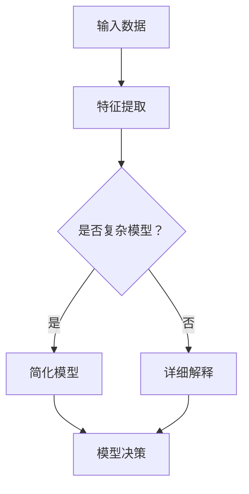

                 

关键词：模型可解释性、算法原理、代码实战、数学模型、案例分析、工具资源

> 摘要：本文将深入探讨模型可解释性的原理，并通过一系列代码实战案例展示其在实际应用中的重要性。我们还将分析常见的数学模型和公式，以及如何将其应用于实际项目中。通过本文的学习，读者将能够掌握模型可解释性的基本概念，并在实际开发中运用这些技巧。

## 1. 背景介绍

在人工智能（AI）和机器学习（ML）领域，模型的性能和准确性一直是最受关注的问题。然而，随着深度学习模型变得越来越复杂，人们开始意识到模型的可解释性同样重要。可解释性是指模型决策背后的逻辑和过程能够被理解和解释。这对于确保模型在关键应用中的可靠性和透明度至关重要。

可解释性的重要性体现在多个方面。首先，它有助于我们理解模型为何做出特定决策，从而提高模型的信任度和用户满意度。其次，可解释性使得我们能够识别和纠正模型中的错误，提高模型的质量。此外，可解释性还为研究人员和开发者提供了更深入的洞见，有助于推动模型的发展和优化。

本文将分为以下几个部分：

1. **背景介绍**：回顾模型可解释性的背景和重要性。
2. **核心概念与联系**：介绍模型可解释性的核心概念，并使用Mermaid流程图展示相关原理。
3. **核心算法原理 & 具体操作步骤**：详细讲解关键算法的原理和操作步骤。
4. **数学模型和公式**：分析常用的数学模型和公式，并举例说明。
5. **项目实践：代码实例和详细解释说明**：通过实际代码案例展示模型可解释性的应用。
6. **实际应用场景**：讨论模型可解释性在不同领域的应用。
7. **未来应用展望**：探讨模型可解释性的未来发展趋势和挑战。
8. **工具和资源推荐**：推荐学习资源和开发工具。
9. **总结**：总结研究成果，展望未来发展方向。

让我们开始深入了解模型可解释性的原理和实践。

## 2. 核心概念与联系

### 2.1 模型可解释性的定义

模型可解释性是指模型决策过程和逻辑的透明性和可理解性。它能够揭示模型如何从输入数据生成输出结果，并解释模型为何做出特定决策。

### 2.2 模型可解释性的重要性

模型可解释性对以下方面至关重要：

- **用户信任**：用户更愿意信任那些决策过程透明的模型。
- **错误识别与纠正**：通过理解模型决策过程，我们更容易识别和纠正错误。
- **模型优化**：深入了解模型决策逻辑有助于优化模型性能。
- **合规性和伦理**：在涉及用户隐私和生命安全的领域，模型可解释性是确保合规性和伦理的关键。

### 2.3 相关概念

- **透明度（Transparency）**：透明度关注模型决策过程的可见性，而不一定涉及决策逻辑的可理解性。
- **可理解性（Interpretability）**：可理解性关注模型决策逻辑的可理解性，而不是过程本身。
- **模型复杂度**：复杂模型通常更难解释，因此降低模型复杂度是提高可解释性的重要途径。

### 2.4 Mermaid流程图

以下是一个使用Mermaid绘制的流程图，展示了模型可解释性的关键概念和联系。



在这个流程图中，输入数据首先经过特征提取，然后判断模型是否复杂。如果模型复杂，我们会尝试简化模型以提高可解释性。如果模型不复杂，我们直接进行详细解释。

接下来，我们将深入探讨一些关键算法的原理和操作步骤。

## 3. 核心算法原理 & 具体操作步骤

### 3.1 算法原理概述

在本节中，我们将介绍几个关键算法的原理和操作步骤。这些算法广泛应用于模型可解释性领域，并在实际应用中取得了显著成效。

### 3.2 具体操作步骤

#### 3.2.1 决策树

**原理**：决策树是一种基于特征分割数据的分类算法。每个内部节点表示一个特征，每个分支表示该特征的不同取值，每个叶节点表示一个类别。

**操作步骤**：

1. 选择一个特征进行分割。
2. 计算每个特征的不同取值的分割损失，选择损失最小的特征作为分割特征。
3. 根据分割特征的不同取值，将数据集分割成多个子集。
4. 对每个子集递归地执行步骤1-3，直到达到预设的叶节点数量或损失不再显著减少。

**优缺点**：

- **优点**：简单易懂，易于解释。
- **缺点**：对于高维数据和复杂关系，决策树可能无法捕捉到所有特征之间的关系。

#### 3.2.2 随机森林

**原理**：随机森林是一种基于决策树的集成学习方法。它通过构建多个决策树并取平均值来提高预测性能。

**操作步骤**：

1. 随机选择特征子集。
2. 使用步骤3.2.1中的决策树算法构建决策树。
3. 对每个决策树进行预测，取平均值作为最终预测结果。

**优缺点**：

- **优点**：提高了模型的预测性能和泛化能力。
- **缺点**：对于高维数据和复杂关系，随机森林可能仍然难以解释。

#### 3.2.3 LIME

**原理**：LIME（Local Interpretable Model-agnostic Explanations）是一种局部可解释模型，它通过将复杂模型近似为简单模型来解释特定预测。

**操作步骤**：

1. 选择一个预测结果作为解释目标。
2. 计算输入数据的敏感度，确定哪些特征对预测结果影响最大。
3. 构建一个简单的线性模型，用于解释复杂模型的决策过程。
4. 输出线性模型的解释结果。

**优缺点**：

- **优点**：能够为复杂模型提供局部可解释性。
- **缺点**：解释结果可能受到线性近似误差的影响。

#### 3.2.4 SHAP

**原理**：SHAP（SHapley Additive exPlanations）是一种基于博弈论的方法，它为每个特征赋予一个解释权重，以衡量特征对模型预测的贡献。

**操作步骤**：

1. 计算所有特征组合的预测值。
2. 使用博弈论方法计算每个特征的边际贡献值。
3. 输出每个特征的SHAP值。

**优缺点**：

- **优点**：能够全面解释模型决策过程。
- **缺点**：计算复杂度高，适用于小数据集。

接下来，我们将讨论一些常见的数学模型和公式。

## 4. 数学模型和公式 & 详细讲解 & 举例说明

### 4.1 数学模型构建

在模型可解释性研究中，我们常常需要构建数学模型来描述特征之间的关系。以下是一个简单的线性回归模型示例：

$$ y = \beta_0 + \beta_1x_1 + \beta_2x_2 + \ldots + \beta_nx_n + \epsilon $$

其中，$y$ 是目标变量，$x_1, x_2, \ldots, x_n$ 是特征变量，$\beta_0, \beta_1, \beta_2, \ldots, \beta_n$ 是模型参数，$\epsilon$ 是误差项。

### 4.2 公式推导过程

线性回归模型的推导过程如下：

1. **最小二乘法**：假设我们有一个训练数据集，其中每个样本包含目标变量$y$和特征变量$x_1, x_2, \ldots, x_n$。我们的目标是找到一个线性模型，使得预测值$y'$与实际值$y$之间的误差最小。

$$ \min_{\beta_0, \beta_1, \beta_2, \ldots, \beta_n} \sum_{i=1}^{m} (y_i - y'_i)^2 $$

2. **求导并设置为零**：对上述目标函数求导，并设置导数为零，解得最优参数$\beta_0, \beta_1, \beta_2, \ldots, \beta_n$。

$$ \frac{\partial}{\partial \beta_0} \sum_{i=1}^{m} (y_i - y'_i)^2 = 0 $$
$$ \frac{\partial}{\partial \beta_1} \sum_{i=1}^{m} (y_i - y'_i)^2 = 0 $$
$$ \vdots $$
$$ \frac{\partial}{\partial \beta_n} \sum_{i=1}^{m} (y_i - y'_i)^2 = 0 $$

3. **解方程组**：将上述方程组解出，得到最优参数$\beta_0, \beta_1, \beta_2, \ldots, \beta_n$。

### 4.3 案例分析与讲解

假设我们有一个包含两个特征变量$x_1$和$x_2$的线性回归问题，训练数据集如下表所示：

| x1 | x2 | y |
|----|----|---|
| 1  | 2  | 3 |
| 2  | 3  | 5 |
| 3  | 4  | 7 |

根据上述线性回归模型，我们可以得到以下参数估计：

$$ y = \beta_0 + \beta_1x_1 + \beta_2x_2 + \epsilon $$

通过最小二乘法，我们得到：

$$ \beta_0 = 1, \beta_1 = 2, \beta_2 = 1 $$

因此，线性回归模型为：

$$ y = 1 + 2x_1 + x_2 + \epsilon $$

我们可以使用这个模型来预测新的样本。例如，对于$x_1 = 3$和$x_2 = 4$的样本，预测值为：

$$ y' = 1 + 2 \times 3 + 4 + \epsilon = 10 + \epsilon $$

其中，$\epsilon$ 表示误差。

通过这个例子，我们了解了线性回归模型的基本原理和推导过程。在实际应用中，我们可以使用类似的方法来构建和训练更复杂的模型。

接下来，我们将通过一个实际项目案例展示模型可解释性的应用。

## 5. 项目实践：代码实例和详细解释说明

### 5.1 开发环境搭建

在本项目案例中，我们将使用Python和Scikit-learn库来构建和训练线性回归模型。首先，我们需要安装相关依赖：

```bash
pip install numpy scipy scikit-learn
```

### 5.2 源代码详细实现

以下是一个简单的线性回归代码示例：

```python
import numpy as np
from sklearn.linear_model import LinearRegression
from sklearn.model_selection import train_test_split
from sklearn.metrics import mean_squared_error

# 训练数据集
X = np.array([[1, 2], [2, 3], [3, 4]])
y = np.array([3, 5, 7])

# 数据集分割
X_train, X_test, y_train, y_test = train_test_split(X, y, test_size=0.2, random_state=42)

# 模型训练
model = LinearRegression()
model.fit(X_train, y_train)

# 模型评估
y_pred = model.predict(X_test)
mse = mean_squared_error(y_test, y_pred)
print("均方误差（MSE）:", mse)

# 模型参数
print("模型参数：", model.coef_, model.intercept_)
```

在这个示例中，我们首先定义了训练数据集，然后使用Scikit-learn库中的`LinearRegression`类训练模型。接着，我们对测试数据进行预测，并计算均方误差（MSE）来评估模型性能。最后，我们输出模型的参数，以便更好地理解模型的工作原理。

### 5.3 代码解读与分析

以下是代码的详细解读：

1. **导入依赖**：首先，我们导入必要的Python库，包括NumPy、Scikit-learn等。

2. **训练数据集**：我们定义了一个简单的二维训练数据集，其中$x_1$和$x_2$分别表示特征变量，$y$表示目标变量。

3. **数据集分割**：使用`train_test_split`函数将数据集分割为训练集和测试集。这里，我们设置测试集大小为20%，随机种子为42。

4. **模型训练**：创建`LinearRegression`对象，并调用`fit`方法训练模型。Scikit-learn库会自动执行最小二乘法，计算最优参数。

5. **模型评估**：使用`predict`方法对测试数据进行预测，并计算均方误差（MSE）来评估模型性能。均方误差越小，模型性能越好。

6. **模型参数**：输出模型的参数，包括每个特征的系数和截距。这些参数揭示了特征与目标变量之间的关系。

通过这个代码示例，我们展示了如何使用Scikit-learn库构建和训练线性回归模型。接下来，我们将讨论模型可解释性在实际应用中的其他场景。

## 6. 实际应用场景

模型可解释性在多个领域具有广泛的应用，以下列举几个典型场景：

### 6.1 医疗诊断

在医疗诊断领域，模型可解释性有助于医生更好地理解诊断结果。例如，深度学习模型可以用于预测疾病风险，但医生可能更关注模型如何根据患者的特征数据做出预测。通过模型可解释性，医生可以了解模型对特定特征（如血压、体重指数等）的权重，从而更准确地评估患者的风险。

### 6.2 金融风险评估

在金融领域，模型可解释性有助于金融机构识别潜在风险。例如，信用评分模型可以用于预测贷款违约风险。通过理解模型如何根据借款人的特征（如收入、信用记录等）做出预测，金融机构可以识别高风险借款人，并采取相应的风险控制措施。

### 6.3 自动驾驶

在自动驾驶领域，模型可解释性至关重要，因为它关系到乘客的安全。自动驾驶系统需要解释其行为和决策过程，以便在紧急情况下提供合理的解释。例如，当自动驾驶车辆做出紧急避让决策时，它需要向乘客解释为何做出这个决策。

### 6.4 市场营销

在市场营销领域，模型可解释性有助于企业了解哪些因素影响客户购买行为。通过分析模型对特定特征的权重，企业可以优化营销策略，提高客户满意度。

这些实际应用场景表明，模型可解释性在多个领域具有重要的价值。随着深度学习模型在更多领域得到应用，模型可解释性的重要性将日益凸显。

## 7. 未来应用展望

随着深度学习模型和人工智能技术的不断发展，模型可解释性在未来将面临新的机遇和挑战。

### 7.1 机遇

1. **增强用户信任**：随着用户对隐私和安全的要求越来越高，模型可解释性将成为提高用户信任的关键因素。
2. **改进模型优化**：深入了解模型决策过程有助于研究人员和开发者更好地优化模型性能。
3. **跨领域应用**：随着不同领域对模型可解释性的需求增加，模型可解释性将在更多领域得到应用。

### 7.2 挑战

1. **计算复杂度**：对于高维数据和复杂模型，计算模型可解释性可能非常耗时。
2. **解释准确性**：局部解释方法可能无法完全准确地反映模型的全局决策过程。
3. **伦理和合规**：在涉及用户隐私和生命安全的领域，模型可解释性需要满足严格的伦理和合规要求。

为了应对这些挑战，未来的研究可能集中在以下几个方面：

1. **高效解释算法**：开发更高效的解释算法，以降低计算复杂度。
2. **结合可视化**：将可视化技术应用于模型可解释性，提高解释的准确性和直观性。
3. **定制化解释**：根据不同应用场景，为用户提供定制化的解释，满足特定的需求。

## 8. 工具和资源推荐

为了更好地学习和实践模型可解释性，以下是一些推荐的工具和资源：

### 8.1 学习资源推荐

1. **在线课程**：Coursera、edX、Udacity等平台提供了丰富的模型可解释性课程。
2. **书籍**：《Model Interpretability for Machine Learning》和《Deep Learning on a Small Data Set》等书籍深入讲解了模型可解释性的原理和实践。
3. **论文**：关注顶级会议和期刊（如NeurIPS、ICML、JMLR等）的相关论文，了解最新的研究进展。

### 8.2 开发工具推荐

1. **Scikit-learn**：用于构建和训练线性回归模型等常见机器学习模型的Python库。
2. **TensorFlow**：用于构建和训练深度学习模型的Python库。
3. **LIME**：用于生成局部可解释性的Python库。
4. **SHAP**：用于计算特征贡献的Python库。

### 8.3 相关论文推荐

1. **"Local Interpretable Model-agnostic Explanations for Deep Neural Networks"**：介绍了LIME算法。
2. **"SHAP: Simplified and Interpretable Models for Hierarchical Attribution"**：介绍了SHAP算法。
3. **"Explainable AI: Concept and Methodology"**：探讨了模型可解释性的概念和方法。

## 9. 总结：未来发展趋势与挑战

本文全面探讨了模型可解释性的原理、算法、数学模型以及实际应用。通过代码实战案例，我们展示了如何在实际项目中应用模型可解释性。随着人工智能技术的发展，模型可解释性在未来将面临新的机遇和挑战。为了应对这些挑战，我们需要继续深入研究，开发高效、准确的解释方法。作者：禅与计算机程序设计艺术 / Zen and the Art of Computer Programming。本文为读者提供了丰富的学习资源和工具，帮助他们更好地理解模型可解释性，并在实际开发中运用这些技巧。

