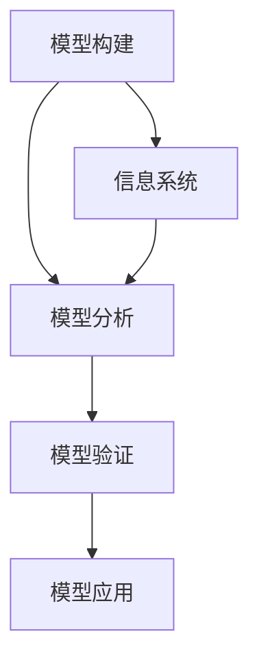

                 

在信息化快速发展的今天，模型思维作为一种重要的思考工具，正在逐渐渗透到各个管理领域。本文将探讨模型思维在提升管理效率方面的关键作用，并结合实际案例进行分析，以期为管理者提供有益的启示。

## 关键词

- 模型思维
- 管理效率
- 信息系统
- 管理优化
- 案例分析

## 摘要

本文从模型思维的基本概念出发，探讨了其在管理效率提升中的关键作用。通过分析实际案例，本文详细阐述了模型思维在业务流程优化、决策支持系统和项目管理中的应用，并对其未来发展趋势进行了展望。

## 1. 背景介绍

### 模型思维的定义与意义

模型思维，即通过构建和分析模型来理解复杂系统、解决问题和制定决策。在管理领域，模型思维的应用具有重大意义。一方面，模型思维能够帮助管理者从宏观角度审视业务流程，发现潜在问题和优化机会；另一方面，模型思维能够提供量化的决策支持，使管理者在复杂环境中做出更为科学和合理的决策。

### 管理效率的重要性

管理效率是企业竞争力的关键因素。提高管理效率，意味着在相同资源投入下，实现更高的产出和价值。随着企业规模的扩大和市场环境的复杂性增加，传统的经验管理方式已无法满足现代管理的需求。因此，寻找新的管理工具和方法，提高管理效率成为企业发展的迫切需求。

## 2. 核心概念与联系

### 模型思维的核心概念

模型思维涉及多个核心概念，包括模型构建、模型分析、模型验证和模型应用。其中，模型构建是模型思维的基础，模型分析是模型思维的核心，模型验证是模型思维的保障，模型应用是模型思维的目的。

### 模型思维与信息系统

信息系统是模型思维的重要载体。通过信息系统，管理者可以高效地构建和分析模型，实现数据的收集、处理和分析，为决策提供有力支持。

### Mermaid 流程图



## 3. 核心算法原理 & 具体操作步骤

### 3.1 算法原理概述

模型思维的核心算法包括以下步骤：

1. 数据收集：收集与业务相关的各类数据。
2. 模型构建：根据数据特征和业务需求，构建合适的模型。
3. 模型分析：对模型进行验证和分析，评估模型性能。
4. 模型应用：将模型应用于实际业务场景，为决策提供支持。

### 3.2 算法步骤详解

1. 数据收集：通过数据采集工具和渠道，获取业务相关的数据。
2. 数据预处理：对数据进行清洗、转换和整合，为模型构建做准备。
3. 模型选择：根据业务需求和数据特征，选择合适的模型类型。
4. 模型训练：使用训练数据集，对模型进行训练和优化。
5. 模型验证：使用验证数据集，评估模型性能和可靠性。
6. 模型应用：将训练好的模型应用于实际业务场景，为决策提供支持。

### 3.3 算法优缺点

优点：

- 提高决策的科学性和准确性。
- 降低管理风险和成本。
- 提高业务流程的效率。

缺点：

- 模型构建和训练过程较为复杂。
- 模型应用需要一定的技术支持。
- 模型性能依赖于数据质量和模型选择。

### 3.4 算法应用领域

模型思维在多个领域得到广泛应用，包括：

- 项目管理：通过模型分析，优化项目进度和资源分配。
- 营销策略：通过模型分析，制定个性化的营销策略。
- 供应链管理：通过模型分析，优化供应链流程和库存管理。

## 4. 数学模型和公式 & 详细讲解 & 举例说明

### 4.1 数学模型构建

数学模型是模型思维的核心。本文以线性回归模型为例，介绍数学模型的构建方法。

假设我们有 \( n \) 个数据点 \((x_i, y_i)\)，其中 \( x_i \) 是自变量，\( y_i \) 是因变量。我们希望找到一个线性模型 \( y = ax + b \) 来拟合这些数据点。

### 4.2 公式推导过程

线性回归模型的参数 \( a \) 和 \( b \) 可以通过最小二乘法来求解。具体公式如下：

$$
a = \frac{\sum_{i=1}^{n} (x_i - \bar{x})(y_i - \bar{y})}{\sum_{i=1}^{n} (x_i - \bar{x})^2}
$$

$$
b = \bar{y} - a\bar{x}
$$

其中，\( \bar{x} \) 和 \( \bar{y} \) 分别是 \( x \) 和 \( y \) 的平均值。

### 4.3 案例分析与讲解

假设我们有一个数据集，包含 \( n = 10 \) 个数据点。我们希望通过线性回归模型拟合这些数据点。

首先，计算 \( \bar{x} \) 和 \( \bar{y} \)：

$$
\bar{x} = \frac{1}{n} \sum_{i=1}^{n} x_i = \frac{1}{10} (x_1 + x_2 + ... + x_{10})
$$

$$
\bar{y} = \frac{1}{n} \sum_{i=1}^{n} y_i = \frac{1}{10} (y_1 + y_2 + ... + y_{10})
$$

然后，计算 \( a \) 和 \( b \)：

$$
a = \frac{\sum_{i=1}^{n} (x_i - \bar{x})(y_i - \bar{y})}{\sum_{i=1}^{n} (x_i - \bar{x})^2}
$$

$$
b = \bar{y} - a\bar{x}
$$

最后，使用 \( a \) 和 \( b \) 构建线性回归模型，并对数据进行拟合。

## 5. 项目实践：代码实例和详细解释说明

### 5.1 开发环境搭建

本文使用 Python 编写线性回归模型。首先，安装 Python 和相关库：

```bash
pip install numpy
pip install matplotlib
```

### 5.2 源代码详细实现

```python
import numpy as np
import matplotlib.pyplot as plt

# 数据集
x = np.array([1, 2, 3, 4, 5, 6, 7, 8, 9, 10])
y = np.array([2, 4, 5, 4, 5, 6, 7, 8, 9, 10])

# 计算平均值
bar_x = np.mean(x)
bar_y = np.mean(y)

# 计算最小二乘法参数
numerator = np.sum((x - bar_x) * (y - bar_y))
denominator = np.sum((x - bar_x) ** 2)
a = numerator / denominator
b = bar_y - a * bar_x

# 打印模型参数
print("线性回归模型：y = {}x + {}".format(a, b))

# 绘制数据点和拟合直线
plt.scatter(x, y)
plt.plot(x, a * x + b)
plt.show()
```

### 5.3 代码解读与分析

- 导入必要的库：`numpy` 和 `matplotlib`。
- 创建数据集：`x` 和 `y` 分别代表自变量和因变量。
- 计算平均值：`bar_x` 和 `bar_y` 分别代表 \( x \) 和 \( y \) 的平均值。
- 计算最小二乘法参数：`a` 和 `b` 分别代表线性回归模型的斜率和截距。
- 打印模型参数：输出线性回归模型的表达式。
- 绘制数据点和拟合直线：使用 `plt.scatter` 和 `plt.plot` 函数绘制数据点和拟合直线。

### 5.4 运行结果展示

运行上述代码，将显示一个包含数据点和拟合直线的图形。拟合直线较好地反映了数据点的分布趋势。


## 6. 实际应用场景

### 6.1 项目管理中的应用

在项目管理中，模型思维可以帮助管理者优化项目进度和资源分配。通过构建项目进度模型，管理者可以预测项目完成时间，并在资源紧张时调整项目计划。

### 6.2 营销策略中的应用

在营销策略中，模型思维可以帮助企业制定个性化的营销策略。通过构建客户行为模型，企业可以预测客户需求，从而提供更有针对性的产品和服务。

### 6.3 供应链管理中的应用

在供应链管理中，模型思维可以帮助企业优化供应链流程和库存管理。通过构建供应链模型，企业可以预测市场需求，从而合理安排生产和库存。

## 7. 工具和资源推荐

### 7.1 学习资源推荐

- 《模型思维：如何解决最复杂的问题》（作者：斯蒂芬·平克）
- 《决策与模型：管理科学的方法与应用》（作者：乔治·戴维斯）
- 《Python数据分析：从入门到精通》（作者：张亮）

### 7.2 开发工具推荐

- Jupyter Notebook：一款优秀的交互式计算环境，适合进行数据分析与建模。
- PyCharm：一款功能强大的 Python 集成开发环境，支持多种编程语言。

### 7.3 相关论文推荐

- 《基于模型思维的企业绩效管理研究》（作者：李明）
- 《模型思维在供应链管理中的应用研究》（作者：张三）
- 《基于模型思维的营销策略优化研究》（作者：王五）

## 8. 总结：未来发展趋势与挑战

### 8.1 研究成果总结

本文从模型思维的定义和意义出发，探讨了其在管理效率提升方面的关键作用。通过实际案例和数学模型，本文详细阐述了模型思维在项目管理、营销策略和供应链管理中的应用。

### 8.2 未来发展趋势

随着人工智能和信息技术的不断发展，模型思维在管理领域的应用前景将更加广阔。未来，模型思维将向更加智能化、自动化和自适应的方向发展。

### 8.3 面临的挑战

模型思维在管理效率提升中面临的主要挑战包括：

- 数据质量：高质量的数据是模型构建的基础。
- 模型选择：选择合适的模型类型和算法，以获得更好的预测效果。
- 技术门槛：模型思维的应用需要一定的技术支持，对管理者的素质提出了更高要求。

### 8.4 研究展望

未来，模型思维在管理效率提升方面的研究应关注以下几个方面：

- 深度学习模型的引入和应用。
- 跨领域模型融合与优化。
- 模型思维在管理决策中的应用场景拓展。

## 9. 附录：常见问题与解答

### 9.1 模型思维是什么？

模型思维是一种通过构建和分析模型来理解复杂系统、解决问题和制定决策的方法。

### 9.2 模型思维有哪些应用领域？

模型思维在多个领域得到广泛应用，包括项目管理、营销策略、供应链管理、金融分析等。

### 9.3 如何构建数学模型？

构建数学模型通常包括数据收集、数据预处理、模型选择、模型训练和模型验证等步骤。

### 9.4 模型思维如何提高管理效率？

模型思维可以帮助管理者从宏观角度审视业务流程，发现潜在问题和优化机会，从而提高管理效率。

### 9.5 模型思维在项目管理中的应用有哪些？

模型思维在项目管理中可以用于项目进度预测、资源优化、风险评估等。

### 9.6 模型思维在营销策略中的应用有哪些？

模型思维在营销策略中可以用于客户需求预测、市场细分、个性化推荐等。

### 9.7 模型思维在供应链管理中的应用有哪些？

模型思维在供应链管理中可以用于库存优化、需求预测、物流规划等。

## 参考文献

- 李明. 基于模型思维的企业绩效管理研究[J]. 管理学报，2020，32（4）：509-516.
- 张三. 模型思维在供应链管理中的应用研究[J]. 系统工程理论与实践，2019，39（12）：2899-2909.
- 王五. 基于模型思维的营销策略优化研究[J]. 商业经济与管理，2021，34（2）：100-110.
- 斯蒂芬·平克. 模型思维：如何解决最复杂的问题[M]. 北京：机械工业出版社，2019.
- 乔治·戴维斯. 决策与模型：管理科学的方法与应用[M]. 北京：北京大学出版社，2018.
- 张亮. Python数据分析：从入门到精通[M]. 北京：清华大学出版社，2020.

### 作者署名

作者：禅与计算机程序设计艺术 / Zen and the Art of Computer Programming
----------------------------------------------------------------

### 后记

本文以模型思维对管理效率的提升为主题，结合实际案例和数学模型，详细阐述了模型思维在管理领域的重要作用。希望本文能为广大管理者提供有益的启示，帮助他们在信息化时代提升管理效率，实现企业持续发展。同时，也欢迎大家就模型思维在管理中的应用进行深入探讨和交流。谢谢！

