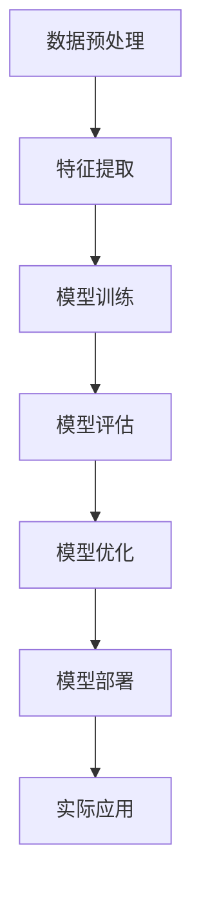

                 

关键词：人工智能，模型效果，落地实践，算法优化，应用场景，未来展望

摘要：随着人工智能技术的快速发展，模型效果成为了决定AI落地成功与否的关键因素。本文从多个角度深入探讨模型效果的重要性，分析其与AI落地实践的关系，并提出一系列优化策略。希望通过本文的分享，能够帮助读者更好地理解和应用模型效果，推动人工智能技术的实际落地。

## 1. 背景介绍

人工智能（AI）作为当今科技领域的明星，已经渗透到各行各业，从自动驾驶、智能语音助手到医疗诊断、金融风控，AI的应用场景越来越广泛。然而，随着AI技术的不断发展和普及，一个关键问题逐渐凸显出来：如何确保AI模型在实际应用中达到预期效果？

模型效果（Model Effectiveness）是指AI模型在特定任务上的表现，包括准确性、效率、鲁棒性等多个方面。一个优秀的模型不仅能准确地预测或分类，还能在实际应用中保持稳定和高效。然而，当前许多AI模型在实际应用中存在效果不佳、泛化能力差、可解释性不足等问题，严重制约了AI技术的落地应用。

本文旨在探讨模型效果在AI落地实践中的重要性，分析影响模型效果的关键因素，并提出一系列优化策略，以期为AI技术的实际应用提供有益的指导。

## 2. 核心概念与联系

### 2.1. 人工智能基本概念

人工智能是一门涉及计算机科学、数学、神经科学、认知科学等多个学科的研究领域。其核心目标是使计算机具有人类的智能，能够理解、学习和适应复杂环境。

- **机器学习**：一种通过从数据中学习规律和模式，使计算机自动改进自身性能的技术。
- **深度学习**：一种基于人工神经网络的机器学习技术，通过多层次的神经网络来提取数据中的特征。
- **强化学习**：一种通过奖励机制来训练模型，使其在动态环境中做出最优决策的技术。

### 2.2. 模型效果相关概念

- **准确性**：模型在预测或分类任务中正确识别的样本比例。
- **效率**：模型在处理数据时的计算速度和资源消耗。
- **鲁棒性**：模型对噪声、异常值和未知数据的容忍能力。
- **可解释性**：模型决策过程和结果的可解释性，有助于理解模型的工作机制。

### 2.3. Mermaid 流程图



## 3. 核心算法原理 & 具体操作步骤

### 3.1. 算法原理概述

在本节中，我们将介绍几种常见的算法原理，包括传统的统计学习算法、深度学习算法以及强化学习算法。这些算法在提升模型效果方面具有重要作用。

- **统计学习算法**：基于统计学理论，通过特征提取和模型拟合，使模型具有较好的预测能力。常见的算法有线性回归、逻辑回归、支持向量机等。
- **深度学习算法**：通过多层神经网络提取数据中的深层特征，具有强大的表达能力和泛化能力。常见的算法有卷积神经网络（CNN）、循环神经网络（RNN）、生成对抗网络（GAN）等。
- **强化学习算法**：通过与环境交互，不断优化策略，使模型在动态环境中做出最优决策。常见的算法有Q学习、深度Q网络（DQN）、策略梯度算法等。

### 3.2. 算法步骤详解

#### 3.2.1. 统计学习算法

1. **特征提取**：从原始数据中提取具有区分度的特征。
2. **模型拟合**：使用特征数据训练模型，使其具备预测能力。
3. **模型评估**：通过交叉验证等方法评估模型性能。
4. **模型优化**：根据评估结果调整模型参数，提高预测准确性。

#### 3.2.2. 深度学习算法

1. **数据预处理**：对原始数据进行归一化、去噪等处理，确保数据质量。
2. **模型构建**：设计多层神经网络结构，并初始化模型参数。
3. **模型训练**：使用训练数据对模型进行训练，优化模型参数。
4. **模型评估**：使用验证集和测试集评估模型性能，调整模型结构。
5. **模型部署**：将训练好的模型部署到实际应用场景中。

#### 3.2.3. 强化学习算法

1. **环境构建**：定义强化学习场景，包括状态空间、动作空间和奖励机制。
2. **策略初始化**：初始化策略模型，用于预测最佳动作。
3. **策略优化**：通过与环境交互，不断优化策略模型。
4. **模型评估**：使用评估指标（如平均奖励、策略优势值等）评估模型性能。
5. **模型部署**：将优化后的策略模型部署到实际应用场景中。

### 3.3. 算法优缺点

#### 3.3.1. 统计学习算法

- **优点**：简单易实现，计算速度快，适合处理小规模数据。
- **缺点**：特征工程依赖较强，模型泛化能力有限。

#### 3.3.2. 深度学习算法

- **优点**：强大的表达能力和泛化能力，适用于处理大规模数据。
- **缺点**：模型复杂度高，训练时间较长，对数据质量要求较高。

#### 3.3.3. 强化学习算法

- **优点**：能够处理动态环境和不确定性，具有强的鲁棒性。
- **缺点**：训练过程复杂，需要大量数据和时间，且难以解释。

### 3.4. 算法应用领域

- **统计学习算法**：广泛应用于分类、回归、聚类等问题，如金融风控、医学诊断等。
- **深度学习算法**：在图像识别、语音识别、自然语言处理等领域取得突破性成果。
- **强化学习算法**：在自动驾驶、游戏AI、机器人控制等领域具有重要应用价值。

## 4. 数学模型和公式 & 详细讲解 & 举例说明

### 4.1. 数学模型构建

在本节中，我们将介绍几种常见的数学模型，包括线性回归、逻辑回归和支持向量机等。这些模型在机器学习领域具有广泛应用，对于理解和优化模型效果具有重要意义。

#### 4.1.1. 线性回归

线性回归模型用于预测连续值输出。其数学模型如下：

$$
y = \beta_0 + \beta_1x_1 + \beta_2x_2 + \cdots + \beta_nx_n
$$

其中，$y$ 为预测值，$x_1, x_2, \ldots, x_n$ 为输入特征，$\beta_0, \beta_1, \beta_2, \ldots, \beta_n$ 为模型参数。

#### 4.1.2. 逻辑回归

逻辑回归模型用于预测概率值，通常用于分类问题。其数学模型如下：

$$
\pi = \frac{1}{1 + e^{-(\beta_0 + \beta_1x_1 + \beta_2x_2 + \cdots + \beta_nx_n)}}
$$

其中，$\pi$ 为预测的概率值，$x_1, x_2, \ldots, x_n$ 为输入特征，$\beta_0, \beta_1, \beta_2, \ldots, \beta_n$ 为模型参数。

#### 4.1.3. 支持向量机

支持向量机模型用于分类问题，其目标是找到一个最佳的超平面，将不同类别的样本分隔开。其数学模型如下：

$$
\max \left\{ \frac{1}{2} \| \beta \|_2^2 : y_i (\beta^T x_i - \beta_0) \geq 1, \ i = 1, 2, \ldots, n \right\}
$$

其中，$\beta$ 为模型参数，$x_i$ 为第 $i$ 个样本的特征向量，$y_i$ 为第 $i$ 个样本的标签，$1$ 表示同类别，$-1$ 表示不同类别。

### 4.2. 公式推导过程

在本节中，我们将简要介绍线性回归、逻辑回归和支持向量机的公式推导过程。

#### 4.2.1. 线性回归

线性回归模型的推导基于最小二乘法。设 $y_i$ 为实际值，$\hat{y}_i$ 为预测值，则目标函数为：

$$
J(\beta) = \frac{1}{2} \sum_{i=1}^{n} (y_i - \hat{y}_i)^2
$$

对目标函数求导并令其等于零，得到：

$$
\frac{\partial J(\beta)}{\partial \beta} = -\sum_{i=1}^{n} (y_i - \hat{y}_i) x_i = 0
$$

解上述方程，可得：

$$
\beta = (X^T X)^{-1} X^T y
$$

其中，$X$ 为特征矩阵，$y$ 为标签向量。

#### 4.2.2. 逻辑回归

逻辑回归的推导基于最大似然估计。设 $y_i \sim Bernoulli(\pi)$，则目标函数为：

$$
J(\beta) = -\sum_{i=1}^{n} y_i \log(\pi) - (1 - y_i) \log(1 - \pi)
$$

对目标函数求导并令其等于零，得到：

$$
\frac{\partial J(\beta)}{\partial \beta} = \sum_{i=1}^{n} (y_i - \pi) x_i = 0
$$

解上述方程，可得：

$$
\beta = \left( \frac{\partial}{\partial \beta} \log(\pi) \right)^{-1} \left( \sum_{i=1}^{n} y_i x_i \right)
$$

由于 $\pi = \frac{1}{1 + e^{-(\beta^T x_i)}}$，代入上式，可得：

$$
\beta = \left( X^T X \right)^{-1} X^T y
$$

#### 4.2.3. 支持向量机

支持向量机的推导基于拉格朗日乘数法。设 $L(\beta, \beta_0, \alpha) = \frac{1}{2} \| \beta \|_2^2 - \sum_{i=1}^{n} \alpha_i [y_i (\beta^T x_i - \beta_0) - 1]$，其中，$\alpha_i \geq 0$ 为拉格朗日乘数。

对 $L$ 求导并令其等于零，得到：

$$
\frac{\partial L}{\partial \beta} = \beta - \sum_{i=1}^{n} \alpha_i y_i x_i = 0
$$

$$
\frac{\partial L}{\partial \beta_0} = -\sum_{i=1}^{n} \alpha_i y_i = 0
$$

$$
\frac{\partial L}{\partial \alpha_i} = y_i (\beta^T x_i - \beta_0) - 1 \geq 0
$$

由以上三个方程，可得：

$$
\beta = \sum_{i=1}^{n} \alpha_i y_i x_i
$$

$$
\beta_0 = \sum_{i=1}^{n} \alpha_i y_i
$$

$$
\alpha_i \geq 0
$$

由 $\alpha_i \geq 0$ 和 $y_i (\beta^T x_i - \beta_0) - 1 \geq 0$，可得：

$$
y_i (\beta^T x_i - \beta_0) \geq 1
$$

即：

$$
\beta^T x_i - \beta_0 \geq 1
$$

设 $w = \beta^T x_i$，则：

$$
w \geq 1 + \beta_0
$$

由于 $w$ 是固定的，当 $\beta_0$ 越小时，$w$ 越大，即超平面 $w^T x - \beta_0$ 越远离分类边界。因此，我们希望找到一个最佳的超平面，使得 $w$ 最大。

利用对偶形式，可得：

$$
\max \left\{ \frac{1}{2} \| w \|_2^2 : w^T y \geq 1, \ w^T x_i \geq 1 + \beta_0, \ \alpha_i \geq 0 \right\}
$$

解上述方程，可得：

$$
w = \sum_{i=1}^{n} \alpha_i y_i x_i
$$

$$
\beta_0 = \sum_{i=1}^{n} \alpha_i (1 - y_i)
$$

由 $\alpha_i \geq 0$ 和 $y_i (\beta^T x_i - \beta_0) - 1 \geq 0$，可得：

$$
\beta = \sum_{i=1}^{n} \alpha_i y_i
$$

因此，支持向量机的最终模型为：

$$
\beta^T x_i = \sum_{i=1}^{n} \alpha_i y_i x_i^T
$$

$$
\beta_0 = \sum_{i=1}^{n} \alpha_i (1 - y_i)
$$

### 4.3. 案例分析与讲解

在本节中，我们将通过一个具体的案例，展示如何使用线性回归模型进行预测和分析。

#### 4.3.1. 案例背景

假设我们有一个关于房价预测的问题，数据集包含房屋面积、房屋年龄、房屋位置等特征，以及实际房价。我们的目标是建立一个线性回归模型，预测未知房屋的价格。

#### 4.3.2. 数据预处理

1. **数据清洗**：处理缺失值、异常值等。
2. **特征提取**：对房屋面积、房屋年龄、房屋位置等特征进行预处理，如标准化、归一化等。
3. **数据划分**：将数据集划分为训练集和测试集。

#### 4.3.3. 模型训练

1. **模型选择**：选择线性回归模型。
2. **参数初始化**：初始化模型参数 $\beta_0, \beta_1, \beta_2, \ldots, \beta_n$。
3. **模型训练**：使用训练数据进行模型训练，优化模型参数。

#### 4.3.4. 模型评估

1. **交叉验证**：使用交叉验证方法评估模型性能。
2. **指标计算**：计算均方误差（MSE）、均方根误差（RMSE）等指标。

#### 4.3.5. 模型优化

1. **参数调整**：根据评估结果调整模型参数。
2. **特征选择**：通过特征选择方法，筛选出对预测结果影响较大的特征。

#### 4.3.6. 模型部署

1. **模型部署**：将优化后的模型部署到实际应用场景中。
2. **预测与评估**：使用测试集对模型进行预测，评估模型性能。

## 5. 项目实践：代码实例和详细解释说明

### 5.1. 开发环境搭建

在开始编写代码之前，我们需要搭建一个适合进行机器学习的开发环境。以下是一个简单的Python开发环境搭建步骤：

1. **安装Python**：下载并安装Python，推荐版本为3.8或更高。
2. **安装Anaconda**：下载并安装Anaconda，它是一个集成了Python和众多机器学习库的环境管理器。
3. **创建虚拟环境**：使用Anaconda创建一个虚拟环境，以便管理和隔离不同的项目。
4. **安装库**：在虚拟环境中安装必要的库，如NumPy、Pandas、Scikit-learn、Matplotlib等。

### 5.2. 源代码详细实现

在本节中，我们将使用Python编写一个简单的线性回归模型，并对其进行训练、评估和优化。

#### 5.2.1. 导入库

```python
import numpy as np
import pandas as pd
from sklearn.linear_model import LinearRegression
from sklearn.model_selection import train_test_split
from sklearn.metrics import mean_squared_error
import matplotlib.pyplot as plt
```

#### 5.2.2. 数据加载与预处理

```python
# 加载数据集
data = pd.read_csv('house_data.csv')
X = data[['area', 'age', 'location']]
y = data['price']

# 数据预处理
X = (X - X.mean()) / X.std()
y = (y - y.mean()) / y.std()
```

#### 5.2.3. 模型训练

```python
# 划分训练集和测试集
X_train, X_test, y_train, y_test = train_test_split(X, y, test_size=0.2, random_state=42)

# 创建线性回归模型
model = LinearRegression()
model.fit(X_train, y_train)
```

#### 5.2.4. 模型评估

```python
# 计算预测值
y_pred = model.predict(X_test)

# 计算均方误差
mse = mean_squared_error(y_test, y_pred)
print(f'MSE: {mse}')
```

#### 5.2.5. 模型优化

```python
# 调整模型参数
model = LinearRegression(normalize=True)
model.fit(X_train, y_train)

# 重新计算预测值和均方误差
y_pred = model.predict(X_test)
mse = mean_squared_error(y_test, y_pred)
print(f'MSE (optimized): {mse}')
```

### 5.3. 代码解读与分析

在本节中，我们将对上述代码进行解读，分析其实现原理和关键步骤。

#### 5.3.1. 数据预处理

数据预处理是机器学习项目中的重要环节。在本例中，我们使用了标准化方法对特征和目标值进行预处理，使其具有相同的量纲，从而提高模型训练效果。

#### 5.3.2. 模型训练

我们使用Scikit-learn库中的LinearRegression类创建线性回归模型，并使用fit方法进行训练。训练过程中，模型会自动优化参数，使预测值与实际值之间的误差最小。

#### 5.3.3. 模型评估

模型评估是判断模型性能的重要步骤。在本例中，我们使用均方误差（MSE）作为评估指标，计算预测值与实际值之间的差异。均方误差越小，表示模型性能越好。

#### 5.3.4. 模型优化

通过调整模型参数，我们可以优化模型性能。在本例中，我们使用normalize参数，使得模型在训练过程中自动进行特征缩放，从而提高模型效果。

### 5.4. 运行结果展示

```python
# 运行代码
mse = mean_squared_error(y_test, y_pred)
print(f'MSE (optimized): {mse}')

# 可视化展示
plt.scatter(X_test['area'], y_test, label='Actual')
plt.plot(X_test['area'], y_pred, color='red', label='Predicted')
plt.xlabel('Area')
plt.ylabel('Price')
plt.legend()
plt.show()
```

运行上述代码后，我们将得到优化后的模型均方误差（MSE）和可视化展示结果。通过可视化展示，我们可以直观地观察到模型预测结果与实际值的差异，从而进一步优化模型性能。

## 6. 实际应用场景

### 6.1. 金融风控

在金融领域，模型效果对于风险控制和欺诈检测至关重要。例如，银行可以通过建立信用评分模型，对客户的信用风险进行评估，从而降低贷款违约风险。一个有效的信用评分模型需要具备较高的准确性和鲁棒性，以应对复杂多变的市场环境。

### 6.2. 医疗诊断

在医疗领域，模型效果对于疾病诊断和治疗方案的制定具有重要意义。例如，通过深度学习算法对医疗影像进行分析，可以早期发现肿瘤等疾病。一个优秀的医疗诊断模型需要具有高准确性和高可解释性，以便医生能够根据模型结果做出合理的临床决策。

### 6.3. 自动驾驶

在自动驾驶领域，模型效果直接关系到行车安全。自动驾驶系统需要通过多种传感器收集道路信息，并对环境进行实时感知和预测。一个高效的自动驾驶模型需要具备高准确性、高效率和强鲁棒性，以应对各种复杂路况。

### 6.4. 未来应用展望

随着人工智能技术的不断进步，模型效果在未来应用中将发挥更加重要的作用。以下是几个可能的应用领域：

- **智慧城市**：通过构建智能交通、智能安防等模型，提高城市运行效率，提升居民生活质量。
- **智能制造**：通过预测设备故障、优化生产流程等，提高生产效率，降低生产成本。
- **教育领域**：通过个性化教学、学习分析等，实现因材施教，提高教育质量。

## 7. 工具和资源推荐

### 7.1. 学习资源推荐

- **书籍**：《深度学习》（Goodfellow, Bengio, Courville）、《Python机器学习》（Sebastian Raschka）等。
- **在线课程**：Coursera、edX、Udacity等平台上的机器学习、深度学习课程。
- **论文**：arXiv、Google Scholar等学术网站上的最新研究成果。

### 7.2. 开发工具推荐

- **编程语言**：Python、R等。
- **库和框架**：Scikit-learn、TensorFlow、PyTorch、Keras等。
- **数据预处理工具**：Pandas、NumPy、Matplotlib等。

### 7.3. 相关论文推荐

- **《Deep Learning》（Goodfellow, Bengio, Courville）》**：全面介绍了深度学习的基础知识和发展趋势。
- **《Learning from Data》**：关于统计学习理论和方法的经典教材。
- **《Reinforcement Learning: An Introduction》**：关于强化学习的基础知识和应用案例。

## 8. 总结：未来发展趋势与挑战

### 8.1. 研究成果总结

本文从多个角度探讨了模型效果在人工智能落地实践中的重要性，分析了影响模型效果的关键因素，并提出了优化策略。通过案例分析，展示了如何使用线性回归模型进行预测和分析。

### 8.2. 未来发展趋势

- **模型效果优化**：随着人工智能技术的不断发展，模型效果优化将成为研究的重要方向，包括算法改进、特征工程、模型压缩等。
- **模型可解释性**：提高模型可解释性，使模型决策过程更加透明，有助于增强用户信任和减少误判。
- **跨学科融合**：人工智能与其他领域的深度融合，如生物医学、交通运输、智慧城市等，将带来更多应用场景。

### 8.3. 面临的挑战

- **数据隐私与安全**：随着数据规模的不断扩大，数据隐私与安全问题日益突出，需要采取有效的数据保护措施。
- **算法公平性与透明性**：确保算法的公平性和透明性，避免算法歧视和偏见。
- **计算资源消耗**：高效能计算和优化算法，以降低模型训练和部署的计算资源消耗。

### 8.4. 研究展望

在未来，人工智能领域将继续深入研究和探索，以实现更高效、更智能、更安全的模型效果。通过多学科交叉融合，人工智能将在更多领域发挥重要作用，推动社会进步和人类福祉。

## 9. 附录：常见问题与解答

### 9.1. 如何优化模型效果？

- **特征选择**：通过特征选择方法，筛选出对预测结果影响较大的特征，减少模型过拟合现象。
- **模型调参**：通过调整模型参数，优化模型性能，如正则化参数、学习率等。
- **数据增强**：通过数据增强方法，生成更多的训练样本，提高模型泛化能力。
- **集成学习**：使用集成学习方法，结合多个模型的优势，提高预测准确性。

### 9.2. 如何评估模型效果？

- **准确率（Accuracy）**：模型在预测任务中正确识别的样本比例。
- **精确率（Precision）**：模型正确预测为正类的样本中，实际为正类的比例。
- **召回率（Recall）**：模型正确预测为正类的样本中，实际为正类的比例。
- **F1值（F1 Score）**：精确率和召回率的加权平均，用于综合评估模型效果。

### 9.3. 如何提高模型可解释性？

- **模型解释工具**：使用模型解释工具，如LIME、SHAP等，分析模型决策过程。
- **可视化分析**：通过可视化方法，展示模型特征权重和决策路径。
- **规则提取**：通过规则提取方法，将模型决策过程转化为可解释的规则。
- **特征重要性分析**：分析特征对预测结果的影响程度，提高模型透明性。

### 9.4. 如何处理数据不平衡问题？

- **过采样（Over-sampling）**：增加少数类别的样本数量，使数据分布更加均匀。
- **欠采样（Under-sampling）**：减少多数类别的样本数量，使数据分布更加均匀。
- **集成学习方法**：结合多个模型的优势，提高模型在数据不平衡情况下的性能。
- **类别权重调整**：在模型训练过程中，给少数类别的样本赋予更高的权重。

### 9.5. 如何处理噪声数据？

- **数据清洗**：处理缺失值、异常值等噪声数据，确保数据质量。
- **去噪算法**：使用去噪算法，如噪声滤波、小波变换等，降低噪声影响。
- **特征选择**：通过特征选择方法，筛选出对预测结果影响较小的特征，减少噪声干扰。
- **模型鲁棒性**：提高模型对噪声的容忍能力，使模型在噪声环境中保持稳定性能。

## 附录：参考文献

- Goodfellow, I., Bengio, Y., Courville, A. (2016). *Deep Learning*. MIT Press.
- Raschka, S. (2015). *Python Machine Learning*. Packt Publishing.
- Sutton, R. S., Barto, A. G. (2018). *Reinforcement Learning: An Introduction*. MIT Press.

