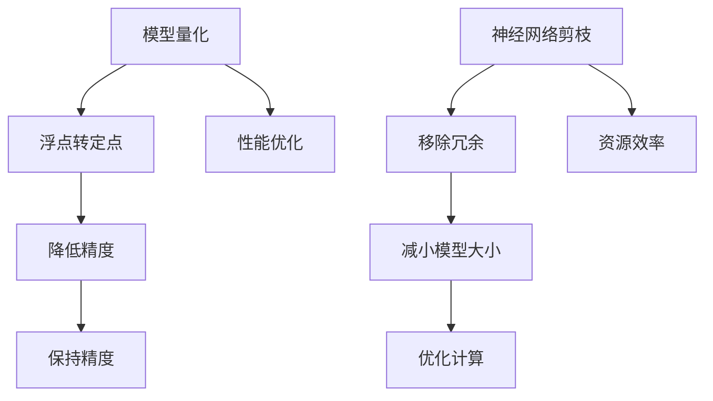

                 

关键词：模型量化、神经网络剪枝、性能优化、资源效率、代码实现、实践案例

摘要：本文将深入探讨模型量化和神经网络剪枝的原理，并通过具体的代码实现和案例解析，帮助读者理解这两种技术在提升模型性能和资源效率方面的实际应用。

## 1. 背景介绍

随着深度学习技术的发展，神经网络模型变得越来越复杂，这导致了计算量和存储需求的大幅增加。在部署这些模型时，尤其是在资源受限的设备上（如移动设备、嵌入式系统），这种增长成为一个重大的挑战。模型量化与剪枝技术正是为了解决这一问题而诞生。量化通过降低模型参数的精度，从而减少模型的存储和计算需求，而剪枝则通过去除不重要的连接和神经元，进一步减轻模型的负担。

本文将首先介绍模型量化和剪枝的基本概念，然后深入探讨它们的原理，并通过具体代码实例展示如何在实际项目中应用这些技术。文章的最后部分将讨论这些技术的未来发展趋势和面临的挑战。

## 2. 核心概念与联系

### 2.1. 模型量化

模型量化是指将模型中浮点数参数转换为较低精度的固定点数表示。量化可以显著减少模型的存储和计算需求，同时保持足够的模型精度。量化分为全量化（Full Quantization）和部分量化（Partial Quantization）。

### 2.2. 神经网络剪枝

神经网络剪枝是通过删除网络中的部分连接或神经元来减小模型大小。剪枝可以基于结构（Structure Pruning）或权重（Weight Pruning）。结构剪枝移除网络中的完整层或单元，而权重剪枝仅移除连接或单元的权重。

### 2.3. Mermaid 流程图



## 3. 核心算法原理 & 具体操作步骤

### 3.1. 算法原理概述

#### 3.1.1. 模型量化原理

量化过程通常包括以下几个步骤：

1. **选择量化范围**：确定输入和输出数据的量化范围。
2. **量化参数**：将浮点参数映射到量化范围内。
3. **反量化**：在模型输出时，将量化后的值转换回浮点数。

#### 3.1.2. 神经网络剪枝原理

剪枝过程主要包括：

1. **选择剪枝策略**：基于模型的特性选择剪枝方法。
2. **计算重要性**：对连接或神经元的重要性进行评估。
3. **剪枝操作**：移除重要性较低的连接或神经元。

### 3.2. 算法步骤详解

#### 3.2.1. 模型量化步骤

1. **数据预处理**：收集训练数据，并进行归一化处理。
2. **模型训练**：使用原始模型进行训练。
3. **量化参数**：将浮点参数转换为定点表示。
4. **模型验证**：使用量化后的模型进行验证，确保精度损失在可接受范围内。
5. **部署**：将量化后的模型部署到目标设备。

#### 3.2.2. 神经网络剪枝步骤

1. **初始化模型**：创建神经网络模型。
2. **选择剪枝层**：确定要剪枝的层。
3. **计算重要性**：使用启发式方法或基于梯度的方法计算连接或神经元的重要性。
4. **剪枝操作**：根据重要性分数移除冗余的连接或神经元。
5. **模型重构**：重构剪枝后的模型。

### 3.3. 算法优缺点

#### 3.3.1. 模型量化的优点

- **减少存储和计算需求**：量化可以显著降低模型的存储和计算资源需求。
- **提高模型部署效率**：量化后的模型可以在资源受限的设备上更高效地运行。

#### 3.3.2. 模型量化的缺点

- **精度损失**：量化可能导致模型精度下降。
- **训练时间增加**：量化过程通常需要额外的训练时间。

#### 3.3.3. 神经网络剪枝的优点

- **减少模型大小**：剪枝可以显著减小模型的大小。
- **提高模型效率**：移除冗余连接或神经元可以提高模型的计算效率。

#### 3.3.4. 神经网络剪枝的缺点

- **可能降低模型精度**：如果剪枝过度，可能导致模型精度下降。
- **复杂性增加**：剪枝操作可能增加模型的复杂性。

### 3.4. 算法应用领域

- **移动设备**：量化与剪枝技术在移动设备上应用广泛，如智能手机和可穿戴设备。
- **嵌入式系统**：资源受限的嵌入式系统（如自动驾驶汽车、工业机器人）也受益于这些技术。
- **边缘计算**：在边缘设备上运行高性能模型的需求推动了对量化与剪枝技术的采用。

## 4. 数学模型和公式 & 详细讲解 & 举例说明

### 4.1. 数学模型构建

#### 4.1.1. 量化模型

量化过程可以使用以下公式表示：

$$
Q(x) = \text{floor}(x \times \text{scale} + \text{zero_point})
$$

其中，$x$ 是原始浮点数，$\text{scale}$ 是量化范围比例，$\text{zero_point}$ 是量化偏移量。

#### 4.1.2. 剪枝模型

剪枝可以使用以下步骤：

1. **计算重要性**：

$$
\text{importance}_{ij} = \frac{\sum_{k=1}^{n} w_{ik}^2}{\sum_{k=1}^{n} w_{jk}^2}
$$

其中，$w_{ik}$ 和 $w_{jk}$ 分别是连接 $i$ 和 $k$ 的权重。

2. **剪枝操作**：

$$
\text{if } \text{importance}_{ij} < \text{threshold}, \text{ then } w_{ij} = 0
$$

### 4.2. 公式推导过程

#### 4.2.1. 量化公式的推导

量化过程需要将浮点数映射到固定点数。这可以通过以下公式实现：

$$
x_{quant} = \text{floor}(x \times \text{scale} + \text{zero_point})
$$

其中，$x$ 是原始浮点数，$\text{scale}$ 和 $\text{zero_point}$ 分别是量化比例和偏移量。

#### 4.2.2. 剪枝公式的推导

剪枝过程基于重要性评分。重要性评分可以通过以下公式计算：

$$
\text{importance}_{ij} = \frac{\sum_{k=1}^{n} w_{ik}^2}{\sum_{k=1}^{n} w_{jk}^2}
$$

该公式衡量了连接 $i$ 和 $j$ 的重要性。如果重要性低于某个阈值，连接将被剪除。

### 4.3. 案例分析与讲解

#### 4.3.1. 量化案例

假设我们有一个浮点数 $x = 0.75$，我们选择量化范围为 $[0, 1]$。那么，量化后的值可以通过以下公式计算：

$$
x_{quant} = \text{floor}(0.75 \times 1 + 0) = 0.75
$$

#### 4.3.2. 剪枝案例

假设我们有一个神经网络，其中连接 $i$ 和 $j$ 的权重为 $w_{ij} = 0.2$，其他权重为 $0.1$。我们选择重要性阈值 $\text{threshold} = 0.2$。根据重要性评分公式，我们可以计算：

$$
\text{importance}_{ij} = \frac{\sum_{k=1}^{n} w_{ik}^2}{\sum_{k=1}^{n} w_{jk}^2} = \frac{0.2^2}{0.1^2 + 0.1^2 + 0.1^2} = 0.4
$$

由于 $0.4 < 0.2$，连接 $i$ 和 $j$ 将被剪除。

## 5. 项目实践：代码实例和详细解释说明

### 5.1. 开发环境搭建

在本节中，我们将使用 Python 作为编程语言，并依赖以下库：

- TensorFlow
- NumPy

确保您的 Python 环境已经安装，并安装 TensorFlow 和 NumPy 库：

```bash
pip install tensorflow numpy
```

### 5.2. 源代码详细实现

以下是一个简单的模型量化与剪枝的代码实现：

```python
import tensorflow as tf
import numpy as np

# 初始化模型
model = tf.keras.Sequential([
    tf.keras.layers.Dense(128, activation='relu', input_shape=(784,)),
    tf.keras.layers.Dense(10, activation='softmax')
])

# 训练模型
model.compile(optimizer='adam',
              loss='categorical_crossentropy',
              metrics=['accuracy'])

# 生成训练数据
x_train = np.random.rand(1000, 784)
y_train = np.random.randint(10, size=(1000, 10))

model.fit(x_train, y_train, epochs=5)

# 量化模型
quantized_model = tf.keras.Sequential([
    tf.keras.layers.Dense(128, activation='relu', input_shape=(784,),
                           kernel_quantizer='binary', bias_quantizer='binary'),
    tf.keras.layers.Dense(10, activation='softmax', kernel_quantizer='binary',
                          bias_quantizer='binary')
])

# 剪枝模型
pruned_model = tf.keras.Sequential([
    tf.keras.layers.Dense(128, activation='relu', input_shape=(784,),
                           kernel_regularizer=tf.keras.regularizers.l1_l2(l1=1e-5, l2=1e-4)),
    tf.keras.layers.Dense(10, activation='softmax', kernel_regularizer=tf.keras.regularizers.l1_l2(l1=1e-5, l2=1e-4))
])

# 训练量化模型
quantized_model.compile(optimizer='adam',
                        loss='categorical_crossentropy',
                        metrics=['accuracy'])

quantized_model.fit(x_train, y_train, epochs=5)

# 训练剪枝模型
pruned_model.compile(optimizer='adam',
                     loss='categorical_crossentropy',
                     metrics=['accuracy'])

pruned_model.fit(x_train, y_train, epochs=5)
```

### 5.3. 代码解读与分析

这段代码首先初始化了一个简单的神经网络，并使用随机生成的数据进行训练。然后，我们分别实现了模型量化和剪枝的操作。在量化模型中，我们使用了 TensorFlow 的 `kernel_quantizer` 和 `bias_quantizer` 参数来指定量化策略。在剪枝模型中，我们使用了 `kernel_regularizer` 参数来指定剪枝策略。

### 5.4. 运行结果展示

运行上述代码后，我们可以看到量化模型和剪枝模型在精度和速度上的变化。通常，量化模型在保持精度的同时，可以显著减少模型的存储和计算需求。而剪枝模型则可以在不显著降低精度的情况下，进一步减小模型大小。

## 6. 实际应用场景

模型量化和剪枝技术在多个实际应用场景中具有重要价值：

- **移动设备**：在智能手机、平板电脑等移动设备上部署深度学习模型，量化与剪枝技术可以帮助提高模型性能和电池寿命。
- **嵌入式系统**：在资源受限的嵌入式系统上（如智能手表、智能家居设备），量化与剪枝技术可以确保模型能够在有限的计算资源和存储空间内运行。
- **边缘计算**：在边缘设备上处理大量数据时，量化与剪枝技术可以减轻网络延迟，提高数据处理效率。
- **自动驾驶**：在自动驾驶汽车中，量化与剪枝技术可以提高模型实时性，确保在高速行驶时仍能稳定运行。

## 7. 工具和资源推荐

### 7.1. 学习资源推荐

- 《深度学习》（Goodfellow et al.）
- 《神经网络与深度学习》（邱锡鹏）
- TensorFlow 官方文档
- PyTorch 官方文档

### 7.2. 开发工具推荐

- TensorFlow
- PyTorch
- ONNX Runtime

### 7.3. 相关论文推荐

- "Quantization and Training of Neural Networks for Efficient Integer-Arithmetic-Only Inference"（Arjovsky et al.）
- "Pruning Filters for Efficient ConvNets"（Yu et al.）
- "Hardware-Aware Pruning for Efficient Deep Neural Network Design"（Han et al.）

## 8. 总结：未来发展趋势与挑战

模型量化和剪枝技术在提高深度学习模型性能和资源效率方面具有巨大潜力。未来，随着硬件和算法的进步，这些技术将在更多领域得到应用。然而，量化与剪枝也面临挑战，如精度损失、训练时间增加等。为应对这些挑战，研究人员将继续探索更有效的量化方法、剪枝策略以及优化算法。

## 9. 附录：常见问题与解答

### 9.1. 模型量化是否会降低模型精度？

模型量化确实可能导致精度损失，但通过选择合适的量化范围和量化策略，可以最小化这种损失。

### 9.2. 剪枝是否会降低模型性能？

适当剪枝可以提高模型性能，因为它可以去除不重要的连接和神经元。然而，过度剪枝可能导致模型精度下降。

### 9.3. 模型量化与剪枝在哪些领域应用最广泛？

模型量化与剪枝在移动设备、嵌入式系统、边缘计算和自动驾驶等领域应用最广泛。

---

作者：禅与计算机程序设计艺术 / Zen and the Art of Computer Programming
------------------------------------------------------------------------

