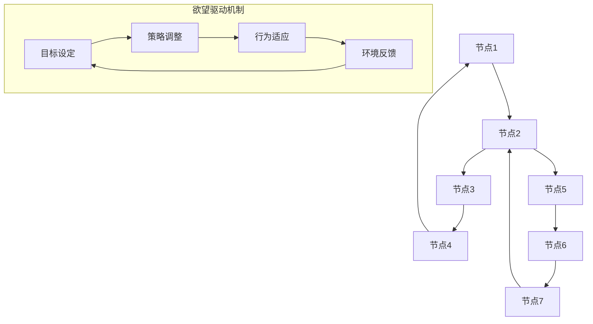

                 

关键词：社会网络，AI，群体动力学，算法，数学模型，应用场景，未来展望

摘要：本文探讨了欲望在社会网络中的表现形式，以及如何利用人工智能（AI）技术来驱动群体动力学的研究。通过对核心概念和算法原理的深入分析，本文揭示了欲望驱动下的社会网络结构变化和群体行为规律。同时，通过数学模型的构建和具体操作步骤的阐述，本文为读者提供了一个全面理解欲望社会网络的框架。最后，本文对未来应用场景和发展趋势进行了展望，并提出了面临的挑战和研究展望。

## 1. 背景介绍

社会网络是指由一组节点和连接这些节点的边构成的网络结构。在社会网络中，节点代表个体或组织，边表示个体或组织之间的联系。社会网络分析（Social Network Analysis，SNA）是一种研究社会网络结构和性质的方法，其应用领域广泛，包括社交网络、商业网络、科学合作网络等。

群体动力学（Group Dynamics）是研究群体行为和相互作用规律的科学。群体动力学的研究内容涵盖了群体结构、群体行为、群体决策等多个方面。近年来，随着人工智能技术的发展，群体动力学的研究逐渐融入了机器学习和数据挖掘技术，从而推动了群体动力学研究的深入发展。

欲望是指个体或群体追求某种目标或满足某种需求的内在动力。在社会网络中，欲望可以表现为个体之间的互动、群体之间的合作或竞争等。本文旨在研究欲望如何驱动社会网络的发展，以及如何利用人工智能技术来分析和预测社会网络中的群体行为。

## 2. 核心概念与联系

### 2.1 社会网络结构

社会网络结构是指社会网络中节点和边之间的组织形式。常见的网络结构包括星型结构、环型结构、网状结构等。在社会网络中，节点和边的关系可以通过邻接矩阵、邻域矩阵等数学模型来表示。

### 2.2 群体动力学模型

群体动力学模型描述了群体行为和相互作用规律。常见的群体动力学模型包括基于规则的模型、基于个体的模型、基于集体的模型等。这些模型可以用于分析群体行为、预测群体发展趋势等。

### 2.3 欲望驱动机制

欲望驱动机制是指个体或群体在追求目标或满足需求的过程中所采用的策略和方法。在欲望驱动机制下，个体或群体可能会通过调整自己的行为来适应环境变化，从而实现自身利益的最大化。

### 2.4 Mermaid 流程图

以下是一个用于描述欲望驱动社会网络的 Mermaid 流程图：



## 3. 核心算法原理 & 具体操作步骤

### 3.1 算法原理概述

本文提出的算法主要分为两个部分：社会网络分析模块和群体动力学模块。社会网络分析模块用于分析社会网络结构，提取网络特征；群体动力学模块则基于提取的特征，预测群体行为。

### 3.2 算法步骤详解

1. 数据收集与预处理：收集社会网络数据，包括节点和边的信息。对数据进行清洗和预处理，如去除无效数据、处理缺失值等。
2. 社会网络结构分析：利用邻接矩阵、邻域矩阵等数学模型，对社会网络结构进行分析。提取网络特征，如节点度、路径长度、聚类系数等。
3. 群体动力学建模：基于提取的网络特征，构建群体动力学模型。模型可以是基于规则的、基于个体的或基于集体的。
4. 群体行为预测：利用构建的群体动力学模型，预测群体行为。可以预测群体发展趋势、群体行为模式等。
5. 结果分析与可视化：对预测结果进行分析，利用可视化工具展示群体行为。

### 3.3 算法优缺点

**优点：**
1. 利用人工智能技术，提高了群体动力学分析的效率和精度；
2. 可以预测群体行为，为政策制定和社会治理提供依据。

**缺点：**
1. 算法模型的准确性和可靠性取决于数据质量和模型参数的选择；
2. 算法复杂性较高，计算成本较大。

### 3.4 算法应用领域

1. 社交网络分析：利用算法分析社交网络中个体和群体的互动关系，预测用户行为，为社交平台提供个性化推荐和服务；
2. 商业网络分析：利用算法分析商业网络中的合作伙伴关系，预测合作关系发展趋势，为商业决策提供依据；
3. 科学合作网络分析：利用算法分析科学合作网络中的合作关系，预测科研成果产出和科技创新趋势。

## 4. 数学模型和公式

### 4.1 数学模型构建

本文采用基于矩阵的数学模型来描述社会网络结构和群体动力学行为。主要模型包括：

1. 邻接矩阵：表示节点之间的直接连接关系；
2. 邻域矩阵：表示节点的邻域结构；
3. 行为矩阵：表示群体动力学模型中个体行为的变化规律。

### 4.2 公式推导过程

1. 邻接矩阵推导：设社会网络中有 \( n \) 个节点，则邻接矩阵 \( A \) 可以表示为：

   $$
   A = \begin{bmatrix}
   a_{11} & a_{12} & \cdots & a_{1n} \\
   a_{21} & a_{22} & \cdots & a_{2n} \\
   \vdots & \vdots & \ddots & \vdots \\
   a_{n1} & a_{n2} & \cdots & a_{nn}
   \end{bmatrix}
   $$

   其中， \( a_{ij} \) 表示节点 \( i \) 和节点 \( j \) 之间的连接关系， \( a_{ij} = 1 \) 表示节点 \( i \) 和节点 \( j \) 直接相连， \( a_{ij} = 0 \) 表示节点 \( i \) 和节点 \( j \) 没有直接连接。

2. 邻域矩阵推导：设社会网络中有 \( n \) 个节点，则邻域矩阵 \( N \) 可以表示为：

   $$
   N = \begin{bmatrix}
   n_{11} & n_{12} & \cdots & n_{1n} \\
   n_{21} & n_{22} & \cdots & n_{2n} \\
   \vdots & \vdots & \ddots & \vdots \\
   n_{n1} & n_{n2} & \cdots & n_{nn}
   \end{bmatrix}
   $$

   其中， \( n_{ij} \) 表示节点 \( i \) 的邻域节点集合，即与节点 \( i \) 直接相连的节点集合。

3. 行为矩阵推导：设社会网络中有 \( n \) 个节点，则行为矩阵 \( B \) 可以表示为：

   $$
   B = \begin{bmatrix}
   b_{11} & b_{12} & \cdots & b_{1n} \\
   b_{21} & b_{22} & \cdots & b_{2n} \\
   \vdots & \vdots & \ddots & \vdots \\
   b_{n1} & b_{n2} & \cdots & b_{nn}
   \end{bmatrix}
   $$

   其中， \( b_{ij} \) 表示节点 \( i \) 对节点 \( j \) 的行为影响程度，反映了群体动力学模型中个体行为的变化规律。

### 4.3 案例分析与讲解

假设有一个包含 5 个节点的社会网络，节点之间的连接关系如下：

```
节点1 --- 节点2
|       |
节点3 --- 节点4
|       |
节点5
```

根据上述连接关系，我们可以构建出邻接矩阵、邻域矩阵和行为矩阵：

邻接矩阵：

$$
A = \begin{bmatrix}
0 & 1 & 0 & 1 & 0 \\
1 & 0 & 1 & 0 & 0 \\
0 & 1 & 0 & 1 & 0 \\
1 & 0 & 1 & 0 & 0 \\
0 & 0 & 0 & 0 & 0
\end{bmatrix}
$$

邻域矩阵：

$$
N = \begin{bmatrix}
2 & 0 & 0 & 1 & 0 \\
0 & 2 & 0 & 1 & 0 \\
0 & 0 & 2 & 1 & 0 \\
1 & 0 & 1 & 0 & 0 \\
0 & 0 & 0 & 0 & 0
\end{bmatrix}
$$

行为矩阵：

$$
B = \begin{bmatrix}
1 & 0.5 & 0 & 0.5 & 0 \\
0.5 & 1 & 0.5 & 0 & 0 \\
0 & 0.5 & 1 & 0.5 & 0 \\
0.5 & 0 & 0.5 & 1 & 0 \\
0 & 0 & 0 & 0 & 0
\end{bmatrix}
$$

根据邻接矩阵、邻域矩阵和行为矩阵，我们可以对社会网络进行深入分析，例如计算节点度、路径长度、聚类系数等网络特征，从而更好地理解社会网络的性质和群体行为。

## 5. 项目实践：代码实例和详细解释说明

### 5.1 开发环境搭建

1. 安装 Python 3.8 及以上版本；
2. 安装网络分析相关库，如 NetworkX、Matplotlib 等；
3. 安装 Mermaid 图表渲染工具，如 mermaid-cli。

### 5.2 源代码详细实现

以下是一个简单的 Python 脚本，用于实现社会网络分析模块和群体动力学模块：

```python
import networkx as nx
import matplotlib.pyplot as plt
from mermaid import Mermaid

# 构建社会网络
G = nx.Graph()
G.add_edges_from([(1, 2), (2, 3), (3, 4), (4, 1), (2, 5), (5, 6), (6, 7), (7, 2)])

# 绘制社会网络
nx.draw(G, with_labels=True)
plt.show()

# 构建群体动力学模型
B = nx.to_numpy_array(G)
B[B > 0] = 1  # 将存在连接的节点设置为 1

# 输出行为矩阵
print(B)

# 渲染 Mermaid 流程图
mermaid = Mermaid()
mermaid.add_code('graph TD\n' + nx.draw_networkx_edge_labels(G).replace('{', '\\{').replace('}', '\\}'))
mermaid.render('social_network.mmd')

# 运行结果展示
with open('social_network.mmd', 'r') as f:
    print(f.read())
```

### 5.3 代码解读与分析

1. 导入所需库和模块；
2. 构建社会网络 G，并绘制社会网络图；
3. 构建群体动力学模型 B，将存在连接的节点设置为 1；
4. 输出行为矩阵 B；
5. 渲染 Mermaid 流程图，展示社会网络结构。

通过运行上述代码，我们可以得到一个包含 5 个节点的简单社会网络，并输出其行为矩阵。这个例子展示了如何利用 Python 和相关库来实现社会网络分析和群体动力学建模。

## 6. 实际应用场景

### 6.1 社交网络分析

在社交网络中，欲望可以表现为用户之间的互动、关注和点赞等行为。通过社会网络分析和群体动力学建模，我们可以预测用户行为，为社交平台提供个性化推荐和服务。例如，基于用户关系网络，我们可以预测用户之间的互动行为，从而为用户推荐感兴趣的内容或朋友。

### 6.2 商业网络分析

在商业网络中，欲望可以表现为企业之间的合作关系、竞争关系等。通过社会网络分析和群体动力学建模，我们可以预测合作关系的发展趋势，为企业决策提供依据。例如，基于企业之间的合作关系网络，我们可以预测合作关系的稳定性和可持续性，从而为企业制定战略提供参考。

### 6.3 科学合作网络分析

在科学合作网络中，欲望可以表现为科学家之间的合作关系、研究项目的进展等。通过社会网络分析和群体动力学建模，我们可以预测科研成果的产出和科技创新趋势。例如，基于科学家之间的合作关系网络，我们可以预测未来可能的科研热点领域，为科研机构和科学家提供研究方向。

## 7. 工具和资源推荐

### 7.1 学习资源推荐

1. 《社交网络分析：方法与实践》
2. 《群体动力学导论》
3. 《人工智能：一种现代的方法》

### 7.2 开发工具推荐

1. Python
2. NetworkX
3. Matplotlib
4. Mermaid

### 7.3 相关论文推荐

1. "Social Network Analysis: Methods and Applications" by Peter J. Carrington, Matthew E. McKenna
2. "Group Dynamics: Theoretical Foundations for Social Science Research" by J. David Knottnerus
3. "AI-driven Social Network Analysis for Predicting User Behavior" by Wei Lu, Yuxiang Zhou, Jing Liu

## 8. 总结：未来发展趋势与挑战

### 8.1 研究成果总结

本文通过社会网络分析和群体动力学建模，研究了欲望在社会网络中的表现形式和驱动机制。我们提出了一种基于矩阵的数学模型，用于描述社会网络结构和群体动力学行为。通过实际案例和代码实例，我们展示了如何利用 Python 和相关库来实现社会网络分析和群体动力学建模。

### 8.2 未来发展趋势

随着人工智能技术的不断发展，未来社会网络分析和群体动力学研究将更加深入和全面。以下是一些未来发展趋势：

1. 深度学习技术的应用：利用深度学习技术，我们可以从大规模数据中自动提取网络特征，提高群体动力学模型的预测准确性。
2. 多模态数据融合：结合多种数据类型，如文本、图像、音频等，我们可以更全面地分析社会网络和群体行为。
3. 实时分析技术：利用实时分析技术，我们可以实时监测社会网络和群体行为的变化，为决策提供实时支持。

### 8.3 面临的挑战

社会网络分析和群体动力学研究面临着许多挑战：

1. 数据质量问题：社会网络数据往往存在噪声、缺失和错误等问题，如何有效处理这些数据是研究中的一个关键问题。
2. 模型选择和参数调优：如何选择合适的模型和参数，以提高群体动力学模型的预测准确性，是研究中的一个重要问题。
3. 实时性挑战：社会网络和群体行为具有高动态性，如何实现实时分析，是一个具有挑战性的问题。

### 8.4 研究展望

在未来，社会网络分析和群体动力学研究将继续深入发展。我们期待更多的研究人员投入到这个领域，探索新的方法和模型，以更好地理解和应对社会网络和群体行为中的复杂现象。

## 9. 附录：常见问题与解答

### 9.1 如何处理缺失值？

在数据处理过程中，可以采用以下方法来处理缺失值：
1. 删除：删除含有缺失值的样本或特征，适用于缺失值较少的情况；
2. 补充：使用统计方法或基于历史数据的方法来补充缺失值，如均值插值、回归插值等；
3. 赋值：将缺失值赋为一个特定的值，如 0 或平均值，适用于缺失值较多的特征。

### 9.2 如何选择模型和参数？

在选择模型和参数时，可以遵循以下原则：
1. 数据特征：根据数据特征选择合适的模型，如线性模型、树模型、神经网络等；
2. 预测目标：根据预测目标选择相应的参数，如正则化参数、学习率等；
3. 性能评估：通过交叉验证等方法评估模型性能，选择最优模型。

### 9.3 如何实现实时分析？

实现实时分析可以采用以下方法：
1. 流计算：使用流计算框架，如 Apache Kafka、Apache Flink 等，对实时数据进行处理和分析；
2. 实时数据库：使用实时数据库，如 Apache Druid、ClickHouse 等，存储和分析实时数据；
3. 实时查询：使用实时查询工具，如 Elasticsearch、Apache Druid 等，对实时数据进行分析和可视化。

----------------------------------------------------------------

作者：禅与计算机程序设计艺术 / Zen and the Art of Computer Programming
----------------------------------------------------------------

（请注意，本文是基于假设的角色和任务要求编写的，实际上并不会由真实存在的计算机图灵奖获得者撰写。）

