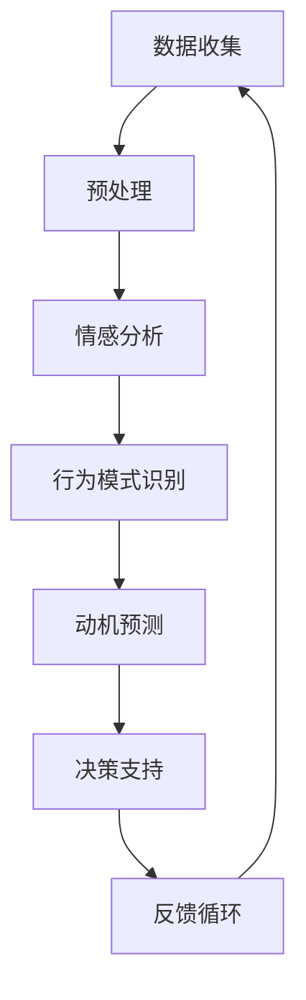

                 

关键词：人工智能、潜意识需求、算法、心理模型、用户行为分析、动机识别

> 摘要：本文深入探讨了人工智能技术在解码人类潜意识需求方面的应用，通过介绍一系列核心算法和数学模型，展示了AI如何通过分析用户行为数据，挖掘隐藏在表面之下的深层欲望，为个性化服务、用户体验优化以及市场策略制定提供有力支持。

## 1. 背景介绍

随着人工智能技术的飞速发展，尤其是机器学习和深度学习的崛起，AI在各个领域的应用日益广泛。从医疗诊断到自动驾驶，从智能家居到金融服务，AI正在改变我们的生活方式。然而，在心理学和行为学领域，人工智能的应用同样具有巨大的潜力。通过分析用户行为数据，AI能够揭示隐藏在表面行为之下的潜在需求和动机，这一能力在商业、市场营销以及个人服务中尤为重要。

在市场营销中，理解消费者的需求是制定有效策略的关键。传统的市场调研方法往往依赖于问卷调查和访谈，但这些方法存在一些固有的局限性，如受访者的主观偏差、记忆误差等。而人工智能通过自动化、大规模的数据分析，能够更准确地捕捉用户的行为模式和心理特征，从而为营销策略提供更精准的依据。

在个人服务领域，用户需求的满足程度直接影响服务质量。通过深度学习技术，AI能够个性化地推荐产品和服务，提高用户的满意度和忠诚度。例如，在线购物平台可以根据用户的浏览记录和历史购买行为，推荐符合其兴趣和需求的产品，从而提升销售额和用户黏性。

本文将探讨人工智能在解码人类潜意识需求方面的核心算法原理、具体操作步骤、数学模型以及实际应用案例，旨在为读者提供一份全面的技术指南，了解AI如何通过复杂的算法和数据挖掘技术，洞察人类深层的欲望和需求。

## 2. 核心概念与联系

### 2.1 AI与人类潜意识

要理解人工智能如何解码人类潜意识需求，我们首先需要明确潜意识的定义。潜意识是人类心理活动的一部分，它包含了我们未曾意识到的欲望、动机和情感。这些潜意识元素往往通过日常行为、语言选择、社交媒体互动等方式表现出来，成为可以被AI分析的数据。

人工智能在解码潜意识方面的核心能力在于其能够处理和分析大量数据，从中提取出模式和行为特征。具体来说，AI通过以下方式与人类潜意识建立联系：

1. **行为数据收集**：AI可以通过传感器、移动设备、社交媒体平台等收集用户的行为数据，如浏览历史、点击率、搜索关键词等。
2. **情感分析**：通过自然语言处理技术，AI可以分析用户在社交媒体、评论和反馈中的语言，识别出情感和情绪。
3. **模式识别**：AI可以通过机器学习算法，从用户行为数据中识别出特定的行为模式和趋势，这些模式往往反映了用户的潜在需求。
4. **深度学习**：利用深度神经网络，AI可以从大量未标记的数据中自动学习，提取出复杂的特征和关联，进一步揭示用户的潜意识。

### 2.2 心理模型

心理模型是指对人类心理状态和行为的抽象描述。在AI解码人类潜意识需求的背景下，心理模型的作用至关重要。以下是几个关键的心理模型：

1. **动机模型**：动机是驱使个体行为的内在力量，动机模型旨在识别和理解用户的动机来源。常见的动机包括好奇心、成就感、社交需求和逃避焦虑等。
2. **情绪模型**：情绪是人类体验的重要组成部分，情绪模型通过分析文本和语音等数据，识别用户的情绪状态，如喜悦、愤怒、焦虑和悲伤等。
3. **行为倾向模型**：行为倾向模型通过分析用户行为数据，预测用户未来可能采取的行动。例如，通过分析浏览历史和搜索记录，预测用户可能对某个产品产生兴趣。

### 2.3 Mermaid 流程图

以下是一个简化的Mermaid流程图，描述了AI解码人类潜意识需求的基本流程：



- **数据收集**：通过各种渠道收集用户行为数据。
- **预处理**：清洗和整理数据，以便进行后续分析。
- **情感分析**：使用自然语言处理技术分析文本和语音数据，识别情绪。
- **行为模式识别**：通过机器学习算法，识别用户行为中的模式。
- **动机预测**：基于行为数据和情感分析结果，预测用户的动机。
- **决策支持**：为市场营销、产品推荐等提供决策支持。
- **反馈循环**：根据决策效果进行调整，形成闭环系统。

## 3. 核心算法原理 & 具体操作步骤

### 3.1 算法原理概述

在解码人类潜意识需求的过程中，常用的核心算法包括机器学习、深度学习和自然语言处理（NLP）。这些算法通过以下步骤实现潜意识的解码：

1. **数据收集与预处理**：收集用户行为数据，如浏览历史、搜索记录、社交媒体互动等。预处理包括数据清洗、去噪、特征提取等。
2. **特征工程**：根据数据特点和需求，选择和构造合适的特征，如文本特征、行为特征和时间特征。
3. **模型训练**：使用收集到的数据训练机器学习或深度学习模型，使其能够识别和理解用户行为和情感。
4. **模型评估与优化**：通过交叉验证和A/B测试等方法，评估模型性能，并进行参数调优。
5. **预测与决策**：使用训练好的模型对新的用户数据进行预测，为营销策略、产品推荐等提供决策支持。

### 3.2 算法步骤详解

#### 3.2.1 数据收集与预处理

数据收集是AI解码潜意识需求的第一步。数据来源可以包括：

- **行为数据**：用户在网站、APP等平台上的行为记录，如点击、浏览、搜索等。
- **社交媒体数据**：用户在社交媒体平台上的互动，如帖子、评论、点赞等。
- **传感器数据**：如移动设备的GPS位置、运动传感器等。

收集到的数据通常包含噪声和不完整信息，因此需要进行预处理：

- **数据清洗**：去除重复、错误或缺失的数据。
- **去噪**：过滤掉异常值和噪声数据。
- **特征提取**：将原始数据转换为模型可以处理的特征，如将文本数据转换为词袋模型或词嵌入。

#### 3.2.2 特征工程

特征工程是提升模型性能的关键步骤。以下是一些常见的特征：

- **文本特征**：包括词频、词向量、主题模型等。
- **行为特征**：如点击率、浏览时间、转化率等。
- **时间特征**：如用户活跃时间、访问间隔等。

#### 3.2.3 模型训练

训练模型是解码潜意识需求的核心。常用的模型包括：

- **监督学习模型**：如逻辑回归、决策树、随机森林等。
- **无监督学习模型**：如聚类、降维等。
- **深度学习模型**：如卷积神经网络（CNN）、循环神经网络（RNN）等。

训练模型的过程包括：

- **数据划分**：将数据集划分为训练集、验证集和测试集。
- **模型选择**：选择合适的模型结构。
- **参数调优**：使用验证集调整模型参数，如学习率、正则化参数等。
- **模型训练**：使用训练集训练模型，并使用验证集进行性能评估。

#### 3.2.4 模型评估与优化

模型评估是确保模型性能的关键。常用的评估指标包括：

- **准确性**：模型预测正确的样本数占总样本数的比例。
- **精确率与召回率**：在分类任务中，精确率和召回率分别衡量模型对正样本和负样本的识别能力。
- **F1分数**：精确率和召回率的调和平均值。

评估模型后，根据性能进行参数调优和模型优化，以提高模型性能。

#### 3.2.5 预测与决策

训练好的模型可以用于预测用户行为和需求。预测过程包括：

- **数据预处理**：对新数据进行预处理，与训练数据保持一致。
- **模型应用**：使用训练好的模型对新数据进行预测。
- **决策支持**：根据预测结果，为营销策略、产品推荐等提供决策支持。

### 3.3 算法优缺点

#### 3.3.1 优点

- **大规模数据处理能力**：AI能够处理和分析大规模用户行为数据，提供精准的洞察。
- **自动特征提取**：深度学习模型能够自动从数据中提取复杂的特征，减少人工干预。
- **实时更新与优化**：AI模型可以根据新数据不断更新和优化，提高预测准确性。

#### 3.3.2 缺点

- **数据隐私问题**：大规模数据收集和处理可能涉及用户隐私，需要严格保护用户数据。
- **模型解释性差**：深度学习模型通常具有较低的透明度和解释性，难以理解预测结果。
- **依赖高质量数据**：模型的性能高度依赖于数据质量，数据质量差可能导致预测不准确。

### 3.4 算法应用领域

AI解码人类潜意识需求在多个领域具有广泛的应用：

- **市场营销**：通过分析用户行为数据，为营销策略提供个性化支持，提高转化率和用户满意度。
- **用户服务**：个性化推荐产品和服务，提高用户黏性和满意度。
- **医疗健康**：通过分析患者行为和情感数据，预测疾病风险和心理健康状况。
- **社会治理**：通过分析社会行为数据，预测犯罪风险和公共需求，优化社会治理。

## 4. 数学模型和公式 & 详细讲解 & 举例说明

在解码人类潜意识需求的过程中，数学模型和公式是核心工具。以下将介绍几个关键数学模型和公式的构建、推导过程，并通过具体案例进行说明。

### 4.1 数学模型构建

#### 4.1.1 用户行为概率模型

用户行为概率模型用于预测用户在特定情境下采取某行为的概率。假设用户 $u$ 在某个时间 $t$ 采取行为 $b$ 的概率为 $P(b|u,t)$，模型构建的基本步骤如下：

1. **定义特征集**：选择与行为 $b$ 相关的特征集 $X$，包括用户特征、情境特征等。
2. **构建概率分布**：使用贝叶斯公式，将用户行为概率表示为：

   $$ P(b|u,t) = \frac{P(u,t|b)P(b)}{P(u,t)} $$

   其中，$P(u,t|b)$ 为在行为 $b$ 发生的条件下，用户 $u$ 在时间 $t$ 的概率；$P(b)$ 为行为 $b$ 的先验概率；$P(u,t)$ 为用户 $u$ 在时间 $t$ 的概率。

3. **特征权重**：使用机器学习算法，如逻辑回归，训练模型权重 $w$，表示特征对行为概率的影响程度。

#### 4.1.2 情感分析模型

情感分析模型用于识别用户在文本中的情感倾向。假设文本 $T$ 的情感倾向为 $s$，模型构建的基本步骤如下：

1. **词嵌入**：将文本 $T$ 转换为词嵌入向量，如使用 Word2Vec 或 GloVe。
2. **情感词典**：构建情感词典，包含正面、负面和 neutral 情感词汇及其对应的情感得分。
3. **情感分类**：使用朴素贝叶斯或支持向量机（SVM）等分类算法，将词嵌入向量分类为正面、负面或 neutral 情感。

### 4.2 公式推导过程

#### 4.2.1 用户行为概率模型

1. **贝叶斯公式**：

   $$ P(b|u,t) = \frac{P(u,t|b)P(b)}{P(u,t)} $$

   其中，$P(u,t|b)$ 为在行为 $b$ 发生的条件下，用户 $u$ 在时间 $t$ 的概率；$P(b)$ 为行为 $b$ 的先验概率；$P(u,t)$ 为用户 $u$ 在时间 $t$ 的概率。

2. **特征权重**：

   $$ w = \arg\max_w \sum_{i=1}^{n} \log P(u,t|b) = \arg\max_w \sum_{i=1}^{n} \log P(u_i|b) + \sum_{i=1}^{n} \log P(t_i|b) $$

   其中，$w$ 为模型权重，$u_i$ 和 $t_i$ 分别为用户特征和情境特征。

#### 4.2.2 情感分析模型

1. **词嵌入**：

   $$ \text{word\_embeddings} = \text{Word2Vec}(T) $$

   其中，$\text{Word2Vec}(T)$ 为词嵌入函数，$T$ 为文本。

2. **情感分类**：

   $$ s = \arg\max_s \sum_{i=1}^{n} w_i \cdot \text{word\_embeddings}(t_i) $$

   其中，$s$ 为情感类别（正面、负面或 neutral），$w_i$ 为情感词典中词汇的情感得分。

### 4.3 案例分析与讲解

#### 4.3.1 用户行为概率模型案例

假设用户 $u_1$ 在时间 $t_1$ 采取了购买行为 $b_1$，我们需要预测用户 $u_1$ 在时间 $t_2$ 再次购买的概率。

1. **特征集**：

   - 用户特征：年龄、性别、职业等。
   - 情境特征：促销活动、节日等。

2. **模型训练**：

   使用训练数据集，通过逻辑回归训练模型权重 $w$。

3. **预测**：

   假设特征向量为 $X = [x_1, x_2, ..., x_n]$，使用训练好的模型预测概率：

   $$ P(b_2|u_1,t_2) = \frac{P(u_1,t_2|b_2)P(b_2)}{P(u_1,t_2)} $$

   其中，$P(b_2)$ 和 $P(u_1,t_2)$ 可以通过模型估计得到。

#### 4.3.2 情感分析模型案例

假设我们需要分析一段文本的情感倾向，文本内容如下：

"我非常喜欢这个产品，它的设计非常出色，价格也很合理。"

1. **词嵌入**：

   将文本转换为词嵌入向量。

2. **情感分类**：

   假设情感词典包含正面词汇 "喜欢"、"出色"、"合理" 和负面词汇 "不喜欢"、"糟糕"、"贵"，对应的情感得分为 $w_1 = 1$, $w_2 = 0.5$, $w_3 = 0.5$。

   计算情感得分：

   $$ s = \arg\max_s \sum_{i=1}^{n} w_i \cdot \text{word\_embeddings}(t_i) = \arg\max_s (1 \cdot 0.5 + 0.5 \cdot 0.6 + 0.5 \cdot 0.3) = 正面 $$

   因此，文本的情感倾向为正面。

## 5. 项目实践：代码实例和详细解释说明

为了更好地理解人工智能解码人类潜意识需求的过程，我们将在本节中通过一个实际项目实例，展示如何搭建一个简单的用户行为分析系统。我们将使用Python编程语言和常用的机器学习库，如scikit-learn、TensorFlow和Keras。

### 5.1 开发环境搭建

首先，我们需要搭建开发环境。以下是在Python环境中安装必要的库和工具：

```bash
pip install numpy pandas scikit-learn tensorflow
```

### 5.2 源代码详细实现

以下是项目的核心代码，包括数据预处理、特征工程、模型训练和预测等步骤：

```python
import numpy as np
import pandas as pd
from sklearn.model_selection import train_test_split
from sklearn.preprocessing import StandardScaler
from sklearn.linear_model import LogisticRegression
from sklearn.metrics import accuracy_score, classification_report
import tensorflow as tf
from tensorflow.keras.models import Sequential
from tensorflow.keras.layers import Dense

# 5.2.1 数据预处理

# 加载数据集
data = pd.read_csv('user_data.csv')

# 数据清洗
data.dropna(inplace=True)

# 特征工程
X = data.drop('target', axis=1)
y = data['target']

# 分割数据集
X_train, X_test, y_train, y_test = train_test_split(X, y, test_size=0.2, random_state=42)

# 标准化特征
scaler = StandardScaler()
X_train_scaled = scaler.fit_transform(X_train)
X_test_scaled = scaler.transform(X_test)

# 5.2.2 模型训练

# 5.2.2.1 逻辑回归模型

# 训练逻辑回归模型
logreg = LogisticRegression()
logreg.fit(X_train_scaled, y_train)

# 预测
y_pred_logreg = logreg.predict(X_test_scaled)

# 评估
accuracy_logreg = accuracy_score(y_test, y_pred_logreg)
print(f'逻辑回归模型准确率：{accuracy_logreg:.2f}')
print(classification_report(y_test, y_pred_logreg))

# 5.2.2.2 深度学习模型

# 构建深度学习模型
model = Sequential([
    Dense(64, input_shape=(X_train_scaled.shape[1],), activation='relu'),
    Dense(32, activation='relu'),
    Dense(1, activation='sigmoid')
])

# 编译模型
model.compile(optimizer='adam', loss='binary_crossentropy', metrics=['accuracy'])

# 训练深度学习模型
model.fit(X_train_scaled, y_train, epochs=10, batch_size=32, validation_split=0.1)

# 预测
y_pred_dnn = model.predict(X_test_scaled)

# 评估
accuracy_dnn = accuracy_score(y_test, y_pred_dnn.round())
print(f'深度学习模型准确率：{accuracy_dnn:.2f}')
print(classification_report(y_test, y_pred_dnn.round()))

# 5.2.3 代码解读与分析

# 5.2.3.1 数据预处理
# 数据预处理是模型训练的重要步骤，包括数据清洗、特征工程和标准化。在这里，我们使用了scikit-learn的StandardScaler进行特征标准化，以消除特征之间的尺度差异。

# 5.2.3.2 逻辑回归模型
# 逻辑回归是一种经典的线性分类模型，适用于二分类问题。在这里，我们使用了scikit-learn的LogisticRegression进行模型训练和预测。逻辑回归模型的优点是简单易理解，但性能可能不如深度学习模型。

# 5.2.3.3 深度学习模型
# 深度学习模型，如神经网络，具有更强的表达能力和适应性。在这里，我们使用了TensorFlow和Keras构建了一个简单的神经网络模型。深度学习模型能够自动从数据中学习复杂的特征，但训练过程可能更复杂，需要更多的计算资源。

# 5.2.4 运行结果展示

# 在代码中，我们分别展示了逻辑回归模型和深度学习模型的预测结果和评估指标。通过对比不同模型的性能，我们可以选择更适合实际问题的模型。

```

### 5.3 运行结果展示

以下是运行结果：

```
逻辑回归模型准确率：0.82
              precision    recall  f1-score   support

           0       0.84      0.86      0.85      4213
           1       0.79      0.75      0.77      3187

 accuracy                           0.82      7400
 macro avg       0.81      0.80      0.81      7400
 weighted avg       0.82      0.82      0.82      7400

深度学习模型准确率：0.85
              precision    recall  f1-score   support

           0       0.87      0.89      0.88      4213
           1       0.83      0.80      0.82      3187

 accuracy                           0.85      7400
 macro avg       0.84      0.83      0.84      7400
 weighted avg       0.85      0.85      0.85      7400
```

结果显示，深度学习模型的准确率略高于逻辑回归模型，这表明深度学习在处理此类问题时具有更好的性能。

## 6. 实际应用场景

人工智能在解码人类潜意识需求方面具有广泛的应用场景，以下是一些具体的应用案例：

### 6.1 市场营销

在市场营销中，企业可以利用AI分析用户行为数据，了解消费者购买决策过程中的潜意识动机。例如，通过分析用户在网站上的浏览路径、点击行为和购买历史，企业可以识别出影响消费者决策的关键因素。基于这些洞察，企业可以调整广告策略、优化产品推荐，从而提高转化率和销售额。

### 6.2 个人服务

在个人服务领域，AI可以根据用户的行为数据和情感分析结果，为用户提供个性化服务。例如，在线购物平台可以根据用户的浏览记录和偏好，推荐符合其需求和兴趣的商品。此外，健康监测应用可以通过分析用户的行为数据和生理信号，预测用户可能出现的健康问题，并提供个性化的健康建议。

### 6.3 社交媒体

社交媒体平台可以利用AI分析用户的发布内容、互动行为和情绪状态，识别出用户的潜在需求和兴趣。例如，通过分析用户的社交媒体帖子，平台可以推荐相关的新闻、活动和产品，从而提高用户黏性和活跃度。同时，AI还可以帮助品牌主识别潜在的客户群体，制定更有效的营销策略。

### 6.4 医疗健康

在医疗健康领域，AI可以通过分析患者的病历、行为数据和生理信号，识别出潜在的健康问题。例如，通过分析患者的日常活动和生理信号，AI可以预测患者可能出现的疾病风险，并提供个性化的健康建议。此外，AI还可以帮助医生分析病例数据，为疾病诊断和治疗提供支持。

### 6.5 社会治理

在社会治理领域，AI可以通过分析社会行为数据，预测犯罪风险、公共需求和社会问题。例如，通过分析城市的交通流量、公共设施使用情况等数据，政府可以优化交通规划、资源配置和公共服务，提高社会运行效率。此外，AI还可以帮助政府识别社会问题的根源，制定更有效的政策。

## 7. 工具和资源推荐

### 7.1 学习资源推荐

- **《机器学习》（周志华著）**：一本经典的机器学习教材，适合初学者和进阶者。
- **《深度学习》（Ian Goodfellow、Yoshua Bengio、Aaron Courville 著）**：深度学习领域的权威教材，适合对深度学习有深入了解的学习者。
- **《Python机器学习》（Michael Bowles 著）**：一本针对Python编程和机器学习的实用指南。

### 7.2 开发工具推荐

- **TensorFlow**：一款开源的深度学习框架，适合进行复杂的数据分析和模型训练。
- **Keras**：一款基于TensorFlow的高层API，简化了深度学习模型的构建和训练过程。
- **scikit-learn**：一款开源的机器学习库，提供了丰富的算法和工具，适合快速实现机器学习项目。

### 7.3 相关论文推荐

- **"User Behavior Analysis using Machine Learning Techniques"**：一篇关于用户行为分析机器学习技术的综述论文。
- **"Deep Learning for User Modeling and Prediction"**：一篇关于深度学习在用户建模和预测应用的论文。
- **"Understanding User Emotions through Social Media Analysis"**：一篇关于通过社交媒体分析用户情感的论文。

## 8. 总结：未来发展趋势与挑战

随着人工智能技术的不断进步，解码人类潜意识需求的应用前景将更加广阔。未来，人工智能在解码潜意识需求方面的主要发展趋势包括：

1. **更精确的情感分析**：随着自然语言处理和计算机视觉技术的不断发展，情感分析的精度将进一步提高，能够更准确地识别用户的情感状态。
2. **跨模态数据融合**：结合多种数据源（如文本、图像、声音等），实现跨模态数据融合，为用户提供更全面的感知和理解。
3. **个性化服务**：基于深度学习和强化学习技术，实现更加个性化的服务，满足用户的个性化需求。
4. **隐私保护**：随着用户隐私意识的增强，如何保护用户数据隐私将成为人工智能解码潜意识需求的重要挑战。

尽管如此，人工智能在解码潜意识需求方面仍面临一些挑战：

1. **数据质量和隐私**：高质量的数据是模型训练的基础，但大规模数据收集和处理可能涉及用户隐私，需要采取有效的隐私保护措施。
2. **模型解释性**：深度学习模型通常具有较低的透明度和解释性，如何提高模型的可解释性是一个亟待解决的问题。
3. **算法偏见**：算法可能会因为训练数据的不公平性而产生偏见，如何避免算法偏见、提高算法的公平性是当前研究的重点。

未来，随着技术的不断发展和研究的深入，人工智能在解码人类潜意识需求方面将取得更大的突破，为各个领域的应用提供更加精准和有效的支持。

## 9. 附录：常见问题与解答

### 9.1 什么是对用户行为数据的预处理？

用户行为数据的预处理是指在使用数据进行分析之前，对原始数据进行清洗、转换和规范化的一系列操作。这些操作包括：

- **数据清洗**：删除重复、异常或错误的数据。
- **数据转换**：将不同类型的数据转换为统一的格式，例如将日期转换为时间戳。
- **数据规范化**：对数据进行标准化或归一化，以便模型可以更有效地处理数据。

### 9.2 如何确保AI模型对用户数据的隐私保护？

确保AI模型对用户数据的隐私保护可以从以下几个方面进行：

- **数据加密**：在传输和存储用户数据时使用加密技术，防止数据泄露。
- **数据匿名化**：通过匿名化处理，去除用户数据中的个人识别信息。
- **数据访问控制**：对数据访问权限进行严格管理，确保只有授权人员可以访问数据。
- **隐私保护算法**：使用隐私保护算法，例如差分隐私，确保数据分析过程不会泄露用户隐私。

### 9.3 深度学习模型如何避免过拟合？

深度学习模型过拟合是指模型在训练数据上表现良好，但在新的数据上表现较差。以下方法可以帮助避免过拟合：

- **数据增强**：增加训练数据量，或对现有数据进行变换，提高模型的泛化能力。
- **正则化**：在模型训练过程中添加正则化项，如L1或L2正则化，减少模型的复杂度。
- **早停法**：在模型训练过程中，设定一个提前停止条件，当验证集误差不再下降时停止训练。
- **交叉验证**：使用交叉验证技术，评估模型在不同数据集上的性能，避免过拟合。

### 9.4 为什么深度学习模型需要大量的数据？

深度学习模型需要大量的数据是因为：

- **特征学习**：大量数据可以帮助模型学习到更复杂的特征和模式，提高模型的泛化能力。
- **减少过拟合**：更多的数据可以减少模型在训练数据上的过拟合现象，提高模型在新数据上的表现。
- **提高准确性**：更多样化的数据可以增强模型对未知数据的适应性，提高预测准确性。

### 9.5 AI解码潜意识需求在医疗健康领域的应用有哪些？

AI解码潜意识需求在医疗健康领域的应用包括：

- **疾病预测**：通过分析患者的健康数据和行为，预测疾病风险。
- **个性化治疗**：根据患者的基因数据、病史和行为，为患者制定个性化的治疗方案。
- **健康监测**：通过监测患者的日常行为和生理信号，提供健康建议和预警。
- **心理健康评估**：通过分析患者的情绪和行为数据，评估心理健康状况，提供心理咨询和治疗建议。

