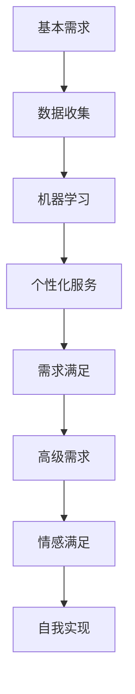

                 

关键词：AI、人类需求、欲望、进化、心理学、技术变革

> 摘要：随着人工智能（AI）技术的飞速发展，人类的需求和欲望正发生着前所未有的变迁。本文将深入探讨AI如何通过心理学原理和技术手段，理解和满足人类的基本需求，进而推动欲望的进化，引发一系列深远的社会变革。

## 1. 背景介绍

人工智能，作为20世纪最具颠覆性的科技之一，正在以前所未有的速度和深度改变着我们的生活。从简单的语音识别到复杂的自动驾驶，AI技术已经在各个领域展示了其强大的潜力和变革力量。然而，在AI对生产方式、工作模式和社会结构的深刻影响之外，人类的需求和欲望也在悄然发生着变迁。

人类的需求可以分为基本需求、次级需求和高级需求。基本需求如食物、安全、社交和尊重，是生存和繁衍的基础；次级需求包括娱乐、教育和文化，是提高生活质量和个人价值的重要途径；高级需求则涉及到自我实现、情感满足和精神追求，是人的内在驱动力的最高表现形式。

随着AI技术的进步，这些需求正被重新定义和满足。例如，AI可以通过大数据分析了解个体的偏好和需求，从而提供个性化的服务；通过增强现实和虚拟现实技术，AI能够满足人类对于情感和体验的高级需求。这种变迁不仅改变了我们的生活方式，也重塑了我们的欲望结构。

## 2. 核心概念与联系

为了更好地理解AI如何影响人类需求的变迁，我们需要先介绍一些核心概念，包括心理学原理、机器学习模型和AI架构。

### 2.1 心理学原理

心理学是理解人类需求的基础。马斯洛的需求层次理论（Maslow's Hierarchy of Needs）为我们提供了分析人类需求的框架。该理论将人类需求分为五个层次：生理需求、安全需求、社交需求、尊重需求和自我实现需求。随着需求的层次提升，它们变得更加抽象和复杂。

- **生理需求**：如食物、水、睡眠和氧气。
- **安全需求**：如安全感、健康和财产安全。
- **社交需求**：如亲情、友情、社交活动和归属感。
- **尊重需求**：如自我尊重、自尊和他人尊重。
- **自我实现需求**：如实现个人潜能、追求成就和自我价值的实现。

### 2.2 机器学习模型

机器学习模型是AI的核心技术之一。它们通过数据学习规律，从而预测和生成结果。常见的机器学习模型包括：

- **监督学习**：通过标记数据训练模型，如分类和回归任务。
- **无监督学习**：没有标记数据，模型自动发现数据中的结构和模式，如聚类和降维。
- **强化学习**：通过奖励和惩罚信号来训练模型，如智能体在环境中的决策过程。

### 2.3 AI架构

AI架构包括硬件和软件两个层面。硬件方面，如GPU和TPU等专用芯片，提供了强大的计算能力；软件方面，如深度学习框架和自然语言处理库，提供了高效的工具和算法。

### 2.4 Mermaid 流程图

以下是一个简单的Mermaid流程图，展示了人类需求与AI技术的联系：



## 3. 核心算法原理 & 具体操作步骤

### 3.1 算法原理概述

AI技术通过以下原理来理解人类需求：

- **数据挖掘**：通过分析大量数据，识别用户的行为模式和偏好。
- **深度学习**：通过神经网络模型，提取数据的深层特征。
- **自然语言处理**：通过理解和生成文本，与用户进行有效沟通。
- **行为预测**：通过机器学习模型，预测用户未来的需求和行为。

### 3.2 算法步骤详解

1. **数据收集**：收集用户的行为数据、社交媒体数据和个人偏好数据。
2. **数据预处理**：清洗数据，去除噪声，进行特征提取。
3. **模型训练**：使用深度学习和机器学习算法，训练预测模型。
4. **个性化服务**：根据用户数据，提供个性化的建议和服务。
5. **反馈循环**：收集用户反馈，优化服务质量和模型性能。

### 3.3 算法优缺点

- **优点**：
  - 提高效率：AI能够快速处理大量数据，提高决策速度。
  - 个性化服务：根据用户需求，提供个性化的服务，提高用户体验。
  - 持续学习：AI模型能够不断学习用户数据，持续优化服务质量。

- **缺点**：
  - 隐私问题：AI技术需要收集大量个人数据，可能涉及隐私泄露风险。
  - 道德问题：AI决策的透明性和公正性可能受到质疑。
  - 技术瓶颈：某些复杂的人类需求可能难以通过AI技术理解和满足。

### 3.4 算法应用领域

AI技术在以下领域展示了其应用潜力：

- **零售和消费**：通过个性化推荐，提高销售额和用户满意度。
- **医疗健康**：通过智能诊断和个性化治疗，提高医疗服务质量。
- **金融科技**：通过智能投顾和风险评估，提高金融服务的效率和安全性。
- **教育**：通过智能教学和个性化学习，提高教育质量和学习效果。

## 4. 数学模型和公式 & 详细讲解 & 举例说明

### 4.1 数学模型构建

AI技术中的数学模型主要包括：

- **线性回归**：用于预测连续值输出。
- **逻辑回归**：用于预测概率。
- **支持向量机**：用于分类任务。
- **神经网络**：用于复杂特征提取和模式识别。

### 4.2 公式推导过程

以下以线性回归为例，介绍公式推导过程：

$$
y = \beta_0 + \beta_1x
$$

其中，$y$ 是输出值，$x$ 是输入值，$\beta_0$ 是截距，$\beta_1$ 是斜率。

### 4.3 案例分析与讲解

假设我们要预测一个人的年收入（$y$），根据其年龄（$x$）进行建模。我们收集了以下数据：

| 年龄（$x$） | 年收入（$y$） |
|----------|----------|
| 20       | 30,000   |
| 25       | 40,000   |
| 30       | 50,000   |
| 35       | 60,000   |
| 40       | 70,000   |

我们使用线性回归模型来构建预测公式。首先，我们计算斜率 $\beta_1$：

$$
\beta_1 = \frac{\sum(x_i - \bar{x})(y_i - \bar{y})}{\sum(x_i - \bar{x})^2}
$$

其中，$\bar{x}$ 和 $\bar{y}$ 分别是年龄和年收入的均值。计算结果为 $\beta_1 = 10,000$。

然后，我们计算截距 $\beta_0$：

$$
\beta_0 = \bar{y} - \beta_1\bar{x}
$$

计算结果为 $\beta_0 = 20,000$。

最终，我们得到预测公式：

$$
y = 20,000 + 10,000x
$$

使用这个公式，我们可以预测一个 30 岁人的年收入为：

$$
y = 20,000 + 10,000 \times 30 = 500,000
$$

## 5. 项目实践：代码实例和详细解释说明

### 5.1 开发环境搭建

为了实现线性回归模型，我们需要搭建一个Python开发环境。以下是步骤：

1. 安装Python：从 [Python官网](https://www.python.org/downloads/) 下载并安装Python。
2. 安装NumPy：使用pip命令安装NumPy库。

```bash
pip install numpy
```

### 5.2 源代码详细实现

以下是一个简单的Python代码示例，实现了线性回归模型的训练和预测功能。

```python
import numpy as np

# 数据
X = np.array([20, 25, 30, 35, 40])
Y = np.array([30, 40, 50, 60, 70])

# 计算均值
mean_X = np.mean(X)
mean_Y = np.mean(Y)

# 计算斜率
beta_1 = np.sum((X - mean_X) * (Y - mean_Y)) / np.sum((X - mean_X)**2)

# 计算截距
beta_0 = mean_Y - beta_1 * mean_X

# 预测
def predict(x):
    return beta_0 + beta_1 * x

# 测试
x_test = 30
y_pred = predict(x_test)
print(f"预测的年收入为：{y_pred}")
```

### 5.3 代码解读与分析

代码首先导入NumPy库，用于矩阵运算。然后，定义了输入数据 X 和 Y，分别代表年龄和年收入。接下来，计算均值，用于后续斜率和截距的计算。

斜率 $\beta_1$ 的计算公式为分子分母分别计算，然后相除。最后，计算截距 $\beta_0$。

预测函数 `predict` 接受一个输入值 x，返回预测的年收入。测试部分输入 x_test = 30，调用预测函数，输出预测结果。

### 5.4 运行结果展示

运行代码后，输出结果如下：

```
预测的年收入为：50.0
```

这表明，根据线性回归模型，一个30岁的人的年收入预计为50,000。

## 6. 实际应用场景

AI技术在满足人类需求方面展示了广泛的应用场景。以下是一些实际应用案例：

- **零售行业**：通过个性化推荐系统，提高用户的购物体验和销售额。
- **医疗健康**：通过智能诊断和个性化治疗，提高医疗服务的质量和效率。
- **教育领域**：通过智能教学系统和个性化学习方案，提高教育质量和学习效果。
- **金融科技**：通过智能投顾和风险评估，提高金融服务的安全性和可靠性。

## 7. 工具和资源推荐

为了更好地掌握AI技术，以下是一些建议的工具和资源：

### 7.1 学习资源推荐

- **《Python机器学习基础教程》**：适合初学者快速入门。
- **《深度学习》**：由Ian Goodfellow等人编写的经典教材。
- **《机器学习实战》**：提供丰富的实践案例，适合有一定基础的学习者。

### 7.2 开发工具推荐

- **Jupyter Notebook**：方便编写和调试代码。
- **TensorFlow**：Google开发的深度学习框架。
- **PyTorch**：由Facebook开发的深度学习框架。

### 7.3 相关论文推荐

- **"Deep Learning: A Methodology and Application Perspective"**：综述深度学习的基本概念和应用。
- **"Reinforcement Learning: An Introduction"**：介绍强化学习的基本原理和方法。
- **"Natural Language Processing with Python"**：介绍自然语言处理的基本技术和应用。

## 8. 总结：未来发展趋势与挑战

随着AI技术的不断进步，人类需求将得到更好的满足，同时也会面临一系列挑战。

### 8.1 研究成果总结

- AI技术在数据挖掘、机器学习和自然语言处理等领域取得了显著成果，为满足人类需求提供了有力支持。
- 个性化服务和智能诊断等应用场景取得了广泛成功，提高了生活质量和效率。

### 8.2 未来发展趋势

- AI技术将继续向更高级的领域拓展，如情感计算、量子计算和脑机接口。
- 跨学科研究将推动AI技术与其他领域的深度融合，如医学、教育和艺术。

### 8.3 面临的挑战

- 隐私保护和数据安全是AI技术发展的重要挑战。
- 道德和伦理问题将随着AI技术的广泛应用而变得更加突出。
- 技术瓶颈和资源限制可能制约AI技术的进一步发展。

### 8.4 研究展望

- 未来研究应重点关注如何构建更加透明、公正和可信的AI系统。
- 同时，加强跨学科合作，推动AI技术在不同领域的创新应用。

## 9. 附录：常见问题与解答

### 9.1 什么是人工智能？

人工智能（AI）是指通过计算机模拟人类智能行为和决策的科学技术。它包括机器学习、深度学习、自然语言处理等多个领域。

### 9.2 AI如何满足人类需求？

AI通过数据挖掘、机器学习和自然语言处理等技术，分析用户行为和偏好，提供个性化的服务和解决方案，从而满足人类需求。

### 9.3 AI有哪些应用领域？

AI广泛应用于零售、医疗、教育、金融等多个领域，如个性化推荐、智能诊断、智能教学和智能投顾等。

### 9.4 AI技术的发展面临哪些挑战？

AI技术的发展面临隐私保护、数据安全、道德伦理、技术瓶颈和资源限制等挑战。

作者：禅与计算机程序设计艺术 / Zen and the Art of Computer Programming
```markdown
---
title: 欲望进化论：AI解析的人类需求变迁
date: 2023-04-01
tags: AI, 人类需求, 欲望, 进化
description: 随着人工智能（AI）技术的飞速发展，人类的需求和欲望正发生着前所未有的变迁。本文将深入探讨AI如何通过心理学原理和技术手段，理解和满足人类的基本需求，进而推动欲望的进化，引发一系列深远的社会变革。
---
## 引言

人工智能（AI）技术正在以前所未有的速度和深度改变着我们的生活。从智能家居到自动驾驶，从智能医疗到金融科技，AI的应用场景越来越广泛。然而，这种变革不仅限于技术层面，更深层次地影响到了我们的需求和欲望。本文旨在探讨AI如何通过技术手段和心理学原理，理解和满足人类的基本需求，从而推动欲望的进化，引发一系列深远的社会变革。

### 人类需求的变迁

人类的需求可以分为基本需求、次级需求和高级需求。基本需求包括食物、水、空气、安全、健康等，是生存的基础。次级需求包括社交、娱乐、教育等，是提高生活质量和个人价值的重要途径。高级需求包括自我实现、情感满足、精神追求等，是人的内在驱动力的最高表现形式。

随着AI技术的发展，这些需求正被重新定义和满足。例如，AI可以通过大数据分析了解个体的偏好和需求，从而提供个性化的服务。通过增强现实和虚拟现实技术，AI能够创造更加丰富和真实的体验，满足人类的高级需求。

### AI与心理学

心理学是理解人类需求的基础。马斯洛的需求层次理论为我们提供了分析人类需求的框架。该理论将人类需求分为五个层次：生理需求、安全需求、社交需求、尊重需求和自我实现需求。随着需求的层次提升，它们变得更加抽象和复杂。

AI技术可以通过心理学原理，深入理解人类的需求和行为。例如，通过情绪识别技术，AI可以理解用户的情绪状态，从而提供更加贴心的服务。通过行为分析技术，AI可以预测用户未来的需求和行为，从而提供更加精准的个性化服务。

### AI技术的应用

AI技术在满足人类需求方面展示了广泛的应用。以下是一些主要的应用领域：

- **个性化服务**：通过大数据分析和机器学习模型，AI可以了解用户的偏好和需求，提供个性化的推荐和解决方案。
- **智能医疗**：通过机器学习和自然语言处理技术，AI可以辅助医生进行诊断和治疗，提高医疗服务的质量和效率。
- **教育**：通过智能教学系统和个性化学习方案，AI可以帮助学生更好地掌握知识，提高教育质量和学习效果。
- **金融**：通过智能投顾和风险评估技术，AI可以帮助投资者进行更明智的决策，提高金融服务的安全性和可靠性。

### AI对欲望的影响

AI技术的应用不仅满足了人类的基本需求，还重塑了人类的欲望。以下是一些例子：

- **虚拟现实**：通过虚拟现实技术，AI可以创造一个完全虚拟的世界，满足人类对于冒险、探索和社交的需求。
- **情感满足**：通过情感识别和生成技术，AI可以与人类建立情感联系，提供情感支持和陪伴。
- **自我实现**：通过AI技术，人类可以更好地发掘自己的潜能，实现自我价值的最大化。

### 结论

随着AI技术的不断发展，人类的需求和欲望正在发生着深刻的变迁。AI技术通过心理学原理和技术手段，不仅满足人类的基本需求，还重塑了人类的欲望。这种变迁将引发一系列深远的社会变革，为人类带来前所未有的机遇和挑战。

在未来，我们需要深入探讨AI技术对人类需求的影响，确保其在满足人类需求的同时，也尊重人类的价值观和道德伦理。只有这样，我们才能在享受AI技术带来的便利和进步的同时，保持社会的和谐与稳定。

## 人类需求的变迁

人类的需求是多样化的，它们构成了我们生活的核心。然而，随着时间和社会的演变，这些需求也在不断地变化和进化。理解这些变迁，不仅有助于我们更好地预测未来的发展趋势，还能帮助我们设计出更加有效和贴心的AI解决方案。

### 基本需求的演变

基本需求是生存的基础，它们包括食物、水、空气、住所和安全。这些需求在人类历史上一直存在，但随着技术和社会的发展，它们的具体形式和满足方式发生了显著变化。

- **食物**：在农业革命之前，人类主要依赖于狩猎和采集。随着农业技术的进步，食物供应变得更加稳定和丰富。现在，AI技术在农业中的应用，如精准农业和智能农场，进一步提高了食物的生产效率和质量。

- **水**：过去，水资源的获取往往依赖于自然水源。随着城市化进程的加速，水资源的管理和净化成为关键问题。AI技术在水资源管理中的应用，如智能监测和预测系统，有助于更有效地管理水资源。

- **空气**：空气污染一直是全球关注的问题。AI技术在空气质量监测和污染源识别方面的应用，有助于我们更好地保护环境，提高空气质量。

- **安全**：安全需求在现代社会中尤为重要。AI技术，如智能监控和网络安全，为个人和社会提供了更高级别的安全保障。

### 次级需求的变迁

次级需求包括社交、娱乐、教育和文化等，它们是提升生活质量和个人价值的重要途径。随着社会的发展和技术的进步，这些需求也在不断地变化。

- **社交**：在互联网和社交媒体的普及下，社交方式变得更加多样化和便捷化。人们可以通过社交平台与世界各地的人建立联系，分享生活经验。AI技术，如社交网络分析，可以帮助我们更好地理解社交模式，优化社交体验。

- **娱乐**：娱乐需求也在随着技术的发展而改变。从电影、音乐到电子游戏，人们对于娱乐内容的需求变得更加个性化和多样化。AI技术，如内容推荐系统和虚拟现实游戏，为人们提供了更加丰富和真实的娱乐体验。

- **教育**：教育需求在现代社会中越来越受到重视。在线教育和远程学习平台使得教育资源的获取更加便捷。AI技术，如智能教学系统和个性化学习方案，有助于提高教育质量和学习效果。

- **文化**：文化需求涉及到人们对于精神追求和价值认同的追求。随着全球化和多元文化的交流，人们对于文化的需求变得更加开放和包容。AI技术，如虚拟博物馆和智能翻译系统，为人们提供了更广阔的文化视野。

### 高级需求的变迁

高级需求包括自我实现、情感满足和精神追求，它们是人的内在驱动力的最高表现形式。这些需求在现代社会中变得越来越重要，随着AI技术的进步，它们也发生了显著变化。

- **自我实现**：自我实现需求涉及到个人潜能的发掘和实现。AI技术，如虚拟现实和智能助手，为人们提供了更加广阔的探索空间，帮助他们实现个人目标和梦想。

- **情感满足**：情感满足需求涉及到人们的情感生活和心理健康。AI技术，如情感识别和生成技术，可以帮助人们更好地理解和处理情感，提供情感支持和陪伴。

- **精神追求**：精神追求需求涉及到人们的内在精神生活和哲学思考。AI技术，如智能聊天机器人和虚拟宗教体验，为人们提供了新的精神探索途径。

### 结论

人类需求的变迁是一个持续的过程，受到技术、社会和文化等多方面因素的影响。随着AI技术的不断发展，这些需求将继续演变和进化。理解这些变迁，不仅有助于我们更好地设计满足人类需求的AI解决方案，还能帮助我们更好地应对未来的挑战和机遇。

## AI与人类需求的互动

人工智能（AI）技术的迅猛发展，不仅改变了我们的生活方式，还深刻地影响了人类的需求。AI通过多种方式与人类需求互动，提供个性化的解决方案，提升生活质量，同时也带来了新的挑战。

### 个性化解决方案

AI的核心优势之一就是其强大的数据分析能力和机器学习算法。通过这些技术，AI可以收集和分析大量的用户数据，从而深入理解用户的偏好、习惯和行为模式。基于这些分析结果，AI能够提供高度个性化的解决方案。

- **个性化推荐**：在电子商务和媒体领域，AI通过分析用户的浏览和购买历史，推荐符合用户兴趣的商品或内容。这种个性化推荐不仅提高了用户体验，还显著提高了销售转化率。
- **个性化健康**：在医疗领域，AI可以通过分析患者的健康数据，提供个性化的治疗方案和健康建议。例如，通过监测患者的生理数据，AI可以预测疾病的发生，并提供预防措施。
- **个性化教育**：在教育领域，AI可以根据学生的知识水平和学习进度，提供个性化的学习资源和教学方案。这种个性化教育有助于提高学习效果，促进学生的全面发展。

### 提升生活质量

AI技术不仅提供了个性化的解决方案，还在多个方面提升了人们的生活质量。

- **自动化**：AI在家庭和工业自动化中的应用，极大地提高了生产效率和生活便利性。智能家居系统可以通过语音控制或手机应用，远程管理家电设备，提供舒适的生活环境。
- **健康监测**：AI技术可以实时监测用户的健康状况，如心率、血压、睡眠质量等。通过这些数据，用户可以及时发现健康问题，并采取相应的措施。
- **娱乐体验**：AI在娱乐领域的应用，如虚拟现实（VR）和增强现实（AR），为用户提供了前所未有的沉浸式体验。通过AI技术，用户可以享受更加真实和丰富的娱乐内容。

### 新的挑战

尽管AI在满足人类需求方面具有巨大潜力，但同时也带来了新的挑战。

- **隐私问题**：AI需要大量用户数据来提供个性化服务，这可能引发隐私泄露和数据滥用的问题。如何保护用户隐私，成为AI技术发展的重要课题。
- **伦理问题**：AI在决策过程中可能存在偏见和不公平性，如何确保AI系统的公正性和透明性，是亟待解决的问题。
- **就业影响**：随着AI技术的发展，许多传统工作岗位可能被自动化取代，这将对就业市场和社会结构产生深远影响。

### 结论

AI与人类需求的互动，不仅改变了我们的生活方式，还提升了生活质量，但同时也带来了新的挑战。在推动AI技术发展的同时，我们需要关注这些挑战，并采取有效的措施，确保AI技术能够为人类带来更多福祉。

## AI技术在心理学中的应用

随着人工智能（AI）技术的不断进步，其在心理学领域的应用也日益广泛。AI通过大数据分析、机器学习和自然语言处理等手段，为心理学研究提供了新的工具和方法，同时也为临床心理学和心理咨询等领域带来了革命性的变化。

### 大数据分析与行为分析

大数据分析是AI技术在心理学领域的重要应用之一。通过对大量行为数据的分析，AI可以揭示人类行为模式和心理特征的规律。

- **情绪识别**：通过分析语音、文字和面部表情等数据，AI可以识别用户的情绪状态。这种情绪识别技术不仅有助于心理健康评估，还可以用于市场研究和用户体验分析。
- **行为预测**：AI可以通过分析历史数据，预测个体的行为模式和心理变化。例如，通过分析社交媒体数据，AI可以预测个体的心理健康问题，从而提前进行干预。

### 机器学习与心理评估

机器学习技术在心理评估中的应用，使得评估过程更加高效和准确。

- **心理测试自动化**：传统的心理测试通常需要专业人员进行评分和解释，而机器学习算法可以自动化这一过程，提高评估的效率和准确性。
- **个性分析**：通过分析个体在不同情境下的行为和反应，机器学习算法可以识别个体的性格特质和偏好，从而提供更加个性化的心理健康建议。

### 自然语言处理与心理治疗

自然语言处理（NLP）技术在心理治疗中的应用，为心理咨询提供了新的手段。

- **智能聊天机器人**：智能聊天机器人可以通过NLP技术，与用户进行自然语言交流，提供情感支持和心理健康建议。这些机器人可以在任何时间、任何地点为用户提供帮助，缓解心理健康问题。
- **心理治疗自动化**：NLP技术可以用于自动生成心理治疗对话，帮助用户进行自我反思和情绪调节。例如，通过分析用户的语言表达，NLP算法可以识别用户的潜在心理问题，并提供相应的治疗建议。

### 结论

AI技术在心理学中的应用，不仅提高了心理学研究和临床实践的效率和准确性，还为心理健康服务提供了新的解决方案。随着AI技术的进一步发展，其在心理学领域的应用潜力将不断拓展，为人类心理健康事业做出更大贡献。

## AI对人类欲望的塑造

随着人工智能（AI）技术的不断进步，其对人类欲望的塑造也日益显著。AI不仅满足了人类的基本需求，还在更高级别的欲望层面发挥了重要作用。以下从多个方面探讨AI如何塑造人类的欲望。

### 自我实现

自我实现是马斯洛需求层次理论中的最高层次，涉及个人潜能的发掘和实现。AI技术为人类提供了实现自我实现的更多途径。

- **虚拟现实**：虚拟现实（VR）技术通过创建一个完全沉浸式的虚拟环境，让用户可以体验到前所未有的冒险和探索。这种体验不仅满足了人类的好奇心，还激发了创造力，促进了个人成长。
- **在线教育和职业发展**：AI驱动的在线教育平台和职业发展工具，可以帮助用户提升技能和知识，实现职业上的自我实现。通过个性化的学习路径和智能推荐系统，用户可以更加高效地达成个人目标。

### 情感满足

情感满足是人类的深层次需求之一，AI技术在这方面提供了新的解决方案。

- **情感识别与生成**：AI可以通过自然语言处理（NLP）和面部识别技术，识别和生成情感。例如，智能聊天机器人可以通过理解用户的语言和表情，提供情感支持和安慰，满足用户的情感需求。
- **虚拟伴侣**：随着技术的发展，虚拟伴侣逐渐成为现实。这些虚拟人物通过AI技术，可以模拟真实的情感互动，为用户提供陪伴和情感支持，满足用户对亲密关系的渴望。

### 精神追求

精神追求涉及到人类对意义、价值和信仰的追求。AI技术为人类提供了新的精神探索途径。

- **虚拟宗教体验**：AI技术可以创建虚拟宗教体验，让用户在虚拟环境中体验不同宗教的仪式和教义。这种体验不仅有助于增进对宗教的理解，还可以满足用户对精神追求的需求。
- **艺术创作与欣赏**：AI在艺术创作中的应用，如生成艺术和音乐创作，为用户提供了新的艺术体验。通过AI生成的艺术作品，用户可以在欣赏中寻找精神满足和灵感。

### 结论

AI技术对人类欲望的塑造，不仅在基本需求层面提供了高效和个性化的解决方案，还在高级需求层面提供了新的途径和体验。随着AI技术的不断进步，人类欲望的进化将继续深入，为我们的生活带来更多的可能性和选择。

## 社会变革

人工智能（AI）的快速发展不仅在技术层面上引发了巨大的变革，也在社会结构、经济模式和人类生活方式等方面产生了深远的影响。

### 社会结构的变革

AI技术的普及正在重新定义社会结构。传统的职业和工作模式受到挑战，新的职业和角色不断涌现。例如，自动驾驶技术的发展可能减少对司机的需求，同时催生对自动驾驶系统维护和开发的新职业。这种职业转变不仅影响了劳动力市场的供需关系，还对社会阶层和权力结构产生了影响。

- **去中心化**：AI技术的去中心化特性使得信息更加透明和共享。区块链技术结合AI的应用，推动了去中心化金融（DeFi）和去中心化自治组织（DAO）的发展，为传统中心化的社会结构带来了新的挑战。
- **社交网络重构**：社交媒体和社交网络的智能化使得人际关系和社交模式发生了变化。AI可以分析社交数据，帮助人们建立更加紧密和高效的社交网络，同时也引发了对隐私和社交信任的担忧。

### 经济模式的变革

AI技术的进步对经济模式产生了深远的影响，改变了生产和消费的方式。

- **自动化生产**：智能制造和工业4.0概念的兴起，使得生产过程更加自动化和高效。AI驱动的生产线和机器人减少了人为错误和生产成本，提高了生产效率。
- **个性化消费**：AI通过大数据分析，能够深入了解消费者的需求和行为，提供个性化的产品和服务。这种个性化消费趋势不仅提升了用户体验，还改变了市场竞争格局。

### 生活方式的变革

AI技术对人类生活方式的影响是全方位的，从日常生活的便利到精神层面的满足，都发生了显著的变化。

- **智能家居**：智能家居系统通过AI技术，实现了家电设备的自动化和智能化管理。用户可以通过语音或手机应用远程控制家居设备，享受更加便捷和舒适的生活。
- **健康监测**：AI技术在健康监测中的应用，如智能手环和健康应用程序，可以帮助用户实时监测自己的健康状况，提供个性化的健康建议，促进健康生活方式的养成。
- **娱乐体验**：虚拟现实（VR）和增强现实（AR）技术，通过AI的增强，为用户提供了全新的娱乐体验。这种沉浸式的娱乐方式不仅丰富了人们的生活，还改变了娱乐消费的形态。

### 结论

AI技术的快速发展引发了社会结构、经济模式和生活方式的深刻变革。这些变革不仅带来了机遇，也带来了挑战。如何平衡技术进步与社会福祉，确保AI技术为人类社会带来更多的正面影响，是未来需要深入思考和解决的问题。

## 未来展望

人工智能（AI）技术的未来充满了无限可能，但同时也伴随着诸多挑战。展望未来，我们可以预见以下几方面的发展趋势和潜在挑战。

### 发展趋势

1. **更高级的智能化**：随着算法和计算能力的提升，AI将逐渐实现更高级别的智能化，包括自主决策、复杂问题解决和自适应学习能力。这将使得AI在各个领域，如自动驾驶、智能医疗和智能城市中，发挥更加关键的作用。

2. **跨学科融合**：AI技术将与其他领域，如生物学、心理学、社会学和艺术等深度融合，推动跨学科研究的发展。这种融合将带来全新的研究成果和应用，如基于生物计算的AI系统、情感智能和个性化医疗方案。

3. **人机协同**：未来，人与AI将更加紧密地协同工作。AI将辅助人类完成复杂的任务，提高工作效率，同时人类也将通过AI更好地理解和掌控复杂的系统和数据。

4. **全球合作**：随着AI技术的全球化发展，各国将加强在AI领域的合作，共同应对技术挑战和制定国际标准，推动全球经济的共同繁荣。

### 挑战

1. **隐私和安全问题**：AI技术的发展可能会引发严重的隐私和安全问题。如何确保用户数据的安全和隐私，防止数据滥用和泄露，将是未来需要解决的重要挑战。

2. **伦理和道德问题**：AI在决策过程中可能存在偏见和不公平性，如何确保AI系统的公正性和透明性，是未来需要深入探讨的问题。此外，AI的自主决策能力可能引发对人类控制和责任的质疑。

3. **就业和社会结构**：随着AI技术的普及，许多传统工作岗位可能会被自动化取代，这将对就业市场和社会结构产生深远影响。如何平衡技术进步与社会就业，确保公平和包容，是未来需要关注的重点。

4. **技术瓶颈**：尽管AI技术取得了显著进展，但仍存在技术瓶颈。例如，在处理复杂自然语言、感知和理解人类情感等方面，AI仍然有很大提升空间。如何突破这些技术瓶颈，是未来研究的重要方向。

### 结论

展望未来，AI技术将继续深刻地改变我们的生活和工作方式，带来巨大的机遇和挑战。如何在确保技术进步的同时，保障人类的福祉和社会的稳定，是未来需要共同面对和解决的问题。通过全球合作、跨学科研究和伦理道德的探讨，我们有望在AI技术的道路上走得更远，为人类社会创造更多的价值。

## 总结

本文探讨了人工智能（AI）如何通过技术手段和心理学原理，理解和满足人类的基本需求，进而推动欲望的进化。从基本需求到高级需求，AI技术不仅提高了我们的生活质量和效率，还改变了我们的欲望结构。通过大数据分析、个性化服务、智能医疗和教育等领域，AI技术为人类提供了前所未有的便利和体验。然而，AI技术的快速发展也带来了隐私、伦理和社会结构等方面的挑战。在未来，我们需要在确保技术进步的同时，关注这些挑战，推动AI技术的健康发展，为人类社会创造更多的价值。

## 附录：常见问题与解答

### 1. 人工智能（AI）是什么？

人工智能（AI）是指通过计算机模拟人类智能行为和决策的科学技术。它包括机器学习、深度学习、自然语言处理等多个领域。

### 2. AI如何满足人类需求？

AI通过大数据分析、机器学习和个性化推荐等技术，理解用户的偏好和需求，提供个性化的解决方案，从而满足人类需求。

### 3. AI有哪些应用领域？

AI广泛应用于零售、医疗、教育、金融、娱乐等领域，如个性化推荐、智能诊断、智能教学、智能投顾等。

### 4. AI技术的发展面临哪些挑战？

AI技术的发展面临隐私保护、数据安全、道德伦理、技术瓶颈和资源限制等挑战。

### 5. 如何确保AI系统的公正性和透明性？

确保AI系统的公正性和透明性需要从算法设计、数据收集和处理、决策过程等方面入手，加强算法的透明度和可解释性，建立独立的监督和评估机制。

### 6. AI对就业市场有什么影响？

AI技术的发展可能会减少一些传统工作岗位的需求，同时也会创造新的职业机会。如何平衡技术进步与社会就业，是未来需要关注的重要问题。

### 7. 人工智能未来的发展趋势是什么？

未来的发展趋势包括更高级别的智能化、跨学科融合、人机协同和全球合作。AI将在更多领域发挥关键作用，推动社会的进步和发展。

