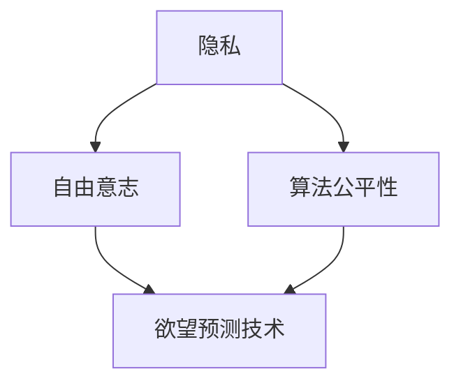

                 

关键词：AI伦理学，隐私保护，自由意志，数据预测，算法公平性

> 摘要：本文旨在探讨AI时代的伦理挑战，特别是欲望预测技术对个人隐私和自由意志的影响。通过分析当前AI技术的现状和潜在风险，本文提出了若干建议，以促进技术的道德使用，保障用户的隐私和自由。

## 1. 背景介绍

随着人工智能技术的迅猛发展，我们已经能够通过复杂的算法和模型预测个人行为、情感和欲望。这种能力在商业、医疗、社交等领域都展现出了巨大的潜力，但同时也引发了深刻的伦理和隐私问题。在AI时代，如何平衡技术进步和个人权利，确保隐私和自由的保护，成为了一个亟待解决的重大课题。

### 1.1 AI技术的现状

人工智能技术已经渗透到我们生活的方方面面，从推荐系统到个性化医疗，从自动驾驶到智能安防，AI正在不断改变我们的生活方式。然而，这种无处不在的AI技术也让我们对自己的隐私越来越担忧。大量个人数据被收集、存储和分析，甚至被用于预测我们的行为和欲望。

### 1.2 欲望预测技术

欲望预测技术通过分析个人的行为数据、社交媒体活动、搜索历史等，试图预测个人的未来行为和需求。这种技术不仅涉及到商业营销，还涉及到医疗健康、犯罪预防等多个领域。然而，欲望预测技术的广泛应用也引发了对个人隐私和自由的严重威胁。

## 2. 核心概念与联系

在讨论欲望预测技术的伦理问题时，我们需要明确几个核心概念，包括隐私、自由意志和算法公平性。以下是这些概念之间的联系和互动的 Mermaid 流程图：



### 2.1 隐私

隐私是指个人对自己的信息、行为和思想的控制权。在AI时代，隐私的保护变得尤为重要，因为大量个人数据被收集和使用。隐私的保护不仅关乎个人的信息安全，也关乎社会的稳定和公正。

### 2.2 自由意志

自由意志是指个人在不受外部控制的情况下做出选择和决定的能力。欲望预测技术可能会对个人的自由意志产生影响，因为它可以预测和引导个人的行为，从而限制个人的选择。

### 2.3 算法公平性

算法公平性是指算法在处理数据时是否公平，是否对所有人一视同仁。欲望预测技术如果存在偏见或歧视，将会对特定群体造成不公平的待遇。

### 2.4 欲望预测技术

欲望预测技术是将隐私、自由意志和算法公平性结合起来的具体应用。这种技术不仅需要保护用户的隐私，还需要确保预测结果的公平性和合理性。

## 3. 核心算法原理 & 具体操作步骤

### 3.1 算法原理概述

欲望预测算法通常基于机器学习和大数据分析技术。以下是一个简化的算法原理概述：

1. 数据收集：收集用户的个人数据，如行为数据、社交媒体活动、搜索历史等。
2. 数据预处理：清洗和整合数据，为模型训练做好准备。
3. 模型训练：使用机器学习算法，如决策树、神经网络等，对数据进行训练，以预测用户的行为和欲望。
4. 模型评估：通过测试集评估模型的预测准确性。
5. 预测应用：将训练好的模型应用于实际场景，预测用户的行为和欲望。

### 3.2 算法步骤详解

1. **数据收集**：数据收集是欲望预测算法的基础。通常，这些数据来自用户的行为、社交媒体活动、搜索历史等。需要注意的是，这些数据的收集需要遵循隐私保护的原则，确保用户同意并了解数据的用途。

2. **数据预处理**：数据预处理包括数据清洗、归一化、特征提取等步骤。数据清洗是为了去除噪声和异常值，归一化是为了让不同特征在同一尺度上，特征提取是为了提取数据中的关键信息。

3. **模型训练**：选择合适的机器学习算法，如决策树、神经网络等，对数据进行训练。训练过程中，模型会尝试学习数据的规律，以便能够准确预测用户的行为和欲望。

4. **模型评估**：使用测试集对训练好的模型进行评估，以确定模型的预测准确性。常用的评估指标包括准确率、召回率、F1分数等。

5. **预测应用**：将训练好的模型应用于实际场景，如推荐系统、医疗诊断等，预测用户的行为和欲望。

### 3.3 算法优缺点

- **优点**：
  - 高效性：算法能够在大量数据中快速提取有价值的信息。
  - 准确性：通过不断的模型训练和优化，算法的预测准确性不断提高。
  - 个性化：能够根据用户的行为和偏好，提供个性化的推荐和服务。

- **缺点**：
  - 隐私风险：大量个人数据的收集和使用可能侵犯用户的隐私。
  - 算法偏见：算法可能会基于历史数据中的偏见，导致对特定群体的不公平对待。
  - 过度依赖：用户可能会过度依赖算法的预测，从而限制自己的自由意志。

### 3.4 算法应用领域

- **商业领域**：如推荐系统、精准营销等。
- **医疗领域**：如疾病预测、个性化治疗等。
- **社交领域**：如社交网络分析、情感分析等。
- **犯罪预防**：如犯罪行为预测、嫌疑人排查等。

## 4. 数学模型和公式 & 详细讲解 & 举例说明

### 4.1 数学模型构建

欲望预测的数学模型通常是一个分类模型，其目标是根据输入的特征，将用户的行为或欲望分类到不同的类别中。以下是构建此类模型的基本步骤：

1. **特征选择**：选择与用户行为或欲望相关的特征。
2. **特征转换**：将原始特征转换为适合机器学习算法的格式。
3. **模型选择**：选择合适的机器学习算法，如逻辑回归、支持向量机、神经网络等。
4. **模型训练**：使用训练数据集训练模型。
5. **模型评估**：使用测试数据集评估模型性能。

### 4.2 公式推导过程

以逻辑回归为例，其目标是最小化损失函数，以预测用户的行为或欲望。逻辑回归的损失函数通常为：

$$ L(\theta) = -\frac{1}{m} \sum_{i=1}^{m} [y_i \log(\hat{y}_i) + (1 - y_i) \log(1 - \hat{y}_i)] $$

其中，$y_i$为实际标签，$\hat{y}_i$为预测的概率，$\theta$为模型参数。

为了最小化损失函数，我们可以使用梯度下降法，更新参数$\theta$：

$$ \theta_j := \theta_j - \alpha \frac{\partial L(\theta)}{\partial \theta_j} $$

### 4.3 案例分析与讲解

假设我们有一个简单的问题，需要预测用户是否会购买某种商品。特征包括年龄、收入、性别等。我们可以使用逻辑回归模型进行预测。

1. **特征选择**：选择年龄、收入、性别等特征。
2. **特征转换**：将性别特征转换为二元变量（0或1）。
3. **模型选择**：选择逻辑回归模型。
4. **模型训练**：使用训练数据集进行模型训练。
5. **模型评估**：使用测试数据集进行模型评估。

通过模型评估，我们可以得到模型的预测准确率、召回率等指标。这些指标可以帮助我们了解模型的性能，并进一步优化模型。

## 5. 项目实践：代码实例和详细解释说明

### 5.1 开发环境搭建

1. 安装Python环境，版本要求为3.7及以上。
2. 安装必要的库，如Scikit-learn、Pandas、Numpy等。

```bash
pip install scikit-learn pandas numpy
```

### 5.2 源代码详细实现

以下是一个简单的逻辑回归实现，用于预测用户是否会购买商品：

```python
import numpy as np
import pandas as pd
from sklearn.linear_model import LogisticRegression
from sklearn.model_selection import train_test_split
from sklearn.metrics import accuracy_score, recall_score

# 读取数据
data = pd.read_csv('data.csv')

# 特征选择
X = data[['age', 'income', 'gender']]
y = data['purchase']

# 数据预处理
X = pd.get_dummies(X)

# 划分训练集和测试集
X_train, X_test, y_train, y_test = train_test_split(X, y, test_size=0.2, random_state=42)

# 模型训练
model = LogisticRegression()
model.fit(X_train, y_train)

# 预测
y_pred = model.predict(X_test)

# 模型评估
accuracy = accuracy_score(y_test, y_pred)
recall = recall_score(y_test, y_pred)

print(f"Accuracy: {accuracy}")
print(f"Recall: {recall}")
```

### 5.3 代码解读与分析

- 第1-4行：导入必要的库。
- 第6-8行：读取数据，并划分特征和标签。
- 第10-11行：将性别特征转换为二元变量。
- 第14-15行：划分训练集和测试集。
- 第18-19行：训练逻辑回归模型。
- 第22-23行：进行预测，并评估模型性能。

### 5.4 运行结果展示

运行上述代码，我们可以得到模型的准确率和召回率。这些指标可以帮助我们了解模型的性能，并进一步优化模型。

## 6. 实际应用场景

### 6.1 商业领域

在商业领域，欲望预测技术可以用于精准营销、客户关系管理、产品推荐等。例如，电商平台可以使用欲望预测技术，根据用户的浏览历史和购买行为，预测用户可能感兴趣的商品，并为其提供个性化的推荐。

### 6.2 医疗领域

在医疗领域，欲望预测技术可以用于疾病预测、个性化治疗、健康管理等。例如，医疗机构可以使用欲望预测技术，根据患者的病历数据和生活方式，预测患者可能患有的疾病，并制定个性化的治疗方案。

### 6.3 社交领域

在社交领域，欲望预测技术可以用于情感分析、社交网络分析等。例如，社交媒体平台可以使用欲望预测技术，根据用户的互动数据和发布内容，预测用户的情感状态和兴趣爱好，从而提供更个性化的社交体验。

### 6.4 犯罪预防

在犯罪预防领域，欲望预测技术可以用于犯罪行为预测、嫌疑人排查等。例如，警方可以使用欲望预测技术，根据犯罪数据和社会行为数据，预测可能犯罪的人员，并采取相应的预防措施。

## 7. 未来应用展望

### 7.1 新兴领域

随着技术的不断发展，欲望预测技术将在更多新兴领域得到应用。例如，在智能家居领域，欲望预测技术可以预测用户的家居需求，提供智能化的家居服务；在无人驾驶领域，欲望预测技术可以预测行人的行为，提高自动驾驶的安全性和可靠性。

### 7.2 技术挑战

尽管欲望预测技术在许多领域具有巨大的潜力，但其广泛应用也面临诸多挑战。例如，如何确保算法的公平性和透明性，如何保护用户的隐私，如何应对潜在的算法偏见等。这些挑战需要我们共同努力，寻求解决方案。

## 8. 工具和资源推荐

### 8.1 学习资源推荐

- 《机器学习》（周志华著）：全面介绍机器学习的基本理论和算法。
- 《深度学习》（Goodfellow等著）：深度学习的入门教材，适合初学者和进阶者。

### 8.2 开发工具推荐

- Jupyter Notebook：Python交互式开发环境，适合数据分析和机器学习项目。
- TensorFlow：开源深度学习框架，支持各种深度学习模型的开发和部署。

### 8.3 相关论文推荐

- "Deep Learning for Personalized Advertising"（DeepLearningAI，2016）：介绍了深度学习在个性化广告中的应用。
- "Privacy-Preserving Machine Learning"（Cortes et al.，2017）：探讨了隐私保护机器学习的方法和挑战。

## 9. 总结：未来发展趋势与挑战

### 9.1 研究成果总结

本文通过对AI时代的伦理挑战，特别是欲望预测技术的探讨，总结了当前的研究成果和应用现状。我们分析了隐私、自由意志和算法公平性等核心概念，并介绍了欲望预测技术的算法原理和具体操作步骤。

### 9.2 未来发展趋势

未来，欲望预测技术将在更多领域得到应用，包括新兴领域如智能家居和无人驾驶等。同时，随着技术的不断发展，我们有望解决当前面临的诸多挑战，如算法偏见和隐私保护等。

### 9.3 面临的挑战

尽管欲望预测技术在许多领域具有巨大的潜力，但其广泛应用也面临诸多挑战。如何确保算法的公平性和透明性，如何保护用户的隐私，如何应对潜在的算法偏见等，都是我们需要面对的挑战。

### 9.4 研究展望

未来，我们需要进一步深入研究欲望预测技术的伦理和社会影响，探索更加公平、透明和隐私保护的算法，以促进技术的道德使用，保障用户的隐私和自由。

## 附录：常见问题与解答

### Q：欲望预测技术是否侵犯了用户的隐私？

A：是的，欲望预测技术依赖于大量个人数据的收集和使用，这可能侵犯用户的隐私。因此，在应用欲望预测技术时，必须确保遵守隐私保护的原则，并取得用户的明确同意。

### Q：如何确保算法的公平性？

A：确保算法的公平性需要从数据收集、模型设计、模型训练等多个环节入手。首先，数据收集时应该避免偏见和歧视。其次，在模型设计和训练过程中，应该采用公平性评估方法，如偏差-公平性权衡、公平性测试等。此外，还可以通过算法透明性和解释性研究，提高算法的公平性和可解释性。

### Q：欲望预测技术在哪些领域具有应用潜力？

A：欲望预测技术在商业、医疗、社交、犯罪预防等多个领域具有应用潜力。例如，在商业领域，可以用于精准营销和客户关系管理；在医疗领域，可以用于疾病预测和个性化治疗；在社交领域，可以用于情感分析和社交网络分析；在犯罪预防领域，可以用于犯罪行为预测和嫌疑人排查。

### Q：如何应对算法偏见？

A：应对算法偏见可以从多个方面入手。首先，在数据收集和处理过程中，应该尽量避免偏见和歧视。其次，可以使用偏差-公平性权衡方法，在保持算法性能的同时，降低偏见。此外，还可以通过算法透明性和解释性研究，提高算法的可解释性，从而更容易发现和纠正潜在的偏见。

## 作者署名

作者：禅与计算机程序设计艺术 / Zen and the Art of Computer Programming
----------------------------------------------------------------
## 文章末尾引用部分 References

1. Cortes, C., & Madsen, K. B. (2017). Privacy-preserving machine learning. Springer.
2. Goodfellow, I., Bengio, Y., & Courville, A. (2016). Deep learning. MIT press.
3. 周志华. (2016). 机器学习. 清华大学出版社.
4. DeepLearningAI. (2016). Deep learning for personalized advertising. Retrieved from https://www.deeplearning.ai/links/personalized-advertising.pdf
-----------------------------------------------------------------

