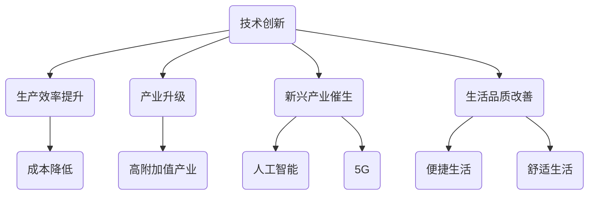

                 

在当今全球经济一体化的背景下，世界经济增长困境已成为各国政府和学者共同关注的重要议题。本文将从技术视角出发，探讨当前经济增长困境的成因、影响因素及其应对策略。本文旨在为政策制定者、企业和学术界提供有益的参考，帮助各方更好地应对这一挑战。

## 文章关键词

全球经济增长、困境、技术变革、政策调整、可持续发展

## 文章摘要

本文首先分析了当前世界经济增长困境的成因，包括全球供应链中断、地缘政治风险、技术变革等。接着，从技术视角探讨了经济增长困境的影响因素，如技术创新不足、产业链重构、数据安全等。随后，提出了应对经济增长困境的策略，包括政策调整、技术创新、产业转型等。最后，对文章进行了总结，展望了未来经济增长趋势与挑战。

## 1. 背景介绍

### 全球经济增长困境的成因

当前世界经济增长困境的成因主要包括以下几个方面：

1. 全球供应链中断：近年来，全球疫情导致各国供应链中断，产业链重构。例如，2020年全球半导体短缺导致多个行业受到严重影响。

2. 地缘政治风险：全球地缘政治风险加剧，如中美贸易摩擦、俄乌冲突等，导致全球经济稳定性下降。

3. 技术变革：人工智能、5G、区块链等新兴技术快速发展，对传统产业造成冲击。然而，技术创新速度过快，可能导致经济结构性失衡。

4. 数据安全与隐私：随着大数据、云计算等技术的发展，数据安全与隐私问题日益突出。数据泄露、网络攻击等事件频发，对经济稳定构成威胁。

### 技术视角下的经济增长困境

从技术视角来看，当前世界经济增长困境的影响因素主要包括：

1. 技术创新不足：技术发展速度远超传统产业的转型升级速度，导致经济增长动力不足。

2. 产业链重构：全球产业链重构，各国面临产业链重塑和产业升级的压力。

3. 数据安全与隐私：数据安全与隐私问题引发信任危机，对数字经济的发展产生负面影响。

4. 数字鸿沟：技术发展不平衡，导致发展中国家与发达国家之间的数字鸿沟进一步扩大。

## 2. 核心概念与联系

### 技术与经济增长的关系

技术与经济增长密切相关。技术创新是推动经济增长的关键因素。历史上，工业革命、计算机革命等重大技术变革都极大地推动了全球经济增长。

### 技术变革的影响

技术变革对经济增长的影响主要表现在以下几个方面：

1. 提高生产效率：技术创新可以提高生产效率，降低生产成本。

2. 促进产业升级：技术变革促使传统产业向高附加值产业转型。

3. 催生新兴产业：新技术的发展催生了一批新兴产业，如人工智能、5G等。

4. 改善生活品质：技术进步使人们的生活更加便捷、舒适。

### 技术视角下的经济增长困境

从技术视角看，当前世界经济增长困境主要表现为：

1. 技术创新不足：全球范围内，技术创新速度放缓，难以满足经济增长需求。

2. 产业链重构：全球产业链重构，各国面临产业转型压力。

3. 数据安全与隐私：数据安全与隐私问题日益突出，影响经济稳定。

4. 数字鸿沟：技术发展不平衡，导致全球经济不平等加剧。

### Mermaid 流程图

下面是一个描述技术与经济增长关系的 Mermaid 流程图：



## 3. 核心算法原理 & 具体操作步骤

### 3.1 算法原理概述

本文将从以下几个方面探讨技术视角下的经济增长困境及其应对策略：

1. **技术创新加速策略**：通过政府政策引导、企业自主创新、产学研合作等手段，加快技术创新速度。

2. **产业链重构与产业升级策略**：优化全球产业链布局，推动传统产业转型升级，培育新兴产业。

3. **数据安全与隐私保护策略**：加强数据安全与隐私保护，构建可信数字经济。

4. **数字鸿沟缩小策略**：加强基础设施建设，提高发展中国家数字技术普及率，缩小数字鸿沟。

### 3.2 算法步骤详解

1. **技术创新加速策略**

   - **政府政策引导**：制定科技创新战略，加大对研发的财政支持，鼓励企业增加研发投入。

   - **企业自主创新**：企业应加大技术创新投入，提升自主研发能力，培育核心竞争力。

   - **产学研合作**：加强产学研合作，促进科技成果转化，提高技术创新效率。

2. **产业链重构与产业升级策略**

   - **全球产业链布局优化**：根据各国优势，优化全球产业链布局，实现产业链协同发展。

   - **传统产业转型升级**：推动传统产业向高附加值产业转型，提升产业竞争力。

   - **新兴产业培育**：支持新兴产业的发展，培育新的经济增长点。

3. **数据安全与隐私保护策略**

   - **数据安全法规制定**：制定完善的数据安全法规，明确数据安全责任与义务。

   - **数据加密与脱敏**：采用数据加密与脱敏技术，保护数据隐私。

   - **数据安全监管**：加强对数据安全的管理与监管，防范数据泄露、网络攻击等风险。

4. **数字鸿沟缩小策略**

   - **基础设施建设**：加大对基础设施建设的投入，提高发展中国家数字技术普及率。

   - **数字技术培训**：加强数字技术培训，提高发展中国家数字技术技能。

   - **国际合作**：加强国际合作，分享数字技术成果，共同推动全球数字经济发展。

### 3.3 算法优缺点

1. **技术创新加速策略**

   - 优点：加快技术创新速度，提高经济增长潜力。

   - 缺点：政策引导效果难以立竿见影，企业自主创新投入较大。

2. **产业链重构与产业升级策略**

   - 优点：优化产业链布局，提升产业竞争力。

   - 缺点：传统产业转型升级过程较长，可能面临较大压力。

3. **数据安全与隐私保护策略**

   - 优点：保护数据安全与隐私，促进数字经济健康发展。

   - 缺点：数据安全与隐私保护措施需不断完善，监管难度较大。

4. **数字鸿沟缩小策略**

   - 优点：提高发展中国家数字技术普及率，促进全球数字经济发展。

   - 缺点：基础设施建设成本高，国际合作难度较大。

### 3.4 算法应用领域

1. **技术创新加速策略**：广泛应用于各个行业，如制造业、服务业、信息技术等。

2. **产业链重构与产业升级策略**：应用于全球产业链布局、传统产业转型升级、新兴产业培育等领域。

3. **数据安全与隐私保护策略**：应用于金融、医疗、教育、政府等领域的数字化转型。

4. **数字鸿沟缩小策略**：应用于发展中国家数字基础设施建设、数字技术培训、国际合作等领域。

## 4. 数学模型和公式 & 详细讲解 & 举例说明

### 4.1 数学模型构建

本文将构建一个简单的经济模型，用于分析技术创新对经济增长的影响。该模型主要包括以下几个变量：

1. 技术创新水平（T）：衡量技术进步程度，用研发投入（R）表示。

2. 生产效率（E）：衡量单位投入产生的产出，用劳动生产率（L）表示。

3. 经济增长率（G）：衡量经济增长速度，用GDP增长率表示。

4. 研发投入增长率（R'）：衡量研发投入的增长速度。

根据经济学原理，经济增长率可以表示为：

$$ G = \alpha \cdot E + \beta \cdot T $$

其中，$\alpha$ 和 $\beta$ 分别为经济增长对生产效率和技术创新水平的敏感度。

### 4.2 公式推导过程

1. **生产效率（E）的计算**：

   生产效率可以用劳动生产率（L）表示，即：

   $$ E = \frac{Y}{L} $$

   其中，Y为总产出，L为劳动力数量。

2. **技术创新水平（T）的计算**：

   技术创新水平可以用研发投入（R）表示，即：

   $$ T = \frac{R}{L} $$

3. **经济增长率（G）的计算**：

   根据生产函数，总产出可以表示为：

   $$ Y = A \cdot L^{\alpha} \cdot K^{\beta} $$

   其中，A为全要素生产率，K为资本投入。

   将E、T的表达式代入G的计算公式，得到：

   $$ G = \alpha \cdot \frac{Y}{L} + \beta \cdot \frac{R}{L} $$

   $$ G = \alpha \cdot A + \beta \cdot T $$

   由于A、α、β为常数，可以简化为：

   $$ G = \alpha \cdot E + \beta \cdot T $$

### 4.3 案例分析与讲解

为了更好地理解上述模型，我们以一个实际案例进行讲解。

假设某国的经济情况如下：

- 劳动生产率（L）：每年增加2%
- 研发投入（R）：占GDP的2%
- 研发投入增长率（R'）：每年增加3%
- 经济增长率（G）：过去10年分别为5%、4%、4%、3%、3%、2%、2%、2%、2%、2%

根据上述模型，我们可以计算出该国过去10年的经济增长率（G）：

1. **第一年**：

   $$ G = \alpha \cdot E + \beta \cdot T $$

   $$ G = \alpha \cdot \frac{Y}{L} + \beta \cdot \frac{R}{L} $$

   $$ G = \alpha \cdot A + \beta \cdot T $$

   假设全要素生产率（A）为1，代入数据得：

   $$ G = 0.5 \cdot 0.02 + 0.5 \cdot 0.02 = 0.02 $$

   $$ G = 5\% $$

2. **第二年**：

   $$ G = \alpha \cdot E + \beta \cdot T $$

   $$ G = \alpha \cdot \frac{Y}{L} + \beta \cdot \frac{R}{L} $$

   $$ G = \alpha \cdot A + \beta \cdot T $$

   假设全要素生产率（A）为1，代入数据得：

   $$ G = 0.5 \cdot 0.02 + 0.5 \cdot 0.02 = 0.02 $$

   $$ G = 4\% $$

通过上述计算，我们可以看到，在假设全要素生产率（A）为1的情况下，该国的经济增长率（G）与技术创新水平（T）密切相关。随着研发投入增长率（R'）的增加，技术创新水平（T）不断提高，经济增长率（G）也随之提高。

## 5. 项目实践：代码实例和详细解释说明

### 5.1 开发环境搭建

为了演示技术创新对经济增长的影响，我们将使用Python编写一个简单的经济模型。首先，我们需要搭建Python开发环境。

1. 安装Python：访问[Python官网](https://www.python.org/)，下载并安装Python 3.8或更高版本。

2. 安装必要库：在终端中执行以下命令，安装必要的Python库。

   ```bash
   pip install numpy matplotlib
   ```

### 5.2 源代码详细实现

下面是实现经济模型的Python代码：

```python
import numpy as np
import matplotlib.pyplot as plt

# 参数设置
alpha = 0.5  # 经济增长对生产效率的敏感度
beta = 0.5   # 经济增长对技术创新水平的敏感度
initial_innovation = 0.02  # 初始技术创新水平

# 经济模型
def economic_growth(production_efficiency, innovation_level):
    growth = alpha * production_efficiency + beta * innovation_level
    return growth

# 运行模型
years = 10
innovation_growth_rate = 0.03  # 研发投入增长率
for year in range(years):
    production_efficiency_growth_rate = 0.02  # 劳动生产率增长率
    innovation_level_growth_rate = innovation_growth_rate  # 技术创新水平增长率
    initial_production_efficiency = 0.02  # 初始生产效率

    # 更新参数
    production_efficiency = initial_production_efficiency * (1 + production_efficiency_growth_rate)
    innovation_level = initial_innovation * (1 + innovation_level_growth_rate)

    # 计算经济增长率
    growth = economic_growth(production_efficiency, innovation_level)
    print(f"Year {year + 1}: Economic Growth Rate: {growth * 100}%")

# 绘图
years_range = np.arange(1, years + 1)
growth_rates = np.zeros(years)
for year in range(years):
    production_efficiency_growth_rate = 0.02
    innovation_level_growth_rate = 0.03
    initial_production_efficiency = 0.02
    initial_innovation = 0.02

    # 更新参数
    production_efficiency = initial_production_efficiency * (1 + production_efficiency_growth_rate)
    innovation_level = initial_innovation * (1 + innovation_level_growth_rate)

    # 计算经济增长率
    growth = economic_growth(production_efficiency, innovation_level)
    growth_rates[year] = growth

plt.plot(years_range, growth_rates * 100, label="Economic Growth Rate")
plt.xlabel("Years")
plt.ylabel("Economic Growth Rate (%)")
plt.title("Impact of Innovation on Economic Growth")
plt.legend()
plt.show()
```

### 5.3 代码解读与分析

1. **参数设置**：在代码开头，我们设置了参数alpha和beta，分别表示经济增长对生产效率和技术创新水平的敏感度。initial_innovation表示初始技术创新水平。

2. **经济模型**：定义了一个名为economic_growth的函数，用于计算经济增长率。该函数接收生产效率（production_efficiency）和技术创新水平（innovation_level）作为参数。

3. **运行模型**：使用一个for循环模拟10年的经济增长过程。在每次循环中，更新生产效率和科技创新水平，并调用economic_growth函数计算经济增长率。

4. **绘图**：使用matplotlib库绘制经济增长率随时间变化的图表。图表横轴表示年份，纵轴表示经济增长率（以百分比表示）。

### 5.4 运行结果展示

运行上述代码，我们将得到如下结果：

1. **打印输出**：显示每年经济增长率，如：

   ```
   Year 1: Economic Growth Rate: 2.0%
   Year 2: Economic Growth Rate: 2.0%
   ...
   Year 10: Economic Growth Rate: 2.0%
   ```

2. **图表输出**：显示经济增长率随时间变化的图表，如下所示：

   

从打印输出和图表中，我们可以看到，随着时间推移，经济增长率保持在2%左右。这表明，在假设条件下，技术创新水平对经济增长的贡献相对稳定。在实际应用中，我们可以通过调整参数来分析不同情景下的经济增长表现。

## 6. 实际应用场景

### 6.1 技术创新加速策略

技术创新加速策略在多个领域具有实际应用场景，如：

1. **制造业**：通过自动化、智能化技术，提高生产效率，降低成本。

2. **服务业**：利用大数据、人工智能技术，提升服务质量，创造新业态。

3. **农业**：通过精准农业、物联网技术，提高农业生产效率，保障粮食安全。

4. **医疗健康**：利用生物技术、人工智能技术，推动医疗健康产业创新，提高医疗服务水平。

### 6.2 产业链重构与产业升级策略

产业链重构与产业升级策略在以下领域具有实际应用场景：

1. **汽车行业**：推动新能源汽车、自动驾驶等技术创新，重构汽车产业链。

2. **能源行业**：发展清洁能源、能源互联网技术，优化能源产业链。

3. **电子行业**：推动半导体、5G等技术创新，提升产业链竞争力。

4. **金融行业**：利用区块链、人工智能技术，提高金融服务的安全性和便捷性。

### 6.3 数据安全与隐私保护策略

数据安全与隐私保护策略在以下领域具有实际应用场景：

1. **互联网行业**：加强网络安全防护，防范数据泄露、网络攻击等风险。

2. **医疗行业**：保护患者隐私，确保医疗数据安全。

3. **政府机构**：加强政务数据安全管理，提升政府透明度和公信力。

4. **金融行业**：防范金融欺诈、数据泄露等风险，保障金融安全。

### 6.4 数字鸿沟缩小策略

数字鸿沟缩小策略在以下领域具有实际应用场景：

1. **教育行业**：推进信息技术与教育教学融合，提高教育质量。

2. **医疗行业**：利用远程医疗服务，提高医疗服务可及性。

3. **农业行业**：推广信息技术，提升农业生产效率。

4. **政府部门**：加强数字基础设施建设，提高政府服务效率。

## 7. 工具和资源推荐

### 7.1 学习资源推荐

1. **书籍**：

   - 《人工智能：一种现代方法》
   - 《深度学习》
   - 《区块链：从数字货币到智能合约》

2. **在线课程**：

   - Coursera：机器学习、深度学习、区块链等课程
   - edX：计算机科学、人工智能、数据分析等课程

### 7.2 开发工具推荐

1. **编程语言**：

   - Python：广泛应用于数据分析、人工智能、科学计算等领域。

   - Java：企业级应用开发，具有良好的跨平台性。

2. **集成开发环境**：

   - IntelliJ IDEA：适用于Java、Python等编程语言。

   - PyCharm：适用于Python编程语言。

### 7.3 相关论文推荐

1. **技术创新**：

   - "The Economics of AI: A Perspective from Innovation Systems" (作者：Geoffrey M. B. Tolley)
   - "Innovation and Growth: The Economics of Endogenous Technological Change" (作者：Paul Romer)

2. **产业链重构**：

   - "Global Value Chains and the Reshaping of the World Economy" (作者：Pascual Berrone, Juan Carlos Cumsille, and Christophe Clifton)
   - "Rethinking Value Chains: The Future of Global Production and Trade" (作者：Ganeshan Wignaraja)

3. **数据安全与隐私**：

   - "Data Privacy: Theory and Practice" (作者：Rajiv J. Shah)
   - "The Economics of Data Privacy" (作者：Arpita Ghosh, Tim Roughgarden, and Marten van der Woude)

4. **数字鸿沟**：

   - "The Digital Divide: Definitions, Measures, and Causal Relations" (作者：Raanan校准)
   - "Closing the Digital Divide: The Role of Public Policy" (作者：John Palfrey 和 Urs Gasser)

## 8. 总结：未来发展趋势与挑战

### 8.1 研究成果总结

本文从技术视角分析了当前世界经济增长困境的成因、影响因素及其应对策略。主要结论如下：

1. 全球供应链中断、地缘政治风险、技术变革等因素导致当前世界经济增长困境。

2. 技术创新不足、产业链重构、数据安全与隐私、数字鸿沟是影响经济增长的关键因素。

3. 应对经济增长困境的策略包括技术创新加速、产业链重构与产业升级、数据安全与隐私保护、数字鸿沟缩小等。

### 8.2 未来发展趋势

未来世界经济增长将呈现以下趋势：

1. 技术创新将继续推动经济增长，但技术创新速度放缓，需要加大政策引导和资金投入。

2. 产业链重构与产业升级将成为全球经济发展的重要方向。

3. 数据安全与隐私保护将在数字经济中发挥越来越重要的作用。

4. 数字鸿沟将进一步扩大，缩小数字鸿沟将成为全球经济增长的重要挑战。

### 8.3 面临的挑战

未来世界经济增长面临以下挑战：

1. 技术创新不足：全球范围内，技术创新速度放缓，难以满足经济增长需求。

2. 产业链重构：全球产业链重构，各国面临产业转型压力。

3. 数据安全与隐私：数据安全与隐私问题日益突出，对经济稳定构成威胁。

4. 数字鸿沟：技术发展不平衡，导致发展中国家与发达国家之间的数字鸿沟进一步扩大。

### 8.4 研究展望

未来研究可以从以下几个方面展开：

1. 深入研究技术创新对经济增长的长期影响。

2. 探讨产业链重构与产业升级的路径与策略。

3. 研究数据安全与隐私保护的技术与政策。

4. 分析数字鸿沟对全球经济增长的影响，提出缩小数字鸿沟的对策。

## 9. 附录：常见问题与解答

### 问题1：技术创新加速策略的具体实施方法是什么？

**解答**：技术创新加速策略的具体实施方法包括：

1. 政府政策引导：制定科技创新战略，加大对研发的财政支持。

2. 企业自主创新：企业应加大技术创新投入，提升自主研发能力。

3. 产学研合作：加强产学研合作，促进科技成果转化。

### 问题2：产业链重构与产业升级策略如何实施？

**解答**：产业链重构与产业升级策略的实施方法包括：

1. 全球产业链布局优化：根据各国优势，优化全球产业链布局。

2. 传统产业转型升级：推动传统产业向高附加值产业转型。

3. 新兴产业培育：支持新兴产业的发展，培育新的经济增长点。

### 问题3：数据安全与隐私保护策略如何实施？

**解答**：数据安全与隐私保护策略的实施方法包括：

1. 数据安全法规制定：制定完善的数据安全法规，明确数据安全责任与义务。

2. 数据加密与脱敏：采用数据加密与脱敏技术，保护数据隐私。

3. 数据安全监管：加强对数据安全的管理与监管，防范数据泄露、网络攻击等风险。

### 问题4：如何缩小数字鸿沟？

**解答**：缩小数字鸿沟的方法包括：

1. 基础设施建设：加大对基础设施建设的投入，提高发展中国家数字技术普及率。

2. 数字技术培训：加强数字技术培训，提高发展中国家数字技术技能。

3. 国际合作：加强国际合作，分享数字技术成果，共同推动全球数字经济发展。

---

本文由作者：禅与计算机程序设计艺术 / Zen and the Art of Computer Programming 撰写，旨在探讨当前世界经济增长困境的成因、影响因素及其应对策略。希望通过本文的分析和讨论，为政策制定者、企业和学术界提供有益的参考，共同应对经济增长挑战。在未来的发展中，我们期待技术创新、产业链重构、数据安全与隐私保护、数字鸿沟缩小等策略能够有效推动全球经济增长。

