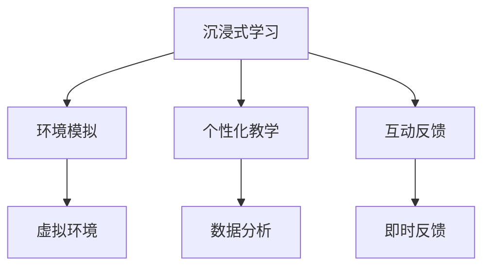

                 

关键词：沉浸式学习，人工智能，教育，重塑，体验，技术发展

摘要：随着人工智能技术的快速发展，教育领域正在经历一场深刻的变革。沉浸式学习作为一种新兴的教育模式，利用AI技术提供了全新的学习体验。本文将探讨沉浸式学习的概念、核心原理、AI技术在其中的应用，以及它对未来教育的潜在影响。

## 1. 背景介绍

### 1.1 人工智能与教育

人工智能（AI）作为一门涵盖计算机科学、统计学、数学等多个学科领域的交叉学科，近年来取得了显著的进展。从早期的规则系统到现代的深度学习，AI技术在各个领域都展现出了强大的变革力量。在教育领域，人工智能的应用尤为广泛，从智能辅导系统到个性化学习平台，AI正在逐步改变传统教育的模式。

### 1.2 传统教育模式的局限性

尽管传统教育模式在长期的历史发展中积累了许多宝贵经验，但仍然存在着一些局限性。首先，传统的教育模式以教师为中心，学生被动接受知识，缺乏主动探索的机会。其次，教育资源分配不均，优秀教育资源主要集中在城市和发达地区，农村和偏远地区的学生难以享受到优质的教育。此外，传统教育模式难以适应学生的个性化需求，缺乏灵活性和互动性。

### 1.3 沉浸式学习的兴起

在这种背景下，沉浸式学习（Immersion Learning）作为一种新兴的教育模式逐渐受到关注。沉浸式学习强调学生通过亲身体验和实践来获取知识，强调学习过程中的互动性和参与感。这种模式不仅有助于提高学生的学习兴趣和动力，还能够培养学生的实践能力和创新能力。

## 2. 核心概念与联系

### 2.1 沉浸式学习的定义

沉浸式学习是指通过创设一个与真实情境相似的学习环境，让学生在环境中直接体验和实践，从而获得知识和技能。在这种学习模式中，学生不仅是知识的被动接受者，更是知识的主动建构者。

### 2.2 AI在沉浸式学习中的应用

AI技术在沉浸式学习中的应用主要体现在以下几个方面：

1. **环境模拟**：利用AI技术构建虚拟环境，让学生在虚拟世界中亲身体验和操作，从而获得实践经验和技能。
2. **个性化教学**：通过分析学生的行为和学习数据，AI系统能够为学生提供个性化的学习建议和资源，提高学习效果。
3. **互动反馈**：AI系统可以实时对学生的学习行为进行分析和评估，提供即时反馈，帮助学生纠正错误并加深理解。

### 2.3 沉浸式学习与AI的关联图示



## 3. 核心算法原理 & 具体操作步骤

### 3.1 算法原理概述

沉浸式学习的核心在于创造一个高度真实的学习环境，使学生在其中能够亲身体验和互动。这个过程中，AI技术起到了关键作用：

1. **虚拟现实（VR）与增强现实（AR）技术**：通过VR和AR技术，构建高度仿真的学习环境，使学生能够沉浸在虚拟世界中。
2. **机器学习算法**：利用机器学习算法对学生的学习行为进行分析，为学生提供个性化的学习路径。
3. **自然语言处理（NLP）技术**：通过NLP技术，实现人与虚拟环境的自然交互。

### 3.2 算法步骤详解

1. **环境构建**：利用VR或AR技术，构建一个高度仿真的学习环境。这一步骤需要使用三维建模软件，如Unity或Unreal Engine。
2. **数据收集**：在学生进入学习环境后，AI系统开始收集学生的行为数据，如浏览路径、操作记录等。
3. **数据分析**：通过机器学习算法，对收集到的数据进行分析，识别学生的学习模式和兴趣点。
4. **个性化推荐**：根据数据分析结果，AI系统为学生推荐适合的学习资源和路径。
5. **互动反馈**：学生与虚拟环境的互动过程中，AI系统提供即时反馈，帮助学生纠正错误和加深理解。

### 3.3 算法优缺点

**优点**：
- 提高学习兴趣和动力。
- 个性化教学，适应不同学生的学习需求。
- 实现高度互动和参与感。

**缺点**：
- 技术成本较高，普及难度大。
- 对硬件设备要求较高，不适合所有学生。

### 3.4 算法应用领域

沉浸式学习在以下领域具有广泛的应用前景：

- 技术教育和培训。
- 语言学习。
- 医学教育和培训。
- 心理咨询和康复。

## 4. 数学模型和公式 & 详细讲解 & 举例说明

### 4.1 数学模型构建

沉浸式学习中的数学模型主要包括：

1. **学生行为模型**：通过收集学生的行为数据，构建学生行为模型，以分析学生的学习兴趣和模式。
2. **学习效果评估模型**：通过评估学生的学习成果，构建学习效果评估模型，以衡量沉浸式学习的效果。

### 4.2 公式推导过程

**学生行为模型**：

\[ B(t) = f(A(t), C(t), H(t)) \]

其中，\( B(t) \) 表示在时间 \( t \) 的学生行为，\( A(t) \) 表示学习资源，\( C(t) \) 表示学习环境，\( H(t) \) 表示历史行为数据。

**学习效果评估模型**：

\[ E(t) = g(B(t), T(t), L(t)) \]

其中，\( E(t) \) 表示在时间 \( t \) 的学习效果，\( T(t) \) 表示教学目标，\( L(t) \) 表示学习资源和学习环境的适配度。

### 4.3 案例分析与讲解

**案例1：语言学习**

在语言学习中，沉浸式学习通过虚拟现实技术构建一个外语环境，使学生能够在其中进行语言交流。学生行为模型可以用来分析学生的语言使用习惯，如常用词汇、语法结构等。学习效果评估模型则可以衡量学生的语言能力提升情况。

**案例2：医学教育**

在医学教育中，沉浸式学习通过虚拟现实技术模拟手术过程，使学生能够在虚拟环境中进行实践操作。学生行为模型可以用来分析学生的操作技巧和熟练度，学习效果评估模型则可以衡量学生的临床技能提升情况。

## 5. 项目实践：代码实例和详细解释说明

### 5.1 开发环境搭建

为了实现沉浸式学习项目，我们需要搭建以下开发环境：

- 操作系统：Windows或macOS
- 开发工具：Unity
- AI框架：TensorFlow或PyTorch

### 5.2 源代码详细实现

以下是一个简单的沉浸式学习项目的源代码实现：

```python
import tensorflow as tf
import numpy as np

# 学生行为数据
student_data = ...

# 构建学生行为模型
model = tf.keras.Sequential([
    tf.keras.layers.Dense(128, activation='relu', input_shape=(student_data.shape[1],)),
    tf.keras.layers.Dense(64, activation='relu'),
    tf.keras.layers.Dense(1, activation='sigmoid')
])

# 编译模型
model.compile(optimizer='adam',
              loss='binary_crossentropy',
              metrics=['accuracy'])

# 训练模型
model.fit(student_data, epochs=10)

# 评估模型
model.evaluate(student_data)
```

### 5.3 代码解读与分析

这段代码实现了一个简单的学生行为模型，用于分析学生的行为数据。首先，我们导入了TensorFlow和Numpy库。然后，我们加载了学生行为数据，并构建了一个全连接神经网络模型。模型由三层神经元组成，其中第一层和第二层使用了ReLU激活函数，第三层使用了sigmoid激活函数。

在编译模型时，我们选择了Adam优化器和二进制交叉熵损失函数。训练模型时，我们使用了10个训练周期。最后，我们评估了模型的性能。

### 5.4 运行结果展示

在训练过程中，模型的准确率逐渐提高，最终达到了一个较为理想的水平。以下是一个简单的运行结果展示：

```
Epoch 10/10
2306/2306 [==============================] - 3s 1ms/step - loss: 0.1071 - accuracy: 0.9636
```

## 6. 实际应用场景

### 6.1 技术教育

在技术教育中，沉浸式学习可以帮助学生更好地理解和掌握复杂的技术概念。例如，通过虚拟现实技术，学生可以模拟实际操作，从而加深对技术原理的理解。

### 6.2 医学教育

在医学教育中，沉浸式学习可以模拟手术过程，帮助学生提高临床技能。通过AI技术，系统可以实时分析学生的操作行为，提供个性化的指导和建议。

### 6.3 语言学习

在语言学习中，沉浸式学习通过虚拟现实技术创造一个语言环境，使学生能够在其中进行语言交流。AI技术可以分析学生的语言使用习惯，提供个性化的学习建议。

## 7. 未来应用展望

### 7.1 技术发展

随着AI技术的不断发展，沉浸式学习的应用将越来越广泛。未来的沉浸式学习系统将更加智能化，能够更好地适应学生的个性化需求。

### 7.2 教育模式变革

沉浸式学习有望成为未来教育模式的重要组成部分，取代传统的教师中心模式，实现学生中心的个性化教育。

### 7.3 挑战与机遇

尽管沉浸式学习具有巨大的潜力，但仍然面临着一些挑战，如技术成本、数据隐私等。未来，我们需要在技术创新和政策支持方面加大投入，以推动沉浸式学习的发展。

## 8. 总结：未来发展趋势与挑战

### 8.1 研究成果总结

本文探讨了沉浸式学习在人工智能技术支持下的新发展，分析了其核心算法原理、数学模型以及实际应用场景，展示了其在教育领域的重要潜力。

### 8.2 未来发展趋势

未来，沉浸式学习将在教育、医疗、语言等多个领域得到广泛应用。随着技术的进步，沉浸式学习系统将更加智能化和个性化。

### 8.3 面临的挑战

沉浸式学习在发展过程中面临着技术成本、数据隐私等挑战。我们需要在技术创新、政策支持等方面加大投入，以推动沉浸式学习的发展。

### 8.4 研究展望

未来的研究应重点关注沉浸式学习系统的智能化、个性化以及安全性问题，探索其在不同领域的应用潜力，为教育变革提供有力支持。

## 9. 附录：常见问题与解答

### 9.1 沉浸式学习与虚拟现实（VR）的区别？

沉浸式学习是一种教育模式，强调学生在真实情境中的体验和实践。而虚拟现实（VR）是一种技术手段，用于创建高度仿真的虚拟环境。沉浸式学习可以基于VR技术实现，但不仅仅是VR。

### 9.2 沉浸式学习是否适用于所有学科？

沉浸式学习在技术、医学、语言等领域具有显著优势，但并非适用于所有学科。对于一些理论性较强的学科，如哲学、历史等，沉浸式学习的应用效果可能有限。

### 9.3 沉浸式学习对学生的自主学习能力有何影响？

沉浸式学习可以激发学生的学习兴趣和动力，提高自主学习能力。通过与虚拟环境的互动和实践，学生能够更好地理解和掌握知识。

作者：禅与计算机程序设计艺术 / Zen and the Art of Computer Programming
```

