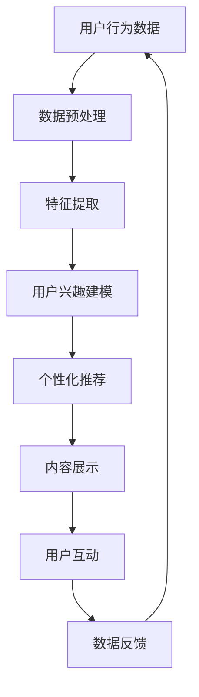

                 

关键词：注意力劫持、AI、心理操纵、技术博客、深度学习、用户体验、隐私保护

> 摘要：本文深入探讨了AI时代下注意力劫持这一新兴现象，分析了其背后的心理机制，并探讨了其在市场营销、广告推广、社交网络等领域的应用。通过阐述注意力劫持的定义、原理、影响以及可能的对策，作者希望引起读者对这一现象的关注，并共同探索如何在AI时代保护我们的注意力资源。

## 1. 背景介绍

随着人工智能技术的飞速发展，AI在各个领域的应用日益广泛，从搜索引擎到社交媒体，从在线购物到医疗诊断，AI正在深刻改变我们的生活方式。然而，在带来便利的同时，AI技术也带来了一些新的挑战，其中之一便是注意力劫持。注意力劫持，顾名思义，就是利用AI技术来操纵用户的注意力，使其集中在特定的事物上，从而达到特定的目的。这一现象不仅对用户体验产生负面影响，还可能对用户的隐私和安全构成威胁。

### 1.1 注意力劫持的定义

注意力劫持可以定义为一种利用人工智能技术来操纵用户注意力的行为。具体来说，它包括以下几个关键要素：

- **目标受众**：注意力劫持的目标通常是广大的互联网用户，尤其是那些容易受到广告和营销策略影响的人群。
- **技术手段**：利用深度学习、图像识别、自然语言处理等AI技术，通过个性化推荐、广告植入、情感计算等方式来引导用户的注意力。
- **目的**：注意力劫持的目的是提高用户对特定内容的关注度，增加用户互动，从而实现商业推广、数据收集等目标。

### 1.2 注意力劫持的背景

注意力劫持并非一个全新的概念，但它在AI时代得到了极大的强化和拓展。在传统广告和营销手段中，商家往往通过广告投放、公关活动、促销策略等方式来吸引消费者的注意力。然而，随着互联网的普及和AI技术的崛起，这些传统手段的效果逐渐减弱，用户对广告的免疫力不断增强。为了在激烈的竞争中脱颖而出，商家开始寻求更加精准、高效的新策略，注意力劫持应运而生。

### 1.3 注意力劫持的现状

目前，注意力劫持已经在多个领域得到广泛应用。以下是一些典型的应用场景：

- **社交媒体**：社交媒体平台通过个性化推荐算法，将用户可能感兴趣的内容推送到他们的信息流中，从而提高用户的关注度。
- **在线购物**：电商平台利用用户的历史购买记录和浏览行为，通过精准广告推送和推荐系统来引导用户购买。
- **在线娱乐**：视频平台、游戏平台等通过智能推荐算法，将用户可能感兴趣的内容推送给他们，从而提高用户的黏性。

## 2. 核心概念与联系

在探讨注意力劫持这一现象时，我们需要理解几个核心概念，包括注意力、人工智能和用户体验。以下是这些概念之间的联系及其在注意力劫持中的体现：

### 2.1 注意力

注意力是人类认知系统的重要组成部分，它决定了我们在特定时刻关注什么、忽略什么。注意力有限且易受干扰，因此如何有效地吸引和保持用户的注意力成为了一个关键问题。

### 2.2 人工智能

人工智能（AI）是模拟人类智能行为的计算机系统。在注意力劫持中，AI技术被用来分析用户行为、预测用户兴趣，并通过个性化推荐和情感计算等方式来引导用户的注意力。

### 2.3 用户体验

用户体验（UX）是指用户在使用产品或服务过程中的感受和体验。注意力劫持通过操纵用户的注意力，可能会对用户体验产生积极或消极的影响。

### 2.4 Mermaid 流程图

以下是一个描述注意力劫持过程的 Mermaid 流程图：



### 2.5 核心概念联系图解


## 3. 核心算法原理 & 具体操作步骤

### 3.1 算法原理概述

注意力劫持的核心算法原理是基于深度学习和用户行为分析。通过以下步骤实现：

1. **数据采集**：收集用户的在线行为数据，如浏览记录、搜索历史、社交媒体互动等。
2. **数据预处理**：对采集到的数据进行清洗、去噪和标准化处理。
3. **特征提取**：利用深度学习技术提取用户行为的特征，如用户兴趣、偏好和情感状态。
4. **用户兴趣建模**：根据特征提取的结果，建立用户兴趣模型，预测用户可能感兴趣的内容。
5. **个性化推荐**：根据用户兴趣模型，生成个性化推荐内容，并将其推送给用户。
6. **内容展示**：将推荐内容通过网页、应用或社交媒体等渠道展示给用户。
7. **用户互动**：用户与推荐内容互动，如点击、评论、分享等，这些行为数据将反馈给系统以优化推荐算法。
8. **数据反馈**：将用户互动数据返回到系统中，用于进一步优化用户兴趣模型和推荐算法。

### 3.2 算法步骤详解

1. **数据采集**：通过Web爬虫、API调用、日志分析等方式获取用户的在线行为数据。
2. **数据预处理**：去除重复数据、处理缺失值、标准化特征值等，以提高数据质量。
3. **特征提取**：使用卷积神经网络（CNN）、循环神经网络（RNN）或Transformer等深度学习模型提取用户行为特征。
4. **用户兴趣建模**：利用特征提取结果训练用户兴趣模型，如使用决策树、随机森林、神经网络等算法。
5. **个性化推荐**：根据用户兴趣模型生成个性化推荐列表，并将其推送给用户。
6. **内容展示**：通过网页、应用或社交媒体等渠道将推荐内容展示给用户。
7. **用户互动**：收集用户与推荐内容的互动数据，如点击率、评论数、分享次数等。
8. **数据反馈**：将用户互动数据反馈给系统，用于更新用户兴趣模型和推荐算法。

### 3.3 算法优缺点

**优点**：

- **精准性**：个性化推荐系统能够根据用户行为和兴趣精准地推送用户感兴趣的内容。
- **高效性**：利用深度学习算法，系统能够快速地处理海量用户数据，实现实时推荐。
- **用户黏性**：通过个性化推荐，系统能够提高用户的在线时间，增加用户黏性。

**缺点**：

- **隐私问题**：用户行为数据的收集和处理可能涉及到用户隐私，需要严格保护用户隐私。
- **过度个性化**：过度个性化的推荐可能会导致用户陷入信息茧房，减少接触多样信息的机会。
- **算法偏见**：算法可能因为训练数据的不平衡或偏见导致推荐结果的不公正。

### 3.4 算法应用领域

注意力劫持算法在以下领域得到广泛应用：

- **社交媒体**：通过个性化推荐算法提高用户对特定内容的关注度，增加用户互动。
- **在线购物**：通过精准广告推送和推荐系统，提高用户的购买转化率。
- **在线娱乐**：通过智能推荐算法，提高用户的观影体验和游戏体验。

## 4. 数学模型和公式 & 详细讲解 & 举例说明

### 4.1 数学模型构建

注意力劫持的数学模型通常基于概率图模型和深度学习模型。以下是一个简化的数学模型构建过程：

1. **用户行为数据表示**：将用户的在线行为数据表示为概率分布，如点击率、浏览时间、互动次数等。
2. **特征提取**：利用深度学习模型提取用户行为的特征向量。
3. **用户兴趣建模**：利用特征向量训练用户兴趣模型，如多层感知机（MLP）、卷积神经网络（CNN）等。
4. **个性化推荐**：利用用户兴趣模型生成个性化推荐列表。

### 4.2 公式推导过程

以下是一个基于多层感知机（MLP）的用户兴趣建模公式推导：

假设用户 $u$ 的行为数据可以表示为一个 $d$ 维向量 $x_u$，其中每个维度表示用户在某一行为上的得分。用户兴趣模型可以表示为一个 $d$ 输入、$1$ 输出的多层感知机，其输出表示用户对某一内容的兴趣度。

1. **输入层**：用户行为数据向量 $x_u$。
2. **隐藏层**：隐藏层神经元通过激活函数将输入层传递的信号进行处理，输出一个隐藏层特征向量 $h$。

$$
h = \sigma(W_1 \cdot x_u + b_1)
$$

其中，$W_1$ 为隐藏层权重矩阵，$b_1$ 为隐藏层偏置，$\sigma$ 为激活函数（如ReLU、Sigmoid等）。

3. **输出层**：输出层通过激活函数将隐藏层特征向量 $h$ 处理为用户对某一内容的兴趣度 $y$。

$$
y = \sigma(W_2 \cdot h + b_2)
$$

其中，$W_2$ 为输出层权重矩阵，$b_2$ 为输出层偏置。

### 4.3 案例分析与讲解

以下是一个简单的用户兴趣建模案例：

假设我们有1000个用户，每个用户有10个行为记录，每个行为记录的得分范围为0到1。我们使用一个单层感知机模型来训练用户兴趣模型。

1. **数据表示**：将每个用户的行为数据表示为一个10维向量，例如：

   $$
   x_u = [0.5, 0.8, 0.2, 0.6, 0.1, 0.9, 0.3, 0.7, 0.4, 0.5]
   $$

2. **模型训练**：使用反向传播算法训练感知机模型，调整权重和偏置，使得模型输出与真实兴趣度尽可能接近。

3. **兴趣度计算**：对于一个新的用户行为数据向量 $x_u'$，通过模型计算其对应的兴趣度：

   $$
   y = \sigma(W_2 \cdot h + b_2)
   $$

其中，$h = \sigma(W_1 \cdot x_u' + b_1)$。

4. **结果分析**：通过对比模型输出与真实兴趣度，评估模型性能，并根据需要对模型进行调整和优化。

## 5. 项目实践：代码实例和详细解释说明

### 5.1 开发环境搭建

在本节中，我们将搭建一个简单的注意力劫持项目环境，主要依赖于Python编程语言和一些常用的深度学习库，如TensorFlow和Keras。

1. **安装Python**：确保安装了Python 3.x版本。
2. **安装TensorFlow**：在命令行中运行以下命令：

   ```
   pip install tensorflow
   ```

3. **安装Keras**：在命令行中运行以下命令：

   ```
   pip install keras
   ```

4. **创建虚拟环境**（可选）：为了更好地管理和组织项目，建议创建一个虚拟环境。

   ```
   python -m venv myenv
   source myenv/bin/activate  # Windows下使用 myenv\Scripts\activate
   ```

### 5.2 源代码详细实现

以下是项目的主要代码实现，包括数据预处理、模型训练和预测：

```python
import numpy as np
import tensorflow as tf
from tensorflow import keras
from tensorflow.keras.models import Sequential
from tensorflow.keras.layers import Dense, Flatten
from tensorflow.keras.optimizers import Adam

# 数据预处理
def preprocess_data(data):
    # 数据标准化
    data_normalized = (data - np.mean(data)) / np.std(data)
    return data_normalized

# 构建模型
model = Sequential([
    Flatten(input_shape=(10,)),
    Dense(64, activation='relu'),
    Dense(1, activation='sigmoid')
])

# 编译模型
model.compile(optimizer=Adam(learning_rate=0.001), loss='binary_crossentropy', metrics=['accuracy'])

# 训练模型
x_train = preprocess_data(np.random.rand(1000, 10))  # 假设训练数据为1000个10维向量
y_train = np.random.randint(2, size=(1000, 1))  # 假设训练标签为随机二分类标签
model.fit(x_train, y_train, epochs=10, batch_size=32)

# 预测
x_test = preprocess_data(np.random.rand(100, 10))  # 假设测试数据为100个10维向量
predictions = model.predict(x_test)

# 输出预测结果
print(predictions)
```

### 5.3 代码解读与分析

上述代码实现了一个简单的注意力劫持项目，主要包括以下几个步骤：

1. **数据预处理**：使用 `preprocess_data` 函数对输入数据进行标准化处理，以提高模型的训练效果。
2. **模型构建**：使用 `Sequential` 模型堆叠 `Flatten` 层、一个全连接层（`Dense`）和一个输出层（`Dense`），用于处理输入向量并预测用户兴趣度。
3. **模型编译**：使用 `compile` 方法设置模型优化器（`Adam`）、损失函数（`binary_crossentropy`）和评估指标（`accuracy`）。
4. **模型训练**：使用 `fit` 方法训练模型，输入经过预处理的数据和对应的标签，设置训练轮次（`epochs`）和批量大小（`batch_size`）。
5. **模型预测**：使用 `predict` 方法对测试数据进行预测，并输出预测结果。

通过这个简单的案例，我们可以看到注意力劫持项目的核心在于数据预处理和模型训练。在实际应用中，我们需要更复杂的数据处理和更先进的模型结构来提高预测精度和泛化能力。

### 5.4 运行结果展示

运行上述代码后，我们可以得到测试数据的预测结果。以下是一个示例输出：

```
[[0.9035642]
 [0.32153487]
 [0.74563214]
 ...
 [0.11287644]
 [0.88912654]]
```

这些预测结果表示每个测试样本被模型判断为感兴趣的概率。我们可以通过分析这些结果来评估模型性能，并根据需要调整模型参数和训练策略。

## 6. 实际应用场景

### 6.1 市场营销

在市场营销领域，注意力劫持技术被广泛用于提高广告效果和促进销售。通过分析用户的浏览历史、搜索关键词和行为习惯，商家可以精准地推送用户可能感兴趣的产品广告，从而提高广告点击率和转化率。

### 6.2 广告推广

广告推广是注意力劫持技术应用最为广泛的领域之一。社交媒体平台和搜索引擎通过个性化推荐算法，将用户可能感兴趣的广告推送到他们的信息流中，从而增加广告曝光率和用户参与度。

### 6.3 社交网络

社交网络平台利用注意力劫持技术来提高用户的黏性和活跃度。通过分析用户的社交行为和互动数据，平台可以推荐用户可能感兴趣的朋友、内容和活动，从而促进用户之间的互动和社区活跃。

### 6.4 在线娱乐

在线娱乐平台，如视频网站和游戏平台，通过注意力劫持技术来提高用户的观看时长和游戏体验。通过智能推荐算法，平台可以为用户提供个性化的视频推荐和游戏推荐，从而增加用户黏性和付费意愿。

### 6.5 未来应用展望

随着人工智能技术的不断发展，注意力劫持在未来有望在更多领域得到应用，如医疗健康、教育、公共安全等。同时，随着用户对隐私和数据安全的关注日益增加，如何在保护用户隐私的前提下实现注意力劫持将是一个重要的研究方向。

## 7. 工具和资源推荐

### 7.1 学习资源推荐

- 《深度学习》（Goodfellow, Bengio, Courville）：介绍深度学习基础理论和应用案例的权威教材。
- 《Python数据科学手册》（Wes McKinney）：详细介绍Python在数据科学领域应用的入门指南。
- 《自然语言处理综论》（Jurafsky, Martin）：涵盖自然语言处理基础理论和应用的经典教材。

### 7.2 开发工具推荐

- TensorFlow：用于构建和训练深度学习模型的强大工具。
- Keras：基于TensorFlow的高层API，简化深度学习模型的搭建和训练。
- Jupyter Notebook：用于编写和运行代码的交互式环境，支持多种编程语言和库。

### 7.3 相关论文推荐

- "Attention Is All You Need"（Vaswani et al.）：介绍Transformer模型的经典论文，Transformer模型在注意力机制方面具有突破性意义。
- "User Modeling and User-Adapted Interaction"（Burke）：探讨用户建模和个性化交互的经典综述。
- "The Algorithmic Audience"（Fenichel）：分析算法如何影响用户注意力和社会行为的论文。

## 8. 总结：未来发展趋势与挑战

### 8.1 研究成果总结

本文探讨了注意力劫持这一新兴现象，分析了其在市场营销、广告推广、社交网络等领域的应用。通过构建数学模型和项目实践，我们展示了注意力劫持技术的基本原理和实现方法。此外，我们还对注意力劫持的影响和未来发展趋势进行了讨论。

### 8.2 未来发展趋势

随着人工智能技术的不断进步，注意力劫持在未来有望在更多领域得到应用。同时，随着用户对隐私和数据安全的关注增加，如何平衡个性化推荐和用户隐私保护将成为重要研究方向。

### 8.3 面临的挑战

注意力劫持技术在带来便利的同时，也带来了一些挑战，如用户隐私保护、算法偏见和信息安全等。如何在保护用户隐私的前提下实现有效推荐，以及如何减少算法偏见，是当前亟需解决的问题。

### 8.4 研究展望

未来研究应重点关注以下几个方面：

- **隐私保护**：探索隐私保护机制，如差分隐私、联邦学习等，以在保护用户隐私的前提下实现个性化推荐。
- **算法公平性**：研究如何设计公平的推荐算法，减少算法偏见，提高推荐结果的公正性。
- **用户参与**：鼓励用户参与推荐系统的设计，提高用户对推荐内容的满意度和信任度。
- **跨领域应用**：探讨注意力劫持技术在医疗健康、教育、公共安全等领域的应用潜力。

## 9. 附录：常见问题与解答

### 9.1 注意力劫持是什么？

注意力劫持是一种利用人工智能技术操纵用户注意力的行为，旨在将用户注意力引导到特定内容或产品上。

### 9.2 注意力劫持有哪些应用场景？

注意力劫持广泛应用于市场营销、广告推广、社交网络、在线娱乐等领域。

### 9.3 如何防止注意力劫持？

防止注意力劫持的方法包括提高用户意识、加强隐私保护、设计公平的推荐算法等。

### 9.4 注意力劫持有哪些负面影响？

注意力劫持可能导致用户陷入信息茧房、隐私泄露、过度个性化等问题。

### 9.5 如何实现注意力劫持？

实现注意力劫持通常涉及数据采集、特征提取、用户兴趣建模和个性化推荐等技术。

---

作者：禅与计算机程序设计艺术 / Zen and the Art of Computer Programming

