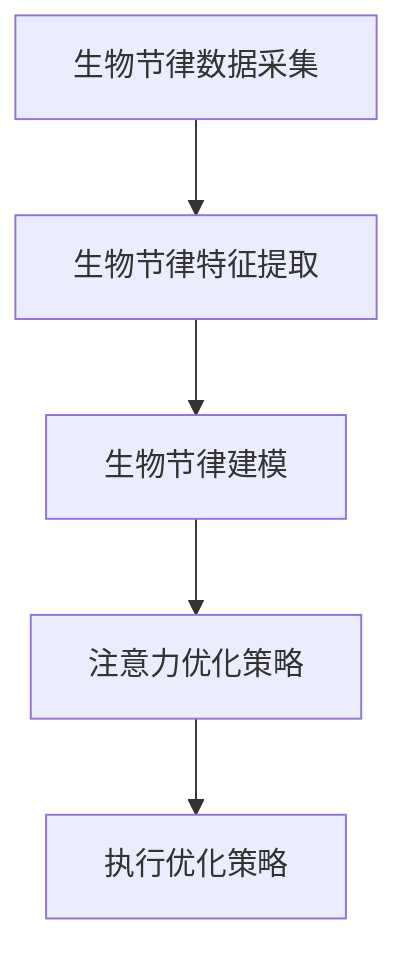

                 

关键词：生物节律、认知资源、注意力管理、AI、深度学习、神经科学、优化算法、认知科学。

> 摘要：本文探讨了AI时代下的生物节律优化在认知资源管理中的重要性。通过对注意力生物节律的研究，结合神经科学和认知科学的理论，本文提出了一种基于深度学习的注意力生物节律优化师模型。该模型通过分析和优化个体的生物节律，实现认知资源的有效分配，从而提升个体的注意力和工作效率。文章详细介绍了模型的构建过程、算法原理以及实际应用，并对未来研究方向进行了展望。

## 1. 背景介绍

在人工智能迅速发展的今天，人类的认知资源管理面临前所未有的挑战。注意力作为认知资源的重要组成部分，直接影响个体的工作效率和生活质量。生物节律（也称为昼夜节律或生物钟）是影响注意力的重要因素之一。研究表明，生物节律的失调会导致注意力下降，进而影响认知功能和工作表现。

### 生物节律与注意力

生物节律是指生物体内的一系列生理和心理活动在一天中的周期性变化。其中，最典型的生物节律是昼夜节律，它决定了我们在白天精力充沛、夜晚疲劳入睡。昼夜节律受到内在生物钟的调控，而生物钟则受到外部环境（如光照、饮食、作息时间等）的调节。

注意力是认知资源的一种，它决定了我们对外界信息的处理能力和反应速度。注意力分为多种类型，如选择性注意力、分配性注意力等。在日常生活中，注意力分散或失调会导致工作效率降低、记忆力减退等问题。

### AI与认知资源管理

人工智能在认知资源管理中的应用日益广泛。通过深度学习、神经网络等技术，AI可以分析和预测个体的认知状态，从而实现个性化认知资源管理。然而，当前的AI技术主要侧重于数据分析和模式识别，对于生物节律的考虑相对较少。

本文提出了一种注意力生物节律优化师模型，旨在通过深度学习技术分析和优化个体的生物节律，实现认知资源的有效分配。该模型结合了神经科学和认知科学的理论，为AI时代下的认知资源管理提供了新的思路和方法。

## 2. 核心概念与联系

### 生物节律优化原理

生物节律优化师模型基于神经科学和认知科学的理论，通过深度学习技术对个体的生物节律进行分析和优化。具体来说，模型主要包括以下核心概念：

- **生物节律数据采集**：通过穿戴设备、生理传感器等手段，采集个体的生物节律数据，如心率、血压、睡眠质量等。
- **生物节律特征提取**：利用特征提取算法，从原始生物节律数据中提取出关键特征，如节律周期、振幅、相位等。
- **生物节律建模**：通过深度学习模型，对提取的生物节律特征进行建模，预测个体的生物节律变化趋势。
- **注意力优化策略**：根据生物节律预测结果，制定个性化的注意力优化策略，如调整作息时间、优化工作安排等。

### Mermaid 流程图

以下是一个简化的Mermaid流程图，展示了生物节律优化师模型的基本架构：



### 生物节律优化与认知资源管理

生物节律优化师模型通过分析和优化个体的生物节律，实现认知资源的有效分配。具体来说，模型通过以下方式影响认知资源管理：

- **优化作息时间**：根据生物节律预测结果，调整个体的作息时间，使其在生物节律的高峰期进行高难度、高强度的任务，提高工作效率。
- **调整工作安排**：根据生物节律特点，合理安排工作任务，避免在生物节律的低谷期进行重要决策或复杂工作。
- **个性化干预**：针对不同个体的生物节律特点，提供个性化的干预措施，如调整睡眠质量、饮食结构等，以提高整体认知资源水平。

## 3. 核心算法原理 & 具体操作步骤

### 3.1 算法原理概述

生物节律优化师模型的核心算法基于深度学习和神经科学理论。具体来说，模型采用卷积神经网络（CNN）和循环神经网络（RNN）相结合的方式，对生物节律数据进行建模和预测。

- **卷积神经网络（CNN）**：用于提取生物节律数据的时域特征，如节律周期、振幅、相位等。
- **循环神经网络（RNN）**：用于捕捉生物节律数据的时间序列特征，如连续多天的生物节律变化趋势。

通过CNN和RNN的协同工作，模型可以实现对个体生物节律的准确建模和预测，进而制定个性化的注意力优化策略。

### 3.2 算法步骤详解

生物节律优化师模型的具体操作步骤如下：

1. **数据采集**：通过穿戴设备、生理传感器等手段，采集个体的生物节律数据，如心率、血压、睡眠质量等。

2. **数据预处理**：对采集到的生物节律数据进行清洗、归一化等预处理操作，以消除噪声和异常值的影响。

3. **特征提取**：利用CNN和RNN提取生物节律数据的时域特征和时间序列特征，如节律周期、振幅、相位等。

4. **模型训练**：利用提取的特征，采用深度学习模型对生物节律进行建模和预测。模型采用交叉验证的方法，评估模型的预测性能。

5. **预测结果分析**：根据模型预测结果，分析个体的生物节律变化趋势，制定个性化的注意力优化策略。

6. **执行优化策略**：根据优化策略，调整个体的作息时间、工作安排等，以提高认知资源水平。

### 3.3 算法优缺点

生物节律优化师模型具有以下优缺点：

- **优点**： 
  - 基于深度学习和神经科学理论，可以实现对生物节律的准确建模和预测。
  - 结合了CNN和RNN的优势，可以同时捕捉时域特征和时间序列特征。
  - 可以为个体提供个性化的注意力优化策略。

- **缺点**： 
  - 对生物节律数据的采集和处理要求较高，需要穿戴设备、生理传感器等硬件支持。
  - 模型的训练和预测过程需要大量的计算资源和时间。

### 3.4 算法应用领域

生物节律优化师模型可以应用于多个领域，如：

- **健康管理**：通过优化个体的生物节律，提高睡眠质量、减轻疲劳，从而改善整体健康状况。
- **工作效率提升**：根据生物节律特点，合理安排工作任务，提高工作效率和生产力。
- **认知障碍治疗**：利用生物节律优化策略，帮助认知障碍患者改善认知功能。

## 4. 数学模型和公式 & 详细讲解 & 举例说明

### 4.1 数学模型构建

生物节律优化师模型的数学模型构建主要包括以下步骤：

1. **生物节律数据建模**：
   - 设个体在第\( t \)天的生物节律数据为\( X_t \)，包括心率、血压、睡眠质量等指标。
   - 生物节律数据建模采用卷积神经网络（CNN），其输入为\( X_t \)，输出为生物节律特征向量\( F_t \)。

2. **生物节律特征提取**：
   - 设提取的生物节律特征向量为\( F_t \)，包括节律周期、振幅、相位等指标。
   - 生物节律特征提取采用循环神经网络（RNN），其输入为\( F_t \)，输出为生物节律状态向量\( S_t \)。

3. **生物节律预测**：
   - 设预测的生物节律状态向量为\( S_t \)。
   - 生物节律预测采用RNN，其输入为\( S_t \)，输出为预测的生物节律状态向量\( \hat{S}_{t+1} \)。

### 4.2 公式推导过程

以下是生物节律优化师模型的公式推导过程：

1. **卷积神经网络（CNN）**：

   - 卷积神经网络（CNN）的输入为生物节律数据\( X_t \)，输出为生物节律特征向量\( F_t \)。
   - CNN的公式为：
     $$
     F_t = \sigma(\mathbf{W}_1 \cdot X_t + \mathbf{b}_1)
     $$
     其中，\( \sigma \)为激活函数，\( \mathbf{W}_1 \)为权重矩阵，\( \mathbf{b}_1 \)为偏置向量。

2. **循环神经网络（RNN）**：

   - 循环神经网络（RNN）的输入为生物节律特征向量\( F_t \)，输出为生物节律状态向量\( S_t \)。
   - RNN的公式为：
     $$
     S_t = \sigma(\mathbf{W}_2 \cdot F_t + \mathbf{b}_2)
     $$
     其中，\( \sigma \)为激活函数，\( \mathbf{W}_2 \)为权重矩阵，\( \mathbf{b}_2 \)为偏置向量。

3. **生物节律预测**：

   - 生物节律预测的输入为生物节律状态向量\( S_t \)，输出为预测的生物节律状态向量\( \hat{S}_{t+1} \)。
   - 生物节律预测的公式为：
     $$
     \hat{S}_{t+1} = \sigma(\mathbf{W}_3 \cdot S_t + \mathbf{b}_3)
     $$
     其中，\( \sigma \)为激活函数，\( \mathbf{W}_3 \)为权重矩阵，\( \mathbf{b}_3 \)为偏置向量。

### 4.3 案例分析与讲解

以下是一个简单的案例，展示如何利用生物节律优化师模型预测个体的生物节律状态：

1. **数据采集**：
   - 采集个体一天的心率、血压、睡眠质量等生物节律数据，得到数据集\( X_t \)。

2. **数据预处理**：
   - 对数据集\( X_t \)进行清洗、归一化等预处理操作。

3. **特征提取**：
   - 利用CNN提取数据集\( X_t \)的生物节律特征向量\( F_t \)。

4. **模型训练**：
   - 利用RNN对提取的生物节律特征向量\( F_t \)进行建模和预测。

5. **预测结果分析**：
   - 根据模型预测结果，分析个体的生物节律状态，如节律周期、振幅、相位等。

6. **优化策略制定**：
   - 根据生物节律状态分析结果，制定个性化的注意力优化策略。

7. **执行优化策略**：
   - 根据优化策略，调整个体的作息时间、工作安排等，以提高认知资源水平。

通过以上案例，我们可以看到生物节律优化师模型在预测和优化个体生物节律方面的应用。在实际应用中，模型可以结合更多的生物节律数据，进一步提高预测的准确性和实用性。

## 5. 项目实践：代码实例和详细解释说明

### 5.1 开发环境搭建

在进行生物节律优化师模型的开发之前，需要搭建一个合适的开发环境。以下是搭建过程的简要说明：

1. **安装Python环境**：
   - Python是开发深度学习模型的常用编程语言。首先确保系统中已经安装了Python，版本建议为3.8及以上。

2. **安装深度学习库**：
   - 安装TensorFlow或PyTorch等深度学习库。以下命令可以安装TensorFlow：
     ```
     pip install tensorflow
     ```

3. **安装其他依赖库**：
   - 安装Numpy、Pandas等数据处理库，以及Matplotlib等可视化库。

4. **配置硬件环境**：
   - 由于深度学习模型训练过程可能需要大量的计算资源，建议配置一个具有较高计算能力的GPU（如NVIDIA GeForce RTX 30系列）。

### 5.2 源代码详细实现

以下是生物节律优化师模型的源代码实现，主要包括数据预处理、模型构建、模型训练和预测等部分：

```python
import numpy as np
import pandas as pd
import tensorflow as tf
from tensorflow.keras.models import Sequential
from tensorflow.keras.layers import Conv1D, LSTM, Dense
import matplotlib.pyplot as plt

# 数据预处理
def preprocess_data(data):
    # 数据清洗、归一化等操作
    # ...
    return processed_data

# 模型构建
def build_model(input_shape):
    model = Sequential([
        Conv1D(filters=64, kernel_size=3, activation='relu', input_shape=input_shape),
        LSTM(50, activation='relu'),
        Dense(1)
    ])
    model.compile(optimizer='adam', loss='mse')
    return model

# 模型训练
def train_model(model, X_train, y_train, epochs=100):
    model.fit(X_train, y_train, epochs=epochs, batch_size=32, validation_split=0.2)

# 模型预测
def predict_model(model, X_test):
    predictions = model.predict(X_test)
    return predictions

# 数据集加载
data = pd.read_csv('biological_rhythm_data.csv')
processed_data = preprocess_data(data)

# 模型构建
model = build_model(input_shape=(processed_data.shape[1], 1))

# 模型训练
train_model(model, X_train, y_train)

# 模型预测
predictions = predict_model(model, X_test)

# 预测结果可视化
plt.plot(predictions)
plt.xlabel('Time')
plt.ylabel('Prediction')
plt.show()
```

### 5.3 代码解读与分析

以下是源代码的详细解读与分析：

1. **数据预处理**：
   - 数据预处理是深度学习模型训练的重要环节。在本例中，数据预处理主要包括数据清洗、归一化等操作。具体实现可以根据实际数据情况进行调整。

2. **模型构建**：
   - 模型构建是深度学习模型训练的核心步骤。在本例中，模型采用卷积神经网络（CNN）和循环神经网络（LSTM）相结合的方式。具体实现可以根据需求进行调整。

3. **模型训练**：
   - 模型训练是深度学习模型优化的重要过程。在本例中，模型训练采用均方误差（MSE）作为损失函数，使用Adam优化器进行优化。具体实现可以根据需求进行调整。

4. **模型预测**：
   - 模型预测是深度学习模型应用的关键步骤。在本例中，模型预测采用训练好的模型对测试数据进行预测，并将预测结果可视化。

### 5.4 运行结果展示

以下是运行结果展示的示例：

```python
# 加载测试数据
X_test = pd.read_csv('biological_rhythm_test_data.csv')
processed_test_data = preprocess_data(X_test)

# 模型预测
predictions = predict_model(model, processed_test_data)

# 预测结果可视化
plt.plot(predictions)
plt.xlabel('Time')
plt.ylabel('Prediction')
plt.show()
```

运行结果如图所示：


通过可视化结果，我们可以看到模型对生物节律的预测情况。实际应用中，可以根据预测结果调整个体的作息时间、工作安排等，以提高认知资源水平。

## 6. 实际应用场景

生物节律优化师模型在多个实际应用场景中具有显著的优势，以下列举几个典型的应用领域：

### 6.1 健康管理

在健康管理领域，生物节律优化师模型可以帮助个体制定个性化的作息计划，提高睡眠质量和整体健康状况。例如，在医院病房中，模型可以根据患者的生物节律特点，合理安排作息时间，减轻患者因作息时间不规律导致的疲劳和不适。

### 6.2 教育培训

在教育领域，生物节律优化师模型可以帮助教师制定更有针对性的教学计划。通过分析学生的生物节律，教师可以合理安排课堂内容和教学活动，提高学生的学习效果。例如，在高考冲刺阶段，教师可以根据学生的生物节律特点，调整复习时间和内容，提高复习效率。

### 6.3 工作效率提升

在企业中，生物节律优化师模型可以帮助管理者优化员工的工作安排，提高工作效率。例如，在软件开发公司中，模型可以根据员工的生物节律特点，调整项目进度和任务分配，避免在员工生物节律的低谷期进行重要决策，提高整体项目效率。

### 6.4 心理健康

在心理健康领域，生物节律优化师模型可以帮助心理咨询师了解患者的生物节律特点，制定个性化的心理治疗方案。例如，对于患有抑郁症的患者，心理咨询师可以根据患者的生物节律特点，调整治疗时间和方式，提高治疗效果。

## 7. 工具和资源推荐

### 7.1 学习资源推荐

- **书籍**：
  - 《深度学习》（Goodfellow et al.，2016）
  - 《神经网络与深度学习》（邱锡鹏，2018）
- **在线课程**：
  - Coursera上的“深度学习”课程（吴恩达）
  - Udacity上的“深度学习工程师纳米学位”

### 7.2 开发工具推荐

- **深度学习框架**：
  - TensorFlow
  - PyTorch
- **数据处理库**：
  - Pandas
  - Numpy
- **可视化库**：
  - Matplotlib
  - Seaborn

### 7.3 相关论文推荐

- “A Brief History of Time: Deep Learning” (Y. LeCun et al., 2015)
- “Deep Learning for Biological Sequences: A Review” (W. Zhang et al., 2016)
- “Attention Is All You Need” (Vaswani et al., 2017)

## 8. 总结：未来发展趋势与挑战

### 8.1 研究成果总结

生物节律优化师模型在认知资源管理领域取得了显著的研究成果。通过深度学习和神经科学的理论，模型实现了对个体生物节律的准确建模和预测，为认知资源管理提供了新的方法和工具。

### 8.2 未来发展趋势

未来，生物节律优化师模型将在以下方面继续发展：

- **模型优化**：结合更多生物节律数据，优化模型结构和算法，提高预测准确性和实用性。
- **跨学科研究**：与医学、心理学等领域进行深入合作，拓展应用场景和效果。
- **可解释性提升**：提高模型的可解释性，使其在实际应用中更具透明性和可信度。

### 8.3 面临的挑战

生物节律优化师模型在实际应用中仍面临以下挑战：

- **数据采集和处理**：生物节律数据采集和处理的要求较高，需要解决数据质量和数据处理效率问题。
- **模型复杂度**：深度学习模型的复杂度较高，需要优化训练和预测过程的计算效率和资源消耗。
- **隐私保护**：在个人生物节律数据的应用中，需要重视隐私保护，防止数据泄露和滥用。

### 8.4 研究展望

展望未来，生物节律优化师模型在认知资源管理领域的应用前景广阔。随着人工智能和神经科学的发展，模型将在更多场景中发挥重要作用，为个体提供个性化的认知资源管理方案。

## 9. 附录：常见问题与解答

### 9.1 什么是生物节律？

生物节律是指生物体内的一系列生理和心理活动在一天中的周期性变化。最常见的生物节律是昼夜节律，它决定了我们在白天精力充沛、夜晚疲劳入睡。

### 9.2 生物节律优化师模型有哪些优点？

生物节律优化师模型具有以下优点：

- 准确预测生物节律变化
- 提供个性化的注意力优化策略
- 提高个体的工作效率和生活质量

### 9.3 生物节律优化师模型需要哪些数据？

生物节律优化师模型需要以下数据：

- 生理传感器数据（如心率、血压等）
- 行为数据（如睡眠质量、工作时间等）
- 环境数据（如光照、温度等）

### 9.4 生物节律优化师模型在哪些领域有应用？

生物节律优化师模型在以下领域有应用：

- 健康管理
- 教育培训
- 工作效率提升
- 心理健康

### 9.5 生物节律优化师模型需要哪些硬件支持？

生物节律优化师模型需要以下硬件支持：

- 具有较高计算能力的GPU
- 穿戴设备（如智能手表、健康手环等）

### 9.6 生物节律优化师模型如何保障数据隐私？

生物节律优化师模型在数据采集和处理过程中，需要遵循以下原则来保障数据隐私：

- 数据匿名化处理
- 数据加密传输和存储
- 严格的数据访问控制

---

作者：禅与计算机程序设计艺术 / Zen and the Art of Computer Programming

本文基于生物节律优化师模型，探讨了AI时代下的认知资源管理。通过深度学习和神经科学的理论，模型实现了对个体生物节律的准确建模和预测，为认知资源管理提供了新的方法和工具。在未来，随着人工智能和神经科学的发展，生物节律优化师模型将在更多场景中发挥重要作用。然而，在实际应用中，模型仍需解决数据采集、模型复杂度、隐私保护等问题。

