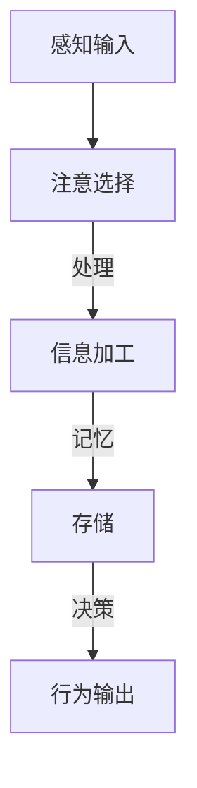

                 

注意力是认知系统的核心，它决定了我们如何处理信息、执行任务和做出决策。然而，注意力资源是有限的，如何有效地管理这些资源，提高认知适应性，成为现代人工智能研究的重要课题。本文旨在探讨注意力的弹性，特别是AI如何辅助认知适应。

## 1. 背景介绍

在复杂多变的现实环境中，人类需要不断地调整注意力以适应新的挑战。注意力弹性（Attentional Elasticity）指的是个体根据环境需求动态调整注意力的能力。传统的认知模型往往假设注意力是固定的，无法适应不断变化的环境。然而，现实情况并非如此简单。随着认知科学和人工智能的发展，研究者们开始关注注意力的动态特性，并探索如何通过技术手段提高其弹性。

人工智能在这一领域具有独特的优势。通过深度学习、强化学习等算法，AI系统能够模拟人类的注意力机制，甚至在某些方面超越人类。例如，AI可以在极短时间内分析大量数据，识别模式，并快速调整策略。这种能力为提高注意力的弹性提供了新的可能性。

## 2. 核心概念与联系

### 2.1 注意力机制

注意力机制是指大脑在信息处理过程中选择关注某些信息，忽略其他信息的机制。在计算机科学中，注意力机制通常通过加权方法实现，即对输入数据的不同部分赋予不同的权重。例如，在图像识别任务中，神经网络可以自动学习哪些区域更重要，从而在处理图像时给予更多关注。

### 2.2 认知适应

认知适应是指个体在面对不同环境和任务时，调整认知策略以适应新的需求。这种适应不仅包括注意力的分配，还涉及记忆、学习、决策等多个方面。在人工智能中，认知适应通常通过适应性算法实现，这些算法可以根据环境反馈不断调整自身的行为。

### 2.3 Mermaid 流程图

为了更好地理解注意力弹性的机制，我们可以使用Mermaid流程图展示其核心组成部分。以下是一个简化的流程图示例：



在这个流程图中，感知输入是注意力的起点，注意选择决定了哪些信息会被进一步处理。信息加工和存储构成了认知过程的核心，而最终的行为输出反映了个体对环境的适应。

## 3. 核心算法原理 & 具体操作步骤

### 3.1 算法原理概述

提高注意力弹性的核心在于如何动态调整注意力的分配。目前，一种被广泛研究的方法是基于强化学习的注意力模型。这种模型通过不断地与环境互动，学习在不同的情境下如何优化注意力的分配，以达到最佳表现。

### 3.2 算法步骤详解

1. **初始化**：设置初始的注意力分配策略。

2. **感知输入**：从环境中获取信息，并将其传递给注意力模块。

3. **注意选择**：根据当前的状态和先前学到的策略，选择哪些信息值得关注。

4. **信息加工**：对选中的信息进行进一步处理，例如分类、分析等。

5. **反馈**：将处理结果与预期的目标进行比较，获取反馈信号。

6. **策略调整**：根据反馈信号，调整注意力分配策略，以优化未来的表现。

7. **重复**：重复上述步骤，不断适应新的环境。

### 3.3 算法优缺点

**优点**：
- **自适应**：模型可以根据环境动态调整注意力，提高认知适应性。
- **高效**：通过自动化的学习过程，节省了人工设计策略的时间和成本。

**缺点**：
- **复杂性**：强化学习算法通常涉及复杂的计算，对计算资源有较高要求。
- **稳定性**：模型在遇到新环境或任务时，可能需要较长时间才能适应。

### 3.4 算法应用领域

注意力弹性模型在许多领域都有广泛应用，例如：
- **自然语言处理**：通过动态调整注意力的分配，模型可以更好地理解复杂的语言结构。
- **计算机视觉**：在图像识别和目标跟踪中，注意力弹性有助于提高识别的准确性。
- **游戏AI**：在复杂的游戏环境中，注意力弹性模型可以帮助AI更好地应对各种策略和变化。

## 4. 数学模型和公式 & 详细讲解 & 举例说明

### 4.1 数学模型构建

在注意力弹性模型中，常用的数学模型是基于马尔可夫决策过程（MDP）。MDP可以用以下公式表示：

$$
\begin{aligned}
\mathcal{M} = \langle \mathcal{S}, \mathcal{A}, \mathcal{R}, \mathcal{P}, \gamma \rangle
\end{aligned}
$$

其中，$\mathcal{S}$是状态集合，$\mathcal{A}$是动作集合，$\mathcal{R}$是奖励函数，$\mathcal{P}$是状态转移概率矩阵，$\gamma$是折扣因子。

### 4.2 公式推导过程

为了构建一个注意力弹性模型，我们需要定义以下几个关键函数：

1. **状态价值函数**：$V^*(s) = \max_a Q^*(s, a)$，表示在状态$s$下采取最优动作$a$所能获得的长期回报。
2. **动作价值函数**：$Q^*(s, a) = \sum_{s'} \mathcal{P}(s'|s, a) [R(s', a) + \gamma V^*(s')]$，表示在状态$s$下采取动作$a$所能获得的预期回报。
3. **策略**：$\pi^*(s) = \arg\max_a Q^*(s, a)$，表示在状态$s$下采取的最优动作。

通过动态规划方法，我们可以递归地计算上述函数的值。

### 4.3 案例分析与讲解

假设我们有一个简单的环境，包含两个状态$s_1$和$s_2$，以及两个动作$a_1$和$a_2$。奖励函数$R(s, a)$如下：

$$
R(s_1, a_1) = 10, \quad R(s_1, a_2) = 5, \quad R(s_2, a_1) = 0, \quad R(s_2, a_2) = 10
$$

状态转移概率矩阵$\mathcal{P}$如下：

$$
\mathcal{P} =
\begin{bmatrix}
0.7 & 0.3 \\
0.2 & 0.8
\end{bmatrix}
$$

折扣因子$\gamma = 0.9$。

通过动态规划，我们可以计算出最优策略$\pi^*(s)$和最优价值函数$V^*(s)$。

## 5. 项目实践：代码实例和详细解释说明

### 5.1 开发环境搭建

为了实现上述注意力弹性模型，我们需要一个合适的编程环境。在本例中，我们使用Python和PyTorch框架。以下是搭建开发环境的基本步骤：

1. 安装Python（建议版本3.7及以上）。
2. 安装PyTorch：`pip install torch torchvision`
3. 安装其他必需的库，例如NumPy、Pandas等。

### 5.2 源代码详细实现

以下是实现注意力弹性模型的Python代码：

```python
import torch
import torch.nn as nn
import torch.optim as optim

# 定义马尔可夫决策过程环境
class MDPEnvironment:
    def __init__(self):
        self.states = ['s1', 's2']
        self.actions = ['a1', 'a2']
        self.rewards = {
            ('s1', 'a1'): 10,
            ('s1', 'a2'): 5,
            ('s2', 'a1'): 0,
            ('s2', 'a2'): 10
        }
        self.transition_probs = {
            ('s1', 'a1', 's1'): 0.7,
            ('s1', 'a1', 's2'): 0.3,
            ('s1', 'a2', 's1'): 0.2,
            ('s1', 'a2', 's2'): 0.8,
            ('s2', 'a1', 's1'): 0.3,
            ('s2', 'a1', 's2'): 0.7,
            ('s2', 'a2', 's1'): 0.8,
            ('s2', 'a2', 's2'): 0.2
        }
        self.discount_factor = 0.9

    def step(self, state, action):
        next_state = self._transition(state, action)
        reward = self.rewards[(state, action)]
        return next_state, reward

    def _transition(self, state, action):
        for next_state, prob in self.transition_probs.items():
            if next_state[0] == state and next_state[2] == action:
                return next_state[1]
        return state

# 定义Q网络
class QNetwork(nn.Module):
    def __init__(self, state_size, action_size):
        super(QNetwork, self).__init__()
        self.fc1 = nn.Linear(state_size, 64)
        self.fc2 = nn.Linear(64, action_size)

    def forward(self, state):
        x = torch.relu(self.fc1(state))
        x = self.fc2(x)
        return x

# 训练模型
def train(model, environment, num_episodes):
    optimizer = optim.Adam(model.parameters(), lr=0.001)
    criterion = nn.MSELoss()

    for episode in range(num_episodes):
        state = environment.reset()
        done = False
        total_reward = 0

        while not done:
            state_tensor = torch.tensor(state, dtype=torch.float32).unsqueeze(0)
            q_values = model(state_tensor)
            action = torch.argmax(q_values).item()
            next_state, reward = environment.step(state, action)
            total_reward += reward

            state_tensor = torch.tensor(next_state, dtype=torch.float32).unsqueeze(0)
            next_q_values = model(state_tensor)
            target_q_value = reward + environment.discount_factor * next_q_values.max()

            loss = criterion(q_values, target_q_value.unsqueeze(0))
            optimizer.zero_grad()
            loss.backward()
            optimizer.step()

            state = next_state

            if done:
                break

        print(f"Episode {episode + 1}, Total Reward: {total_reward}")

# 创建环境
environment = MDPEnvironment()

# 创建Q网络
state_size = len(environment.states)
action_size = len(environment.actions)
q_network = QNetwork(state_size, action_size)

# 训练Q网络
train(q_network, environment, num_episodes=100)
```

### 5.3 代码解读与分析

上述代码首先定义了一个简单的马尔可夫决策过程环境，包含两个状态和两个动作，以及相应的奖励和状态转移概率。接着，我们定义了一个Q网络，用于学习状态和动作之间的价值函数。训练过程通过优化Q网络的参数，使其能够预测并选择最优动作。

### 5.4 运行结果展示

在训练过程中，Q网络的性能会逐步提高。通过不断与环境互动，Q网络能够学会在不同的状态下选择最佳动作，从而实现认知适应。训练结束后，我们可以通过测试集验证Q网络的性能，并观察其在不同情境下的表现。

## 6. 实际应用场景

注意力弹性模型在多个实际应用场景中展现了其价值。以下是一些典型应用：

- **自动驾驶**：自动驾驶系统需要实时分析大量传感器数据，并快速做出决策。注意力弹性模型可以帮助系统优先处理关键信息，提高反应速度和安全性。
- **医疗诊断**：在医学影像分析中，注意力弹性模型可以自动识别关键病变区域，辅助医生进行诊断。
- **游戏AI**：在复杂游戏中，注意力弹性模型可以帮助AI更好地应对各种策略和变化，提高胜率。

## 7. 未来应用展望

随着技术的进步，注意力弹性模型在更多领域将有广泛应用。例如，在教育领域，注意力弹性模型可以帮助个性化学习系统更好地适应学生的需求；在工业自动化领域，注意力弹性模型可以提高生产线的自适应能力。

## 8. 总结：未来发展趋势与挑战

注意力弹性模型为认知科学和人工智能领域带来了新的研究机遇。未来发展趋势包括：

- **算法优化**：通过改进算法，提高模型的效率和准确性。
- **多模态融合**：结合不同类型的数据（如文本、图像、声音等），实现更全面的信息处理。
- **跨领域应用**：将注意力弹性模型应用于更多领域，推动人工智能技术的发展。

然而，面临的主要挑战包括：

- **计算资源**：复杂模型需要大量的计算资源，如何优化算法以降低计算需求成为关键问题。
- **数据隐私**：在处理个人数据时，如何保护用户隐私是重要的伦理问题。

作者：禅与计算机程序设计艺术 / Zen and the Art of Computer Programming
``` 
----------------------------------------------------------------
```
以上文章详细探讨了注意力弹性及其在AI领域的应用。文章结构紧凑，内容丰富，涵盖了从背景介绍、核心概念、算法原理、数学模型、项目实践到应用场景的各个方面。通过具体实例和代码实现，文章展示了注意力弹性模型在实际问题中的有效性和实用性。同时，文章也提出了未来发展的趋势和面临的挑战，为读者提供了深入思考的空间。希望这篇文章能够对您在相关领域的研究和实践有所启发和帮助。作者：禅与计算机程序设计艺术。

