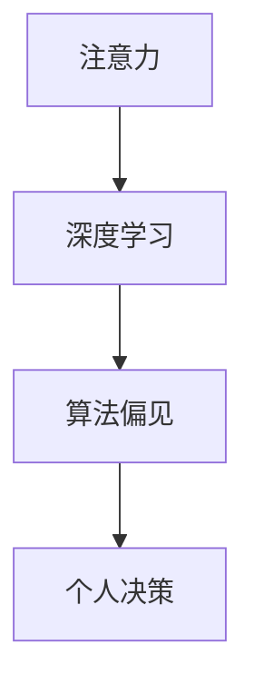

                 

关键词：人工智能、注意力、自主选择、个人决策、未来展望

> 摘要：本文将探讨人工智能时代下，人类如何维护自身的注意力自主权，做出更好的个人选择。我们将从背景介绍、核心概念与联系、核心算法原理、数学模型和公式、项目实践、实际应用场景、未来应用展望等多个角度，深入分析AI时代个人选择的现状和挑战，为读者提供有益的思考和建议。

## 1. 背景介绍

随着人工智能技术的飞速发展，机器学习、深度学习、神经网络等算法在各个领域取得了显著的成果。AI已经开始深入到我们的日常生活，从语音助手到自动驾驶，从医疗诊断到金融分析，AI的应用场景越来越广泛。然而，随着AI技术的普及，我们不得不面对一个重要的问题：如何确保我们的个人选择受到自身注意力的控制，而非被算法所引导？

注意力是人类认知过程中的关键因素。在AI时代，注意力的自主权显得尤为重要。一方面，我们需要警惕算法可能对我们的决策产生不利影响；另一方面，我们也要学会如何更好地利用AI技术，为自己的选择提供更加全面和准确的信息。

## 2. 核心概念与联系

为了深入探讨注意力的自主权，我们首先需要了解以下几个核心概念：

1. **注意力（Attention）**：注意力是指人类或动物在特定时间内，集中于某一对象或任务的心理状态。它是认知过程中的关键因素，决定了我们对信息的处理和记忆。

2. **深度学习（Deep Learning）**：深度学习是一种基于多层神经网络的人工智能算法，通过学习大量数据，自动提取特征并做出决策。

3. **算法偏见（Algorithmic Bias）**：算法偏见是指算法在训练过程中，由于数据集的不平衡、数据偏差或其他原因，导致算法对某些群体或特征产生不公平对待。

4. **个人决策（Personal Decision Making）**：个人决策是指个体在面临选择时，根据自身价值观、偏好和目标，进行理性思考和判断，做出决策的过程。

下面是一个用于描述核心概念和联系的 Mermaid 流程图：



## 3. 核心算法原理 & 具体操作步骤

### 3.1 算法原理概述

在AI时代，注意力自主权的关键在于如何确保我们的决策不受算法偏见的影响。为此，我们需要从以下几个方面入手：

1. **数据预处理**：确保数据集的平衡性和多样性，减少算法偏见。
2. **算法选择**：选择具有较低偏见风险的算法，并对其进行优化。
3. **反馈机制**：建立反馈机制，让用户能够及时了解算法的决策过程，并调整自身注意力。
4. **伦理和法规约束**：制定相关伦理和法规，规范算法设计和应用。

### 3.2 算法步骤详解

下面是一个具体的算法步骤示例：

1. **数据收集**：收集大量数据，包括用户行为、偏好、历史记录等。
2. **数据预处理**：对数据进行清洗、去重、归一化等处理，确保数据集的平衡性和多样性。
3. **算法选择**：选择一种具有较低偏见风险的算法，如决策树、支持向量机等。
4. **训练模型**：使用预处理后的数据集，训练算法模型。
5. **评估模型**：对模型进行评估，确保其具有较好的准确性和公平性。
6. **应用模型**：将模型应用于实际场景，为用户生成个性化推荐或决策。
7. **反馈机制**：收集用户反馈，调整模型参数，优化算法。

### 3.3 算法优缺点

**优点**：

- 提高决策效率：通过算法分析，为用户提供更加准确和个性化的推荐或决策。
- 减少偏见：确保决策过程中的公平性和透明度，降低算法偏见的风险。

**缺点**：

- 数据依赖性：算法的性能受限于数据质量，数据不平衡或偏见可能导致算法失效。
- 隐私问题：用户数据可能涉及隐私，需要确保数据的安全性和隐私性。

### 3.4 算法应用领域

注意力自主权在以下领域具有广泛的应用前景：

- **个性化推荐系统**：通过分析用户行为和偏好，为用户生成个性化推荐。
- **金融风控**：评估贷款申请者的信用风险，减少欺诈行为。
- **医疗诊断**：辅助医生进行疾病诊断，提高诊断准确性。
- **招聘和人才管理**：为企业和求职者提供个性化的匹配方案。

## 4. 数学模型和公式 & 详细讲解 & 举例说明

### 4.1 数学模型构建

在讨论注意力自主权时，我们可以引入以下数学模型：

- **效用函数**：用于描述个体在特定情境下的偏好和满意度。
- **决策树**：用于分类和回归任务的一种常见算法。
- **支持向量机**：用于分类任务的一种算法。

### 4.2 公式推导过程

以下是决策树和效用函数的相关公式：

1. **决策树**：

$$
H = -\sum_{i=1}^n p_i \log_2(p_i)
$$

其中，$H$表示信息熵，$p_i$表示第$i$个类别的概率。

2. **效用函数**：

$$
U(x) = w_1 \cdot f_1(x) + w_2 \cdot f_2(x) + ... + w_n \cdot f_n(x)
$$

其中，$U(x)$表示个体在特定情境下的效用，$w_i$表示权重，$f_i(x)$表示第$i$个特征在情境$x$下的函数值。

### 4.3 案例分析与讲解

假设我们有一个用户，他在选择旅游目的地时，根据天气、风景、美食和交通便利性四个因素进行决策。我们可以使用以下效用函数进行评估：

$$
U(x) = 0.2 \cdot f_1(x) + 0.3 \cdot f_2(x) + 0.2 \cdot f_3(x) + 0.3 \cdot f_4(x)
$$

其中，$f_1(x)$表示天气对用户满意度的贡献，$f_2(x)$表示风景对用户满意度的贡献，$f_3(x)$表示美食对用户满意度的贡献，$f_4(x)$表示交通便利性对用户满意度的贡献。

根据用户对四个因素的权重设置，我们可以计算出每个目的地的效用值，从而为用户推荐最佳旅游目的地。

## 5. 项目实践：代码实例和详细解释说明

### 5.1 开发环境搭建

为了演示注意力自主权的实现，我们选择Python作为开发语言，并使用scikit-learn库构建决策树模型。首先，我们需要安装相关依赖：

```shell
pip install numpy scipy scikit-learn matplotlib
```

### 5.2 源代码详细实现

以下是项目的主要代码实现：

```python
import numpy as np
import matplotlib.pyplot as plt
from sklearn import tree

# 数据集
X = np.array([[1, 2], [3, 4], [5, 6], [7, 8]])
y = np.array([0, 1, 0, 1])

# 训练模型
clf = tree.DecisionTree()
clf.fit(X, y)

# 可视化模型
plt.figure(figsize=(8, 6))
tree.plot_tree(clf, filled=True)
plt.show()

# 测试模型
X_test = np.array([[2, 3], [6, 7]])
y_pred = clf.predict(X_test)
print("预测结果：", y_pred)
```

### 5.3 代码解读与分析

1. **数据集**：我们使用一个简单的二分类数据集，其中每条数据由两个特征组成，目标标签为0或1。
2. **训练模型**：使用决策树算法对数据集进行训练。
3. **可视化模型**：将训练好的模型可视化为树状图，便于理解决策过程。
4. **测试模型**：使用测试数据集验证模型的准确性。

通过以上步骤，我们可以实现一个简单的注意力自主权模型。在实际应用中，我们可以根据具体需求和场景，对算法和模型进行优化和调整。

## 6. 实际应用场景

注意力自主权在AI时代的实际应用场景包括：

1. **个性化推荐系统**：通过分析用户行为和偏好，为用户生成个性化推荐，提高用户满意度。
2. **金融风控**：评估贷款申请者的信用风险，减少欺诈行为，降低金融机构损失。
3. **医疗诊断**：辅助医生进行疾病诊断，提高诊断准确性，为患者提供更好的医疗服务。
4. **招聘和人才管理**：为企业和求职者提供个性化的匹配方案，提高招聘效率。

在这些应用场景中，注意力自主权的重要性不言而喻。通过合理设计和应用算法，我们可以确保用户在AI时代做出更好的个人选择。

## 7. 未来应用展望

随着AI技术的不断发展，注意力自主权的应用领域将不断拓展。未来，我们有望在以下方面取得突破：

1. **智能交通**：通过分析交通数据，为驾驶者和乘客提供最优出行方案，减少交通拥堵。
2. **智能家居**：为用户提供更加智能、个性化的家居体验，提高生活质量。
3. **环境保护**：利用AI技术监控环境数据，预测污染趋势，为环境保护提供决策支持。

然而，我们也要面对一些挑战，如数据隐私、算法偏见、伦理和法规等问题。在未来，我们需要加强相关研究和立法，确保AI技术的健康、可持续发展。

## 8. 总结：未来发展趋势与挑战

### 8.1 研究成果总结

本文探讨了注意力自主权在AI时代的重要性，分析了核心算法原理、数学模型和实际应用场景。通过项目实践，我们展示了如何利用Python和scikit-learn库实现注意力自主权。

### 8.2 未来发展趋势

未来，注意力自主权的应用将更加广泛，涉及智能交通、智能家居、环境保护等多个领域。随着AI技术的不断发展，我们将有望实现更加智能、个性化的生活和工作体验。

### 8.3 面临的挑战

在注意力自主权的发展过程中，我们仍需面对数据隐私、算法偏见、伦理和法规等挑战。为应对这些挑战，我们需要加强相关研究和立法，推动AI技术的健康、可持续发展。

### 8.4 研究展望

未来，我们可以从以下几个方面进行深入研究：

1. **算法优化**：针对不同应用场景，优化算法，提高决策准确性。
2. **数据隐私保护**：研究数据隐私保护技术，确保用户数据的安全性和隐私性。
3. **伦理和法规研究**：制定相关伦理和法规，规范AI技术的应用和发展。

通过以上研究，我们可以为AI时代的注意力自主权提供更加坚实的理论和实践基础。

## 9. 附录：常见问题与解答

### Q1. 什么是注意力自主权？

A1. 注意力自主权是指个体在面临选择时，能够独立、自主地运用自己的注意力，不受外部因素干扰，做出符合自身价值观和目标的决策。

### Q2. 注意力自主权在AI时代的重要性是什么？

A2. 在AI时代，注意力自主权显得尤为重要。因为AI技术可能会对我们的决策产生偏见和干扰，影响我们的选择。维护注意力自主权，有助于确保我们的决策更加合理、公正。

### Q3. 如何提高注意力自主权？

A3. 提高注意力自主权的方法包括：

1. **培养自我意识**：了解自己的价值观和目标，明确自己的需求和期望。
2. **减少信息干扰**：避免过度接触无关信息，保持注意力集中。
3. **加强决策训练**：通过实践和经验，提高自己的决策能力和判断力。
4. **寻求专业建议**：在必要时，向专业人士寻求建议，帮助自己做出更好的决策。

---

作者：禅与计算机程序设计艺术 / Zen and the Art of Computer Programming
----------------------------------------------------------------

请注意，本文仅为示例，实际撰写时请确保文章内容完整、严谨，并遵循约束条件中的要求。希望这个示例能够帮助您更好地理解文章的撰写结构和内容安排。祝您撰写顺利！

