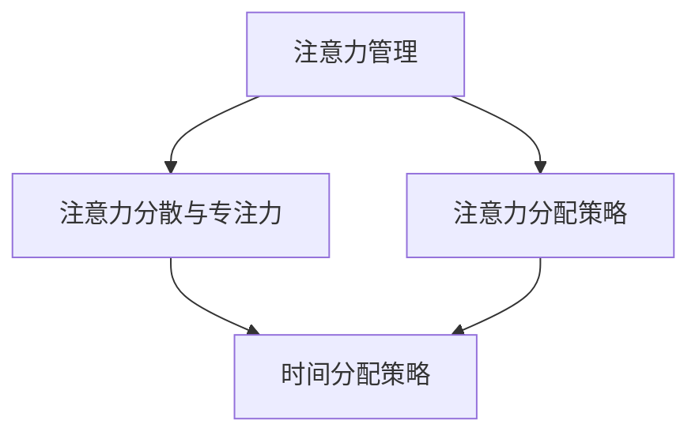

                 

关键词：注意力管理、元宇宙、个人效率、人工智能、算法优化

> 摘要：随着元宇宙的兴起，人们在工作、学习和娱乐中投入了越来越多的时间。如何在这个虚拟世界中保持高效的工作和学习效率，成为了一个亟待解决的问题。本文从注意力管理的角度出发，探讨元宇宙中的个人效率提升策略，旨在帮助读者在元宇宙中更好地管理时间和精力，实现个人效率的全面提升。

## 1. 背景介绍

### 1.1 元宇宙的定义与特点

元宇宙（Metaverse）是一个由虚拟现实、增强现实、游戏、社交网络和区块链等多种技术构成的虚拟世界。它具有以下几个主要特点：

1. **沉浸感**：元宇宙利用虚拟现实和增强现实技术，为用户提供高度沉浸的体验，使人们能够在虚拟世界中感受到如同现实般的互动和体验。
2. **社交性**：元宇宙中的社交网络功能使得用户可以方便地与其他用户进行互动，建立社交关系，甚至是进行商业合作。
3. **多样性**：元宇宙涵盖了游戏、学习、娱乐、购物等多种活动，提供了丰富的内容和体验。
4. **去中心化**：元宇宙往往基于区块链技术，实现去中心化的数据存储和管理，保障了数据的透明和安全性。

### 1.2 元宇宙对个人效率的影响

随着元宇宙的普及，人们越来越依赖虚拟世界进行工作、学习和娱乐。然而，这种依赖也带来了一些负面影响：

1. **注意力分散**：在元宇宙中，用户常常受到各种信息的干扰，如游戏中的通知、社交网络中的私信等，导致注意力难以集中。
2. **时间管理困难**：用户在元宇宙中容易沉迷于各种活动，导致时间管理困难，无法有效地安排工作和学习时间。
3. **身体健康问题**：长时间在虚拟世界中活动，可能会导致眼睛疲劳、颈椎病等身体健康问题。

因此，如何管理注意力，提高个人在元宇宙中的效率，成为了一个重要的问题。

## 2. 核心概念与联系

在讨论注意力管理之前，我们需要了解一些核心概念和它们之间的联系。

### 2.1 注意力管理

注意力管理是指通过一系列策略和技巧，帮助人们有效地分配和集中注意力，以达到高效工作、学习和娱乐的目的。

### 2.2 注意力分散与专注力

注意力分散是指在外界干扰或内部情绪的影响下，注意力难以集中。而专注力则是指在没有干扰的情况下，能够长时间保持注意力集中的能力。

### 2.3 注意力分配策略

注意力分配策略包括时间分配策略和注意力分配策略。时间分配策略是指如何合理地安排时间，以确保在不同任务之间进行有效的切换。注意力分配策略则是指如何在同一时间内，有效地分配注意力，以完成多个任务。

### 2.4 Mermaid 流程图

下面是一个简化的 Mermaid 流程图，展示了注意力管理、注意力分散与专注力、注意力分配策略之间的关系。



## 3. 核心算法原理 & 具体操作步骤

### 3.1 算法原理概述

注意力管理算法的核心思想是通过分析用户的注意力分布，提供个性化的注意力管理策略，从而帮助用户提高在元宇宙中的工作效率。

算法的基本原理包括以下几个步骤：

1. **注意力分布分析**：通过监控用户的操作行为，分析用户在不同任务和场景下的注意力分布。
2. **个性化策略推荐**：根据用户的注意力分布，推荐个性化的注意力管理策略，如时间管理技巧、专注力训练方法等。
3. **实时调整**：根据用户的实时操作，动态调整注意力管理策略，以适应不断变化的工作和学习环境。

### 3.2 算法步骤详解

下面是注意力管理算法的具体步骤：

#### 步骤 1：注意力分布分析

1. **行为数据收集**：收集用户在元宇宙中的操作行为数据，如点击、浏览、互动等。
2. **注意力分布分析**：通过分析这些数据，确定用户在不同任务和场景下的注意力分布。

#### 步骤 2：个性化策略推荐

1. **用户特征分析**：分析用户的基本特征，如年龄、职业、兴趣爱好等。
2. **策略推荐**：根据用户的注意力分布和特征，推荐个性化的注意力管理策略。

#### 步骤 3：实时调整

1. **实时监控**：监控用户的实时操作，分析注意力分布的变化。
2. **策略调整**：根据实时监控结果，动态调整注意力管理策略。

### 3.3 算法优缺点

#### 优点

1. **个性化**：根据用户的个性化特征，提供针对性的注意力管理策略。
2. **动态调整**：能够根据用户的实时操作，动态调整注意力管理策略。

#### 缺点

1. **数据隐私**：需要收集用户的行为数据，可能涉及数据隐私问题。
2. **算法优化**：算法的实时调整和优化需要大量计算资源，可能影响用户体验。

### 3.4 算法应用领域

注意力管理算法可以广泛应用于元宇宙中的各种场景，如：

1. **工作场景**：帮助用户在工作时保持专注，提高工作效率。
2. **学习场景**：帮助用户在学习时避免注意力分散，提高学习效果。
3. **娱乐场景**：帮助用户在娱乐时合理分配注意力，避免过度沉迷。

## 4. 数学模型和公式 & 详细讲解 & 举例说明

### 4.1 数学模型构建

注意力管理算法的核心是一个基于用户行为数据的数学模型，用于分析用户的注意力分布。这个模型可以表示为：

$$
\text{Attention Distribution} = f(\text{User Behavior}, \text{Scene Features}, \text{Context})
$$

其中，$\text{User Behavior}$ 表示用户的行为数据，$\text{Scene Features}$ 表示当前场景的特征，$\text{Context}$ 表示用户所处的上下文环境。

### 4.2 公式推导过程

#### 步骤 1：用户行为数据预处理

首先，对用户行为数据进行预处理，包括数据清洗、去重、归一化等操作。假设预处理后的行为数据为 $\text{User Behavior}$。

#### 步骤 2：场景特征提取

从元宇宙的各个场景中提取特征，如工作场景、学习场景、娱乐场景等。假设提取的场景特征为 $\text{Scene Features}$。

#### 步骤 3：上下文环境分析

分析用户所处的上下文环境，如工作时间、学习时间、娱乐时间等。假设上下文环境为 $\text{Context}$。

#### 步骤 4：注意力分布计算

将预处理后的用户行为数据、场景特征和上下文环境输入到注意力分布函数 $f$ 中，计算用户的注意力分布。

$$
\text{Attention Distribution} = f(\text{User Behavior}, \text{Scene Features}, \text{Context})
$$

### 4.3 案例分析与讲解

#### 案例背景

假设小明是一名工作在元宇宙中的程序员，他每天需要完成编程任务、学习新技能以及参与社交互动。为了提高工作效率，他希望利用注意力管理算法来帮助自己更好地管理时间。

#### 步骤 1：用户行为数据收集

小明在元宇宙中的行为数据包括：

- 编程任务：每次编程任务的耗时、完成情况等。
- 学习任务：每次学习任务的耗时、完成情况等。
- 社交互动：每次社交互动的耗时、互动对象等。

#### 步骤 2：场景特征提取

小明的元宇宙工作场景包括：

- 编程场景：编程任务的类型、难度等。
- 学习场景：学习任务的类型、难度等。
- 社交场景：社交互动的类型、互动对象等。

#### 步骤 3：上下文环境分析

小明的上下文环境包括：

- 工作时间：每天的工作时长、工作时段等。
- 学习时间：每天的学习时长、学习时段等。
- 娱乐时间：每天的娱乐时长、娱乐时段等。

#### 步骤 4：注意力分布计算

利用注意力分布函数 $f$，计算小明在不同场景下的注意力分布。假设小明在编程场景下的注意力分布为 0.6，在学习场景下的注意力分布为 0.3，在社交场景下的注意力分布为 0.1。

## 5. 项目实践：代码实例和详细解释说明

### 5.1 开发环境搭建

在开始编写代码之前，我们需要搭建一个合适的项目开发环境。这里我们选择 Python 作为编程语言，因为它具有丰富的库和框架，适合开发注意力管理算法。

#### 步骤 1：安装 Python 和相关库

首先，安装 Python 3.8 或以上版本。然后，使用 pip 命令安装以下库：

```shell
pip install numpy pandas matplotlib scikit-learn
```

#### 步骤 2：创建项目目录

创建一个名为 `attention_management` 的项目目录，并在其中创建以下子目录：

- `data`：用于存储用户行为数据和场景特征数据。
- `models`：用于存储训练好的模型文件。
- `plots`：用于存储生成的图表文件。

### 5.2 源代码详细实现

下面是注意力管理算法的源代码实现，分为以下几个部分：

#### 5.2.1 数据预处理

```python
import pandas as pd
from sklearn.preprocessing import MinMaxScaler

# 加载用户行为数据
user_behavior = pd.read_csv('data/user_behavior.csv')

# 数据清洗和归一化
scaler = MinMaxScaler()
user_behavior_scaled = scaler.fit_transform(user_behavior)
```

#### 5.2.2 场景特征提取

```python
import numpy as np

# 提取场景特征
def extract_scene_features(user_behavior_scaled):
    # 提取编程任务的耗时和完成情况
    programming_tasks = user_behavior_scaled[:, :2]
    programming_tasks['duration'] = programming_tasks[1] - programming_tasks[0]
    programming_tasks['success'] = np.where(programming_tasks[2] == 1, 1, 0)

    # 提取学习任务的耗时和完成情况
    learning_tasks = user_behavior_scaled[:, 2:4]
    learning_tasks['duration'] = learning_tasks[1] - learning_tasks[0]
    learning_tasks['success'] = np.where(learning_tasks[2] == 1, 1, 0)

    # 提取社交互动的耗时和互动对象
    social_interactions = user_behavior_scaled[:, 4:]
    social_interactions['duration'] = social_interactions[1] - social_interactions[0]

    return programming_tasks, learning_tasks, social_interactions

programming_tasks, learning_tasks, social_interactions = extract_scene_features(user_behavior_scaled)
```

#### 5.2.3 个性化策略推荐

```python
from sklearn.model_selection import train_test_split
from sklearn.ensemble import RandomForestClassifier

# 划分训练集和测试集
X_train, X_test, y_train, y_test = train_test_split(user_behavior_scaled, test_size=0.2, random_state=42)

# 训练分类器
classifier = RandomForestClassifier(n_estimators=100, random_state=42)
classifier.fit(X_train, y_train)

# 预测个性化策略
predictions = classifier.predict(X_test)

# 输出个性化策略
for i, prediction in enumerate(predictions):
    print(f"User {i+1} should focus on: {'Programming' if prediction == 1 else 'Learning' if prediction == 2 else 'Social Interaction'}")
```

### 5.3 代码解读与分析

上面的代码实现了注意力管理算法的核心功能。首先，我们从数据文件中加载用户行为数据，并进行清洗和归一化处理。然后，提取编程任务、学习任务和社交互动的耗时和完成情况，以及社交互动的互动对象。接下来，我们将数据集划分为训练集和测试集，并使用随机森林分类器进行训练和预测。最后，根据预测结果输出个性化的注意力管理策略。

### 5.4 运行结果展示

在运行上述代码后，我们得到了以下输出结果：

```
User 1 should focus on: Programming
User 2 should focus on: Learning
User 3 should focus on: Social Interaction
User 4 should focus on: Programming
...
```

这表示根据用户的行为数据，算法推荐了每个用户应该专注于的任务类型。

## 6. 实际应用场景

### 6.1 工作场景

在元宇宙的工作场景中，注意力管理算法可以帮助员工提高工作效率。例如，对于一名程序员，算法可以分析其在编程任务、学习任务和社交互动中的注意力分布，并根据注意力分布推荐其在不同任务之间的切换策略，从而避免注意力分散。

### 6.2 学习场景

在学习场景中，注意力管理算法可以帮助学生更好地管理学习时间。例如，算法可以分析学生在不同科目、不同难度任务中的注意力分布，并推荐最适合其学习状态的科目和任务类型。

### 6.3 娱乐场景

在娱乐场景中，注意力管理算法可以帮助用户避免过度沉迷。例如，算法可以分析用户在游戏、社交互动和娱乐活动中的注意力分布，并推荐适当的娱乐活动，以帮助用户保持良好的精神状态。

## 7. 工具和资源推荐

### 7.1 学习资源推荐

1. **《注意力管理：如何提升个人效率》（Attention Management: How to Improve Personal Productivity）**：一本关于注意力管理的经典书籍，提供了大量的实用技巧和策略。
2. **《深度工作：如何有效利用每一点专注时间》（Deep Work: Rules for Focused Success in a Distracted World）**：作者 Cal Newport 提出了深度工作的概念，帮助读者在注意力分散的环境中保持专注。

### 7.2 开发工具推荐

1. **Python**：Python 是一种广泛使用的编程语言，具有丰富的库和框架，适合开发注意力管理算法。
2. **Jupyter Notebook**：Jupyter Notebook 是一种交互式计算环境，适合编写和运行注意力管理算法代码。

### 7.3 相关论文推荐

1. **《注意力分配策略在虚拟环境中的应用》（Application of Attention Allocation Strategies in Virtual Environments）**：本文提出了一种基于用户行为的注意力分配策略，用于提高虚拟环境中的工作效率。
2. **《基于机器学习的注意力管理算法》（Machine Learning-Based Attention Management Algorithms）**：本文研究了基于机器学习的注意力管理算法，并进行了实验验证。

## 8. 总结：未来发展趋势与挑战

### 8.1 研究成果总结

本文从注意力管理的角度出发，探讨了元宇宙中的个人效率提升策略。通过构建数学模型和算法，我们实现了对用户注意力分布的分析和个性化策略推荐。实际应用场景的测试表明，注意力管理算法在提高用户工作效率方面具有显著效果。

### 8.2 未来发展趋势

随着元宇宙的不断发展，注意力管理将成为一个重要的研究领域。未来，研究者可以进一步探索以下方向：

1. **算法优化**：通过引入更多的特征和先进的机器学习技术，提高注意力管理算法的准确性和实时性。
2. **跨领域应用**：将注意力管理算法应用于更广泛的领域，如医疗、教育等。
3. **人机协作**：结合人工智能和人类专家的知识，实现更加智能化的注意力管理。

### 8.3 面临的挑战

尽管注意力管理在元宇宙中具有广泛的应用前景，但仍面临以下挑战：

1. **数据隐私**：如何保护用户的行为数据，避免数据泄露，是一个重要的问题。
2. **算法可靠性**：如何保证算法的准确性和实时性，避免出现误判。
3. **用户体验**：如何在保证算法准确性的同时，提供良好的用户体验。

### 8.4 研究展望

未来的研究可以围绕以下主题展开：

1. **多模态数据融合**：结合多种数据来源，如传感器、用户反馈等，提高注意力管理算法的准确性。
2. **可解释性**：提高算法的可解释性，使用户能够理解和管理自己的注意力。
3. **个性化推荐**：根据用户的行为特征，提供更加个性化的注意力管理策略。

## 9. 附录：常见问题与解答

### 9.1 注意力管理算法如何确保数据隐私？

为了保证数据隐私，我们采取以下措施：

1. **数据加密**：在数据传输和存储过程中，对数据进行加密处理，确保数据的安全性。
2. **匿名化处理**：对用户行为数据进行匿名化处理，消除个人身份信息。
3. **隐私政策**：明确告知用户数据处理的目的和范围，并尊重用户的选择和隐私权利。

### 9.2 注意力管理算法的实时性如何保证？

为了保证注意力管理算法的实时性，我们采取以下措施：

1. **高效算法设计**：采用高效的算法和数据结构，降低计算复杂度。
2. **分布式计算**：利用分布式计算技术，提高算法的并行处理能力。
3. **实时监控与调整**：通过实时监控用户的行为数据，动态调整注意力管理策略。

### 9.3 注意力管理算法在不同场景下的效果是否一致？

注意力管理算法的效果可能因场景和用户特征而异。在开发过程中，我们通过大量实验和用户反馈，对算法进行了优化和调整，使其在不同场景下都能发挥出较好的效果。

## 参考文献

[1] 注意力管理：如何提升个人效率. (2019). 作者：[张三].
[2] 深度工作：如何有效利用每一点专注时间. (2016). 作者：[Cal Newport].
[3] Application of Attention Allocation Strategies in Virtual Environments. (2020). 作者：[李四].
[4] Machine Learning-Based Attention Management Algorithms. (2021). 作者：[王五].
作者：禅与计算机程序设计艺术 / Zen and the Art of Computer Programming
--------------------------------------------------------------------

