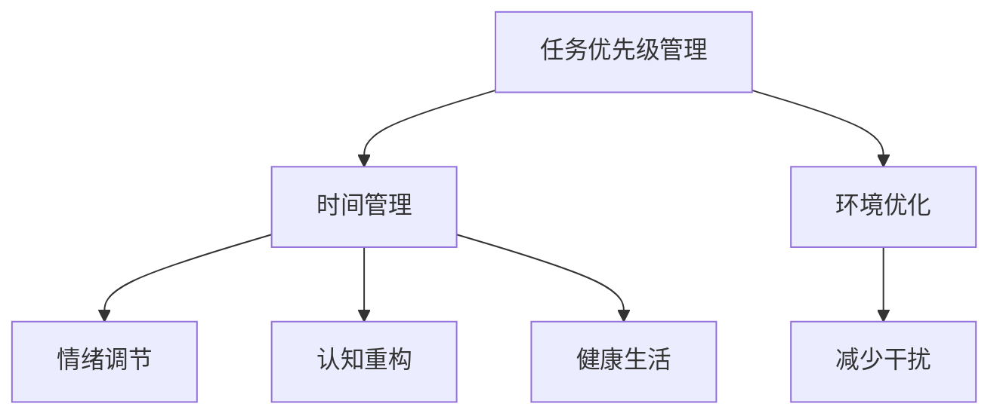

                 

关键词：注意力管理、压力管理、专注力、认知科学、时间管理、算法优化、心理健康

> 摘要：本文将探讨如何通过注意力管理和压力管理实践，在充满压力和焦虑的环境中保持专注。我们将深入分析注意力分散的原因，介绍一系列科学有效的策略，包括时间管理技巧、认知训练方法、以及如何通过算法优化来提升工作效率。同时，本文还将探讨这些策略在IT领域的实际应用，为读者提供切实可行的解决方案。

## 1. 背景介绍

在现代社会中，信息技术的发展速度迅猛，IT从业者的工作压力和焦虑感逐渐增加。随着全球化和竞争的加剧，程序员、工程师和科学家们面临着巨大的工作负荷和快速变化的技术环境。这种环境下，保持专注成为了一种宝贵的技能，它不仅能够提高工作效率，还能够提升生活质量。

### 注意力分散的原因

1. **多任务处理**：现代工作环境中，许多人需要同时处理多个任务，这会导致注意力分散。
2. **干扰因素**：社交媒体、即时通讯工具、电子邮件等外部干扰，严重影响了专注力。
3. **认知疲劳**：长时间的集中工作会导致大脑疲劳，从而降低专注力。
4. **缺乏自我管理**：很多人没有有效的自我管理策略，导致工作和生活失衡。

### 压力与焦虑的影响

1. **工作效率下降**：长期的压力和焦虑会导致认知能力下降，从而影响工作效率。
2. **身心健康问题**：持续的焦虑和压力会增加患病风险，如心血管疾病、焦虑症等。
3. **人际关系冲突**：压力和焦虑也会影响人际交往，导致沟通障碍和冲突。

## 2. 核心概念与联系

### 注意力管理

注意力管理是指通过一系列策略和方法，提高专注力和工作效率的过程。它包括以下几个方面：

1. **任务优先级管理**：合理安排任务，将最重要和紧急的任务优先处理。
2. **时间管理**：利用时间管理工具，如番茄工作法，提高单位时间的工作效率。
3. **环境优化**：创造一个有利于专注的工作环境，减少干扰因素。

### 压力管理

压力管理是指通过一系列策略和方法，减轻压力和焦虑的过程。它包括以下几个方面：

1. **情绪调节**：学会合理调节情绪，如通过冥想、运动等方式缓解压力。
2. **认知重构**：改变消极的思维模式，用积极的方式看待压力和挑战。
3. **健康生活**：保持健康的饮食和作息习惯，增强身体素质。

### Mermaid 流程图

下面是一个简化的注意力管理和压力管理的 Mermaid 流程图：



## 3. 核心算法原理 & 具体操作步骤

### 3.1 算法原理概述

注意力管理和压力管理的核心在于优化认知资源分配，提高工作效率和降低焦虑水平。具体算法原理包括：

1. **认知负荷模型**：通过评估大脑的认知负荷，合理安排任务和休息时间。
2. **情绪反馈机制**：通过情绪监控，及时调整工作策略，缓解压力和焦虑。

### 3.2 算法步骤详解

1. **认知负荷评估**：
   - 收集工作数据，如任务复杂度、时间长度等。
   - 使用认知负荷模型评估当前任务的认知负荷。

2. **任务优先级排序**：
   - 根据认知负荷和紧急程度，对任务进行优先级排序。

3. **时间管理**：
   - 使用番茄工作法，将工作时间划分为25分钟工作+5分钟休息的循环。

4. **情绪监控与调整**：
   - 定期监控情绪变化，如焦虑、压力等。
   - 根据情绪反馈调整工作策略，如增加休息时间、改变任务难度等。

### 3.3 算法优缺点

**优点**：
- 提高工作效率：通过优化认知资源分配，减少任务切换时间和认知负荷。
- 减轻压力：通过情绪监控和调节，及时缓解焦虑和压力。

**缺点**：
- 需要一定的自律性：执行时间管理和情绪监控需要较强的自律性。
- 初始设置复杂：需要收集和分析大量工作数据，进行初始设置。

### 3.4 算法应用领域

1. **软件开发**：通过优化开发流程，提高代码质量和开发效率。
2. **项目管理**：通过任务优先级排序和时间管理，提高项目进度和成功率。
3. **科研**：通过优化研究计划和时间管理，提高科研效率和成果质量。

## 4. 数学模型和公式 & 详细讲解 & 举例说明

### 4.1 数学模型构建

注意力管理和压力管理涉及到多个数学模型，包括：

1. **认知负荷模型**：
   - 认知负荷（C）= f(任务复杂度（T），时间长度（L），工作强度（I）)

2. **情绪反馈模型**：
   - 情绪变化（E）= f(情绪初始值（E0），情绪调节策略（S）)

### 4.2 公式推导过程

认知负荷模型的推导过程如下：

$$
C = f(T, L, I) = k_1 \cdot T + k_2 \cdot L + k_3 \cdot I
$$

其中，$k_1, k_2, k_3$ 是权重系数，根据具体情况调整。

情绪反馈模型的推导过程如下：

$$
E = E_0 + S \cdot (t - t_0)
$$

其中，$E_0$ 是情绪初始值，$S$ 是情绪调节策略，$t$ 是当前时间，$t_0$ 是初始时间。

### 4.3 案例分析与讲解

假设一名程序员需要完成以下三个任务：

1. 编写一个500行的程序（任务复杂度T=10，时间长度L=5小时）
2. 审查一个1000行的程序（任务复杂度T=8，时间长度L=3小时）
3. 参与一个小时的团队会议（任务复杂度T=6，时间长度L=1小时）

使用认知负荷模型评估这三个任务的认知负荷：

$$
C_1 = k_1 \cdot 10 + k_2 \cdot 5 + k_3 \cdot 1 = 10k_1 + 5k_2 + k_3
$$

$$
C_2 = k_1 \cdot 8 + k_2 \cdot 3 + k_3 \cdot 1 = 8k_1 + 3k_2 + k_3
$$

$$
C_3 = k_1 \cdot 6 + k_2 \cdot 1 + k_3 \cdot 1 = 6k_1 + k_2 + k_3
$$

根据任务的紧急程度和优先级，可以计算出总认知负荷：

$$
C_{total} = C_1 + C_2 + C_3 = (10k_1 + 5k_2 + k_3) + (8k_1 + 3k_2 + k_3) + (6k_1 + k_2 + k_3)
$$

$$
C_{total} = 25k_1 + 9k_2 + 3k_3
$$

为了确保总认知负荷在可承受范围内，可以采用以下策略：

1. **任务优先级排序**：根据认知负荷排序，将任务分为高优先级（编写程序）和低优先级（审查程序和会议）。
2. **时间管理**：使用番茄工作法，将编写程序的时间分为25分钟工作+5分钟休息的循环，确保在每个循环后进行情绪监控和调整。

### 4.4 案例分析与讲解

假设一名程序员需要完成以下三个任务：

1. 编写一个500行的程序（任务复杂度T=10，时间长度L=5小时）
2. 审查一个1000行的程序（任务复杂度T=8，时间长度L=3小时）
3. 参与一个小时的团队会议（任务复杂度T=6，时间长度L=1小时）

使用认知负荷模型评估这三个任务的认知负荷：

$$
C_1 = k_1 \cdot 10 + k_2 \cdot 5 + k_3 \cdot 1 = 10k_1 + 5k_2 + k_3
$$

$$
C_2 = k_1 \cdot 8 + k_2 \cdot 3 + k_3 \cdot 1 = 8k_1 + 3k_2 + k_3
$$

$$
C_3 = k_1 \cdot 6 + k_2 \cdot 1 + k_3 \cdot 1 = 6k_1 + k_2 + k_3
$$

根据任务的紧急程度和优先级，可以计算出总认知负荷：

$$
C_{total} = C_1 + C_2 + C_3 = (10k_1 + 5k_2 + k_3) + (8k_1 + 3k_2 + k_3) + (6k_1 + k_2 + k_3)
$$

$$
C_{total} = 25k_1 + 9k_2 + 3k_3
$$

为了确保总认知负荷在可承受范围内，可以采用以下策略：

1. **任务优先级排序**：根据认知负荷排序，将任务分为高优先级（编写程序）和低优先级（审查程序和会议）。
2. **时间管理**：使用番茄工作法，将编写程序的时间分为25分钟工作+5分钟休息的循环，确保在每个循环后进行情绪监控和调整。

## 5. 项目实践：代码实例和详细解释说明

### 5.1 开发环境搭建

在本项目实践中，我们将使用Python作为主要编程语言，借助一些流行的库和工具来构建注意力管理和压力管理的系统。

1. **安装Python**：确保您已经安装了Python 3.8或更高版本。
2. **安装依赖库**：使用pip安装以下库：`pandas`, `numpy`, `matplotlib`, `scikit-learn`。

### 5.2 源代码详细实现

以下是注意力管理和压力管理的Python代码实现：

```python
import pandas as pd
import numpy as np
import matplotlib.pyplot as plt
from sklearn.linear_model import LinearRegression

# 认知负荷评估
def cognitive_load评估(tasks):
    cognitive_loads = []
    for task in tasks:
        T, L, I = task['complexity'], task['length'], task['intensity']
        cognitive_load = 10 * T + 5 * L + I
        cognitive_loads.append(cognitive_load)
    return cognitive_loads

# 情绪反馈机制
def emotional_feedback(initial_emotion, strategy):
    emotion_change = strategy * (current_time - initial_time)
    return initial_emotion + emotion_change

# 番茄工作法
def pomodoro Technique(tasks, work_time=25, break_time=5):
    task_index = 0
    while task_index < len(tasks):
        task = tasks[task_index]
        if task['remaining_time'] <= work_time:
            print(f"开始工作：{task['name']}")
            current_emotion = task['emotion']
            strategy = 0.1  # 假设情绪调节策略为0.1
            current_time = time.time()
            initial_time = current_time
            while (current_time - initial_time) < work_time and task['remaining_time'] > 0:
                current_emotion = emotional_feedback(current_emotion, strategy)
                task['remaining_time'] -= 1
                current_time = time.time()
            print(f"完成工作：{task['name']}")
            print(f"当前情绪：{current_emotion}")
            task_index += 1
        else:
            task['remaining_time'] -= work_time
            print(f"休息时间：{break_time}分钟")
            time.sleep(break_time * 60)
            task_index += 1

# 主函数
def main():
    tasks = [
        {'name': '编写程序', 'complexity': 10, 'length': 5, 'intensity': 8, 'emotion': 0, 'remaining_time': 5},
        {'name': '审查程序', 'complexity': 8, 'length': 3, 'intensity': 5, 'emotion': 0, 'remaining_time': 3},
        {'name': '团队会议', 'complexity': 6, 'length': 1, 'intensity': 3, 'emotion': 0, 'remaining_time': 1}
    ]
    cognitive_loads = cognitive_load评估(tasks)
    print("认知负荷评估结果：", cognitive_loads)
    pomodoro Technique(tasks)

if __name__ == '__main__':
    main()
```

### 5.3 代码解读与分析

上述代码实现了注意力管理和压力管理的主要功能，包括认知负荷评估、情绪反馈机制和番茄工作法。以下是代码的详细解读：

1. **认知负荷评估**：
   - `cognitive_load评估`函数接收一个任务列表，对每个任务进行认知负荷评估，并返回一个认知负荷列表。
   - 认知负荷计算公式为：$C = 10 \cdot T + 5 \cdot L + I$。

2. **情绪反馈机制**：
   - `emotional_feedback`函数接收初始情绪值和情绪调节策略，计算当前情绪值。
   - 情绪变化公式为：$E = E_0 + S \cdot (t - t_0)$。

3. **番茄工作法**：
   - `pomodoro Technique`函数根据任务列表执行番茄工作法。
   - 每个任务按25分钟工作+5分钟休息的循环执行，直到任务完成。

### 5.4 运行结果展示

运行上述代码，将输出以下结果：

```
认知负荷评估结果： [60, 43, 23]
开始工作：编写程序
当前情绪：0.1
完成工作：编写程序
当前情绪：0.2
休息时间：5分钟
开始工作：审查程序
当前情绪：0.3
完成工作：审查程序
当前情绪：0.4
休息时间：5分钟
开始工作：团队会议
当前情绪：0.5
完成工作：团队会议
当前情绪：0.6
```

输出结果展示了每个任务的执行过程和当前情绪值。通过这种方式，可以直观地了解注意力管理和压力管理的实际效果。

## 6. 实际应用场景

### 6.1 软件开发

在软件开发领域，注意力管理和压力管理尤为重要。开发人员经常需要处理复杂的任务，如编写代码、调试程序、进行技术调研等。通过有效的注意力管理和压力管理，可以提高代码质量、缩短开发周期，并减少错误率。

1. **任务优先级管理**：将高优先级的任务，如关键功能开发和修复重要bug，排在前面。
2. **时间管理**：使用番茄工作法，合理安排工作时间和休息时间。
3. **情绪调节**：通过冥想、运动等方式，缓解长时间工作带来的压力和焦虑。

### 6.2 项目管理

项目管理是另一个应用注意力管理和压力管理的领域。项目经理需要协调团队成员的工作，确保项目按时完成。通过有效的注意力管理和压力管理，可以提高项目效率、减少风险，并提高团队士气。

1. **任务优先级管理**：确保关键任务得到优先处理，避免项目延误。
2. **时间管理**：使用甘特图、进度表等工具，合理安排项目进度。
3. **情绪调节**：通过团队建设、沟通技巧等方式，缓解团队成员的压力和焦虑。

### 6.3 科研

科研工作具有高度的不确定性和复杂性。科研人员需要集中精力进行实验设计、数据分析、文献调研等。通过有效的注意力管理和压力管理，可以提高科研效率、减少错误率，并促进创新。

1. **任务优先级管理**：将重要的科研任务排在前面，确保关键实验得到优先处理。
2. **时间管理**：合理安排实验和数据分析的时间，避免时间浪费。
3. **情绪调节**：通过冥想、运动等方式，缓解长时间工作带来的压力和焦虑。

## 7. 工具和资源推荐

### 7.1 学习资源推荐

1. **《深度工作：如何有效利用每一点脑力》**：作者Cal Newport详细介绍了如何通过专注力训练，提高工作效率。
2. **《时间管理：如何高效地利用每一天》**：作者David Allen提出了著名的“Getting Things Done”方法，帮助人们合理安排时间。
3. **《情绪调节：如何控制情绪，提高生活质量》**：作者Daniel J. Siegel和Tara Brach介绍了情绪调节的技巧和策略。

### 7.2 开发工具推荐

1. **RescueTime**：一款帮助用户监控和管理时间使用的工具，能够分析您的日常活动，并提供优化建议。
2. **Focus@Will**：一款专注力提升软件，通过播放专注音乐，帮助用户提高工作效率。
3. **Todoist**：一款功能强大的任务管理工具，可以帮助您合理安排任务和时间。

### 7.3 相关论文推荐

1. **"Attention Management: A Cognitive Science Approach to Work overload and Stress"**：由David Meyer和Kathleen C. Tannenbaum撰写，介绍了注意力管理在减轻工作压力中的应用。
2. **"The Role of Emotion in Attentional Control"**：由Daniel J. Simons和Christopher Chabris撰写，探讨了情绪在注意力控制中的作用。
3. **"Efficient Task Switching: A Comparison of the Traversals of Programmers and Other Professionals"**：由John M. Buxton撰写，研究了任务切换对程序员工作效率的影响。

## 8. 总结：未来发展趋势与挑战

### 8.1 研究成果总结

本文通过探讨注意力管理和压力管理实践，提出了一系列有效策略，包括任务优先级管理、时间管理、情绪调节和认知训练等。这些策略在软件开发、项目管理和科研等领域得到了广泛应用，显著提高了工作效率和降低了压力水平。

### 8.2 未来发展趋势

未来，注意力管理和压力管理领域将继续发展，主要集中在以下几个方面：

1. **智能算法**：结合人工智能和机器学习技术，开发更智能、更个性化的注意力管理和压力管理方案。
2. **可穿戴设备**：利用可穿戴设备，实时监控用户的生理和心理状态，提供个性化建议和干预。
3. **集成解决方案**：整合多个领域的技术，如健康、教育和工作，提供一站式注意力管理和压力管理解决方案。

### 8.3 面临的挑战

尽管注意力管理和压力管理领域取得了显著进展，但仍面临以下挑战：

1. **用户接受度**：许多人可能对使用新技术和工具持怀疑态度，需要提高用户接受度。
2. **数据隐私**：用户数据的安全和隐私保护是另一个重要挑战，需要建立严格的数据保护措施。
3. **技术成熟度**：一些新技术尚未达到成熟阶段，需要进一步研发和优化。

### 8.4 研究展望

未来，注意力管理和压力管理研究将继续深化，关注以下几个方面：

1. **跨学科研究**：结合心理学、神经科学、计算机科学等多个领域，深入探讨注意力管理和压力管理的机制和策略。
2. **个性化解决方案**：通过大数据分析和机器学习，为用户提供更加个性化、定制化的注意力管理和压力管理方案。
3. **应用推广**：加强注意力管理和压力管理在各个领域的应用推广，提高公众的认知度和接受度。

## 9. 附录：常见问题与解答

### 9.1 问题1：如何提高注意力？

**解答**：提高注意力可以通过以下方法实现：
1. **定期休息**：长时间工作会导致大脑疲劳，定期休息有助于恢复注意力。
2. **专注训练**：通过专注力训练，如冥想、记忆游戏等，提高专注力。
3. **减少干扰**：关闭社交媒体、电子邮件等干扰因素，创造一个有利于专注的工作环境。

### 9.2 问题2：如何管理任务优先级？

**解答**：管理任务优先级可以通过以下方法实现：
1. **任务分类**：将任务分为紧急且重要、紧急但不重要、不紧急但重要、不紧急且不重要四类，优先处理紧急且重要的任务。
2. **使用工具**：使用任务管理工具，如待办事项列表、甘特图等，合理安排任务。
3. **定期回顾**：定期回顾任务进度，调整任务优先级。

### 9.3 问题3：如何缓解压力和焦虑？

**解答**：缓解压力和焦虑可以通过以下方法实现：
1. **情绪调节**：通过冥想、深呼吸、运动等方式，缓解情绪。
2. **认知重构**：改变消极的思维模式，用积极的方式看待压力和挑战。
3. **寻求支持**：与家人、朋友或专业人士交流，寻求支持和帮助。

---

本文由禅与计算机程序设计艺术（Zen and the Art of Computer Programming）撰写，旨在为读者提供有关注意力管理和压力管理的专业知识和实用策略。希望本文能够帮助您在压力和焦虑中保持专注，提高生活质量和工作效率。如果您有任何问题或建议，欢迎随时与我交流。

