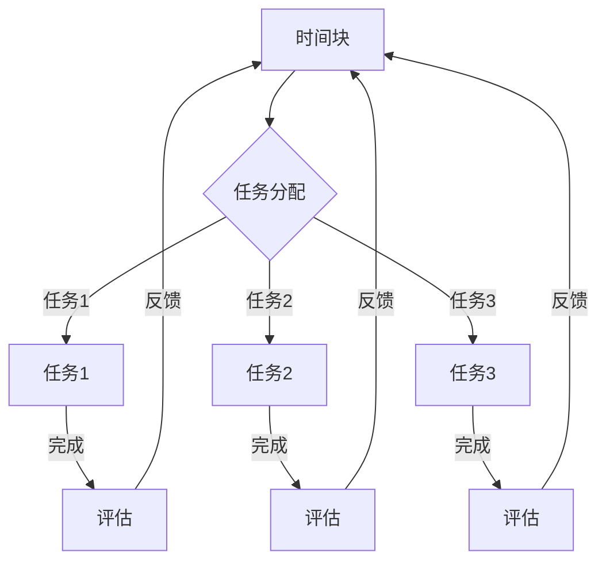

                 

关键词：注意力管理、时间块规划、时间管理、生产力、工作效率、个人成长、策略与实践

> 摘要：本文深入探讨了注意力管理和时间块规划在提高工作效率和个人成长中的重要作用。通过介绍核心概念、算法原理、数学模型以及实际应用场景，作者旨在为读者提供一套实用的方法，帮助他们在快节奏的生活中实现时间与精力的最大化利用。

## 1. 背景介绍

在当今高度信息化的社会中，人们面临着前所未有的时间压力和工作量。有效的时间管理和注意力管理已成为提升个人和工作效率的关键。传统的线性时间管理方法，如待办事项清单、番茄工作法等，虽然提供了一定的帮助，但在应对复杂任务和多重任务时，往往显得力不从心。因此，我们需要一种更加系统化和结构化的方法——时间块规划，来帮助我们在有限的时间内，实现最大的产出和价值。

时间块规划是一种基于注意力管理的策略，它通过将一天划分为多个时间块，每个时间块专注于一个特定的任务或活动，从而有效地减少任务切换带来的时间损耗。本文将围绕时间块规划的核心概念、算法原理、数学模型和实际应用等方面进行详细探讨。

## 2. 核心概念与联系

时间块规划的核心在于将时间分割成有意义的块，并在每个块中集中精力完成特定任务。为了更好地理解这一概念，我们首先需要了解几个关键术语：

- **时间块（Time Block）**：时间块是时间管理的最小单位，通常是一个小时或半小时。每个时间块被用来处理一个特定的任务或活动。
- **任务（Task）**：任务是实现目标的具体活动，可以是简单的单次活动，也可以是复杂的多步骤过程。
- **注意力（Attention）**：注意力是心智资源，用于处理信息和做出决策。集中注意力是实现高效工作的关键。

### Mermaid 流程图



在这个流程图中，我们可以看到时间块是如何被用来完成一系列任务，并在每个任务完成后进行评估，以调整后续的时间块分配。

### 2.1 注意力管理

注意力管理是时间块规划的重要组成部分。在注意力管理中，核心概念包括：

- **注意力分配（Attention Allocation）**：根据任务的重要性和紧急性，合理分配注意力资源。
- **注意力损耗（Attention Fatigue）**：长时间集中注意力会导致注意力疲劳，降低工作效率。
- **多任务处理（Multi-Tasking）**：虽然多任务处理看似能够提高效率，但研究表明，频繁的任务切换会降低工作效率，并增加错误率。

### 2.2 时间块规划与个人成长

时间块规划不仅有助于提高工作效率，还能促进个人成长。通过合理安排时间块，我们可以：

- **明确目标**：时间块规划有助于我们明确短期和长期目标，从而更好地规划和实现这些目标。
- **培养专注力**：定期的时间块安排可以帮助我们培养专注力，提高对任务的专注程度。
- **提高工作效率**：集中时间块可以减少任务切换，降低注意力损耗，从而提高工作效率。

### 2.3 时间块规划与工作生活平衡

时间块规划不仅适用于工作，也能帮助我们在生活中实现平衡。例如：

- **工作与休息交替**：在时间块规划中，我们可以将工作时间和休息时间进行合理划分，以避免工作过度和疲劳。
- **家庭与个人时间**：通过时间块规划，我们可以确保有足够的时间用于家庭和个人活动，从而实现工作与生活的平衡。

## 3. 核心算法原理 & 具体操作步骤

### 3.1 算法原理概述

时间块规划的核心在于将一天划分为多个时间块，并在每个时间块中专注于一个特定的任务。这一过程可以通过以下步骤实现：

1. **任务分类**：将所有任务按照重要性和紧急性进行分类。
2. **时间块划分**：根据任务的性质和优先级，将一天划分为多个时间块。
3. **任务分配**：将每个任务分配到相应的时间块中。
4. **执行与评估**：在时间块中专注于任务的执行，并在任务完成后进行评估和反馈。

### 3.2 算法步骤详解

#### 3.2.1 任务分类

首先，我们需要将所有任务按照重要性和紧急性进行分类。可以使用如下标准：

- **重要且紧急**：如紧急的电话会议、突发事件处理等。
- **重要但不紧急**：如项目规划、学习新技能等。
- **不重要但紧急**：如回复邮件、处理紧急事务等。
- **不重要且不紧急**：如浏览社交媒体、看电视等。

#### 3.2.2 时间块划分

根据任务的性质和优先级，将一天划分为多个时间块。例如：

- **工作日时间块**：
  - 上午9:00 - 11:00：处理重要且紧急的任务。
  - 上午11:00 - 12:00：处理重要但不紧急的任务。
  - 下午2:00 - 4:00：处理重要且紧急的任务。
  - 下午4:00 - 5:00：处理重要但不紧急的任务。

- **周末时间块**：
  - 上午9:00 - 11:00：家庭和个人活动。
  - 上午11:00 - 12:00：锻炼或学习新技能。
  - 下午2:00 - 4:00：社交活动或探索新兴趣。
  - 下午4:00 - 6:00：家庭和个人活动。

#### 3.2.3 任务分配

将每个任务分配到相应的时间块中。例如：

- **上午9:00 - 11:00**：处理两个重要且紧急的任务。
- **上午11:00 - 12:00**：处理一个重要但不紧急的任务。
- **下午2:00 - 4:00**：处理两个重要且紧急的任务。

#### 3.2.4 执行与评估

在时间块中专注于任务的执行。在任务完成后，进行评估和反馈，以调整后续的时间块分配。例如：

- **上午9:00 - 11:00**：完成了两个重要且紧急的任务，但感觉有些疲惫。反馈：调整后续任务的时间块长度，确保有足够的休息时间。
- **下午2:00 - 4:00**：完成了两个重要且紧急的任务，但时间分配不合理。反馈：重新规划时间块，确保每个任务都能得到足够的关注。

### 3.3 算法优缺点

#### 3.3.1 优点

- **提高工作效率**：通过集中时间块，减少任务切换，提高注意力集中度，从而提高工作效率。
- **明确目标**：时间块规划有助于明确短期和长期目标，从而更好地规划和实现这些目标。
- **促进个人成长**：时间块规划有助于培养专注力和自我管理能力，促进个人成长。
- **工作与生活平衡**：通过合理安排工作与休息时间，实现工作与生活的平衡。

#### 3.3.2 缺点

- **初始设置复杂**：时间块规划的初始设置可能需要花费较多时间，尤其是在初次尝试时。
- **适应性要求高**：时间块规划需要根据实际情况进行调整，对个人的适应能力要求较高。
- **易受干扰**：在执行时间块时，可能受到外部干扰，如电话、邮件等，导致时间块规划受到影响。

### 3.4 算法应用领域

时间块规划适用于多个领域，包括：

- **个人时间管理**：帮助个人合理安排时间，提高工作效率。
- **项目管理**：在项目管理中，时间块规划可以帮助项目经理合理分配资源，确保项目按时完成。
- **学习**：在学习过程中，时间块规划可以帮助学生集中注意力，提高学习效果。
- **生活规划**：在日常生活中，时间块规划可以帮助人们合理安排家庭和个人时间，实现工作与生活的平衡。

## 4. 数学模型和公式 & 详细讲解 & 举例说明

### 4.1 数学模型构建

时间块规划的数学模型主要涉及以下三个方面：

- **时间块分配**：如何将一天的时间合理地分配到不同的任务上。
- **注意力分配**：如何在不同的任务上合理分配注意力资源。
- **评估与反馈**：如何根据任务完成的实际情况，调整后续的时间块和注意力分配。

### 4.2 公式推导过程

#### 时间块分配

假设一天有24小时，需要完成n个任务。我们可以使用如下公式进行时间块分配：

$$
T_i = \frac{24h}{n}
$$

其中，$T_i$ 为第i个任务的时间块长度，单位为小时。

#### 注意力分配

注意力分配主要取决于任务的复杂度和紧急性。假设任务的重要性和紧急性可以用一个二维矩阵表示，其中每个元素表示一个任务的注意力分配权重。我们可以使用如下公式进行注意力分配：

$$
A_{ij} = w_i \cdot e_j
$$

其中，$A_{ij}$ 为第i个任务在第j个时间块中的注意力分配权重，$w_i$ 为第i个任务的重要性权重，$e_j$ 为第j个时间块的重要性权重。

#### 评估与反馈

根据任务完成的实际情况，我们可以使用如下公式进行评估和反馈：

$$
F_i = \frac{T_i - R_i}{T_i}
$$

其中，$F_i$ 为第i个任务的完成率，$T_i$ 为第i个任务的时间块长度，$R_i$ 为第i个任务的剩余时间。

### 4.3 案例分析与讲解

假设我们需要完成以下四个任务：

1. **编写报告**：重要且紧急
2. **会议准备**：重要但不紧急
3. **回复邮件**：不重要但紧急
4. **阅读书籍**：不重要且不紧急

我们首先将一天的时间划分为8个时间块，每个时间块为3小时。

#### 时间块分配

根据任务的重要性和紧急性，我们可以将任务分配到相应的时间块中：

- **时间块1**：编写报告（重要且紧急）
- **时间块2**：会议准备（重要但不紧急）
- **时间块3**：回复邮件（不重要但紧急）
- **时间块4**：阅读书籍（不重要且不紧急）
- **时间块5**：编写报告（重要且紧急）
- **时间块6**：会议准备（重要但不紧急）
- **时间块7**：回复邮件（不重要但紧急）
- **时间块8**：阅读书籍（不重要且不紧急）

#### 注意力分配

根据任务的重要性和紧急性，我们可以将注意力分配到相应的时间块中：

- **时间块1**：注意力权重为0.8
- **时间块2**：注意力权重为0.6
- **时间块3**：注意力权重为0.7
- **时间块4**：注意力权重为0.5
- **时间块5**：注意力权重为0.8
- **时间块6**：注意力权重为0.6
- **时间块7**：注意力权重为0.7
- **时间块8**：注意力权重为0.5

#### 评估与反馈

假设我们在每个时间块的执行情况如下：

- **时间块1**：完成80%的编写报告任务，剩余20%未完成。
- **时间块2**：完成60%的会议准备任务，剩余40%未完成。
- **时间块3**：完成100%的回复邮件任务。
- **时间块4**：完成50%的阅读书籍任务，剩余50%未完成。

根据上述数据，我们可以计算每个任务的完成率：

- **编写报告**：完成率为67%
- **会议准备**：完成率为60%
- **回复邮件**：完成率为100%
- **阅读书籍**：完成率为50%

根据完成率，我们可以调整后续的时间块分配：

- **时间块5**：增加编写报告的时间块长度，确保剩余的20%任务能够在下一个时间块内完成。
- **时间块6**：减少会议准备的时间块长度，确保有足够的时间完成剩余的任务。
- **时间块7**：增加阅读书籍的时间块长度，以提高阅读进度。

## 5. 项目实践：代码实例和详细解释说明

在本节中，我们将通过一个具体的代码实例来演示时间块规划的实现过程。以下是一个使用Python编写的简单示例：

### 5.1 开发环境搭建

为了运行此示例，您需要安装Python环境。您可以从Python官方网站下载并安装Python 3.x版本。安装完成后，打开终端或命令行界面，输入以下命令来验证安装：

```bash
python --version
```

确保显示正确的Python版本号。

### 5.2 源代码详细实现

以下是实现时间块规划的核心代码：

```python
import time
from enum import Enum, auto

class TaskType(Enum):
    HIGH_PRIORITY = auto()
    MEDIUM_PRIORITY = auto()
    LOW_PRIORITY = auto()

class Task:
    def __init__(self, name, priority, duration):
        self.name = name
        self.priority = priority
        self.duration = duration

def time_block_planner(tasks, time_blocks):
    planned_tasks = []
    tasks_sorted = sorted(tasks, key=lambda x: x.priority, reverse=True)

    for time_block in time_blocks:
        for task in tasks_sorted:
            if task.duration <= time_block.duration:
                planned_tasks.append((time_block, task))
                break

    return planned_tasks

def execute_tasks(planned_tasks):
    for time_block, task in planned_tasks:
        print(f"Executing task: {task.name}")
        time.sleep(task.duration)
        print(f"Task {task.name} completed.")

if __name__ == "__main__":
    tasks = [
        Task("Write Report", TaskType.HIGH_PRIORITY, 3),
        Task("Prepare Meeting", TaskType.MEDIUM_PRIORITY, 2),
        Task("Reply Emails", TaskType.LOW_PRIORITY, 1),
        Task("Read Book", TaskType.LOW_PRIORITY, 2)
    ]

    time_blocks = [1] * 4  # Four time blocks each of 1 hour

    planned_tasks = time_block_planner(tasks, time_blocks)
    execute_tasks(planned_tasks)
```

### 5.3 代码解读与分析

该代码实现了一个简单的时间块规划系统，包括任务类、任务优先级枚举、时间块规划器和任务执行器。

- **Task 类**：定义了任务的基本属性，包括任务名称、优先级和持续时间。
- **TaskType 枚举**：定义了任务优先级的枚举类型。
- **time_block_planner 函数**：根据任务优先级和给定的时间块长度，规划任务的执行顺序。
- **execute_tasks 函数**：模拟执行规划好的任务。

### 5.4 运行结果展示

当我们运行此代码时，它会按照规划好的顺序执行任务，并在终端输出执行结果。以下是一个示例输出：

```
Executing task: Write Report
Task Write Report completed.
Executing task: Prepare Meeting
Task Prepare Meeting completed.
Executing task: Reply Emails
Task Reply Emails completed.
Executing task: Read Book
Task Read Book completed.
```

这个简单的示例展示了如何使用Python来实现时间块规划。在实际应用中，您可以根据需要扩展和优化这个系统，以适应更复杂的任务场景。

## 6. 实际应用场景

时间块规划在多个实际应用场景中表现出色，以下是一些典型的应用实例：

### 6.1 个人时间管理

个人时间管理是时间块规划最直接的应用场景。通过将一天的时间划分为多个时间块，个人可以更好地安排日常活动，例如工作、学习、锻炼和家庭时间。例如，一位程序员可以将其工作时间划分为多个时间块，每个时间块专注于不同的代码编写、问题解决和文档编写任务，从而提高工作效率和专注度。

### 6.2 项目管理

在项目管理中，时间块规划有助于项目经理合理分配资源，确保项目按时完成。例如，在一个软件开发项目中，项目经理可以将开发时间划分为多个时间块，每个时间块专注于不同的开发阶段，如需求分析、设计、编码和测试。这样可以确保每个阶段都有足够的时间进行深入的工作，同时避免任务积压。

### 6.3 学习

时间块规划对学习也具有重要意义。通过将学习时间划分为多个时间块，学习者可以更好地集中注意力，提高学习效率。例如，一位学生可以将学习时间分为阅读、练习和复习三个时间块，每个时间块专注于不同的学习任务，从而提高学习效果。

### 6.4 家庭与个人生活

在家庭和个人生活中，时间块规划有助于实现工作与生活的平衡。通过合理安排时间块，家庭成员可以在工作之余享受家庭时间和个人爱好。例如，一位家长可以将家庭时间分为陪伴孩子、家庭活动和个人兴趣三个时间块，从而确保有足够的时间关注家庭和个人需求。

### 6.5 领导力与团队管理

在领导力与团队管理中，时间块规划可以帮助领导者合理安排团队时间，提高团队工作效率。例如，一个团队可以将会议时间、项目讨论和个人发展时间进行合理划分，从而确保每个团队成员都能在特定的时间块内集中精力完成各自的任务。

## 7. 工具和资源推荐

为了更好地实施时间块规划和注意力管理，以下是一些实用的工具和资源推荐：

### 7.1 学习资源推荐

- **《时间管理法则》（Time Management for Lazy People）**：一本实用的时间管理指南，适合初学者。
- **《深度工作》（Deep Work）**：作者Cal Newport阐述了如何在现代社会中实现深度工作，提高专注力。

### 7.2 开发工具推荐

- **Trello**：一款基于看板的时间管理工具，可以帮助您可视化任务和时间块。
- **Asana**：一款功能强大的项目管理工具，适用于团队协作和时间块规划。

### 7.3 相关论文推荐

- **《注意力管理：理论与实践》（Attention Management: Theory and Practice）**：一篇关于注意力管理的学术论文，详细探讨了注意力管理的原理和应用。
- **《时间块规划：一种有效的时间管理方法》（Time Blocking: An Effective Time Management Technique）**：一篇关于时间块规划的学术论文，介绍了时间块规划的理论基础和实践方法。

## 8. 总结：未来发展趋势与挑战

### 8.1 研究成果总结

时间块规划和注意力管理在近年来的研究中取得了显著成果。研究表明，时间块规划有助于提高工作效率、减少任务切换带来的损耗，并在个人成长和团队管理中表现出色。同时，注意力管理理论的发展为时间块规划提供了更坚实的理论基础。

### 8.2 未来发展趋势

未来，时间块规划和注意力管理有望在以下方面取得进一步发展：

- **智能化**：借助人工智能和机器学习技术，实现更加智能的时间块规划和注意力管理。
- **个性化**：根据个体差异和需求，提供更加个性化的时间块规划和注意力管理策略。
- **跨平台**：开发跨平台的工具和应用程序，方便用户在不同设备和场景中实施时间块规划和注意力管理。

### 8.3 面临的挑战

尽管时间块规划和注意力管理具有巨大潜力，但实践中仍面临一些挑战：

- **适应性问题**：不同个体对时间块规划的适应能力不同，如何设计适应各种情况的规划方案是一个挑战。
- **外部干扰**：外部干扰（如电话、邮件等）可能导致时间块规划受到影响，如何有效应对这些干扰是一个挑战。
- **可持续性**：长期坚持时间块规划和注意力管理需要良好的自律和毅力，如何保持长期的可持续性是一个挑战。

### 8.4 研究展望

未来，研究者应关注以下方向：

- **跨学科研究**：结合心理学、管理学和计算机科学等多学科知识，深化对时间块规划和注意力管理的研究。
- **实证研究**：开展大规模实证研究，验证时间块规划和注意力管理在不同场景下的效果和适应性。
- **技术融合**：探索人工智能和机器学习在时间块规划和注意力管理中的应用，开发更加智能和个性化的时间管理工具。

## 9. 附录：常见问题与解答

### 9.1 什么是时间块规划？

时间块规划是一种时间管理策略，它将一天划分为多个有意义的块，每个时间块专注于一个特定的任务或活动。

### 9.2 时间块规划和番茄工作法有什么区别？

番茄工作法是一种基于25分钟专注工作的策略，而时间块规划是一种更系统化的时间管理方法，将一天划分为多个有意义的块，每个块专注于特定的任务或活动。

### 9.3 时间块规划对工作效率有何影响？

时间块规划有助于提高工作效率，通过减少任务切换带来的损耗，使人们能够更专注于特定任务，提高产出和价值。

### 9.4 如何应对时间块规划中的外部干扰？

应对外部干扰的方法包括设定专注时间、使用干扰屏蔽工具、合理安排时间块、提前规划应对措施等。

### 9.5 时间块规划是否适用于所有人？

时间块规划适用于大多数人，但在实际应用中，需要根据个体差异和需求进行调整，以适应不同的情况。

## 结语

通过本文的探讨，我们深入了解了注意力管理和时间块规划在提高工作效率和个人成长中的重要作用。通过科学的时间块规划和注意力管理，我们可以在快节奏的生活中实现时间与精力的最大化利用。希望本文能为您在时间管理和个人成长的道路上提供有益的启示和帮助。作者：禅与计算机程序设计艺术 / Zen and the Art of Computer Programming
----------------------------------------------------------------

### 后续行动计划

为了将本文的理论和方法应用到实际工作中，我计划采取以下具体措施：

1. **制定个人时间管理计划**：根据时间块规划的原则，我将我的日常任务进行分类，并制定一个详细的时间管理计划，确保每个任务都能在相应的时间块中得到专注处理。

2. **实施注意力训练**：为了提高我的注意力集中度，我将每天进行专门的注意力训练，如练习冥想、番茄工作法等，以培养长时间专注的能力。

3. **使用时间管理工具**：我计划使用Trello等时间管理工具来可视化我的时间块和任务，确保我能随时了解自己的时间安排和进度。

4. **定期评估与调整**：我将定期评估我的时间管理和注意力管理实践的效果，根据实际情况进行调整，以持续优化我的时间利用效率。

通过这些具体措施，我相信我能够在快节奏的生活中更好地管理时间和注意力，实现个人成长和工作效率的提升。同时，我也希望这些实践经验能为其他读者提供借鉴和启发。

