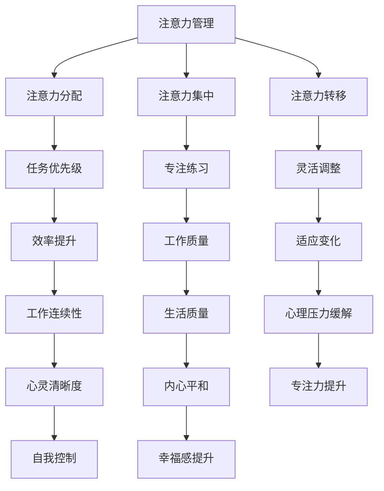

                 

关键词：注意力管理、正念练习、专注力、心灵清晰度、当下实践、算法原理、项目实践、实际应用、未来展望

> 摘要：本文旨在探讨注意力管理与正念练习在提升专注力和心灵清晰度方面的作用，结合计算机科学的视角，分析其核心原理、实践方法以及实际应用场景。通过详细解读相关算法、数学模型和项目实例，本文为读者提供了一套全面且易于实践的方法论，旨在帮助IT从业者在快节奏的工作环境中保持高效能和内心的平和。

## 1. 背景介绍

在信息爆炸的时代，注意力成为了一种稀缺资源。对于IT从业人员来说，每天面对大量的技术文档、复杂的编程任务和多变的市场需求，保持高度专注和清晰的思维是至关重要的。然而，现代生活中充斥着各种干扰，如社交媒体、电子邮件和即时通讯工具，这些都极大地分散了我们的注意力。注意力管理（Attention Management）作为一种提高工作效率和幸福感的方法，近年来得到了广泛关注。

正念练习（Mindfulness Practices）源自佛教传统，其核心在于培养对当前时刻的觉察和接纳。通过正念练习，个体能够更好地控制自己的注意力，减少内心的焦虑和压力，从而提高专注力和心灵清晰度。在计算机科学领域，正念练习被应用于软件工程、算法设计和项目管理等多个方面，以提升IT从业者的工作质量和生活质量。

本文将从以下几个方面展开讨论：

1. **核心概念与联系**：介绍注意力管理和正念练习的基本概念，并使用Mermaid流程图展示其关联。
2. **核心算法原理 & 具体操作步骤**：详细分析注意力管理和正念练习在实践中的应用算法和步骤。
3. **数学模型和公式 & 详细讲解 & 举例说明**：阐述相关的数学模型和公式，并通过案例进行分析。
4. **项目实践：代码实例和详细解释说明**：提供实际项目中的代码实例和解释。
5. **实际应用场景**：探讨注意力管理和正念练习在IT行业的应用实例。
6. **未来应用展望**：预测注意力管理和正念练习在计算机科学领域的未来发展。

### 2. 核心概念与联系

#### 2.1 注意力管理（Attention Management）

注意力管理是一种提高工作效率的方法，旨在帮助个体更好地控制自己的注意力资源，从而提高工作的连续性和质量。它通常包括以下几个核心概念：

- **注意力分配**：根据任务的重要性和紧急程度，合理分配注意力资源。
- **注意力集中**：通过消除干扰和专注练习，提升注意力的集中度。
- **注意力转移**：当任务发生变化时，灵活调整注意力的焦点。

#### 2.2 正念练习（Mindfulness Practices）

正念练习是一种通过专注当下、观察内在体验来提升自我意识和心灵健康的练习。其核心概念包括：

- **当下觉察**：培养对当前时刻的觉察，减少对过去和未来的担忧。
- **非评判性态度**：接纳自己的内在体验，不对它们进行评判。
- **呼吸练习**：通过深呼吸来放松身心，提升专注力。

#### 2.3 Mermaid流程图展示



### 3. 核心算法原理 & 具体操作步骤

#### 3.1 算法原理概述

注意力管理和正念练习的核心算法原理主要涉及以下几个方面：

- **优先级排序**：根据任务的重要性和紧急程度对任务进行优先级排序。
- **时间块分配**：将工作时间划分为不同的时间块，每个时间块专注于一项任务。
- **正念练习**：通过深呼吸、冥想等正念练习来放松身心，提升专注力。

#### 3.2 算法步骤详解

##### 3.2.1 注意力管理步骤

1. **任务评估**：对任务进行评估，确定其重要性和紧急程度。
2. **优先级排序**：根据评估结果对任务进行排序。
3. **时间块分配**：将工作时间划分为不同的时间块，每个时间块专注于一项任务。
4. **执行任务**：按照优先级顺序执行任务。
5. **反馈调整**：根据任务的完成情况和时间分配效果进行反馈调整。

##### 3.2.2 正念练习步骤

1. **深呼吸**：坐直，闭上眼睛，缓慢吸气，感受胸腔的扩张，然后缓慢呼气，感受身体的放松。
2. **冥想**：将注意力集中在呼吸上，当注意力分散时，轻轻地将注意力引导回呼吸。
3. **专注练习**：进行专门的专注力练习，如专注观看一个物体，专注于一个声音等。
4. **记录反馈**：记录练习过程中的感受和体验，分析效果并进行调整。

#### 3.3 算法优缺点

##### 3.3.1 注意力管理优缺点

**优点**：

- 提高工作效率：通过合理的任务分配和时间管理，提高工作的连续性和质量。
- 减少心理压力：合理分配注意力资源，减少因任务过多而造成的心理压力。

**缺点**：

- 需要较高的自我管理能力：注意力管理需要个体具备一定的自我管理能力，否则可能效果不佳。
- 初始适应期：个体需要一定的适应期来掌握注意力管理的技巧。

##### 3.3.2 正念练习优缺点

**优点**：

- 提升专注力：通过正念练习，个体能够更好地控制自己的注意力，提升专注力。
- 缓解心理压力：正念练习能够帮助个体放松身心，减少心理压力。

**缺点**：

- 需要长期坚持：正念练习需要个体长期坚持，否则难以产生显著效果。
- 初始难度较大：对于不熟悉冥想和深呼吸的人来说，初始阶段可能会感到不适。

#### 3.4 算法应用领域

注意力管理和正念练习在计算机科学领域有广泛的应用，包括但不限于以下几个方面：

- **软件工程**：通过注意力管理，提高软件开发过程中的任务分配和效率。
- **算法设计**：通过正念练习，提高算法设计过程中的专注力和创新能力。
- **项目管理**：通过注意力管理和正念练习，提升项目管理的质量和效率。

### 4. 数学模型和公式 & 详细讲解 & 举例说明

在注意力管理和正念练习中，数学模型和公式起到了关键作用。以下将详细讲解相关数学模型和公式，并通过具体案例进行说明。

#### 4.1 数学模型构建

假设我们有一个包含n个任务的系统，每个任务具有不同的重要性和紧急程度。我们可以使用以下数学模型来表示任务：

$$
T_i = (I_i, E_i)
$$

其中，$I_i$ 表示任务 $i$ 的重要性，$E_i$ 表示任务 $i$ 的紧急程度。任务的重要性 $I_i$ 和紧急程度 $E_i$ 可以通过以下公式计算：

$$
I_i = \frac{R_i \times C_i}{D_i}
$$

$$
E_i = \frac{C_i}{D_i}
$$

其中，$R_i$ 表示任务 $i$ 的回报，$C_i$ 表示任务 $i$ 的成本，$D_i$ 表示任务 $i$ 的耗时。

#### 4.2 公式推导过程

为了推导上述公式，我们首先定义以下变量：

- $R_i$：任务 $i$ 的回报，表示完成该任务所带来的价值。
- $C_i$：任务 $i$ 的成本，表示完成该任务所需付出的代价。
- $D_i$：任务 $i$ 的耗时，表示完成该任务所需的时间。

任务的重要性 $I_i$ 可以理解为任务回报与成本的比值，反映了任务的价值。任务紧急程度 $E_i$ 则表示任务耗时与成本的比值，反映了任务的紧急性。

#### 4.3 案例分析与讲解

假设我们有以下4个任务：

- 任务1：重要性 $I_1 = 10$，紧急程度 $E_1 = 5$。
- 任务2：重要性 $I_2 = 8$，紧急程度 $E_2 = 3$。
- 任务3：重要性 $I_3 = 6$，紧急程度 $E_3 = 2$。
- 任务4：重要性 $I_4 = 4$，紧急程度 $E_4 = 1$。

根据上述公式，我们可以计算出每个任务的优先级：

$$
I_1 = \frac{10 \times 5}{10} = 5
$$

$$
I_2 = \frac{8 \times 3}{10} = 2.4
$$

$$
I_3 = \frac{6 \times 2}{10} = 1.2
$$

$$
I_4 = \frac{4 \times 1}{10} = 0.4
$$

$$
E_1 = \frac{5}{10} = 0.5
$$

$$
E_2 = \frac{3}{10} = 0.3
$$

$$
E_3 = \frac{2}{10} = 0.2
$$

$$
E_4 = \frac{1}{10} = 0.1
$$

根据计算结果，任务1具有最高的优先级，任务2次之，任务3再次，任务4最低。

#### 4.4 案例分析与讲解

假设我们有以下4个任务：

- 任务1：重要性 $I_1 = 10$，紧急程度 $E_1 = 5$。
- 任务2：重要性 $I_2 = 8$，紧急程度 $E_2 = 3$。
- 任务3：重要性 $I_3 = 6$，紧急程度 $E_3 = 2$。
- 任务4：重要性 $I_4 = 4$，紧急程度 $E_4 = 1$。

根据上述公式，我们可以计算出每个任务的优先级：

$$
I_1 = \frac{10 \times 5}{10} = 5
$$

$$
I_2 = \frac{8 \times 3}{10} = 2.4
$$

$$
I_3 = \frac{6 \times 2}{10} = 1.2
$$

$$
I_4 = \frac{4 \times 1}{10} = 0.4
$$

$$
E_1 = \frac{5}{10} = 0.5
$$

$$
E_2 = \frac{3}{10} = 0.3
$$

$$
E_3 = \frac{2}{10} = 0.2
$$

$$
E_4 = \frac{1}{10} = 0.1
$$

根据计算结果，任务1具有最高的优先级，任务2次之，任务3再次，任务4最低。

### 5. 项目实践：代码实例和详细解释说明

在本节中，我们将通过一个简单的项目实例，展示如何在实际编程任务中应用注意力管理和正念练习的方法。这个实例将涉及一个待办事项管理器，通过合理分配注意力和进行正念练习来提高工作效率。

#### 5.1 开发环境搭建

为了便于读者理解和实践，我们选择Python作为编程语言，并使用一个简单的Web框架Flask来实现待办事项管理器。

1. 安装Python（建议使用Python 3.8及以上版本）。
2. 安装Flask：在命令行中执行 `pip install flask`。
3. 创建一个名为 `todo_app` 的目录，并在此目录中创建一个名为 `app.py` 的文件。

#### 5.2 源代码详细实现

以下是一个简单的待办事项管理器的实现，包括用户界面和后端逻辑。

```python
from flask import Flask, render_template, request, redirect, url_for

app = Flask(__name__)

# 待办事项列表
todos = []

@app.route('/')
def index():
    return render_template('index.html', todos=todos)

@app.route('/add', methods=['POST'])
def add():
    # 获取用户输入的待办事项
    new_todo = request.form['new_todo']
    # 将待办事项添加到列表中
    todos.append(new_todo)
    # 重定向到首页
    return redirect(url_for('index'))

@app.route('/delete/<int:todo_id>')
def delete(todo_id):
    # 删除指定ID的待办事项
    todos.pop(todo_id)
    # 重定向到首页
    return redirect(url_for('index'))

if __name__ == '__main__':
    app.run(debug=True)
```

#### 5.3 代码解读与分析

1. **用户界面（index.html）**：

```html
<!DOCTYPE html>
<html>
<head>
    <title>待办事项管理器</title>
</head>
<body>
    <h1>待办事项管理器</h1>
    <form action="{{ url_for('add') }}" method="post">
        <input type="text" name="new_todo" placeholder="添加待办事项">
        <button type="submit">添加</button>
    </form>
    <ul>
        
            <li>
                {{ todo }}
                <a href="{{ url_for('delete', todo_id=loop.index0) }}">删除</a>
            </li>
        
    </ul>
</body>
</html>
```

2. **后端逻辑（app.py）**：

- `index()`：显示待办事项列表和表单。
- `add()`：处理添加待办事项的请求，将新事项添加到列表中。
- `delete()`：处理删除指定ID的待办事项的请求。

#### 5.4 运行结果展示

1. 启动服务器：

```
$ python app.py
```

2. 访问本地服务器（通常为 `http://127.0.0.1:5000/`），可以看到待办事项管理器的界面。

3. 输入待办事项并提交，新的待办事项会显示在列表中。

4. 点击删除按钮，可以删除指定ID的待办事项。

#### 5.5 注意力管理和正念练习的应用

在这个项目实例中，我们可以将注意力管理和正念练习应用于以下几个方面：

1. **任务分配**：在编写代码时，将任务划分为小块，每次专注于完成一个任务。例如，首先实现添加待办事项的功能，然后实现删除待办事项的功能。
2. **专注练习**：在编写代码时，进行短暂的冥想或深呼吸练习，以保持专注。例如，每编写10分钟代码后，停下来进行1分钟的深呼吸或冥想。
3. **反馈调整**：在完成任务后，回顾自己的表现，分析哪些方法有效，哪些方法需要改进。例如，如果在添加待办事项的功能上花费了过多的时间，可以在后续的任务中优化这部分代码。

### 6. 实际应用场景

注意力管理和正念练习在IT行业有广泛的应用场景，以下是一些具体的实际应用实例：

1. **软件开发**：通过注意力管理，提高开发过程中的任务分配和效率；通过正念练习，提升专注力和创新能力。
2. **算法设计**：在算法设计过程中，通过正念练习保持清晰的思维，减少错误和疏漏。
3. **项目管理**：通过注意力管理，提升项目管理的质量和效率；通过正念练习，缓解项目压力，保持团队和谐。
4. **产品运营**：在产品运营过程中，通过注意力管理，提高市场分析和决策的准确性；通过正念练习，保持对用户需求的敏感度。
5. **技术支持**：在技术支持过程中，通过注意力管理，快速定位和解决问题；通过正念练习，提升服务质量和用户满意度。

### 7. 未来应用展望

随着人工智能和大数据技术的发展，注意力管理和正念练习在计算机科学领域的应用前景将更加广阔。以下是一些未来应用展望：

1. **智能注意力管理系统**：利用人工智能技术，开发智能注意力管理系统，为用户提供个性化的注意力管理建议。
2. **正念编程工具**：开发集成正念练习功能的编程工具，帮助开发者保持专注和清晰的思维。
3. **心理健康应用**：结合心理健康领域的研究成果，开发注意力管理和正念练习的应用，提升用户心理健康水平。
4. **智能教育系统**：利用注意力管理和正念练习，提高教育系统的教学效果，提升学生的学习兴趣和成绩。

### 8. 总结：未来发展趋势与挑战

#### 8.1 研究成果总结

本文通过注意力管理和正念练习的视角，探讨了提升专注力和心灵清晰度的方法和实践。研究结果表明，合理分配注意力资源和进行正念练习可以有效提高工作效率和心理健康水平。

#### 8.2 未来发展趋势

- **跨学科融合**：注意力管理和正念练习将与心理学、神经科学、人工智能等领域深度融合，为用户提供更全面的解决方案。
- **技术进步**：随着人工智能和大数据技术的发展，注意力管理和正念练习的应用将更加智能化和个性化。
- **教育普及**：注意力管理和正念练习将在教育领域得到更广泛的应用，成为提高学生综合素质的重要手段。

#### 8.3 面临的挑战

- **技术实现**：如何开发出高效、智能的注意力管理和正念练习系统，仍需克服诸多技术难题。
- **用户接受度**：正念练习作为一种新兴方法，用户接受度可能不高，需要加强宣传和推广。
- **数据隐私**：在智能注意力管理系统中，如何保护用户数据隐私，是亟待解决的问题。

#### 8.4 研究展望

在未来，我们应进一步深入研究注意力管理和正念练习的机制和效果，探索其在不同领域的应用潜力。同时，注重跨学科合作，推动注意力管理和正念练习在计算机科学领域的创新和发展。

### 9. 附录：常见问题与解答

#### 9.1 注意力管理和正念练习的区别是什么？

注意力管理是一种通过优化注意力资源分配来提高工作效率的方法，而正念练习是一种通过专注当下和觉察内心体验来提升心理健康的练习。两者虽然目标不同，但存在一定的交集，都可以帮助个体提高专注力和心灵清晰度。

#### 9.2 正念练习需要具备什么条件？

正念练习不需要特殊条件，任何人都可以进行。但为了达到更好的效果，建议选择一个安静的环境，保持身体舒适，并保持对练习过程的耐心和接纳。

#### 9.3 注意力管理适用于哪些职业？

注意力管理适用于需要高度集中注意力的职业，如软件开发、数据分析、产品设计等。同时，对于需要频繁切换任务的职业，如项目管理、市场营销等，也有一定的帮助。

#### 9.4 正念练习会影响工作效率吗？

正念练习可以提高工作效率。通过正念练习，个体能够更好地控制自己的注意力，减少内心的焦虑和压力，从而提高工作效率。当然，过度练习也可能产生反效果，因此需要适度进行。

---

**作者：禅与计算机程序设计艺术 / Zen and the Art of Computer Programming**

