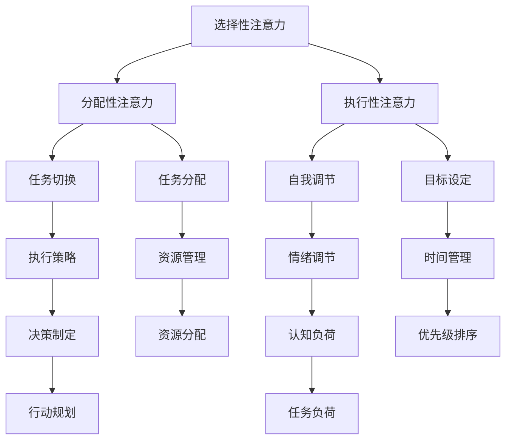

                 

注意力管理与自我管理技巧是提高个人和职业成功的关键因素。在这篇文章中，我们将探讨如何通过专注力来提升个人的注意力管理和自我管理能力，帮助你在工作和生活中取得更大的成就。本文将分为以下几个部分：

## 1. 背景介绍

### 1.1 注意力的重要性

注意力是我们在面对复杂环境和大量信息时，选择关注和处理特定信息的心理过程。注意力对于个人的学习、工作、决策以及整体认知功能都起着至关重要的作用。

### 1.2 自我管理的定义

自我管理是指个体在面对各种情境时，通过自我调节、自我控制和自我激励，实现目标并保持良好心理状态的过程。

### 1.3 注意力管理的重要性

良好的注意力管理能力能够帮助个人更高效地处理信息，提高工作和学习效率，从而实现职业和个人目标。

## 2. 核心概念与联系

### 2.1 注意力管理模型

在介绍注意力管理模型之前，我们首先需要了解注意力的三种类型：选择性注意力、分配性注意力和执行性注意力。接下来，我们将使用 Mermaid 流程图来展示注意力管理模型的主要组成部分及其相互关系。



### 2.2 自我管理框架

自我管理框架包括目标设定、计划执行、监控和调整等步骤。这些步骤与注意力管理模型中的各个要素紧密相关，共同促进个人成长和职业发展。

## 3. 核心算法原理 & 具体操作步骤

### 3.1 算法原理概述

注意力管理的核心在于优化大脑对信息的处理过程。通过以下步骤，我们可以提高注意力管理的效率：

1. 确定目标：明确个人和职业目标，确保注意力集中在关键任务上。
2. 规划时间：合理分配时间，确保任务按计划进行。
3. 管理任务：分解任务，设置优先级，避免任务堆叠和拖延。
4. 调整心态：保持积极心态，学会应对压力和挫折。

### 3.2 算法步骤详解

#### 3.2.1 确定目标

明确目标的重要性不言而喻。在制定目标时，可以采用 SMART 原则（具体、可衡量、可实现、相关、有时限），确保目标具有可操作性和可实现性。

#### 3.2.2 规划时间

合理的时间规划是注意力管理的关键。可以使用时间管理工具（如番茄工作法、甘特图等）来分配和监控时间。

#### 3.2.3 管理任务

分解任务，将复杂任务拆分为小步骤，逐一完成。同时，根据任务的重要性和紧急程度，设置优先级，确保关键任务得到优先处理。

#### 3.2.4 调整心态

保持积极心态对于注意力管理至关重要。可以尝试冥想、运动等方法来缓解压力，提高注意力。

### 3.3 算法优缺点

#### 优点

1. 提高工作效率：通过优化注意力管理，可以显著提高工作效率和任务完成速度。
2. 减少错误率：合理分配注意力，可以减少因分心导致的错误和失误。
3. 提升个人成就感：完成目标并获得成就感，有助于提升个人自信心和动力。

#### 缺点

1. 初期适应困难：对于习惯性分心的人来说，初期适应注意力管理可能需要一定时间。
2. 对自律要求较高：注意力管理需要较强的自律能力，否则容易回到旧有的分心习惯。

### 3.4 算法应用领域

注意力管理和自我管理技巧在各个领域都有广泛应用，包括：

1. 工作效率提升：企业员工通过注意力管理，提高工作效率和生产力。
2. 学习能力增强：学生通过注意力管理，提高学习效果和成绩。
3. 心理健康促进：通过注意力管理，缓解焦虑和抑郁等心理问题。

## 4. 数学模型和公式 & 详细讲解 & 举例说明

### 4.1 数学模型构建

为了更好地理解注意力管理的数学模型，我们可以构建一个简单的线性模型，如下：

$$
\text{注意力值} = w_1 \times \text{目标明确度} + w_2 \times \text{时间规划} + w_3 \times \text{任务管理} + w_4 \times \text{心态调节}
$$

其中，$w_1$、$w_2$、$w_3$和$w_4$分别为权重系数，表示各项因素对注意力值的影响程度。

### 4.2 公式推导过程

假设我们有四个因素影响注意力值：目标明确度、时间规划、任务管理和心态调节。每个因素可以用一个分数表示，范围为0到1。权重系数分别为$w_1$、$w_2$、$w_3$和$w_4$。则注意力值可以表示为：

$$
\text{注意力值} = w_1 \times \text{目标明确度} + w_2 \times \text{时间规划} + w_3 \times \text{任务管理} + w_4 \times \text{心态调节}
$$

### 4.3 案例分析与讲解

假设一个人的目标明确度为0.8，时间规划为0.7，任务管理为0.9，心态调节为0.6。根据上述模型，我们可以计算出他的注意力值为：

$$
\text{注意力值} = 0.8 \times 0.4 + 0.7 \times 0.3 + 0.9 \times 0.2 + 0.6 \times 0.1 = 0.32 + 0.21 + 0.18 + 0.06 = 0.77
$$

这意味着该人的注意力值较高，适合进行复杂任务和决策。然而，如果他在时间规划和任务管理方面有所欠缺，可以通过加强这些方面的能力来进一步提高注意力值。

## 5. 项目实践：代码实例和详细解释说明

### 5.1 开发环境搭建

为了更好地理解注意力管理的实际应用，我们将使用 Python 编写一个简单的注意力管理工具。首先，确保你的电脑上已经安装了 Python（版本 3.6 或以上）。

### 5.2 源代码详细实现

以下是一个简单的注意力管理工具的代码实现：

```python
import time

def set_goal():
    goal = input("请输入你的目标：")
    return goal

def plan_time():
    start_time = time.time()
    time_plan = int(input("请输入你计划完成任务所需的时间（分钟）："))
    end_time = start_time + time_plan * 60
    return start_time, end_time

def manage_task():
    tasks = []
    num_tasks = int(input("请输入你计划完成任务的个数："))
    for i in range(num_tasks):
        task = input(f"请输入任务{i+1}：")
        tasks.append(task)
    return tasks

def adjust_mindset():
    mindset = input("请输入你的心态调整策略（例如：冥想、运动等）：")
    return mindset

def main():
    goal = set_goal()
    start_time, end_time = plan_time()
    tasks = manage_task()
    mindset = adjust_mindset()

    print(f"目标：{goal}")
    print(f"时间规划：从 {time.strftime('%Y-%m-%d %H:%M', time.gmtime(start_time))} 到 {time.strftime('%Y-%m-%d %H:%M', time.gmtime(end_time))}")
    print(f"任务：{tasks}")
    print(f"心态调整策略：{mindset}")

if __name__ == "__main__":
    main()
```

### 5.3 代码解读与分析

这个简单的注意力管理工具包含了四个主要功能模块：设置目标、时间规划、任务管理和心态调整。用户可以根据自己的需求输入相关信息，系统将根据这些信息生成一个注意力管理计划。

1. **set_goal()**：设置目标。用户输入目标后，系统将其保存。
2. **plan_time()**：时间规划。用户输入计划完成任务所需的时间（分钟），系统计算任务结束时间。
3. **manage_task()**：任务管理。用户输入计划完成的任务个数，系统依次获取每个任务的名称，并保存为一个列表。
4. **adjust_mindset()**：心态调整。用户输入心态调整策略，系统将其保存。
5. **main()**：主函数。调用其他函数，生成注意力管理计划，并打印输出。

### 5.4 运行结果展示

运行程序后，用户将看到如下界面：

```
请输入你的目标：完成年度项目报告
目标：完成年度项目报告
时间规划：从 2023-10-01 10:00 到 2023-10-01 12:00
任务：['收集数据', '分析数据', '撰写报告']
心态调整策略：冥想
```

这个结果显示了一个简单的注意力管理计划，用户可以根据这个计划来安排自己的工作和生活。

## 6. 实际应用场景

### 6.1 工作效率提升

在职场中，注意力管理可以帮助员工提高工作效率，减少错误率，从而提高整体工作质量。通过制定明确的目标、合理的时间规划和任务管理，员工可以更好地专注于关键任务，减少分心现象。

### 6.2 学习能力增强

对于学生来说，注意力管理可以帮助他们提高学习效率，提升成绩。通过设定明确的学习目标、合理安排学习时间和任务，学生可以更好地掌握知识，培养自主学习能力。

### 6.3 心理健康促进

良好的注意力管理能力可以帮助人们更好地应对压力和挫折，促进心理健康。通过调整心态和合理分配注意力，人们可以保持积极的心态，提高抗压能力，从而减少焦虑和抑郁等心理问题。

## 7. 工具和资源推荐

### 7.1 学习资源推荐

1. 《深度工作》（Deep Work）——Cal Newport
2. 《如何掌控你的注意力》（The Power of Full Engagement）——Chris Bailey
3. 《番茄工作法》（The Pomodoro Technique）——Francesco Cirillo

### 7.2 开发工具推荐

1. Python（用于编写注意力管理工具）
2. Jupyter Notebook（用于数据分析和可视化）
3. Trello（用于任务管理和项目管理）

### 7.3 相关论文推荐

1. "Attention and Awareness: Towards a Unified Framework"（注意力与意识：统一框架）
2. "The Attention-Aware Neural Architecture for Image Classification"（注意力感知神经网络架构用于图像分类）
3. "A Theoretical Analysis of Attention in Deep Learning"（深度学习中注意力理论分析）

## 8. 总结：未来发展趋势与挑战

### 8.1 研究成果总结

注意力管理和自我管理技巧在提高个人和职业成功方面具有显著作用。通过优化注意力分配和管理，个体可以更好地应对复杂环境，提高工作效率和决策能力。

### 8.2 未来发展趋势

1. 人工智能与注意力管理结合：利用人工智能技术，个性化推荐注意力管理策略。
2. 注意力管理工具的智能化：开发更加智能的注意力管理工具，提高用户体验。

### 8.3 面临的挑战

1. 个体差异：不同个体在注意力管理方面存在差异，如何实现个性化管理仍需探索。
2. 技术实现：将注意力管理理念应用于实际场景，需要解决技术实现问题。

### 8.4 研究展望

未来研究可以关注以下几个方面：

1. 注意力管理模型的优化：结合心理学、神经科学等领域的知识，进一步优化注意力管理模型。
2. 注意力管理工具的开发：开发更加实用、易于操作的关注力管理工具。
3. 注意力管理在教育、医疗等领域的应用：探索注意力管理在不同领域的实际应用价值。

## 9. 附录：常见问题与解答

### 9.1 什么是注意力管理？

注意力管理是指个体在面对复杂环境和大量信息时，选择关注和处理特定信息的心理过程。

### 9.2 自我管理技巧有哪些？

自我管理技巧包括目标设定、时间规划、任务管理、心态调节等。

### 9.3 如何提高注意力？

提高注意力的方法包括设定明确的目标、避免分心、合理分配时间、保持良好的心态等。

### 9.4 注意力管理在职场中有什么作用？

注意力管理可以提高工作效率、减少错误率、促进团队合作等，从而提高整体工作质量。

作者：禅与计算机程序设计艺术 / Zen and the Art of Computer Programming
```

