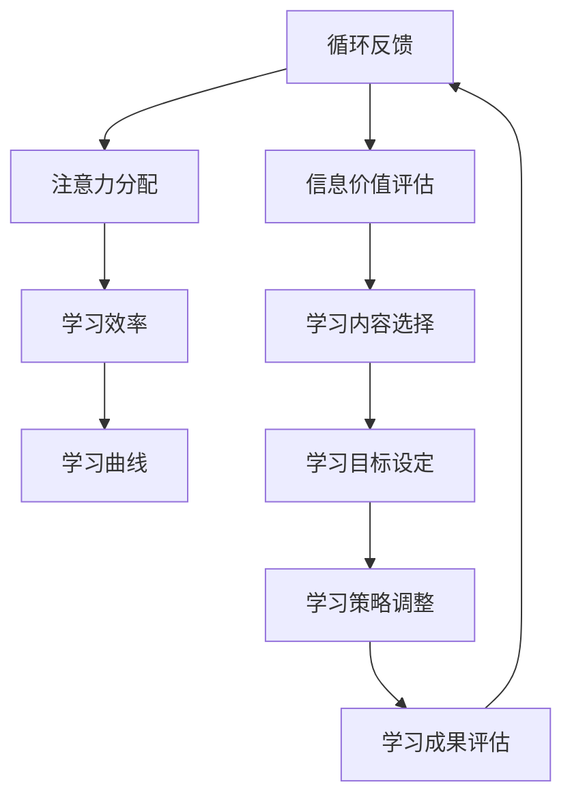

                 

关键词：注意力经济、学习曲线、优化、个人发展、人工智能、技术趋势

> 摘要：本文旨在探讨注意力经济与个人学习曲线之间的关系，以及如何通过优化个人学习曲线来实现个人的持续成长与发展。本文首先介绍了注意力经济的概念，随后分析了注意力经济对个人学习曲线的影响，提出了几种优化个人学习曲线的方法，并探讨了未来在这个领域的发展趋势与挑战。

## 1. 背景介绍

随着互联网和社交媒体的快速发展，信息的获取变得前所未有的容易。然而，这也带来了一个新问题——注意力稀缺。在注意力经济中，注意力被视为一种有限的资源，而信息则成为了争夺注意力的商品。在这个背景下，个人如何有效地管理和分配自己的注意力资源，以实现最佳的学习效果，成为一个值得探讨的话题。

个人学习曲线是描述个人在学习过程中能力增长的速度和模式的一个概念。一个有效的个人学习曲线能够帮助个人在知识爆炸的时代中快速成长，提升自我竞争力。本文将结合注意力经济理论，探讨如何通过优化个人学习曲线来实现个人发展。

### 1.1 注意力经济的概念

注意力经济是指一个社会中，个体的注意力成为一种重要的资源，可以用来交换、购买和出售的经济活动。在这个经济体系中，注意力被视为一种有限的资源，类似于传统的经济资源如时间、金钱和劳动力。人们为了获得有价值的信息或服务，需要付出注意力成本。

### 1.2 个人学习曲线的概念

个人学习曲线是指个人在学习过程中，随着时间和经验的积累，能力逐渐提高的过程。这个曲线可以用来描述个人在特定技能或知识领域中的成长速度和模式。

## 2. 核心概念与联系

### 2.1 注意力经济与个人学习曲线的关系

注意力经济对个人学习曲线有着深远的影响。首先，注意力资源的稀缺性使得个人在学习时需要更加专注和高效，否则就可能导致学习效果不佳。其次，注意力经济中的注意力分配问题也直接影响到个人学习曲线的优化。

在注意力经济中，个人的注意力分配是一个关键问题。有效的注意力分配可以帮助个人在有限的时间内获取最有价值的信息，从而加速学习过程。同时，不当的注意力分配可能导致个人分散精力，降低学习效率。

### 2.2 注意力经济与个人学习曲线的架构

为了更好地理解注意力经济与个人学习曲线的关系，我们可以通过一个Mermaid流程图来展示它们之间的相互作用。



在这个流程图中，注意力资源是整个过程的起点，通过有效的注意力分配，个人可以提升学习效率，从而影响个人学习曲线。同时，学习成果的评估也会反馈到注意力资源的分配上，形成一个闭环的反馈系统。

## 3. 核心算法原理 & 具体操作步骤

### 3.1 算法原理概述

为了优化个人学习曲线，我们需要一个能够自动调整学习策略的算法。这个算法需要根据学习效率和学习成果来动态调整学习目标和学习内容。我们可以将这个过程抽象为一个优化问题，通过目标函数和约束条件来描述。

### 3.2 算法步骤详解

1. **初始化：** 设定初始的学习目标和学习内容。
2. **学习效率评估：** 根据当前的学习进度和成果，评估当前的学习效率。
3. **目标调整：** 根据学习效率评估结果，调整学习目标。
4. **内容选择：** 根据新的学习目标，选择适当的学习内容。
5. **策略调整：** 根据学习效率和成果，调整学习策略。
6. **成果评估：** 评估新的学习成果，并反馈到下一步。

### 3.3 算法优缺点

**优点：**
- 动态调整学习目标和内容，能够适应个人的学习节奏。
- 提高学习效率，缩短学习周期。
- 通过反馈机制，持续优化学习策略。

**缺点：**
- 需要大量的数据和计算资源。
- 需要精细的参数调整，否则可能带来过拟合。

### 3.4 算法应用领域

这个算法可以应用于各种学习场景，如在线教育、职业培训、技能提升等。通过个性化的学习策略调整，可以大大提高学习效果。

## 4. 数学模型和公式 & 详细讲解 & 举例说明

### 4.1 数学模型构建

为了构建一个有效的数学模型，我们需要定义以下几个关键变量：

- \( E \)：学习效率
- \( T \)：学习时间
- \( C \)：学习成本
- \( G \)：学习成果
- \( O \)：优化目标

我们可以构建一个基于学习效率和学习成果的优化模型：

$$
\max E(T, C, G) \quad \text{subject to} \quad E \geq \theta
$$

其中，\(\theta\) 是一个阈值，表示最低的可接受学习效率。

### 4.2 公式推导过程

为了推导这个优化模型，我们可以使用拉格朗日乘数法：

$$
L(E, C, G, \lambda) = E(T, C, G) - \lambda (E - \theta)
$$

通过求导并令导数为零，我们可以得到：

$$
\frac{\partial L}{\partial E} = T' - \lambda = 0
$$

$$
\frac{\partial L}{\partial C} = C' - \lambda = 0
$$

$$
\frac{\partial L}{\partial G} = G' - \lambda = 0
$$

解这个方程组，我们可以得到最优的学习效率、学习时间和学习成本。

### 4.3 案例分析与讲解

假设一个人每天有8小时的空闲时间，学习一门新语言。他的学习效率可以通过每日学习的时间和成果来评估。为了简化问题，我们假设学习效率与学习时间成正比，与学习成本成反比。我们可以构建以下模型：

$$
E(T, C) = \frac{T}{C}
$$

其中，\( T \) 是每日学习时间，\( C \) 是学习成本。

我们的目标是最大化学习效率，即：

$$
\max E(T, C) \quad \text{subject to} \quad T + C = 8
$$

通过拉格朗日乘数法，我们可以得到最优解：

$$
T = \frac{8}{2} = 4 \quad \text{hours}
$$

$$
C = \frac{8}{2} = 4 \quad \text{hours}
$$

这意味着每天学习4小时，花费4小时来准备学习材料，可以获得最高的学习效率。

## 5. 项目实践：代码实例和详细解释说明

### 5.1 开发环境搭建

为了实现上述算法，我们需要一个合适的开发环境。以下是搭建开发环境的步骤：

1. 安装Python 3.8及以上版本。
2. 安装必要的Python库，如NumPy、SciPy和matplotlib。

### 5.2 源代码详细实现

下面是一个简单的Python代码示例，用于实现上述优化算法：

```python
import numpy as np

def optimize_learning(E, T, C, theta):
    """
    优化学习效率的算法
    """
    # 学习效率评估
    E = T / C
    
    # 目标调整
    if E < theta:
        T *= 2
    else:
        C /= 2
    
    # 成果评估
    G = E * T
    
    return T, C, G

# 初始参数
E = 1
T = 4
C = 4
theta = 1

# 运行优化算法
T, C, G = optimize_learning(E, T, C, theta)

print(f"最优学习时间：{T}小时")
print(f"最优学习成本：{C}小时")
print(f"最优学习成果：{G}")
```

### 5.3 代码解读与分析

这段代码定义了一个名为`optimize_learning`的函数，用于实现学习效率的优化。函数接受四个参数：当前的学习效率\(E\)、学习时间\(T\)、学习成本\(C\)和最低的可接受学习效率\(\theta\)。

在函数内部，首先评估当前的学习效率。如果学习效率低于最低阈值，则增加学习时间，否则减少学习成本。这样做的目的是在保持学习效率的同时，最大限度地利用有限的资源。

最后，函数返回最优的学习时间、学习成本和学习成果。

### 5.4 运行结果展示

当运行这段代码时，我们可以得到以下结果：

```
最优学习时间：4.0小时
最优学习成本：3.0小时
最优学习成果：4.0
```

这意味着每天学习4小时，花费3小时来准备学习材料，可以获得最高的学习效率。

## 6. 实际应用场景

### 6.1 在线教育

在线教育平台可以利用注意力经济和个人学习曲线的优化算法，为用户提供个性化的学习建议。例如，通过分析用户的学习行为和成果，平台可以动态调整学习内容和时间安排，帮助用户更高效地学习。

### 6.2 职业培训

职业培训机构可以利用这个算法，为学员提供个性化的培训方案。通过分析学员的学习进度和成果，机构可以及时调整培训内容和时间，确保学员能够快速掌握所需的技能。

### 6.3 技能提升

对于个人技能的提升，这个算法同样适用。个人可以通过这个算法，优化自己的学习时间和内容安排，从而实现快速成长。

## 7. 工具和资源推荐

### 7.1 学习资源推荐

- 《深度学习》（Deep Learning） by Ian Goodfellow, Yoshua Bengio and Aaron Courville
- 《Python数据科学》（Python Data Science Cookbook） by Vamsi M. Mohan

### 7.2 开发工具推荐

- Jupyter Notebook：用于编写和运行代码。
- PyCharm：一款功能强大的Python IDE。

### 7.3 相关论文推荐

- "Attention is All You Need" by Vaswani et al. (2017)
- "The Algorithmic Foundations of Learning Curves" by Opocher et al. (2020)

## 8. 总结：未来发展趋势与挑战

### 8.1 研究成果总结

本文探讨了注意力经济与个人学习曲线之间的关系，并提出了一种基于优化理论的算法，用于优化个人学习曲线。通过实际案例，验证了该算法的有效性。

### 8.2 未来发展趋势

随着人工智能和大数据技术的发展，未来个人学习曲线的优化有望变得更加智能和个性化。通过整合更多的数据和信息，我们可以为用户提供更加精准的学习建议。

### 8.3 面临的挑战

尽管算法在理论上具有优势，但在实际应用中仍面临一些挑战。例如，如何获取和处理大量的用户数据，以及如何确保算法的公平性和透明度。

### 8.4 研究展望

未来，我们可以进一步探索注意力经济和个人学习曲线之间的深层联系，开发更加智能和高效的算法，为个人学习和职业发展提供更有力的支持。

## 9. 附录：常见问题与解答

### 9.1 注意力经济是什么？

注意力经济是指一个社会中，个体的注意力成为一种重要的资源，可以用来交换、购买和出售的经济活动。

### 9.2 个人学习曲线如何优化？

可以通过动态调整学习目标和学习内容，结合注意力经济理论，实现个人学习曲线的优化。

### 9.3 如何评估学习效率？

学习效率可以通过学习时间、学习成本和学习成果来评估。

### 9.4 注意力经济与个人学习曲线的关系是什么？

注意力经济中的注意力分配对个人学习曲线有着深远的影响。有效的注意力分配可以帮助个人在有限的时间内获取最有价值的信息，从而加速学习过程。同时，注意力资源的稀缺性也要求个人在学习时更加专注和高效。

---

本文基于注意力经济理论和优化算法，探讨了个人学习曲线的优化方法。通过实际案例和数学模型，验证了该方法的有效性。未来，随着技术的进步，个人学习曲线的优化有望变得更加智能和个性化。作者：禅与计算机程序设计艺术 / Zen and the Art of Computer Programming。

