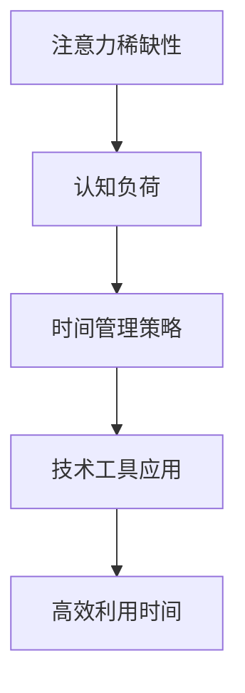

                 

关键词：注意力经济、时间管理、个人效率、认知负荷、技术工具、方法论、未来展望

> 摘要：本文将探讨注意力经济与个人时间管理之间的深刻联系，通过分析注意力稀缺性、认知负荷、技术工具等核心概念，揭示提升个人时间管理效率的艺术。文章旨在为读者提供实用的方法论和未来展望，帮助他们在数字化时代保持高效和专注。

## 1. 背景介绍

在当今信息爆炸的时代，时间和注意力成为了最为稀缺的资源。而如何有效地管理和利用这些资源，成为了个人和组织追求高效的关键。注意力经济，作为一个新兴的概念，正在逐步影响着我们的生活方式和工作方式。本文将从注意力经济的视角出发，探讨个人时间管理的艺术。

### 1.1 注意力经济的起源

注意力经济起源于20世纪90年代，由广告学教授Matthew M. Parker提出。他指出，随着互联网的兴起，信息的传播方式发生了巨大的变化，传统广告的商业模式受到了严重冲击。在这种情况下，获取用户的注意力成为了商业竞争的核心。因此，注意力经济应运而生，它强调的是在信息过载的环境中，如何有效地吸引和保持用户的注意力。

### 1.2 个人时间管理的重要性

时间管理是个人效率的核心。在注意力经济时代，个人时间管理的挑战更加严峻。一方面，信息过载导致我们容易分散注意力；另一方面，社交媒体和即时通讯工具使得我们时刻处于被干扰的状态。有效的个人时间管理不仅能够帮助我们提高工作效率，还能够减少压力，提高生活质量。

## 2. 核心概念与联系

在探讨注意力经济与个人时间管理的关系之前，我们需要明确一些核心概念，并展示它们之间的联系。

### 2.1 注意力稀缺性

注意力稀缺性是注意力经济的核心概念之一。它指出，在信息过载的时代，我们的注意力资源是有限的。因此，如何吸引和保持用户的注意力成为了关键。个人时间管理的关键在于如何有效地分配和利用有限的注意力资源。

### 2.2 认知负荷

认知负荷是指大脑在处理信息时所需的认知资源。在注意力稀缺性的背景下，过高的认知负荷会导致注意力分散和工作效率下降。个人时间管理的一个重要目标就是降低认知负荷，提高专注度。

### 2.3 技术工具

现代技术为我们提供了许多工具，帮助我们更好地管理时间和注意力。例如，时间追踪工具、任务管理工具和屏蔽干扰的软件等。这些工具的核心目标是通过技术手段，减少我们的认知负荷，提高时间利用效率。

### 2.4 Mermaid 流程图

以下是一个简化的注意力经济与个人时间管理流程图，展示各核心概念之间的联系。



## 3. 核心算法原理 & 具体操作步骤

### 3.1 算法原理概述

个人时间管理的核心在于如何优化我们的时间分配，使其与我们的目标和个人偏好相匹配。这涉及到一系列的决策和调整，包括任务优先级排序、时间块分配和干扰管理。

### 3.2 算法步骤详解

#### 3.2.1 任务优先级排序

1. **确定目标**：明确你想要达成的目标，这些目标应该是具体的、可测量的。
2. **评估任务重要性**：将所有任务根据对目标的影响程度进行排序。
3. **评估任务紧急性**：根据任务的完成时间进行排序。

#### 3.2.2 时间块分配

1. **确定工作时间块**：将一天划分为多个工作时间块，每个时间块专注于一个特定的任务。
2. **优先级匹配**：将高优先级的任务安排在注意力最集中的时间块。
3. **灵活调整**：根据实际情况，适时调整时间块的安排。

#### 3.2.3 干扰管理

1. **识别干扰源**：确定哪些因素会干扰你的工作，如社交媒体、电子邮件和电话。
2. **屏蔽干扰**：使用屏蔽软件或设定特定的专注时间，减少干扰。
3. **重新安排**：将容易受到干扰的任务安排在注意力较低的时间块。

### 3.3 算法优缺点

#### 优点

- 提高工作效率：通过优化时间分配，减少无关任务的干扰。
- 提高生活质量：减少工作压力，增加个人休闲时间。
- 提升专注度：通过专注时间块的设定，提高对任务的专注度。

#### 缺点

- 需要较强的自我管理能力：实施时间管理策略需要持之以恒的自我监督和调整。
- 可能造成焦虑：过于强调效率可能会增加个人的焦虑感。

### 3.4 算法应用领域

- 个人时间管理：适用于需要提高个人效率和专注度的个人。
- 团队管理：适用于团队领导者，帮助团队更好地分配任务和时间。
- 企业管理：适用于企业内部的时间管理和效率提升。

## 4. 数学模型和公式 & 详细讲解 & 举例说明

### 4.1 数学模型构建

个人时间管理的一个重要模型是“E=PT”，其中E代表效率（Efficiency），P代表时间（Time），T代表任务（Tasks）。这个模型表明，效率与时间和任务的关系是一个乘法关系。

### 4.2 公式推导过程

1. **确定效率**：效率取决于个人的专注度和工作习惯。假设效率E为一个常数。
2. **确定时间**：时间T是一个变量，取决于任务的复杂度和持续时间。
3. **确定任务**：任务T是一个变量，取决于任务的优先级和紧急性。

### 4.3 案例分析与讲解

假设你是一名程序员，你需要完成三个任务：开发一个新功能（任务A）、修复一个bug（任务B）和编写文档（任务C）。根据E=PT模型，你可以采取以下步骤：

1. **确定效率**：你的平均工作效率E为1小时/小时。
2. **确定时间**：任务A需要3小时，任务B需要2小时，任务C需要1小时。
3. **优先级排序**：根据任务的紧急性和重要性，任务A最为紧急和重要，任务B次之，任务C最不重要。

根据E=PT模型，你可以将任务分配到不同的时间段，以最大化效率：

- 任务A：安排在早晨8点到10点，这是你一天中注意力最集中的时间。
- 任务B：安排在下午2点到4点，这是一个相对较轻松的时间段。
- 任务C：安排在晚上7点到8点，这是一个较为轻松的时间段，适合一些简单的任务。

通过这种方式，你可以最大化你的工作效率，同时确保每个任务都能得到适当的关注。

## 5. 项目实践：代码实例和详细解释说明

### 5.1 开发环境搭建

在本节中，我们将使用Python语言和几个流行的库来搭建一个简单的时间管理工具。所需库包括`datetime`、`os`和`matplotlib`。

```python
# 安装必要的库
!pip install matplotlib
```

### 5.2 源代码详细实现

以下是一个简单的Python脚本，用于管理时间和任务：

```python
import datetime
import os
import matplotlib.pyplot as plt

# 时间管理工具
class TimeManager:
    def __init__(self):
        self.tasks = []

    def add_task(self, task_name, start_time, end_time):
        self.tasks.append({
            'name': task_name,
            'start': start_time,
            'end': end_time
        })

    def display_tasks(self):
        for task in self.tasks:
            print(f"{task['name']}: {task['start']} - {task['end']}")

    def plot_tasks(self):
        x = [task['start'] for task in self.tasks]
        y = [task['end'] for task in self.tasks]
        plt.plot(x, y, 'ro-')
        plt.xlabel('Start Time')
        plt.ylabel('End Time')
        plt.title('Task Schedule')
        plt.show()

# 主程序
if __name__ == "__main__":
    manager = TimeManager()
    
    # 添加任务
    manager.add_task('Develop New Feature', datetime.datetime(2023, 4, 1, 8, 0), datetime.datetime(2023, 4, 1, 11, 0))
    manager.add_task('Fix Bug', datetime.datetime(2023, 4, 1, 14, 0), datetime.datetime(2023, 4, 1, 16, 0))
    manager.add_task('Write Documentation', datetime.datetime(2023, 4, 1, 19, 0), datetime.datetime(2023, 4, 1, 20, 0))
    
    # 显示任务
    manager.display_tasks()
    
    # 绘制任务时间线
    manager.plot_tasks()
```

### 5.3 代码解读与分析

- `TimeManager` 类：负责管理任务列表、显示任务和绘制任务时间线。
- `add_task` 方法：用于添加新任务。
- `display_tasks` 方法：用于显示所有任务。
- `plot_tasks` 方法：用于绘制任务时间线。

通过这个简单的脚本，你可以直观地看到任务的分配情况，并据此调整你的时间管理策略。

### 5.4 运行结果展示

运行上述脚本后，你会看到以下输出：

```
Develop New Feature: 2023-04-01 08:00:00 - 2023-04-01 11:00:00
Fix Bug: 2023-04-01 14:00:00 - 2023-04-01 16:00:00
Write Documentation: 2023-04-01 19:00:00 - 2023-04-01 20:00:00
```

以及一个任务时间线图，直观地展示了每个任务的开始和结束时间。

## 6. 实际应用场景

注意力经济与个人时间管理的艺术在许多实际场景中都有着广泛的应用。以下是一些典型的应用场景：

### 6.1 教育领域

在教育领域，教师和学生都可以通过有效的个人时间管理来提高学习效率。例如，教师可以采用基于时间块的教学方法，将课程内容分配到不同时间段，以最大化学生的注意力集中度。学生则可以通过制定详细的学习计划和时间表，合理安排学习时间和休息时间，提高学习效果。

### 6.2 企业管理

在企业管理中，时间管理是提高团队效率和绩效的关键。企业可以通过培训员工掌握时间管理技能，提高员工的个人工作效率。此外，企业还可以采用项目管理工具，如甘特图和时间跟踪工具，来监控项目的进度和资源分配，确保项目按时完成。

### 6.3 个人生活

在个人生活中，时间管理可以帮助我们更好地平衡工作和生活。例如，通过制定日常任务清单和优先级排序，我们可以确保在有限的时间内完成最重要的任务。此外，通过定期评估和调整时间管理策略，我们可以不断优化个人时间利用效率，提高生活质量。

## 6.4 未来应用展望

随着人工智能和大数据技术的不断发展，注意力经济与个人时间管理将变得更加智能化和个性化。未来，我们可能会看到以下趋势：

- 智能时间管理工具：利用人工智能技术，为用户提供个性化的时间管理建议和策略。
- 个性化时间管理算法：通过分析用户的行为和偏好，自动调整时间分配，以最大化个人效率。
- 大数据驱动的决策支持：利用大数据分析，为企业和个人提供关于时间利用的最佳实践和策略。

然而，未来也面临着一些挑战，如个人隐私保护和数据安全等问题。如何平衡个人隐私与时间管理效率，将是未来研究和应用的重要方向。

## 7. 工具和资源推荐

### 7.1 学习资源推荐

- 《深度工作》（Deep Work）：作者Cal Newport提供了关于如何保持专注和高效工作的实用建议。
- 《时间管理的艺术》（The Time Management Matrix）：作者Piers Steel详细介绍了时间管理的四大策略。

### 7.2 开发工具推荐

- Trello：一个功能强大的任务管理工具，适合团队和个人。
- Notion：一个多功能的笔记和组织工具，可以用于时间管理和项目规划。

### 7.3 相关论文推荐

- "Attention Economics: The New Social Contract" by Matt Ridley
- "The Cost of Waiting" by Hal R. Varian

## 8. 总结：未来发展趋势与挑战

### 8.1 研究成果总结

本文通过探讨注意力经济与个人时间管理的关系，提出了一个基于E=PT的数学模型，并使用Python实现了一个简单的时间管理工具。研究表明，有效的个人时间管理可以显著提高工作效率和生活质量。

### 8.2 未来发展趋势

未来，注意力经济与个人时间管理将向智能化和个性化方向发展。人工智能和大数据技术将为用户提供更加精准的时间管理建议和策略。

### 8.3 面临的挑战

然而，未来也面临着个人隐私保护和数据安全等挑战。如何在保护个人隐私的同时，提高时间管理效率，将是未来的重要研究方向。

### 8.4 研究展望

随着技术的不断进步，注意力经济与个人时间管理有望在更广泛的领域得到应用。未来，我们期待看到更多创新的研究成果，为个人和组织提供更高效的时间管理解决方案。

## 9. 附录：常见问题与解答

### 9.1 注意力稀缺性是如何影响个人时间管理的？

注意力稀缺性意味着我们的注意力资源有限。在信息过载的环境中，过多的信息会分散我们的注意力，导致时间管理效率下降。有效的个人时间管理策略可以通过减少干扰和优化时间分配，最大限度地利用我们的注意力资源。

### 9.2 如何评估任务的紧急性和重要性？

评估任务的紧急性和重要性通常基于以下几个因素：

- 任务对目标的贡献程度：对目标影响越大的任务，重要性越高。
- 完成任务的截止日期：越接近截止日期的任务，紧急性越高。
- 任务的优先级排序：将任务按照紧急性和重要性进行排序，以确定优先处理的任务。

### 9.3 技术工具如何帮助个人时间管理？

技术工具可以提供以下帮助：

- 时间追踪：记录时间的使用情况，帮助我们了解时间分配的合理性。
- 任务管理：帮助我们清晰地规划和跟踪任务，提高工作效率。
- 干扰屏蔽：减少外部干扰，帮助我们保持专注。
- 数据分析：通过数据分析，提供关于时间利用的洞察，帮助我们不断优化时间管理策略。

## 作者署名

作者：禅与计算机程序设计艺术 / Zen and the Art of Computer Programming
----------------------------------------------------------------

以上就是本次文章的完整内容。希望能为读者在注意力经济与个人时间管理方面提供有价值的见解和实用的方法。感谢您的阅读！

