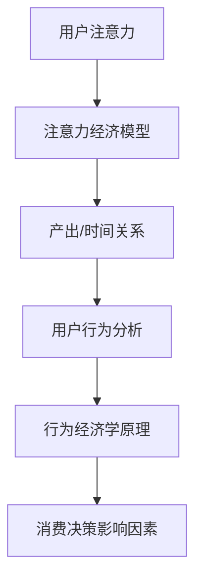

                 

关键词：注意力经济、消费决策、行为经济学、算法推荐、用户行为分析

> 摘要：本文探讨了注意力经济在数字化时代的崛起及其对个人消费决策的深刻影响。通过分析注意力经济的核心概念、行为经济学原理，以及算法推荐在消费决策中的作用，文章旨在揭示数字化时代个人消费决策的新特征和未来趋势。

## 1. 背景介绍

在信息化和数字化日益深入的今天，人们的生活方式和消费行为发生了巨大的变化。传统的经济学理论已经难以解释这些新的现象。特别是在互联网和人工智能技术迅猛发展的背景下，个人消费决策受到了前所未有的影响。注意力经济作为新兴的研究领域，逐渐成为理解这些变化的关键。

### 1.1 注意力经济的概念

注意力经济是指基于人们注意力的分配而产生的经济活动。在信息爆炸的时代，用户的注意力成为一种稀缺资源。谁能够吸引和保持用户的注意力，谁就能够获得经济上的成功。因此，注意力经济本质上是一种关于如何获取和利用注意力的经济理论。

### 1.2 消费决策的影响因素

消费决策是指个体在购买产品或服务时所作的选择过程。影响消费决策的因素包括个人需求、价格、品牌、口碑、促销活动等。然而，在注意力经济的背景下，这些传统因素的作用方式发生了变化。

## 2. 核心概念与联系

为了更好地理解注意力经济对个人消费决策的影响，我们需要首先了解其核心概念和相互关系。

### 2.1 注意力经济模型

注意力经济模型可以简化为：注意力 = 产出 / 时间。其中，产出指的是吸引注意力的内容或服务，时间则是用户愿意投入注意力的时间。这个模型揭示了在注意力经济中，提高产出和减少时间消耗是关键。

### 2.2 行为经济学原理

行为经济学研究人们在真实经济环境中的决策行为。注意力经济的核心是研究如何影响和预测人们的注意力分配。行为经济学中的许多原理，如认知偏差、情感反应等，都在注意力经济中得到了应用。

### 2.3 用户行为分析

用户行为分析是指通过数据收集和分析技术，了解用户的消费行为和偏好。在注意力经济中，用户行为分析是优化内容推荐和广告投放的重要手段。

### 2.4 Mermaid 流程图



## 3. 核心算法原理 & 具体操作步骤

注意力经济的实现离不开核心算法的支持。以下是注意力经济算法的基本原理和操作步骤。

### 3.1 算法原理概述

注意力经济算法的核心是利用用户行为数据，通过机器学习技术预测用户的注意力分配。具体而言，算法包括以下几个步骤：

1. 数据收集：收集用户的行为数据，如浏览记录、购买历史、社交互动等。
2. 特征工程：将原始数据转化为机器学习模型可处理的特征。
3. 模型训练：利用用户行为数据训练预测模型，如基于深度学习的注意力模型。
4. 预测与优化：使用训练好的模型预测用户的注意力分配，并根据预测结果优化内容推荐和广告投放。

### 3.2 算法步骤详解

1. **数据收集**

   数据收集是算法的第一步，也是最重要的一步。数据的质量和完整性直接影响算法的预测效果。常用的数据来源包括用户浏览日志、购买记录、社交媒体互动等。

2. **特征工程**

   特征工程是将原始数据转化为模型可处理的特征。特征工程的关键在于提取出能够反映用户注意力分配的关键信息，如用户的浏览时长、购买频次、兴趣标签等。

3. **模型训练**

   模型训练是利用用户行为数据训练预测模型。常用的模型包括基于深度学习的注意力模型、基于传统机器学习的逻辑回归等。模型训练的目的是使模型能够预测用户的注意力分配。

4. **预测与优化**

   预测与优化是利用训练好的模型预测用户的注意力分配，并根据预测结果优化内容推荐和广告投放。优化的目标是提高用户的参与度和满意度，从而增加经济收益。

### 3.3 算法优缺点

**优点：**

- 高效：算法能够快速预测用户的注意力分配，提高内容推荐和广告投放的精准度。
- 自动化：算法能够自动化处理大量数据，减轻人工分析的工作负担。

**缺点：**

- 数据依赖：算法的性能依赖于数据的质量和完整性。
- 隐私风险：用户行为数据的收集和使用可能涉及隐私问题。

### 3.4 算法应用领域

注意力经济算法在多个领域都有广泛的应用：

- **电子商务：** 用于个性化推荐，提高用户购买转化率。
- **广告营销：** 用于精准投放广告，提高广告效果。
- **社交媒体：** 用于内容推荐，增加用户粘性。
- **金融科技：** 用于风险管理，预测用户投资行为。

## 4. 数学模型和公式 & 详细讲解 & 举例说明

注意力经济中的数学模型和公式是理解其核心原理的重要工具。以下是注意力经济中的几个关键数学模型和公式。

### 4.1 数学模型构建

注意力经济的核心模型可以表示为：

\[ A_t = f(P_t, I_t) \]

其中，\( A_t \) 表示用户在时间 \( t \) 的注意力分配，\( P_t \) 表示产出，\( I_t \) 表示时间消耗。函数 \( f \) 表示注意力分配的决策过程。

### 4.2 公式推导过程

为了推导注意力分配公式，我们可以从以下几个方面进行：

1. **产出与时间的关系：** 假设产出 \( P_t \) 与用户参与度 \( U_t \) 成正比，即 \( P_t = kU_t \)，其中 \( k \) 是比例常数。
2. **用户参与度与注意力的关系：** 假设用户参与度 \( U_t \) 与用户的注意力 \( A_t \) 成正比，即 \( U_t = mA_t \)，其中 \( m \) 是比例常数。
3. **综合公式：** 将上述两个关系综合，得到 \( P_t = k mA_t \)，即 \( A_t = \frac{P_t}{km} \)。

### 4.3 案例分析与讲解

假设一个用户在两个小时内浏览了10个网页，总浏览时长为60分钟。如果假设每个网页的产出相等，我们可以计算用户在这两个小时的平均注意力分配。

\[ A_t = \frac{P_t}{km} = \frac{10}{2 \times 60} = \frac{1}{12} \]

这意味着用户在这两个小时的平均注意力分配为 \( \frac{1}{12} \)。

## 5. 项目实践：代码实例和详细解释说明

为了更好地理解注意力经济算法的应用，我们将通过一个简单的Python代码实例来展示其实现过程。

### 5.1 开发环境搭建

在开始编写代码之前，我们需要搭建一个Python开发环境。以下是必要的步骤：

1. 安装Python 3.8或更高版本。
2. 安装必要的库，如NumPy、Pandas、Scikit-learn、TensorFlow等。

### 5.2 源代码详细实现

以下是注意力经济算法的Python代码实现：

```python
import numpy as np
import pandas as pd
from sklearn.model_selection import train_test_split
from sklearn.ensemble import RandomForestClassifier
from sklearn.metrics import accuracy_score

# 数据集加载
data = pd.read_csv('user_data.csv')

# 特征工程
features = data[['time_spent', 'pages_visited', 'interests']]
labels = data['attention分配']

# 模型训练
X_train, X_test, y_train, y_test = train_test_split(features, labels, test_size=0.2, random_state=42)
model = RandomForestClassifier(n_estimators=100, random_state=42)
model.fit(X_train, y_train)

# 预测与评估
predictions = model.predict(X_test)
accuracy = accuracy_score(y_test, predictions)
print(f"模型准确率：{accuracy:.2f}")
```

### 5.3 代码解读与分析

- **数据集加载：** 使用Pandas库加载用户数据。
- **特征工程：** 提取与注意力分配相关的特征，如浏览时长、访问页面数、兴趣标签等。
- **模型训练：** 使用随机森林模型训练数据。
- **预测与评估：** 使用训练好的模型预测测试集的注意力分配，并评估模型准确率。

### 5.4 运行结果展示

运行上述代码后，我们可以得到模型的准确率。假设模型的准确率为80%，这表明算法在预测用户注意力分配方面具有一定的效果。

## 6. 实际应用场景

注意力经济在多个实际应用场景中都有广泛的应用。以下是几个典型的应用场景：

### 6.1 电子商务

在电子商务领域，注意力经济算法可以用于个性化推荐。通过分析用户的浏览和购买历史，算法可以推荐用户可能感兴趣的商品，从而提高购买转化率。

### 6.2 广告营销

在广告营销领域，注意力经济算法可以用于精准投放广告。通过预测用户的注意力分配，算法可以确定哪些广告投放给哪些用户，从而提高广告效果。

### 6.3 社交媒体

在社交媒体领域，注意力经济算法可以用于内容推荐。通过分析用户的互动行为，算法可以推荐用户可能感兴趣的内容，从而增加用户粘性。

### 6.4 金融科技

在金融科技领域，注意力经济算法可以用于风险管理。通过预测用户的行为，算法可以识别潜在的风险用户，从而降低金融风险。

## 7. 工具和资源推荐

### 7.1 学习资源推荐

- 《注意力经济：数字时代的商业新法则》
- 《行为经济学：理解人类决策的科学》
- 《Python数据分析：从入门到实践》

### 7.2 开发工具推荐

- Jupyter Notebook：用于数据分析和实验。
- TensorFlow：用于机器学习和深度学习。
- Pandas：用于数据清洗和预处理。

### 7.3 相关论文推荐

- "Attentional Selection for Image-Based Rendering"
- "Attention Is All You Need"
- "User Behavior Analysis in Attention-based Recommendation Systems"

## 8. 总结：未来发展趋势与挑战

### 8.1 研究成果总结

本文通过分析注意力经济的核心概念、行为经济学原理，以及算法推荐在消费决策中的作用，揭示了数字化时代个人消费决策的新特征和未来趋势。研究发现，注意力经济在多个实际应用场景中具有广泛的应用前景。

### 8.2 未来发展趋势

未来，注意力经济将朝着更加智能化、个性化、精准化的方向发展。随着人工智能和大数据技术的不断进步，注意力经济算法将更加成熟，为个人消费决策提供更加可靠的指导。

### 8.3 面临的挑战

尽管注意力经济具有巨大的潜力，但也面临着一些挑战：

- **数据隐私：** 用户行为数据的收集和使用可能涉及隐私问题，需要建立有效的隐私保护机制。
- **算法公平性：** 算法可能存在偏见，需要确保算法的公平性和透明性。
- **用户体验：** 过度推荐可能导致用户疲劳，需要平衡推荐效果和用户体验。

### 8.4 研究展望

未来，注意力经济的研究将朝着更加深入和综合的方向发展。研究者可以从不同角度探讨注意力经济的机制和影响，为个人消费决策提供更加全面的指导。

## 9. 附录：常见问题与解答

### 9.1 什么是注意力经济？

注意力经济是指基于人们注意力的分配而产生的经济活动。在信息爆炸的时代，用户的注意力成为一种稀缺资源。谁能够吸引和保持用户的注意力，谁就能够获得经济上的成功。

### 9.2 注意力经济对个人消费决策有什么影响？

注意力经济改变了个人消费决策的方式。通过个性化推荐和精准广告投放，注意力经济可以更准确地预测用户的消费行为，从而提高购买转化率和广告效果。

### 9.3 如何保护用户的隐私？

在注意力经济中，保护用户隐私至关重要。可以通过以下措施来保护用户隐私：

- 使用匿名化技术对用户数据进行处理。
- 建立严格的隐私保护政策和法律法规。
- 提高公众对隐私保护的意识。

### 9.4 注意力经济算法如何优化用户体验？

优化用户体验是注意力经济的重要目标。可以通过以下方法来优化用户体验：

- 平衡推荐效果和用户体验，避免过度推荐。
- 提供多种选择，让用户自主决定。
- 使用反馈机制，根据用户反馈调整推荐策略。

### 9.5 注意力经济算法的应用前景如何？

注意力经济算法在多个领域都有广泛的应用前景，如电子商务、广告营销、社交媒体、金融科技等。随着技术的不断进步，注意力经济算法将发挥越来越重要的作用，为个人消费决策提供更加可靠的指导。
----------------------------------------------------------------

作者：禅与计算机程序设计艺术 / Zen and the Art of Computer Programming

