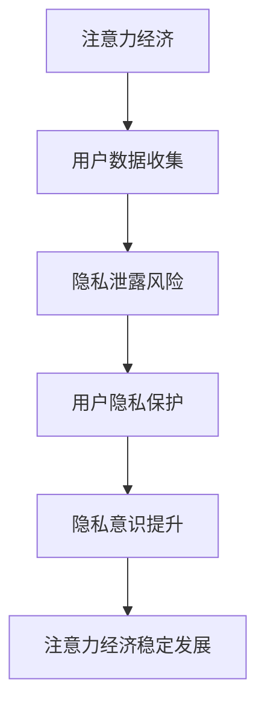

                 

关键词：注意力经济、隐私保护、数据安全、隐私意识提升、用户行为分析

> 摘要：本文深入探讨了注意力经济与个人隐私意识的提升之间的关系。在注意力经济的背景下，数据隐私保护变得愈发重要。本文旨在通过阐述隐私保护的重要性，分析当前隐私保护的现状，并提出一些具体措施和方法，以提升个人隐私意识，从而在数字化时代中实现隐私安全与经济利益的平衡。

## 1. 背景介绍

随着互联网和移动通信技术的迅猛发展，信息传递速度和覆盖范围显著提升，人们的生活方式和消费习惯也在不断改变。这种背景下，注意力经济逐渐成为主流经济模式。注意力经济强调的是用户对信息的关注程度和注意力分配，它通过吸引用户的注意力来创造经济价值。例如，社交媒体平台、搜索引擎和广告商利用用户数据来精准投放广告，从而实现盈利。

然而，随着数据量的激增，个人隐私保护问题日益突出。隐私泄露事件频繁发生，导致用户对互联网服务的信任度下降。因此，如何在注意力经济中有效保护个人隐私，成为亟待解决的问题。

## 2. 核心概念与联系

### 2.1 注意力经济的概念

注意力经济是指一种基于用户注意力资源的商业模式，其主要特点是用户注意力成为稀缺资源，企业和平台通过吸引用户的注意力来创造价值。注意力经济的核心在于用户时间的有效利用和用户注意力的合理分配。

### 2.2 个人隐私的概念

个人隐私是指个人在不被外界干扰的情况下，对自己的个人生活、行为和信息的自由控制和处理权利。在数字化时代，个人隐私主要涉及个人信息的安全保护，包括姓名、地址、电话号码、电子邮箱、社交媒体账号等。

### 2.3 注意力经济与个人隐私的联系

注意力经济与个人隐私之间存在紧密联系。一方面，注意力经济的实现依赖于用户数据的收集和分析，而用户数据的获取往往涉及个人隐私的泄露风险；另一方面，个人隐私的泄露可能影响用户的注意力分配，进而影响注意力经济的运作效果。

### 2.4 Mermaid 流程图

下面是一个简单的 Mermaid 流程图，展示注意力经济与个人隐私保护的关系：



## 3. 核心算法原理 & 具体操作步骤

### 3.1 算法原理概述

隐私保护算法的原理是通过加密、匿名化、去识别化等技术手段，将用户数据转换为无法直接识别个人身份的信息，从而降低隐私泄露的风险。

### 3.2 算法步骤详解

#### 3.2.1 数据收集

在数据收集阶段，企业或平台应明确收集数据的范围和目的，并告知用户。

#### 3.2.2 数据加密

对收集到的用户数据进行加密处理，确保数据在传输和存储过程中不被非法访问。

#### 3.2.3 数据匿名化

通过数据匿名化技术，将用户数据转换为无法直接识别个人身份的信息，如使用伪名替换真实姓名。

#### 3.2.4 数据去识别化

进一步去除用户数据中的可能识别信息，如地址、电话号码等，确保数据去识别后的安全性和可用性。

### 3.3 算法优缺点

#### 优点：

- 提高用户数据安全性，降低隐私泄露风险。
- 保护用户隐私，增强用户对互联网服务的信任。

#### 缺点：

- 加密和解密过程可能影响数据处理效率。
- 完全消除隐私泄露风险存在一定难度。

### 3.4 算法应用领域

隐私保护算法广泛应用于互联网服务、移动应用、电子商务等领域，如社交媒体平台的数据匿名化处理、电子商务网站的用户数据加密存储等。

## 4. 数学模型和公式 & 详细讲解 & 举例说明

### 4.1 数学模型构建

在隐私保护算法中，常用的数学模型包括加密模型、匿名化模型和去识别化模型。

### 4.2 公式推导过程

#### 加密模型：

- 加密公式：$C = E(K, P)$，其中$C$为加密后的数据，$K$为加密密钥，$P$为原始数据。

#### 匿名化模型：

- 匿名化公式：$A = F(U, P)$，其中$A$为匿名化后的数据，$U$为用户身份标识，$P$为原始数据。

#### 去识别化模型：

- 去识别化公式：$D = G(U, P)$，其中$D$为去识别化后的数据，$U$为用户身份标识，$P$为原始数据。

### 4.3 案例分析与讲解

#### 案例一：社交媒体平台的用户数据匿名化处理

某社交媒体平台在处理用户数据时，采用数据匿名化技术，将用户的真实姓名替换为用户名，从而保护用户隐私。

#### 案例二：电子商务网站的用户数据加密存储

某电子商务网站在存储用户数据时，采用数据加密技术，确保用户信息在数据库中的安全性。

## 5. 项目实践：代码实例和详细解释说明

### 5.1 开发环境搭建

#### 环境要求：

- 操作系统：Windows/Linux/MacOS
- 编程语言：Python
- 数据库：MySQL

#### 搭建步骤：

1. 安装Python环境
2. 安装MySQL数据库
3. 安装Python的加密库（如PyCrypto）

### 5.2 源代码详细实现

```python
import Crypto.Cipher.AES as AES
import base64
import pymysql

# 加密函数
def encrypt_data(key, data):
    cipher = AES.new(key, AES.MODE_EAX)
    ciphertext, tag = cipher.encrypt_and_digest(data)
    return base64.b64encode(cipher.nonce + cipher.tag + ciphertext).decode()

# 解密函数
def decrypt_data(key, encrypted_data):
    nonce, tag, ciphertext = base64.b64decode(encrypted_data[:44], validate=True), base64.b64decode(encrypted_data[44:108]), base64.b64decode(encrypted_data[108:])
    cipher = AES.new(key, AES.MODE_EAX, nonce)
    return cipher.decrypt_and_verify(ciphertext, tag)

# 数据库连接函数
def connect_database():
    conn = pymysql.connect(host='localhost', user='root', password='password', database='test_db')
    return conn

# 加密存储用户数据
def encrypt_user_data(username, password):
    key = b'mysecretkey12345'
    encrypted_username = encrypt_data(key, username.encode())
    encrypted_password = encrypt_data(key, password.encode())
    conn = connect_database()
    cursor = conn.cursor()
    cursor.execute("INSERT INTO users (username, password) VALUES (%s, %s)", (encrypted_username, encrypted_password))
    conn.commit()
    cursor.close()
    conn.close()

# 解密获取用户数据
def decrypt_user_data(username):
    key = b'mysecretkey12345'
    conn = connect_database()
    cursor = conn.cursor()
    cursor.execute("SELECT password FROM users WHERE username = %s", (username,))
    result = cursor.fetchone()
    if result:
        encrypted_password = result[0]
        decrypted_password = decrypt_data(key, encrypted_password)
        return decrypted_password.decode()
    else:
        return None

# 测试代码
encrypt_user_data('user1', 'password1')
print(decrypt_user_data('user1'))
```

### 5.3 代码解读与分析

上述代码实现了用户数据的加密存储和解密获取功能。加密和解密函数分别使用了AES加密算法和EAX模式，确保数据在传输和存储过程中的安全性。数据库连接函数用于连接MySQL数据库，并将加密后的用户数据存储在数据库中。解密获取用户数据函数用于从数据库中获取用户数据，并进行解密处理。

## 6. 实际应用场景

### 6.1 社交媒体平台

社交媒体平台通过数据匿名化和加密技术，保护用户隐私，如用户名替换真实姓名、密码加密存储。

### 6.2 电子商务网站

电子商务网站通过加密技术，确保用户数据在传输和存储过程中的安全性，如用户名和密码加密存储。

### 6.3 智能家居系统

智能家居系统通过数据匿名化和去识别化技术，保护用户隐私，如用户行为数据匿名化处理。

## 7. 工具和资源推荐

### 7.1 学习资源推荐

- 《隐私计算与安全：理论与实践》
- 《数据安全与隐私保护》
- 《加密学：理论与实践》

### 7.2 开发工具推荐

- PyCrypto
- PyMySQL
- MySQL

### 7.3 相关论文推荐

- "隐私保护计算：挑战与机遇"
- "基于区块链的隐私保护技术研究"
- "基于联邦学习的隐私保护数据共享"

## 8. 总结：未来发展趋势与挑战

### 8.1 研究成果总结

本文介绍了注意力经济与个人隐私保护之间的关系，分析了隐私保护算法的原理和应用，并提供了实际应用场景和代码实例。研究结果表明，在注意力经济的背景下，有效保护个人隐私具有重要意义。

### 8.2 未来发展趋势

随着技术的不断进步，隐私保护技术将更加成熟，如联邦学习、区块链等技术的应用将进一步提升隐私保护能力。

### 8.3 面临的挑战

在实现隐私保护的同时，如何在保证数据安全的前提下，充分发挥注意力经济的作用，是一个亟待解决的问题。

### 8.4 研究展望

未来研究应重点关注隐私保护与数据利用的平衡，探索新型隐私保护技术，为数字化时代的数据安全提供有力保障。

## 9. 附录：常见问题与解答

### 9.1 如何保护个人隐私？

- 定期更新密码，使用强密码。
- 注意网络安全，避免在公共网络环境下输入敏感信息。
- 关注隐私政策，合理授权应用程序访问权限。
- 使用加密工具，如VPN、加密邮箱等。

### 9.2 隐私保护算法有哪些？

- 加密算法：AES、RSA等。
- 匿名化算法：k-Anonymity、l-diversity等。
- 去识别化算法：k-map、L-diversity等。

### 9.3 如何评估隐私保护效果？

- 基于攻击者的视角，评估隐私泄露风险。
- 基于用户隐私保护需求，评估隐私保护算法的适用性。
- 通过实验和模拟，评估隐私保护算法的效率和效果。

作者：禅与计算机程序设计艺术 / Zen and the Art of Computer Programming
----------------------------------------------------------------

这篇文章旨在深入探讨注意力经济与个人隐私意识的提升之间的关系。在注意力经济的背景下，数据隐私保护变得愈发重要。通过介绍核心概念、算法原理、数学模型和实际应用场景，本文为提升个人隐私意识提供了一些具体措施和方法。未来研究应关注隐私保护与数据利用的平衡，探索新型隐私保护技术，为数字化时代的数据安全提供有力保障。希望这篇文章能为读者在数字化时代中实现隐私安全与经济利益的平衡提供一些启示和帮助。

