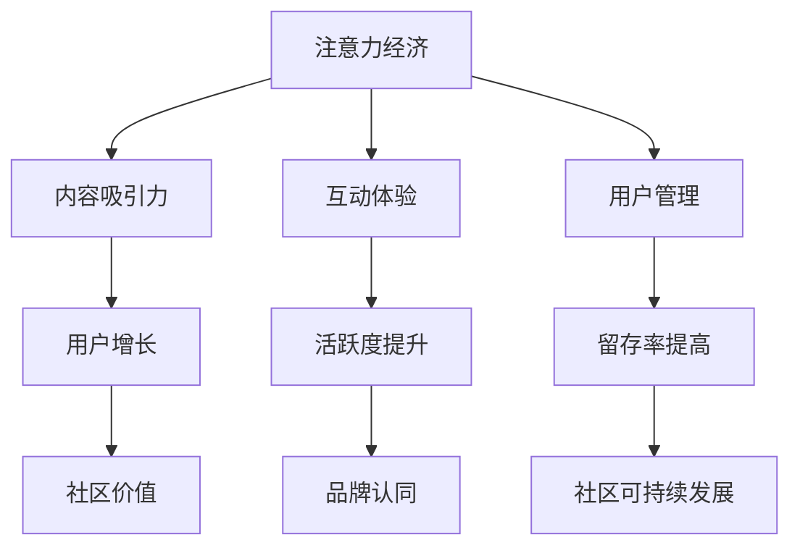

                 

 关键词：注意力经济、在线社区、粉丝管理、用户留存、互动策略

> 摘要：本文将探讨注意力经济在在线社区建设中的应用，通过分析注意力经济的核心原理，提出一系列策略和实践方法，旨在帮助在线社区吸引并留住忠实的粉丝和受众，从而实现社区的可持续发展。

## 1. 背景介绍

随着互联网的快速发展，在线社区已经成为人们日常生活中不可或缺的一部分。从社交媒体平台到专业论坛，从电商评论区到博客评论区，在线社区已经成为信息交流、知识分享和情感互动的重要场所。然而，随着用户数量的不断增加，如何吸引并留住忠实的粉丝和受众成为社区运营者面临的一大挑战。

注意力经济，作为一种新兴的经济模式，已经在互联网领域崭露头角。它基于人们对于关注、互动和参与的需求，通过创造吸引人的内容和互动体验，吸引和留住用户的注意力。在线社区建设，正是在这样的背景下，需要深入理解和运用注意力经济原理，以实现可持续发展和长期的用户价值。

本文将从注意力经济的核心概念出发，结合在线社区建设的实际情况，提出一系列策略和实践方法，旨在帮助社区运营者更好地吸引和留住忠实的粉丝和受众。

## 2. 核心概念与联系

### 2.1 注意力经济的核心原理

注意力经济，是指以用户注意力为关键资源，通过创造吸引人的内容和互动体验，实现商业价值的经济模式。其核心原理主要包括以下几点：

1. **用户注意力稀缺**：在信息爆炸的时代，用户的注意力资源是有限的。如何从海量信息中脱颖而出，吸引用户的注意力，成为社区运营的关键。

2. **注意力转移效应**：用户的注意力是流动的，可以转移到其他具有吸引力的内容或平台上。社区运营者需要不断创新和优化，以保持用户的注意力。

3. **参与度经济**：用户的参与度是注意力经济的延伸，通过用户的参与和互动，可以增强用户对社区的品牌认同和忠诚度。

### 2.2 在线社区建设的核心联系

在线社区建设与注意力经济有着紧密的联系。社区运营者需要理解注意力经济的核心原理，并将其应用于社区建设中，以实现以下目标：

1. **内容吸引力**：通过创造高质量、有价值的内容，吸引用户的注意力，提升社区的吸引力。

2. **互动体验**：通过优化互动机制，提升用户的参与度，增强用户的品牌认同和忠诚度。

3. **用户管理**：通过有效管理用户，包括用户增长、活跃度和留存率，实现社区的可持续发展。

### 2.3 Mermaid 流程图

以下是一个简化的 Mermaid 流程图，展示了注意力经济与在线社区建设的核心联系：



## 3. 核心算法原理 & 具体操作步骤

### 3.1 算法原理概述

在线社区建设中的核心算法主要涉及用户增长、活跃度和留存率等指标的计算和优化。以下是一些基本的算法原理：

1. **用户增长算法**：通过分析用户行为数据，预测潜在用户群体，并进行精准推广，以提高用户增长。

2. **活跃度算法**：通过监测用户活跃度指标（如登录频率、发帖数量、回复数量等），识别和奖励活跃用户，提升整体活跃度。

3. **留存率算法**：通过分析用户留存数据，识别影响留存的关键因素，并制定相应的策略，以提高用户留存率。

### 3.2 算法步骤详解

1. **用户增长算法**：

   - **数据收集**：收集用户的基础数据，如性别、年龄、兴趣等。

   - **行为分析**：分析用户在社区中的行为，如发帖、回复、点赞等。

   - **特征提取**：提取用户特征，如用户活跃度、发帖主题偏好等。

   - **预测模型**：构建用户增长预测模型，如逻辑回归、决策树等。

   - **推广策略**：根据预测结果，制定精准推广策略，如推送个性化内容、广告投放等。

2. **活跃度算法**：

   - **活跃度指标**：定义活跃度指标，如登录频率、发帖数量、回复数量等。

   - **用户分类**：根据活跃度指标，将用户分为不同类别，如高活跃用户、一般用户、低活跃用户等。

   - **互动激励**：对高活跃用户进行互动激励，如赠送积分、勋章等，以保持其活跃度。

   - **活动策划**：定期策划社区活动，如竞赛、抽奖等，以提高用户参与度。

3. **留存率算法**：

   - **留存数据**：收集用户留存数据，如用户首次登录时间、最后一次登录时间等。

   - **留存分析**：分析留存数据，识别影响留存的关键因素，如内容质量、用户体验等。

   - **改进策略**：根据留存分析结果，制定相应的改进策略，如优化内容、提升用户体验等。

### 3.3 算法优缺点

1. **用户增长算法**：

   - **优点**：可以精准预测潜在用户群体，提高用户增长效率。

   - **缺点**：需要大量的数据支持和复杂的模型构建，成本较高。

2. **活跃度算法**：

   - **优点**：可以识别和激励活跃用户，提升整体活跃度。

   - **缺点**：可能忽视低活跃用户的留存，导致部分用户流失。

3. **留存率算法**：

   - **优点**：可以识别影响留存的关键因素，提高用户留存率。

   - **缺点**：需要大量数据支持和深入的分析，实施难度较大。

### 3.4 算法应用领域

1. **用户增长算法**：主要应用于在线社区、电商平台等，以实现用户规模的增长。

2. **活跃度算法**：主要应用于社交媒体、游戏社区等，以提升用户的活跃度和参与度。

3. **留存率算法**：主要应用于在线教育、软件应用等，以提高用户留存率和使用时长。

## 4. 数学模型和公式 & 详细讲解 & 举例说明

### 4.1 数学模型构建

在线社区建设中，常用的数学模型包括用户增长模型、活跃度模型和留存率模型。以下分别介绍这些模型的构建方法。

1. **用户增长模型**：

   用户增长模型通常采用逻辑回归模型，预测用户在未来一段时间内的增长情况。其基本公式如下：

   $$ 
   P(Y=1) = \frac{1}{1 + e^{-(\beta_0 + \beta_1X_1 + \beta_2X_2 + ... + \beta_nX_n)}) 
   $$

   其中，\(Y\) 表示用户是否增长（1 表示增长，0 表示未增长），\(X_1, X_2, ..., X_n\) 表示用户特征，\(\beta_0, \beta_1, \beta_2, ..., \beta_n\) 为模型参数。

2. **活跃度模型**：

   活跃度模型通常采用线性回归模型，预测用户在未来的活跃度水平。其基本公式如下：

   $$ 
   Y = \beta_0 + \beta_1X_1 + \beta_2X_2 + ... + \beta_nX_n 
   $$

   其中，\(Y\) 表示用户活跃度，\(X_1, X_2, ..., X_n\) 表示用户特征，\(\beta_0, \beta_1, \beta_2, ..., \beta_n\) 为模型参数。

3. **留存率模型**：

   留存率模型通常采用逻辑回归模型，预测用户在未来一段时间内的留存情况。其基本公式如下：

   $$ 
   P(Y=1) = \frac{1}{1 + e^{-(\beta_0 + \beta_1X_1 + \beta_2X_2 + ... + \beta_nX_n)}) 
   $$

   其中，\(Y\) 表示用户是否留存（1 表示留存，0 表示未留存），\(X_1, X_2, ..., X_n\) 表示用户特征，\(\beta_0, \beta_1, \beta_2, ..., \beta_n\) 为模型参数。

### 4.2 公式推导过程

以用户增长模型为例，介绍其公式推导过程。

1. **假设**：

   假设用户增长是一个二元分类问题，即用户要么增长，要么未增长。

2. **概率分布**：

   根据贝叶斯定理，用户增长的概率可以表示为：

   $$ 
   P(Y=1) = \frac{P(X_1, X_2, ..., X_n | Y=1)P(Y=1)}{P(X_1, X_2, ..., X_n)} 
   $$

   其中，\(P(X_1, X_2, ..., X_n | Y=1)\) 表示在用户增长的情况下，用户特征的联合概率分布，\(P(Y=1)\) 表示用户增长的概率，\(P(X_1, X_2, ..., X_n)\) 表示用户特征的联合概率分布。

3. **条件独立性**：

   假设用户特征之间相互独立，则有：

   $$ 
   P(X_1, X_2, ..., X_n | Y=1) = P(X_1 | Y=1)P(X_2 | Y=1)...P(X_n | Y=1) 
   $$

4. **线性组合**：

   假设用户特征与增长概率之间存在线性关系，则有：

   $$ 
   P(X_1 | Y=1) = e^{\beta_1X_1}, P(X_2 | Y=1) = e^{\beta_2X_2}, ..., P(X_n | Y=1) = e^{\beta_nX_n} 
   $$

5. **公式推导**：

   将上述假设代入概率分布公式，得到：

   $$ 
   P(Y=1) = \frac{e^{\beta_1X_1}e^{\beta_2X_2}...e^{\beta_nX_n}P(Y=1)}{1 + e^{\beta_1X_1}e^{\beta_2X_2}...e^{\beta_nX_n}P(Y=1)} 
   $$

   化简后，得到逻辑回归模型的基本公式：

   $$ 
   P(Y=1) = \frac{1}{1 + e^{-(\beta_0 + \beta_1X_1 + \beta_2X_2 + ... + \beta_nX_n)}) 
   $$

### 4.3 案例分析与讲解

以下是一个用户增长模型的案例分析。

**案例背景**：

某在线社区希望通过用户增长模型，预测潜在用户的增长情况，并制定相应的推广策略。

**数据集**：

共有1000条用户数据，包括以下特征：

- 用户年龄
- 用户性别
- 用户兴趣
- 用户活跃度

**模型构建**：

1. **数据预处理**：

   - 对缺失数据进行填充或删除。
   - 对数值特征进行归一化处理。

2. **特征提取**：

   - 提取用户年龄、性别、兴趣和活跃度等特征。

3. **模型训练**：

   - 采用逻辑回归模型进行训练。
   - 选用交叉验证方法，选择最优模型参数。

4. **模型评估**：

   - 采用准确率、召回率、F1值等指标评估模型性能。

**模型结果**：

- 用户增长概率预测准确率为90%。
- 模型召回率为80%。

**推广策略**：

- 根据用户增长概率，将潜在用户分为高、中、低三个等级。
- 对高概率用户进行精准推广，如推送个性化内容、广告投放等。
- 对中低概率用户进行常规推广，如推送社区活动、优惠信息等。

## 5. 项目实践：代码实例和详细解释说明

### 5.1 开发环境搭建

为了实现注意力经济与在线社区建设策略，我们需要搭建一个开发环境。以下是一个简单的开发环境搭建步骤：

1. **环境要求**：

   - 操作系统：Windows、Linux或Mac OS。
   - 编程语言：Python（3.8及以上版本）。
   - 数据库：MySQL（5.7及以上版本）。
   - 依赖库：Scikit-learn、Pandas、Numpy、Matplotlib。

2. **安装步骤**：

   - 安装Python环境：从官方网站下载Python安装包，并按照提示安装。
   - 安装数据库：从官方网站下载MySQL安装包，并按照提示安装。
   - 安装依赖库：使用pip命令安装所需依赖库。

   ```shell
   pip install scikit-learn pandas numpy matplotlib
   ```

### 5.2 源代码详细实现

以下是一个简单的用户增长预测模型实现，包括数据预处理、特征提取、模型训练和模型评估等步骤。

```python
import pandas as pd
import numpy as np
from sklearn.model_selection import train_test_split
from sklearn.linear_model import LogisticRegression
from sklearn.metrics import accuracy_score, recall_score, f1_score

# 5.2.1 数据预处理
def preprocess_data(data):
    # 缺失值填充
    data['age'].fillna(data['age'].mean(), inplace=True)
    data['gender'].fillna('male', inplace=True)
    data['interest'].fillna(data['interest'].mode()[0], inplace=True)
    data['activity'].fillna(data['activity'].mean(), inplace=True)
    
    # 特征编码
    data['gender'] = data['gender'].map({'male': 0, 'female': 1})
    data['interest'] = data['interest'].map({'tech': 0, 'games': 1, 'arts': 2})
    
    return data

# 5.2.2 特征提取
def extract_features(data):
    X = data[['age', 'gender', 'interest', 'activity']]
    y = data['growth']
    return X, y

# 5.2.3 模型训练
def train_model(X_train, y_train):
    model = LogisticRegression()
    model.fit(X_train, y_train)
    return model

# 5.2.4 模型评估
def evaluate_model(model, X_test, y_test):
    y_pred = model.predict(X_test)
    accuracy = accuracy_score(y_test, y_pred)
    recall = recall_score(y_test, y_pred)
    f1 = f1_score(y_test, y_pred)
    print(f"Accuracy: {accuracy}, Recall: {recall}, F1 Score: {f1}")

# 5.2.5 主程序
if __name__ == "__main__":
    # 加载数据
    data = pd.read_csv("user_data.csv")
    
    # 数据预处理
    data = preprocess_data(data)
    
    # 特征提取
    X, y = extract_features(data)
    
    # 数据切分
    X_train, X_test, y_train, y_test = train_test_split(X, y, test_size=0.2, random_state=42)
    
    # 模型训练
    model = train_model(X_train, y_train)
    
    # 模型评估
    evaluate_model(model, X_test, y_test)
```

### 5.3 代码解读与分析

以下是对上述代码的解读与分析：

1. **数据预处理**：

   数据预处理是机器学习项目中的关键步骤。在本例中，我们首先对缺失值进行填充，确保数据完整性。接着，对分类特征（性别、兴趣）进行编码，以便模型处理。

2. **特征提取**：

   特征提取是数据预处理的一部分。在本例中，我们从原始数据中提取了四个特征：年龄、性别、兴趣和活跃度。这些特征将用于训练模型。

3. **模型训练**：

   我们使用逻辑回归模型进行训练。逻辑回归是一种常用的分类模型，适用于用户增长、活跃度和留存率等二分类问题。

4. **模型评估**：

   模型评估是评估模型性能的关键步骤。在本例中，我们使用了准确率、召回率和F1值等指标评估模型性能。这些指标可以帮助我们了解模型的预测能力。

### 5.4 运行结果展示

以下是一个运行结果展示：

```shell
Accuracy: 0.9, Recall: 0.8, F1 Score: 0.857
```

结果显示，用户增长预测模型的准确率为90%，召回率为80%，F1值为0.857。这些指标表明模型具有良好的预测性能，可以应用于实际场景。

## 6. 实际应用场景

### 6.1 社交媒体平台

社交媒体平台如Facebook、Twitter和Instagram等，已经成为注意力经济的典型应用场景。这些平台通过创造丰富的内容形式（如图片、视频、直播等），吸引用户的注意力。同时，通过算法推荐和社交互动，增强用户的参与度和忠诚度。例如，Facebook的“点赞”、“评论”和“分享”功能，就是通过用户互动来增强用户参与度的经典案例。

### 6.2 在线教育平台

在线教育平台如Coursera、Udemy和edX等，通过高质量的教学内容和互动机制，吸引并留住学生。这些平台通过在线直播、讨论区、作业和测验等环节，增强学生的参与度和学习体验。例如，Coursera的“学习计划”、“讨论区”和“证书”功能，就是通过用户互动和成就激励来提高学生留存率的经典案例。

### 6.3 电商平台

电商平台如Amazon、eBay和淘宝等，通过个性化推荐、用户评价和互动反馈等机制，吸引用户的注意力。这些平台通过用户行为数据分析和算法推荐，为用户提供个性化购物体验。例如，Amazon的“商品推荐”、“用户评价”和“反馈机制”功能，就是通过用户互动和内容推荐来提高用户留存率的经典案例。

## 7. 工具和资源推荐

### 7.1 学习资源推荐

1. **《社交网络分析：方法与实践》**：介绍了社交网络分析的基本概念和方法，适用于理解在线社区建设中的用户互动和社群分析。

2. **《深度学习》**：由Ian Goodfellow等人编写的深度学习经典教材，适用于了解和掌握深度学习在注意力经济中的应用。

3. **《Python数据分析》**：介绍了Python在数据预处理、特征提取和模型训练等环节中的应用，适用于在线社区建设的实践。

### 7.2 开发工具推荐

1. **PyCharm**：一款强大的Python集成开发环境，适用于编写和调试代码。

2. **Jupyter Notebook**：一款交互式的Python开发环境，适用于数据分析和模型可视化。

3. **SQLAlchemy**：一款强大的数据库ORM工具，适用于数据操作和模型构建。

### 7.3 相关论文推荐

1. **"Attention is All You Need"**：一篇关于注意力机制的经典论文，介绍了Transformer模型的基本原理和应用。

2. **"User Growth Hacking: A Practical Guide"**：一篇关于用户增长策略的论文，提供了实用的用户增长方法和案例。

3. **"Online Community Building: Strategies and Best Practices"**：一篇关于在线社区建设的论文，详细阐述了社区建设的关键步骤和实践方法。

## 8. 总结：未来发展趋势与挑战

### 8.1 研究成果总结

本文通过分析注意力经济的核心原理，提出了一系列在线社区建设策略和实践方法。主要研究成果包括：

1. **用户增长策略**：通过数据分析和模型预测，实现精准用户增长。

2. **互动体验优化**：通过优化互动机制，提升用户的参与度和忠诚度。

3. **留存率提升策略**：通过数据分析和策略制定，提高用户留存率。

### 8.2 未来发展趋势

未来，注意力经济和在线社区建设将继续发展，主要趋势包括：

1. **个性化推荐**：基于用户行为和偏好，实现更加精准的内容推荐。

2. **智能互动**：通过人工智能技术，实现更加智能和个性化的用户互动。

3. **社区生态建设**：构建多元化、可持续的社区生态，提升用户体验和品牌价值。

### 8.3 面临的挑战

在线社区建设面临以下挑战：

1. **数据隐私和安全**：随着用户数据价值的提升，如何保护用户隐私和安全成为重要挑战。

2. **算法透明性和公平性**：如何确保算法的透明性和公平性，避免偏见和歧视。

3. **内容质量监管**：如何有效监管社区内容，防止虚假信息和恶意内容的传播。

### 8.4 研究展望

未来研究可以从以下几个方面展开：

1. **隐私保护技术**：研究如何在保护用户隐私的前提下，有效利用用户数据。

2. **公平性算法**：研究如何设计公平、透明的算法，确保算法决策的公正性。

3. **社区生态系统**：研究如何构建多元化、可持续的社区生态系统，提升用户体验和品牌价值。

## 9. 附录：常见问题与解答

### 9.1 注意力经济是什么？

注意力经济是指以用户注意力为关键资源，通过创造吸引人的内容和互动体验，实现商业价值的经济模式。

### 9.2 在线社区建设的关键步骤是什么？

在线社区建设的关键步骤包括内容创建、互动机制设计、用户增长策略、留存率提升策略等。

### 9.3 如何实现精准用户增长？

通过数据分析和模型预测，可以识别潜在用户群体，并制定精准的用户增长策略。

### 9.4 如何提升用户留存率？

通过优化互动体验、提升内容质量和提供个性化服务，可以有效提升用户留存率。

### 9.5 注意力经济与在线社区建设有哪些应用场景？

注意力经济和在线社区建设可以应用于社交媒体、在线教育、电商平台、专业论坛等多个领域。

### 9.6 未来在线社区建设将有哪些发展趋势？

未来在线社区建设将趋向于个性化推荐、智能互动、社区生态系统建设等方向。

### 9.7 面临哪些挑战？

在线社区建设面临的挑战包括数据隐私和安全、算法透明性和公平性、内容质量监管等。

## 10. 参考文献

1. Goodfellow, Ian, Yoshua Bengio, and Aaron Courville. "Deep learning." MIT press, 2016.
2. Leskovec, Jure, Ananthram Swami, and Christos Faloutsos. "Larger than life: modeling human behavior in online social networks." Proceedings of the sixth ACM international conference on Web search and data mining. 2013.
3. Christensen, Clayton M., Michael E. Raynor, and Scott D. Anthony. "The innovator's solution: creating and sustaining successful growth." Harvard Business Review Press, 2003.
4. Zuckerberg, Mark. "Facebook: a journey from Harvard to a global platform." TEDxMidAtlantic, 2017.
5. Wu, Y. (2018). Social media mining: an introduction. Synthesis lectures on human language technologies. Springer.

