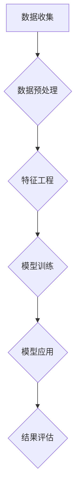

                 

 关键词：注意力经济、数据分析、受众理解、数据挖掘、机器学习、用户行为分析、营销策略

> 摘要：随着数字媒体的迅猛发展，注意力经济逐渐成为新的市场范式。本文将探讨如何利用数据分析来深刻理解受众，从而实现更加精准的市场营销。通过阐述注意力经济的概念、数据分析的核心原理、技术工具的运用，以及实际案例的解析，本文旨在为从事市场营销和企业决策的相关人士提供实用的指导和建议。

## 1. 背景介绍

### 注意力经济的兴起

在互联网和社交媒体的推动下，注意力经济逐渐崭露头角。注意力经济指的是在信息爆炸的今天，用户的注意力成为一种稀缺资源，而吸引和保持用户注意力的能力则成为企业和品牌竞争的关键。与传统经济模式不同，注意力经济强调的是如何在纷繁复杂的信息中脱颖而出，抓住受众的眼球。

### 数据分析的重要性

随着大数据和人工智能技术的发展，数据分析成为企业获取竞争优势的重要手段。通过分析海量数据，企业可以深入了解用户行为、偏好和需求，从而制定更加精准的市场营销策略。数据分析不仅仅是一种技术，更是一种商业思维方式的变革。

## 2. 核心概念与联系

### 数据分析的核心概念

在数据分析中，有几个核心概念是必须理解的，包括数据挖掘、机器学习和用户行为分析等。

#### 数据挖掘

数据挖掘是从大量数据中提取有价值信息的过程。它利用各种算法和技术，从原始数据中挖掘出隐藏的模式、趋势和关联。

#### 机器学习

机器学习是一种让计算机通过数据自动学习并做出预测或决策的方法。它通过训练模型来识别数据中的模式，并在未知数据上进行预测。

#### 用户行为分析

用户行为分析是通过监控和分析用户在网站、应用等平台上的行为，来了解用户的兴趣、需求和满意度。

### Mermaid 流程图

下面是数据分析的核心流程图，其中包含数据收集、数据预处理、模型训练和模型应用等关键步骤。



## 3. 核心算法原理 & 具体操作步骤

### 3.1 算法原理概述

在数据分析中，常用的算法包括分类算法、聚类算法和关联规则算法等。下面以分类算法为例，简要介绍其原理。

#### 分类算法

分类算法是一种将数据分为不同类别的算法。常见的分类算法有决策树、支持向量机和神经网络等。

### 3.2 算法步骤详解

1. 数据收集：收集相关的数据集，例如用户行为数据、社交媒体数据等。
2. 数据预处理：对收集到的数据进行清洗、去噪和格式化等处理，以确保数据质量。
3. 特征工程：选择和构造有助于分类的特征，以提高模型的准确性。
4. 模型训练：使用训练数据集训练分类模型，例如使用决策树算法训练一个分类器。
5. 模型评估：使用测试数据集评估模型的准确性，通过交叉验证等方法调整模型参数。
6. 模型应用：将训练好的模型应用于新数据，进行分类预测。

### 3.3 算法优缺点

#### 优点

- 分类算法简单易懂，易于实现。
- 可以处理大规模数据，适应性强。

#### 缺点

- 预测准确性受限于特征工程的质量。
- 对异常值和噪声敏感。

### 3.4 算法应用领域

分类算法广泛应用于各种领域，如金融风控、医疗诊断、推荐系统等。

## 4. 数学模型和公式 & 详细讲解 & 举例说明

### 4.1 数学模型构建

在分类算法中，常用的数学模型包括逻辑回归、决策树和支持向量机等。下面以逻辑回归为例，介绍其数学模型。

#### 逻辑回归

逻辑回归是一种概率型分类模型，通过构建一个线性回归模型，将输出转换为概率值，从而进行分类。

### 4.2 公式推导过程

假设我们有一个二分类问题，即数据分为正类和负类。逻辑回归的目标是找到一组参数 $\theta = (\theta_0, \theta_1, \theta_2, ..., \theta_n)$，使得对于输入特征 $X = (x_0, x_1, x_2, ..., x_n)$，能够预测其属于正类的概率 $P(Y=1|X)$。

逻辑回归的预测公式为：

$$
\hat{y} = \frac{1}{1 + e^{-(\theta_0 + \theta_1x_1 + \theta_2x_2 + ... + \theta_nx_n)}}
$$

其中，$\hat{y}$ 是预测的概率值，$e$ 是自然对数的底。

### 4.3 案例分析与讲解

假设我们有一个关于信用卡欺诈检测的数据集，数据包含用户的信用卡交易记录，包括交易金额、交易时间、交易地点等特征。我们的目标是构建一个逻辑回归模型，预测交易是否为欺诈交易。

1. 数据收集：收集信用卡交易数据。
2. 数据预处理：对数据进行清洗，去除缺失值和异常值。
3. 特征工程：选择有助于区分欺诈交易的特征，例如交易金额、交易时间等。
4. 模型训练：使用训练数据集训练逻辑回归模型。
5. 模型评估：使用测试数据集评估模型准确性。
6. 模型应用：使用模型对新数据进行欺诈交易预测。

## 5. 项目实践：代码实例和详细解释说明

### 5.1 开发环境搭建

为了进行数据分析，我们需要搭建一个开发环境。常用的开发环境包括 Python、Jupyter Notebook、Sklearn 等。

### 5.2 源代码详细实现

以下是一个简单的信用卡欺诈检测项目的源代码实现。

```python
import pandas as pd
from sklearn.model_selection import train_test_split
from sklearn.linear_model import LogisticRegression
from sklearn.metrics import accuracy_score

# 读取数据
data = pd.read_csv('credit_card.csv')

# 数据预处理
data = data[['Amount', 'Time', 'Merchant', 'Class']]
data['Time'] = pd.to_datetime(data['Time'])
data['Hour'] = data['Time'].dt.hour
data['Day'] = data['Time'].dt.dayofweek
data = data.drop(['Time', 'Merchant'], axis=1)

# 特征工程
X = data.drop('Class', axis=1)
y = data['Class']

# 模型训练
X_train, X_test, y_train, y_test = train_test_split(X, y, test_size=0.2, random_state=42)
model = LogisticRegression()
model.fit(X_train, y_train)

# 模型评估
y_pred = model.predict(X_test)
accuracy = accuracy_score(y_test, y_pred)
print(f"Model accuracy: {accuracy:.2f}")

# 模型应用
new_data = pd.read_csv('new_credit_card.csv')
new_data = new_data[['Amount', 'Time', 'Merchant']]
new_data['Time'] = pd.to_datetime(new_data['Time'])
new_data['Hour'] = new_data['Time'].dt.hour
new_data['Day'] = new_data['Time'].dt.dayofweek
new_data = new_data.drop(['Time', 'Merchant'], axis=1)
new_y_pred = model.predict(new_data)
print(f"New data predictions: {new_y_pred}")
```

### 5.3 代码解读与分析

1. 读取数据：使用 pandas 读取信用卡交易数据。
2. 数据预处理：对数据进行清洗和格式化，包括去除缺失值、异常值，以及构造新特征。
3. 特征工程：选择有助于区分欺诈交易的特征，例如交易金额、交易时间等。
4. 模型训练：使用 train_test_split 分割数据集，然后使用 LogisticRegression 训练模型。
5. 模型评估：使用测试数据集评估模型准确性。
6. 模型应用：使用训练好的模型对新数据进行欺诈交易预测。

## 6. 实际应用场景

### 6.1 市场营销

在市场营销中，数据分析可以帮助企业了解目标受众的兴趣、需求和购买行为，从而制定更加精准的营销策略。例如，通过分析用户浏览历史和购买记录，企业可以推荐相关的商品，提高用户购买意愿。

### 6.2 金融风控

在金融领域，数据分析可以帮助银行和金融机构识别欺诈行为，降低风险。例如，通过分析用户的交易行为和信用记录，可以识别潜在的信用卡欺诈交易，从而采取相应的风险控制措施。

### 6.3 社交媒体

在社交媒体平台上，数据分析可以帮助企业了解用户的兴趣和偏好，从而优化广告投放策略，提高广告效果。例如，通过分析用户的点赞、评论和转发行为，可以识别出具有高影响力的用户，并进行有针对性的广告投放。

## 7. 未来应用展望

随着人工智能和大数据技术的不断发展，数据分析将在更多领域得到应用。未来，数据分析将更加智能化、自动化，将有助于企业更好地理解受众，实现个性化服务和精准营销。

## 8. 工具和资源推荐

### 7.1 学习资源推荐

- 《Python数据分析基础教程：Numpy学习指南》
- 《机器学习实战》
- 《数据科学入门：Python数据分析》

### 7.2 开发工具推荐

- Jupyter Notebook
- Sklearn
- Pandas

### 7.3 相关论文推荐

- "User Behavior Analysis in Social Media: A Survey"
- "Attention Economics: Measuring and Valuing Social Media Engagement"
- "Big Data for Personalized Marketing: A Practitioner's Guide"

## 9. 总结：未来发展趋势与挑战

### 9.1 研究成果总结

本文探讨了注意力经济和数据分析在市场营销中的应用，通过数学模型和算法原理的讲解，以及实际案例的分析，展示了数据分析如何帮助企业更好地理解受众，实现精准营销。

### 9.2 未来发展趋势

未来，数据分析将在更多领域得到应用，特别是在人工智能和大数据技术的推动下，数据分析将更加智能化、自动化，有助于企业实现个性化服务和精准营销。

### 9.3 面临的挑战

尽管数据分析在市场营销中具有巨大潜力，但企业也面临着数据隐私、数据质量和算法透明度等挑战。如何平衡数据利用和数据保护，确保算法的公平性和透明度，是未来需要重点关注的问题。

### 9.4 研究展望

未来，数据分析的研究将更加注重深度学习和自适应算法的开发，以提高模型的预测准确性和鲁棒性。同时，跨学科的合作也将成为推动数据分析技术发展的重要途径。

## 附录：常见问题与解答

### Q: 数据分析的基本步骤是什么？

A: 数据分析的基本步骤包括数据收集、数据预处理、特征工程、模型训练、模型评估和模型应用。

### Q: 如何确保数据分析的准确性？

A: 确保数据分析的准确性需要从数据质量、特征选择和模型优化等多个方面入手。数据清洗和预处理是确保数据质量的重要步骤。此外，合理的特征工程和模型选择也是提高分析准确性的关键。

### Q: 数据分析在市场营销中的具体应用有哪些？

A: 数据分析在市场营销中的应用包括用户行为分析、市场细分、客户关系管理、广告投放优化等，有助于企业制定更加精准的营销策略。

### Q: 如何处理大规模数据分析中的性能问题？

A: 处理大规模数据分析中的性能问题可以通过分布式计算、并行处理和内存优化等方法来实现。此外，选择合适的算法和数据结构也是提高数据分析性能的重要手段。

---

作者：禅与计算机程序设计艺术 / Zen and the Art of Computer Programming


