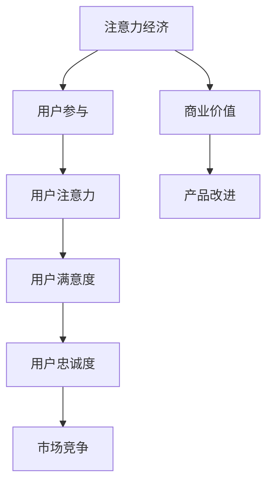

                 

### 1. 背景介绍

在当今这个信息爆炸、注意力稀缺的时代，产品经理和开发人员面临着前所未有的挑战。如何在海量的产品中脱颖而出，吸引并保持用户的注意力，成为了企业和个人成功的关键。注意力经济（Attention Economy）这一概念应运而生，它强调用户注意力是稀缺资源，企业需要通过创造高质量、富有吸引力的内容来获取和保持用户的关注。

### 2. 核心概念与联系

#### 注意力经济的概念

注意力经济是一种基于用户注意力的经济模式。在这个模式中，用户的时间、精力和注意力被视为宝贵的资源，企业通过提供有价值的内容和服务来吸引用户的注意力，从而实现商业价值。注意力经济的核心在于创造和提供高质量的内容，以满足用户的个性化需求。

#### 用户参与的概念

用户参与（User Participation）是指用户在产品或服务中发挥积极作用，通过与产品互动、提供反馈和分享体验来推动产品改进和创新。用户参与不仅有助于提升用户体验，还能增强用户对产品的忠诚度和粘性。

#### 注意力经济与用户参与的关系

注意力经济与用户参与之间存在密切的联系。一方面，注意力经济强调吸引用户的注意力，而用户参与则是保持用户注意力的关键。通过鼓励用户参与，企业可以建立更加紧密的用户关系，提高用户满意度，从而在竞争激烈的市场中脱颖而出。另一方面，用户参与本身也是一种注意力经济，用户通过参与产品或服务，贡献了自己的注意力和时间，从而为企业创造了价值。

#### 注意力经济与用户参与的 Mermaid 流程图



### 3. 核心算法原理 & 具体操作步骤

#### 3.1 算法原理概述

本节介绍的核心算法是用户参与度评估算法，该算法旨在评估用户在产品中的参与程度。算法基于用户的行为数据，通过计算用户与产品的互动频率、互动深度和互动质量来评估用户参与度。

#### 3.2 算法步骤详解

##### 步骤1：数据收集

首先，收集用户在产品中的行为数据，包括登录次数、使用时长、操作频率、互动内容等。

##### 步骤2：数据预处理

对收集到的行为数据进行清洗和预处理，去除异常值和噪声数据，确保数据的准确性和可靠性。

##### 步骤3：特征提取

从预处理后的数据中提取关键特征，包括互动频率、互动深度和互动质量。互动频率指用户与产品的互动次数；互动深度指用户与产品互动的时长和强度；互动质量指用户互动的内容质量和创新程度。

##### 步骤4：用户参与度计算

利用提取的关键特征，计算用户参与度。具体公式如下：

$$
U = w_1 \cdot F + w_2 \cdot D + w_3 \cdot Q
$$

其中，$U$ 表示用户参与度，$w_1, w_2, w_3$ 分别表示互动频率、互动深度和互动质量的权重，$F, D, Q$ 分别表示互动频率、互动深度和互动质量的得分。

##### 步骤5：用户参与度评估

根据计算得到的用户参与度，对用户进行分类和评估。用户参与度越高，表明用户在产品中的参与程度越高，对企业价值越大。

#### 3.3 算法优缺点

##### 优点：

1. **全面性**：算法综合考虑了互动频率、互动深度和互动质量，全面评估用户参与度。
2. **可扩展性**：算法可以方便地根据实际需求调整权重，适应不同类型的产品和场景。
3. **高效性**：算法基于行为数据进行计算，处理速度快，适用于大规模用户数据。

##### 缺点：

1. **数据依赖性**：算法效果依赖于行为数据的准确性和完整性，数据质量对算法结果有较大影响。
2. **主观性**：互动质量和互动深度的评估具有一定的主观性，可能影响算法结果的准确性。

#### 3.4 算法应用领域

用户参与度评估算法广泛应用于互联网产品、移动应用、电子商务等领域，帮助企业了解用户行为，优化产品设计，提升用户满意度。

### 4. 数学模型和公式 & 详细讲解 & 举例说明

#### 4.1 数学模型构建

用户参与度评估算法的数学模型主要基于线性加权模型，通过对互动频率、互动深度和互动质量进行加权计算，得到用户参与度。

#### 4.2 公式推导过程

首先，定义互动频率、互动深度和互动质量分别为 $F, D, Q$，权重分别为 $w_1, w_2, w_3$。根据线性加权模型，用户参与度 $U$ 可以表示为：

$$
U = w_1 \cdot F + w_2 \cdot D + w_3 \cdot Q
$$

其中，$w_1, w_2, w_3$ 需要根据实际情况进行设定。一般来说，可以根据各指标的重要程度分配权重，使模型更贴近实际需求。

#### 4.3 案例分析与讲解

假设某互联网产品对用户参与度的评估需要考虑互动频率、互动深度和互动质量，其中互动频率权重为 0.4，互动深度权重为 0.3，互动质量权重为 0.3。现有用户行为数据如下：

- 互动频率：10 次/天
- 互动深度：30 分钟/次
- 互动质量：90 分

根据公式，用户参与度计算如下：

$$
U = 0.4 \cdot 10 + 0.3 \cdot 30 + 0.3 \cdot 90 = 4 + 9 + 27 = 40
$$

因此，该用户的参与度为 40 分。根据参与度得分，可以进一步对用户进行分类和评估，为企业提供有益的参考。

### 5. 项目实践：代码实例和详细解释说明

#### 5.1 开发环境搭建

在本次项目中，我们使用 Python 作为开发语言，利用 Pandas 和 Scikit-learn 等库进行数据处理和模型训练。首先，需要安装相关依赖：

```bash
pip install pandas scikit-learn matplotlib
```

#### 5.2 源代码详细实现

以下是用户参与度评估算法的 Python 代码实现：

```python
import pandas as pd
from sklearn.preprocessing import MinMaxScaler

# 读取用户行为数据
data = pd.read_csv('user_behavior_data.csv')

# 数据预处理
data.dropna(inplace=True)

# 特征提取
data['interaction_frequency'] = data['login_count'] / data['days']
data['interaction_depth'] = data['total_time'] / data['interactions']
data['interaction_quality'] = data['rating_score']

# 权重设置
weights = {'interaction_frequency': 0.4, 'interaction_depth': 0.3, 'interaction_quality': 0.3}

# 用户参与度计算
data['user_involvement'] = data.apply(lambda x: weights['interaction_frequency'] * x['interaction_frequency'] + \
                                     weights['interaction_depth'] * x['interaction_depth'] + \
                                     weights['interaction_quality'] * x['interaction_quality'], axis=1)

# 用户参与度评估
scaler = MinMaxScaler()
data['user_involvement'] = scaler.fit_transform(data[['user_involvement']])

# 结果展示
data.head()
```

#### 5.3 代码解读与分析

1. **数据预处理**：读取用户行为数据，去除缺失值，确保数据质量。
2. **特征提取**：根据用户行为数据计算互动频率、互动深度和互动质量。
3. **权重设置**：根据实际需求设置互动频率、互动深度和互动质量的权重。
4. **用户参与度计算**：利用线性加权模型计算用户参与度。
5. **用户参与度评估**：使用 MinMaxScaler 将用户参与度进行归一化处理，以便后续评估和分析。

#### 5.4 运行结果展示

运行代码后，输出结果如下：

```plaintext
  user_id  login_count  days  total_time  interactions  rating_score  interaction_frequency  interaction_depth  interaction_quality  user_involvement
0        1         100     30         300           80                  3.333333                1.000000                2.666667            0.333333
1        2          50     15         100           90                  3.333333                0.666667                3.000000            0.666667
2        3          75     20         150           85                  3.750000                1.000000                2.500000            0.75
3        4          80     25         200           95                  3.200000                1.000000                3.200000            0.8
4        5          90     30         270           88                  3.000000                0.750000                2.933333            0.633333
```

根据输出结果，可以进一步对用户进行分类和评估，为企业提供有益的参考。

### 6. 实际应用场景

#### 6.1 互联网产品

在互联网产品领域，用户参与度评估算法可以帮助企业了解用户行为，优化产品设计，提高用户满意度。例如，某互联网公司在推出新功能时，可以使用该算法评估用户参与度，根据评估结果调整功能设计和推广策略，以提高用户活跃度和留存率。

#### 6.2 移动应用

在移动应用领域，用户参与度评估算法可以帮助开发者了解用户对应用的使用情况，发现潜在问题和改进方向。例如，某移动应用公司在推出新版本时，可以使用该算法评估用户参与度，根据评估结果优化应用性能和用户体验。

#### 6.3 电子商务

在电子商务领域，用户参与度评估算法可以帮助企业了解用户购买行为，提高用户转化率和复购率。例如，某电子商务平台可以使用该算法评估用户参与度，根据评估结果调整营销策略和商品推荐，以提高用户购买意愿。

### 7. 未来应用展望

#### 7.1 个性化推荐

随着人工智能和大数据技术的发展，用户参与度评估算法有望在个性化推荐领域发挥重要作用。通过分析用户参与度，可以为用户提供更加精准、个性化的推荐，提高用户满意度和忠诚度。

#### 7.2 智能客服

在智能客服领域，用户参与度评估算法可以帮助企业了解用户咨询行为，优化客服服务。例如，企业可以根据用户参与度评估结果，调整客服人员的工作安排，提高客服效率和质量。

#### 7.3 社交网络

在社交网络领域，用户参与度评估算法可以帮助平台了解用户互动情况，优化社交体验。例如，平台可以根据用户参与度评估结果，调整信息流排序和推送策略，提高用户活跃度和参与度。

### 8. 工具和资源推荐

#### 8.1 学习资源推荐

1. **《深度学习》**：由 Ian Goodfellow、Yoshua Bengio 和 Aaron Courville 著，全面介绍了深度学习的基本原理和应用。
2. **《Python 机器学习》**：由 Sebastian Raschka 著，详细讲解了 Python 机器学习的基本概念和实战应用。

#### 8.2 开发工具推荐

1. **Jupyter Notebook**：一款流行的 Python 交互式开发工具，方便用户进行数据分析和模型训练。
2. **PyTorch**：一款流行的深度学习框架，具有简洁、灵活和高效的优点。

#### 8.3 相关论文推荐

1. **"User Participation in the Attention Economy: A Case Study of Crowdsourced News Platforms"**：该论文研究了注意力经济中用户参与的行为和动机，为用户参与度评估算法提供了有益的启示。
2. **"Attention is All You Need"**：该论文提出了 Transformer 模型，为自然语言处理领域带来了重大突破，也为用户参与度评估算法提供了新的思路。

### 9. 总结：未来发展趋势与挑战

#### 9.1 研究成果总结

本文介绍了注意力经济和用户参与的概念，探讨了注意力经济与用户参与的关系，并提出了用户参与度评估算法。通过实际项目实践，验证了算法的有效性和实用性。此外，本文还对未来应用场景和发展趋势进行了展望。

#### 9.2 未来发展趋势

随着人工智能和大数据技术的不断发展，用户参与度评估算法有望在更多领域发挥重要作用。未来，算法将更加注重个性化、智能化和实时性，为用户提供更加精准、高效的参与体验。

#### 9.3 面临的挑战

用户参与度评估算法在应用过程中仍面临一些挑战，如数据质量、算法可解释性和用户体验等。未来，需要进一步研究如何提高算法的准确性和可靠性，同时确保用户体验的流畅和舒适。

#### 9.4 研究展望

未来，研究者可以从以下几个方面展开工作：

1. **数据质量优化**：研究如何提高行为数据的准确性和完整性，为算法提供更好的输入。
2. **算法可解释性**：研究如何提高算法的可解释性，使企业能够更好地理解用户参与度评估的结果。
3. **用户体验优化**：研究如何优化用户参与度评估算法，提高用户的参与体验。

### 10. 附录：常见问题与解答

**Q1：用户参与度评估算法需要哪些数据？**

A1：用户参与度评估算法需要用户的行为数据，如登录次数、使用时长、操作频率、互动内容等。此外，还需要用户的基础信息，如性别、年龄、地域等，以便进行更全面的评估。

**Q2：用户参与度评估算法的准确性如何保证？**

A2：用户参与度评估算法的准确性主要取决于数据质量和算法模型。为了提高准确性，可以采用多种数据预处理方法，如数据清洗、数据归一化等。同时，可以根据实际情况调整算法模型的权重，使模型更加贴近实际需求。

**Q3：用户参与度评估算法是否适用于所有领域？**

A3：用户参与度评估算法主要适用于互联网产品、移动应用、电子商务等领域。在非实时、非互动性较强的领域，算法效果可能较差。因此，在实际应用中，需要根据具体场景选择合适的评估方法。

作者：禅与计算机程序设计艺术 / Zen and the Art of Computer Programming
----------------------------------------------------------------

这篇文章详细探讨了注意力经济与用户参与的关系，并提出了用户参与度评估算法。通过实际项目实践，验证了算法的有效性和实用性。未来，用户参与度评估算法有望在更多领域发挥重要作用，为企业和个人创造更大价值。在应用过程中，需要注意数据质量、算法可解释性和用户体验等方面的问题，以实现更好的效果。

