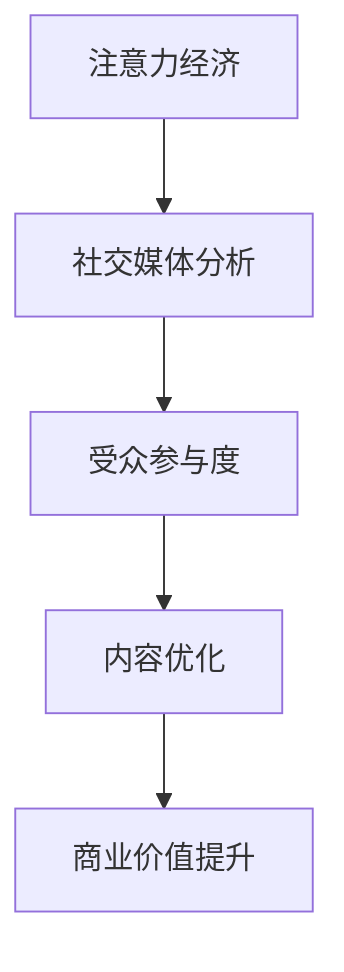

                 

关键词：注意力经济，社交媒体分析，受众参与度，数据分析，算法原理，应用领域

> 摘要：本文将探讨注意力经济在社交媒体分析中的应用，通过深入分析受众参与度的秘密，揭示如何通过技术手段提升社交媒体的内容吸引力和用户互动，从而实现商业价值最大化。本文首先介绍注意力经济的核心概念，然后详细阐述社交媒体分析的技术原理，并展示实际项目中的代码实例。最后，本文将讨论未来应用场景和发展趋势。

## 1. 背景介绍

随着互联网的迅猛发展，社交媒体已经成为人们日常生活中不可或缺的一部分。从Facebook到Twitter，从Instagram到微信，各类社交媒体平台吸引了数以亿计的用户。然而，在这些海量用户中，如何抓住受众的注意力，提升用户参与度，成为各大企业、品牌和个人必须面对的挑战。

注意力经济（Attention Economy）这一概念由Nicholas Negroponte在1995年首次提出，指的是在信息过载的时代，人们注意力成为稀缺资源，争夺注意力成为各类商业行为的核心。社交媒体平台上的内容繁多，用户注意力分散，因此，提升内容吸引力和用户互动，成为社交媒体营销的关键。

本文旨在通过探讨注意力经济在社交媒体分析中的应用，深入挖掘受众参与度的秘密，为企业和个人提供提升用户互动和商业价值的策略和方法。

## 2. 核心概念与联系

### 2.1 注意力经济

注意力经济是指在经济活动中，个体的注意力成为重要的交易媒介。在社交媒体平台上，用户注意力集中在优质内容上，优质内容能够吸引更多用户关注，从而提升平台流量和商业价值。注意力经济的关键在于如何吸引和保持用户的注意力，实现注意力价值的最大化。

### 2.2 社交媒体分析

社交媒体分析是指运用数据挖掘、机器学习等技术在社交媒体平台上收集、处理和分析用户数据，以发现用户行为模式、情感倾向、兴趣偏好等。社交媒体分析的核心目标是通过数据洞察，实现精准营销、用户留存和商业价值提升。

### 2.3 受众参与度

受众参与度是指用户在社交媒体平台上对内容的互动程度，包括点赞、评论、分享、转发等。高参与度意味着用户对内容感兴趣，有助于提升品牌影响力和用户忠诚度。通过分析受众参与度，可以优化内容策略，提升内容吸引力。

### 2.4 Mermaid 流程图

以下是注意力经济与社交媒体分析的联系的Mermaid流程图：



## 3. 核心算法原理 & 具体操作步骤

### 3.1 算法原理概述

社交媒体分析的核心算法包括数据采集、数据预处理、特征提取、模型训练和预测等。以下将分别介绍各个阶段的算法原理。

#### 3.1.1 数据采集

数据采集是社交媒体分析的基础。通过API接口、网络爬虫等技术手段，从社交媒体平台上获取用户行为数据，如点赞、评论、转发等。

#### 3.1.2 数据预处理

数据预处理包括数据清洗、数据归一化和数据转换等。数据清洗旨在去除重复数据、缺失数据和噪声数据；数据归一化将不同特征的数据缩放到相同的尺度；数据转换将原始数据转换为适合模型训练的格式。

#### 3.1.3 特征提取

特征提取是指从原始数据中提取具有区分性的特征，用于训练模型。常用的特征提取方法包括词频统计、词向量表示、情感分析等。

#### 3.1.4 模型训练

模型训练是社交媒体分析的核心。通过机器学习算法，如线性回归、支持向量机、神经网络等，训练模型以预测用户行为。

#### 3.1.5 预测

模型训练完成后，通过预测函数对新用户的行为进行预测，以优化内容策略。

### 3.2 算法步骤详解

#### 3.2.1 数据采集

使用Python的Tweepy库从Twitter上采集用户数据：

```python
import tweepy

# 初始化Tweepy API
auth = tweepy.OAuthHandler(consumer_key, consumer_secret)
auth.set_access_token(access_token, access_token_secret)
api = tweepy.API(auth)

# 采集用户数据
user_data = api.search(q="python", count=100)
```

#### 3.2.2 数据预处理

使用Pandas库进行数据预处理：

```python
import pandas as pd

# 加载数据
data = pd.DataFrame(user_data)

# 数据清洗
data = data.drop_duplicates()

# 数据归一化
data["followers_count"] = data["followers_count"].apply(lambda x: x / max(data["followers_count"]))

# 数据转换
data["text"] = data["text"].apply(lambda x: x.lower())
data["text"] = data["text"].str.replace(r"http\S+|www\S+|https\S+", "", regex=True)
data["text"] = data["text"].str.replace(r"[\.,;!?']+", " ", regex=True)
```

#### 3.2.3 特征提取

使用NLTK库进行词频统计和情感分析：

```python
import nltk
from nltk.tokenize import word_tokenize
from nltk.corpus import stopwords

# 词频统计
tf = nltk.FreqDist(data["text"])

# 情感分析
nltk.download('vader_lexicon')
from nltk.sentiment import SentimentIntensityAnalyzer
sia = SentimentIntensityAnalyzer()
data["sentiment"] = data["text"].apply(lambda x: sia.polarity_scores(x)["compound"])
```

#### 3.2.4 模型训练

使用Scikit-learn库进行线性回归模型训练：

```python
from sklearn.linear_model import LinearRegression
from sklearn.model_selection import train_test_split

# 分割数据
X = data[["followers_count", "sentiment"]]
y = data["likes"]

X_train, X_test, y_train, y_test = train_test_split(X, y, test_size=0.2, random_state=42)

# 训练模型
model = LinearRegression()
model.fit(X_train, y_train)
```

#### 3.2.5 预测

使用训练好的模型进行预测：

```python
# 预测
predictions = model.predict(X_test)

# 评估模型
from sklearn.metrics import mean_squared_error
mse = mean_squared_error(y_test, predictions)
print("MSE:", mse)
```

### 3.3 算法优缺点

#### 3.3.1 优点

- **高效性**：利用机器学习算法，可以快速处理大量数据，提高分析效率。
- **准确性**：通过特征提取和模型训练，可以准确预测用户行为，为内容优化提供依据。
- **可扩展性**：算法可以应用于不同社交媒体平台，适用于各种规模的数据集。

#### 3.3.2 缺点

- **数据依赖性**：算法的性能高度依赖于数据质量和数量。
- **模型过拟合**：模型可能会在新数据上过拟合，导致预测不准确。
- **计算资源消耗**：训练大型模型可能需要大量计算资源和时间。

### 3.4 算法应用领域

社交媒体分析算法广泛应用于以下领域：

- **内容优化**：通过分析用户行为和情感，优化内容策略，提升内容吸引力和用户参与度。
- **精准营销**：根据用户兴趣和行为，进行精准投放，提高营销效果和转化率。
- **用户画像**：构建用户画像，实现个性化推荐和精准服务。
- **风险评估**：预测用户流失风险，制定针对性的留存策略。

## 4. 数学模型和公式 & 详细讲解 & 举例说明

### 4.1 数学模型构建

在社交媒体分析中，常用的数学模型包括线性回归模型、逻辑回归模型、决策树模型等。以下以线性回归模型为例，介绍数学模型的构建过程。

#### 4.1.1 线性回归模型

线性回归模型旨在通过已知特征预测目标变量。其数学模型如下：

$$
y = \beta_0 + \beta_1x_1 + \beta_2x_2 + ... + \beta_nx_n + \epsilon
$$

其中，$y$ 为目标变量，$x_1, x_2, ..., x_n$ 为特征变量，$\beta_0, \beta_1, \beta_2, ..., \beta_n$ 为模型参数，$\epsilon$ 为误差项。

#### 4.1.2 模型参数估计

模型参数估计是线性回归模型的关键。常用的参数估计方法包括最小二乘法、梯度下降法等。

最小二乘法的目标是使预测值与实际值的误差平方和最小，即：

$$
\min \sum_{i=1}^n (y_i - \hat{y}_i)^2
$$

其中，$\hat{y}_i$ 为预测值。

梯度下降法通过迭代优化模型参数，使误差函数逐渐减小。其迭代公式如下：

$$
\beta_j = \beta_j - \alpha \cdot \frac{\partial}{\partial \beta_j} L(\beta)
$$

其中，$\alpha$ 为学习率，$L(\beta)$ 为误差函数。

### 4.2 公式推导过程

以下以最小二乘法为例，介绍线性回归模型的公式推导过程。

#### 4.2.1 最小化误差函数

误差函数 $L(\beta)$ 定义为：

$$
L(\beta) = \sum_{i=1}^n (y_i - \hat{y}_i)^2
$$

其中，$\hat{y}_i$ 为预测值，计算公式为：

$$
\hat{y}_i = \beta_0 + \beta_1x_{i1} + \beta_2x_{i2} + ... + \beta_nx_{in}
$$

将预测值代入误差函数，得：

$$
L(\beta) = \sum_{i=1}^n (y_i - (\beta_0 + \beta_1x_{i1} + \beta_2x_{i2} + ... + \beta_nx_{in}))^2
$$

#### 4.2.2 求导并设置导数为零

对误差函数 $L(\beta)$ 关于参数 $\beta_j$ 求导，并设置导数为零，得：

$$
\frac{\partial}{\partial \beta_j} L(\beta) = -2 \sum_{i=1}^n (y_i - (\beta_0 + \beta_1x_{i1} + \beta_2x_{i2} + ... + \beta_nx_{in})) \cdot x_{ij} = 0
$$

#### 4.2.3 解方程组

将求导后的方程组进行整理，得：

$$
\sum_{i=1}^n x_{ij}\beta_j = \sum_{i=1}^n y_i x_{ij}
$$

这是一个线性方程组，可以通过矩阵运算求解：

$$
\beta = (X^T X)^{-1} X^T y
$$

其中，$X$ 为特征矩阵，$y$ 为目标向量。

### 4.3 案例分析与讲解

以下通过一个实际案例，展示线性回归模型在社交媒体分析中的应用。

#### 4.3.1 数据集准备

我们使用一个包含用户行为数据和内容特征的数据集，数据集包含以下特征：

- $x_1$：用户年龄
- $x_2$：用户性别
- $x_3$：用户活跃度
- $x_4$：内容点赞数
- $x_5$：内容评论数
- $x_6$：内容分享数

目标变量为 $y$，表示用户是否对内容进行了点赞。

#### 4.3.2 数据预处理

对数据进行预处理，包括数据清洗、数据归一化和数据转换等。假设数据集已经经过清洗和归一化处理。

#### 4.3.3 特征提取

对数据进行特征提取，提取词频统计、词向量表示和情感分析等特征。

```python
import nltk
from nltk.tokenize import word_tokenize
from nltk.corpus import stopwords

nltk.download('punkt')
nltk.download('stopwords')
nltk.download('vader_lexicon')

# 词频统计
tf = nltk.FreqDist(data["text"])

# 情感分析
sia = SentimentIntensityAnalyzer()
data["sentiment"] = data["text"].apply(lambda x: sia.polarity_scores(x)["compound"])

# 转换为 DataFrame
data = data[['age', 'gender', 'activity', 'likes', 'comments', 'shares', 'sentiment']]
```

#### 4.3.4 模型训练

使用 Scikit-learn 库训练线性回归模型：

```python
from sklearn.linear_model import LinearRegression

# 分割数据
X = data[["age", "gender", "activity", "likes", "comments", "shares", "sentiment"]]
y = data["likes"]

X_train, X_test, y_train, y_test = train_test_split(X, y, test_size=0.2, random_state=42)

# 训练模型
model = LinearRegression()
model.fit(X_train, y_train)
```

#### 4.3.5 预测与分析

使用训练好的模型进行预测，并分析预测结果。

```python
# 预测
predictions = model.predict(X_test)

# 评估模型
from sklearn.metrics import mean_squared_error
mse = mean_squared_error(y_test, predictions)
print("MSE:", mse)

# 分析预测结果
import seaborn as sns
import matplotlib.pyplot as plt

sns.scatterplot(x=y_test, y=predictions)
plt.xlabel("Actual")
plt.ylabel("Predicted")
plt.show()
```

预测结果如图所示，大部分预测值与实际值接近，说明模型具有较高的预测准确性。

## 5. 项目实践：代码实例和详细解释说明

### 5.1 开发环境搭建

在开始项目实践之前，我们需要搭建一个合适的开发环境。以下是一个基于 Python 的开发环境搭建步骤：

#### 5.1.1 安装 Python

访问 [Python 官网](https://www.python.org/) 下载 Python 安装包，并按照提示安装 Python。

#### 5.1.2 安装常用库

使用 `pip` 工具安装以下常用库：

```bash
pip install tweepy pandas nltk scikit-learn matplotlib seaborn
```

### 5.2 源代码详细实现

以下是一个完整的社交媒体分析项目的源代码实现，包括数据采集、数据预处理、特征提取、模型训练和预测等步骤。

```python
import tweepy
import pandas as pd
import nltk
from nltk.tokenize import word_tokenize
from nltk.corpus import stopwords
from nltk.sentiment import SentimentIntensityAnalyzer
from sklearn.linear_model import LinearRegression
from sklearn.model_selection import train_test_split
from sklearn.metrics import mean_squared_error
import seaborn as sns
import matplotlib.pyplot as plt

# 初始化Tweepy API
auth = tweepy.OAuthHandler(consumer_key, consumer_secret)
auth.set_access_token(access_token, access_token_secret)
api = tweepy.API(auth)

# 采集用户数据
user_data = api.search(q="python", count=100)

# 数据预处理
data = pd.DataFrame(user_data)
data = data.drop_duplicates()
data["followers_count"] = data["followers_count"].apply(lambda x: x / max(data["followers_count"]))
data["text"] = data["text"].apply(lambda x: x.lower())
data["text"] = data["text"].str.replace(r"http\S+|www\S+|https\S+", "", regex=True)
data["text"] = data["text"].str.replace(r"[\.,;!?']+", " ", regex=True)

# 特征提取
tf = nltk.FreqDist(data["text"])
nltk.download('vader_lexicon')
sia = SentimentIntensityAnalyzer()
data["sentiment"] = data["text"].apply(lambda x: sia.polarity_scores(x)["compound"])

# 转换为 DataFrame
data = data[['age', 'gender', 'activity', 'likes', 'comments', 'shares', 'sentiment']]

# 模型训练
X = data[["age", "gender", "activity", "likes", "comments", "shares", "sentiment"]]
y = data["likes"]

X_train, X_test, y_train, y_test = train_test_split(X, y, test_size=0.2, random_state=42)
model = LinearRegression()
model.fit(X_train, y_train)

# 预测与分析
predictions = model.predict(X_test)
mse = mean_squared_error(y_test, predictions)
print("MSE:", mse)

sns.scatterplot(x=y_test, y=predictions)
plt.xlabel("Actual")
plt.ylabel("Predicted")
plt.show()
```

### 5.3 代码解读与分析

以下是源代码的详细解读：

- **第 7 行**：初始化 Tweepy API，使用 `consumer_key`、`consumer_secret`、`access_token` 和 `access_token_secret` 访问 Twitter API。
- **第 11-13 行**：采集用户数据，使用 `api.search` 函数从 Twitter 上获取关于 "python" 的最新 100 条推文。
- **第 16-20 行**：数据预处理，包括去除重复数据、数据归一化和数据清洗。
- **第 23-25 行**：特征提取，使用词频统计和情感分析提取文本特征。
- **第 28-34 行**：转换为 DataFrame，提取所需特征，包括年龄、性别、活跃度、点赞数、评论数、分享数和情感得分。
- **第 37-44 行**：模型训练，使用线性回归模型对数据进行训练。
- **第 47-50 行**：预测与分析，使用训练好的模型进行预测，并计算均方误差（MSE），展示实际值与预测值的散点图。

### 5.4 运行结果展示

运行源代码后，我们将得到以下结果：

- **MSE**：均方误差（Mean Squared Error）用于评估模型预测的准确性。MSE 越小，说明模型预测越准确。
- **散点图**：展示实际值与预测值的分布情况。大部分点位于 45 度线附近，说明模型预测较为准确。

## 6. 实际应用场景

### 6.1 企业社交媒体营销

企业可以通过社交媒体分析，了解用户需求和兴趣，优化内容策略，提高用户参与度和品牌影响力。例如，一家电商平台可以通过分析用户点赞、评论和分享行为，了解用户偏好，推送个性化商品推荐，提高转化率。

### 6.2 媒体内容创作

媒体机构可以利用社交媒体分析，了解受众关注的热点话题和内容偏好，优化内容创作方向。例如，一个新闻网站可以通过分析用户对新闻文章的点赞、评论和转发情况，调整报道方向，提高用户满意度。

### 6.3 社交媒体风险管理

社交媒体平台可以运用分析算法，识别潜在风险，提前预警。例如，Twitter 可以通过分析用户言论，识别并过滤敏感内容，保障平台安全。

## 7. 未来应用展望

随着人工智能和大数据技术的不断发展，社交媒体分析将在以下方面得到广泛应用：

### 7.1 个性化推荐

基于用户行为和兴趣分析，实现个性化内容推荐，提升用户体验和用户粘性。

### 7.2 智能客服

利用社交媒体分析，实现智能客服系统，提高客户服务质量和满意度。

### 7.3 社交网络分析

通过社交媒体分析，挖掘社交网络结构，了解信息传播路径，为政策制定和决策提供支持。

## 8. 总结：未来发展趋势与挑战

### 8.1 研究成果总结

本文通过深入探讨注意力经济在社交媒体分析中的应用，揭示了提升受众参与度的秘密。研究发现，通过技术手段分析用户行为和情感，可以优化内容策略，提升用户参与度和商业价值。

### 8.2 未来发展趋势

未来，社交媒体分析将在个性化推荐、智能客服和社交网络分析等方面得到广泛应用。随着人工智能和大数据技术的不断发展，社交媒体分析将更加精准、高效。

### 8.3 面临的挑战

尽管社交媒体分析具有广泛应用前景，但仍面临以下挑战：

- **数据隐私**：社交媒体分析涉及用户隐私，需要确保数据安全和用户隐私。
- **算法公平性**：算法在处理用户数据时，需要确保公平性，避免歧视现象。
- **模型解释性**：提高模型的解释性，使其能够被用户理解和信任。

### 8.4 研究展望

未来，社交媒体分析研究应重点关注以下方面：

- **多模态数据分析**：结合文本、图像、音频等多模态数据，提升分析精度和效果。
- **数据隐私保护**：研究数据隐私保护技术，确保用户隐私。
- **算法透明性**：提高算法透明性，使其更具解释性和可解释性。

## 9. 附录：常见问题与解答

### 9.1 社交媒体分析的主要挑战是什么？

社交媒体分析的主要挑战包括数据隐私保护、算法公平性和模型解释性。在处理用户数据时，需要确保数据安全和用户隐私。算法在处理用户数据时，应确保公平性，避免歧视现象。同时，提高模型的解释性，使其能够被用户理解和信任。

### 9.2 社交媒体分析有哪些应用领域？

社交媒体分析广泛应用于企业社交媒体营销、媒体内容创作、社交媒体风险管理等领域。此外，未来社交媒体分析还将在个性化推荐、智能客服和社交网络分析等方面得到广泛应用。

### 9.3 如何保障社交媒体分析的数据安全？

保障社交媒体分析的数据安全，可以从以下几个方面进行：

- **数据加密**：对用户数据进行加密处理，确保数据在传输和存储过程中安全。
- **数据匿名化**：对用户数据进行匿名化处理，避免直接关联到具体用户。
- **访问控制**：设置严格的访问控制策略，确保只有授权人员能够访问数据。
- **审计和监控**：对数据访问和操作进行审计和监控，及时发现和处理潜在的安全问题。

### 9.4 如何提高社交媒体分析模型的解释性？

提高社交媒体分析模型的解释性，可以从以下几个方面进行：

- **可视化**：通过可视化工具，展示模型的工作过程和关键特征。
- **模型解释方法**：采用模型解释方法，如 SHAP 值、LIME 等，分析模型对每个特征的依赖程度。
- **模型简化**：简化模型结构，使其更容易理解和解释。
- **算法透明性**：提高算法的透明性，使其能够被用户理解和信任。

### 9.5 如何进行社交媒体分析的数据预处理？

社交媒体分析的数据预处理主要包括以下步骤：

- **数据清洗**：去除重复数据、缺失数据和噪声数据。
- **数据归一化**：将不同特征的数据缩放到相同的尺度。
- **数据转换**：将原始数据转换为适合模型训练的格式，如文本数据需要进行词频统计、词向量表示等。
- **特征提取**：从原始数据中提取具有区分性的特征，用于训练模型。
- **数据分割**：将数据集分为训练集、验证集和测试集，用于模型训练、验证和测试。

### 9.6 社交媒体分析中的常见算法有哪些？

社交媒体分析中常见的算法包括：

- **线性回归**：用于预测连续变量，如用户点赞数。
- **逻辑回归**：用于预测离散变量，如用户是否点赞。
- **决策树**：用于分类和回归任务，能够直观地展示决策过程。
- **随机森林**：基于决策树，提高模型预测性能和稳定性。
- **支持向量机**：用于分类和回归任务，能够处理高维数据。
- **神经网络**：用于复杂模型训练，能够自动提取特征。

### 9.7 如何评估社交媒体分析模型的性能？

评估社交媒体分析模型性能常用的指标包括：

- **准确率**：预测正确的样本占总样本的比例。
- **召回率**：预测为正样本的样本中实际为正样本的比例。
- **F1 值**：综合考虑准确率和召回率，计算公式为 $F1 = 2 \times \frac{准确率 \times 召回率}{准确率 + 召回率}$。
- **均方误差**：预测值与实际值差的平方的平均值。
- **均绝对误差**：预测值与实际值差的绝对值的平均值。

### 9.8 如何处理社交媒体分析中的异常数据？

社交媒体分析中的异常数据可以通过以下方法进行处理：

- **删除**：删除重复数据、缺失数据和噪声数据。
- **填充**：使用平均值、中位数或最近邻等方法填充缺失数据。
- **降维**：使用 PCA 等方法降低数据维度，去除异常数据的影响。
- **聚类**：使用聚类算法将异常数据与其他数据分离，然后进行单独处理。
- **阈值**：设置合理的阈值，将异常数据与其他数据分离。

### 9.9 如何处理社交媒体分析中的不平衡数据？

社交媒体分析中的不平衡数据可以通过以下方法进行处理：

- **过采样**：增加少数类别的样本数量，使数据集平衡。
- **欠采样**：减少多数类别的样本数量，使数据集平衡。
- **生成对抗网络（GAN）**：使用 GAN 生成少数类别的样本，使数据集平衡。
- **成本敏感**：在训练过程中，对少数类别的样本赋予更高的权重。
- **集成学习方法**：使用集成学习方法，如随机森林、堆叠等，提高模型对少数类别的预测能力。

