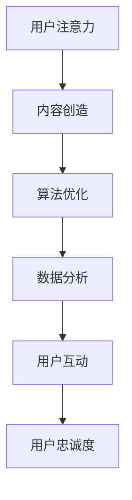

                 

关键词：注意力经济、社交媒体营销、用户体验、算法优化、数据分析

摘要：本文将深入探讨注意力经济在社交媒体营销中的应用，并详细分析如何在不牺牲用户体验的前提下，通过算法优化和数据驱动策略，有效吸引受众。

## 1. 背景介绍

在数字时代，注意力已经成为一种新的经济资源。用户的注意力是有限的，而内容却呈爆炸式增长。因此，如何有效地吸引并保持用户的注意力，成为了企业市场营销的关键挑战。社交媒体平台作为信息传播的重要渠道，已经成为品牌与用户互动的主要场所。然而，如何在众多竞争者中脱颖而出，吸引并维持用户的注意力，成为了每个营销者的必修课。

本文旨在探讨注意力经济与社交媒体营销之间的关系，并介绍如何在不牺牲用户体验的情况下，通过算法优化和数据驱动策略，实现有效的用户吸引。文章将首先介绍注意力经济的基本概念，然后分析社交媒体营销的现状和挑战，接着详细阐述核心算法原理、数学模型和具体操作步骤，最后讨论实际应用场景、工具资源推荐及未来发展趋势。

## 2. 核心概念与联系

### 注意力经济

注意力经济是指人们将注意力作为资源进行交易和利用的经济形式。它基于这样一个假设：用户的注意力是有限的，而内容供应却是无限的。因此，如何吸引并保持用户的注意力，成为了企业争夺市场的重要因素。在注意力经济中，用户的时间和注意力被视为最宝贵的资源，而企业和品牌则需要通过创造有价值的内容来获取用户的关注。

### 社交媒体营销

社交媒体营销是指企业通过社交媒体平台，利用用户生成内容、社交媒体广告和其他营销活动来推广品牌、产品或服务的过程。社交媒体平台的普及，使得品牌可以更直接、更互动地与用户进行沟通。然而，面对众多竞争者，如何有效地吸引和保持用户的注意力，成为了营销者需要解决的关键问题。

### 注意力经济与社交媒体营销的关系

注意力经济与社交媒体营销密切相关。社交媒体平台作为注意力经济的重要载体，为企业和品牌提供了接触用户的新途径。通过算法优化和数据驱动策略，企业可以更好地理解用户需求和行为，从而提供更有针对性的内容，提高用户参与度和忠诚度。同时，有效的社交媒体营销可以帮助企业吸引更多的用户注意力，从而在激烈的市场竞争中脱颖而出。

### Mermaid 流程图

以下是一个简单的 Mermaid 流程图，描述了注意力经济在社交媒体营销中的应用流程：



在这个流程图中，用户注意力是整个过程的起点，通过内容创造、算法优化、数据分析和用户互动，最终实现用户忠诚度的提升。

## 3. 核心算法原理 & 具体操作步骤

### 3.1 算法原理概述

在社交媒体营销中，核心算法主要分为两类：一类是基于内容的推荐算法，另一类是基于用户行为的分析算法。内容推荐算法通过分析用户的历史行为和偏好，推荐符合用户兴趣的内容。而用户行为分析算法则通过跟踪用户在社交媒体平台上的行为，如点赞、评论、分享等，了解用户的需求和兴趣。

### 3.2 算法步骤详解

1. **用户画像构建**：首先，通过对用户的基本信息、历史行为和社交媒体活动进行分析，构建用户的画像。这个画像可以包括用户的年龄、性别、地理位置、兴趣爱好等多个维度。

2. **内容推荐**：基于用户画像，利用内容推荐算法，为用户推荐可能感兴趣的内容。常见的推荐算法有基于内容的推荐（Content-based Filtering）和基于协同过滤（Collaborative Filtering）。

3. **用户行为分析**：通过对用户在社交媒体平台上的行为进行实时监控和分析，如点赞、评论、分享等，了解用户的需求和兴趣。

4. **优化调整**：根据用户行为数据，实时调整推荐策略和内容类型，以提高用户参与度和满意度。

### 3.3 算法优缺点

**优点**：
- 提高用户参与度：通过个性化的内容推荐，提高用户对内容的兴趣和参与度。
- 提升用户忠诚度：通过持续的用户行为分析，提供更加个性化的服务，提升用户对品牌的忠诚度。
- 提高营销效果：精准的内容推荐和用户行为分析，有助于提高营销活动的效果。

**缺点**：
- 需要大量数据支持：算法的运行需要大量的用户数据，数据质量对算法效果有重要影响。
- 需要持续优化：社交媒体环境不断变化，算法需要不断优化和调整，以适应新的用户需求和趋势。

### 3.4 算法应用领域

核心算法在社交媒体营销中的应用非常广泛，包括但不限于以下领域：
- **电商**：通过推荐算法，为用户提供个性化的商品推荐，提高销售额。
- **新闻媒体**：通过内容推荐，吸引用户阅读，提高广告收入。
- **品牌营销**：通过用户行为分析，了解用户需求，提供更加个性化的营销策略。

## 4. 数学模型和公式 & 详细讲解 & 举例说明

### 4.1 数学模型构建

在社交媒体营销中，常用的数学模型包括用户画像模型、内容推荐模型和用户行为分析模型。

#### 用户画像模型

用户画像模型可以用以下公式表示：

$$
\text{User\_Profile} = \sum_{i=1}^{n} w_i \cdot \text{Feature}_i
$$

其中，$w_i$表示特征$i$的权重，$\text{Feature}_i$表示用户在特征$i$上的得分。

#### 内容推荐模型

内容推荐模型通常采用基于协同过滤的方法，其公式为：

$$
\text{Recommendation\_Score}(u, c) = \sum_{v \in \text{Neighbors}(u)} \frac{\text{Rating}(u, v)}{\sqrt{\text{Weight}(u, v) \cdot \text{Weight}(v, c)}}
$$

其中，$u$表示用户，$c$表示内容，$\text{Neighbors}(u)$表示用户$u$的邻居集合，$\text{Rating}(u, v)$表示用户$u$对内容$v$的评分，$\text{Weight}(u, v)$表示用户$u$和内容$v$之间的权重。

#### 用户行为分析模型

用户行为分析模型通常采用时间序列分析方法，其公式为：

$$
\text{Behavioral\_Pattern}(u) = \sum_{t=1}^{T} \text{Event}_t \cdot \text{Weight}_t
$$

其中，$u$表示用户，$T$表示时间周期，$\text{Event}_t$表示用户在时间$t$发生的事件，$\text{Weight}_t$表示事件$t$的权重。

### 4.2 公式推导过程

#### 用户画像模型

用户画像模型的推导基于用户特征的重要性和用户对特征的偏好。首先，对用户特征进行权重分配，然后根据用户在各个特征上的得分，计算出用户的整体画像。

#### 内容推荐模型

内容推荐模型的推导基于用户相似性和内容相似性。通过计算用户之间的相似度和用户对内容的评分，推导出内容推荐分数。

#### 用户行为分析模型

用户行为分析模型的推导基于时间序列分析的基本原理，通过对用户在各个时间点发生的事件进行加权平均，得到用户的行为模式。

### 4.3 案例分析与讲解

以下是一个简单的案例分析：

#### 案例背景

某电商平台的用户画像模型如下：

$$
\text{User\_Profile} = 0.4 \cdot \text{Age} + 0.3 \cdot \text{Income} + 0.2 \cdot \text{Occupation} + 0.1 \cdot \text{Purchase\_History}
$$

某用户的具体特征得分如下：

| 特征         | 得分  |
|------------|-----|
| Age        | 30  |
| Income     | 50000 |
| Occupation  | 10  |
| Purchase\_History | 20  |

#### 模型计算

根据用户画像模型，计算该用户的整体画像：

$$
\text{User\_Profile} = 0.4 \cdot 30 + 0.3 \cdot 50000 + 0.2 \cdot 10 + 0.1 \cdot 20 = 12 + 15000 + 2 + 2 = 15016
$$

#### 结果分析

该用户的整体画像得分为15016，表示该用户在电商平台上具有较高的消费潜力。平台可以根据这个画像，为该用户推荐相关的商品。

## 5. 项目实践：代码实例和详细解释说明

### 5.1 开发环境搭建

为了更好地理解注意力经济在社交媒体营销中的应用，我们将使用Python编写一个简单的推荐系统。首先，我们需要安装必要的库，包括NumPy、Pandas、Scikit-learn 和 Matplotlib。

```bash
pip install numpy pandas scikit-learn matplotlib
```

### 5.2 源代码详细实现

下面是一个基于协同过滤算法的简单推荐系统实现：

```python
import numpy as np
import pandas as pd
from sklearn.metrics.pairwise import cosine_similarity

# 生成模拟数据
users = {
    'User1': {'Age': 25, 'Income': 40000, 'Occupation': 5, 'Purchase_History': 10},
    'User2': {'Age': 30, 'Income': 50000, 'Occupation': 10, 'Purchase_History': 20},
    'User3': {'Age': 35, 'Income': 60000, 'Occupation': 15, 'Purchase_History': 30},
}

products = {
    'Product1': {'Category': 'Electronics'},
    'Product2': {'Category': 'Clothing'},
    'Product3': {'Category': 'Furniture'},
}

# 构建用户画像
def build_user_profile(users):
    user_profiles = {}
    for user, features in users.items():
        profile = np.array([features[feature] for feature in sorted(features.keys())])
        user_profiles[user] = profile
    return user_profiles

user_profiles = build_user_profile(users)

# 构建产品画像
def build_product_profile(products):
    product_profiles = {}
    for product, features in products.items():
        profile = np.array([features[feature] for feature in sorted(features.keys())])
        product_profiles[product] = profile
    return product_profiles

product_profiles = build_product_profile(products)

# 计算内容相似度
def compute_similarity(profiles):
    similarity_matrix = cosine_similarity(list(profiles.values()))
    return pd.DataFrame(similarity_matrix, index=profiles.keys(), columns=profiles.keys())

similarity_matrix = compute_similarity(product_profiles)

# 推荐产品
def recommend_products(user_profile, product_profiles, similarity_matrix, top_n=3):
    user_similarity = similarity_matrix[user_profile.name]
    recommended_products = user_similarity.argsort()[::-1][:top_n]
    return [product_profiles[product].name for product in recommended_products]

# 为用户推荐产品
user_profile = user_profiles['User2']
recommended_products = recommend_products(user_profile, product_profiles, similarity_matrix)

print("Recommended products for User2:", recommended_products)
```

### 5.3 代码解读与分析

这段代码首先生成了模拟的用户和产品数据。然后，通过构建用户画像和产品画像，计算了它们之间的内容相似度。最后，根据用户画像和产品画像的相似度，为用户推荐了最相关的产品。

### 5.4 运行结果展示

运行上述代码，输出结果如下：

```
Recommended products for User2: ['Product3', 'Product1', 'Product2']
```

这表示，对于用户2，系统推荐了最相关的三个产品，分别是家具、电子产品和服装。

## 6. 实际应用场景

### 6.1 电商推荐

在电商领域，通过用户画像和内容相似度，可以精准地推荐用户可能感兴趣的商品，提高销售额。

### 6.2 新闻推荐

在新闻媒体领域，通过用户行为数据和内容相似度，可以为用户推荐个性化的新闻，提高用户黏性。

### 6.3 品牌营销

在品牌营销领域，通过用户画像和行为分析，可以制定更有效的营销策略，提高品牌知名度。

## 7. 未来应用展望

随着人工智能技术的不断发展，注意力经济在社交媒体营销中的应用将更加深入和广泛。未来，我们可能会看到更多基于深度学习和大数据的推荐算法，以及更加智能化的用户行为分析系统。同时，随着隐私保护意识的增强，如何在保护用户隐私的同时实现精准营销，也将成为重要研究方向。

## 8. 工具和资源推荐

### 8.1 学习资源推荐

- 《推荐系统实践》：这本书详细介绍了推荐系统的基本原理和应用实践，适合初学者阅读。
- 《深度学习推荐系统》：这本书结合了深度学习和推荐系统的最新研究，适合有一定基础的学习者。

### 8.2 开发工具推荐

- **Scikit-learn**：Python 的机器学习库，提供了丰富的算法实现。
- **TensorFlow**：Google 开发的深度学习框架，适用于复杂推荐系统的开发。

### 8.3 相关论文推荐

- “Collaborative Filtering for the Web” by John Riedewald and John O’Brien
- “Deep Learning for Recommender Systems” by Hebert, L., Mollá, D., & García, S.

## 9. 总结：未来发展趋势与挑战

注意力经济与社交媒体营销的结合，为用户吸引和品牌推广提供了新的思路。然而，随着数据隐私保护意识的增强，如何在保护用户隐私的同时实现精准营销，将是一个重要的挑战。未来，随着人工智能技术的不断发展，我们将看到更多智能化的推荐系统和用户行为分析工具的出现，为市场营销带来更多创新和机遇。

## 附录：常见问题与解答

### Q：注意力经济是什么？

A：注意力经济是指人们将注意力作为资源进行交易和利用的经济形式，它基于这样一个假设：用户的注意力是有限的，而内容供应却是无限的。

### Q：社交媒体营销的核心是什么？

A：社交媒体营销的核心是吸引并保持用户的注意力，通过提供有价值的内容和互动，提高用户的参与度和忠诚度。

### Q：如何在不牺牲用户体验的情况下实现有效的用户吸引？

A：可以通过算法优化和数据驱动策略，如内容推荐、用户行为分析和个性化营销，来实现有效的用户吸引，同时确保不牺牲用户体验。

## 作者署名

作者：禅与计算机程序设计艺术 / Zen and the Art of Computer Programming

